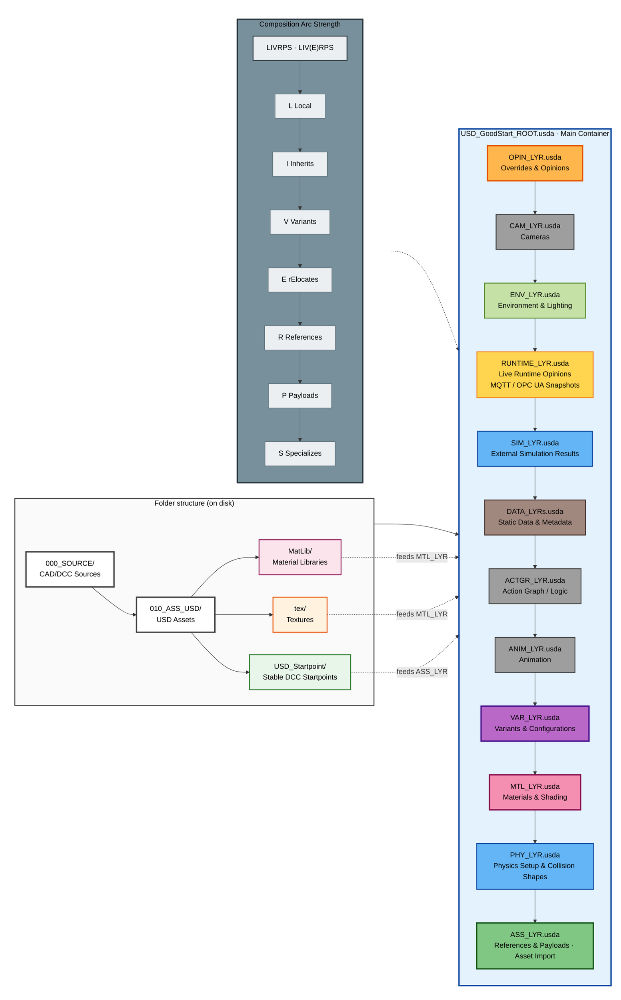

# USD GoodStart

> **Enjoy the GoodStart — and reach out if you want help shipping faster.**  

> I hope you enjoy the GoodStart I’m providing here. If you’re short on time (or want an experienced second brain), I’m available for consulting on **OpenUSD / Omniverse workflows**, **composition & layering strategy**, **CAD→USD pipelines**, **validation/CI**, and **digital-twin metadata** integration architectures.

> **Contact:** DM me on [LinkedIn](https://www.linkedin.com/in/jan-haluszka-tangible-digital-twins/) , visit [haluszka.com](https://www.haluszka.com), or email **jh@haluszka.com**.  , I have a proven trackrecord of finding solutions in uncharted territorry, so let's invent solutions together with OpenUSD and I wish you a good start!!!


**Version:** 0.9.5.1 (GoodStart project scaffolding; see `scripts/VERSION` for setup script version)  
**Last Updated:** 29.01.2026
> **What is missing:** USD GoodStart will be updated with the framework from [Learn OpenUSD](https://docs.nvidia.com/learn-openusd/latest/index.html) (NVIDIA) and [Awesome OpenUSD](https://github.com/matiascodesal/awesome-openusd), and will become OpenUSDGoodstart… In the meantime, deeper content has been gathered in the local guide [`OpenUSD_Best_Practices_Guide (17).md`](WIP_Docs/OpenUSD_Best_Practices_Guide%20(17).md). See also the curated link list in [`LAYER_ORDER_REFERENCES_RESEARCH.md`](WIP_Docs/LAYER_ORDER_REFERENCES_RESEARCH.md#openusd-learning--ecosystem-resources).
**Tag block:**
#framework_integration #openusd #omniverse #composition #pipeline #validation #aas_integration #architecture #conversion #workflow_automation #best_practices #usd_core #hybrid #digital_twin #digital_twin_creation #semantic_governance #layers #mcp_protocol #ai_coding_agents #quality_assurance

> **Research for the AOUSD IEDT IG:** A comparative analysis of three OpenUSD asset structuring approaches — ASWF collectiveproject001, NVIDIA Learn OpenUSD principles, and USD GoodStart — was conducted for the [Alliance for OpenUSD](https://aousd.org/) Industrial & Engineering Digital Twin Interest Group. The study identifies convergences, divergences, and an evolution plan for GoodStart. See the full discovery: [`ASWF_Asset_Group_Minimal_Production_Workflow_DISCOVERY.md`](WIP_Docs/ASWF_Asset_Group_Minimal_Production_Workflow_DISCOVERY.md).

## Roadmap / Upcoming (keep an eye on these)
These are **planned / in-progress ecosystem projects** that will likely feed back into this GoodStart as patterns, scripts, or optional tooling.

- **Visual USD Pipelining System (in research)**: I'm working on a visual/node-based pipelining system for OpenUSD workflows. No release date yet — will use samples from the OpenUSD study groups to test and refine the approach.

- **USD code “agent tooling” / MCP direction**
  - **USDcodeNIM MCP** (exists): `USDcodeNIM_MCP` (USD code validation/generation helpers via NIM).
  - **Omniverse MCP server (planned)**: a dedicated Omniverse/USD workflow MCP aimed at making IDE assistants more reliable for Kit/Omniverse + project patterns (time/funding dependent).

- **Identifier separation alignment (new)**: Adopt AOUSD direction that keeps namespace paths for composition and treats external/source identifiers as separate integration metadata.
  - GoodStart implementation section: [Identifier Separation Implications for GoodStart (AOUSD Direction)](WIP_Docs/OpenUSD_Best_Practices_Guide%20(17).md#identifier-separation-implications-for-goodstart-aousd-direction)
  - Proposal PR: [Separation of Concerns for Identifiers in USD (PR #105)](https://github.com/PixarAnimationStudios/OpenUSD-proposals/pull/105)
  - Proposal source text: [README (source branch)](https://raw.githubusercontent.com/asluk/OpenUSD-proposals/aluk/source-identifiers/proposals/identifier_separation_of_concerns/README.md)

**Pretex (why the hell..)**
Dear fellow lerner: Here is a clean, organized USD project template for getting started working with Composition Arcs in OpenUSD. It has a focus on **digital twin applications + Omnniverse**, but the 'GoodStart' I provide here, is also applicable for other purposes...

If you are in a hurry, just read the TLDR section..., it will get you up and running  ;) , this Read me provides a decent overview..., the 

In this 'Readme' I try to sum up my learnings from Sep2024 till now, strugeling to find a good path into OpenUSD.
I also have tutorials at **[haluszka.com/#tutorials](https://haluszka.com/#tutorials)**.
More great resources: **[Awesome OpenUSD](https://github.com/matiascodesal/awesome-openusd)** (Matias Codesal) · **[OpenUSD in One Weekend](https://learn-usd.github.io/)** (Linfan Zhang, Andy Green, Yizhou Zhao) · full curated list in [`LAYER_ORDER_REFERENCES_RESEARCH.md`](WIP_Docs/LAYER_ORDER_REFERENCES_RESEARCH.md#openusd-learning--ecosystem-resources)

My Entrypoint is Omniverse - as it is build around OpenUSD - and other tools are catching up. Learning the beauty of Composition Arcs in OpenUSD has been hard, since the online Learning paths provided by NVIDIA, PIXAR and others come from the Pipelining heritage of OpenUSD and tend to Focus on the Programmatic side of things. And even though, Cursor, with strong Context engineering + MCPs, has become a good friend and has changed my approach on 3D entirely, I have an artist and Design Background and we are used to just start!!

Hence I am providing a path into OpenUSD that suits the 3D artist | TechArtist | CAD moddeler | non programmer better, by providing a straight forward minimal Project Setup, and some more insights in this Readme.

So here is a **'GoodStart'** if you disagree or want to make it better, drop me a line JH@haluszka.com, subject: 'USD GoodStart'.
THX in advance for the Feedback!>

P.s.The supercool feature of OpenUSD is the ability to interact on the code level <br> **->** **I strongly suggest to get going with an IDE!** **<-** <br> I use Cursor, I would not consider myself a programmer (vibecoding only...), but I made this MCP for NVIDIA's USDCodeNIM: https://github.com/jph2/USDcodeNIM_MCP, so plug it in to get better code.

> **⚠️ Beta Status:** This is an early-stage beta project and has not been fully hardened yet. Please use with caution and at your own risk! 
There are bits and pieces about the workflows suggested, that I have not tested enough to be confident about them..., therefore treat this as suggestions, trying to merge workflows we see in 'traditional' CGI / VFX Pipeline, with Omniverse DigitalTwin workflows. You are sort of watching me learning ;) 

### Layer order — WIP reference & discussion base

> The **`subLayers` stack** used in this template is **one proposed GoodStart approach** — work in progress and **actively under discussion**, not a finished OpenUSD standard.
>
> **[`WIP_Docs/LAYER_ORDER_REFERENCES_RESEARCH.md`](WIP_Docs/LAYER_ORDER_REFERENCES_RESEARCH.md)** collects published layer-order conventions (ASWF, SideFX, Pixar, Omniverse, M&E pipeline practice), compares them to this stack (including recent AOUSD Slack discussion with Michael O'Brien), and records trade-offs with diagrams. Use it as a **base for evaluating alternatives** and for a more informed pipeline conversation — including whether GoodStart’s layer order should change.
>
> **Broader OpenUSD learning:** The same document includes a curated link list ([OpenUSD Learning & Ecosystem Resources](WIP_Docs/LAYER_ORDER_REFERENCES_RESEARCH.md#openusd-learning--ecosystem-resources)) — Learn OpenUSD, [OpenUSD in One Weekend](https://learn-usd.github.io/), [Awesome OpenUSD](https://github.com/matiascodesal/awesome-openusd), AOUSD, Omniverse docs, and more.

## TLDR (Too Long; Didn't Read)

**What is this?** A USD project template adapted from VFX industry best practices for **digital twin applications**, with organized folder structure and validation scripts. ... lazy? → [go here](#laziness-is-what-got-us-here)

<a href="https://www.youtube.com/watch?v=FpI3K3YxUeg" target="_blank" rel="noopener noreferrer"></a>

> **Note about the video:** The video demonstrates layer workflows using a simple setup with a material ball asset. That older setup (including the material ball) is preserved in the `History/` folder ('...\USD_GoodStart\History`), so you can access it or retrieve specific assets from previous versions if needed, further down I provide a super clean minimal structure, Rootfile + Folders + Layers for a GoodStart.

**Quick Structure** *(layer stack is WIP — see [Layer order — WIP reference & discussion base](#layer-order--wip-reference--discussion-base))*:


```mermaid
flowchart LR
    subgraph LeftColumn[" "]
        direction TB
        subgraph LIVRPSBox["Composition Arc Strength"]
            direction TB
            LIVHdr["LIVRPS · LIV(E)RPS"]
            ArcL["L Local"]
            ArcI["I Inherits"]
            ArcV["V Variants"]
            ArcE["E rElocates"]
            ArcR["R References"]
            ArcP["P Payloads"]
            ArcS["S Specializes"]
            LIVHdr --> ArcL
            ArcL --> ArcI
            ArcI --> ArcV
            ArcV --> ArcE
            ArcE --> ArcR
            ArcR --> ArcP
            ArcP --> ArcS
        end
        subgraph DiskSources["Folder structure (on disk)"]
            direction TB
            Source[000_SOURCE/<br/>CAD/DCC Sources]
            Assets[010_ASS_USD/<br/>USD Assets]
            MatLib[MatLib/<br/>Material Libraries]
            Tex[tex/<br/>Textures]
            Startpoint[USD_Startpoint/<br/>Stable DCC Startpoints]
            Source --> Assets
            Assets --> MatLib
            Assets --> Tex
            Assets --> Startpoint
        end
    end

    subgraph RootContainer["USD_GoodStart_ROOT.usda · Main Container"]
        direction TB
        Opinion[OPIN_LYR.usda<br/>Overrides & Opinions]
        Camera[CAM_LYR.usda<br/>Cameras]
        Env[ENV_LYR.usda<br/>Environment & Lighting]
        Runtime[RUNTIME_LYR.usda<br/>Live Runtime Opinions<br/>MQTT / OPC UA Snapshots]
        Sim[SIM_LYR.usda<br/>External Simulation Results]
        Data[DATA_LYRs.usda<br/>Static Data & Metadata]
        Actgr[ACTGR_LYR.usda<br/>Action Graph / Logic]
        Anim[ANIM_LYR.usda<br/>Animation]
        Variant[VAR_LYR.usda<br/>Variants & Configurations]
        Material[MTL_LYR.usda<br/>Materials & Shading]
        Physics[PHY_LYR.usda<br/>Physics Setup & Collision Shapes]
        Asset[ASS_LYR.usda<br/>References & Payloads · Asset Import]
        Opinion --> Camera
        Camera --> Env
        Env --> Runtime
        Runtime --> Sim
        Sim --> Data
        Data --> Actgr
        Actgr --> Anim
        Anim --> Variant
        Variant --> Material
        Material --> Physics
        Physics --> Asset
    end

    LIVRPSBox -.-> RootContainer
    DiskSources --> RootContainer
    MatLib -.->|feeds MTL_LYR| RootContainer
    Tex -.->|feeds MTL_LYR| RootContainer
    Startpoint -.->|feeds ASS_LYR| RootContainer

    style LeftColumn fill:none,stroke:none,color:#000
    style RootContainer fill:#e3f2fd,stroke:#0d47a1,stroke-width:3px,color:#000
    style DiskSources fill:#fafafa,stroke:#424242,stroke-width:2px,color:#000
    style LIVRPSBox fill:#78909c,stroke:#263238,stroke-width:3px,color:#000
    style LIVHdr fill:#eceff1,stroke:#263238,stroke-width:2px,color:#000
    style ArcL fill:#eceff1,stroke:#455a64,stroke-width:1px,color:#000
    style ArcI fill:#eceff1,stroke:#455a64,stroke-width:1px,color:#000
    style ArcV fill:#eceff1,stroke:#455a64,stroke-width:1px,color:#000
    style ArcE fill:#eceff1,stroke:#455a64,stroke-width:1px,color:#000
    style ArcR fill:#eceff1,stroke:#455a64,stroke-width:1px,color:#000
    style ArcP fill:#eceff1,stroke:#455a64,stroke-width:1px,color:#000
    style ArcS fill:#eceff1,stroke:#455a64,stroke-width:1px,color:#000
    style Asset fill:#81c784,stroke:#1b5e20,stroke-width:3px,color:#000
    style Opinion fill:#ffb74d,stroke:#e65100,stroke-width:3px,color:#000
    style Variant fill:#ba68c8,stroke:#4a148c,stroke-width:3px,color:#000
    style Material fill:#f48fb1,stroke:#880e4f,stroke-width:3px,color:#000
    style Sim fill:#64b5f6,stroke:#0d47a1,stroke-width:2px,color:#000
    style Runtime fill:#ffd54f,stroke:#f57f17,stroke-width:2px,color:#000
    style Data fill:#a1887f,stroke:#3e2723,stroke-width:2px,color:#000
    style Env fill:#c5e1a5,stroke:#558b2f,stroke-width:2px,color:#000
    style Actgr fill:#9e9e9e,stroke:#424242,stroke-width:2px,color:#000
    style Anim fill:#9e9e9e,stroke:#424242,stroke-width:2px,color:#000
    style Camera fill:#9e9e9e,stroke:#424242,stroke-width:2px,color:#000
    style Physics fill:#64b5f6,stroke:#0d47a1,stroke-width:2px,color:#000
    style Source fill:#ffffff,stroke:#424242,stroke-width:3px,color:#000
    style Assets fill:#ffffff,stroke:#424242,stroke-width:3px,color:#000
    style Startpoint fill:#e8f5e9,stroke:#2e7d32,stroke-width:2px,color:#000
    style MatLib fill:#fce4ec,stroke:#880e4f,stroke-width:2px,color:#000
    style Tex fill:#fff3e0,stroke:#e65100,stroke-width:2px,color:#000
```

**Material & Texture Flow:**
- **Material Libraries (`MatLib/`)** → Referenced by **`MTL_LYR.usda`** (Material Layer)
- **Textures (`tex/`)** → Referenced by materials in **`MTL_LYR.usda`** when creating new materials
- When creating new materials, place material definitions in `MatLib/` and reference textures from `tex/` - both are composed into the Material Layer

**Folder Organization:**
- `000_SOURCE/` - Original CAD/DCC/2D Texture source files
- `010_ASS_USD/USD_Startpoint/` - **Stable geometry startpoints** (exports from CAD/DCC tools - Blender/Rhino plugins)
- `010_ASS_USD/MatLib/` - Material libraries (reusable materials)
- `010_ASS_USD/tex/` - Textures (global and asset-specific)
- `010_ASS_USD/Envs/` - Environment library; contains a dummy `Environment.usda` stage as a placeholder, assuming that different environments will be created and loaded/used separately. `ENV_LYR.usda` is responsible for wiring an environment from here into the layer stack.
- `020_BASE_LYR/` - **Base layers** (opinion, environment, asset import, material import, variants, action-graph, animation)
- `030_SIM_LYR/` - Simulation result layers (external sim overlays: CFD, FEA, Isaac Sim, Ansys)
- `035_RUNTIME_LYR/` - **Runtime layer slot** for live/session-backed digital twin state, MQTT/OPC UA latest-value opinions, and explicit snapshots
- `040_DATA_LYRs/` - **Static data layers** (plural - multiple data layers for digital twin integration: PLM/ERP/AAS/OPC UA metadata and external-system references)

**Why This Structure?**

This structure was designed with **clarity, purpose, and scalability** in mind:

1. **`USD_Startpoint/`** - Named "startpoint" because this is where USD assets begin in the pipeline. DCC tools (Blender, Rhino) export to these **stable, unchanging paths**. The name stays constant even as assets are updated, making it a reliable reference point for your USD scene.

2. **`MatLib/`** - Materials are separated from geometry, allowing **reusable material libraries** that can be shared across multiple assets and projects.

3. **`tex/`** - Textures moved into `010_ASS_USD/` since they're **asset-related content**, keeping all asset data together.

4. **`020_BASE_LYR/`** - **Consolidates base layers** (opinion, asset import, material import, variant, action, animation) into one logical group, making the structure cleaner and easier to navigate.

5. **`035_RUNTIME_LYR/`** - A dedicated runtime/session boundary for live digital twin state. Use it for explicit runtime opinions and snapshots; keep high-frequency MQTT/OPC UA streams in the runtime system or session layer by default.

6. **`040_DATA_LYRs/`** - **Plural naming** reflects that there will be **multiple static or slow-changing data layers** for digital twin integration (PLM, ERP, AAS, OPC UA mappings, CAD/Revit metadata, identifiers, external references). This is where stable data contracts connect to the 3D USD data.

7. **Root file always `USD_GoodStart_ROOT.usda`** - The root file name stays constant. Only the default prim name changes based on your project needs, ensuring consistent file references across projects.

**📖 Folder Documentation:** Each folder contains its own `README.md` with detailed information on **how to use it** and **why to use it this way**. Check the folder-specific READMEs for:
- Purpose and workflow details
- Best practices and conventions
- Examples and use cases
- Integration with other folders

**📋 File Naming Conventions (GoodStart Standard):**

**File Type Suffixes:**
- **`_LYR.usda`** → Layer files (USD composition layers)
- **`_GEO.usda/.usd`** → Geometry asset files
- **`_MAT.usda`** → Material asset files

**Naming Patterns:**
- **Import layers**: `*_import_LYR.usda` (e.g., `Ass_import_LYR.usda`, `Mtl_import_LYR.usda`)
- **Opinion layers**: `*_[identifier]_Opinion_LYR.usda` (e.g., `abc_Opinion_LYR.usda`, `xyz_Opinion_LYR.usda`)
- **Asset files**: `*_[TYPE].usda` (e.g., `0_CUBE_GEO.usda`, `MatLib_a_MAT.usda`)
- **Variant layers**: `*_VAR_LYR.usda` (e.g., `VAR_LYR.usda`)
- **Simulation layers**: `*_[type]_SIM_LYR.usda` (e.g., `sample_SIM_LYR.usda`)
- **Runtime layers**: `*_RUNTIME_LYR.usda` (e.g., `RUNTIME_LYR.usda`)

**Benefits:**
- **Type identification**: Suffixes immediately show file purpose (`_LYR`, `_GEO`, `_MAT`)
- **Logical grouping**: Import functions grouped with `_import_`
- **Alphabetical sorting**: Opinion files sort properly (`abc_Opinion_LYR.usda` before `xyz_Opinion_LYR.usda`)
- **Consistency**: Standardized abbreviations (`Ass_` for Asset, `Mtl_` for Material, `Var_` for Variant)

**Individual Asset Structure** (Reference/Payload Pattern):
```
Asset_Root_File.usda (Interface - Lightweight)
├── Lofted Variant Sets (accessible without loading payload)
├── Lofted Primvars (material controls)
└── Payload Arc ───> Payload_File.usdc (Heavy Geometry)
```

**Why this pattern?** Separates lightweight "interface" from heavy "implementation". Users can see variant options, change materials, and get bounding boxes **without loading heavy geometry** (instant, fast, responsive).

**Layer Stack Order (GoodStart_ROOT.usda)**  
Array ordering: first = strongest, last = weakest:

> **Further reading:** Full comparison tables, source links, and per-approach Mermaid diagrams — [WIP_Docs/LAYER_ORDER_REFERENCES_RESEARCH.md](WIP_Docs/LAYER_ORDER_REFERENCES_RESEARCH.md) (also linked [above](#layer-order--wip-reference--discussion-base)).

1. **OPIN_LYR.usda** – Overrides & opinions (strongest)
2. **CAM_LYR.usda** – Cameras
3. **ENV_LYR.usda** – Environment, ground, lighting, render defaults
4. **RUNTIME_LYR.usda** – Live/session-backed runtime opinions and explicit MQTT/OPC UA snapshots
5. **SIM_LYR.usda** – External simulation results & overlays (Ansys, Isaac Sim, CFD, FEA)
6. **DATA_LYRs.usda** – Static and slow-changing data & metadata (PLM/ERP/AAS/OPC UA mappings, CAD/Revit metadata, identifiers)
7. **ACTGR_LYR.usda** – Action graph / behavior logic
8. **ANIM_LYR.usda** – Animation
9. **VAR_LYR.usda** – Variants & configurations
10. **MTL_LYR.usda** – Materials & shading work
11. **PHY_LYR.usda** – Physics setup (collision shapes, rigid body flags, mass properties)
12. **ASS_LYR.usda** – References & payloads, asset imports (weakest)

### Working with Session Layers

**Session layers** are in-memory, anonymous layers in OpenUSD that provide a powerful workflow for authoring and collaborative editing. Understanding and using session layers effectively is a key best practice for maintaining clean, organized USD projects.

#### What Are Session Layers?

Session layers are **temporary, in-memory containers** for scene description that exist separately from persistent file-based layers. They are created using `SdfLayer.CreateInMemory()` and can be managed through the `UsdStage` API. Unlike persistent layers, session layers:

- **Exist only in memory** - No disk I/O during active editing
- **Are per-session** - Each user/application session has its own session layer
- **Compose on top** - Session layers have the highest composition strength (stronger than Local)
- **Can be saved separately** - Use `UsdStage.SaveSessionLayers()` to persist changes when ready

#### Why Use Session Layers?

**1. Performance Benefits**
- **In-memory operations** - All edits happen in RAM, avoiding disk I/O overhead
- **Faster iteration** - No file system writes during active editing sessions
- **Reduced latency** - Immediate feedback when making changes

**2. Collaborative Workflow Benefits**
- **Per-user isolation** - Each team member works in their own session layer without conflicts
- **No file locking** - Multiple users can work on the same stage simultaneously
- **Clean separation** - Session changes don't affect persistent layers until explicitly saved
- **Conflict prevention** - Avoids merge conflicts and accidental overwrites

**3. Organizational Benefits**
- **Scratch space** - Use session layer as a temporary workspace for experimentation
- **Clean promotion** - Work in session layer, then move stable changes to appropriate persistent layers
- **Layer organization** - Prevents "leakage" of changes into wrong layers (e.g., variant changes ending up in material layers)

#### Best Practice Workflow

**Recommended approach:**
1. **Work in the session layer** - Make all your edits in the session layer first
2. **Iterate and refine** - Test changes, experiment, and refine your work
3. **Promote to persistent layers** - Once stable, move changes to the appropriate layer:
   - Variants → `VAR_LYR.usda`
   - Materials → `MTL_LYR.usda`
   - Assets → `ASS_LYR.usda`
   - Overrides → `OPIN_LYR.usda`
   - And so on...

This workflow results in **less mess** than authoring directly into many layers from the start. It also helps maintain clean layer organization and prevents accidental edits in the wrong layer.

**Technical Note:** The session layer has the **strongest composition strength** in USD's LIV(E)RPS system (Local > Inherits > Variants > (r)Elocates > References > Payloads > Specializes). This means session layer edits will override all other layers, making it perfect for temporary overrides and testing.

**Official Documentation:**
- **OpenUSD API Reference:** [UsdStage Session Layers](https://openusd.org/release/api/class_usd_stage.html) - Official Pixar/OpenUSD documentation on `SaveSessionLayers()` and session layer management
- **NVIDIA Omniverse Layers Extension:** [Layers Extension Documentation](https://docs.omniverse.nvidia.com/extensions/latest/ext_core/ext_layers.html) - Omniverse's implementation of session layers and live editing workflows
- **Omniverse Layer APIs:** [omni.kit.usd.layers](https://docs.omniverse.nvidia.com/kit/docs/omni.kit.usd.layers/latest/omni.kit.usd.layers.html) - Python APIs for layer operations including session layer management

**See also:** [VarianSets_In_SessionLyr_RESEARCH](WIP_Docs/VarianSets_In_SessionLyr_RESEARCH.md) for detailed research on variant sets in session layers. [VarianSets_In_SessionLyr_RESEARCH](WIP_Docs/VarianSets_In_SessionLyr_RESEARCH.md)), so variant changes don’t “leak” into material/asset layers.

**Note:** The `subLayers` array is ordered from strongest (first) to weakest (last). First in array = strongest (applied last, overrides others). Last in array = weakest (applied first, can be overridden). See [Composition Strength: LIV(E)RPS](#composition-strength-liverps) for details on how composition strength works.

**Quick Workflow:**
1. Convert CAD → USD assets → place in `010_ASS_USD/USD_Startpoint/` (stable startpoint paths)
2. Create layer files in `020_BASE_LYR/` for base layers (opinion, environment, asset import, material import, variants, action-graph, animation), `035_RUNTIME_LYR/` for runtime opinions/snapshots, `030_SIM_LYR/` for simulation results, and `040_DATA_LYRs/` for static data/metadata.
3. Reference layers in `USD_GoodStart_ROOT.usda` (array order: Opinion → Camera → Environment → Runtime → Simulation → Static Data → ACTGR → Animation → Variant → Material → Physics → AssetImport, where first = strongest)
4. Use **relative paths** (`@./folder/file.usd@`) for portability
5. Validate with `python scripts/validate_asset.py` (for individual assets) or `python scripts/validate_scene.py` (for entire scenes)

**Key Best Practices:**
- ✅ Use **relative paths** (never absolute paths)
- ✅ **Keep layer structure simple** - Only use layers you actually need. Don't overcomplicate.
- ✅ Don't import assets in root layer - use `Ass_import_LYR` at bottom and Reference / Payload the assets there. (ignoring this caused me heavy headaches and has been v)
- ✅ **Lock layers you're not working on** to prevent accidental edits on the wrong layer
- ✅ Use **custom attributes** for queryable metadata (PLM IDs, status)
- ✅ Use **customData dictionary** for static documentation metadata
- ⚠️ **Start simple, add complexity only when needed** - OpenUSD can do amazing things, but the abyss is deep. Use only what you need. But it is good to have a basic structure or a best practsise - how you personally or in a Team- want to structure your work.
- ⚠️ Blender/Cinema 4D = endpoint only (destructive editing, no layering)
- ✅ Maya/Houdini/3ds Max = full USD composition support

### Omniverse Layer Metadata Pattern (GoodStart Standard)

All root and base layers in USD_GoodStart follow an Omniverse-style header pattern so the project behaves “natively” in Omniverse Kit:

- **`customLayerData.cameraSettings`** – Per-layer default cameras (`Front`, `Perspective`, `Right`, `Top`) with consistent clipping ranges and positions.
- **`customLayerData.omni_layer`** – Omniverse-specific layer metadata:
  - `authoring_layer` – Points at `./020_BASE_LYR/ASS_LYR.usda` in the root (or `./GoodStart_ROOT.usda` inside base layers) so Omniverse knows the intended authoring target.
  - `locked` – Explicit lock state for all key layers (`020_BASE_LYR/*_LYR.usda`, `035_RUNTIME_LYR/RUNTIME_LYR.usda`, `030_SIM_LYR/SIM_LYR.usda`, `040_DATA_LYRs/DATA_LYRs.usda`, sample layers, etc.) implementing the **“Safe Mode”** convention.
  - `muteness` – Reserved for Omniverse muting state (kept empty in the template).
- **Core header invariants**:
  - `defaultPrim = "World"` (for root and base layers)
  - `upAxis = "Y"`
  - `metersPerUnit` is selected by root file: `1` for meters, `0.01` for centimeters, `0.001` for millimeters
  - `startTimeCode = 0`, `endTimeCode = 100`, `timeCodesPerSecond = 60`

The **setup script + standalone zip** generate new projects with this metadata pattern baked in, so any new GoodStart-based project opens in Omniverse with:

- A consistent camera rig
- A pre-configured, locked layer stack
- Environment + lighting coming from `ENV_LYR.usda`

### Scale and units in this setup

In this setup, **scale is chosen once** (meters, centimeters, or millimeters) and **written into the root file**. The sublayers are either empty or contain only `over` prims that inherit structure from the root; the **unit scale is defined in the root** and effectively applies across the composed stage.

The starter scene is authored so the physical size stays stable across root variants: the sample cube is 1 m, the ground is 14 m, and lights/camera guides are converted into the selected stage unit. Do not compare `xformOp:scale` alone when debugging size. Compare `metersPerUnit` plus authored point and translate values.

**Omniverse note:** In Omniverse, the **unit scale** can also be set **per layer** in the layer’s properties. It’s not fully clear what that per-file override does in all cases. In testing, **referenced objects kept the correct scale** even when:
- The scene units were changed for the stage into which a referenced asset was imported, and
- The root layer and other layers had different unit scales.

So referenced content appeared to hold scale correctly despite differing layer/scene unit settings—but be aware of the per-layer unit option when debugging scale issues.

### Session layer workflow

A good practice is to **work on the session layer for a while**, then **move content to the appropriate persistent layers** when it’s stable. That tends to result in **less mess** than authoring directly into many layers from the start. Use the session layer as a scratch area, then promote changes to the right layer (e.g. `VAR_LYR`, `OPIN_LYR`, `ASS_LYR`) once you’re happy with them. See also [VarianSets_In_SessionLyr_RESEARCH](WIP_Docs/VarianSets_In_SessionLyr_RESEARCH.md) and the “Safe Mode” section below.

## Laziness is What Got Us Here

You have three options to get started:

1. **Do everything by hand** — Create the folder structure, generate all the layer files, and manually rename the default prim across all layers to match your product name.
2. **Copy-paste from GitHub** — Simply copy the folders and files directly from this GitHub repository.
3. **Run the setup script** — Use the automated script to generate everything for you.

**Quick Setup Script:** Just run the batch file (`setup_usd_project.bat`) from the standalone zip package ([`scripts/USD_GoodStart_Setup_Standalone_v0.9.5.1.zip`](scripts/USD_GoodStart_Setup_Standalone_v0.9.5.1.zip)), and it will:
- Generate the complete folder structure
- Create all layer files with consistent default prim naming
- Set up a simplified scene with sample assets (cube, shader ball) in `USD_Startpoint/`
- Configure everything with "Safe Mode" defaults (all layers locked, session layer as active authoring layer)

The script asks you a few simple questions (default prim name, unit system, whether to include samples) and handles the rest. The root file is always named `USD_GoodStart_ROOT.usda` - only the default prim name changes based on your input.

> **Note:** The script generates a slightly simplified scene compared to the full Copy-paste from GitHub, but it follows all the same best practices and layer structure patterns described in this README.


## Quick Tip (Core Rule): “Safe Mode” — Don’t Pollute Your Layers

If you don’t want **any** accidental file edits while exploring variants/materials/etc. in Omniverse:

- **Lock all persistent layers** (everything except the session layer)
- **Set the Session Layer as the active authoring layer** (top green layer in the Layers panel)
- **Work on the session layer for a while, then move content to the right persistent layers** — you’ll end up with less mess than authoring straight into many layers.
- **...be assured that this structure will not be the structure that you or your team will be using in the end...**, your team will have to go through the classical phases of [Tuckman's Model](https://en.wikipedia.org/wiki/Tuckman%27s_stages_of_group_development): Forming | Storming | Norming | Performing ...


For the full explanation + scripting helpers, see: [VarianSets_In_SessionLyr_RESEARCH](WIP_Docs/VarianSets_In_SessionLyr_RESEARCH.md)

> **⚠️ Critical: USD Has Many "Flavors" - Tool-Specific Implementations**
> 
> **Important Reality Check:** USD is not a single, uniform format. Different tools implement USD in their own way, creating "flavors" that can cause compatibility issues. This is crucial to understand before diving into workflows.
> 
> **Examples from Real Experience:**
> - **Houdini**: Has outstanding USD integration (SideFX was an early driving force for OpenUSD adoption), but it's implemented in Houdini's own flavor. **USD files from Houdini require processing/conversion to be compliant with Omniverse's USD implementation.**
> - **VRED exports**: Completely different structure and conventions from other tools
> - **DeltaGen exports**: Again, totally different from VRED and other implementations
> - **Maya, 3ds Max, Blender**: Each has its own USD export characteristics
> 
> **What This Means for You:**
> - **When you get a new USD file**, be aware it might be structured differently from what you know
> - **You will need to learn** how that specific tool's USD export works first
> - **You may need to write scripts** to reshape USD files to work with your pipeline and workflows
> - **Don't assume** a USD file from one tool will work seamlessly with another without inspection and potentially modification
> 
> **This is normal** - USD's flexibility means different tools prioritize different features and structures. Understanding these differences and having scripts to normalize/reshape USD files is part of building a robust pipeline.
> 
> **For detailed guidance** on DCC tool limitations and USD implementation differences, see the [OpenUSD Best Practices Guide](WIP_Docs/OpenUSD_Best_Practices_Guide%20(17).md) Chapter 0.3 and 0.4.

**Note on LIV(E)RPS:** **LIV(E)RPS** (with rElocates) is the official OpenUSD specification from [Pixar](https://openusd.org/). rElocates (E) are officially part of LIV(E)RPS (position 4, between Variants and References) but are **unconfirmed in Omniverse Kit App 108.1**. When working with Omniverse, verify support or use LIVRPS order without rElocates. See `AssetStructureBestPractices.md` for details.

**For Digital Twins:** Integrates CAD metadata, PLM/PDM/ERP systems, and supports integration with digital twin standards (such as Asset Administration Shell/AAS and OPC UA frameworks) for connecting additional data. **Important:** Every company and project needs its own approach to build pipelines and connect data. Start clean and small, build up with open source, stay agile, and expect to adjust and change as everything is evolving.

**Start Small:** Begin with a POC/MVP project before scaling. This is an agile, iterative process, not waterfall.

---

## 📚 Comprehensive Documentation

For detailed technical guidance on OpenUSD workflows, digital twin implementation, and advanced features, see the **[OpenUSD Best Practices Guide](WIP_Docs/OpenUSD_Best_Practices_Guide%20(17).md)** in the `WIP_Docs/` folder.

### Implications for USD GoodStart (from AOUSD identifier proposal direction)

- Keep **prim names/paths** focused on composition and hierarchy readability.
- Treat **source identifiers** (PLM IDs, IFC IDs, OPC UA NodeIds, etc.) as separate, explicit metadata.
- Avoid using `displayName` as a source identifier carrier.
- Prepare migration paths from ad-hoc metadata toward standardized AOUSD mechanisms (likely `assetInfo` conventions and/or applied schema patterns).
- **Enhanced implementation notes** are documented in the Best Practices Guide section: [Identifier Separation Implications for GoodStart (AOUSD Direction)](WIP_Docs/OpenUSD_Best_Practices_Guide%20(17).md#identifier-separation-implications-for-goodstart-aousd-direction).

Reference links:
- [OpenUSD Proposals PR #105](https://github.com/PixarAnimationStudios/OpenUSD-proposals/pull/105)
- [Proposal source README](https://raw.githubusercontent.com/asluk/OpenUSD-proposals/aluk/source-identifiers/proposals/identifier_separation_of_concerns/README.md)

This comprehensive guide covers:
- Complete OpenUSD technical reference
- Digital twin implementation patterns
- CAD integration workflows
- Validation and CI/CD pipelines
- Industry best practices and learning resources

---

## Notes

- This is a clean starting template - customize as needed for your project
- The `0_` prefix in asset names is used for sorting default assets
- Layers are loaded in order - later layers override earlier ones
- Asset-specific textures can be stored within asset folders, while global textures go in `010_ASS_USD/tex/`

**Folder Documentation:**
Each folder contains its own README with detailed information:
- **[000_SOURCE/](000_SOURCE/README.md)** - Source files and CAD originals
- **[010_ASS_USD/](010_ASS_USD/README.md)** - USD assets (USD_Startpoint, MatLib, tex)
- **[020_BASE_LYR/](020_BASE_LYR/README.md)** - Base layers (opinion, asset import, material import, variant, action, animation)
- **[030_SIM_LYR/](030_SIM_LYR/README.md)** - Simulation & physics layers
- **[035_RUNTIME_LYR/](035_RUNTIME_LYR/README.md)** - Runtime/session-backed layer slot (MQTT/OPC UA live state and snapshots)
- **[040_DATA_LYRs/](040_DATA_LYRs/README.md)** - Static data layers (PLM/ERP/AAS/OPC UA metadata and identifiers)


---

**OpenUSD** (Universal Scene Description) was originally developed by [Pixar Animation Studios](https://openusd.org/) as a universal scene description format to be sent to renderers for visual effects and CGI production. However, its powerful composition system, non-destructive workflows, and ability to handle complex 3D data make it an ideal foundation for **digital twin applications**.

This project template adapts OpenUSD's proven VFX industry practices for digital twin use cases, including:
- Building digital twins from existing CAD products
- Integrating with PLM/PDM/ERP systems
- Connecting to digital twin standards and frameworks (such as Asset Administration Shell/AAS and OPC UA) for integrating additional data
- Managing industrial and manufacturing digital twins
- Architecture, Engineering, and Construction (AEC) applications

While OpenUSD was designed for rendering, its universal scene description capabilities make it perfect for representing real-world assets, systems, and environments in digital twin contexts.

---

## OpenUSD Asset Structure Principles

Understanding these core principles will help you use this template effectively and make informed decisions when structuring your own USD assets.

### Core Principles

A scalable USD asset structure relies on four key principles:

**1. Legibility**
- Use clear, intent-driven names (`LargeCardboardBox` not `Box01`)
- Differentiate public vs. internal elements (capitalized `Geometry` for public, `_internalRig` for private)
- Use ASCII/UTF-8 identifiers; avoid dynamic tokens like timestamps

**2. Modularity**
- Assets should be self-contained with relative paths
- Define stable entry points (root prims) that don't change even if internals do
- Structure assets to be referenced and instanced easily

**3. Performance**
- Use **References** to keep assets reusable (never copy geometry directly)
- Use **Payloads** for heavy assets (lazy-loading - only loads when needed)
- Use **Instancing** for repeated geometry (1 million screws = 1 copy + transforms, not 1 million copies)
- Prefer `.usdc` (binary) for production, `.usda` (text) for debugging

**4. Navigability**
- Use Relationships and Collections to group logical items
- Keep model hierarchies shallow and consistent

### The Reference/Payload Pattern

**Critical Pattern:** Separate the lightweight "interface" from the heavy "implementation".

```
Asset_Root_File.usda (Interface - Lightweight)
├── Lofted Variant Sets (accessible without loading payload)
├── Lofted Primvars (material controls)
└── Payload Arc ───> Payload_File.usdc (Heavy Geometry)
```

**Why this matters:**
- Users can see variant options **without loading heavy geometry** (instant)
- Viewport gets bounding boxes **without loading geometry** (fast)
- Materials can be changed **without loading geometry** (responsive)

**"Lofting"** = Moving important controls (variants, primvars, metadata) **above** the payload arc so they're accessible without loading the heavy content.

**Critical Distinction: Payload vs Sublayer**

Understanding when to use **Payloads** vs **Sublayers** is fundamental to USD architecture:

- **Sublayer**: Merges content at the *layer* level
  - Used for: Pipeline steps, workstream edits, overrides, scene-level assembly
  - Example: `subLayers = [@./Materials.usda@, @./Layout.usda@]`

- **Payload**: Composes content at the *prim* level
  - Used for: Geometry, internal hierarchies, CAD data
  - Example: `payload = @./Pump_geometry.usdc@`

**Key Point:** Sublayers merge entire layers together. Payloads attach heavy content to specific prims. This distinction is core to USD architecture.

### Composition Strength: LIV(E)RPS

**LIV(E)RPS** is the rulebook that decides which data "wins" when multiple sources conflict. The acronym stands for: **L**ocal, **I**nherits, **V**ariants, **(E)** rElocates, **R**eferences, **P**ayloads, **S**pecializes.

| Strength | Arc | What It Is |
|----------|-----|------------|
| **Strongest** | **L**ocal | Direct edits in current layer |
| | **I**nherits | Properties from classes/templates |
| | **V**ariants | Switchable options (red/blue, high/low) |
| | **(E)** rElocates | Remap prim paths (official spec, unconfirmed in Omniverse 108.1) |
| | **R**eferences | Pulling in other USD files |
| | **P**ayloads | Heavy data loaded on demand |
| **Weakest** | **S**pecializes | Weak template/base class |

**Simple Rule:** Higher in LIV(E)RPS wins. If a referenced asset sets `color=blue` but your local layer sets `color=red`, local (red) wins because **Local > Reference** in the LIV(E)RPS composition strength order.

### Root File and Layer Stacking

**Critical Concept:** The root file defines structure. Asset loading happens in the **lowest (weakest) layer**, with all modifications stacked on top.

**Root File Must Be "Thin":**
- ✅ Base scene structure (`def Xform "World"`)
- ✅ `subLayers` array
- ✅ Metadata (defaultPrim, upAxis)
- ❌ **NO** geometry, references, payloads, or attribute values

**Why?** Anything in the root layer (Local) cannot be overridden by sublayers because **Local > SubLayers** in LIV(E)RPS. Keep it thin so layers can override.

**The Root Layer Trap - Concrete Example:**

This is a common mistake that breaks USD workflows:

❌ **Wrong:** Setting a transform directly in the root file:
```usda
# In GoodStart_ROOT.usda
def Xform "RobotA" {
    double3 xformOp:translate = (10, 0, 0)  # ❌ This locks the position!
}
```

Then trying to override it in a sublayer:
```usda
# In Opinion_LYR.usda
over "RobotA" {
    double3 xformOp:translate = (0, 0, 0)  # ❌ This won't work!
}
```

**Result:** The override does **not** apply. Local > Sublayer, so the root layer wins.

✅ **Correct:** Author transforms in department layers, not the root:
```usda
# In USD_GoodStart_ROOT.usda - Only sublayers, no transforms!
(
    subLayers = [@./020_BASE_LYR/OPIN_LYR.usda@]
)

# In OPIN_LYR.usda - This is where transforms belong
over "RobotA" {
    double3 xformOp:translate = (0, 0, 0)  # ✅ This works!
}
```

**Layer Stack Order** (array ordering: first = strongest, last = weakest):
1. **OPIN_LYR.usda** (first/strongest) - Final overrides and opinions
2. **RUNTIME_LYR.usda** - Live runtime opinions and explicit telemetry snapshots
3. **SIM_LYR.usda** - Simulation and physics results
4. **DATA_LYRs.usda** - Static data and metadata (PLM/ERP/AAS/OPC UA mappings)
5. **ACTION_LYR.usda** - Actions (placeholder for future use)
6. **ANIM_LYR.usda** - Animation (placeholder for future use)
7. **VAR_LYR.usda** - Variants and configurations
8. **MTL_LYR.usda** - Materials and shading
9. **ASS_LYR.usda** (last/weakest) - **CRITICAL:** Loads assets via references/payloads

**Why AssetImport Must Be Last in Array:**
- It loads assets into the scene from stable startpoints (`010_ASS_USD/USD_Startpoint/`)
- Earlier layers (materials, variants, opinions, simulation, data) need to override what's loaded
- The `subLayers` array is ordered strongest-first: first = strongest (applied last), last = weakest (applied first)
- If AssetImport were first in the array, nothing could override the loaded assets

### Anti-Patterns to Avoid

**⛔ Inline Geometry in Root:**
- **Never** put heavy mesh data directly in the root file
- Root layer is always parsed first and cannot be unloaded
- Causes slow open times, memory lock, and merge conflicts
- **Exception:** Simple helpers (4-vertex ground plane) are OK

**⚠️ Direct References (Bypassing Payloads):**
- Using `references = @./geo.usd@` instead of `payload = @./geo.usd@`
- Forces immediate loading of heavy assets (kills viewport performance)
- **Best Practice:** Use **Payloads** for heavy assets to enable lazy loading

**📚 For Complete Details:** See [`AssetStructureBestPractices.md`](AssetStructureBestPractices.md) for comprehensive explanations, examples, and advanced patterns.

---

## Project Structure

This project follows a structured folder organization to maintain clarity and scalability:

```
USD_GoodStart/
├── 000_SOURCE/                    # Source files used in the project (CAD, DCC originals, configs)
├── 010_ASS_USD/                   # All USD assets (geometry, materials, textures)
│   ├── USD_Startpoint/            # Stable geometry startpoints (DCC exports - Blender/Rhino)
│   ├── MatLib/                    # Material libraries (reusable materials)
│   └── tex/                       # Textures (global and asset-specific)
├── 020_BASE_LYR/                  # Base layers (opinion, asset import, material import, variant, action, animation)
├── 030_SIM_LYR/                   # Simulation/physics layers (collisions, joints, sensors, etc.)
├── 035_RUNTIME_LYR/               # Runtime/session-backed layer slot (MQTT/OPC UA live state and snapshots)
├── 040_DATA_LYRs/                 # Static data layers (plural - PLM/ERP/AAS/OPC UA metadata and identifiers)
├── USD_GoodStart_ROOT.usda        # Master root file that references all layer stacks + assets
├── GoodStart.hiplc                # Houdini file (or .ma/.mb/.max for other DCC tools)
└── README.md                      # This file
```

**Important Note:** Folder numbers (020, 030, 035, 040) **do not indicate layer order**. Layer order is determined by the `subLayers` array in `USD_GoodStart_ROOT.usda`, not by folder names. The folder numbers are organizational prefixes for clarity and categorization.

---

## ⚠️ Critical Philosophy: Use Only What You Need

**OpenUSD is powerful, but complexity can become overwhelming.**

When you use OpenUSD, you're navigating between peaks on a mountain using a narrow ridge. You can achieve things that are impossible with any other 3D format, but **the abyss is a mile deep**.

This folder structure provides a **complete, ready-to-use foundation** with most possibilities defined. However, **only use what you actually need** for your project.

### Why This Matters

- **Overcomplication Risk**: If you start using all possibilities from the beginning—like adding multiple layers at the asset level when a single layer would suffice, or nesting layers within layers unnecessarily—you can easily create structures that are overcomplicated and hard to maintain.

- **Example Anti-Pattern**: Using an asset in several scenes where the asset is always the same, but then adding layers at the root level of that asset, or within the asset with other layers, when simpler approaches would work.

- **The Threshold**: You need to decide where the complexity threshold is for your project. Start simple, add complexity only when you have a clear need for it.

**Best Practice**: Begin with the minimal structure needed for your use case. Add layers, variants, and metadata layers only when you have a specific requirement that justifies the added complexity.

---

## Development Mindset & Architecture Principles

### Mindset

- **Get Started!!! But Start Structured** - Use a proven foundation like this one to begin with structure
- **Start Small** - Begin with a POC/MVP, learn incrementally, iterate
- **Work Cleanly!!! + Document Properly** - Establish workflows, standards, and documentation from the start
- **Expect Mistakes** - Learn from failures, find smart ways to fix them, build validation into your pipeline

### Architecture

- **Use Open Source** - Leverage open-source tools and contribute back when possible
- **Adapt to Existing Environment** - Integrate with existing PLM/PDM/ERP systems, respect IT infrastructure
- **Know Limitations** - Understand what OpenUSD excels at and where other tools are better
- **Make Conscious Decisions** - Evaluate trade-offs, document why you chose an approach
- **Modular Design** - Develop interchangeable modules with clear architecture
- **Separation of Concerns** - Let backend handle backend (PLM/ERP), frontend handle frontend (rendering/interaction)

### Metadata Integration

- **Check USD Schemas First** - Use standard USD schemas when possible before creating custom attributes
- **Coordinate with AOUSD** - If defining new schemas, coordinate with [Alliance for OpenUSD](https://aousd.org/)
- **Orient to Existing Standards** - Reference Catena-X, AAS, OPC UA, Digital Product Passport (DPP)
- **DPP Integration** - Europe requires DPP for many products; design metadata structure to accommodate it
- **Reference, Don't Duplicate** - Use USD metadata to reference backend data, not duplicate it

### Collaboration & “Publishable” Layers (Omniverse Digital Twin)

- **Collaborate via task fragments**: one responsibility = one layer, merged frequently (keep the *interactive* stage loadable in Omniverse).
  - **Base layers**: `020_BASE_LYR/` (opinion, asset import, material import, variant, action, animation)
  - **Simulation**: `030_SIM_LYR/` (simulation results and replayable simulation outputs)
  - **Runtime**: `035_RUNTIME_LYR/` (session-backed live state, MQTT/OPC UA opinions, explicit snapshots)
  - **Data/metadata**: `040_DATA_LYRs/` (static PLM/ERP/AAS/OPC UA mappings - plural for multiple data layers)
- **Personal opinion ≠ production**: “personal opinion” layers are great for exploration, but treat them as *draft* until reviewed.
- **Definition of Done (publishable)**:
  - Opens in Omniverse Kit without missing layers/paths
  - Validation scripts pass (`scripts/validate_asset.py`, `scripts/validate_scene.py`)
  - Layer intent is clear (no accidental edits in the wrong layer; variants/metadata/sim live where expected)

### Realtime Data: Adapters → USD Attributes

In Omniverse/Kit, realtime data is typically handled by **adapters** (extensions, ActionGraph, ROS2 bridges, services) that map incoming messages to **USD paths + attributes**, updating the live stage in the Kit event loop.

**Rule of thumb:** start with namespaced custom attributes for speed (e.g. `opcua:runtime:temperature`), promote to schemas when the data model stabilizes and multiple tools/teams need validation/UI.

**Registry template:** track your prefixes/fields in `WIP_Docs/Metadata_Schema_Registry.md`.

**📖 For detailed guidance:** See the [OpenUSD Best Practices Guide](WIP_Docs/OpenUSD_Best_Practices_Guide%20(17).md) Chapter 1.5 for project structure and organizational principles.

---

## Prerequisites

Before starting with USD GoodStart, ensure you have the following installed and configured:

### Required Software

- **Omniverse Kit/App**: 
  - Omniverse Composer (recommended version: Latest stable)
  - Omniverse Kit SDK (for extension development)
  - Download from [NVIDIA Omniverse](https://www.nvidia.com/en-us/omniverse/) https://github.com/NVIDIA-Omniverse/kit-app-template

- **Python Environment**:
  - Python 3.8+ (Python 3.10+ recommended)
  - `usd-core` package: `pip install usd-core`
  - Additional packages may be required for CAD conversion (see CAD tools section)

- **USD Tools**:
  - **USD Python API** (`usd-core` from PyPI) - Python bindings for USD
  - **[usdview](https://github.com/PixarAnimationStudios/OpenUSD)** - **The classic USD validation and inspection tool** from Pixar:
    - Original tool from [Pixar Animation Studios](https://openusd.org/)
    - Essential for validating USD files and checking structure
    - Inspect prims, attributes, relationships, and composition
    - Visualize USD scenes and debug composition issues
    - Always helpful for USD file validation and troubleshooting
    - Part of the official OpenUSD repository
  - **USD C++ SDK** (optional) - For advanced development and custom plugins

### CAD Tools (Optional, for CAD-to-USD workflows)

- **CAD Software** (one or more):
  - CATIA, SolidWorks, Autodesk Inventor, or similar
  - Rhino 3D
  - STEP file support (for intermediate conversion)

- **CAD Conversion Tools**:
  - **[NVIDIA Omniverse CAD Converter Extension](https://docs.omniverse.nvidia.com/extensions/latest/ext_cad-converter.html)** - **Recommended Production Solution**:
    - Built-in CAD converter within Omniverse Kit apps and Composer
    - Supports common CAD formats (STEP, IGES, etc.) directly to USD
    - Works from content browser with context menu option
    - Actively maintained and optimized for Omniverse workflows
    - Official documentation: [CAD Converter Manual](https://docs.omniverse.nvidia.com/extensions/latest/ext_cad-converter/manual.html)
  - **[CAD-to-OpenUSD](https://github.com/nAurava-Technologies/CAD-to-OpenUSD)** - Open-source conversion scripts (Work in Progress, November 2024)
    - Useful for custom pipeline development
    - Requires development effort for production use
  - **[NVIDIA Omniverse Connectors](https://www.nvidia.com/en-us/omniverse/connectors/)** - Production-ready connectors for:
    - Autodesk 3ds Max, Maya, Revit, Inventor
    - SolidWorks, Siemens NX, CATIA
    - Blender, Unreal Engine, Unity
    - And many more CAD/DCC tools
  - **[OpenUSD Exchange SDK](https://github.com/NVIDIA-Omniverse/usd-exchange)** - SDK for building custom USD I/O plugins and converters
    - For pipeline-specific requirements
    - Requires development using USD SDK and CAD SDKs (OpenCASCADE, FreeCAD, or commercial CAD SDKs)
  - **CAD Vendor Native Exporters**: Many CAD vendors now provide native USD export capabilities
  - **STEP Intermediate Format**: Use STEP files as a stable intermediate format for CAD conversion workflows

### DCC Tools (Optional, for content creation)

- **3D Software** (one or more):
  - Houdini (`.hiplc` files) - **Full USD support** with layering and referencing
  - Maya (`.ma`/`.mb` files) - **Full USD support** with layering and referencing
  - 3ds Max - **Full USD support** with layering and referencing
  - Blender (USD export support) - **Limited: Read/write only, no layering/referencing** (see limitations below)
  - Cinema 4D - **Limited: Read/write only, no layering/referencing** (see limitations below)

**Important: DCC Tool Limitations for USD Workflows**

Some DCC tools have **significant limitations** when working with USD:

**Blender, Cinema 4D, and Similar Tools:**
- ✅ Can **read and write** USD files (`.usd`, `.usda`, `.usdc`, `.usdz` formats)
- ❌ **Do NOT support** USD's core composition features:
  - No layering support (cannot work with sublayers)
  - No referencing support (cannot create or maintain references)
  - No composition arcs (LIV(E)RPS) support
  - No non-destructive workflows
- ⚠️ **Work destructively** - These tools modify USD files directly without preserving composition structure
- 📍 **Use case**: Can only be used to create **"endpoint" assets** (the lowest sublayer - the asset itself)
- ❌ **Cannot be used** for modifying layers on top of assets or working with USD's composition system

**Why This Matters:**
- The difference between exporting USD from Blender/C4D vs. exporting FBX/Alembic/OBJ is **minimal** - they're essentially export endpoints
- For USD workflows requiring **layering, referencing, or non-destructive editing**, use **Maya, Houdini, or 3ds Max** instead
- Blender/C4D are suitable for creating base assets but **cannot participate in USD's composition workflows**

**Recommendation:**
- Use **Maya, Houdini, or 3ds Max** for USD workflows that require:
  - Layer-based modifications
  - Asset referencing
  - Non-destructive editing
  - Composition arcs (variants, payloads, inherits, etc.)
- Use **Blender/C4D** only for creating final export assets that will be referenced by other USD files

### Houdini: The Powerhouse for USD Pipeline Automation

**Houdini stands out as the premier tool for USD pipeline development and automation**, offering capabilities that complement and extend beyond what Omniverse provides.

> **⚠️ Critical: Houdini-Omniverse Compatibility Issue**
> 
> **Important Reality Check:** While Houdini has outstanding USD integration and SideFX was an early driving force for OpenUSD adoption, **Houdini's USD implementation does not match Omniverse's USD flavor**. 
> 
> **What This Means:**
> - Houdini can create powerful USD pipelines and automate complex workflows
> - **However**, USD files exported from Houdini may not be directly compatible with Omniverse
> - **USD files from Houdini must be processed/converted** to make them compliant with Omniverse's USD implementation
> - This compatibility gap requires additional pipeline steps when working between Houdini and Omniverse
> 
> **Workflow Consideration:** When using Houdini in a pipeline that targets Omniverse, plan for a conversion/compliance step to ensure USD files work correctly in Omniverse environments.

**Why Houdini is Essential for USD Workflows:**

- 🎯 **Best USD Integration**: Houdini has the **deepest and most comprehensive USD integration** apart from Omniverse itself. It provides native, first-class support for all USD composition arcs and features.

- 🎨 **Visual Variant Creation**: Building variants in Houdini is **visually cleaner and more intuitive** than creating them directly in Omniverse. Houdini's node-based workflow makes variant management more accessible and maintainable.

- 🔄 **Reusable Workflows**: Once you build a workflow in Houdini, you can **reuse it across projects**. Houdini's procedural nature means you can create templates, tools, and pipelines that scale with your needs.

- 🤖 **Pipeline Automation**: Houdini's procedural nature makes it an **excellent automation tool** for building pipelines. You can run USD files through Houdini workflows to automate repetitive tasks, batch processing, and complex transformations.

- ✏️ **Geometry Modeling**: Unlike Omniverse, which cannot alter geometry, **Houdini provides full modeling capabilities**. You can model, sculpt, and modify geometry directly within USD workflows, making it essential for asset creation and refinement.

- ⚡ **Procedural Power**: Houdini's procedural nature is a **killer feature** for USD pipelines. You can:
  - Generate complex USD structures procedurally
  - Automate asset processing and transformation
  - Build reusable pipeline tools
  - Create dynamic, data-driven workflows
  - Process large batches of USD files efficiently

**Use Cases:**
- Creating and managing variants visually
- Building automated USD processing pipelines
- Geometry modeling and refinement within USD workflows
- Batch processing and transformation of USD assets
- Developing reusable pipeline tools and templates
- Complex procedural USD scene generation

**Integration with USD_GoodStart:**
- Store Houdini files (`.hiplc`) in the project root
- Use Houdini to create variants, process assets, and automate workflows
- Export processed USD files to `010_ASS_USD/` for use in the scene
- Leverage Houdini's USD nodes for layer management and composition

**📚 Recommended Houdini USD Resources:**
- **[USD Survival Guide](https://lucascheller.github.io/VFX-UsdSurvivalGuide/)** by Luca Scheller - A practical onboarding guide to USD for software developers and pipeline TDs, with extensive Houdini examples and production workflows. Originally presented at Siggraph 2023.
- **[Houdini USD Tutorial Collection](https://raindrop.io/Jph_2/houdini-usd-62738064)** - Curated collection of Houdini USD tutorials and resources covering Solaris, LOPs, USD asset building, MaterialX, variants, and production workflows. Includes official SideFX documentation, YouTube tutorials, and practical guides.

### Version Control: Why It Matters

**Version control is essential for USD projects** because it enables:
- **Collaboration**: Multiple team members can work on the same assets without conflicts
- **History tracking**: See what changed, when, and why
- **Rollback capability**: Safely revert to previous versions if something breaks
- **Clean reference paths**: No need for version numbers in file paths (e.g., `asset_v1.usd`, `asset_v2.usd`) - version control handles versioning automatically
- **Stable asset references**: USD references can point to stable paths like `@./010_ASS_USD/pump.usd@` without worrying about version numbers cluttering your scene structure

**Why Clean Reference Paths Matter:**
When using version control, your USD references should use **stable, version-agnostic paths**. Instead of:
```usda
# ❌ Bad: Version numbers in paths
def Xform "Pump" (
    references = @./010_ASS_USD/pump_v2.3.usd@
)
```

Use:
```usda
# ✅ Good: Clean, stable paths
def Xform "Pump" (
    references = @./010_ASS_USD/pump.usd@
)
```

Version control handles the versioning - you can always check out the specific version you need, and your USD files remain clean and maintainable.

**Version Control Options:**

| Solution | Best For | Integration | Key Features | Limitations |
|----------|----------|-------------|--------------|-------------|
| **[Omniverse Nucleus](https://docs.omniverse.nvidia.com/nucleus/latest/index.html)** | **Omniverse-native workflows** | **Tightest integration** with Omniverse Kit/Apps | • **Live collaboration** - Real-time multi-user editing<br/>• **Checkpoints** - Immutable version snapshots<br/>• **USD-native** - Built specifically for USD workflows<br/>• **Branching support** - Parallel development (evolving)<br/>• **Direct DCC mounting** - Assets accessible in Omniverse/Unreal<br/>• **Centralized asset management** - Single source of truth | • Requires Nucleus Server setup<br/>• Omniverse ecosystem dependency<br/>• Less suitable for non-USD workflows |
| **Git + Git LFS** | **Open-source, flexible workflows** | Works with any tool | • **Industry standard** - Widely adopted<br/>• **Open source** - No vendor lock-in<br/>• **Branching & merging** - Full version control features<br/>• **Git LFS** - Handles large binary files<br/>• **CI/CD integration** - Automated workflows<br/>• **Standard VCS** - Can migrate between hosts | • Steeper learning curve<br/>• Requires technical knowledge<br/>• Binary file handling can be complex<br/>• No real-time collaboration |
| **[Anchorpoint](https://www.anchorpoint.app/)** | **Teams without version control** | Works with existing folder structure | • **Artist-friendly** - Simple two-button interface<br/>• **Git-based** - Built on Git/Git LFS<br/>• **No reorganization needed** - Works with existing folders<br/>• **File locking** - Prevents conflicts<br/>• **TB-scale support** - Handles large projects<br/>• **DCC integration** - Blender, Photoshop, Unity, Unreal | • Commercial tool<br/>• Not tested in this project<br/>• Requires Git server setup |
| **[Diversion.dev](https://www.diversion.dev/)** | **Game/3D pipelines, Unreal Engine** | Direct Unreal Engine plugin | • **Cloud-native** - Modern Git-like workflow<br/>• **Unreal integration** - Direct plugin for UE<br/>• **Easy setup** - Simple for small teams<br/>• **Fast uploads** - Optimized for large binaries<br/>• **Private workspaces** - Cloud syncs before commit | • Closed ecosystem - Vendor lock-in<br/>• Limited third-party integrations<br/>• Less mature than Git/Perforce |
| **[Assembla](https://get.assembla.com/)** | **Enterprise compliance, hosted Perforce** | Git/SVN/Perforce repos | • **Enterprise compliance** - SOC 2, GDPR<br/>• **Hosted Perforce** - Only cloud Perforce service<br/>• **Mature ecosystem** - CI/CD, IDE integrations<br/>• **Multiple VCS** - Git, SVN, or Perforce<br/>• **Strong security** - Access controls, audit logs | • Traditional pull/push model<br/>• No real-time collaboration<br/>• Enterprise pricing<br/>• Manual import/export workflow |
| **PLM/PDM/ERP Systems** | **Established organizations** | Enterprise integration | • **Already in place** - No new system needed<br/>• **Product lifecycle management** - Full traceability<br/>• **Engineering data** - CAD/engineering integration<br/>• **Enterprise-grade** - Scalable and secure | • May not be USD-native<br/>• Integration complexity<br/>• May require custom connectors |

**Omniverse Nucleus - Deep Integration:**

**[Omniverse Nucleus](https://docs.omniverse.nvidia.com/nucleus/latest/index.html)** is NVIDIA's version control and collaboration system specifically designed for USD workflows. It provides the **tightest integration** when working with Omniverse Kit applications:

- **Live Collaboration**: Multiple users can work simultaneously on the same USD stage with real-time updates
- **Checkpoints**: Create immutable snapshots of your work at any point, allowing safe rollback and version reference
- **USD-Native**: Built from the ground up for USD, understanding composition arcs, layers, and references
- **Centralized Asset Management**: Single source of truth for all USD assets, ensuring consistency across projects
- **Seamless Integration**: Works directly with Omniverse Kit apps, Connectors, and extensions without additional setup

**Anchorpoint - Artist-Friendly Git Solution:**

**[Anchorpoint](https://www.anchorpoint.app/)** is a Git-based version control solution designed specifically for artists and creative teams. It's an **excellent alternative to Nucleus** for teams that want version control without committing to the Omniverse ecosystem:

- **Works with Your Existing Folder Structure**: Unlike Nucleus, Anchorpoint adds version control **on top of your existing folder structure** without requiring reorganization or special server access. This means you can version control assets in standard folders that any tool can access.

- **Universal Tool Access**: **Major advantage over Nucleus** - Tools like Photoshop, Blender, Substance Painter, and other DCC applications can directly access files in Anchorpoint-managed folders without special connectors or server mounting. This eliminates the complexity of storing assets in multiple locations.

- **Git-Based Foundation**: Built on Git and Git LFS, providing industry-standard version control with full branching, merging, and history tracking capabilities.

- **Artist-Friendly Interface**: Simple two-button interface designed for non-technical users, making Git accessible to artists who don't want to learn command-line tools.

- **File Locking**: Prevents conflicts when multiple team members work on the same files, essential for binary assets.

- **TB-Scale Support**: Handles large projects without slowdowns, with selective checkout to download only what you need.

- **DCC Integration**: Native support for Blender, ZBrush, Photoshop, Substance, Unity, Unreal Engine, and Godot.

- **Python API**: Automate workflows with Python-based actions for custom pipeline integration.

**When Anchorpoint Makes Sense:**

- **Mixed tool workflows**: When you need to work with tools that can't directly access Nucleus Server (Photoshop, Substance Designer, etc.)
- **Teams without version control**: If your team doesn't have version control yet and needs an easy-to-adopt solution
- **Standard folder structure**: When you want to keep your existing folder organization without restructuring for Nucleus
- **Git compatibility**: When you need Git-based version control but want an artist-friendly interface
- **Multi-platform workflows**: When working across different platforms and tools that need direct file system access

**Note**: This tool hasn't been tested in this project, but represents one of the most promising approaches for establishing version control in teams that don't have it yet, especially when Nucleus's tool limitations become a concern.

**Practical Workflow: Combining Systems**

Modern USD pipelines often benefit from **combining multiple version control systems**:

- **Use Nucleus for live collaboration**: Real-time, collaborative 3D scene development between Omniverse and Unreal Engine
- **Use traditional VCS for long-term versioning**: Git/Perforce/Assembla for source control, backup, compliance, and long-term asset management
- **Workflow example**:
  1. Pull latest assets from your traditional VCS (Git/Assembla)
  2. Work in Omniverse/Unreal, saving USD files to Nucleus for live collaboration
  3. Periodically commit changes back to traditional VCS for long-term versioning, backup, or compliance

**When to Use Each Solution:**

- **Use Nucleus** if you're working primarily in the Omniverse ecosystem and need tight integration with Kit apps and real-time collaboration
- **Use Git/Git LFS** if you need open-source, flexible version control that works across different tools and platforms
- **Use Anchorpoint** if your team doesn't have version control yet and needs an artist-friendly Git solution, or if you work with tools that can't directly access Nucleus Server (Photoshop, Substance Designer, etc.) - Anchorpoint works with standard folder structures that any tool can access
- **Use Diversion.dev** if you're working primarily with Unreal Engine and want a modern, cloud-native VCS with direct UE integration
- **Use Assembla** if you need enterprise compliance (SOC 2, GDPR) and want hosted Perforce or multiple VCS options (Git/SVN/Perforce)
- **Integrate with existing PLM/PDM** if you're working with established organizations that already have enterprise systems

**For Established Organizations:**
When implementing larger digital twins for established organizations, they **very likely already have version control systems** in place:
- **PLM systems** (Product Lifecycle Management) - Handle product data and revisions
- **PDM systems** (Product Data Management) - Manage engineering data and versions
- **Enterprise version control** - May use Perforce, SVN, or other enterprise solutions

In these cases, integrate your USD workflow with their existing systems rather than introducing new version control tools.

### Additional Tools

- **[ShapeFX Loki](https://shapefx.app/)** - **Promising USD-native tool** based on OpenDCC:
  - Built on **[OpenDCC](https://forum.aousd.org/t/opendcc-is-now-open-source/2448)** - Open-source application framework from the AOUSD community
  - **Native USD reading** - Can read USD files natively with full composition support
  - **USD-native editing** - Edit OpenUSD files directly without export/import workflows
  - **Material Editor** - Create and refine materials using USDShade graphs with MaterialX support
  - **Multi-stage editing** - Open and manage multiple USD stages simultaneously
  - **Hydra rendering** - Production-grade rendering powered by Hydra
  - **Python scripting** - Access USDStage directly via built-in Python Script Editor
  - **Layer management** - Inspect and manage stage compositions with intuitive tools
  - **Render View** - Standalone tool for AOV and image inspection
  - **Comprehensive USD inspection** - Explore and edit every aspect of USD scenes
  - **Apache 2.0 license** - Open-source framework (OpenDCC) with commercial application (ShapeFX Loki)
  - **Active development** - Actively developed by Alex Kalyuzhnyy and the ShapeFX team
  - **Community support** - Part of the AOUSD community ecosystem
  - **Good to have in the toolbox** - Useful for USD workflows and scene management
  - **Support the development** - Consider supporting Alex Kalyuzhnyy's development efforts
  - GitHub: [shapefx/OpenDCC](https://github.com/shapefx/OpenDCC)
  - Forum: [OpenDCC is now open source](https://forum.aousd.org/t/opendcc-is-now-open-source/2448)

## Quick Start - Using the Folders in this Repo

1. **Assets**: Place your USD geometry assets in `010_ASS_USD/USD_Startpoint/` (stable startpoint paths for DCC exports)
2. **Materials**: Create material libraries in `010_ASS_USD/MatLib/` for reusable materials
3. **Textures**: Add textures to `010_ASS_USD/tex/` (global and asset-specific)
4. **Base Layers**: Create or edit layers in `020_BASE_LYR/` for opinion, asset import, material import, variant, action, and animation layers
5. **Simulation**: Use `030_SIM_LYR/` for simulation and physics layers
6. **Runtime Integration**: Use `035_RUNTIME_LYR/` only for explicit runtime opinions or snapshots; keep live MQTT/OPC UA streams in session/runtime systems by default
7. **Data Integration**: Use `040_DATA_LYRs/` for static data layers (PLM/ERP/AAS/OPC UA metadata and identifiers)
8. **Root File**: The `USD_GoodStart_ROOT.usda` file references all layer stacks and serves as the entry point

## Folder Details

Each folder contains its own README with detailed information:

- **[000_SOURCE/](000_SOURCE/README.md)** - Source files and materials (CAD/DCC, configs)
- **[010_ASS_USD/](010_ASS_USD/README.md)** - USD assets (USD_Startpoint, MatLib, tex)
- **[020_BASE_LYR/](020_BASE_LYR/README.md)** - Base layers (opinion, asset import, material import, variant, action, animation)
- **[030_SIM_LYR/](030_SIM_LYR/README.md)** - Simulation & physics layers
- **[035_RUNTIME_LYR/](035_RUNTIME_LYR/README.md)** - Runtime/session-backed layer slot (MQTT/OPC UA live state and snapshots)
- **[040_DATA_LYRs/](040_DATA_LYRs/README.md)** - Static data layers (PLM/ERP/AAS/OPC UA metadata and identifiers)

## Root File

`USD_GoodStart_ROOT.usda` is the master file that:
- **Always named `USD_GoodStart_ROOT.usda`** - The filename stays constant across all projects
- References all layer stacks from `020_BASE_LYR/`, `035_RUNTIME_LYR/`, `030_SIM_LYR/`, `040_DATA_LYRs/`
- Serves as the entry point for the entire project
- Contains the base world/root prim and high-level scene structure
- Only the **default prim name** changes based on your project needs (e.g., "World", "ProductName", etc.)

## Path Best Practices: Use Relative Paths

**Critical**: Always use **relative paths** in USD files for portability and collaboration.

### Why Relative Paths Matter

- ✅ **Portability**: Projects can be moved or shared without breaking references
- ✅ **Collaboration**: Works across different machines and operating systems
- ✅ **Version Control**: Relative paths work correctly in Git repositories
- ❌ **Absolute paths break** when projects are moved, shared, or accessed from different locations

### Path Format Examples

**Layer References** (in root file):
```usda
subLayers = [
    @./020_BASE_LYR/OPIN_LYR.usda@,
    @./035_RUNTIME_LYR/RUNTIME_LYR.usda@,
    @./030_SIM_LYR/SIM_LYR.usda@,
    @./040_DATA_LYRs/DATA_LYRs.usda@,
    @./020_BASE_LYR/ACTION_LYR.usda@,
    @./020_BASE_LYR/ANIM_LYR.usda@,
    @./020_BASE_LYR/VAR_LYR.usda@,
    @./020_BASE_LYR/MTL_LYR.usda@,
    @./020_BASE_LYR/ASS_LYR.usda@
]
```

**Asset References** (in layer files):
```usda
def Xform "PartAssembly" (
    prepend references = @../010_ASS_USD/USD_Startpoint/part_assembly.usd@
)
{
    # Asset referenced using relative path to stable endpoint
}
```

**Texture References** (in material definitions):
```usda
asset inputs:diffuse_texture = @../010_ASS_USD/tex/texture_name.png@ (
    colorSpace = "sRGB"
)
```

### Path Resolution Notes

- **USD's `@` syntax**: The `@` symbols indicate USD asset paths
- **Relative path resolution**: USD resolves paths relative to the file containing the reference
- **Scripts use `.resolve()` internally**: Validation scripts convert paths to absolute for checking, but USD files should contain relative paths
- **Path examples**:
  - `@./030_USD_LYR/file.usda@` - Same directory level
  - `@../010_ASS_USD/asset.usd@` - One directory up
  - `@../../textures/texture.png@` - Two directories up

### Common Mistakes to Avoid

❌ **Don't use absolute paths**:
```usda
# BAD - Breaks when project is moved
prepend references = @C:/Projects/USD_GoodStart/010_ASS_USD/asset.usd@
```

✅ **Use relative paths**:
```usda
# GOOD - Works anywhere
prepend references = @../010_ASS_USD/asset.usd@
```

## DCC Files

DCC (Digital Content Creation) files that work on the USD files are stored in the root directory:

- **Houdini**: `GoodStart.hiplc` (or `.hip` files)
- **Maya**: `.ma` or `.mb` files
- **3ds Max**: `.max` files
- **Other DCC tools**: Place your working files here

These files allow different team members to work on the USD project using their preferred DCC tool. Each DCC file references and modifies the USD files (`GoodStart_ROOT.usda` and assets in `010_ASS_USD/`), but the actual USD files remain the source of truth. Changes are layered on top as opinions within the USD structure.

**Note**: Different team members may use different DCC tools, so you may see multiple DCC file types in the root directory. Each person works with their preferred tool while maintaining the same USD structure. Changes are layered on top as opinions within the USD structure.

**Important**: Not all DCC tools support USD's composition features. Tools like **Maya, Houdini, and 3ds Max** support full USD workflows with layering and referencing. Tools like **Blender and Cinema 4D** can only read/write USD files but cannot work with layers or references - they are limited to creating endpoint assets. See "DCC Tool Limitations" section above for details.

## Example Asset Lifecycle

This section illustrates a complete asset lifecycle from source conversion through production deployment:

### Step 1: Source File Preparation

```bash
# Place CAD source files in 000_SOURCE/
# Example: Export STEP file from CAD system
cp /path/to/cad/export/part_assembly.step 000_SOURCE/
```

### Step 2: CAD to USD Conversion

```bash
# Using CAD-to-OpenUSD conversion scripts
# See: https://github.com/nAurava-Technologies/CAD-to-OpenUSD
cd 000_SOURCE/
# Convert STEP to USD - place in stable endpoint folder
python cad2usd.py part_assembly.step ../010_ASS_USD/USD_Startpoint/part_assembly.usd
```

### Step 3: Asset Validation

```bash
# Validate USD asset (see validation scripts section)
python scripts/validate_asset.py 010_ASS_USD/USD_Startpoint/part_assembly.usd
```

### Step 4: Create Asset Import Layer

```usda
# In 020_BASE_LYR/ASS_LYR.usda
def Xform "PartAssembly" (
    prepend references = @../010_ASS_USD/USD_Startpoint/part_assembly.usd@
)
{
    # Asset is now referenced in the scene from stable endpoint
}
```

### Step 5: Add Modifications via Layers

```usda
# In 020_BASE_LYR/MTL_LYR.usda
over "PartAssembly"
{
    over "SubAssembly"
    {
        # Add material overrides, metadata, etc.
        string digitalTwin:assetId = "DT-001"
        string digitalTwin:plmLink = "PLM://system/part/12345"
    }
}
```

### Step 6: Link to Root File

The root file (`USD_GoodStart_ROOT.usda`) automatically includes all layers via `subLayers`:

```usda
subLayers = [
    @./020_BASE_LYR/OPIN_LYR.usda@,      # First = strongest (applied last, overrides others)
    @./035_RUNTIME_LYR/RUNTIME_LYR.usda@, # Runtime/session-backed live state and snapshots
    @./030_SIM_LYR/SIM_LYR.usda@,        # Simulation
    @./040_DATA_LYRs/DATA_LYRs.usda@,    # Data/metadata
    @./020_BASE_LYR/ACTION_LYR.usda@,    # Actions
    @./020_BASE_LYR/ANIM_LYR.usda@,      # Animation
    @./020_BASE_LYR/VAR_LYR.usda@,       # Variants
    @./020_BASE_LYR/MTL_LYR.usda@,       # Materials
    @./020_BASE_LYR/ASS_LYR.usda@        # Last = weakest (applied first, can be overridden)
]
```

**Note:** The `subLayers` array is ordered from strongest (first) to weakest (last). This is separate from LIV(E)RPS composition strength ordering, which applies to composition arcs (Local, Inherits, Variants, rElocates, References, Payloads, Specializes).

### Step 7: Production Deployment

```bash
# Validate entire scene
python scripts/validate_scene.py USD_GoodStart_ROOT.usda

# Export for production (if needed)
usdcat USD_GoodStart_ROOT.usda -o production/USD_GoodStart_ROOT.usdc
```

## Workflow

### Digital Twin Workflow

1. **Source Files**: CAD files or other source materials in `000_SOURCE/` or external systems (PLM/PDM/ERP)
2. **Convert to USD**: Convert source files to USD format and place in `010_ASS_USD/USD_Startpoint/` (stable startpoint paths)
3. **Add Metadata**: Map CAD metadata to USD metadata and connect to external data sources
4. **Apply Modifications**: Use layers in `020_BASE_LYR/`, `035_RUNTIME_LYR/`, `030_SIM_LYR/`, and `040_DATA_LYRs/` to add digital twin-specific modifications, runtime opinions/snapshots, simulation results, configuration, and metadata.
5. **Link to Root**: Ensure all assets and modifications are properly linked in `USD_GoodStart_ROOT.usda`
6. **Data Integration**: Connect USD assets to digital twin standards and frameworks (such as Asset Administration Shell/AAS and OPC UA) via `040_DATA_LYRs/` for static metadata and identifiers. Use `035_RUNTIME_LYR/` or the session layer for live/latest-value operational state. **Remember:** Every company and project needs its own approach. Start clean and small, build up with open source, stay agile, and expect to adjust and change as everything is evolving.

### DCC Workflow (Optional)

**Important**: Not all DCC tools support USD's composition features. See "DCC Tool Limitations" section above.

1. **Import Assets**: Export USD files from DCC tools to `010_ASS_USD/USD_Startpoint/` (stable startpoint paths)
   - **Full USD support** (Maya, Houdini, 3ds Max): Can export with full composition support
   - **Limited support** (Blender, Cinema 4D, Rhino): Can only create endpoint assets (destructive export) - these are the "endpoints" that stay stable
2. **Reference Assets**: Use layers in `020_BASE_LYR/ASS_LYR.usda` to reference and modify assets
   - ⚠️ **Note**: Blender/C4D/Rhino cannot work with layers - they can only create the base asset endpoint
3. **Apply Modifications**: Add opinions, variants, and material changes through layers
   - Use Maya, Houdini, or 3ds Max for layer-based modifications
4. **Link to Root**: Ensure all modifications are properly linked in `USD_GoodStart_ROOT.usda`

## Project Planning and Implementation Strategy

Before diving deep into implementation, establish clear project planning and management processes. This is **critical** for successful digital twin projects.

### Start Small: POC and MVP Approach

**Begin with a small sample project** before scaling to larger implementations:

1. **Proof of Concept (POC)**: Start with a small, focused project to validate:
   - Technical feasibility
   - Workflow concepts
   - Tool integration
   - Team capabilities

2. **Minimum Viable Product (MVP)**: Build a minimal but functional version that:
   - Demonstrates core value
   - Tests key workflows
   - Identifies challenges early
   - Provides learning opportunities

3. **Iterative Learning**: Through POC and MVP, necessary learnings will be discovered:
   - **Within teams**: Technical capabilities and workflow preferences
   - **Among stakeholders**: Requirements and expectations
   - **Across organizations**: Integration points and collaboration patterns

**This is NOT a waterfall project** - adopt an **agile, iterative approach**:
- Incremental development
- Regular feedback loops
- Continuous improvement
- Adapt to discoveries and changing requirements

### Storage and Version Control Planning

**Define rules and workflows BEFORE implementation:**

When storing original files on servers other than Nucleus Server (e.g., NAS, cloud storage, version control systems), establish clear guidelines:

1. **Storage Location Rules**:
   - Define where different file types are stored
   - Document storage hierarchies and naming conventions
   - Establish access permissions and protocols
   - Plan for scalability and growth

2. **Version Control Workflows**:
   - Determine version control strategy for each file type
   - Define branching and merging workflows
   - Establish review and approval processes
   - Document versioning policies

3. **File Organization**:
   - Source files (Photoshop, Substance, etc.) - where stored and how versioned
   - Final textures and assets - Nucleus Server vs. alternative storage
   - CAD source files - integration with PLM/PDM systems
   - USD files - version control approach

4. **Integration Points**:
   - How different storage systems connect
   - Synchronization workflows
   - Backup and recovery procedures
   - Access control and security

**This planning is part of the project planning and project management process** - do this before diving deep into implementation.

### CI/CD and Continuous Improvement

**Apply software development paradigms to production and product development:**

1. **Continuous Integration (CI)**:
   - Automated testing and validation of USD files
   - Asset validation pipelines
   - Automated conversion workflows
   - Quality checks and standards enforcement

2. **Continuous Deployment/Delivery (CD)**:
   - Automated publishing workflows
   - Version management and tagging
   - Deployment to different environments (dev, staging, production)
   - Rollback capabilities

3. **Best Practices from Software Development**:
   - **Version control** - Git-based workflows adapted for 3D assets
   - **Automated testing** - Validation scripts for USD files and assets
   - **Code review** - Asset review and approval processes
   - **Documentation** - Living documentation that evolves with the project
   - **Modular architecture** - Reusable components and assets
   - **Iterative development** - Small, frequent updates rather than big releases

4. **Transfer to Production/Product Development**:
   - These paradigms developed in software development are now being transferred to:
     - **Production development** - Manufacturing and industrial processes
     - **Production planning** - Supply chain and logistics
     - **Product development** - Design and engineering workflows
     - **Product production** - Manufacturing execution

**Key Principle**: Start small, learn fast, iterate continuously, and scale based on validated learnings.

## Synthetic Data & Physical AI Readiness

For projects targeting robotics, physical AI, or machine learning applications, USD GoodStart can be extended to support synthetic data generation and annotation.

### Synthetic Data Generation

**World Foundation Models:**
- Integrate with NVIDIA's world foundation models for realistic scene generation
- Use USD scenes as training data for AI/ML models
- Generate annotated datasets for computer vision and robotics

**Scene Annotation:**
- Add semantic labels to USD prims for ML training
- Annotate objects, materials, and relationships
- Export annotations in formats compatible with ML frameworks

**Example Annotation Schema:**

```usda
over "RobotArm" (
    customData = {
        # ML Annotation
        string ml:class = "robot_arm"
        string ml:category = "industrial_equipment"
        int ml:instanceId = 1
        
        # Physical Properties for Simulation
        float physics:mass = 15.5
        string physics:material = "steel"
    }
)
{
    # Geometry and hierarchy
}
```
### Physical AI Integration

**Simulation Ready:**
- Structure assets for physics simulation (mass, materials, constraints)
- Add collision geometry and physics properties
- Connect to simulation engines (Isaac Sim, PyBullet, etc.)

**Robotics Workflows:**
- Organize assets for robot training and testing
- Support synthetic data pipelines for perception and manipulation
- Enable domain randomization for robust ML models

**Resources:**
- **[NVIDIA Isaac Sim](https://developer.nvidia.com/isaac-sim)** - Robotics simulation platform
- **[NVIDIA Physical AI Learning Path](https://www.nvidia.com/en-us/learn/learning-path/physical-ai/)** - Physical AI curriculum
- **[NVIDIA World Foundation Models](https://www.nvidia.com/en-us/ai-data-science/world-foundation-models/)** - AI-powered scene generation

## Security, Access Control, and Collaboration

### Version Control and Large Files

**Git LFS Configuration:**

For large USD files and binary assets, configure Git LFS:

```bash
# Install Git LFS
git lfs install

# Track USD files
git lfs track "*.usd"
git lfs track "*.usdc"
git lfs track "*.usda"

# Track large binary files
git lfs track "*.hiplc"
git lfs track "*.ma"
git lfs track "*.mb"
```

**File Size Guidelines:**
- Small USD files (< 10MB): Regular Git
- Medium files (10-100MB): Git LFS
- Large files (> 100MB): Consider external storage (Nucleus, NAS, cloud)

### Access Control

**Nucleus Server Permissions:**
- Configure user roles and permissions in Nucleus Server
- Set read/write permissions per project folder
- Use Nucleus groups for team-based access control

**Git Repository Access:**
- Use GitHub/GitLab permissions for code repository access
- Protect main branch with required reviews
- Require CI/CD validation before merge

### Collaboration Workflows

**Onboarding Guide:**
1. **Setup**: Install prerequisites (Omniverse, Python, USD tools)
2. **Clone**: Clone repository and configure Git LFS
3. **Configure**: Set up Nucleus connection (if using)
4. **Validate**: Run validation scripts to verify setup
5. **First Asset**: Create a test asset following the example lifecycle

**Change Logs and Publishing:**
- Maintain `CHANGELOG.md` for significant changes
- Document asset versions and modifications
- Use semantic versioning for releases (e.g., v1.0.0)

**Team Communication:**
- Use pull requests for asset reviews
- Document breaking changes in CHANGELOG
- Maintain issue tracker for bugs and feature requests

## Learning Path Alignment

This repository structure aligns with NVIDIA's Digital Twin and Physical AI learning paths:

### NVIDIA Digital Twin Learning Path Modules

- **[Module 1: Digital Twin Fundamentals](https://www.nvidia.com/en-us/learn/learning-path/digital-twins/)** → Project structure and organization
- **[Module 2: OpenUSD for Digital Twins](https://www.nvidia.com/en-us/learn/learning-path/digital-twins/)** → USD composition and layer workflows
- **[Module 3: Asset Organization](https://www.nvidia.com/en-us/learn/learning-path/digital-twins/)** → Folder structure and asset management
- **[Module 4: CAD Integration](https://www.nvidia.com/en-us/learn/learning-path/digital-twins/)** → CAD conversion pipeline and workflows
- **[Module 5: Metadata and AAS](https://www.nvidia.com/en-us/learn/learning-path/digital-twins/)** → Metadata mapping and digital twin standards integration
- **[Module 6: Industrial Systems](https://www.nvidia.com/en-us/learn/learning-path/digital-twins/)** → PLM/PDM/ERP integration

**📚 Main Learning Path:** **[NVIDIA Digital Twins Learning Path](https://www.nvidia.com/en-us/learn/learning-path/digital-twins/)** - Complete structured learning path covering all modules above.

**📖 Technical Documentation:** **[Assembling Digital Twins Documentation](https://docs.nvidia.com/learning/physical-ai/assembling-digital-twins/latest/index.html)** - Detailed technical documentation on building digital twins with OpenUSD.

### Cross-Reference with Learning Content

| Repository Section | Learning Path Module | Key Concepts |
|-------------------|---------------------|-------------|
| Project Structure | Module 1, 3 | Folder organization, asset hierarchy |
| Layer Workflows | Module 2 | USD composition arcs, non-destructive editing |
| CAD Conversion | Module 4 | CAD-to-USD pipeline, STEP conversion |
| Metadata Mapping | Module 5 | Custom schemas, digital twin standards integration |
| Validation & CI/CD | Module 6 | Quality assurance, automated testing |

### Additional Learning Resources

**Curated index (layer order + ecosystem):** [`WIP_Docs/LAYER_ORDER_REFERENCES_RESEARCH.md#openusd-learning--ecosystem-resources`](WIP_Docs/LAYER_ORDER_REFERENCES_RESEARCH.md#openusd-learning--ecosystem-resources)

**Core paths**

- **[Learn OpenUSD](https://docs.nvidia.com/learn-openusd/latest/index.html)** — NVIDIA’s updated learning path ([GitHub source](https://github.com/NVIDIA-Omniverse/LearnOpenUSD/tree/main))
- **[OpenUSD in One Weekend](https://learn-usd.github.io/)** — Practical Python-focused book (Zhang, Green, Zhao)
- **[Awesome OpenUSD](https://github.com/matiascodesal/awesome-openusd)** — Meta-list of tools, assets, and learning material
- **[Introduction to USD](https://openusd.org/release/intro.html)** — Official Pixar/OpenUSD docs
- **[Alliance for OpenUSD](https://aousd.org/)** — Standards body ([Core Spec 1.0 blog](https://aousd.org/blog/foundations-of-open-3d-development-introducing-aousd-core-specification-1-0/))

**NVIDIA & Omniverse**

- [OpenUSD learning path](https://www.nvidia.com/en-us/learn/learning-path/openusd/) · [On-demand OpenUSD sessions](https://www.nvidia.com/en-us/on-demand/search/?facet.mimetype[]=event%20session&layout=list&page=1&q=OpenUSD&sort=date&sortDir=desc)
- [What Is OpenUSD? (NVIDIA Glossary)](https://www.nvidia.com/en-us/glossary/openusd/)
- [OpenUSD code samples](https://docs.omniverse.nvidia.com/dev-guide/latest/programmer_ref/usd/usd.html) · [Omniverse Kit modules](https://docs.omniverse.nvidia.com/kit/docs/kit-manual/latest/guide/modules.html)
- [OpenUSD certification study guide (Medium)](https://medium.com/@chaubenz/your-complete-guide-to-passing-the-nvidia-certified-professional-openusd-development-b129777b0ed6)

**Practical guides & community**

- **[Haluszka OpenUSD Tutorials](https://haluszka.com/#tutorials)** — Hands-on “learn with me” content
- **[USD Survival Guide](https://lucascheller.github.io/VFX-UsdSurvivalGuide/)** — Pipeline TD onboarding (Houdini/VFX focus)
- **[Cave Academy — Introduction to OpenUSD (2025)](https://caveacademy.com/courses/introduction-to-openusd-2025/)**
- [OpenUSD Study Group](https://docs.nvidia.com/learn-openusd/latest/first-steps/first-steps.html) — Discord (linked from NVIDIA First Steps)

**Project & pipeline**

- **[USD GoodStart](https://github.com/jph2/USD_GoodStart)** — This repository
- **[Layer order references (WIP research)](WIP_Docs/LAYER_ORDER_REFERENCES_RESEARCH.md)** — Comparison doc for sublayer stacks
- **[CAD-to-OpenUSD](https://github.com/nAurava-Technologies/CAD-to-OpenUSD)** — CAD conversion examples
- **[USDWG Collective Project 001](https://github.com/usd-wg/collectiveproject001)** — VFX workflow examples
- **[OpenDCC](https://github.com/shapefx/OpenDCC)** · **[ShapeFX Loki](https://shapefx.app/)** — AOUSD community USD-native tools

## Learning from VFX Industry Best Practices

OpenUSD was originally developed by [Pixar Animation Studios](https://openusd.org/) for visual effects and CGI production. The VFX industry has a decade of experience working with USD in production pipelines, and their best practices can serve as a **blueprint** for starting your own USD project.

### Key Resources

**Consider exploring these resources before starting your project:**

1. **[USDWG Collective Project 001](https://github.com/usd-wg/collectiveproject001)** - A collaborative project demonstrating VFX/CGI best practices:
   - Shows how to structure USD projects for production workflows
   - Demonstrates non-destructive workflows using USD composition arcs
   - Provides examples of asset organization, shots, and pipeline scripts
   - Uses git for version tracking with CHANGELOG files for publishing history
   - Includes validation and rendering pipeline scripts

2. **[Alliance for OpenUSD (AOUSD)](https://aousd.org/)** - The official standardization body:
   - Provides written specifications for OpenUSD functionality
   - Coordinates development of new OpenUSD functionality
   - Offers repository for new OpenUSD functionality
   - Hosts working groups and interest groups for collaboration
   - Maintains standards and schemas for the OpenUSD ecosystem

3. **Digital Twin Standards Organizations** - Resources for digital twin standards and frameworks:
   - **[Industrial Digital Twin Association (IDTA)](https://industrialdigitaltwin.org/)** - Industry-specific digital twin standards (European context)
   - **[OPC Foundation I4AAS](https://reference.opcfoundation.org/I4AAS/v100/docs/)** - OPC UA Companion Specification (American/USA context)
   - These provide methods to define digital twins and integrate additional data. **Remember:** Every company and project needs its own approach. Start clean and small, build up with open source, stay agile, and expect to adjust and change as everything is evolving.

5. **[First Steps to Becoming an OpenUSD Developer](https://docs.omniverse.nvidia.com/usd/latest/learn-openusd/first_steps.html)** - NVIDIA's comprehensive getting started guide:
   - Navigate OpenUSD learning resources
   - Free Learn OpenUSD learning path
   - Get OpenUSD (source code, pre-built binaries, or usd-core from PyPI)
   - Technical references (Python API, C++ API, code samples)
   - OpenUSD Study Group on Discord (meets Tuesdays at 2:00 PM PT)
   - OpenUSD Development Certification information
   - Links to forums and community resources

6. **[Awesome OpenUSD](https://github.com/matiascodesal/awesome-openusd)** - Curated list of awesome OpenUSD resources and projects:
   - Libraries and tools
   - Sample assets from Pixar, NVIDIA, Disney, and others
   - Learning resources (non-technical and technical)
   - References and documentation
   - Integrations and plugins
   - Hand-picked resources for developers and artists

7. **[Haluszka OpenUSD Tutorials](https://haluszka.com/#tutorials)** - Practical OpenUSD tutorials and learning content:
   - Step-by-step tutorials for OpenUSD development
   - Practical examples and use cases
   - Learning resources for tech artist becoming pipelinedevelopers

8. **[USD Survival Guide](https://lucascheller.github.io/VFX-UsdSurvivalGuide/)** by Luca Scheller - Practical USD onboarding guide for software developers and pipeline TDs:
   - Comprehensive guide to USD essentials, composition, and production workflows
   - Extensive Houdini examples and LOPs (Lighting Operators) workflows
   - VFX industry best practices and production checklists
   - Performance optimization techniques and debugging strategies
   - Originally presented at Siggraph 2023 - Houdini Hive
   - Focuses on practical, production-ready USD workflows

9. **[CAD-to-OpenUSD](https://github.com/nAurava-Technologies/CAD-to-OpenUSD)** - CAD to OpenUSD conversion scripts from the USD study group:
   - Python scripts for converting CAD files (STEP, JT, CATIA, etc.) to USD format
   - Example STEP file conversion workflows
   - Uses uv for dependency management
   - Provides foundation for building custom CAD conversion pipelines
   - Work in progress (as of November 2024) - actively developed by the OpenUSD community

### Why VFX Practices Matter for Digital Twins

While OpenUSD was developed for rendering, the VFX industry's refined USD workflows translate excellently to digital twin applications:

**VFX Industry Practices:**
- **Large-scale production pipelines** with hundreds of artists
- **Non-destructive workflows** using composition arcs (references, payloads, variants, etc.)
- **Version control** and asset management at scale
- **Multi-DCC workflows** where different tools work on the same assets
- **Structured organization** ensuring assets are always ready for use

**Digital Twin Adaptations:**
- **CAD integration** - Converting CAD files to USD for digital twin representation
- **Metadata enrichment** - Adding real-world asset information and connections
- **System integration** - Connecting to PLM/PDM/ERP systems and digital twin standards/frameworks (such as AAS and OPC UA) for integrating additional data
- **Lifecycle management** - Tracking asset changes over time
- **Multi-disciplinary collaboration** - Different teams (engineering, operations, maintenance) working on the same digital twin

These practices are particularly valuable for:
- **Digital twins** and industrial applications
- Architecture, Engineering, and Construction (AEC)
- Automotive and manufacturing
- Any project requiring 3D data interoperability with real-world systems

**Recommendation**: Review the [USDWG Collective Project 001](https://github.com/usd-wg/collectiveproject001) repository structure and workflow as a starting point, then adapt it to your specific needs.

### NVIDIA Digital Twin Resources

NVIDIA provides comprehensive resources for building digital twins with OpenUSD:

- **[NVIDIA Digital Twins Learning Path](https://www.nvidia.com/en-us/learn/learning-path/digital-twins/)** - Structured learning path covering:
  - Digital twin fundamentals
  - OpenUSD for digital twins
  - Industrial automation and robotics
  - Synthetic data generation
  - AI agents and multimodal models

- **[Assembling Digital Twins Documentation](https://docs.nvidia.com/learning/physical-ai/assembling-digital-twins/latest/index.html)** - Technical documentation on:
  - Building digital twins with OpenUSD
  - Asset organization and management
  - Integration with industrial systems
  - Best practices and workflows

- **[NVIDIA Digital Twins YouTube Live](https://www.youtube.com/live/tbnDlDe9iFA)** - Live sessions and tutorials on digital twin development

These resources provide practical guidance for implementing digital twin workflows with OpenUSD assets.

### Digital Twin Standards and Data Integration

**Asset Administration Shell (AAS)** and **OPC UA frameworks** are methods to define digital twins and integrate additional data. Standards like [IDTA AAS](https://industrialdigitaltwin.org/en/aas/) (European) and [OPC Foundation I4AAS](https://reference.opcfoundation.org/I4AAS/v100/docs/) (OPC UA, American/USA context) provide frameworks for connecting USD assets to external data sources.

**Composable Bindings** represent a modern integration pattern for connecting heterogeneous systems in digital engineering workflows. Developed through collaboration between Microsoft and NVIDIA, Composable Bindings provide a flexible, context-aware approach to integrating data lakes, visualization engines, and operational systems. This pattern leverages common data models (such as OpenTelemetry/OTEL for telemetry and CloudEvents for event-driven communication) and open standards to create resilient, future-proof connections that can evolve independently without requiring rigid point-to-point integrations. For more details, see the [Composable Bindings whitepaper](https://aka.ms/ComposableBindings).

**Important Principles:**
- **Every company and project needs its own approach** to build pipelines and connect data
- **Start clean and small** - Begin with a POC/MVP before scaling
- **Build up with open source** - Leverage open standards and tools (OpenUSD, OTEL, CloudEvents, etc.)
- **Stay agile** - This is an iterative process, not waterfall
- **Expect to adjust and change** - Everything is evolving, including standards and tools
- **Prefer flexible integration patterns** - Use composable, standards-based approaches over brittle point-to-point integrations

Choose integration approaches based on your specific requirements, existing systems, and regional context. The goal is to connect USD assets to your data sources in a way that works for your organization.

## Best Practices for Digital Twins and CAD Integration

When implementing this workflow with existing CAD systems and building digital twins from existing products, follow these best practices:

### CAD File Conversion Pipeline

When working with CAD files from various sources (JT, CATIA, Rhino, STEP, etc.), you need to define an **export pipeline** or **conversion pipeline** from the CAD file to USD:

1. **Source Files**: CAD files (JT, CATIA, Rhino, etc.) are typically stored within an existing file structure or database, or exported directly from CAD systems
2. **Conversion Path**: You may Consider using STEP files as an intermediate format for stable conversion
3. **USD Export**: Convert to USD format and place in `010_ASS_USD/`

**CAD Conversion Resources:**

- **[CAD-to-OpenUSD Repository](https://github.com/nAurava-Technologies/CAD-to-OpenUSD)** - Open-source conversion scripts from the USD study group:
  - Python-based CAD to USD conversion tools
  - Example workflows for STEP file conversion
  - Foundation for building custom conversion pipelines
  - Uses modern Python tooling (uv for dependency management)
  - Actively maintained by the OpenUSD community

### Connectors vs. Stable Conversion

- **Live Links**: Some connectors exist for live links and coordination with CAD systems. These are useful for real-time collaboration but may not provide stable, long-term connections.
- **Stable Connections**: For production workflows, **convert to USD** rather than relying solely on live connectors. This ensures:
  - Stable file references
  - Version independence
  - Better performance
  - Cross-platform compatibility

### Metadata and Data Integration

When converting CAD files to USD, consider:

1. **Metadata Extraction**: Extract relevant metadata from the source CAD file
2. **Data Source Connections**: Define how to connect USD files to other data sources (databases, APIs, etc.)
3. **USD Metadata**: Write appropriate metadata into the USD file structure
4. **Digital Twin Standards**: Connect to digital twin standards and frameworks (such as Asset Administration Shell/AAS and OPC UA) for integrating additional data. Standards like [IDTA AAS](https://industrialdigitaltwin.org/en/aas/) (European) and [OPC Foundation I4AAS](https://reference.opcfoundation.org/I4AAS/v100/docs/) (OPC UA, American/USA context) provide methods to define digital twins and integrate data. Consider modern integration patterns like [Composable Bindings](https://aka.ms/ComposableBindings) for flexible, standards-based connections between data lakes, visualization engines, and operational systems. **Remember:** Every company and project needs its own approach. Start clean and small, build up with open source, stay agile, and expect to adjust and change as everything is evolving.

#### Metadata Mapping Strategies

**CAD Metadata to USD Schema Mapping:**

USD provides two approaches for storing metadata, each serving different purposes based on NVIDIA guidance and OpenUSD best practices:

**Option 1: Custom Attributes (Recommended for queryable, dynamic data):**

```usda
# Example: Mapping CAD properties to USD custom attributes
over "PartAssembly"
{
    # PLM/PDM System Links
    string digitalTwin:plmId = "PLM-12345"
    string digitalTwin:partNumber = "PART-001"
    string digitalTwin:revision = "Rev-A"
    
    # Digital Twin Integration (example: AAS/OPC UA)
    string digitalTwin:aasId = "AAS-001"
    string digitalTwin:aasEndpoint = "https://aas-server.example.com/aas/001"
    
    # Material and Manufacturing
    string digitalTwin:material = "Steel-304"
    string digitalTwin:manufacturer = "Manufacturer-ABC"
    
    # Lifecycle Information
    string digitalTwin:status = "Production"
    string digitalTwin:lastUpdated = "2024-01-15T10:30:00Z"
}
```

**Characteristics of Custom Attributes:**
- ✅ **Strong typing** (string, int, float, arrays)
- ✅ **Queryable** and accessible via standard USD APIs
- ✅ **Animatable** and can be sampled over time
- ✅ **First-class** in USD authoring tools and workflows
- ✅ **Namespaced** (e.g., `digitalTwin:*`) to avoid collisions
- ✅ **Widely supported** across USD tools and SDKs
- ✅ **Recommended for**: Metadata that must be frequently accessed, queried, or animated (e.g., lifecycle status updates, linked system IDs)

**Option 2: customData Dictionary (For static, descriptive metadata):**

```usda
over "PartAssembly" (
    customData = {
        dictionary digitalTwin = {
            string plmId = "PLM-12345"
            string partNumber = "PART-001"
            string revision = "Rev-A"
            string aasId = "AAS-001"
            string aasEndpoint = "https://aas-server.example.com/aas/001"
            string material = "Steel-304"
            string manufacturer = "Manufacturer-ABC"
            string status = "Production"
            string lastUpdated = "2024-01-15T10:30:00Z"
        }
        # Additional metadata groups
        dictionary documentation = {
            string source = "CAD System v2.1"
            string author = "Engineering Team"
            string notes = "Initial conversion from STEP file"
        }
    }
)
{
    # Geometry and visual representation
}
```

**Characteristics of customData Dictionary:**
- ✅ **Composable** and non-typed (values typically strings or simple types)
- ✅ **Grouped metadata** under namespace dictionaries (e.g., `digitalTwin`, `documentation`)
- ✅ **Suitable for**: Static, descriptive, archival metadata
- ⚠️ **Less performant** for runtime querying compared to attributes
- ⚠️ **Not animatable** - values cannot be sampled over time
- ✅ **Recommended for**: Metadata about the prim's origin, annotations, documentation, or legacy system info less critical to pipeline logic

**Comparison Table:**

| Feature | Custom Attributes (Option 1) | customData Dictionary (Option 2) |
|---------|------------------------------|----------------------------------|
| **Data Type Support** | Typed (string, int, float, arrays) | Untyped/simple types (string, dict, etc.) |
| **Querying & Access** | Easy to query and animate | Requires dictionary key access |
| **Animation & Time Samples** | ✅ Supported | ❌ Not supported |
| **Use Case** | Dynamic, interactive, frequently accessed data | Static, descriptive, prim-level information |
| **Namespacing** | Recommended with prefixes (`digitalTwin:*`) | Key grouping under namespace dictionary |
| **Tool/SDK Support** | Widely supported in USD APIs and viewers | Supported but less performant for queries |
| **Performance** | Optimized for runtime access | Suitable for archival/descriptive data |

**Validation and Testing:**

⚠️ **Important**: Always validate your metadata syntax:

```bash
# Validate USD file syntax
usdview your_file.usda

# Or use validation scripts
python scripts/validate_asset.py your_file.usda
```

**Testing Metadata Access:**

```python
# Python example to verify metadata is accessible
from pxr import Usd

stage = Usd.Stage.Open("your_file.usda")
prim = stage.GetPrimAtPath("/PartAssembly")

# For custom attributes (Option 1) - Recommended for queryable data
plm_id = prim.GetAttribute("digitalTwin:plmId").Get()
status = prim.GetAttribute("digitalTwin:status").Get()

# For customData (Option 2) - For descriptive metadata
custom_data = prim.GetCustomData()
digital_twin_data = custom_data.get("digitalTwin", {})
plm_id = digital_twin_data.get("plmId")
documentation = custom_data.get("documentation", {})
```

**Best Practice Recommendations:**

Based on NVIDIA guidance and OpenUSD best practices:

1. **Use Custom Attributes (Option 1)** when:
   - Metadata must be frequently accessed programmatically
   - Data needs to be queried or potentially animated
   - Examples: lifecycle status updates, linked system IDs, real-time sensor data

2. **Use customData Dictionary (Option 2)** when:
   - Metadata is static and descriptive
   - Data is archival or not actively queried
   - Examples: documentation links, source system info, annotations, legacy metadata

3. **Always namespace** attributes and dictionary keys under project or domain-specific namespaces (e.g., `digitalTwin:*`, `plm:*`, `aas:*`) to avoid collisions

4. **Document your schema** usage clearly in project documentation

5. **Coordinate with [AOUSD standards](https://aousd.org/)** for wider interoperability

6. **Regularly test** metadata accessibility in your toolchain and scripts

**References:**
- [NVIDIA: Custom Properties in USD](https://docs.nvidia.com/learn-openusd/latest/beyond-basics/custom-properties.html)
- [NVIDIA: Metadata in USD](https://docs.nvidia.com/learn-openusd/latest/stage-setting/metadata.html)
- [NVIDIA: Asset Metadata Review](https://docs.nvidia.com/learning/physical-ai/assembling-digital-twins/latest/getting-started/asset-metadata-review.html)

**Non-Geometry Data Handling:**

- **PLM Links**: Store PLM system identifiers and revision information
- **Digital Twin Integration**: Connect to digital twin standards and frameworks (such as Asset Administration Shell/AAS and OPC UA) for integrating additional data. Standards like [IDTA AAS](https://industrialdigitaltwin.org/en/aas/) and [OPC Foundation I4AAS](https://reference.opcfoundation.org/I4AAS/v100/docs/) provide methods to define digital twins and connect data.
- **ERP Integration**: Link to ERP systems for production and logistics data
- **IoT Data**: Connect to sensor data and real-time monitoring systems
- **Documentation**: Link to technical documentation, manuals, and specifications

### Schema Standards and Coordination

**Before creating custom schemas:**

1. **Review Existing Schemas**: Familiarize yourself with schemas defined by the **[Alliance for OpenUSD (AOUSD)](https://aousd.org/)**
2. **Research Industry Schemas**: Look at what other organizations and projects are using
3. **Coordinate with AOUSD**: If introducing new schemas, **coordinate with the [AOUSD group](https://aousd.org/)** to ensure they fit into the bigger picture and align with industry standards
4. **Documentation**: Document any custom schemas and their relationship to standard schemas

### Version Control and File Naming

**Best Practices:**

1. **Use Stable Paths**: CAD systems typically have version control embedded in PLM (Product Lifecycle Management), PDM (Product Data Management), or ERP systems. Use **stable file names/paths** as endpoints rather than version numbers in filenames (avoid `version1`, `version2`, `final`, etc.)

2. **System Integration**: Link USD files to PLM/PDM/ERP systems so that the **administration layer is handled by these systems**

3. **Version Control Tools**: If no version control system exists:
   - **Introduce version control** in your USD workflow
   - For design and DCC teams, consider tools like **[Anchorpoint](https://www.anchorpoint.app/)**, a Git-based version control solution designed for artists and creative teams:
     - **Git with binary support**: No repository limits, works with TB-sized projects without slowdowns
     - **Made for artists**: Simple two-button interface, fail-safe operations
     - **File locking**: Prevents team members from overwriting files
     - **Art asset management**: Review, approve, and organize art assets within the tool
     - **Selective checkout**: Work with large repositories by downloading only what you need
     - **DCC integration**: Supports Blender, ZBrush, Photoshop, Substance, and other DCC tools
     - **Game engine support**: Works with Unreal Engine, Unity, and Godot
     - **Python API**: Automate workflows with Python-based actions
     - **Git server compatibility**: Works with GitHub, GitLab, Azure DevOps, Gitea, and others
     - **File sync integration**: Can be used alongside Google Drive, Dropbox, or NAS for non-versioned files
     - Good starting point for version control and file administration for creative teams

### Validation and CI/CD Integration

**Automated Validation:**

Validation scripts are provided in the `scripts/` directory:

- **`scripts/validate_asset.py`**: Validates individual USD assets
  ```bash
  python scripts/validate_asset.py 010_ASS_USD/USD_Startpoint/asset.usd
  ```

- **`scripts/validate_scene.py`**: Validates entire scene (root + all layers)
  ```bash
  python scripts/validate_scene.py USD_GoodStart_ROOT.usda
  ```

**Manual Validation Tools:**

- **[usdview](https://github.com/PixarAnimationStudios/OpenUSD)** - Classic USD inspection tool from Pixar:
  - Visual inspection of USD files
  - Check prims, attributes, and relationships
  - Debug composition issues
  - Validate file structure
  - Always helpful for USD file validation
  ```bash
  usdview your_file.usda
  ```

- **[ShapeFX Loki](https://shapefx.app/)** - USD-native editing and inspection tool:
  - Native USD reading and editing
  - Comprehensive USD inspection tools
  - Layer management and composition tools
  - Material editor and rendering

**CI/CD Pipeline:**

A GitHub Actions workflow (`.github/workflows/validate.yml`) is included for automated validation:

- Runs on push to main/develop branches
- Validates USD files automatically
- Checks for syntax errors and missing references
- Can be extended with additional checks (formatting, schema validation, etc.)

**Branching Strategy:**

- **main**: Production-ready assets
- **develop**: Integration branch for testing
- **feature/***: Feature branches for new assets or modifications
- **hotfix/***: Urgent fixes to production

**Asset Review Process:**

1. Create feature branch
2. Make changes and validate locally
3. Push and create pull request
4. CI/CD runs automated validation
5. Code/asset review by team
6. Merge to develop, then to main after testing

### Workflow Integration

1. **CAD Export**: Export from CAD systems (with version control handled by PLM/PDM)
2. **Conversion**: Convert to USD via defined pipeline (possibly through STEP)
3. **Validation**: Run validation scripts to check asset integrity
4. **Metadata Mapping**: Map CAD metadata to USD metadata and connect to external data sources
5. **Layer Management**: Use `030_USD_LYR/`, `040_SIM_LYR/`, `050_VARIANTS_LYR/`, and `060_METADATA_LYR` layers to add visual, simulation, variant, and metadata overrides
6. **Scene Validation**: Validate entire scene before deployment
7. **Data Integration**: Connect USD assets to digital twin standards and frameworks (such as Asset Administration Shell/AAS and OPC UA) for integrating additional data. **Remember:** Every company and project needs its own approach. Start clean and small, build up with open source, stay agile, and expect to adjust and change as everything is evolving.

## Usage Examples and Troubleshooting

### Opening in Omniverse Composer

1. **Launch Omniverse Composer**
2. **Open Root File**: File → Open → Select `USD_GoodStart_ROOT.usda`
3. **Verify Layers**: Check that all layers in `020_BASE_LYR/`, `035_RUNTIME_LYR/`, `030_SIM_LYR/`, and `040_DATA_LYRs/` are loaded correctly
4. **Inspect Assets**: Navigate to assets in `010_ASS_USD/USD_Startpoint/` via the layer stack

### Working with Nucleus Server

**Connecting to Nucleus:**
- Configure Nucleus Server connection in Omniverse Launcher
- Set Nucleus as default stage location (optional)
- Note: Source files (`.psd`, `.sbsar`) should be stored outside Nucleus (see `020_TEX/README.md`)

**Common Issues:**
- **Missing Assets**: Check file paths in layer files - use relative paths to `010_ASS_USD/USD_Startpoint/` when possible
- **Layer Not Loading**: Verify layer is listed in `subLayers` array in root file
- **Texture Not Found**: Check texture paths in material definitions (should reference `010_ASS_USD/tex/`)

### DCC Tool Integration

**Houdini:**
```python
# In Houdini, reference USD file
node = hou.node("/obj").createNode("usdimport")
node.parm("filepath1").set("path/to/010_ASS_USD/asset.usd")
```

**Houdini Advantages for USD Workflows:**
- **Visual variant creation** - Build variants more cleanly than in Omniverse
- **Reusable workflows** - Create templates and tools that scale
- **Pipeline automation** - Use procedural nature for automation
- **Geometry modeling** - Full modeling capabilities (unlike Omniverse)
- **Best USD integration** - Deepest USD support apart from Omniverse
- **Procedural power** - Killer feature for USD pipeline development

See "Houdini: The Powerhouse for USD Pipeline Automation" section above for details.

**Maya:**
- Use USD for Maya plugin
- Import USD via File → Import → Select USD file
- USD files remain referenced, not imported

**Blender:**
- ⚠️ **Limitation**: Blender can read/write USD files but **does NOT support layering, referencing, or composition arcs**
- Blender works **destructively** - it modifies USD files directly without preserving composition
- Use Blender only to create **endpoint assets** (base assets that will be referenced by other USD files)
- Enable USD import addon
- File → Import → Universal Scene Description (.usd, .usda, .usdc)
- **For USD workflows requiring layering/referencing, use Maya, Houdini, or 3ds Max instead**

### Troubleshooting Common Issues

**Problem**: USD file won't open
- **Solution**: Validate file with `usdview` or validation scripts
- Check for syntax errors in USDA files
- Verify all referenced files exist

**Problem**: Layers not applying correctly
- **Solution**: Check layer order in `subLayers` array in `USD_GoodStart_ROOT.usda`
- Verify layer file syntax
- Ensure asset import layer (`ASS_LYR.usda`) is at bottom of stack

**Problem**: Missing textures
- **Solution**: Check texture paths (relative vs absolute)
- Verify texture files exist in `010_ASS_USD/tex/` or asset-specific texture folders
- Check color space settings in material definitions

**Problem**: CAD conversion issues
- **Solution**: Use STEP as intermediate format
- Check CAD-to-OpenUSD conversion scripts
- Validate source CAD file integrity

## Notes

- This is a clean starting template - customize as needed for your project
- The `0_` prefix in asset names is used for sorting default assets
- Layers are loaded in order - later layers override earlier ones
- Asset-specific textures can be stored within asset folders, while global textures go in `010_ASS_USD/tex/`
- Root file is always named `USD_GoodStart_ROOT.usda` - only the default prim name changes
- Geometry assets go in `010_ASS_USD/USD_Startpoint/` as stable endpoints for DCC exports

