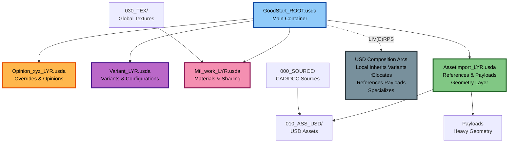

# USD GoodStart

**Version:** 0.9.2-beta  
**Last Updated:** 11.22.2025

**Pretex (why the hell..)**
Dear fellow lerner: Here is a clean, organized USD project template for getting started working with Composition Arcs. It has a focus on **digital twin applications + Omnniverse**, but the 'GoodStart' I provide here, is aslo applicable for other purposes...

In this 'Readme' I try to sum up my learnings from Sep2024 till now, strugeling to find a good path into OpenUSD. 

My Entrypoint is Omniverse, but truly learning the beauty of Composition Arcs in OpenUSD has been hard, since the online Learning paths provided by NVIDIA, PIXAR, come from the Pipelining heritage of OpenUSD and tend to Focus on the Programmatic side of things. To me, Cursor, with strong Context engineering + MCPs, has become a good friend and has changed my approach on 3D entirely. Never the less I would like to provide a path into OpenUSD that suits the 3D artist | TechArtist | CAD moddeler | non programmer |.... better by providing a straight forward minimal Project Setup. ...and some more insights in this Readme.

So here is a 'GoodStart' if you disagree or want to make it better, drop me a line JH@haluszka.com, subject: 'GoodStart'.
THX in a dvance for the Feedback!

> **⚠️ Beta Status:** This is an early-stage beta project and has not been fully hardened yet. Please use with caution and at your own risk! 
There are bits and pieces about the workflows suggested, that I have not tested enough to be confident about them..., therefore treat this as suggestions, trying to merge workflows we see in 'traditional' CGI / VFX Pipeline, with Omniverse DigitalTwin workflows. You are sort of watching me learning ;) 

## TLDR (Too Long; Didn't Read)

**What is this?** A USD project template adapted from VFX industry best practices for **digital twin applications**, with organized folder structure and validation scripts.

**Quick Structure:**



**Folder Organization:**
- `000_SOURCE/` - Original CAD/DCC source files
- `010_ASS_USD/` - USD assets (converted from CAD or created in DCC)
- `020_LYR_USD/` - Layer files for non-destructive modifications (variants, materials, overrides)
- `030_TEX/` - Global textures
- `GoodStart_ROOT.usda` - Master root file (entry point)

**Layer Stack Order** (array ordering: first = strongest, last = weakest):
1. **Opinion_xyz_LYR.usda** (first/strongest) - Overrides and opinions
2. **Variant_LYR.usda** - Variants and configurations
3. **Mtl_work_LYR.usda** - Materials and shading work
4. **AssetImport_LYR.usda** (last/weakest) - References payloads, holds geometry, imports assets

**Note:** The `subLayers` array is ordered from strongest (first) to weakest (last). First in array = strongest (applied last, overrides others). Last in array = weakest (applied first, can be overridden).

**Quick Workflow:**
1. Convert CAD → USD assets → place in `010_ASS_USD/`
2. Create layer files in `020_LYR_USD/` for modifications (variants, materials, overrides)
3. Reference layers in `GoodStart_ROOT.usda` (array order: Opinion → Variant → Material → AssetImport, where first = strongest)
4. Use **relative paths** (`@./folder/file.usd@`) for portability
5. Validate with `python scripts/validate_asset.py` (for individual assets) or `python scripts/validate_scene.py` (for entire scenes)

**Key Best Practices:**
- ✅ Use **relative paths** (never absolute paths)
- ✅ Keep layer structure simple
- ✅ Don't import assets in root layer - use `AssetImport_LYR` at bottom
- ✅ Use **custom attributes** for queryable metadata (PLM IDs, status)
- ✅ Use **customData dictionary** for static documentation metadata
- ⚠️ Blender/Cinema 4D = endpoint only (destructive editing, no layering)
- ✅ Maya/Houdini/3ds Max = full USD composition support

**Note on LIV(E)RPS:** **LIV(E)RPS** (with rElocates) is the official OpenUSD specification from [Pixar](https://openusd.org/). rElocates (E) are officially part of LIV(E)RPS (position 4, between Variants and References) but are **unconfirmed in Omniverse Kit App 108.1**. When working with Omniverse, verify support or use LIVRPS order without rElocates. See `AssetStructureBestPractices.md` for details.

**For Digital Twins:** Integrates CAD metadata, PLM/PDM/ERP systems, [Asset Administration Shell (AAS)](https://industrialdigitaltwin.org/en/aas/) (IDTA/[OPC Foundation](https://reference.opcfoundation.org) standards), and supports synthetic data generation for Physical AI workflows.

**Start Small:** Begin with a POC/MVP project before scaling. This is an agile, iterative process, not waterfall.

---

## Quick Reference

**Folder-Specific Guides:**
- **[000_SOURCE/](000_SOURCE/README.md)** - Source files folder (CAD files, DCC source files, conversion pipeline)
- **[010_ASS_USD/](010_ASS_USD/README.md)** - USD assets folder (geometry, CAD conversions, asset workflows)
- **[020_LYR_USD/](020_LYR_USD/README.md)** - Layer files folder (non-destructive modifications, variants, materials)
- **[030_TEX/](030_TEX/README.md)** - Global textures folder (shared textures, Nucleus workflow)

Each folder README provides quick reference for that specific folder. For comprehensive documentation, see sections below.

---

## About OpenUSD and Digital Twins

**OpenUSD** (Universal Scene Description) was originally developed by [Pixar Animation Studios](https://openusd.org/) as a universal scene description format to be sent to renderers for visual effects and CGI production. However, its powerful composition system, non-destructive workflows, and ability to handle complex 3D data make it an ideal foundation for **digital twin applications**.

This project template adapts OpenUSD's proven VFX industry practices for digital twin use cases, including:
- Building digital twins from existing CAD products
- Integrating with PLM/PDM/ERP systems
- Connecting to [Asset Administration Shell (AAS)](https://industrialdigitaltwin.org/en/aas/) standards (IDTA/[OPC Foundation](https://reference.opcfoundation.org))
- Managing industrial and manufacturing digital twins
- Architecture, Engineering, and Construction (AEC) applications

While OpenUSD was designed for rendering, its universal scene description capabilities make it perfect for representing real-world assets, systems, and environments in digital twin contexts.

---

## OpenUSD Asset Structure Principles

Understanding these core principles will help you use this template effectively and make informed decisions when structuring your own USD assets.

### Core Principles

A scalable USD asset structure relies on four key principles:

**1. Legibility**
- Use clear, intent-driven names (`LargeCardboardBox` not `Box01`)
- Differentiate public vs. internal elements (capitalized `Geometry` for public, `_internalRig` for private)
- Use ASCII/UTF-8 identifiers; avoid dynamic tokens like timestamps

**2. Modularity**
- Assets should be self-contained with relative paths
- Define stable entry points (root prims) that don't change even if internals do
- Structure assets to be referenced and instanced easily

**3. Performance**
- Use **References** to keep assets reusable (never copy geometry directly)
- Use **Payloads** for heavy assets (lazy-loading - only loads when needed)
- Use **Instancing** for repeated geometry (1 million screws = 1 copy + transforms, not 1 million copies)
- Prefer `.usdc` (binary) for production, `.usda` (text) for debugging

**4. Navigability**
- Use Relationships and Collections to group logical items
- Keep model hierarchies shallow and consistent

### The Reference/Payload Pattern

**Critical Pattern:** Separate the lightweight "interface" from the heavy "implementation".

```
Asset_File.usd (Interface - Lightweight)
├── Root Prim
│   ├── Lofted Variant Sets (accessible without loading payload)
│   ├── Lofted Primvars (material controls)
│   └── Payload Arc ───> Payload_File.usdc (Heavy Geometry)
```

**Why this matters:**
- Users can see variant options **without loading heavy geometry** (instant)
- Viewport gets bounding boxes **without loading geometry** (fast)
- Materials can be changed **without loading geometry** (responsive)

**"Lofting"** = Moving important controls (variants, primvars, metadata) **above** the payload arc so they're accessible without loading the heavy content.

**Critical Distinction: Payload vs Sublayer**

Understanding when to use **Payloads** vs **Sublayers** is fundamental to USD architecture:

- **Sublayer**: Merges content at the *layer* level
  - Used for: Pipeline steps, workstream edits, overrides, scene-level assembly
  - Example: `subLayers = [@./Materials.usda@, @./Layout.usda@]`

- **Payload**: Composes content at the *prim* level
  - Used for: Geometry, internal hierarchies, CAD data
  - Example: `payload = @./Pump_geometry.usdc@`

**Key Point:** Sublayers merge entire layers together. Payloads attach heavy content to specific prims. This distinction is core to USD architecture.

### Composition Strength: LIV(E)RPS

**LIV(E)RPS** is the rulebook that decides which data "wins" when multiple sources conflict. The acronym stands for: **L**ocal, **I**nherits, **V**ariants, **(E)** rElocates, **R**eferences, **P**ayloads, **S**pecializes.

| Strength | Arc | What It Is |
|----------|-----|------------|
| **Strongest** | **L**ocal | Direct edits in current layer |
| | **I**nherits | Properties from classes/templates |
| | **V**ariants | Switchable options (red/blue, high/low) |
| | **(E)** rElocates | Remap prim paths (official spec, unconfirmed in Omniverse 108.1) |
| | **R**eferences | Pulling in other USD files |
| | **P**ayloads | Heavy data loaded on demand |
| **Weakest** | **S**pecializes | Weak template/base class |

**Simple Rule:** Higher in LIV(E)RPS wins. If a referenced asset sets `color=blue` but your local layer sets `color=red`, local (red) wins because **Local > Reference** in the LIV(E)RPS composition strength order.

### Root File and Layer Stacking

**Critical Concept:** The root file defines structure. Asset loading happens in the **lowest (weakest) layer**, with all modifications stacked on top.

**Root File Must Be "Thin":**
- ✅ Base scene structure (`def Xform "World"`)
- ✅ `subLayers` array
- ✅ Metadata (defaultPrim, upAxis)
- ❌ **NO** geometry, references, payloads, or attribute values

**Why?** Anything in the root layer (Local) cannot be overridden by sublayers because **Local > SubLayers** in LIV(E)RPS. Keep it thin so layers can override.

**The Root Layer Trap - Concrete Example:**

This is a common mistake that breaks USD workflows:

❌ **Wrong:** Setting a transform directly in the root file:
```usda
# In GoodStart_ROOT.usda
def Xform "RobotA" {
    double3 xformOp:translate = (10, 0, 0)  # ❌ This locks the position!
}
```

Then trying to override it in a sublayer:
```usda
# In Opinion_LYR.usda
over "RobotA" {
    double3 xformOp:translate = (0, 0, 0)  # ❌ This won't work!
}
```

**Result:** The override does **not** apply. Local > Sublayer, so the root layer wins.

✅ **Correct:** Author transforms in department layers, not the root:
```usda
# In GoodStart_ROOT.usda - Only sublayers, no transforms!
(
    subLayers = [@./020_LYR_USD/Opinion_LYR.usda@]
)

# In Opinion_LYR.usda - This is where transforms belong
over "RobotA" {
    double3 xformOp:translate = (0, 0, 0)  # ✅ This works!
}
```

**Layer Stack Order** (array ordering: first = strongest, last = weakest):
1. **Opinion_xyz_LYR.usda** (first/strongest) - Final overrides
2. **Variant_LYR.usda** - Variants and configurations  
3. **Mtl_work_LYR.usda** - Materials and shading
4. **AssetImport_LYR.usda** (last/weakest) - **CRITICAL:** Loads assets via references/payloads

**Why AssetImport Must Be Last in Array:**
- It loads assets into the scene
- Earlier layers (materials, variants, opinions) need to override what's loaded
- The `subLayers` array is ordered strongest-first: first = strongest (applied last), last = weakest (applied first)
- If AssetImport were first in the array, nothing could override the loaded assets

### Anti-Patterns to Avoid

**⛔ Inline Geometry in Root:**
- **Never** put heavy mesh data directly in the root file
- Root layer is always parsed first and cannot be unloaded
- Causes slow open times, memory lock, and merge conflicts
- **Exception:** Simple helpers (4-vertex ground plane) are OK

**⚠️ Direct References (Bypassing Payloads):**
- Using `references = @./geo.usd@` instead of `payload = @./geo.usd@`
- Forces immediate loading of heavy assets (kills viewport performance)
- **Best Practice:** Use **Payloads** for heavy assets to enable lazy loading

**📚 For Complete Details:** See [`AssetStructureBestPractices.md`](AssetStructureBestPractices.md) for comprehensive explanations, examples, and advanced patterns.

---

## Project Structure

This project follows a structured folder organization to maintain clarity and scalability:

```
USD_GoodStart/
├── 000_SOURCE/          # Source files used in the project
├── 010_ASS_USD/         # All USD assets (default + project assets)
├── 020_LYR_USD/         # Layer files for modifications and overrides
├── 030_TEX/             # Global texture files
├── GoodStart_ROOT.usda  # Master root file that references all layers + Assets
├── GoodStart.hiplc      # Houdini file (or .ma/.mb/.max for other DCC tools)
└── README.md            # This file
```

## Prerequisites

Before starting with USD GoodStart, ensure you have the following installed and configured:

### Required Software

- **Omniverse Kit/App**: 
  - Omniverse Composer (recommended version: Latest stable)
  - Omniverse Kit SDK (for extension development)
  - Download from [NVIDIA Omniverse](https://www.nvidia.com/en-us/omniverse/) https://github.com/NVIDIA-Omniverse/kit-app-template

- **Python Environment**:
  - Python 3.8+ (Python 3.10+ recommended)
  - `usd-core` package: `pip install usd-core`
  - Additional packages may be required for CAD conversion (see CAD tools section)

- **USD Tools**:
  - **USD Python API** (`usd-core` from PyPI) - Python bindings for USD
  - **[usdview](https://github.com/PixarAnimationStudios/OpenUSD)** - **The classic USD validation and inspection tool** from Pixar:
    - Original tool from [Pixar Animation Studios](https://openusd.org/)
    - Essential for validating USD files and checking structure
    - Inspect prims, attributes, relationships, and composition
    - Visualize USD scenes and debug composition issues
    - Always helpful for USD file validation and troubleshooting
    - Part of the official OpenUSD repository
  - **USD C++ SDK** (optional) - For advanced development and custom plugins

### CAD Tools (Optional, for CAD-to-USD workflows)

- **CAD Software** (one or more):
  - CATIA, SolidWorks, Autodesk Inventor, or similar
  - Rhino 3D
  - STEP file support (for intermediate conversion)

- **CAD Conversion Tools**:
  - **[NVIDIA Omniverse CAD Converter Extension](https://docs.omniverse.nvidia.com/extensions/latest/ext_cad-converter.html)** - **Recommended Production Solution**:
    - Built-in CAD converter within Omniverse Kit apps and Composer
    - Supports common CAD formats (STEP, IGES, etc.) directly to USD
    - Works from content browser with context menu option
    - Actively maintained and optimized for Omniverse workflows
    - Official documentation: [CAD Converter Manual](https://docs.omniverse.nvidia.com/extensions/latest/ext_cad-converter/manual.html)
  - **[CAD-to-OpenUSD](https://github.com/nAurava-Technologies/CAD-to-OpenUSD)** - Open-source conversion scripts (Work in Progress, November 2024)
    - Useful for custom pipeline development
    - Requires development effort for production use
  - **[NVIDIA Omniverse Connectors](https://www.nvidia.com/en-us/omniverse/connectors/)** - Production-ready connectors for:
    - Autodesk 3ds Max, Maya, Revit, Inventor
    - SolidWorks, Siemens NX, CATIA
    - Blender, Unreal Engine, Unity
    - And many more CAD/DCC tools
  - **[OpenUSD Exchange SDK](https://github.com/NVIDIA-Omniverse/usd-exchange)** - SDK for building custom USD I/O plugins and converters
    - For pipeline-specific requirements
    - Requires development using USD SDK and CAD SDKs (OpenCASCADE, FreeCAD, or commercial CAD SDKs)
  - **CAD Vendor Native Exporters**: Many CAD vendors now provide native USD export capabilities
  - **STEP Intermediate Format**: Use STEP files as a stable intermediate format for CAD conversion workflows

### DCC Tools (Optional, for content creation)

- **3D Software** (one or more):
  - Houdini (`.hiplc` files) - **Full USD support** with layering and referencing
  - Maya (`.ma`/`.mb` files) - **Full USD support** with layering and referencing
  - 3ds Max - **Full USD support** with layering and referencing
  - Blender (USD export support) - **Limited: Read/write only, no layering/referencing** (see limitations below)
  - Cinema 4D - **Limited: Read/write only, no layering/referencing** (see limitations below)

**Important: DCC Tool Limitations for USD Workflows**

Some DCC tools have **significant limitations** when working with USD:

**Blender, Cinema 4D, and Similar Tools:**
- ✅ Can **read and write** USD files (`.usd`, `.usda`, `.usdc`, `.usdz` formats)
- ❌ **Do NOT support** USD's core composition features:
  - No layering support (cannot work with sublayers)
  - No referencing support (cannot create or maintain references)
  - No composition arcs (LIV(E)RPS) support
  - No non-destructive workflows
- ⚠️ **Work destructively** - These tools modify USD files directly without preserving composition structure
- 📍 **Use case**: Can only be used to create **"endpoint" assets** (the lowest sublayer - the asset itself)
- ❌ **Cannot be used** for modifying layers on top of assets or working with USD's composition system

**Why This Matters:**
- The difference between exporting USD from Blender/C4D vs. exporting FBX/Alembic/OBJ is **minimal** - they're essentially export endpoints
- For USD workflows requiring **layering, referencing, or non-destructive editing**, use **Maya, Houdini, or 3ds Max** instead
- Blender/C4D are suitable for creating base assets but **cannot participate in USD's composition workflows**

**Recommendation:**
- Use **Maya, Houdini, or 3ds Max** for USD workflows that require:
  - Layer-based modifications
  - Asset referencing
  - Non-destructive editing
  - Composition arcs (variants, payloads, inherits, etc.)
- Use **Blender/C4D** only for creating final export assets that will be referenced by other USD files

### Houdini: The Powerhouse for USD Pipeline Automation

**Houdini stands out as the premier tool for USD pipeline development and automation**, offering capabilities that complement and extend beyond what Omniverse provides.

**Why Houdini is Essential for USD Workflows:**

- 🎯 **Best USD Integration**: Houdini has the **deepest and most comprehensive USD integration** apart from Omniverse itself. It provides native, first-class support for all USD composition arcs and features.

- 🎨 **Visual Variant Creation**: Building variants in Houdini is **visually cleaner and more intuitive** than creating them directly in Omniverse. Houdini's node-based workflow makes variant management more accessible and maintainable.

- 🔄 **Reusable Workflows**: Once you build a workflow in Houdini, you can **reuse it across projects**. Houdini's procedural nature means you can create templates, tools, and pipelines that scale with your needs.

- 🤖 **Pipeline Automation**: Houdini's procedural nature makes it an **excellent automation tool** for building pipelines. You can run USD files through Houdini workflows to automate repetitive tasks, batch processing, and complex transformations.

- ✏️ **Geometry Modeling**: Unlike Omniverse, which cannot alter geometry, **Houdini provides full modeling capabilities**. You can model, sculpt, and modify geometry directly within USD workflows, making it essential for asset creation and refinement.

- ⚡ **Procedural Power**: Houdini's procedural nature is a **killer feature** for USD pipelines. You can:
  - Generate complex USD structures procedurally
  - Automate asset processing and transformation
  - Build reusable pipeline tools
  - Create dynamic, data-driven workflows
  - Process large batches of USD files efficiently

**Use Cases:**
- Creating and managing variants visually
- Building automated USD processing pipelines
- Geometry modeling and refinement within USD workflows
- Batch processing and transformation of USD assets
- Developing reusable pipeline tools and templates
- Complex procedural USD scene generation

**Integration with USD_GoodStart:**
- Store Houdini files (`.hiplc`) in the project root
- Use Houdini to create variants, process assets, and automate workflows
- Export processed USD files to `010_ASS_USD/` for use in the scene
- Leverage Houdini's USD nodes for layer management and composition

**📚 Recommended Houdini USD Resources:**
- **[USD Survival Guide](https://lucascheller.github.io/VFX-UsdSurvivalGuide/)** by Luca Scheller - A practical onboarding guide to USD for software developers and pipeline TDs, with extensive Houdini examples and production workflows. Originally presented at Siggraph 2023.
- **[Houdini USD Tutorial Collection](https://raindrop.io/Jph_2/houdini-usd-62738064)** - Curated collection of Houdini USD tutorials and resources covering Solaris, LOPs, USD asset building, MaterialX, variants, and production workflows. Includes official SideFX documentation, YouTube tutorials, and practical guides.

### Version Control: Why It Matters

**Version control is essential for USD projects** because it enables:
- **Collaboration**: Multiple team members can work on the same assets without conflicts
- **History tracking**: See what changed, when, and why
- **Rollback capability**: Safely revert to previous versions if something breaks
- **Clean reference paths**: No need for version numbers in file paths (e.g., `asset_v1.usd`, `asset_v2.usd`) - version control handles versioning automatically
- **Stable asset references**: USD references can point to stable paths like `@./010_ASS_USD/pump.usd@` without worrying about version numbers cluttering your scene structure

**Why Clean Reference Paths Matter:**
When using version control, your USD references should use **stable, version-agnostic paths**. Instead of:
```usda
# ❌ Bad: Version numbers in paths
def Xform "Pump" (
    references = @./010_ASS_USD/pump_v2.3.usd@
)
```

Use:
```usda
# ✅ Good: Clean, stable paths
def Xform "Pump" (
    references = @./010_ASS_USD/pump.usd@
)
```

Version control handles the versioning - you can always check out the specific version you need, and your USD files remain clean and maintainable.

**Version Control Options:**

| Solution | Best For | Integration | Key Features | Limitations |
|----------|----------|-------------|--------------|-------------|
| **[Omniverse Nucleus](https://docs.omniverse.nvidia.com/nucleus/latest/index.html)** | **Omniverse-native workflows** | **Tightest integration** with Omniverse Kit/Apps | • **Live collaboration** - Real-time multi-user editing<br/>• **Checkpoints** - Immutable version snapshots<br/>• **USD-native** - Built specifically for USD workflows<br/>• **Branching support** - Parallel development (evolving)<br/>• **Direct DCC mounting** - Assets accessible in Omniverse/Unreal<br/>• **Centralized asset management** - Single source of truth | • Requires Nucleus Server setup<br/>• Omniverse ecosystem dependency<br/>• Less suitable for non-USD workflows |
| **Git + Git LFS** | **Open-source, flexible workflows** | Works with any tool | • **Industry standard** - Widely adopted<br/>• **Open source** - No vendor lock-in<br/>• **Branching & merging** - Full version control features<br/>• **Git LFS** - Handles large binary files<br/>• **CI/CD integration** - Automated workflows<br/>• **Standard VCS** - Can migrate between hosts | • Steeper learning curve<br/>• Requires technical knowledge<br/>• Binary file handling can be complex<br/>• No real-time collaboration |
| **[Anchorpoint](https://www.anchorpoint.app/)** | **Teams without version control** | Works with existing folder structure | • **Artist-friendly** - Simple two-button interface<br/>• **Git-based** - Built on Git/Git LFS<br/>• **No reorganization needed** - Works with existing folders<br/>• **File locking** - Prevents conflicts<br/>• **TB-scale support** - Handles large projects<br/>• **DCC integration** - Blender, Photoshop, Unity, Unreal | • Commercial tool<br/>• Not tested in this project<br/>• Requires Git server setup |
| **[Diversion.dev](https://www.diversion.dev/)** | **Game/3D pipelines, Unreal Engine** | Direct Unreal Engine plugin | • **Cloud-native** - Modern Git-like workflow<br/>• **Unreal integration** - Direct plugin for UE<br/>• **Easy setup** - Simple for small teams<br/>• **Fast uploads** - Optimized for large binaries<br/>• **Private workspaces** - Cloud syncs before commit | • Closed ecosystem - Vendor lock-in<br/>• Limited third-party integrations<br/>• Less mature than Git/Perforce |
| **[Assembla](https://get.assembla.com/)** | **Enterprise compliance, hosted Perforce** | Git/SVN/Perforce repos | • **Enterprise compliance** - SOC 2, GDPR<br/>• **Hosted Perforce** - Only cloud Perforce service<br/>• **Mature ecosystem** - CI/CD, IDE integrations<br/>• **Multiple VCS** - Git, SVN, or Perforce<br/>• **Strong security** - Access controls, audit logs | • Traditional pull/push model<br/>• No real-time collaboration<br/>• Enterprise pricing<br/>• Manual import/export workflow |
| **PLM/PDM/ERP Systems** | **Established organizations** | Enterprise integration | • **Already in place** - No new system needed<br/>• **Product lifecycle management** - Full traceability<br/>• **Engineering data** - CAD/engineering integration<br/>• **Enterprise-grade** - Scalable and secure | • May not be USD-native<br/>• Integration complexity<br/>• May require custom connectors |

**Omniverse Nucleus - Deep Integration:**

**[Omniverse Nucleus](https://docs.omniverse.nvidia.com/nucleus/latest/index.html)** is NVIDIA's version control and collaboration system specifically designed for USD workflows. It provides the **tightest integration** when working with Omniverse Kit applications:

- **Live Collaboration**: Multiple users can work simultaneously on the same USD stage with real-time updates
- **Checkpoints**: Create immutable snapshots of your work at any point, allowing safe rollback and version reference
- **USD-Native**: Built from the ground up for USD, understanding composition arcs, layers, and references
- **Centralized Asset Management**: Single source of truth for all USD assets, ensuring consistency across projects
- **Seamless Integration**: Works directly with Omniverse Kit apps, Connectors, and extensions without additional setup

**Anchorpoint - Artist-Friendly Git Solution:**

**[Anchorpoint](https://www.anchorpoint.app/)** is a Git-based version control solution designed specifically for artists and creative teams. It's an **excellent alternative to Nucleus** for teams that want version control without committing to the Omniverse ecosystem:

- **Works with Your Existing Folder Structure**: Unlike Nucleus, Anchorpoint adds version control **on top of your existing folder structure** without requiring reorganization or special server access. This means you can version control assets in standard folders that any tool can access.

- **Universal Tool Access**: **Major advantage over Nucleus** - Tools like Photoshop, Blender, Substance Painter, and other DCC applications can directly access files in Anchorpoint-managed folders without special connectors or server mounting. This eliminates the complexity of storing assets in multiple locations.

- **Git-Based Foundation**: Built on Git and Git LFS, providing industry-standard version control with full branching, merging, and history tracking capabilities.

- **Artist-Friendly Interface**: Simple two-button interface designed for non-technical users, making Git accessible to artists who don't want to learn command-line tools.

- **File Locking**: Prevents conflicts when multiple team members work on the same files, essential for binary assets.

- **TB-Scale Support**: Handles large projects without slowdowns, with selective checkout to download only what you need.

- **DCC Integration**: Native support for Blender, ZBrush, Photoshop, Substance, Unity, Unreal Engine, and Godot.

- **Python API**: Automate workflows with Python-based actions for custom pipeline integration.

**When Anchorpoint Makes Sense:**

- **Mixed tool workflows**: When you need to work with tools that can't directly access Nucleus Server (Photoshop, Substance Designer, etc.)
- **Teams without version control**: If your team doesn't have version control yet and needs an easy-to-adopt solution
- **Standard folder structure**: When you want to keep your existing folder organization without restructuring for Nucleus
- **Git compatibility**: When you need Git-based version control but want an artist-friendly interface
- **Multi-platform workflows**: When working across different platforms and tools that need direct file system access

**Note**: This tool hasn't been tested in this project, but represents one of the most promising approaches for establishing version control in teams that don't have it yet, especially when Nucleus's tool limitations become a concern.

**Practical Workflow: Combining Systems**

Modern USD pipelines often benefit from **combining multiple version control systems**:

- **Use Nucleus for live collaboration**: Real-time, collaborative 3D scene development between Omniverse and Unreal Engine
- **Use traditional VCS for long-term versioning**: Git/Perforce/Assembla for source control, backup, compliance, and long-term asset management
- **Workflow example**:
  1. Pull latest assets from your traditional VCS (Git/Assembla)
  2. Work in Omniverse/Unreal, saving USD files to Nucleus for live collaboration
  3. Periodically commit changes back to traditional VCS for long-term versioning, backup, or compliance

**When to Use Each Solution:**

- **Use Nucleus** if you're working primarily in the Omniverse ecosystem and need tight integration with Kit apps and real-time collaboration
- **Use Git/Git LFS** if you need open-source, flexible version control that works across different tools and platforms
- **Use Anchorpoint** if your team doesn't have version control yet and needs an artist-friendly Git solution, or if you work with tools that can't directly access Nucleus Server (Photoshop, Substance Designer, etc.) - Anchorpoint works with standard folder structures that any tool can access
- **Use Diversion.dev** if you're working primarily with Unreal Engine and want a modern, cloud-native VCS with direct UE integration
- **Use Assembla** if you need enterprise compliance (SOC 2, GDPR) and want hosted Perforce or multiple VCS options (Git/SVN/Perforce)
- **Integrate with existing PLM/PDM** if you're working with established organizations that already have enterprise systems

**For Established Organizations:**
When implementing larger digital twins for established organizations, they **very likely already have version control systems** in place:
- **PLM systems** (Product Lifecycle Management) - Handle product data and revisions
- **PDM systems** (Product Data Management) - Manage engineering data and versions
- **Enterprise version control** - May use Perforce, SVN, or other enterprise solutions

In these cases, integrate your USD workflow with their existing systems rather than introducing new version control tools.

### Additional Tools

- **[ShapeFX Loki](https://shapefx.app/)** - **Promising USD-native tool** based on OpenDCC:
  - Built on **[OpenDCC](https://forum.aousd.org/t/opendcc-is-now-open-source/2448)** - Open-source application framework from the AOUSD community
  - **Native USD reading** - Can read USD files natively with full composition support
  - **USD-native editing** - Edit OpenUSD files directly without export/import workflows
  - **Material Editor** - Create and refine materials using USDShade graphs with MaterialX support
  - **Multi-stage editing** - Open and manage multiple USD stages simultaneously
  - **Hydra rendering** - Production-grade rendering powered by Hydra
  - **Python scripting** - Access USDStage directly via built-in Python Script Editor
  - **Layer management** - Inspect and manage stage compositions with intuitive tools
  - **Render View** - Standalone tool for AOV and image inspection
  - **Comprehensive USD inspection** - Explore and edit every aspect of USD scenes
  - **Apache 2.0 license** - Open-source framework (OpenDCC) with commercial application (ShapeFX Loki)
  - **Active development** - Actively developed by Alex Kalyuzhnyy and the ShapeFX team
  - **Community support** - Part of the AOUSD community ecosystem
  - **Good to have in the toolbox** - Useful for USD workflows and scene management
  - **Support the development** - Consider supporting Alex Kalyuzhnyy's development efforts
  - GitHub: [shapefx/OpenDCC](https://github.com/shapefx/OpenDCC)
  - Forum: [OpenDCC is now open source](https://forum.aousd.org/t/opendcc-is-now-open-source/2448)

## Quick Start - Using the Folders in this Repo

1. **Assets**: Place your USD assets in `010_ASS_USD/`
2. **Modifications**: Create or edit layers in `020_LYR_USD/` to modify assets
3. **Textures**: Add global textures to `030_TEX/`
4. **Root File**: The `GoodStart_ROOT.usda` file references all layers and serves as the entry point

## Folder Details

Each folder contains its own README with detailed information:

- **[000_SOURCE/](000_SOURCE/README.md)** - Source files and materials
- **[010_ASS_USD/](010_ASS_USD/README.md)** - USD assets and asset organization
- **[020_LYR_USD/](020_LYR_USD/README.md)** - Layer files for modifications
- **[030_TEX/](030_TEX/README.md)** - Global texture files

## Root File

`GoodStart_ROOT.usda` is the master file that:
- References all layer files from `020_LYR_USD/`
- Serves as the entry point for the entire project
- Contains the base scene structure and environment

## Path Best Practices: Use Relative Paths

**Critical**: Always use **relative paths** in USD files for portability and collaboration.

### Why Relative Paths Matter

- ✅ **Portability**: Projects can be moved or shared without breaking references
- ✅ **Collaboration**: Works across different machines and operating systems
- ✅ **Version Control**: Relative paths work correctly in Git repositories
- ❌ **Absolute paths break** when projects are moved, shared, or accessed from different locations

### Path Format Examples

**Layer References** (in root file):
```usda
subLayers = [
    @./020_LYR_USD/Opinion_xyz_LYR.usda@,
    @./020_LYR_USD/Variant_LYR.usda@,
    @./020_LYR_USD/Mtl_work_LYR.usda@,
    @./020_LYR_USD/AssetImport_LYR.usda@
]
```

**Asset References** (in layer files):
```usda
def Xform "PartAssembly" (
    prepend references = @../010_ASS_USD/part_assembly.usd@
)
{
    # Asset referenced using relative path
}
```

**Texture References** (in material definitions):
```usda
asset inputs:diffuse_texture = @../030_TEX/texture_name.png@ (
    colorSpace = "sRGB"
)
```

### Path Resolution Notes

- **USD's `@` syntax**: The `@` symbols indicate USD asset paths
- **Relative path resolution**: USD resolves paths relative to the file containing the reference
- **Scripts use `.resolve()` internally**: Validation scripts convert paths to absolute for checking, but USD files should contain relative paths
- **Path examples**:
  - `@./020_LYR_USD/file.usda@` - Same directory level
  - `@../010_ASS_USD/asset.usd@` - One directory up
  - `@../../textures/texture.png@` - Two directories up

### Common Mistakes to Avoid

❌ **Don't use absolute paths**:
```usda
# BAD - Breaks when project is moved
prepend references = @C:/Projects/USD_GoodStart/010_ASS_USD/asset.usd@
```

✅ **Use relative paths**:
```usda
# GOOD - Works anywhere
prepend references = @../010_ASS_USD/asset.usd@
```

## DCC Files

DCC (Digital Content Creation) files that work on the USD files are stored in the root directory:

- **Houdini**: `GoodStart.hiplc` (or `.hip` files)
- **Maya**: `.ma` or `.mb` files
- **3ds Max**: `.max` files
- **Other DCC tools**: Place your working files here

These files allow different team members to work on the USD project using their preferred DCC tool. Each DCC file references and modifies the USD files (`GoodStart_ROOT.usda` and assets in `010_ASS_USD/`), but the actual USD files remain the source of truth. Changes are layered on top as opinions within the USD structure.

**Note**: Different team members may use different DCC tools, so you may see multiple DCC file types in the root directory. Each person works with their preferred tool while maintaining the same USD structure. Changes are layered on top as opinions within the USD structure.

**Important**: Not all DCC tools support USD's composition features. Tools like **Maya, Houdini, and 3ds Max** support full USD workflows with layering and referencing. Tools like **Blender and Cinema 4D** can only read/write USD files but cannot work with layers or references - they are limited to creating endpoint assets. See "DCC Tool Limitations" section above for details.

## Example Asset Lifecycle

This section illustrates a complete asset lifecycle from source conversion through production deployment:

### Step 1: Source File Preparation

```bash
# Place CAD source files in 000_SOURCE/
# Example: Export STEP file from CAD system
cp /path/to/cad/export/part_assembly.step 000_SOURCE/
```

### Step 2: CAD to USD Conversion

```bash
# Using CAD-to-OpenUSD conversion scripts
# See: https://github.com/nAurava-Technologies/CAD-to-OpenUSD
cd 000_SOURCE/
# Convert STEP to USD
python cad2usd.py part_assembly.step ../010_ASS_USD/part_assembly.usd
```

### Step 3: Asset Validation

```bash
# Validate USD asset (see validation scripts section)
python scripts/validate_asset.py 010_ASS_USD/part_assembly.usd
```

### Step 4: Create Asset Import Layer

```usda
# In 020_LYR_USD/AssetImport_LYR.usda
def Xform "PartAssembly" (
    prepend references = @../010_ASS_USD/part_assembly.usd@
)
{
    # Asset is now referenced in the scene
}
```

### Step 5: Add Modifications via Layers

```usda
# In 020_LYR_USD/Mtl_work_LYR.usda
over "PartAssembly"
{
    over "SubAssembly"
    {
        # Add material overrides, metadata, etc.
        string digitalTwin:assetId = "DT-001"
        string digitalTwin:plmLink = "PLM://system/part/12345"
    }
}
```

### Step 6: Link to Root File

The root file (`GoodStart_ROOT.usda`) automatically includes all layers via `subLayers`:

```usda
subLayers = [
    @./020_LYR_USD/Opinion_xyz_LYR.usda@,    # First = strongest (applied last, overrides others)
    @./020_LYR_USD/Variant_LYR.usda@,        # Second
    @./020_LYR_USD/Mtl_work_LYR.usda@,       # Third
    @./020_LYR_USD/AssetImport_LYR.usda@     # Last = weakest (applied first, can be overridden)
]
```

**Note:** The `subLayers` array is ordered from strongest (first) to weakest (last). This is separate from LIV(E)RPS composition strength ordering, which applies to composition arcs (Local, Inherits, Variants, rElocates, References, Payloads, Specializes).

### Step 7: Production Deployment

```bash
# Validate entire scene
python scripts/validate_scene.py GoodStart_ROOT.usda

# Export for production (if needed)
usdcat GoodStart_ROOT.usda -o production/GoodStart_ROOT.usdc
```

## Workflow

### Digital Twin Workflow

1. **Source Files**: CAD files or other source materials in `000_SOURCE/` or external systems (PLM/PDM/ERP)
2. **Convert to USD**: Convert source files to USD format and place in `010_ASS_USD/`
3. **Add Metadata**: Map CAD metadata to USD metadata and connect to external data sources
4. **Apply Modifications**: Use layers in `020_LYR_USD/` to add digital twin-specific modifications, opinions, and connections
5. **Link to Root**: Ensure all assets and modifications are properly linked in `GoodStart_ROOT.usda`
6. **AAS Integration**: Connect USD assets to [Asset Administration Shell (AAS)](https://industrialdigitaltwin.org/en/aas/) for digital twin management. See [IDTA AAS](https://industrialdigitaltwin.org/en/aas/) (European) or [OPC Foundation](https://reference.opcfoundation.org) [I4AAS](https://reference.opcfoundation.org/I4AAS/v100/docs/) (OPC UA, American/USA context)

### DCC Workflow (Optional)

**Important**: Not all DCC tools support USD's composition features. See "DCC Tool Limitations" section above.

1. **Import Assets**: Export USD files from DCC tools to `010_ASS_USD/`
   - **Full USD support** (Maya, Houdini, 3ds Max): Can export with full composition support
   - **Limited support** (Blender, Cinema 4D): Can only create endpoint assets (destructive export)
2. **Reference Assets**: Use layers in `020_LYR_USD/` to reference and modify assets
   - ⚠️ **Note**: Blender/C4D cannot work with layers - they can only create the base asset
3. **Apply Modifications**: Add opinions, variants, and material changes through layers
   - Use Maya, Houdini, or 3ds Max for layer-based modifications
4. **Link to Root**: Ensure all modifications are properly linked in `GoodStart_ROOT.usda`

## Project Planning and Implementation Strategy

Before diving deep into implementation, establish clear project planning and management processes. This is **critical** for successful digital twin projects.

### Start Small: POC and MVP Approach

**Begin with a small sample project** before scaling to larger implementations:

1. **Proof of Concept (POC)**: Start with a small, focused project to validate:
   - Technical feasibility
   - Workflow concepts
   - Tool integration
   - Team capabilities

2. **Minimum Viable Product (MVP)**: Build a minimal but functional version that:
   - Demonstrates core value
   - Tests key workflows
   - Identifies challenges early
   - Provides learning opportunities

3. **Iterative Learning**: Through POC and MVP, necessary learnings will be discovered:
   - **Within teams**: Technical capabilities and workflow preferences
   - **Among stakeholders**: Requirements and expectations
   - **Across organizations**: Integration points and collaboration patterns

**This is NOT a waterfall project** - adopt an **agile, iterative approach**:
- Incremental development
- Regular feedback loops
- Continuous improvement
- Adapt to discoveries and changing requirements

### Storage and Version Control Planning

**Define rules and workflows BEFORE implementation:**

When storing original files on servers other than Nucleus Server (e.g., NAS, cloud storage, version control systems), establish clear guidelines:

1. **Storage Location Rules**:
   - Define where different file types are stored
   - Document storage hierarchies and naming conventions
   - Establish access permissions and protocols
   - Plan for scalability and growth

2. **Version Control Workflows**:
   - Determine version control strategy for each file type
   - Define branching and merging workflows
   - Establish review and approval processes
   - Document versioning policies

3. **File Organization**:
   - Source files (Photoshop, Substance, etc.) - where stored and how versioned
   - Final textures and assets - Nucleus Server vs. alternative storage
   - CAD source files - integration with PLM/PDM systems
   - USD files - version control approach

4. **Integration Points**:
   - How different storage systems connect
   - Synchronization workflows
   - Backup and recovery procedures
   - Access control and security

**This planning is part of the project planning and project management process** - do this before diving deep into implementation.

### CI/CD and Continuous Improvement

**Apply software development paradigms to production and product development:**

1. **Continuous Integration (CI)**:
   - Automated testing and validation of USD files
   - Asset validation pipelines
   - Automated conversion workflows
   - Quality checks and standards enforcement

2. **Continuous Deployment/Delivery (CD)**:
   - Automated publishing workflows
   - Version management and tagging
   - Deployment to different environments (dev, staging, production)
   - Rollback capabilities

3. **Best Practices from Software Development**:
   - **Version control** - Git-based workflows adapted for 3D assets
   - **Automated testing** - Validation scripts for USD files and assets
   - **Code review** - Asset review and approval processes
   - **Documentation** - Living documentation that evolves with the project
   - **Modular architecture** - Reusable components and assets
   - **Iterative development** - Small, frequent updates rather than big releases

4. **Transfer to Production/Product Development**:
   - These paradigms developed in software development are now being transferred to:
     - **Production development** - Manufacturing and industrial processes
     - **Production planning** - Supply chain and logistics
     - **Product development** - Design and engineering workflows
     - **Product production** - Manufacturing execution

**Key Principle**: Start small, learn fast, iterate continuously, and scale based on validated learnings.

## Synthetic Data & Physical AI Readiness

For projects targeting robotics, physical AI, or machine learning applications, USD GoodStart can be extended to support synthetic data generation and annotation.

### Synthetic Data Generation

**World Foundation Models:**
- Integrate with NVIDIA's world foundation models for realistic scene generation
- Use USD scenes as training data for AI/ML models
- Generate annotated datasets for computer vision and robotics

**Scene Annotation:**
- Add semantic labels to USD prims for ML training
- Annotate objects, materials, and relationships
- Export annotations in formats compatible with ML frameworks

**Example Annotation Schema:**

```usda
over "RobotArm" (
    customData = {
        # ML Annotation
        string ml:class = "robot_arm"
        string ml:category = "industrial_equipment"
        int ml:instanceId = 1
        
        # Physical Properties for Simulation
        float physics:mass = 15.5
        string physics:material = "steel"
    }
)
{
    # Geometry and hierarchy
}
```
### Physical AI Integration

**Simulation Ready:**
- Structure assets for physics simulation (mass, materials, constraints)
- Add collision geometry and physics properties
- Connect to simulation engines (Isaac Sim, PyBullet, etc.)

**Robotics Workflows:**
- Organize assets for robot training and testing
- Support synthetic data pipelines for perception and manipulation
- Enable domain randomization for robust ML models

**Resources:**
- **[NVIDIA Isaac Sim](https://developer.nvidia.com/isaac-sim)** - Robotics simulation platform
- **[NVIDIA Physical AI Learning Path](https://www.nvidia.com/en-us/learn/learning-path/physical-ai/)** - Physical AI curriculum
- **[NVIDIA World Foundation Models](https://www.nvidia.com/en-us/ai-data-science/world-foundation-models/)** - AI-powered scene generation

## Security, Access Control, and Collaboration

### Version Control and Large Files

**Git LFS Configuration:**

For large USD files and binary assets, configure Git LFS:

```bash
# Install Git LFS
git lfs install

# Track USD files
git lfs track "*.usd"
git lfs track "*.usdc"
git lfs track "*.usda"

# Track large binary files
git lfs track "*.hiplc"
git lfs track "*.ma"
git lfs track "*.mb"
```

**File Size Guidelines:**
- Small USD files (< 10MB): Regular Git
- Medium files (10-100MB): Git LFS
- Large files (> 100MB): Consider external storage (Nucleus, NAS, cloud)

### Access Control

**Nucleus Server Permissions:**
- Configure user roles and permissions in Nucleus Server
- Set read/write permissions per project folder
- Use Nucleus groups for team-based access control

**Git Repository Access:**
- Use GitHub/GitLab permissions for code repository access
- Protect main branch with required reviews
- Require CI/CD validation before merge

### Collaboration Workflows

**Onboarding Guide:**
1. **Setup**: Install prerequisites (Omniverse, Python, USD tools)
2. **Clone**: Clone repository and configure Git LFS
3. **Configure**: Set up Nucleus connection (if using)
4. **Validate**: Run validation scripts to verify setup
5. **First Asset**: Create a test asset following the example lifecycle

**Change Logs and Publishing:**
- Maintain `CHANGELOG.md` for significant changes
- Document asset versions and modifications
- Use semantic versioning for releases (e.g., v1.0.0)

**Team Communication:**
- Use pull requests for asset reviews
- Document breaking changes in CHANGELOG
- Maintain issue tracker for bugs and feature requests

## Learning Path Alignment

This repository structure aligns with NVIDIA's Digital Twin and Physical AI learning paths:

### NVIDIA Digital Twin Learning Path Modules

- **[Module 1: Digital Twin Fundamentals](https://www.nvidia.com/en-us/learn/learning-path/digital-twins/)** → Project structure and organization
- **[Module 2: OpenUSD for Digital Twins](https://www.nvidia.com/en-us/learn/learning-path/digital-twins/)** → USD composition and layer workflows
- **[Module 3: Asset Organization](https://www.nvidia.com/en-us/learn/learning-path/digital-twins/)** → Folder structure and asset management
- **[Module 4: CAD Integration](https://www.nvidia.com/en-us/learn/learning-path/digital-twins/)** → CAD conversion pipeline and workflows
- **[Module 5: Metadata and AAS](https://www.nvidia.com/en-us/learn/learning-path/digital-twins/)** → Metadata mapping and AAS integration
- **[Module 6: Industrial Systems](https://www.nvidia.com/en-us/learn/learning-path/digital-twins/)** → PLM/PDM/ERP integration

**📚 Main Learning Path:** **[NVIDIA Digital Twins Learning Path](https://www.nvidia.com/en-us/learn/learning-path/digital-twins/)** - Complete structured learning path covering all modules above.

**📖 Technical Documentation:** **[Assembling Digital Twins Documentation](https://docs.nvidia.com/learning/physical-ai/assembling-digital-twins/latest/index.html)** - Detailed technical documentation on building digital twins with OpenUSD.

### Cross-Reference with Learning Content

| Repository Section | Learning Path Module | Key Concepts |
|-------------------|---------------------|-------------|
| Project Structure | Module 1, 3 | Folder organization, asset hierarchy |
| Layer Workflows | Module 2 | USD composition arcs, non-destructive editing |
| CAD Conversion | Module 4 | CAD-to-USD pipeline, STEP conversion |
| Metadata Mapping | Module 5 | Custom schemas, AAS integration |
| Validation & CI/CD | Module 6 | Quality assurance, automated testing |

### Additional Learning Resources

- **[Awesome OpenUSD](https://github.com/matiascodesal/awesome-openusd)** - Curated list of OpenUSD resources
- **[Haluszka OpenUSD Tutorials](https://haluszka.com/#tutorials)** - Hands on 'learn with me...' 
- **[USD Survival Guide](https://lucascheller.github.io/VFX-UsdSurvivalGuide/)** - Practical USD onboarding guide for developers and pipeline TDs (Houdini-focused, VFX industry)
- **[CAD-to-OpenUSD](https://github.com/nAurava-Technologies/CAD-to-OpenUSD)** - CAD conversion examples
- **[AOUSD Specifications](https://aousd.org/)** - Official OpenUSD standards
- **[USDWG Collective Project 001](https://github.com/usd-wg/collectiveproject001)** - VFX workflow examples
- **[OpenDCC](https://github.com/shapefx/OpenDCC)** - Open-source USD-native application framework from AOUSD community
- **[ShapeFX Loki](https://shapefx.app/)** - USD-native editing tool built on OpenDCC
- **[usdview](https://github.com/PixarAnimationStudios/OpenUSD)** - Classic USD validation and inspection tool from Pixar

## Learning from VFX Industry Best Practices

OpenUSD was originally developed by [Pixar Animation Studios](https://openusd.org/) for visual effects and CGI production. The VFX industry has a decade of experience working with USD in production pipelines, and their best practices can serve as a **blueprint** for starting your own USD project.

### Key Resources

**Consider exploring these resources before starting your project:**

1. **[USDWG Collective Project 001](https://github.com/usd-wg/collectiveproject001)** - A collaborative project demonstrating VFX/CGI best practices:
   - Shows how to structure USD projects for production workflows
   - Demonstrates non-destructive workflows using USD composition arcs
   - Provides examples of asset organization, shots, and pipeline scripts
   - Uses git for version tracking with CHANGELOG files for publishing history
   - Includes validation and rendering pipeline scripts

2. **[Alliance for OpenUSD (AOUSD)](https://aousd.org/)** - The official standardization body:
   - Provides written specifications for OpenUSD functionality
   - Coordinates development of new OpenUSD functionality
   - Offers repository for new OpenUSD functionality
   - Hosts working groups and interest groups for collaboration
   - Maintains standards and schemas for the OpenUSD ecosystem

3. **[Industrial Digital Twin Association (IDTA)](https://industrialdigitaltwin.org/)** - Industry-specific digital twin standards:
   - Focuses on Industry 4.0 and digital twin applications
   - Provides guidance for industrial use cases
   - Connects to [Asset Administration Shell (AAS)](https://industrialdigitaltwin.org/en/aas/) standards (European context)

4. **[OPC Foundation](https://reference.opcfoundation.org) [I4AAS](https://reference.opcfoundation.org/I4AAS/v100/docs/)** - OPC UA Companion Specification for Asset Administration Shell:
   - American/USA context for AAS implementation
   - Maps AAS structure into OPC UA information model
   - Provides comprehensive AAS specification for OPC UA integration
   - Official documentation: [I4AAS v100 Reference](https://reference.opcfoundation.org/I4AAS/v100/docs/)
   - Main reference: [OPC Foundation Reference](https://reference.opcfoundation.org)

5. **[First Steps to Becoming an OpenUSD Developer](https://docs.omniverse.nvidia.com/usd/latest/learn-openusd/first_steps.html)** - NVIDIA's comprehensive getting started guide:
   - Navigate OpenUSD learning resources
   - Free Learn OpenUSD learning path
   - Get OpenUSD (source code, pre-built binaries, or usd-core from PyPI)
   - Technical references (Python API, C++ API, code samples)
   - OpenUSD Study Group on Discord (meets Tuesdays at 2:00 PM PT)
   - OpenUSD Development Certification information
   - Links to forums and community resources

6. **[Awesome OpenUSD](https://github.com/matiascodesal/awesome-openusd)** - Curated list of awesome OpenUSD resources and projects:
   - Libraries and tools
   - Sample assets from Pixar, NVIDIA, Disney, and others
   - Learning resources (non-technical and technical)
   - References and documentation
   - Integrations and plugins
   - Hand-picked resources for developers and artists

7. **[Haluszka OpenUSD Tutorials](https://haluszka.com/#tutorials)** - Practical OpenUSD tutorials and learning content:
   - Step-by-step tutorials for OpenUSD development
   - Practical examples and use cases
   - Learning resources for tech artist becoming pipelinedevelopers

8. **[USD Survival Guide](https://lucascheller.github.io/VFX-UsdSurvivalGuide/)** by Luca Scheller - Practical USD onboarding guide for software developers and pipeline TDs:
   - Comprehensive guide to USD essentials, composition, and production workflows
   - Extensive Houdini examples and LOPs (Lighting Operators) workflows
   - VFX industry best practices and production checklists
   - Performance optimization techniques and debugging strategies
   - Originally presented at Siggraph 2023 - Houdini Hive
   - Focuses on practical, production-ready USD workflows

9. **[CAD-to-OpenUSD](https://github.com/nAurava-Technologies/CAD-to-OpenUSD)** - CAD to OpenUSD conversion scripts from the USD study group:
   - Python scripts for converting CAD files (STEP, JT, CATIA, etc.) to USD format
   - Example STEP file conversion workflows
   - Uses uv for dependency management
   - Provides foundation for building custom CAD conversion pipelines
   - Work in progress (as of November 2024) - actively developed by the OpenUSD community

### Why VFX Practices Matter for Digital Twins

While OpenUSD was developed for rendering, the VFX industry's refined USD workflows translate excellently to digital twin applications:

**VFX Industry Practices:**
- **Large-scale production pipelines** with hundreds of artists
- **Non-destructive workflows** using composition arcs (references, payloads, variants, etc.)
- **Version control** and asset management at scale
- **Multi-DCC workflows** where different tools work on the same assets
- **Structured organization** ensuring assets are always ready for use

**Digital Twin Adaptations:**
- **CAD integration** - Converting CAD files to USD for digital twin representation
- **Metadata enrichment** - Adding real-world asset information and connections
- **System integration** - Connecting to PLM/PDM/ERP systems and Asset Administration Shell (AAS)
- **Lifecycle management** - Tracking asset changes over time
- **Multi-disciplinary collaboration** - Different teams (engineering, operations, maintenance) working on the same digital twin

These practices are particularly valuable for:
- **Digital twins** and industrial applications
- Architecture, Engineering, and Construction (AEC)
- Automotive and manufacturing
- Any project requiring 3D data interoperability with real-world systems

**Recommendation**: Review the [USDWG Collective Project 001](https://github.com/usd-wg/collectiveproject001) repository structure and workflow as a starting point, then adapt it to your specific needs.

### NVIDIA Digital Twin Resources

NVIDIA provides comprehensive resources for building digital twins with OpenUSD:

- **[NVIDIA Digital Twins Learning Path](https://www.nvidia.com/en-us/learn/learning-path/digital-twins/)** - Structured learning path covering:
  - Digital twin fundamentals
  - OpenUSD for digital twins
  - Industrial automation and robotics
  - Synthetic data generation
  - AI agents and multimodal models

- **[Assembling Digital Twins Documentation](https://docs.nvidia.com/learning/physical-ai/assembling-digital-twins/latest/index.html)** - Technical documentation on:
  - Building digital twins with OpenUSD
  - Asset organization and management
  - Integration with industrial systems
  - Best practices and workflows

- **[NVIDIA Digital Twins YouTube Live](https://www.youtube.com/live/tbnDlDe9iFA)** - Live sessions and tutorials on digital twin development

These resources provide practical guidance for implementing digital twin workflows with OpenUSD assets.

### Asset Administration Shell (AAS) Standards

The Asset Administration Shell (AAS) is an Industry 4.0 standard for digital twin administration. Two main standards bodies provide AAS specifications:

- **[IDTA (Industrial Digital Twin Association) AAS](https://industrialdigitaltwin.org/en/aas/)** - European context:
  - Official AAS specification from the German-led IDTA
  - Comprehensive AAS metamodel and implementation guidelines
  - Focus on European Industry 4.0 standards

- **[OPC Foundation](https://reference.opcfoundation.org) [I4AAS](https://reference.opcfoundation.org/I4AAS/v100/docs/)** - OPC UA Companion Specification (American/USA context):
  - OPC UA Companion Specification for Asset Administration Shell
  - Maps AAS structure into OPC UA information model
  - Comprehensive specification: [I4AAS v100 Reference](https://reference.opcfoundation.org/I4AAS/v100/docs/)
  - Main reference: [OPC Foundation Reference](https://reference.opcfoundation.org)
  - Focus on OPC UA integration for American industrial systems

Both standards provide complementary approaches to implementing AAS in digital twin workflows. Choose based on your regional context and system integration requirements (OPC UA vs. REST/HTTP APIs).

## Best Practices for Digital Twins and CAD Integration

When implementing this workflow with existing CAD systems and building digital twins from existing products, follow these best practices:

### CAD File Conversion Pipeline

When working with CAD files from various sources (JT, CATIA, Rhino, STEP, etc.), you need to define an **export pipeline** or **conversion pipeline** from the CAD file to USD:

1. **Source Files**: CAD files (JT, CATIA, Rhino, etc.) are typically stored within an existing file structure or database, or exported directly from CAD systems
2. **Conversion Path**: You may Consider using STEP files as an intermediate format for stable conversion
3. **USD Export**: Convert to USD format and place in `010_ASS_USD/`

**CAD Conversion Resources:**

- **[CAD-to-OpenUSD Repository](https://github.com/nAurava-Technologies/CAD-to-OpenUSD)** - Open-source conversion scripts from the USD study group:
  - Python-based CAD to USD conversion tools
  - Example workflows for STEP file conversion
  - Foundation for building custom conversion pipelines
  - Uses modern Python tooling (uv for dependency management)
  - Actively maintained by the OpenUSD community

### Connectors vs. Stable Conversion

- **Live Links**: Some connectors exist for live links and coordination with CAD systems. These are useful for real-time collaboration but may not provide stable, long-term connections.
- **Stable Connections**: For production workflows, **convert to USD** rather than relying solely on live connectors. This ensures:
  - Stable file references
  - Version independence
  - Better performance
  - Cross-platform compatibility

### Metadata and Data Integration

When converting CAD files to USD, consider:

1. **Metadata Extraction**: Extract relevant metadata from the source CAD file
2. **Data Source Connections**: Define how to connect USD files to other data sources (databases, APIs, etc.)
3. **USD Metadata**: Write appropriate metadata into the USD file structure
4. **Asset Administration Shell (AAS)**: Connect to **[Asset Administration Shell (AAS)](https://industrialdigitaltwin.org/en/aas/)**, also known as Verwaltungsschale, for digital twin administration and lifecycle management. AAS standards are available from:
   - **[IDTA (Industrial Digital Twin Association)](https://industrialdigitaltwin.org/en/aas/)** - European context
   - **[OPC Foundation](https://reference.opcfoundation.org) [I4AAS](https://reference.opcfoundation.org/I4AAS/v100/docs/)** - OPC UA Companion Specification (American/USA context)

#### Metadata Mapping Strategies

**CAD Metadata to USD Schema Mapping:**

USD provides two approaches for storing metadata, each serving different purposes based on NVIDIA guidance and OpenUSD best practices:

**Option 1: Custom Attributes (Recommended for queryable, dynamic data):**

```usda
# Example: Mapping CAD properties to USD custom attributes
over "PartAssembly"
{
    # PLM/PDM System Links
    string digitalTwin:plmId = "PLM-12345"
    string digitalTwin:partNumber = "PART-001"
    string digitalTwin:revision = "Rev-A"
    
    # AAS Integration
    string digitalTwin:aasId = "AAS-001"
    string digitalTwin:aasEndpoint = "https://aas-server.example.com/aas/001"
    
    # Material and Manufacturing
    string digitalTwin:material = "Steel-304"
    string digitalTwin:manufacturer = "Manufacturer-ABC"
    
    # Lifecycle Information
    string digitalTwin:status = "Production"
    string digitalTwin:lastUpdated = "2024-01-15T10:30:00Z"
}
```

**Characteristics of Custom Attributes:**
- ✅ **Strong typing** (string, int, float, arrays)
- ✅ **Queryable** and accessible via standard USD APIs
- ✅ **Animatable** and can be sampled over time
- ✅ **First-class** in USD authoring tools and workflows
- ✅ **Namespaced** (e.g., `digitalTwin:*`) to avoid collisions
- ✅ **Widely supported** across USD tools and SDKs
- ✅ **Recommended for**: Metadata that must be frequently accessed, queried, or animated (e.g., lifecycle status updates, linked system IDs)

**Option 2: customData Dictionary (For static, descriptive metadata):**

```usda
over "PartAssembly" (
    customData = {
        dictionary digitalTwin = {
            string plmId = "PLM-12345"
            string partNumber = "PART-001"
            string revision = "Rev-A"
            string aasId = "AAS-001"
            string aasEndpoint = "https://aas-server.example.com/aas/001"
            string material = "Steel-304"
            string manufacturer = "Manufacturer-ABC"
            string status = "Production"
            string lastUpdated = "2024-01-15T10:30:00Z"
        }
        # Additional metadata groups
        dictionary documentation = {
            string source = "CAD System v2.1"
            string author = "Engineering Team"
            string notes = "Initial conversion from STEP file"
        }
    }
)
{
    # Geometry and visual representation
}
```

**Characteristics of customData Dictionary:**
- ✅ **Composable** and non-typed (values typically strings or simple types)
- ✅ **Grouped metadata** under namespace dictionaries (e.g., `digitalTwin`, `documentation`)
- ✅ **Suitable for**: Static, descriptive, archival metadata
- ⚠️ **Less performant** for runtime querying compared to attributes
- ⚠️ **Not animatable** - values cannot be sampled over time
- ✅ **Recommended for**: Metadata about the prim's origin, annotations, documentation, or legacy system info less critical to pipeline logic

**Comparison Table:**

| Feature | Custom Attributes (Option 1) | customData Dictionary (Option 2) |
|---------|------------------------------|----------------------------------|
| **Data Type Support** | Typed (string, int, float, arrays) | Untyped/simple types (string, dict, etc.) |
| **Querying & Access** | Easy to query and animate | Requires dictionary key access |
| **Animation & Time Samples** | ✅ Supported | ❌ Not supported |
| **Use Case** | Dynamic, interactive, frequently accessed data | Static, descriptive, prim-level information |
| **Namespacing** | Recommended with prefixes (`digitalTwin:*`) | Key grouping under namespace dictionary |
| **Tool/SDK Support** | Widely supported in USD APIs and viewers | Supported but less performant for queries |
| **Performance** | Optimized for runtime access | Suitable for archival/descriptive data |

**Validation and Testing:**

⚠️ **Important**: Always validate your metadata syntax:

```bash
# Validate USD file syntax
usdview your_file.usda

# Or use validation scripts
python scripts/validate_asset.py your_file.usda
```

**Testing Metadata Access:**

```python
# Python example to verify metadata is accessible
from pxr import Usd

stage = Usd.Stage.Open("your_file.usda")
prim = stage.GetPrimAtPath("/PartAssembly")

# For custom attributes (Option 1) - Recommended for queryable data
plm_id = prim.GetAttribute("digitalTwin:plmId").Get()
status = prim.GetAttribute("digitalTwin:status").Get()

# For customData (Option 2) - For descriptive metadata
custom_data = prim.GetCustomData()
digital_twin_data = custom_data.get("digitalTwin", {})
plm_id = digital_twin_data.get("plmId")
documentation = custom_data.get("documentation", {})
```

**Best Practice Recommendations:**

Based on NVIDIA guidance and OpenUSD best practices:

1. **Use Custom Attributes (Option 1)** when:
   - Metadata must be frequently accessed programmatically
   - Data needs to be queried or potentially animated
   - Examples: lifecycle status updates, linked system IDs, real-time sensor data

2. **Use customData Dictionary (Option 2)** when:
   - Metadata is static and descriptive
   - Data is archival or not actively queried
   - Examples: documentation links, source system info, annotations, legacy metadata

3. **Always namespace** attributes and dictionary keys under project or domain-specific namespaces (e.g., `digitalTwin:*`, `plm:*`, `aas:*`) to avoid collisions

4. **Document your schema** usage clearly in project documentation

5. **Coordinate with [AOUSD standards](https://aousd.org/)** for wider interoperability

6. **Regularly test** metadata accessibility in your toolchain and scripts

**References:**
- [NVIDIA: Custom Properties in USD](https://docs.nvidia.com/learn-openusd/latest/beyond-basics/custom-properties.html)
- [NVIDIA: Metadata in USD](https://docs.nvidia.com/learn-openusd/latest/stage-setting/metadata.html)
- [NVIDIA: Asset Metadata Review](https://docs.nvidia.com/learning/physical-ai/assembling-digital-twins/latest/getting-started/asset-metadata-review.html)

**Non-Geometry Data Handling:**

- **PLM Links**: Store PLM system identifiers and revision information
- **AAS Metadata**: Connect to [Asset Administration Shell (AAS)](https://industrialdigitaltwin.org/en/aas/) for digital twin management ([IDTA](https://industrialdigitaltwin.org/en/aas/) or [OPC Foundation](https://reference.opcfoundation.org) [I4AAS](https://reference.opcfoundation.org/I4AAS/v100/docs/))
- **ERP Integration**: Link to ERP systems for production and logistics data
- **IoT Data**: Connect to sensor data and real-time monitoring systems
- **Documentation**: Link to technical documentation, manuals, and specifications

### Schema Standards and Coordination

**Before creating custom schemas:**

1. **Review Existing Schemas**: Familiarize yourself with schemas defined by the **[Alliance for OpenUSD (AOUSD)](https://aousd.org/)**
2. **Research Industry Schemas**: Look at what other organizations and projects are using
3. **Coordinate with AOUSD**: If introducing new schemas, **coordinate with the [AOUSD group](https://aousd.org/)** to ensure they fit into the bigger picture and align with industry standards
4. **Documentation**: Document any custom schemas and their relationship to standard schemas

### Version Control and File Naming

**Best Practices:**

1. **Use Stable Paths**: CAD systems typically have version control embedded in PLM (Product Lifecycle Management), PDM (Product Data Management), or ERP systems. Use **stable file names/paths** as endpoints rather than version numbers in filenames (avoid `version1`, `version2`, `final`, etc.)

2. **System Integration**: Link USD files to PLM/PDM/ERP systems so that the **administration layer is handled by these systems**

3. **Version Control Tools**: If no version control system exists:
   - **Introduce version control** in your USD workflow
   - For design and DCC teams, consider tools like **[Anchorpoint](https://www.anchorpoint.app/)**, a Git-based version control solution designed for artists and creative teams:
     - **Git with binary support**: No repository limits, works with TB-sized projects without slowdowns
     - **Made for artists**: Simple two-button interface, fail-safe operations
     - **File locking**: Prevents team members from overwriting files
     - **Art asset management**: Review, approve, and organize art assets within the tool
     - **Selective checkout**: Work with large repositories by downloading only what you need
     - **DCC integration**: Supports Blender, ZBrush, Photoshop, Substance, and other DCC tools
     - **Game engine support**: Works with Unreal Engine, Unity, and Godot
     - **Python API**: Automate workflows with Python-based actions
     - **Git server compatibility**: Works with GitHub, GitLab, Azure DevOps, Gitea, and others
     - **File sync integration**: Can be used alongside Google Drive, Dropbox, or NAS for non-versioned files
     - Good starting point for version control and file administration for creative teams

### Validation and CI/CD Integration

**Automated Validation:**

Validation scripts are provided in the `scripts/` directory:

- **`scripts/validate_asset.py`**: Validates individual USD assets
  ```bash
  python scripts/validate_asset.py 010_ASS_USD/asset.usd
  ```

- **`scripts/validate_scene.py`**: Validates entire scene (root + all layers)
  ```bash
  python scripts/validate_scene.py GoodStart_ROOT.usda
  ```

**Manual Validation Tools:**

- **[usdview](https://github.com/PixarAnimationStudios/OpenUSD)** - Classic USD inspection tool from Pixar:
  - Visual inspection of USD files
  - Check prims, attributes, and relationships
  - Debug composition issues
  - Validate file structure
  - Always helpful for USD file validation
  ```bash
  usdview your_file.usda
  ```

- **[ShapeFX Loki](https://shapefx.app/)** - USD-native editing and inspection tool:
  - Native USD reading and editing
  - Comprehensive USD inspection tools
  - Layer management and composition tools
  - Material editor and rendering

**CI/CD Pipeline:**

A GitHub Actions workflow (`.github/workflows/validate.yml`) is included for automated validation:

- Runs on push to main/develop branches
- Validates USD files automatically
- Checks for syntax errors and missing references
- Can be extended with additional checks (formatting, schema validation, etc.)

**Branching Strategy:**

- **main**: Production-ready assets
- **develop**: Integration branch for testing
- **feature/***: Feature branches for new assets or modifications
- **hotfix/***: Urgent fixes to production

**Asset Review Process:**

1. Create feature branch
2. Make changes and validate locally
3. Push and create pull request
4. CI/CD runs automated validation
5. Code/asset review by team
6. Merge to develop, then to main after testing

### Workflow Integration

1. **CAD Export**: Export from CAD systems (with version control handled by PLM/PDM)
2. **Conversion**: Convert to USD via defined pipeline (possibly through STEP)
3. **Validation**: Run validation scripts to check asset integrity
4. **Metadata Mapping**: Map CAD metadata to USD metadata and connect to external data sources
5. **Layer Management**: Use `020_LYR_USD/` layers to add modifications and opinions
6. **Scene Validation**: Validate entire scene before deployment
7. **AAS Integration**: Connect USD assets to [Asset Administration Shell (AAS)](https://industrialdigitaltwin.org/en/aas/) for digital twin management ([IDTA](https://industrialdigitaltwin.org/en/aas/) or [OPC Foundation](https://reference.opcfoundation.org) [I4AAS](https://reference.opcfoundation.org/I4AAS/v100/docs/))

## Usage Examples and Troubleshooting

### Opening in Omniverse Composer

1. **Launch Omniverse Composer**
2. **Open Root File**: File → Open → Select `GoodStart_ROOT.usda`
3. **Verify Layers**: Check that all layers in `020_LYR_USD/` are loaded correctly
4. **Inspect Assets**: Navigate to assets in `010_ASS_USD/` via the layer stack

### Working with Nucleus Server

**Connecting to Nucleus:**
- Configure Nucleus Server connection in Omniverse Launcher
- Set Nucleus as default stage location (optional)
- Note: Source files (`.psd`, `.sbsar`) should be stored outside Nucleus (see `030_TEX/README.md`)

**Common Issues:**
- **Missing Assets**: Check file paths in layer files - use relative paths when possible
- **Layer Not Loading**: Verify layer is listed in `subLayers` array in root file
- **Texture Not Found**: Check texture paths in material definitions

### DCC Tool Integration

**Houdini:**
```python
# In Houdini, reference USD file
node = hou.node("/obj").createNode("usdimport")
node.parm("filepath1").set("path/to/010_ASS_USD/asset.usd")
```

**Houdini Advantages for USD Workflows:**
- **Visual variant creation** - Build variants more cleanly than in Omniverse
- **Reusable workflows** - Create templates and tools that scale
- **Pipeline automation** - Use procedural nature for automation
- **Geometry modeling** - Full modeling capabilities (unlike Omniverse)
- **Best USD integration** - Deepest USD support apart from Omniverse
- **Procedural power** - Killer feature for USD pipeline development

See "Houdini: The Powerhouse for USD Pipeline Automation" section above for details.

**Maya:**
- Use USD for Maya plugin
- Import USD via File → Import → Select USD file
- USD files remain referenced, not imported

**Blender:**
- ⚠️ **Limitation**: Blender can read/write USD files but **does NOT support layering, referencing, or composition arcs**
- Blender works **destructively** - it modifies USD files directly without preserving composition
- Use Blender only to create **endpoint assets** (base assets that will be referenced by other USD files)
- Enable USD import addon
- File → Import → Universal Scene Description (.usd, .usda, .usdc)
- **For USD workflows requiring layering/referencing, use Maya, Houdini, or 3ds Max instead**

### Troubleshooting Common Issues

**Problem**: USD file won't open
- **Solution**: Validate file with `usdview` or validation scripts
- Check for syntax errors in USDA files
- Verify all referenced files exist

**Problem**: Layers not applying correctly
- **Solution**: Check layer order in `subLayers` array
- Verify layer file syntax
- Ensure asset import layer is at bottom of stack

**Problem**: Missing textures
- **Solution**: Check texture paths (relative vs absolute)
- Verify texture files exist in `030_TEX/` or asset-specific texture folders
- Check color space settings in material definitions

**Problem**: CAD conversion issues
- **Solution**: Use STEP as intermediate format
- Check CAD-to-OpenUSD conversion scripts
- Validate source CAD file integrity

## Notes

- This is a clean starting template - customize as needed for your project
- The `0_` prefix in asset names is used for sorting default assets
- Layers are loaded in order - later layers override earlier ones
- Asset-specific textures can be stored within asset folders, while global textures go in `030_TEX/`


