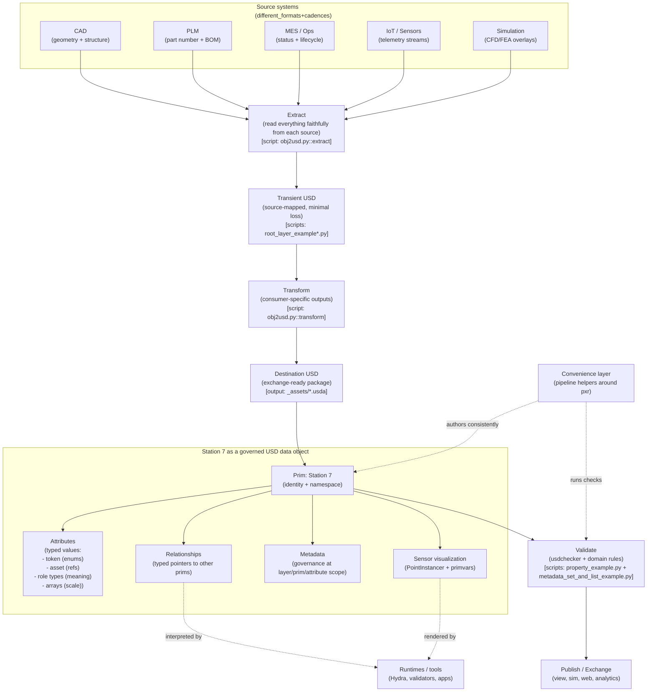

# Building an OpenUSD Pipeline With Data Modeling — Video Deep-Dive Tutorial

**Version**: 1.1.0 | **Date**: 27.02.2026 | **Time**: 08:11 | **GlobalID**: 20260226_2143_USD_GoodStart_002

**Tag block:**
#openusd #usd_core #data_modeling #data_exchange #prim_properties #attributes #relationships #metadata #primvars #pointinstancer #validation #usd_exchange_sdk #digital_twin #best_practices #framework_integration

Click the image to open it full-size; it’s the agenda overview that frames the session topics. Use the YouTube link below to watch the full recording.

**Canonical Video Source:** [YouTube — Building an OpenUSD Pipeline With Data Modeling](https://www.youtube.com/watch?v=LchXZAsjKiU) [[1]](#link-1) — the full session recording; use it for timestamps and to follow the live code demonstrations.  
**Presenter:** Nandu Vellal (with Ashley + Mati from NVIDIA)  
**Speakers (LinkedIn):** [Nandu Vellal](https://www.linkedin.com/in/nandu-vellal/) [[15]](#link-15) · [Ashley Goldstein](https://www.linkedin.com/in/ashleyr-goldstein/) [[16]](#link-16) · [Matias "Mati" Codesal](https://www.linkedin.com/in/matiascodesal/) [[17]](#link-17)  
**Session context:** Week 4 of the OpenUSD certification office hours series (data modeling + data exchange)  
**Primary Learning Backbone:** [NVIDIA Learn OpenUSD](https://docs.nvidia.com/learn-openusd/latest/index.html) [[2]](#link-2)

Use the curriculum as the “hands-on drill” companion to this watch-along tutorial; it is where you practice the exact APIs and concepts shown in the livestream.

---

> **Part of USD GoodStart** — for repo structure and conventions, start with [README.md](../README.md) (it explains the repository layout and how the docs are meant to be used). This tutorial lives in `WIP_Docs`. If you want the “plugin/customization” counterpart session, see: [Customizing_OpenUSD_for_Your_Pipeline__VIDEO_DEEP_DIVE_TUTORIAL.md](./Customizing_OpenUSD_for_Your_Pipeline__VIDEO_DEEP_DIVE_TUTORIAL.md) (it covers schemas/resolvers/file-format plugins — the extensibility layer around the core concepts here).

---
## Before You Start (Quick Setup)

You want:

- A working USD + Python environment
- `usdview` for inspecting results visually

Follow the official setup guide:
- [Learn OpenUSD — Installing usdview and Setting Up Python](https://docs.nvidia.com/learn-openusd/latest/usdview-install-instructions.html) [[3]](#link-3) — use this when you need a reliable `usdview` + Python setup so you can run the API exercises locally.

---
## How This Tutorial Works

This is a two-layer document:

1. **Story layer** — Station 7 evolves chapter by chapter (from “geometry” to “queryable digital twin component”).
2. **Production layer** — adds pipeline decisions, team patterns, and “what to standardize” guidance.

Every chapter ends with a **Learn OpenUSD →** pointer, so you can jump from video concepts to hands-on practice.

### Code companion for this tutorial

All runnable scripts referenced below are in:

- [Building an OpenUSD Pipeline With Data Modeling__usd_cert](./Building%20an%20OpenUSD%20Pipeline%20With%20Data%20Modeling__usd_cert/)

When a chapter has a **Script Lab** block, run those files directly and inspect the generated USD files in `usdview`.

---
## The Story (Station 7)

For this little tutorial deep dive, we added a little plot line and added the idea of the 'station number 7':  
You have a 3D asset — a **welding station** on a factory floor. Call it **Station 7**.

It has CAD geometry, but that’s not what your client is paying for. They want a **digital twin component**:

- PLM part number + BOM link
- Maintenance schedule + lifecycle state + approval status
- Operational status (`running`, `idle`, `faulted`)
- Live readings from **hundreds of sensors**
- Simulation overlays (CFD / thermal / stress) that can be layered in without re-exporting CAD
- A pipeline that keeps all of this consistent even though the source systems update on different cadences

USD is the right container for this. But **USD alone is not a pipeline**.

The missing piece (in many “export to USD” workflows) is the mental model that makes the content *stick*:

> Treat Station 7 not as “a mesh in a file”, but as a **governed data object** whose structure is queryable, typed, composable, and exchangeable.

This tutorial rebuilds the video around that idea — and uses **Station 7** as the running example across every chapter.

---

## The Five-Minute Version (Your Mental Model)

Station 7 becomes real when you can answer five questions in order:

1. **What can a prim actually hold?** ([Chapter 1](#chapter-1)) Exactly two things: 
   - *attributes* (typed values) and 
   - *relationships* (typed pointers). That’s the whole vocabulary. 
2. **What do relationships *do*?** ([Chapter 2](#chapter-2)) Nothing by themselves.
   - They’re data links; 
   - behavior lives in runtimes (Hydra, a validator, your app). 
3. **How do you keep data type-safe?** ([Chapter 3](#chapter-3)) Use `Sdf.ValueTypeNames` deliberately: 
   - *tokens* for enums, 
   - *assets* for external references, 
   - *role types* for semantic meaning, 
   - *arrays* for scale. 
4. **Where does governance live?** ([Chapter 4](#chapter-4)) In **metadata**, 
  scoped correctly 
   - *layer*   vs. 
   - *prim*   vs. 
   - *attribute*  
   -> so it survives composition and exchange. 

5. **How do you exchange reliably?** ([Chapter 6](#chapter-6)) Use the two-phase pattern: 
   - *extract everything faithfully*,  -> then 
   - *transform for each consumer*, -> then 
   - *validate*. 

6. **The missing “framework glue” (the Station 7 welding station idea):** ([Chapter 7](#chapter-7)) you then 
   - wrap these patterns in a small *convenience layer* ->  so every team authors data the same way. 

Each chapter link jumps you directly to the detailed section where Station 7 evolves from “geometry” into a governed, exchangeable data object.

---
Here is the “one picture” version of how the mental model concepts connect when Station 7 becomes a real pipeline artifact:

---

### Mental model support notes (same chart, clearer mapping)

- **Source systems (different_formats+cadences)**   Conversion / Data enrichment Steps -> script legend:
  - **Source systems** [Chapter 0](#chapter-0) -> conceptual input frame (CAD/PLM/MES/IoT/SIM) with no direct connector script in this tutorial.  
  - **Extract** [Chapter 6](#chapter-6) -> [`additional-examples/obj2usd.py`](./Building%20an%20OpenUSD%20Pipeline%20With%20Data%20Modeling__usd_cert/additional-examples/obj2usd.py) (`extract`) ·  
  - **Transient USD** [Chapter 6](#chapter-6) -> [`basic/root_layer_example.py`](./Building%20an%20OpenUSD%20Pipeline%20With%20Data%20Modeling__usd_cert/basic/root_layer_example.py), [`basic/root_layer_example2.py`](./Building%20an%20OpenUSD%20Pipeline%20With%20Data%20Modeling__usd_cert/basic/root_layer_example2.py), [`basic/root_layer_example3.py`](./Building%20an%20OpenUSD%20Pipeline%20With%20Data%20Modeling__usd_cert/basic/root_layer_example3.py) ·  
  - **Transform** [Chapter 6](#chapter-6) -> [`additional-examples/obj2usd.py`](./Building%20an%20OpenUSD%20Pipeline%20With%20Data%20Modeling__usd_cert/additional-examples/obj2usd.py) (`transform`, `set_default_prim`, `set_up_axis`) ·  
  - **Destination USD** [Chapter 6](#chapter-6) -> generated stage files under `_assets/*.usda` from the chapter labs ·  
  - **Validate / publish-readiness** [Chapter 8](#chapter-8) -> [`additional-examples/property_example.py`](./Building%20an%20OpenUSD%20Pipeline%20With%20Data%20Modeling__usd_cert/additional-examples/property_example.py), [`additional-examples/metadata_set_and_list_example.py`](./Building%20an%20OpenUSD%20Pipeline%20With%20Data%20Modeling__usd_cert/additional-examples/metadata_set_and_list_example.py).  
  - **Station 7 object integration** [Chapter 1](#chapter-1) to [Chapter 5](#chapter-5) -> Script Labs for attributes, relationships, value types, metadata, and primvars/instancing.

- **Recommended run path:** merged into the chapter table below so each chapter has one primary Python touchpoint.

---

## Chapter Outcomes at a Glance

The chapter labels are clickable; use them as quick navigation while watching the video.

| Chapter | Conversion / data enrichment step | Core question | Station 7 outcome | Video segment (jump link) | Learn OpenUSD curriculum | Primary Python run path |
|---|---|---|---|---|---|---|
| [Chapter 0](#chapter-0) | Source systems framing | Why is geometry export not enough? | The problem frame: data modeling + data exchange. | [`00:00:02 -> 00:10:16`](https://www.youtube.com/watch?v=LchXZAsjKiU&t=2s) | [NVIDIA Learn OpenUSD - Curriculum Index](https://docs.nvidia.com/learn-openusd/latest/index.html) [[2]](#link-2) — orientation map for the concepts used in this tutorial. | [`basic/create_stage.py`](./Building%20an%20OpenUSD%20Pipeline%20With%20Data%20Modeling__usd_cert/basic/create_stage.py) |
| [Chapter 1](#chapter-1) | Station 7 object integration (attributes) | What can a prim hold? | A precise mental model: attributes vs relationships. | [`00:10:16 -> 00:21:04`](https://www.youtube.com/watch?v=LchXZAsjKiU&t=616s) | [Attributes](https://docs.nvidia.com/learn-openusd/latest/stage-setting/properties/attributes.html) [[4]](#link-4) — author and query typed values on prims. | [`data-types/6a_property_example.py`](./Building%20an%20OpenUSD%20Pipeline%20With%20Data%20Modeling__usd_cert/data-types/6a_property_example.py) |
| [Chapter 2](#chapter-2) | Station 7 object integration (relationships) | What do relationships actually do? | Correct runtime boundary: “links are data, behavior is external.” | [`00:21:04 -> 00:27:34`](https://www.youtube.com/watch?v=LchXZAsjKiU&t=1264s) | [Relationships](https://docs.nvidia.com/learn-openusd/latest/stage-setting/properties/relationships.html) [[5]](#link-5) — author/query typed pointers and targets. | [`data-types/6c_property_example.py`](./Building%20an%20OpenUSD%20Pipeline%20With%20Data%20Modeling__usd_cert/data-types/6c_property_example.py) |
| [Chapter 3](#chapter-3) | Station 7 object integration (typed values) | How do we keep data type-safe? | Robust typing strategy with `Sdf.ValueTypeNames`. | [`00:27:34 -> 00:36:43`](https://www.youtube.com/watch?v=LchXZAsjKiU&t=1654s) | [Custom Properties](https://docs.nvidia.com/learn-openusd/latest/beyond-basics/custom-properties.html) [[6]](#link-6) — create typed custom fields safely. [Glossary](https://docs.nvidia.com/learn-openusd/latest/glossary.html) [[7]](#link-7) — role/type vocabulary reference. | [`data-types/7a_value_types.py`](./Building%20an%20OpenUSD%20Pipeline%20With%20Data%20Modeling__usd_cert/data-types/7a_value_types.py) |
| [Chapter 4](#chapter-4) | Station 7 object integration (metadata governance) | Where does governance belong? | Metadata placement rules at layer/prim/attribute scope. | [`00:38:59 -> 00:44:43`](https://www.youtube.com/watch?v=LchXZAsjKiU&t=2339s) | [Value Resolution](https://docs.nvidia.com/learn-openusd/latest/beyond-basics/value-resolution.html) [[8]](#link-8) — how composition affects where governance should be authored. [Metadata](https://docs.nvidia.com/learn-openusd/latest/stage-setting/metadata.html) [[14]](#link-14) — metadata scope and authoring. | [`data-types/7c_metadata_examples.py`](./Building%20an%20OpenUSD%20Pipeline%20With%20Data%20Modeling__usd_cert/data-types/7c_metadata_examples.py) |
| [Chapter 5](#chapter-5) | Station 7 object integration (primvars + visualization) | How do we visualize field data? | Primvars + PointInstancer pattern for sensor heatmaps. | [`00:44:43 -> 00:56:25`](https://www.youtube.com/watch?v=LchXZAsjKiU&t=2683s) | [Primvars](https://docs.nvidia.com/learn-openusd/latest/beyond-basics/primvars.html) [[9]](#link-9) — interpolated render/analysis data. [Point Instancing (Intro)](https://docs.nvidia.com/learn-openusd/latest/asset-modularity-instancing/authoring-point-instancing/point-instancing-intro.html) [[10]](#link-10) — scalable repeated-instance pattern. | [`data-types/8a_primvars_example.py`](./Building%20an%20OpenUSD%20Pipeline%20With%20Data%20Modeling__usd_cert/data-types/8a_primvars_example.py), [`data-types/8b_primvars_pointcloud_cloth.py`](./Building%20an%20OpenUSD%20Pipeline%20With%20Data%20Modeling__usd_cert/data-types/8b_primvars_pointcloud_cloth.py) |
| [Chapter 6](#chapter-6) | Extract -> transient -> transform -> destination | How does data exchange scale? | Two-phase design: extract -> transform -> validate. | [`00:56:47 -> 01:06:25`](https://www.youtube.com/watch?v=LchXZAsjKiU&t=3407s) | [Data Exchange (Module)](https://docs.nvidia.com/learn-openusd/latest/data-exchange/index.html) [[11]](#link-11) — end-to-end exchange framing. [Data Extraction](https://docs.nvidia.com/learn-openusd/latest/data-exchange/data-extraction/what-is-data-extraction.html) [[12]](#link-12) — preserve source fidelity first. [Asset Validation](https://docs.nvidia.com/learn-openusd/latest/data-exchange/asset-validation/what-is-asset-validation.html) [[13]](#link-13) — define exchange trust checks. | [`additional-examples/obj2usd.py`](./Building%20an%20OpenUSD%20Pipeline%20With%20Data%20Modeling__usd_cert/additional-examples/obj2usd.py) |
| [Chapter 7](#chapter-7) | Convenience-layer standardization | How do teams stay consistent? | “Convenience layer” principle for reusable pipeline helpers. | [`01:06:25 -> 01:10:51`](https://www.youtube.com/watch?v=LchXZAsjKiU&t=3985s) | [Data Exchange (Module)](https://docs.nvidia.com/learn-openusd/latest/data-exchange/index.html) [[11]](#link-11) — production pattern references for reusable helpers. | [`additional-examples/obj2usd.py`](./Building%20an%20OpenUSD%20Pipeline%20With%20Data%20Modeling__usd_cert/additional-examples/obj2usd.py), [`data-types/7a_value_types.py`](./Building%20an%20OpenUSD%20Pipeline%20With%20Data%20Modeling__usd_cert/data-types/7a_value_types.py) |
| [Chapter 8](#chapter-8) | Validate and publish-readiness | What breaks in production? | Edge cases: `over`, validation, instancing limits, naming. | [`01:10:51 -> 01:14:35`](https://www.youtube.com/watch?v=LchXZAsjKiU&t=4251s) | [Asset Validation](https://docs.nvidia.com/learn-openusd/latest/data-exchange/asset-validation/what-is-asset-validation.html) [[13]](#link-13) — practical validation gates for handoff safety. | [`additional-examples/property_example.py`](./Building%20an%20OpenUSD%20Pipeline%20With%20Data%20Modeling__usd_cert/additional-examples/property_example.py) |

---

## Chapter 0 — Why Data Modeling + Data Exchange Exists (and Why You Care)

Station 7 starts life as “just geometry.” This chapter frames why that is not enough — and why data modeling and data exchange are the two forces that turn a welding station export into a durable digital twin component. You’re setting the problem boundary before you touch any APIs.

> **Station 7 — Chapter 0: Why does geometry export not solve the problem?**  
> Station 7 does not exist in USD yet as a trustworthy data object — it exists as a mesh plus a growing list of downstream demands. This chapter is the “why” that makes the rest of the tutorial stick: the goal is a queryable, governable, exchangeable component, not a pretty export.

Click the slide to open it full-size; it shows the session’s topic frame and why the talk is structured as “data modeling first, data exchange second.”

**The production problem:** your organization wants Station 7 to be a durable data object that downstream tools can query and trust.

This forces you to separate two questions:

- **Data modeling:** what *meaning* do we author into USD?
- **Data exchange:** how do we move meaning across systems reliably?

USD gives you composition, namespacing, typing, and tooling — but the pipeline discipline is still on you.

**Learn OpenUSD →** Start with the basics of properties first: **Attributes** (typed values you can author/query) [[4]](#link-4) and **Relationships** (typed pointers between prims) [[5]](#link-5).

### Script Lab (Chapter 0)

- [basic/create_stage.py](./Building%20an%20OpenUSD%20Pipeline%20With%20Data%20Modeling__usd_cert/basic/create_stage.py) — create and inspect a first stage file.
- [basic/open_stage.py](./Building%20an%20OpenUSD%20Pipeline%20With%20Data%20Modeling__usd_cert/basic/open_stage.py) — open, edit, and resave a stage.
- [basic/in_mem_stage.py](./Building%20an%20OpenUSD%20Pipeline%20With%20Data%20Modeling__usd_cert/basic/in_mem_stage.py) — practice in-memory authoring then export.
- [basic/root_layer_example.py](./Building%20an%20OpenUSD%20Pipeline%20With%20Data%20Modeling__usd_cert/basic/root_layer_example.py) — inspect root layer and add sublayers.

---

## Chapter 1 — Prim Properties: Attributes vs Relationships (The Only Vocabulary You Get)

Now Station 7 becomes more than geometry: it becomes a prim you can interrogate. This chapter gives you the only two “containers of meaning” you have in USD — and shows how every modeling decision reduces to one of them. Once this is internalized, most data-modeling questions stop being vague.

> **Station 7 — Chapter 1: What can a prim actually hold?**  
> Every “data modeling” decision is either an **attribute** question (“what typed value do we store?”) or a **relationship** question (“what other thing do we point to?”). There is no third bucket — which is why this chapter becomes your mental anchor for everything that follows.

Click the slide to open it full-size; it lists the key prim-property calls (`GetProperties`, `GetAuthoredProperties`) and the relationship edit methods (`SetTargets`, `AddTarget`, `RemoveTarget`).

For Station 7, every modeling decision becomes one of these two:

### Attributes (typed values)

Examples on Station 7:

- `station7:status` (token)
- `station7:plmPartNumber` (string)
- `station7:maxRatedCurrentAmps` (float)
- `station7:maintenanceDueDate` (string or int timestamp, depending on your governance rules)

Key API ideas (Python):

- **Inspect properties:** `prim.GetProperties()` vs `prim.GetAuthoredProperties()`
- **Access values:** you usually “get the attribute object” first, then `Get()` / `Set()` values
- **Prefer schema APIs when they exist:** (e.g. `UsdGeom` convenience getters over raw `UsdAttribute` lookups)

### Relationships (typed pointers)

Examples on Station 7:

- relationship to “material” prim(s)
- relationship to BOM item(s) represented in another namespace / layer
- relationship to a “sensor group” prim (which your runtime knows how to interpret)

Key API ideas:

- Create and edit: `prim.CreateRelationship()` then `SetTargets()` / `AddTarget()` / `RemoveTarget()`

**Production takeaway:** if you can’t express it as an attribute or relationship, you’re probably trying to put behavior into USD. Put behavior in the runtime ([Chapter 2](#chapter-2)).

**Learn OpenUSD →** Use **Attributes** for “what values does Station 7 hold?” [[4]](#link-4) and **Relationships** for “what does Station 7 point to?” [[5]](#link-5).

### Script Lab (Chapter 1)

- [data-types/6a_property_example.py](./Building%20an%20OpenUSD%20Pipeline%20With%20Data%20Modeling__usd_cert/data-types/6a_property_example.py) — list all prim properties and distinguish attribute vs relationship.
- [data-types/6b_property_example.py](./Building%20an%20OpenUSD%20Pipeline%20With%20Data%20Modeling__usd_cert/data-types/6b_property_example.py) — inspect authored attributes and compare raw vs schema-based access.

---

## Chapter 2 — Relationships Don’t *Do* Anything (and That’s the Point)

Station 7 now has links — but links are not behavior. This chapter locks in the runtime boundary: USD stores intent and connectivity, while renderers/validators/apps decide what those links *mean* operationally. This is the difference between a stable data model and accidental “magic.”

> **Station 7 — Chapter 2: What do connections actually do?**  
> A relationship stores a target path and composes like any other opinion — but it does not execute. When you link Station 7 to a maintenance record, the USD file now *knows the pointer*; your runtime decides whether that opens a UI panel, runs a validator, or drives a simulation input.

The session repeatedly highlights a subtle but critical point:

> A relationship is a **pointer**, not an instruction.

So “grouping” prims via a relationship does nothing unless:

- a renderer interprets it (e.g. `material:binding`)
- a validator checks it (“every station must link to exactly one BOM item”)
- your app/runtime reads it (“show all sensors attached to Station 7”)

**Station 7 pattern:** relationships are how you keep your stage modular.

- CAD geometry can live in one layer.
- PLM structure can live in another.
- Sensors can be authored as an instanced cloud in yet another.
- Station 7 ties them together via relationships that your runtime understands.

**Learn OpenUSD →** Re-read the relationships doc as “data graph edges” (links you can validate and query), not “features that execute by themselves.” [[5]](#link-5)

### Script Lab (Chapter 2)

- [data-types/6c_property_example.py](./Building%20an%20OpenUSD%20Pipeline%20With%20Data%20Modeling__usd_cert/data-types/6c_property_example.py) — create, edit, and query relationship targets (`SetTargets`, `AddTarget`, `RemoveTarget`).

---

## Chapter 3 — Attribute Value Types (Type-Safety Is a Pipeline Feature)

Station 7 gains its first “real” business meaning here: status fields, IDs, and references you can trust. This chapter is about choosing types deliberately so downstream tools don’t drown in string chaos. If you get this wrong, data exchange fails quietly and expensively.

> **Station 7 — Chapter 3: What type should the data be?**  
> A status like `running` is not “just a string.” If it is a plain string, casing and spelling drift will break queries across tools. This chapter turns that into discipline: **tokens** for enum-like values, **assets** for references, and **role types** for “floats with semantic meaning.”

Click the slide to open it full-size; it summarizes basic value types (including `token` and `asset`) and the role-based types that preserve semantic meaning across converters.

If you model Station 7 with “random strings everywhere”, you’ll ship fragile data.

This chapter’s core discipline is: **choose the correct `Sdf.ValueTypeNames`**.

### A practical Station 7 type palette

- **Token** for enum-like values (`running`, `idle`, `faulted`) to avoid case/typo drift.
- **Asset** for external references (PDF manuals, test reports, CAD originals) — designed to participate in asset resolution.
- **Role-based types** (`Point3f`, `Normal3f`, `Color3f`, `TexCoord2f`) when the numeric data carries semantic meaning.
- **Arrays** for scale (hundreds of sensor values, large point clouds, etc.).

**Design rule:** if downstream tools must reason about a value (filter, validate, visualize, search), give it a stable type and a stable namespace.

**Learn OpenUSD →** If you want to practice authoring typed, custom fields, use the **Custom Properties** module — it focuses on the exact “add domain fields safely” problem this chapter is about. [[6]](#link-6)

### Script Lab (Chapter 3)

- [data-types/7a_value_types.py](./Building%20an%20OpenUSD%20Pipeline%20With%20Data%20Modeling__usd_cert/data-types/7a_value_types.py) — author scalar, token, asset, role, matrix, and array value types.
- [basic/vtarray_example.py](./Building%20an%20OpenUSD%20Pipeline%20With%20Data%20Modeling__usd_cert/basic/vtarray_example.py) — convert between Python/Numpy buffers and USD `Vt` arrays.
- [additional-examples/attributes_example_lowlevel.py](./Building%20an%20OpenUSD%20Pipeline%20With%20Data%20Modeling__usd_cert/additional-examples/attributes_example_lowlevel.py) — low-level `Sdf` attribute authoring and metadata assignment.

---

## Chapter 4 — Metadata: Where Governance Actually Belongs

Station 7 is now typed — but not yet governed. This chapter is where you decide what must persist through composition and exchange (ownership, lifecycle, provenance), and where to author it so it doesn’t get lost. It’s how you stop “pipeline meaning” from evaporating when layers compose.

> **Station 7 — Chapter 4: Who put that data there, and does it belong?**  
> Governance data is not render data. It belongs in metadata (layer vs prim vs attribute scope), and scope determines whether it survives composition. This chapter helps you decide what must be authored into USD versus what should remain in a sidecar with a link.

USD gives you multiple scopes for metadata:

1. **Layer metadata** (stage-level intent and exchange context)
2. **Prim metadata** (object-level governance)
3. **Attribute metadata** (field-level governance)

For Station 7, governance questions include:

- What system authored this value?
- When was it last updated?
- What’s the confidence / approval state?
- Is this value “for render” or “for operations”?

**The authoring rule:** put governance where it can survive composition.

- If it must survive *any* composition graph, layer metadata is often safest.
- If it is intrinsic to Station 7 as a digital twin component, prim metadata fits.
- If it is intrinsic to one field (like an accuracy tolerance), attribute metadata fits.

**Learn OpenUSD →** If metadata placement still feels abstract, the **Value Resolution** module explains how opinions compose through layers and why authored values can appear to “change” depending on the stack. [[8]](#link-8)

### Script Lab (Chapter 4)

- [data-types/7c_metadata_examples.py](./Building%20an%20OpenUSD%20Pipeline%20With%20Data%20Modeling__usd_cert/data-types/7c_metadata_examples.py) — compare metadata patterns across layer, prim, and attribute scopes.
- [additional-examples/custom_metadata_example.py](./Building%20an%20OpenUSD%20Pipeline%20With%20Data%20Modeling__usd_cert/additional-examples/custom_metadata_example.py) — inspect authored metadata and nested `customData`.
- [additional-examples/customdata_layer_prim_example.py](./Building%20an%20OpenUSD%20Pipeline%20With%20Data%20Modeling__usd_cert/additional-examples/customdata_layer_prim_example.py) — side-by-side layer/prim/attribute custom data usage.
- [additional-examples/metadata_vs_customdata_example.py](./Building%20an%20OpenUSD%20Pipeline%20With%20Data%20Modeling__usd_cert/additional-examples/metadata_vs_customdata_example.py) — clarify `SetMetadata(...)` vs `SetCustomData(...)`.

---

## Chapter 5 — Primvars + PointInstancer (How You Visualize 500 Sensors Without 500 Prims)

Station 7 is now a data object — but you still need to *see* field data without exploding your scenegraph. This chapter introduces the “sensor heatmap” pattern: primvars carry the values, and point instancing gives you scale. It’s the bridge from “data model” to “visual insight.”

> **Station 7 — Chapter 5: How do you visualize a factory’s worth of telemetry?**  
> You are not going to author 500 sensor prims by hand. The scalable pattern is: one prototype marker + N instances + per-instance primvars (e.g. `displayColor`). The colored grid demo is the same backbone you reuse for temperature maps, anomaly markers, and inspection overlays.

Click the slide to open it full-size; it explains primvar interpolation modes and why point instancing is the core pattern for “lots of small things with per-instance state.”

Click the slide to open it full-size; it shows the concrete authoring pattern for creating a primvar, setting its values, then reading it back — the exact API flow you reuse for sensor visualization.

Primvars solve the problem: “values vary across a surface/volume, and renderers can use them.”

Point instancing solves the problem: “I have *lots* of similar things with per-instance state.”

**Station 7 sensor heatmap pattern (high level):**

- Define one prototype sphere (a single prim).
- Create a `PointInstancer` with N instances (N = number of sensors).
- Author per-instance values (e.g. `displayColor`) so you can render temperature or anomaly state.

Click the screenshot to open it full-size; it shows a real `usdview` inspection of an instanced point grid, which is the visualization backbone you can reuse for “500 sensors on the factory floor.”

**Production takeaway:** “sensors” should be a pattern, not an object explosion.

**Learn OpenUSD →** Use **Primvars** for authoring interpolated per-primitive data [[9]](#link-9), and **Point Instancing (Intro)** for the prototype/instance model that makes large sensor clouds practical. [[10]](#link-10)

### Script Lab (Chapter 5)

- [data-types/8a_primvars_example.py](./Building%20an%20OpenUSD%20Pipeline%20With%20Data%20Modeling__usd_cert/data-types/8a_primvars_example.py) — create mesh primvars with explicit interpolation.
- [additional-examples/primvars_pointcloud.py](./Building%20an%20OpenUSD%20Pipeline%20With%20Data%20Modeling__usd_cert/additional-examples/primvars_pointcloud.py) — build a point-instanced cloud with per-instance primvar color.
- [data-types/8b_primvars_pointcloud_cloth.py](./Building%20an%20OpenUSD%20Pipeline%20With%20Data%20Modeling__usd_cert/data-types/8b_primvars_pointcloud_cloth.py) — scale to a dense instancer grid with varying primvars.
- [data-types/9a_primvars_multi_example.py](./Building%20an%20OpenUSD%20Pipeline%20With%20Data%20Modeling__usd_cert/data-types/9a_primvars_multi_example.py) — combine primvars with time-sampled mesh deformation.

---

## Chapter 6 — Data Exchange: Extract → Transform → Validate (The Only Scalable Pattern)

Station 7 is now richly modeled — but it is still useless if you can’t produce it reliably from your real systems. This chapter turns the story into a pipeline: extract faithfully, transform per consumer, validate every output. It’s where industrial reality (multiple source systems) meets USD discipline.

> **Station 7 — Chapter 6: Where does the data actually come from?**  
> Station 7’s geometry comes from CAD, its status from MES, and its part identity from PLM — none of which speaks USD natively. The two-phase pattern prevents rework: **extract** for source fidelity, **transform** for each consumer, then **validate** so downstream teams can trust the result.

Click the slide to open it full-size; it lists why exchange is hard in practice (lossy mappings, differing customer needs, and differing runtime constraints).

**The hard truth:** converting between 3D ecosystems is often lossy, and customer needs differ.

So you don’t aim for a single “perfect conversion”. You aim for a **reproducible process**:

1. **Extract:** bring everything from the source system into a transient USD representation as faithfully as possible.
2. **Transform:** derive one or more “destination” assets optimized for specific consumers (realtime viewer, simulation, web, analytics).
3. **Validate:** prove the outputs meet your exchange contract (naming, units, required fields, schema compliance, etc.).

Click the slide to open it full-size; it visualizes the extract → transient → transform chain that keeps your pipeline flexible when requirements inevitably change.

**Station 7 implication:** CAD, PLM, and MES can all feed the same Station 7 *identity*, but you should still keep extraction faithful and transformations consumer-specific.

**Learn OpenUSD →** Use the Data Exchange module as your reference backbone [[11]](#link-11), then read **Data Extraction** for the “extract everything first” mindset [[12]](#link-12) and **Asset Validation** for the “prove correctness” mindset. [[13]](#link-13)

### Script Lab (Chapter 6)

- [additional-examples/obj2usd.py](./Building%20an%20OpenUSD%20Pipeline%20With%20Data%20Modeling__usd_cert/additional-examples/obj2usd.py) — concrete extract/transform pipeline skeleton (advanced setup required).
- [basic/root_layer_example2.py](./Building%20an%20OpenUSD%20Pipeline%20With%20Data%20Modeling__usd_cert/basic/root_layer_example2.py) — author into layered outputs and inspect composition boundaries.
- [basic/root_layer_example3.py](./Building%20an%20OpenUSD%20Pipeline%20With%20Data%20Modeling__usd_cert/basic/root_layer_example3.py) — remove a sublayer to observe impact and validate assumptions.

---

## Chapter 7 — The “Convenience Layer” (Why Station 7 Was Invented)

Station 7 exists because teams forget abstractions but remember workflows. This chapter explains how you turn the chapter concepts into a small, reusable authoring layer so every asset is authored consistently without re-learning the full USD API every time. Consistency is the product feature here.

> **Station 7 — Chapter 7: Can you do this for a hundred stations?**  
> The first Station 7 script works; the second engineer’s version will differ unless you standardize. A convenience layer is how you encode your pipeline’s opinions (naming, defaults, required fields, validation gates) so “the right output” is produced by default.

The video teaches core APIs. Your production problem is different:

> How do you ensure *every* asset becomes “Station 7-quality” without everyone reinventing the same authoring patterns?

This is where you introduce a small **convenience layer** — a pipeline-owned library that:

- Applies consistent namespaces (`station7:*`, `plm:*`, `mes:*`, `sim:*`)
- Authors attributes with the correct `Sdf.ValueTypeNames`
- Creates relationships using known link contracts (e.g. `rel:bomItem`, `rel:sensorCloud`, `material:binding`)
- Writes governance metadata consistently (source system, timestamp, approval state)
- Runs validation checks and produces human-readable reports

**The key principle:** a convenience layer is not “more abstraction”. It’s **standardization so data stays queryable**.

### Where the USD Exchange SDK fits

The session calls out NVIDIA’s USD Exchange SDK as a set of higher-level helpers built on `pxr` APIs.

Click the slide to open it full-size; it summarizes what the USD Exchange SDK provides and how it can act as a “pattern library” for your own convenience layer.

Treat it as:

- A *reference implementation* for “developer-ready authoring helpers”
- A source of patterns for your own convenience layer

**Learn OpenUSD →** Keep the core `pxr` API mental model; use helpers only after you understand what they wrap.

To ground that mental model in the curriculum, review the data exchange lessons that define the pipeline vocabulary and the “trust contract” behind validation:

- [Learn OpenUSD — Data Exchange (Module)](#link-11) — expect the end-to-end framing of extract → transform → validate, and when you should create transient vs destination artifacts.
- [Learn OpenUSD — What Is Data Extraction?](#link-12) — expect the rationale for “extract everything faithfully” before you specialize outputs; use it to justify your transient layer design.
- [Learn OpenUSD — What Is Asset Validation?](#link-13) — expect a definition of what “valid” means in exchange, and how checks (like `usdchecker`) fit into CI and handoff gates.

### Script Lab (Chapter 7)

- [additional-examples/obj2usd.py](./Building%20an%20OpenUSD%20Pipeline%20With%20Data%20Modeling__usd_cert/additional-examples/obj2usd.py) — review helper functions (`set_default_prim`, `set_up_axis`) as convenience-layer patterns.
- [data-types/7a_value_types.py](./Building%20an%20OpenUSD%20Pipeline%20With%20Data%20Modeling__usd_cert/data-types/7a_value_types.py) + [data-types/7c_metadata_examples.py](./Building%20an%20OpenUSD%20Pipeline%20With%20Data%20Modeling__usd_cert/data-types/7c_metadata_examples.py) — source examples to wrap into your own standardized authoring helper.

---

## Chapter 8 — Production Edge Cases (What Breaks First)

Station 7 is now pipeline-shaped — so this chapter stress-tests it. These are the failure modes you hit first in real exchange workflows: units, naming, authored vs default values, and when to use `over` instead of redefining. This is where you turn “it works on my machine” into “it survives handoff.”

> **Station 7 — Chapter 8: What happens when reality hits it?**  
> The first breakages are rarely “USD bugs.” They are pipeline contract problems: missing units, invalid identifiers, unclear layer intent, and validation gaps. This chapter gives you the list of edge cases to design for early, so exchange stays boring and predictable.

These are the issues that tend to appear immediately once Station 7 enters a real pipeline:

1. **Authored vs default values:** `GetAuthored*()` often answers the question you actually mean (“what did we author?”).
2. **Units + axis:** missing `upAxis` / `metersPerUnit` is a common exchange bug — validation should catch it.
3. **Naming:** source systems love illegal USD identifiers; sanitization must be deterministic.
4. **`over` vs `def`:** “change only opinions, don’t redefine identity” — but the correct choice depends on layer intent.
5. **Instancing limitations:** instancing is great for repeated geometry, but unique animation / unique topology changes the tradeoffs.

Click the slide to open it full-size; it ties conceptual data mapping to validation tooling so you can document conversions and prove correctness.

**Practical takeaway:** treat validation as part of exchange, not a “nice to have.”

**Learn OpenUSD →** Use the Asset Validation module to understand what “valid” means for exchange workflows (beyond “it opens in usdview”). [[13]](#link-13)

### Script Lab (Chapter 8)

- [additional-examples/property_example.py](./Building%20an%20OpenUSD%20Pipeline%20With%20Data%20Modeling__usd_cert/additional-examples/property_example.py) — inspect authored state and property stack behavior for debugging.
- [basic/root_layer_example3.py](./Building%20an%20OpenUSD%20Pipeline%20With%20Data%20Modeling__usd_cert/basic/root_layer_example3.py) — rehearse composition edits and check downstream effects.
- [additional-examples/metadata_set_and_list_example.py](./Building%20an%20OpenUSD%20Pipeline%20With%20Data%20Modeling__usd_cert/additional-examples/metadata_set_and_list_example.py) — audit authored metadata for exchange-governance checks.

---

## Capstone: Station 7 as a USD Digital Twin Component (Checklist)

Use this as a “definition of done” for your Station 7 authoring pass:

- Station 7 prim exists with a stable path and a stable namespace strategy.
- Geometry is referenced (not duplicated) where feasible.
- Typed attributes exist for status, IDs, and physical parameters.
- Relationships connect Station 7 to BOM/PLM and to sensor visualization prims.
- Governance metadata is authored at correct scope (layer vs prim vs attribute).
- Sensor visualization uses PointInstancer + per-instance primvars, not 500 separate prim definitions.
- Extract/transform/validate steps exist (even if manual at first).
- `usdchecker` (or an equivalent validator) runs in CI or pre-publish.

---

## If You Remember Only 12 Things

1. A prim holds **attributes** and **relationships** ([Learn OpenUSD — Attributes](#link-4) — how values are authored/queried, and [Learn OpenUSD — Relationships](#link-5) — how pointers are authored/queried).
2. Attributes are typed values; relationships are typed pointers ([Learn OpenUSD — Attributes](#link-4) — the property/value model, and [Learn OpenUSD — Relationships](#link-5) — target paths and composition).
3. Distinguish **authored opinions** from schema defaults ([Learn OpenUSD — Value Resolution](#link-8) — explains how opinions are composed and why “default vs authored” changes what you see).
4. Relationships do not execute behavior; runtimes interpret them ([Learn OpenUSD — Relationships](#link-5) — shows what relationships store and how tools query targets).
5. Use tokens for enum-like values ([Learn OpenUSD — Custom Properties](#link-6) — where tokens fit in `Sdf.ValueTypeNames`, and how to author them safely).
6. Use assets for external references instead of embedding everything ([Learn OpenUSD — Custom Properties](#link-6) — how `asset` paths are represented and why they belong in the data model).
7. Role types preserve spatial meaning (`Point3f` is not just `float3`) ([Learn OpenUSD — Glossary](#link-7) — clarifies role types and the semantics they carry across tools).
8. Governance belongs in metadata (layer/prim/attribute scopes) ([Learn OpenUSD — Metadata](#link-14) — a practical map of where metadata lives and how it is authored).
9. Primvars carry field data that renderers understand ([Learn OpenUSD — Primvars](#link-9) — what primvars are and how interpolation changes meaning).
10. PointInstancer scales many markers with per-instance state ([Learn OpenUSD — Authoring Point Instancing (Intro)](#link-10) — prototype/instance patterns for large counts).
11. Extract once, transform many ([Learn OpenUSD — Data Exchange (Module)](#link-11) — overall model, and [Learn OpenUSD — What Is Data Extraction?](#link-12) — why you preserve source fidelity first).
12. Validation is the exchange trust contract ([Learn OpenUSD — What Is Asset Validation?](#link-13) — what “valid” means and how `usdchecker` fits into exchange workflows).

## Digital Twin Scenarios Where This Applies

Six concrete scenarios that map directly onto the patterns in this tutorial. Each USD technique links back to the relevant Learn OpenUSD curriculum section.

### 1) Factory telemetry heatmap (temperature / vibration / throughput)

- **USD technique:** PointInstancer + primvars (`displayColor`) — one prototype, N instances, per-instance color encoding sensor value
- **Learn OpenUSD:** [Primvars](https://docs.nvidia.com/learn-openusd/latest/beyond-basics/primvars.html) [[8]](#link-8) · [Authoring Point Instancing](https://docs.nvidia.com/learn-openusd/latest/asset-modularity-instancing/authoring-point-instancing/point-instancing-intro.html) [[9]](#link-9)
- **Pipeline note:** the telemetry overlay lives in its own layer; it never touches the stable asset layer
- **Small story:** A line supervisor opens the “Station 7” stage during a shift-change and sees one corner of the cell slowly turning from green to orange. They pause the line for a quick bearing check *before* vibration becomes a hard stop.

### 2) CFD / FEA result overlays (stress, thermal fields, deformation)

- **USD technique:** primvars on meshes (`faceVarying`/`vertex`) + time-sampled values when needed
- **Learn OpenUSD:** [Primvars](https://docs.nvidia.com/learn-openusd/latest/beyond-basics/primvars.html) [[8]](#link-8)
- **Pipeline note:** simulation outputs are `over` opinions layered on top of the stable geometry; the separation is what lets you swap simulations without editing the base asset
- **Small story:** An engineer compares two what-if runs on the same assembly: “new bracket” vs “old bracket.” They flip between overlay layers and immediately spot a hotspot migrating toward a bolt pattern, triggering a design change before the next prototype build.

### 3) Facilities / HVAC / building operations (assets + maintenance docs)

- **USD technique:** token attributes for state (`status = "maintenance"`) + `asset` attributes for documents (PDF/SOP)
- **Learn OpenUSD:** [Custom Properties](https://docs.nvidia.com/learn-openusd/latest/beyond-basics/custom-properties.html) [[7]](#link-7)
- **Pipeline note:** state overlays update at runtime cadence; the stable building model updates only when the physical facility changes
- **Small story:** A technician scans a QR code on an air handler and the viewer jumps to the exact prim. Its `status` is already set to `"maintenance"`, and the SOP PDF opens from the linked `asset` attribute—no guessing which manual applies to this unit.

### 4) PLM/ERP traceability (BOM IDs, serial numbers, ownership, change history)

- **USD technique:** prim `customData` dictionaries for IDs + relationships for “joins” between prims and enterprise entities
- **Learn OpenUSD:** [Relationships](https://docs.nvidia.com/learn-openusd/latest/stage-setting/properties/relationships.html) [[6]](#link-6) · [Metadata](https://docs.nvidia.com/learn-openusd/latest/stage-setting/metadata.html) [[23]](#link-23)
- **Pipeline note:** write a conceptual mapping document for every source system — this is the contract Nandu describes at 1:00:47
- **Small story:** A quality issue comes in from the field with one serial number. In the stage, that serial resolves to a specific sub-assembly prim, which links (via relationships) to the PLM change record and the supplier batch—so the team can scope the recall to *only* affected units.

### 5) Large-scale inspection markers (thousands of anomalies across a site)

- **USD technique:** PointInstancer for markers + primvars for severity/classification
- **Learn OpenUSD:** [Authoring Point Instancing](https://docs.nvidia.com/learn-openusd/latest/asset-modularity-instancing/authoring-point-instancing/point-instancing-intro.html) [[9]](#link-9)
- **Pipeline benefit:** regenerate the entire overlay from a CSV/DB query without touching the base asset
- **Small story:** After a drone flight, a detection job writes 12,000 “issue pins” as a fresh overlay layer. The inspection lead filters by severity and plans tomorrow’s walking route, confident the pins can be regenerated after every new scan without anyone hand-editing the scene.

### 6) LiDAR / point cloud derived context (classification + intensity)

- **USD technique:** point instancing for large counts + primvars for per-point attributes (intensity, classification, return number)
- **Learn OpenUSD:** [Authoring Point Instancing](https://docs.nvidia.com/learn-openusd/latest/asset-modularity-instancing/authoring-point-instancing/point-instancing-intro.html) [[9]](#link-9)
- **Pipeline note:** treat the point cloud as a data product (overlay layer), not a manually-edited asset
- **Small story:** A retrofit team loads last week’s LiDAR capture as an overlay layer and immediately sees where “as-designed” and “as-built” diverge around a conduit run. They adjust the install plan on-site, without ever touching the authoritative building geometry layer.

## See Also

- [Customizing_OpenUSD_for_Your_Pipeline__VIDEO_DEEP_DIVE_TUTORIAL.md](./Customizing_OpenUSD_for_Your_Pipeline__VIDEO_DEEP_DIVE_TUTORIAL.md) — the companion deep-dive on schemas, resolvers, and file format plugins. Use it when you’re ready to extend USD itself rather than just author data into stages.

---

## Links

1. [YouTube — Building an OpenUSD Pipeline With Data Modeling](https://www.youtube.com/watch?v=LchXZAsjKiU) — the full livestream recording this tutorial is based on. Use it as a watch-along to see the live code-driven explanations.
2. [NVIDIA Learn OpenUSD — Curriculum Index](https://docs.nvidia.com/learn-openusd/latest/index.html) — the authoritative course hub for practicing the concepts from the video. Use it to turn “I understand the talk” into “I can author this in code.”
3. [Learn OpenUSD — Installing usdview and Setting Up Python](https://docs.nvidia.com/learn-openusd/latest/usdview-install-instructions.html) — a step-by-step setup guide for getting `usdview` and Python ready. Use it if you need a clean baseline before running exercises.
4. [Learn OpenUSD — Attributes](https://docs.nvidia.com/learn-openusd/latest/stage-setting/properties/attributes.html) — how to author, query, and reason about typed values on prims. This is the foundation for Station 7’s status fields and IDs.
5. [Learn OpenUSD — Relationships](https://docs.nvidia.com/learn-openusd/latest/stage-setting/properties/relationships.html) — how to author and inspect links between prims. This is the foundation for “Station 7 links to BOM/material/sensors” patterns.
6. [Learn OpenUSD — Custom Properties](https://docs.nvidia.com/learn-openusd/latest/beyond-basics/custom-properties.html) — how to create your own properties and choose appropriate value types. Use it to move beyond “geometry only” into domain data modeling.
7. [Learn OpenUSD — Glossary](https://docs.nvidia.com/learn-openusd/latest/glossary.html) — a quick vocabulary reference for USD terminology used throughout the session. Use it when a term is familiar-but-fuzzy.
8. [Learn OpenUSD — Value Resolution](https://docs.nvidia.com/learn-openusd/latest/beyond-basics/value-resolution.html) — explains how authored opinions resolve through layer stacks and composition. Use it to decide where metadata belongs and why it sometimes “disappears.”
9. [Learn OpenUSD — Primvars](https://docs.nvidia.com/learn-openusd/latest/beyond-basics/primvars.html) — explains primvars, interpolation, and how renderers consume them. Use it for heatmaps, per-vertex/per-face values, and data-driven visualization.
10. [Learn OpenUSD — Authoring Point Instancing (Intro)](https://docs.nvidia.com/learn-openusd/latest/asset-modularity-instancing/authoring-point-instancing/point-instancing-intro.html) — introduces `PointInstancer` and the prototype/instance mental model. Use it to scale “hundreds of similar things” like sensors without scenegraph bloat.
11. [Learn OpenUSD — Data Exchange (Module)](https://docs.nvidia.com/learn-openusd/latest/data-exchange/index.html) — the end-to-end module framing extraction, transformation, and validation. Use it as the reference spine when designing exchange pipelines.
12. [Learn OpenUSD — What Is Data Extraction?](https://docs.nvidia.com/learn-openusd/latest/data-exchange/data-extraction/what-is-data-extraction.html) — explains the extraction phase and why you should capture source fidelity first. Use it to justify the “extract everything” step in your pipeline design.
13. [Learn OpenUSD — What Is Asset Validation?](https://docs.nvidia.com/learn-openusd/latest/data-exchange/asset-validation/what-is-asset-validation.html) — explains what validation means in USD exchange workflows. Use it to define checks that make your outputs trustworthy for downstream teams.
14. [Learn OpenUSD — Metadata](https://docs.nvidia.com/learn-openusd/latest/stage-setting/metadata.html) — explains how metadata is authored and scoped (layer/prim/property) so governance data survives composition and exchange.
15. [LinkedIn — Nandu Vellal](https://www.linkedin.com/in/nandu-vellal/) — presenter profile for deeper context on data modeling and exchange topics from the session.
16. [LinkedIn — Ashley Goldstein](https://www.linkedin.com/in/ashleyr-goldstein/) — speaker profile referenced in the office hours context for this tutorial.
17. [LinkedIn — Matias "Mati" Codesal](https://www.linkedin.com/in/matiascodesal/) — speaker profile referenced in the office hours context for this tutorial.

---

## Appendix — Key Timestamps (Short Traceability Map)

Use this as a quick “where in the video did this idea come from?” index. It is intentionally short: enough to trace key claims, not enough to become a transcript.

- `00:00:02 → 00:10:16` — Session setup + certification context; helps you understand why the talk is organized around exam topics (data modeling and data exchange).
- `00:10:16` — Prim properties begin: the entire session’s mental model collapses to attributes (values) vs relationships (pointers).
- `~00:14:54 → 00:16:25` — Default vs authored opinions: why `GetAuthored*()` often answers the pipeline question you actually mean (“what did we author?”).
- `00:21:04` — Relationships section begins: creating links, setting targets, and querying them.
- `00:26:18` — Critical clarification: relationships don’t execute behavior; runtimes interpret them (renderer, validator, application logic).
- `00:27:34` — Value types begin: `Sdf.ValueTypeNames`, including tokens/assets and role-based types (floats with meaning).
- `00:38:59` — Metadata begins: layer vs prim vs attribute scope; where governance data belongs and why scope matters for composition.
- `00:42:20` — “CSV with 100 attributes?” question: the author-in-USD vs sidecar decision framed as a design choice, not a purely technical one.
- `00:44:43` — Primvars + point instancing begin: how to visualize dense field data and debug it with `usdview`.
- `00:56:47` — Data exchange begins: why conversion is lossy and why consumer needs differ.
- `01:00:47` — Two-phase approach: extract faithfully into transient representation, then transform per consumer; requirements change → change transforms, not extractions.
- `01:04:20` — Validation mindset: why `usdchecker`-style validation is part of exchange, not a “nice to have.”
- `01:06:25` — USD Exchange SDK: convenience-layer concept (higher-level helpers wrapping `pxr` APIs) and why teams build these for consistency.
- `01:10:51` — Q&A: when to change the “original” vs author an `over` (layer intent and workflow drive the decision).
- `01:12:39 → 01:14:35` — Q&A: procedural material validation is extensible, and instancing many robots with unique animation is possible but requires careful asset structure and runtime logic.
