# Customizing OpenUSD for Your Pipeline — Video Deep-Dive Tutorial

**Version**: 2.0.0 | **Date**: 18.02.2026 | **Time**: 16:30 | **GlobalID**: 20260218_1630_USD_GoodStart_001

**Tag block:**
#openusd #usd_core #schemas #asset_resolver #variants #workflow_optimization #best_practices #framework_integration #workflow_automation #deterministic_workflows #analysis #omniverse

**Canonical Video Source:** https://www.youtube.com/watch?v=d4qChB291ow
**Presenter:** Divy (with Mati + Edmar from NVIDIA and community contributor Richard)
**Scope Anchor:** from `00:05:50` to approximately `01:11:00`
**Primary Learning Backbone:** [NVIDIA Learn OpenUSD](https://docs.nvidia.com/learn-openusd/latest/index.html)

---

## The Five-Minute Version

You have a USD pipeline. It works — mostly. But then things start to get real:

- A new team joins and they need "creature type" data on every character prim. There's no standard way to express it.
- Your layout department opens an asset and gets the wrong LOD. Every time.
- Someone moves the shared asset library to a new server. Every reference in every file breaks.
- A partner sends you proprietary `.divy` files. USD has no idea what to do with them.

These are not exotic problems. They are the everyday friction of production pipelines. And OpenUSD was designed to let you solve every single one of them — through five plugin extension points that this tutorial will walk you through, one by one, building on a single running example.

By the end, you will understand **schemas**, **metadata plugins**, **variant fallback plugins**, **asset resolvers**, and **file format plugins** — not as abstract concepts, but as specific tools for specific problems. You will also understand when *not* to use them, because every plugin you add makes your USD files a little less universal.

> **Companion video:** This tutorial follows Divy's NVIDIA Community Office Hour session. Timestamps are provided so you can watch the relevant section, then come back here for the deeper production context. You do not need to watch the video first — but it's excellent, and this tutorial will make more sense if you do.

---

## Before We Start: How This Tutorial Works

This is a two-layer document:

1. **Story layer** — follows the video's teaching progression, preserves the analogies and live-demo narrative, builds one running example across all five plugins.
2. **Production layer** — adds architecture decisions, code patterns, risk controls, and integration notes that go beyond the video.

Both layers use the same running example: **a "creature" data type** that starts as a simple schema and gradually acquires metadata, variant behavior, resolver-friendly paths, and a custom file format.

**Navigation spine:** Each chapter links to the relevant section in [Learn OpenUSD](https://docs.nvidia.com/learn-openusd/latest/index.html), the [Awesome OpenUSD](https://github.com/matiascodesal/awesome-openusd) ecosystem index, and [USD GoodStart](https://github.com/jph2/USD_GoodStart) integration points.

---

## Chapter 0 — Why Customize at All? (Video: 00:05:50)

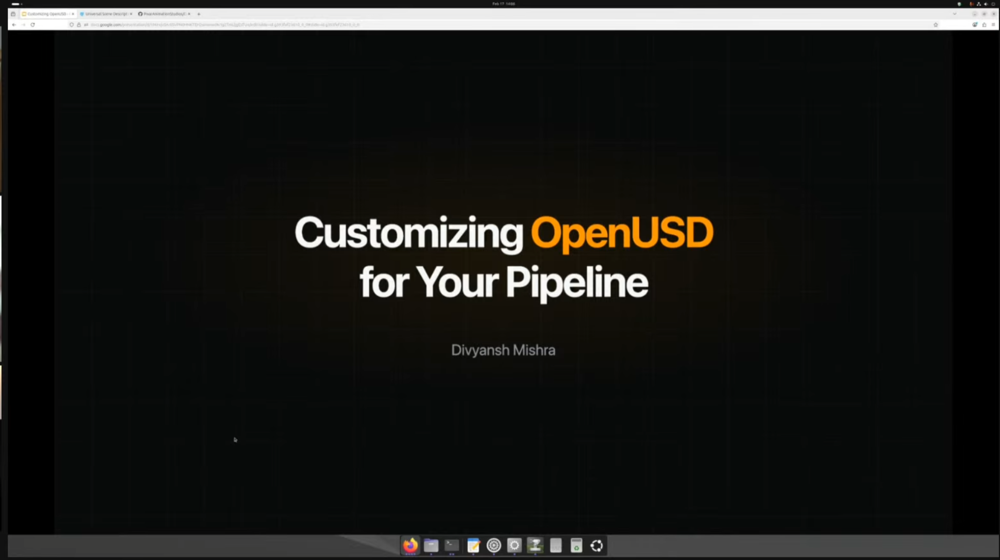

OpenUSD ships with a rich set of built-in schemas, composition arcs, and authoring tools. For many projects, that is enough. So the first question to answer is: **when does "enough" stop being enough?**

The honest answer: when your pipeline has **domain-specific meaning** that USD's built-in vocabulary cannot express, or when your **operational environment** (asset storage, format landscape, team structure) demands behavior that USD's defaults do not provide.

Here is a simple decision rule:

| Situation | First response | Plugin needed? |
|---|---|---|
| Need custom properties on prims | Author as custom attributes | Not yet |
| Need *validated, structured, typed* custom properties across tools | Define a schema | Yes |
| Need pipeline metadata that travels with the file | Metadata plugin registration | Yes |
| Need predictable defaults when variant selections are missing | Variant fallback plugin | Maybe |
| Need asset paths that survive server moves | Consider default resolver search paths first | Only if that's insufficient |
| Need USD to open a non-USD format directly | File format plugin | Yes |


The video's closing message is worth internalizing upfront: **every plugin you build makes your USD files slightly less portable.** Someone who receives your files needs your plugins too. So the discipline is: exhaust composition and convention first, and reach for plugins only when you must.

> **Learn OpenUSD anchor:** [What is Data Exchange?](https://docs.nvidia.com/learn-openusd/latest/data-exchange/data-exchange/what-is-data-exchange.html) — establishes the interoperability context that makes this tradeoff meaningful.

---

## Chapter 1 — Schemas: The Contract (Video: 00:07:16)


### The "tell me about yourself" problem

Imagine you're running a livestream with fifty people. You ask: "Hey, tell me something about yourself."

You get back fifty different answers. Mati says "I work at NVIDIA." Someone else says "I love skiing." A third says "I'm from Berlin." Lots of data — and absolutely none of it is structured. If you need to extract just the names of everyone who attended, you can't, because not everyone gave you their name.

Now try again, but this time you set expectations: "Tell me your **name**, your **age**, and your **hobby**. If you don't want to share your age, just say 1000."

Suddenly every answer has the same shape. You can query it. You can automate against it. You can compare entries.

**That expectation — that contract — is a schema.**

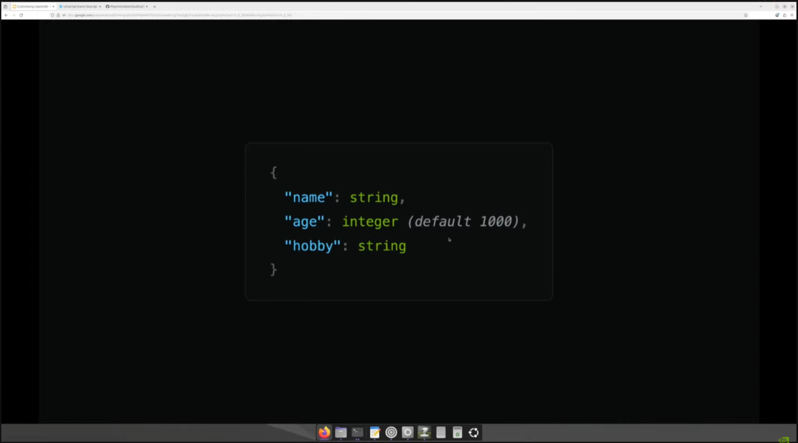

### The same idea, but for 3D

Ask fifty people "give me a 3D mesh" and you'll get OBJ files, FBX files, Blender files, maybe a napkin sketch. All valid, all different, all painful to work with.

But define a contract — "give me a list of 3D vertices, normal vectors, and face connectivity data" — and you have a structured, interoperable representation. That contract is essentially what USD's built-in `UsdGeomMesh` schema does.

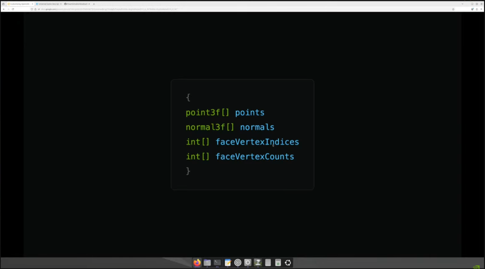

The question this chapter answers is: **what do you do when USD's built-in contracts don't cover your domain?**

### Meet the creature

Divy's running example throughout the video is a custom schema called `Creature`. It defines three properties — the same three from the "tell me about yourself" analogy:

```usda
class Creature "Creature" (
    inherits = </Xformable>
)
{
    string name = "Unknown"
    int age = 1000
    string hobby = "Undefined"
}
```

That's it. A schema definition in USD is a `.usda` file. The `inherits = </Xformable>` line means a creature can be positioned in 3D space (it gets all the transform properties from `Xformable` for free). The three properties define the data contract. The default values are fallbacks — "if you don't tell me, I'll assume you're an unnamed, thousand-year-old entity with no hobbies."

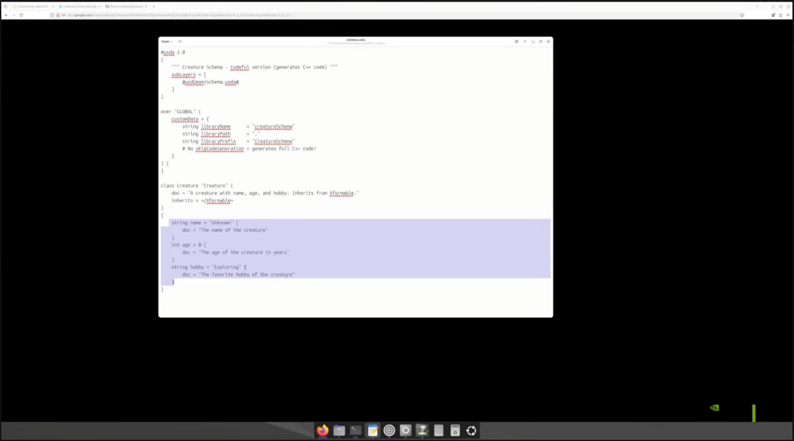

> **Just like a good cooking show:** Divy already had this schema built and loaded in Houdini, so he could immediately show what it feels like to *use* a custom schema before explaining how it's built. In Houdini's primitive node, "Creature" appeared as a selectable type alongside Mesh, Xform, and all the built-in types. He created a creature named "Divy", set the age to 100, then created another one called "Mati". Two structured, typed prims — with all the schema-defined properties already present and editable.

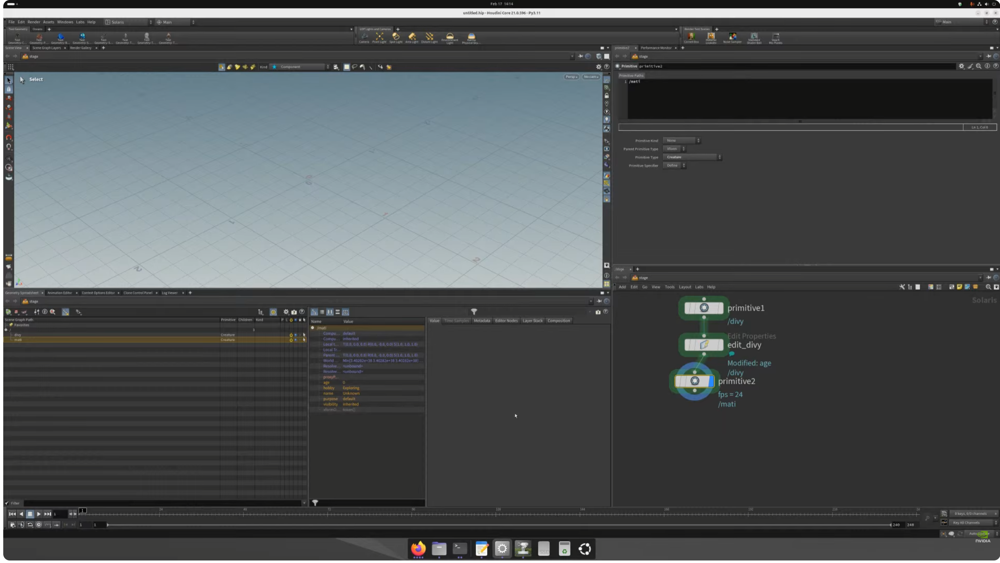

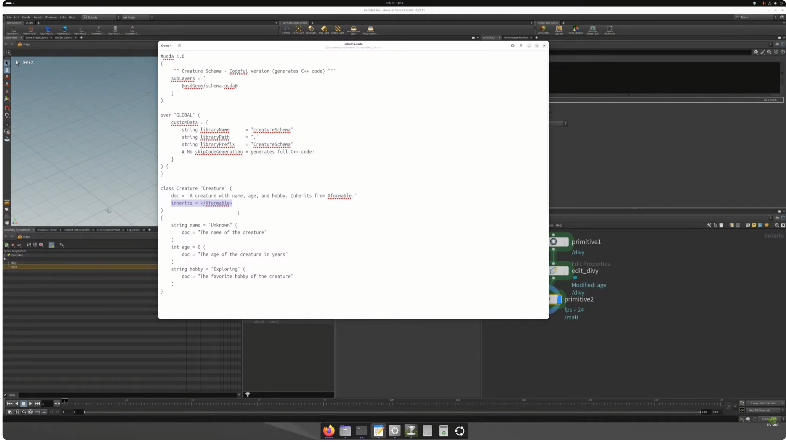

### Two kinds of schema: "what are you?" and "what can you do?"

USD has two categories of schema, and the distinction matters:

**Typed schemas (IsA)** answer: *what is this prim?* A prim can have exactly one typed schema. `Mesh`, `Xform`, `Camera`, and our `Creature` are all typed schemas. They define identity.


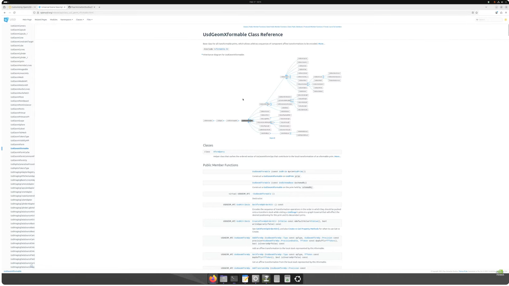

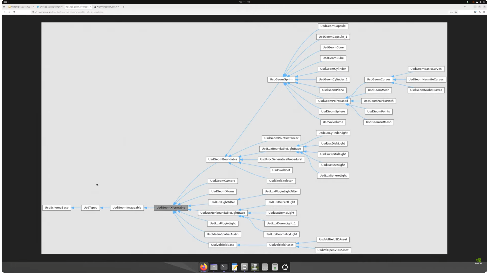

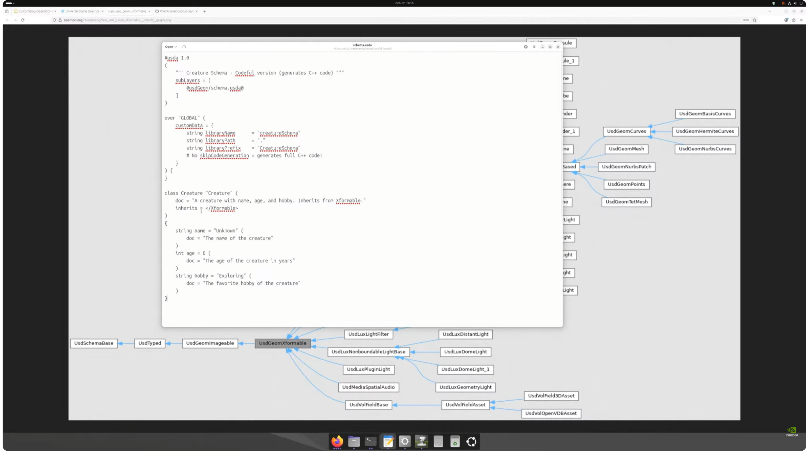

> ### Breakout: Typed (IsA) vs API Schemas — What This Means Without the Jargon
>
> Think about a person at a company.
>
> A **Typed schema (IsA)** is their **job title**. You are *a* software engineer, or *a* project manager, or *a* designer. That's your identity. You can only have one. Nobody is simultaneously "a software engineer" and "a project manager" in the org chart — you pick one. It defines what you *are*.
>
> An **API schema** is a **certification or skill** you carry. You might have a first-aid certificate, a forklift license, a security clearance. You can have as many as you need. They don't change your job title — you're still a designer — but they add capabilities. A designer with a forklift license can move pallets. A designer without one can't.
>
> In USD:
>
> | | **Typed Schema (IsA)** | **API Schema** |
> |---|---|---|
> | **Analogy** | Job title — "I am a ___" | Certification — "I can do ___" |
> | **How many per prim?** | Exactly one | As many as needed |
> | **What it defines** | Identity: what the prim *is* | Capability: what the prim *can do* |
> | **Examples** | `Mesh`, `Xform`, `Camera`, `Creature` | `PhysicsRigidBodyAPI`, `PhysicsColliderAPI`, `UsdCollectionAPI` |
> | **Set when?** | At creation — and it doesn't change | Anytime — add or remove capabilities as needed |
>
> **The physics demo in plain terms:** Divy created a cube. Its typed schema was `Mesh` — that's its identity: "I am a mesh." He pressed play in the physics simulation. Nothing happened. The cube just floated there, because being a mesh doesn't mean you know anything about physics.
>
> Then he applied two API schemas: `PhysicsRigidBodyAPI` ("I can be affected by gravity and forces") and `PhysicsColliderAPI` ("I can bump into other things"). He pressed play again — the cube fell and bounced off the ground. Same mesh. Same cube. But now it had physics *capabilities* layered on top.
>
> **Why not just put physics into the Mesh schema?** Because not every mesh needs physics. A background mountain doesn't need to fall. A skybox doesn't need to collide. By keeping physics as a separate API schema, you only pay for it where you need it. This is the design principle: **identity is fixed, capabilities are composable**.
>
> **The rule for your own schemas:** If you're defining *what something is* (a creature, a sensor, a building component), make it a Typed schema. If you're defining *a behavior that many different types might need* (trackable, exportable, reviewable), make it an API schema.


**API schemas** answer: *what capabilities does this prim have?* They add properties and behavior on top of an existing typed identity. A mesh prim doesn't know anything about physics — but apply the `PhysicsRigidBodyAPI` and `PhysicsColliderAPI` schemas, and suddenly it can fall, collide, and bounce.

Divy's live demo of this was memorable: he created a cube mesh, added a ground plane, pressed play — nothing happened. The mesh just sat there, because the mesh schema has no physics behavior. Then he applied the rigid body and collider API schemas, pressed play again, and the cube fell and bounced off the ground. Same prim, same mesh data, but new capabilities layered on through API schemas.

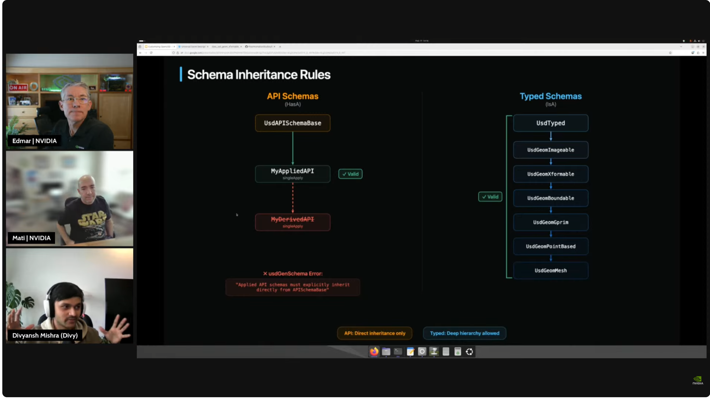

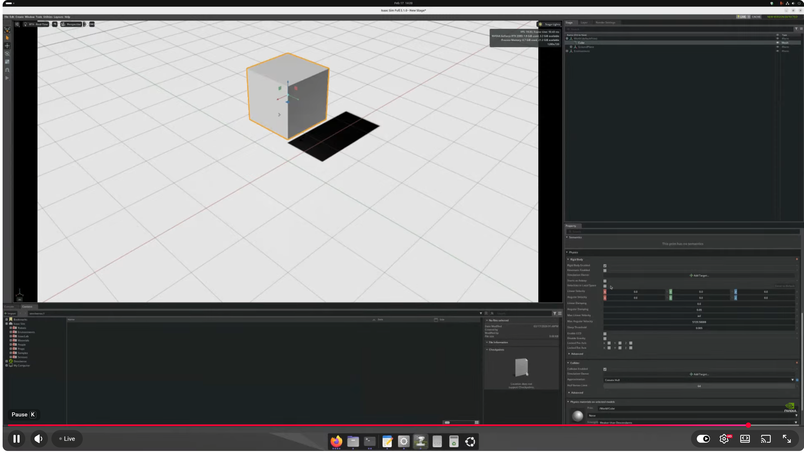

API schemas come in three flavors:

- **Single-apply**: apply once per prim (rigid body, collider)
- **Multi-apply**: apply multiple times with different instance names (collections — you can have a "heroes" collection and a "props" collection on the same prim)
- **Non-applied**: used in code without explicit application to a prim (a more advanced pattern, beyond this tutorial's scope)

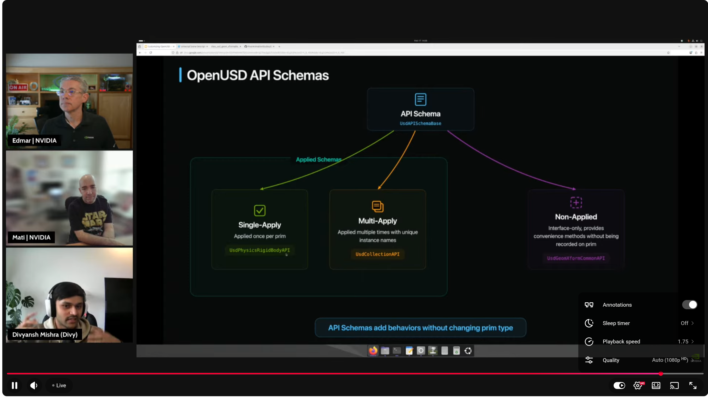

> ### Breakout: Single-Apply, Multi-Apply, Non-Applied — The Three Flavors of API Schemas
>
> Staying with the certification analogy from above — where API schemas are skills and certifications you can stack on top of someone's job title.
>
> **Single-apply** is a certification you either have or you don't. Think: a driver's license. You have one, or you have none. You can't have two driver's licenses on the same person at the same time — it wouldn't make sense. In USD, `PhysicsRigidBodyAPI` works this way. A prim either has rigid body physics or it doesn't. Applying it twice doesn't give you "double physics."
>
> **Multi-apply** is a certification you can hold *multiple instances of*, each with a different specialization. Think: language certifications. You can be certified in English, German, and Japanese — three instances of the same type of certification, each with its own name. In USD, `UsdCollectionAPI` is the classic example. A single prim can have a `UsdCollectionAPI:heroes` collection and a `UsdCollectionAPI:props` collection and a `UsdCollectionAPI:background` collection — same API schema type, different named instances, each holding different membership data.
>
> **Non-applied** is a utility toolkit that exists in code but never stamps itself onto a prim. Think: the HR handbook. Nobody "applies" the HR handbook to their employee badge. But when you need to calculate vacation days or look up a policy, the handbook is there as a shared resource. In USD, `UsdGeomXformCommonAPI` works this way — it provides convenience functions for reading and writing common transform patterns, but it never records itself on the prim. It's a code-side helper, invisible in the scene data.
>
> | Flavor | Analogy | USD example | Visible on prim? |
> |---|---|---|---|
> | **Single-apply** | Driver's license — one or none | `PhysicsRigidBodyAPI`, `PhysicsColliderAPI` | Yes — listed in `apiSchemas` |
> | **Multi-apply** | Language certs — multiple named instances | `UsdCollectionAPI:heroes`, `UsdCollectionAPI:props` | Yes — each instance listed separately |
> | **Non-applied** | HR handbook — used but never stamped | `UsdGeomXformCommonAPI` | No — exists only in code |
>
> **For most non-programmer use cases**, you'll encounter single-apply schemas (toggling capabilities on/off) and multi-apply schemas (managing named groups or collections on a prim). Non-applied schemas are a code-architecture concern — you'll use their features without ever needing to think about the distinction.


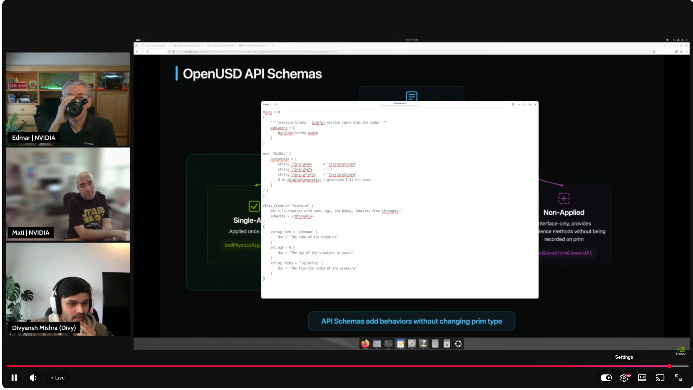

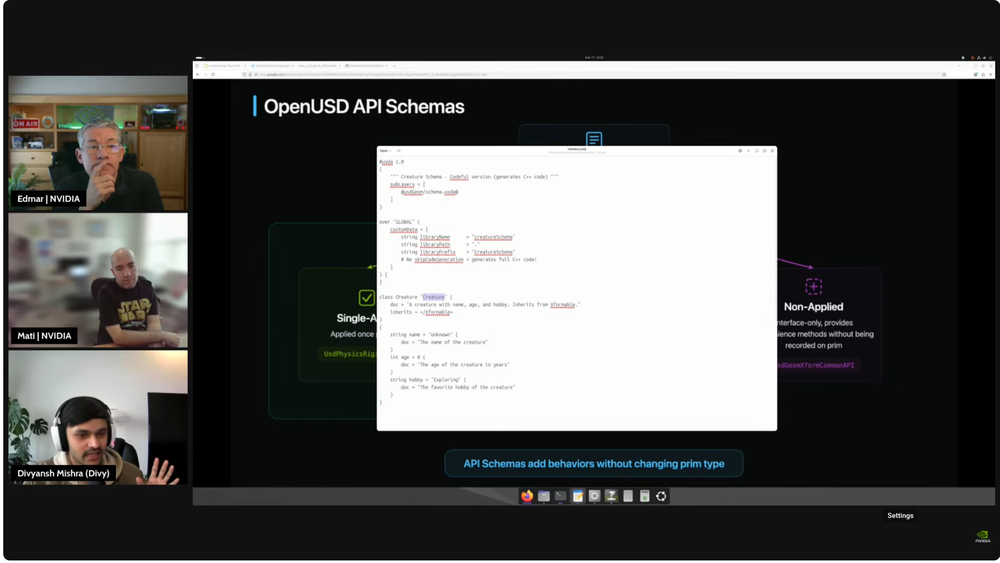

---

### Concrete vs abstract

One more distinction: schemas can be **concrete** (you can create prims of this type) or **abstract** (you can only inherit from them). `Mesh`, `Xform`, and `Creature` are concrete. `Xformable` and `Imageable` are abstract — they exist so other schemas can inherit shared properties from them, but you never create a prim that *is* an `Xformable`. You create a prim that *inherits from* Xformable.

---

> ### Breakout: Concrete vs Abstract — What This Means in Physical-World Terms
>
> Think about vehicle manufacturing.
>
> A **concrete** schema is a finished vehicle that rolls off the assembly line. A sedan, a pickup truck, a sports car. You can drive it. You can park it in your garage. It exists as a real, usable thing. In USD: `Mesh`, `Xform`, `Camera`, `Creature` — you can create prims of these types and they show up in your scene.
>
> An **abstract** schema is the *platform* the vehicles are built on — the shared chassis, the common drivetrain layout, the standard wiring harness. You never see a "platform" driving down the road. Nobody buys a "chassis." But every sedan, truck, and sports car on that platform inherits its engineering. Change the platform, and every vehicle built on it gets the improvement.
>
> In USD, `Xformable` is one of these platforms. It defines "anything that can be positioned, rotated, and scaled in 3D space." You never create a prim that *is* an Xformable — that would be like trying to drive a bare chassis. But `Mesh` inherits from Xformable, `Camera` inherits from Xformable, and our `Creature` inherits from Xformable. They all get transform capabilities for free.
>
> | | **Concrete** | **Abstract** |
> |---|---|---|
> | **Physical analogy** | A finished car you can drive | The shared platform/chassis it's built on |
> | **In USD** | `Mesh`, `Xform`, `Camera`, `Creature` | `Xformable`, `Imageable`, `Boundable` |
> | **Can you create one?** | Yes — `stage.DefinePrim("/thing", "Mesh")` works | No — you'd get an error or an undefined prim |
> | **Purpose** | Be a thing in the scene | Give shared properties to many concrete types |
>
> **Why does this matter to you?** When you define your own schema (like `Creature`), you choose what it inherits from. By inheriting from `Xformable`, your creature can be moved around in 3D. If you inherited from `Typed` instead (the most basic abstract schema), your creature would exist in the scene graph but couldn't be positioned — useful for pure data containers, not for things that live in 3D space.
>
> **The quick test:** Can an artist select it, move it, see it in a viewport? Then it should inherit from something concrete-friendly like `Xformable`. Is it just a data bucket that other things reference? Then `Typed` might be enough.

---

### Building it: codeful vs codeless

This is where production decisions get real.

**Codeful schemas** generate C++ classes and Python bindings. The developer experience is excellent:

```python
from myCreatureSchema import Creature

creature = Creature.Define(stage, "/World/Divy")
creature.GetAgeAttr().Set(100)
```

Clean imports, autocompletion, type safety. But there's a cost: you need to compile those C++ bindings for every USD version in your pipeline. If you're running Houdini, Isaac Sim, and Unreal Engine — and they each ship different USD versions — you're maintaining three separate builds.


---
**Codeless schemas** skip code generation entirely. The only difference in the schema definition is one metadata flag:

```usda
class Creature "Creature" (
    inherits = </Xformable>
    customData = {
        bool skipCodeGeneration = true
    }
)
{
    string name = "Unknown"
    int age = 1000
    string hobby = "Undefined"
}
```

The result is the same schema, the same types in your DCC, the same properties on your prims — but no generated C++ or Python classes. You work with prims using generic USD API:

```python
prim = stage.DefinePrim("/World/Divy", "Creature")
prim.GetAttribute("age").Set(100)
```

Less elegant. String-based, typo-prone. But **portable across every DCC and runtime without recompilation**.
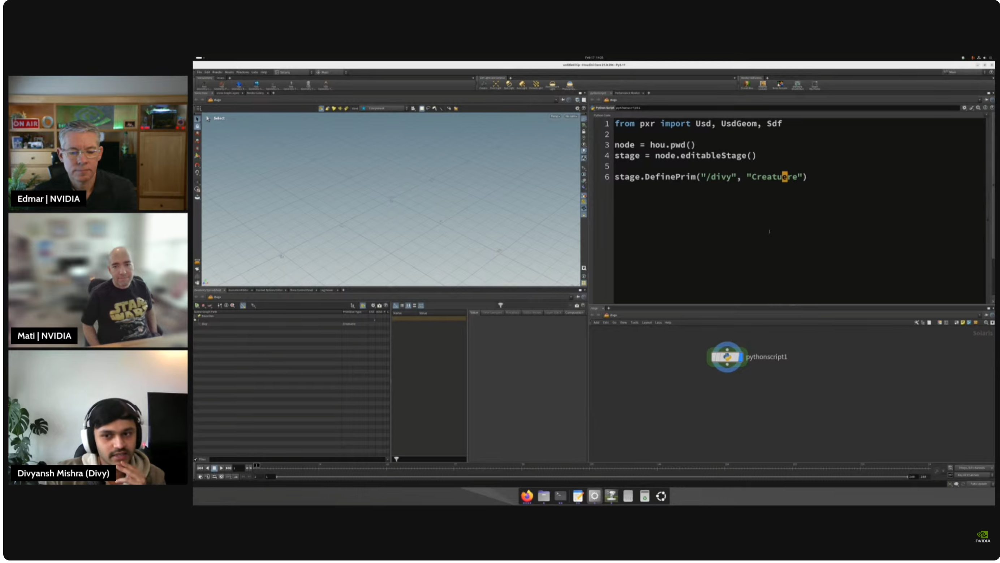

---

> ### Breakout: Codeful vs Codeless — What This Actually Means If You're Not a Programmer
>
> Forget the code for a moment. Think about IKEA furniture.
>
> **Codeful** is like buying a wardrobe that comes with a custom Allen key designed specifically for that wardrobe's bolts. The key fits perfectly, it's labeled, it's satisfying to use. But if IKEA changes the bolt size next year, your custom key is useless — you need a new one. And if you bought furniture from three different IKEA generations, you now have three different Allen keys to maintain.
>
> **Codeless** is like using a standard adjustable wrench. It's not as elegant. You have to eyeball the size, and you might slip once in a while. But it works on every bolt from every generation, and you never need to replace it.
>
> In USD terms:
>
> | | **Codeful** | **Codeless** |
> |---|---|---|
> | **What you get** | A purpose-built toolkit with named functions like `creature.GetAge()` | Generic access through strings like `prim.GetAttribute("age")` |
> | **The comfort** | Your tools know the schema — autocomplete, error checking, documentation | You're on your own — typo in `"age"` and you get silence, not an error |
> | **The cost** | You must compile (build) that toolkit for every USD version in every DCC app you use | Nothing to compile. Works everywhere USD runs, immediately |
> | **Who builds it** | A developer with a C++ toolchain | Anyone who can write a `.usda` text file |
> | **When it breaks** | When you update Houdini, Blender, or any DCC to a new USD version | It doesn't break — there's nothing compiled that can go stale |
>
> **The decision in plain language:** If you're a solo creator or small studio using multiple DCC apps (Blender, Houdini, Kit, Unreal), go codeless. You'll type a few more characters, but you'll never fight a build system. If you're at a studio with dedicated pipeline engineers who already maintain C++ infrastructure, codeful gives them a nicer developer experience — and since they're already paying the build cost for other plugins, the marginal cost of adding schema bindings is low.
>
> **The "I just want it to work" rule:** If the phrase "compile against the USD SDK" makes you uneasy, that's your answer. Codeless. You lose nothing in terms of what your schema *does* — the data contract is identical. You only lose convenience in how you *talk to it* from code.

---

> **The exam answer and the production answer:** For the OpenUSD certification exam, when asked "codeful or codeless for a multi-DCC pipeline?" the answer is codeless. In practice, as Mati noted during the session, if you already need to build other C++ plugins (resolvers, file formats), you might build the schema infrastructure anyway. But default to codeless unless you have a reason not to.

### Where this fits in your pipeline

Everything in the plugin system is discovered through the same mechanism: a `plugInfo.json` manifest that tells USD "here are additional types and capabilities."

For schemas in an Omniverse Kit context, the critical details are:
- Load schema extensions early (`order = -100` or similar)
- Depend on `omni.usd.libs`
- Register plugins explicitly at startup when needed:

```python
from pxr import Plug
import os

plugins_root = os.path.join(os.path.dirname(__file__), "../../plugins")
Plug.Registry().RegisterPlugins(
    os.path.join(plugins_root, "myCreatureSchema", "resources")
)
```

> **Learn OpenUSD:** [Schemas](https://docs.nvidia.com/learn-openusd/latest/scene-description-blueprints/schemas.html)<br>
> **Awesome OpenUSD:** [USD Survival Guide — Schemas](https://lucascheller.github.io/VFX-UsdSurvivalGuide/pages/core/plugins/schemas.html), [NVIDIA Plugin Samples](https://github.com/NVIDIA-Omniverse/usd-plugin-samples), [Weta Plugin Examples](https://github.com/wetadigital/USDPluginExamples)<br>
> **USD GoodStart:** Schema policy and validation scripts belong in `scripts/`, with domain data schemas relevant to `040_DATA_LYRs/`.

---

## Chapter 2 — Metadata Plugins: Teaching USD New Vocabulary (Video: 00:27:19)


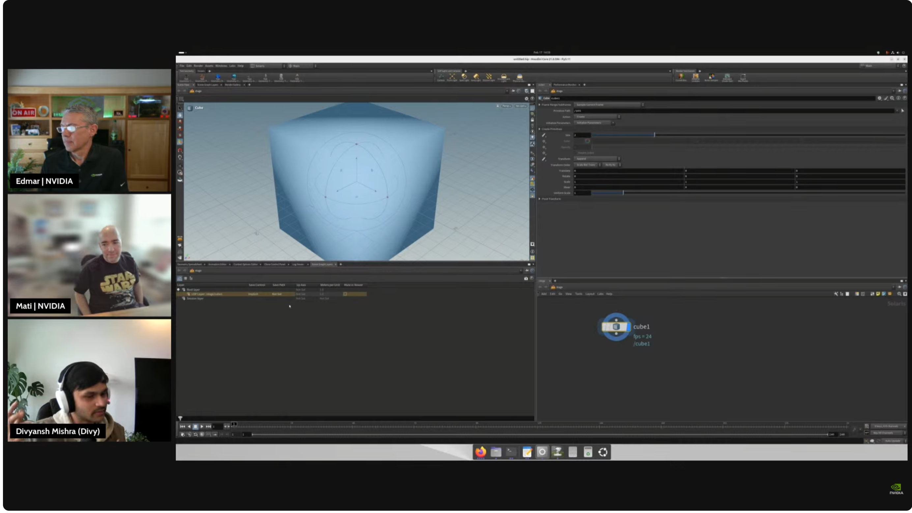

### The creature gets a job title

We have our creature schema. It defines what a creature *is*. But now the pipeline has a new question: "What *kind* of creature is this? Is it a hero? An NPC? A monster? And can we query that efficiently?"

You could add a `kind` string attribute to the schema. But USD already has a `kind` metadata system — built-in values like `assembly`, `group`, `component`, `subcomponent` — designed specifically for hierarchical classification and fast traversal. What if you could extend that existing system with your own categories?

That's exactly what a metadata plugin does.

### No code required — just a JSON file

This is the entire implementation:

```json
{
  "Plugins": [{
    "Info": {
      "Kinds": {
        "creature": { "baseKind": "model" },
        "hero": { "baseKind": "creature" },
        "npc": { "baseKind": "creature" },
        "monster": { "baseKind": "creature" }
      }
    },
    "Type": "resource"
  }]
}
```

Save that as `plugInfo.json`, point the `PXR_PLUGINPATH_NAME` environment variable at it, and launch your DCC. That's it. No compilation. No Python bindings. Just a JSON file and an environment variable.

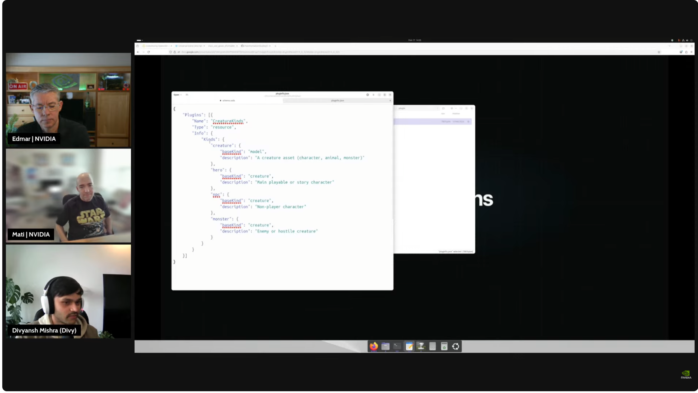

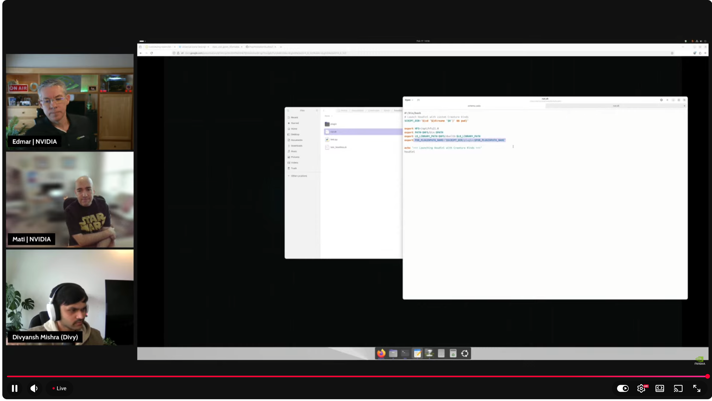

---

> ### Breakout: Custom Kinds in a Digital Twin — From Creatures to Assembly Lines
>
> Divy's creature example is fun, but let's translate this to the world you might actually work in: **an industrial digital twin of a production line.**
>
> Picture a factory floor. You have conveyor belts, welding robots, quality inspection cameras, safety barriers, and an AGV (automated guided vehicle) shuttling parts between stations. In USD, every one of these is a prim somewhere in your scene graph. But how do you tell your monitoring dashboard: "show me all the robots" or "highlight everything that's due for maintenance this week"?
>
> Without custom kinds, you're stuck with USD's built-in options: `assembly`, `group`, `component`, `subcomponent`. Your welding robot is a... `component`? So is the conveyor belt. And the safety barrier. And the coffee machine in the break room. They're all just "components." You can't distinguish them without parsing prim names or relying on fragile naming conventions.
>
> **With custom kinds, your `plugInfo.json` looks like this:**
>
> ```json
> {
>   "Plugins": [{
>     "Info": {
>       "Kinds": {
>         "equipment": { "baseKind": "component" },
>         "robot": { "baseKind": "equipment" },
>         "conveyor": { "baseKind": "equipment" },
>         "sensor": { "baseKind": "equipment" },
>         "safetyDevice": { "baseKind": "equipment" },
>         "agv": { "baseKind": "equipment" },
>         "fixture": { "baseKind": "component" },
>         "barrier": { "baseKind": "fixture" },
>         "workbench": { "baseKind": "fixture" }
>       }
>     },
>     "Type": "resource"
>   }]
> }
> ```
>
> Now you have a taxonomy that mirrors how your factory actually works:
>
> ```
> model
> └── component
>     ├── equipment        ← things that move, act, or measure
>     │   ├── robot        ← welding arm, pick-and-place, painting
>     │   ├── conveyor     ← belt, roller, chain
>     │   ├── sensor       ← camera, lidar, temperature probe
>     │   ├── safetyDevice ← light curtain, e-stop, interlock
>     │   └── agv          ← autonomous guided vehicle
>     └── fixture          ← things that stay put
>         ├── barrier      ← safety fence, guard rail
>         └── workbench    ← assembly station, tool rack
> ```
>
> **What this unlocks:**
>
> - **"Show me all robots"** → `Kind.Registry().IsA(primKind, "robot")` — works instantly, no scene traversal hacks
> - **"Show me all equipment"** → catches robots, conveyors, sensors, AGVs — everything that needs maintenance schedules
> - **"Is this a safety-critical item?"** → check if it's a `safetyDevice` or `barrier` — both are kinds you defined
> - **"Give me everything that's a component but not equipment"** → that's your fixtures: barriers, workbenches, static infrastructure
>
> **The real power is inheritance.** When your maintenance system asks "is this welding robot a piece of equipment?", the answer is `True` — because `robot` inherits from `equipment`. When it asks "is this robot a model?", also `True` — because `equipment` inherits from `component`, which inherits from `model`. One JSON file creates a queryable classification tree for your entire factory.
>
> **Combining with custom metadata fields:** Now add governance metadata (the `SdfMetadata` mechanism shown later in this chapter) and you can stamp every equipment prim with `maintenanceInterval`, `lastInspectionDate`, `operationalStatus`. Your digital twin isn't just a 3D model of a factory — it's a structured, queryable database that happens to also render in a viewport.

---

Now when Divy created a prim in Houdini and went to set its `kind`, the dropdown showed `creature`, `hero`, `npc`, `monster` alongside the built-in kinds. He set Mati's prim to `hero`, then demonstrated the inheritance query in Python:

```python
from pxr import Kind

registry = Kind.Registry()
print(registry.IsA("hero", "creature"))  # True — heroes are creatures
print(registry.IsA("hero", "model"))     # True — creatures are models
print(registry.IsA("hero", "group"))     # False — heroes are not groups
```

The inheritance hierarchy you defined in the JSON file is fully queryable at runtime. This is not a string comparison — it's a registered, traversable taxonomy.


### Beyond kinds: custom metadata fields

The `kind` extension is the most common example, but metadata plugins can register entirely new metadata fields at the layer, prim, or property level. The mechanism is the same `plugInfo.json`, under a different key:

```json
{
  "Plugins": [{
    "Info": {
      "SdfMetadata": {
        "pipelineStatus": {
          "type": "string",
          "appliesTo": ["prims"],
          "displayGroup": "Governance"
        },
        "reviewedBy": {
          "type": "string",
          "appliesTo": ["prims"],
          "displayGroup": "Governance"
        }
      }
    }
  }]
}
```

Now every prim in your pipeline can carry strongly-typed `pipelineStatus` and `reviewedBy` metadata — not as ad-hoc custom attributes, but as first-class metadata fields that USD knows about, serializes correctly, and that tools can inspect through standard Sdf API.

### When to use metadata vs attributes vs schemas

This is a design decision that trips up many teams:

| Mechanism | Use when | Example |
|---|---|---|
| **Custom attributes** (on a prim) | Per-prim data that participates in composition and time-sampling | Game-specific damage value |
| **Schema** | Structured, typed data contract reused across many prims/tools | Creature definition |
| **Metadata plugin** | Pipeline-level annotations that classify or govern prims/layers | Review status, department ownership, custom kinds |

Metadata is about **classification and governance**. Attributes are about **scene data**. Schemas bundle attributes into **contracts**.

### Production guidance

For a clean metadata strategy, think in three categories:

1. **Identity metadata**: stable IDs, ownership anchors, classification kinds
2. **Operational metadata**: ingestion timestamps, build versions, runtime control flags
3. **Governance metadata**: review status, validation results, policy compliance

> **Learn OpenUSD:** [Metadata](https://docs.nvidia.com/learn-openusd/latest/stage-setting/metadata.html)<br>
> **Awesome OpenUSD:** [USD Survival Guide — Metadata Plugins](https://lucascheller.github.io/VFX-UsdSurvivalGuide/pages/core/plugins/metadata.html)<br>
> **USD GoodStart:** Metadata conventions belong in `040_DATA_LYRs/DATA_LYRs.usda`. Validation scripts in `scripts/` should check for required metadata keys.

---

> ### Breakout: Metadata vs Attributes vs Schemas in a Digital Twin — When Five Systems All Claim to Own the Data
>
> In Divy's creature world, the data landscape is simple: one schema, one DCC, one artist. In an industrial digital twin, you're standing at the intersection of **five or more governing systems**, each convinced it's the source of truth:
>
> - **PLM** (Product Lifecycle Management — e.g., Teamcenter, Windchill) owns the engineering BOM, part numbers, revision history
> - **ERP** (Enterprise Resource Planning — e.g., SAP) owns procurement, cost, supplier relationships
> - **MES** (Manufacturing Execution System) owns production orders, cycle times, quality results
> - **SCADA / OPC UA** owns real-time telemetry: temperatures, vibrations, motor speeds
> - **AAS** (Asset Administration Shell — the Industry 4.0 "digital nameplate") owns the standardized, interoperable identity envelope for every physical asset
>
> Each of these systems speaks its own language, uses its own IDs, and updates on its own schedule. Your digital twin in OpenUSD needs to receive data from all of them without turning into an ungoverned mess.
>
> **This is where taxonomy, semantics, and ontology stop being academic terms and become engineering decisions.**

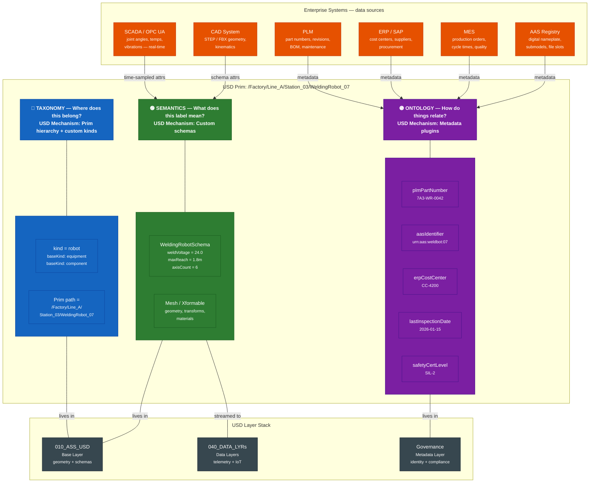
```mermaid
%%{init: {"flowchart": {"subGraphTitleMargin": {"top": 10, "bottom": 20}}, "themeVariables": {"fontSize": "14px"}} }%%
flowchart TB
    subgraph EXTERNAL["Enterprise Systems — data sources"]
        direction LR
        PLM["PLM<br/><small>part numbers, revisions,<br/>BOM, maintenance</small>"]
        ERP["ERP / SAP<br/><small>cost centers, suppliers,<br/>procurement</small>"]
        MES["MES<br/><small>production orders,<br/>cycle times, quality</small>"]
        SCADA["SCADA / OPC UA<br/><small>joint angles, temps,<br/>vibrations — real-time</small>"]
        AAS["AAS Registry<br/><small>digital nameplate,<br/>submodels, file slots</small>"]
        CAD["CAD System<br/><small>STEP / FBX geometry,<br/>kinematics</small>"]
    end

    subgraph PRIM["USD Prim: /Factory/Line_A/Station_03/WeldingRobot_07"]
        direction TB

        ONTO_TITLE["🟣 ONTOLOGY — How do things relate?<br/>USD Mechanism: Metadata plugins"]
        subgraph ONTO[" "]
            direction LR
            M1["plmPartNumber<br/><small>7A3-WR-0042</small>"]
            M2["aasIdentifier<br/><small>urn:aas:weldbot:07</small>"]
            M3["erpCostCenter<br/><small>CC-4200</small>"]
            M4["lastInspectionDate<br/><small>2026-01-15</small>"]
            M5["safetyCertLevel<br/><small>SIL-2</small>"]
        end

        SEM_TITLE["🟢 SEMANTICS — What does this label mean?<br/>USD Mechanism: Custom schemas"]
        subgraph SEM[" "]
            direction LR
            A1["WeldingRobotSchema<br/><small>weldVoltage = 24.0<br/>maxReach = 1.8m<br/>axisCount = 6</small>"]
            A2["Mesh / Xformable<br/><small>geometry, transforms,<br/>materials</small>"]
        end

        TAX_TITLE["🔵 TAXONOMY — Where does this belong?<br/>USD Mechanism: Prim hierarchy + custom kinds"]
        subgraph TAX[" "]
            direction LR
            K1["kind = robot<br/><small>baseKind: equipment<br/>baseKind: component</small>"]
            K2["Prim path =<br/><small>/Factory/Line_A/<br/>Station_03/WeldingRobot_07</small>"]
        end
    end

    subgraph LAYERS["USD Layer Stack"]
        direction LR
        L1["010_ASS_USD<br/><small>Base Layer<br/>geometry + schemas</small>"]
        L2["040_DATA_LYRs<br/><small>Data Layers<br/>telemetry + IoT</small>"]
        L3["Governance<br/><small>Metadata Layer<br/>identity + compliance</small>"]
    end

    PLM -->|metadata| ONTO_TITLE
    ERP -->|metadata| ONTO_TITLE
    MES -->|metadata| ONTO_TITLE
    AAS -->|metadata| ONTO_TITLE
    SCADA -->|time-sampled attrs| SEM_TITLE
    CAD -->|schema attrs| SEM_TITLE

    ONTO_TITLE --- ONTO
    SEM_TITLE --- SEM
    TAX_TITLE --- TAX

    TAX ---|lives in| L1
    SEM ---|lives in| L1
    SEM ---|streamed to| L2
    ONTO ---|lives in| L3

    classDef taxStyle fill:#1565C0,stroke:#0D47A1,color:#ffffff
    classDef semStyle fill:#2E7D32,stroke:#1B5E20,color:#ffffff
    classDef ontoStyle fill:#7B1FA2,stroke:#4A148C,color:#ffffff
    classDef extStyle fill:#E65100,stroke:#BF360C,color:#ffffff
    classDef layerStyle fill:#37474F,stroke:#263238,color:#ffffff
    classDef titleTax fill:#1565C0,stroke:#0D47A1,color:#ffffff,font-weight:bold
    classDef titleSem fill:#2E7D32,stroke:#1B5E20,color:#ffffff,font-weight:bold
    classDef titleOnto fill:#7B1FA2,stroke:#4A148C,color:#ffffff,font-weight:bold

    class TAX,K1,K2 taxStyle
    class SEM,A1,A2 semStyle
    class ONTO,M1,M2,M3,M4,M5 ontoStyle
    class PLM,ERP,MES,SCADA,AAS,CAD extStyle
    class L1,L2,L3 layerStyle
    class TAX_TITLE titleTax
    class SEM_TITLE titleSem
    class ONTO_TITLE titleOnto
```

> *The diagram above shows a single welding robot prim and the three conceptual layers that organize its data. Orange boxes are external enterprise systems. Blue is taxonomy (classification and hierarchy). Green is semantics (what the data means — schemas and attributes). Purple is ontology (cross-system relationships — metadata). The dark layer stack at the bottom shows where each concern lands in your USD file structure.*
>
> #### Taxonomy: "Where does this data belong?"
>
> Your USD prim hierarchy mirrors the physical plant: `/Factory/Line_A/Station_03/WeldingRobot_07`. The custom **kinds** from the earlier breakout (`robot`, `conveyor`, `sensor`) give you a classification tree. This is pure taxonomy — where things sit and what category they fall into. A conveyor is a kind of equipment. A welding robot is a kind of equipment. A safety light curtain is a kind of safety device. The hierarchy is navigable and queryable.
>
> **USD mechanism:** Prim hierarchy + custom kinds (metadata plugin).
>
> #### Semantics: "What does this label *mean*?"
>
> A welding robot has properties: `jointAngles`, `weldVoltage`, `cycleCount`, `lastMaintenanceDate`. But what exactly *is* a welding robot in your system? What properties must it have? What ranges are valid? What happens if `weldVoltage` is missing?
>
> This is where **schemas** earn their keep. A `WeldingRobotSchema` defines the contract: every prim of kind `robot` with this schema applied must have these attributes, with these types, with these defaults. The schema is the semantic anchor — it says "when we say *welding robot*, this is precisely what we mean, and here is the data it must carry."
>
> **USD mechanism:** Custom schema (codeless for portability, inheriting from `Xformable`).
>
> #### Ontology: "How do things relate, and what can we infer?"
>
> The welding robot's maintenance schedule comes from the PLM system. Its real-time joint angles come from OPC UA. Its cost center comes from SAP. Its standardized digital identity comes from the AAS. These aren't properties of the robot's 3D representation — they're **relationships between systems** that converge on one physical asset.
>
> This is where **metadata** shines. Metadata doesn't describe what the robot looks like in the viewport (that's attributes on a schema). It describes the robot's **governance context**: where data came from, who owns it, when it was last synchronized, what external ID maps to this prim. You wouldn't time-sample a part number. You wouldn't animate a cost center. That data is about the *management* of the asset, not the *simulation* of it.
>
> **USD mechanism:** Metadata plugins (custom fields via `plugInfo.json`) + composition (layered data from different sources).
>
> #### The mapping table for a real assembly line
>
> | Data | Source system | USD mechanism | Why this mechanism? |
> |---|---|---|---|
> | Part number (`7A3-WR-0042`) | PLM | **Metadata** (`plmPartNumber`) | Identity/provenance — stable, classifies the asset |
> | 3D geometry + kinematics | CAD (via STEP/FBX) | **Schema attributes** (mesh, joint defs) | Scene data — the actual digital content |
> | Real-time joint angles | OPC UA / SCADA | **Time-sampled attributes** on a data layer | Per-frame scene data, changes continuously |
> | Maintenance interval (5000 hrs) | PLM / ERP | **Metadata** (`maintenanceIntervalHrs`) | Governance — operational policy, not scene data |
> | Last inspection date | MES / maintenance | **Metadata** (`lastInspectionDate`) | Governance — audit trail |
> | Current operational status | MES / SCADA | **Attribute** on session/runtime layer | Changes frequently, benefits from layer isolation |
> | Cost center / budget code | ERP (SAP) | **Metadata** (`erpCostCenter`) | Classification — doesn't affect the scene |
> | AAS identifier | AAS registry | **Metadata** (`aasIdentifier`) | External identity — the digital nameplate reference |
> | Safety certification | Compliance system | **Metadata** (`safetyCertLevel`) | Governance — must travel with the asset, not time-varying |
>
> #### Separation of concerns through USD layers
>
> In the [AAS + OpenUSD integration architecture](../../../AAS_OPC_OpenUSD_INTEGRATION/docs/AAS_OPC_OpenUSD_RESEARCH_v13.md) (Haluszka, 2026), this maps to a layered approach where USD composition keeps each data source isolated:
>
> - **Base layer** (`010_ASS_USD`): geometry, kinematics, materials — the physical representation. This is where **schemas and attributes** live. Your `WeldingRobotSchema` defines the shape of this data.
> - **Data layers** (`040_DATA_LYRs`): telemetry overlays, simulation results, IoT feeds — time-varying scene data arriving via OPC UA or MQTT. These are **time-sampled attributes** on dedicated layers, so a broken sensor feed never corrupts your geometry.
> - **Governance layer** (metadata on prims and layers): identity, provenance, classification, compliance. This is where **metadata plugins** stamp every prim with its PLM part number, AAS identifier, review status, and compliance flags. This data doesn't render — it governs.
>
> #### Where the AAS fits in
>
> The AAS (Asset Administration Shell, defined in IEC 63278 / AAS Spec Part 1) acts as the **external identity envelope**. It doesn't live *inside* the USD file — it's a parallel structure that says: "This physical asset exists. Here is its standardized description (submodels for nameplate, documentation, operational data). And here are the files that represent it (STEP for engineering, USD for visualization, PDF for documentation)."
>
> The structural parallelism between AAS and USD is what makes integration possible: AAS Entity hierarchy maps to USD prim hierarchy. AAS File slots resolve to USD references or payloads. AAS submodel properties map to USD metadata fields. Scripts can **assemble** the USD scene from an AAS (resolve file slots, map entity hierarchy to prims), or **generate** the AAS from a USD scene (extract metadata, build submodel entries). This round-trip capability is what turns a static export into a living twin.
>
> #### But how does this data actually get *into* the USD scene?
>
> This is the question that separates "nice diagram" from "working pipeline." You have a welding robot with geometry exported from your CAD system. Now PLM wants to stamp it with a part number. The AAS wants to tag it with a digital nameplate ID. OPC UA is streaming joint angles every 100 milliseconds. How do these arrive?
>
> The answer is **USD's layered composition** — specifically, the `over` opinion and separate layer files. You do **not** edit the geometry file. Ever.

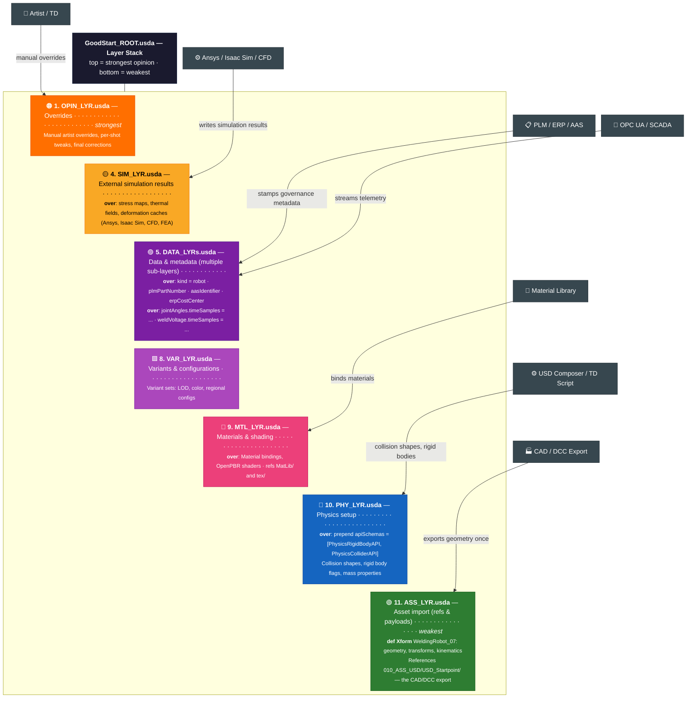
```mermaid
%%{init: {"flowchart": {"rankSpacing": 20, "nodeSpacing": 15}} }%%
flowchart TB
    TITLE["<b>GoodStart_ROOT.usda — Layer Stack</b><br/>top = strongest opinion · bottom = weakest"]

    subgraph STACK[" "]
        direction TB

        L01["🟠 <b>1. OPIN_LYR.usda</b> — Overrides · · · · · · · · · · · · · · · · · · · · · · · · · <i>strongest</i><br/><small>Manual artist overrides, per-shot tweaks, final corrections</small>"]

        L04["🟡 <b>4. SIM_LYR.usda</b> — External simulation results · · · · · · · · · · · · · · · · · ·<br/><small><b>over</b>: stress maps, thermal fields, deformation caches (Ansys, Isaac Sim, CFD, FEA)</small>"]

        L05["🟣 <b>5. DATA_LYRs.usda</b> — Data &amp; metadata (multiple sub-layers) · · · · · · · · · · · ·<br/><small><b>over</b>: kind = robot · plmPartNumber · aasIdentifier · erpCostCenter<br/><b>over</b>: jointAngles.timeSamples = ... · weldVoltage.timeSamples = ...</small>"]

        L08["🟪 <b>8. VAR_LYR.usda</b> — Variants &amp; configurations · · · · · · · · · · · · · · · · · · ·<br/><small>Variant sets: LOD, color, regional configs</small>"]

        L09["🩷 <b>9. MTL_LYR.usda</b> — Materials &amp; shading · · · · · · · · · · · · · · · · · · · · · ·<br/><small><b>over</b>: Material bindings, OpenPBR shaders · refs MatLib/ and tex/</small>"]

        L10["🔵 <b>10. PHY_LYR.usda</b> — Physics setup · · · · · · · · · · · · · · · · · · · · · · · · ·<br/><small><b>over</b>: prepend apiSchemas = [PhysicsRigidBodyAPI, PhysicsColliderAPI]<br/>Collision shapes, rigid body flags, mass properties</small>"]

        L11["🟢 <b>11. ASS_LYR.usda</b> — Asset import (refs &amp; payloads) · · · · · · · · · · · · · · · · <i>weakest</i><br/><small><b>def Xform</b> WeldingRobot_07: geometry, transforms, kinematics<br/>References 010_ASS_USD/USD_Startpoint/ — the CAD/DCC export</small>"]

        L01 ~~~ L04 ~~~ L05 ~~~ L08 ~~~ L09 ~~~ L10 ~~~ L11
    end

    TITLE --- STACK

    SRC_ART["🎨 Artist / TD"] --->|"manual overrides"| L01
    SRC_SIM["⚙️ Ansys / Isaac Sim / CFD"] --->|"writes simulation results"| L04
    SRC_PLM["📋 PLM / ERP / AAS"] --->|"stamps governance metadata"| L05
    SRC_OPC["📡 OPC UA / SCADA"] --->|"streams telemetry"| L05
    SRC_MAT["🎨 Material Library"] --->|"binds materials"| L09
    SRC_PHY["⚙️ USD Composer / TD Script"] --->|"collision shapes, rigid bodies"| L10
    SRC_CAD["🏭 CAD / DCC Export"] --->|"exports geometry once"| L11

    classDef titleStyle fill:#1A1A2E,stroke:#16213E,color:#ffffff,font-size:16px
    classDef opinStyle fill:#FF6F00,stroke:#E65100,color:#ffffff
    classDef simStyle fill:#F9A825,stroke:#F57F17,color:#000000
    classDef dataStyle fill:#7B1FA2,stroke:#4A148C,color:#ffffff
    classDef varStyle fill:#AB47BC,stroke:#7B1FA2,color:#ffffff
    classDef mtlStyle fill:#EC407A,stroke:#C2185B,color:#ffffff
    classDef phyStyle fill:#1565C0,stroke:#0D47A1,color:#ffffff
    classDef assStyle fill:#2E7D32,stroke:#1B5E20,color:#ffffff
    classDef sourceStyle fill:#37474F,stroke:#263238,color:#ffffff

    class TITLE titleStyle
    class L01 opinStyle
    class L04 simStyle
    class L05 dataStyle
    class L08 varStyle
    class L09 mtlStyle
    class L10 phyStyle
    class L11 assStyle
    class SRC_ART,SRC_SIM,SRC_PLM,SRC_OPC,SRC_MAT,SRC_PHY,SRC_CAD sourceStyle
```

> *The GoodStart layer stack for a digital twin, read bottom-to-top. Green (bottom): geometry arrives once from CAD — the weakest layer, the foundation. Blue: physics setup — collision shapes and rigid body flags applied via `over`. Pink: materials bind on top. Purple: variants. Dark purple: the DATA layers carry all enterprise data — PLM metadata, AAS identifiers, and live OPC UA telemetry arrive here as `over` opinions. Yellow: external simulation results (Ansys, Isaac Sim, CFD) override the scene with computed outputs. Orange (top): artist/TD overrides — the strongest opinion, the final word. External systems each write exclusively to their own layer. Based on the [USD GoodStart](https://github.com/jph2/USD_GoodStart) minimal production structure.*
>
> *Layers not shown for clarity: CAM_LYR (2), ENV_LYR (3), ACTGR_LYR (6), ANIM_LYR (7). These follow the same pattern — each owns its concern, each uses `over`, none touches geometry.*
>
> **The base layer already exists.** Your CAD export (or your artist's Blender/Houdini scene) produced a USD file with the robot's geometry, transforms, and materials. This is `010_ASS_USD/welding_robot.usd`. It defines the prim `/Factory/Line_A/Station_03/WeldingRobot_07` with type `Mesh` (or `Xform` containing meshes). This file is sacred — it came from the engineering source of truth.
>
> **Metadata and kinds arrive as `over` opinions on separate layers.** A data sub-layer — say `040_DATA_LYRs/governance.usda` (one of the DATA_LYRs in the chart above) — contains:
>
> ```usda
> #usda 1.0
>
> over "Factory" {
>     over "Line_A" {
>         over "Station_03" {
>             over "WeldingRobot_07" (
>                 kind = "robot"
>                 customData = {
>                     string plmPartNumber = "7A3-WR-0042"
>                     string aasIdentifier = "urn:aas:weldbot:07"
>                     string erpCostCenter = "CC-4200"
>                     string safetyCertLevel = "SIL-2"
>                 }
>             ) {
>             }
>         }
>     }
> }
> ```
>
> The keyword `over` is critical here. It means: "I'm not creating this prim — it already exists in a stronger layer. I'm just adding my opinion on top." The geometry layer defines the prim. The data layer *decorates* it. If the data layer is missing or broken, the robot still renders. If the geometry layer is missing, there's nothing to decorate.
>
> **Telemetry arrives on yet another layer.** A data layer — `040_DATA_LYRs/telemetry_opcua.usda` — carries time-sampled attributes:
>
> ```usda
> #usda 1.0
>
> over "Factory" {
>     over "Line_A" {
>         over "Station_03" {
>             over "WeldingRobot_07" {
>                 float[] jointAngles.timeSamples = {
>                     0: [0, -45, 90, 0, 30, 0],
>                     1: [0, -44.8, 89.5, 0.2, 30.1, 0],
>                 }
>                 float weldVoltage.timeSamples = {
>                     0: 24.1,
>                     1: 24.3,
>                 }
>             }
>         }
>     }
> }
> ```
>
> Again, `over`. No geometry redefinition. Just data arriving from the OPC UA bridge, written into a layer that the stage composition stacks on top. An ingestion script (or a live connector like NVIDIA Omniverse's OPC UA plugin) generates and updates this layer programmatically.
>
> **API schemas are applied via `over` too.** The physics setup layer — `020_BASE_LYR/PHY_LYR.usda` in the chart above — applies collision and rigid body schemas:
>
> ```usda
> #usda 1.0
>
> over "Factory" {
>     over "Line_A" {
>         over "Station_03" {
>             over "WeldingRobot_07" (
>                 prepend apiSchemas = ["PhysicsRigidBodyAPI", "PhysicsColliderAPI"]
>             ) {
>             }
>         }
>     }
> }
> ```
>
> **The layer stack is the composition order.** Your root stage file — `USD_GoodStart_ROOT.usda` — sublayers everything together in the GoodStart order:
>
> ```usda
> #usda 1.0
> (
>     subLayers = [
>         @020_BASE_LYR/OPIN_LYR.usda@,
>         @030_SIM_LYR/SIM_LYR.usda@,
>         @040_DATA_LYRs/DATA_LYRs.usda@,
>         @020_BASE_LYR/MTL_LYR.usda@,
>         @020_BASE_LYR/PHY_LYR.usda@,
>         @020_BASE_LYR/ASS_LYR.usda@
>     ]
> )
> ```
>
> Stronger layers (listed first) win. Artist overrides beat simulation results. Simulation results beat data/metadata. Everything overrides the base geometry's initial values. But the base geometry *defines* the prims — the others only *opine* on them.
>
> **The rule:** Nothing from PLM, ERP, MES, or SCADA ever touches the geometry file. Every external system writes to its own layer using `over`. Composition does the rest. If a data feed dies, you remove or disable that layer — the rest of the twin keeps working. And when a *new* system comes online — a quality sensor, an energy monitor, a new AAS submodel — you add a layer. No existing files change. This is how you get a system that degrades gracefully *and* evolves incrementally through composable bindings (see [AAS + OpenUSD Composable Bindings Evaluation](../../AAS_OPC_OpenUSD_INTEGRATION/docs/AAS_OPC_OpenUSD_RESEARCH_v13.md)).
>
> #### The practical decision framework
>
> When you're staring at a new piece of data arriving from yet another enterprise system, ask three questions:
>
> 1. **Does it change every frame or every few seconds?** → **Time-sampled attribute** on a data layer (joint angles, temperatures, vibrations)
> 2. **Does it define what you see in the viewport?** → **Attribute on a schema** (geometry, materials, transforms, kinematics)
> 3. **Does it describe who owns this, where it came from, or what rules apply to it?** → **Metadata** via a plugin (part numbers, AAS IDs, review status, compliance flags)
>
> Don't mix the layers. That's how you end up with geometry prims carrying SAP cost codes as custom attributes that break every time someone opens the file without the SAP plugin loaded. Metadata travels with the prim silently. Attributes demand to be understood.
>
> **Reference:** For the full layered architecture — including the V-Model governance backbone, the Digital Engineering Loop, and how Composable Bindings enable iterative hardening of these data flows — see [AAS_OPC_OpenUSD_RESEARCH_v13, Section 6.3: Layered Contract Model](../../../AAS_OPC_OpenUSD_INTEGRATION/docs/AAS_OPC_OpenUSD_RESEARCH_v13.md).

---

## Chapter 3 — Variant Fallback Plugin: Predictable Defaults (Video: 00:39:46)


### The white sphere problem

Divy loaded an asset: a sphere inside an Xform called "creature." The asset had a variant set called `color` with three variants — `red`, `green`, `blue` — but **no variant was selected**. When Houdini opened the file, the sphere was white. No color. No default. Just... nothing.

This is a real problem. In production, assets ship with variant sets for LOD, look-dev pass, department-specific views. If nobody authors an explicit selection, you get whatever the composition engine happens to resolve — which might be nothing, or might be the first variant alphabetically, depending on the context. That's not deterministic. That's not safe.


### The fix: declare fallback preferences

A variant fallback plugin tells USD: "If you encounter a variant set with this name and no selection has been authored, pick from this ordered list."

Again — just a `plugInfo.json`:

```json
{
  "Plugins": [{
    "Info": {
      "UsdVariantFallbacks": {
        "color": ["blue", "green", "red"],
        "lod": ["high", "medium", "low"]
      }
    },
    "Type": "resource"
  }]
}
```


After loading this plugin, Divy opened the same asset again. This time: blue sphere, immediately. The fallback found the `color` variant set, saw no authored selection, and picked `blue` (the first preference). If `blue` didn't exist, it would try `green`, then `red`.


### The department workflow pattern

This is where variant fallbacks get genuinely powerful. Imagine:

- The **layout department** gets a fallback plugin where `lod = ["low", "medium", "high"]` — they work fast with lightweight geometry.
- The **lighting department** gets `lod = ["high", "medium", "low"]` — they need full-resolution assets.
- The **texturing department** gets `look = ["wip", "final"]` — they want to see their in-progress work.

Same USD files. Same asset library. Different default experiences per department. And any explicit variant selection authored in a shot layer always wins — fallbacks only apply when nothing is authored.

### Important constraints

- Fallbacks **only activate when no selection is authored**. An explicit variant opinion in any layer always overrides them.
- The runtime API `UsdStage::SetGlobalVariantFallbacks(...)` can override plugin-defined fallbacks for stages created after the call. This is useful for application-level overrides but creates a precedence subtlety:

```cpp
PcpVariantFallbackMap fallbacks;
fallbacks["shadingComplexity"] = { "full", "light" };
fallbacks["lod"] = { "high", "medium", "low" };
UsdStage::SetGlobalVariantFallbacks(fallbacks);
```

- As Mati noted during the session: to really take advantage of variant fallbacks, **you need a structured ontology for your assets**. If variant set names are inconsistent across assets, fallback plugins can't help. This is a governance problem first, a plugin problem second.


> #### Breakout: Variants in Digital Twins — When the Factory Floor Has Options
>
> In VFX and animation, variant sets are about LOD, color, and look-dev passes. In a digital twin, they map to **real-world configuration choices** — and the stakes are higher because these choices drive simulation, procurement, and maintenance.
>
> Think about a packaging line. The same station can run three different conveyor belt widths depending on the product:
>
> ```usda
> def Xform "PackagingLine_02" (
>     variants = {
>         string conveyorWidth = "600mm"
>     }
>     variantSets = ["conveyorWidth"]
> ) {
>     variantSet "conveyorWidth" = {
>         "400mm" {
>             def Xform "Belt" (
>                 references = @010_ASS_USD/USD_Startpoint/belt_400.usda@
>             ) {}
>         }
>         "600mm" {
>             def Xform "Belt" (
>                 references = @010_ASS_USD/USD_Startpoint/belt_600.usda@
>             ) {}
>         }
>         "800mm" {
>             def Xform "Belt" (
>                 references = @010_ASS_USD/USD_Startpoint/belt_800.usda@
>             ) {}
>         }
>     }
> }
> ```
>
> One prim, three physical configurations. The geometry swaps. The collision shapes in `PHY_LYR` swap with it (each belt variant has different mass and contact surfaces). The simulation results in `SIM_LYR` depend on which variant is active. And critically — the PLM part number in `DATA_LYRs` is different for each belt width.
>
> This is where variants go beyond visual switching. In an industrial digital twin, a variant selection can cascade through the entire layer stack:
>
> | Variant set | What switches | Real-world driver |
> |---|---|---|
> | `conveyorWidth` | Geometry, collision shapes, part number | Product changeover |
> | `endEffector` | Robot tool mesh, reach envelope, weld parameters | Production order |
> | `safetyZone` | Fence geometry, sensor coverage, SIL rating | Regulatory region |
> | `productionShift` | Lighting rig, camera positions, operator stations | Shift schedule |
> | `maintenanceState` | Highlighted wear parts, inspection overlays | Maintenance plan |
> | `assemblyConfig` | Which sub-assemblies are present, BOM variant | Customer order |
>
> **The fallback plugin becomes a plant configuration tool.** Instead of "layout department sees low LOD," you get: "the German plant defaults to `safetyZone = "EU_CE"` while the US plant defaults to `safetyZone = "US_OSHA"`." Same digital twin. Different regulatory contexts. No file changes.
>
> **Variants compose with `over` layers.** A shift-specific data layer can author a variant selection:
>
> ```usda
> #usda 1.0
>
> over "Factory" {
>     over "Line_A" {
>         over "PackagingLine_02" (
>             variants = {
>                 string conveyorWidth = "800mm"
>                 string productionShift = "nightShift"
>             }
>         ) {
>         }
>     }
> }
> ```
>
> This lives in `040_DATA_LYRs/` — the production planning system writes it. The geometry snaps to the 800mm belt. The physics layer picks up the corresponding collision shapes. The material layer shows the night-shift lighting. Nobody edited a geometry file.
>
> **The governance link:** Each variant selection maps back to an AAS submodel or a PLM configuration. When someone selects `conveyorWidth = "600mm"`, the digital twin isn't just showing a different mesh — it's reflecting a specific BOM configuration, a specific set of spare parts, a specific maintenance schedule. The variant set is the bridge between the 3D representation and the enterprise data behind it (see [AAS + OpenUSD Integration](../../AAS_OPC_OpenUSD_INTEGRATION/docs/AAS_OPC_OpenUSD_RESEARCH_v13.md), Section 5: Layered Contract Model).
>
> **The rule for digital twin variants:** Name your variant sets after what the *plant operator* would call the choice, not what the *3D artist* would call it. `conveyorWidth` beats `geo_swap_v2`. `safetyZone` beats `region_variant`. If your variant set names don't make sense on a factory floor whiteboard, they won't survive contact with the production planning team.

---
> **Learn OpenUSD:** [What Are Variant Sets?](https://docs.nvidia.com/learn-openusd/latest/creating-composition-arcs/variant-sets/what-are-variant-sets.html)<br>
> **USD GoodStart:** Variant fallback strategy belongs in `020_BASE_LYR/VAR_LYR.usda` documentation. Define which variant set names are canonical for the project.

---

## Chapter 4 — Asset Resolver: Making Paths Portable (Video: 00:44:47)


### The broken library

This is Divy's personal story, and it's one of the most relatable moments in the video.

He keeps a personal asset library — a folder full of reusable USD assets (creatures, props, environments). His USD scene files reference those assets with relative paths:

```usda
def Xform "World" {
    def "Fluffy" (
        payload = @../assets/fluffy.usda@
    ) {}
    def "Spike" (
        payload = @../assets/spike.usda@
    ) {}
}
```

This works fine — until he moves the `assets` folder from `Documents` to `Desktop`. Suddenly every reference in every file is broken. Houdini starts yelling: "Cannot open this asset. This asset does not exist." He has to go through every file and update every path. For two assets, that's annoying. For a real library, that's a disaster.


### The resolver solution

An asset resolver is a plugin that intercepts USD's path resolution and translates logical identifiers into actual file locations. Instead of hardcoding where assets live, you author a **scheme** — a custom URL prefix — and let the resolver figure out the rest.

Divy defined his own scheme: `divi-asset://`. His scene files now look like:

```usda
def Xform "World" {
    def "Fluffy" (
        payload = @divi-asset://fluffy.usda@
    ) {}
    def "Spike" (
        payload = @divi-asset://spike.usda@
    ) {}
}
```


His resolver reads a single environment variable — `DIVI_ASSET_LIBRARY_PATH` — and replaces `divi-asset://` with whatever that variable points to. Move the library? Update one environment variable. Every scene resolves correctly without touching a single USD file.


NVIDIA does the same thing at a much larger scale: the `omniverse://` scheme resolves to Nucleus servers, downloads assets to a local cache, and swaps the URL to the cached file path. Same pattern, enterprise infrastructure.


### Do you actually need a custom resolver?

Often, no. The default resolver that ships with USD is more capable than most people realize:

- It resolves relative paths through the current working directory
- It supports **search paths** via the `PXR_AR_DEFAULT_SEARCH_PATH` environment variable
- You can have a staging library and a production library, and the default resolver will fall back through them in order

A custom resolver becomes necessary when:

1. You need **custom URI semantics** (your own `://` scheme)
2. You need **non-filesystem backing stores** (S3, databases, HTTP)
3. You need **resolver-context behavior** beyond simple search-path fallback (version pinning, access control delegation)

### The C++ reality

Unlike schemas (which can be codeless) and metadata plugins (which are JSON-only), resolvers require C++ implementation:

```cpp
#include <pxr/usd/ar/defaultResolver.h>
#include <pxr/usd/ar/defineResolver.h>

class URIResolver : public ArDefaultResolver {
public:
    ArResolvedPath _Resolve(const std::string& assetPath) const override;
    ArResolvedPath _ResolveForNewAsset(const std::string& assetPath) const override;
};

AR_DEFINE_RESOLVER(URIResolver, ArResolver)
```

This means compilation per USD version, per platform. It's infrastructure work. As Divy acknowledged: "Many people look at me and say, 'this is something only big studios need.' I disagree — I use my custom resolver for personal projects all the time." But the build cost is real, and you should weigh it against the default resolver's search-path capabilities first.


> #### Breakout: A Resolver Strategy for the Digital Twin Factory
>
> In Divy's demo, the problem was simple: one person, one asset library, one moved folder. In a digital twin of a manufacturing plant, the problem scales in every dimension. You have geometry from CAD (CATIA, Creo, Inventor). Materials from a shared material library. Telemetry from OPC UA. Metadata from PLM (Teamcenter, Windchill). Configuration data from ERP (SAP). AAS submodels from a registry. Simulation results from Ansys. And all of this is consumed by different teams — plant engineering in Stuttgart, commissioning in Shanghai, maintenance in Detroit — each with their own infrastructure.
>
> **The question:** How do you write USD references that work everywhere, for everyone, without baking in any single team's folder structure?
>
> **Step 1: Start with the default resolver.** This is not optional advice — it's a survival rule. The default resolver with `PXR_AR_DEFAULT_SEARCH_PATH` handles 80% of real projects. Your GoodStart structure already uses relative paths:
>
> ```usda
> #usda 1.0
> (
>     subLayers = [
>         @020_BASE_LYR/OPIN_LYR.usda@,
>         @030_SIM_LYR/SIM_LYR.usda@,
>         @040_DATA_LYRs/DATA_LYRs.usda@,
>         @020_BASE_LYR/MTL_LYR.usda@,
>         @020_BASE_LYR/PHY_LYR.usda@,
>         @020_BASE_LYR/ASS_LYR.usda@
>     ]
> )
> ```
>
> These resolve fine as long as the folder structure ships together. Zip it, clone it, deploy it to a Nucleus server — relative paths survive. **Don't abandon this.** The GoodStart-internal paths should *always* stay relative.
>
> **Step 2: Identify what lives *outside* the GoodStart folder.** This is where resolution gets interesting. In a digital twin plant, your `ASS_LYR.usda` references geometry that came from CAD:
>
> ```usda
> def Xform "WeldingRobot_07" (
>     references = @asset://robots/kuka-kr16/v2.3/kuka_kr16.usda@
> )
> ```
>
> And your `DATA_LYRs.usda` may reference AAS submodels or PLM-managed data packages:
>
> ```usda
> over "WeldingRobot_07" (
>     customData = {
>         asset aasSubmodel = @aas://urn:aas:weldbot:07/nameplate@
>         asset plmPackage = @plm://7A3-WR-0042/rev-C/metadata.usda@
>     }
> )
> ```
>
> Three different URI schemes. Three different backing stores. Three different teams own them. This is where a custom resolver earns its keep.
>
> **Step 3: Design the resolver scheme around data ownership, not file location.**
>
> | Scheme | Resolves to | Owned by | Backing store |
> |---|---|---|---|
> | `asset://` | Versioned CAD-to-USD exports | Engineering / CAD team | Shared NAS, Nucleus, or S3 |
> | `plm://` | PLM-managed metadata & BOMs | PLM admin (Teamcenter, Windchill) | PLM API or exported packages |
> | `aas://` | AAS registry submodels | Digital twin platform team | AAS registry HTTP API |
> | `sim://` | Simulation result caches | Simulation engineers | HPC output storage |
> | `matlib://` | Shared material library | Look-dev / materials team | Central material repo |
>
> Each scheme maps to a single environment variable or config entry. The resolver reads them at startup:
>
> ```
> ASSET_RESOLVER_ROOT=//nas-prod/cad-exports/usd/
> PLM_RESOLVER_ROOT=//plm-server/exports/usd-packages/
> AAS_RESOLVER_ENDPOINT=https://aas-registry.factory.local/api/v1/
> SIM_RESOLVER_ROOT=//hpc-results/sim-output/
> MATLIB_RESOLVER_ROOT=//nas-prod/material-library/
> ```
>
> Stuttgart, Shanghai, and Detroit each set their own values. The USD files are identical everywhere. Move the simulation results to a new HPC cluster? Change one environment variable. Migrate PLM from Teamcenter to Windchill? The resolver adapts — the USD files don't know and don't care.
>
> **Step 4: Version pinning via resolver context.** This is the feature that separates "nice demo" from "production-safe infrastructure." A resolver context lets you lock asset versions per stage:
>
> ```json
> {
>   "asset://robots/kuka-kr16": "v2.3",
>   "plm://7A3-WR-0042": "rev-C",
>   "sim://thermal-analysis/station-03": "run-2026-02-14"
> }
> ```
>
> Engineering is testing `v2.4` of the robot. Production is locked to `v2.3`. Same scene file, different resolver contexts. Nobody's broken twin shows the wrong robot.
>
> **Step 5: Know when to stop.** Not every digital twin needs custom URI schemes. The decision tree:
>
> - **Single site, single team, files on one share?** Default resolver with `PXR_AR_DEFAULT_SEARCH_PATH`. Done.
> - **Multiple sites, same folder structure replicated?** Default resolver with per-site search paths. Still simple.
> - **Multiple data sources, different teams, different lifecycles?** Custom resolver with URI schemes per data owner. Worth the C++ build cost.
> - **Cloud-native, API-driven, assets behind authentication?** Custom resolver with HTTP/S3 backend. Budget the infrastructure work.
>
> **The GoodStart principle:** Everything *inside* the GoodStart folder stays relative. Everything *outside* — CAD libraries, material repos, PLM packages, AAS registries — gets a URI scheme. The resolver is the membrane between your portable, self-contained twin and the enterprise systems that feed it. If that membrane is clean, you can move the twin to any infrastructure without rewriting a single path.
---
> **Learn OpenUSD:** [Glossary — Asset Resolution](https://docs.nvidia.com/learn-openusd/latest/glossary.html#asset-resolution)<br>
> **Awesome OpenUSD:** [USD Survival Guide — Asset Resolvers](https://lucascheller.github.io/VFX-UsdSurvivalGuide/pages/core/plugins/assetresolver.html), [Luma URI Resolver](https://github.com/LumaPictures/usd-uri-resolver)<br>
> **USD GoodStart:** Default relative-path workflow should remain the baseline. Resolver profiles for enterprise/multi-site setups should be documented as optional environment configurations.


---

## Chapter 5 — File Format Plugins: The Migration Bridge (Video: 00:54:28)

### The .divy files

For his final demo, Divy created a deliberately absurd scenario. He had a custom "proprietary" file format — `.divy` files — that contained creature data as plain text:

```
type: creature
name: Fluffy
age: 5
hobby: Chasing butterflies
position: (0, 1, 0)
```

His USD scene referenced these `.divy` files directly:

```usda
def Xform "World" {
    def "Bubbles" (
        references = @./assets/bubbles.divy@
    ) {}
    def "Fluffy" (
        references = @./assets/fluffy.divy@
    ) {}
}
```

Without the plugin: errors everywhere. "Cannot open this asset. What is this .divy file? Who the hell you think I am?" (Houdini, paraphrased.)

With the file format plugin loaded: the prims appeared, with all the creature data mapped to USD attributes. No manual conversion. USD just... read the `.divy` files as if they were native layers.

### How it works

A file format plugin inherits from `SdfFileFormat` and implements a `Read()` function that translates the foreign format into a USD layer:

```cpp
#include <pxr/usd/sdf/fileFormat.h>

class MyCustomFileFormat : public SdfFileFormat {
public:
    bool CanRead(const std::string& filePath) const override;
    bool Read(SdfLayer* layer, const std::string& resolvedPath,
              bool metadataOnly) const override;
    bool WriteToString(const SdfLayer& layer, std::string* str,
                       const std::string& comment = std::string()) const override;
protected:
    SDF_FILE_FORMAT_FACTORY_ACCESS;
};
```

The plugin registration declares which file extension it handles:

```json
{
  "Types": {
    "MyCustomFileFormat": {
      "bases": ["SdfFileFormat"],
      "extensions": ["db"],
      "formatId": "myCustomFileFormat"
    }
  }
}
```

The optional `WriteToString` / `WriteToFile` function enables bidirectional conversion — USD can write back to your format, not just read from it.

### The real use case: legacy migration

The `.divy` example is toy-sized, but the pattern is production-real. Studios migrating to OpenUSD often have thousands of assets in proprietary formats. Converting everything upfront is a massive resource investment. File format plugins let you reference legacy formats directly from USD scenes while you migrate incrementally.

Adobe's [USD File Format Plugins](https://github.com/adobe/USD-Fileformat-plugins) package is a practical example: it provides format plugins for OBJ, FBX, glTF, and other common formats, so USD can reference them natively.

DreamWorks' [`usdat`](https://github.com/dreamworksanimation/dwa_usd_plugins/tree/master/pxr/usd/plugin/usdat) is another: it enables a templating workflow where USD files can be parameterized and generated on-the-fly.

### The exit criteria question

File format plugins are **bridges**, not destinations. For every format plugin in your pipeline, you should have a clear answer to: "When do we stop using this plugin and convert to native USD?"

Two valid strategies:

- **Temporary bridge**: the format is legacy, migration is planned. Use the plugin during transition, then retire it and convert assets to `.usd`/`.usdc`.
- **Strategic integration**: the format is actively maintained by a partner or vendor. Maintain the plugin as a product, with CI builds, compatibility matrices, and version ownership.

The wrong answer is "we'll figure it out later." That's how you end up with a plugin nobody owns, compiled against a USD version from two years ago, silently breaking in new DCC releases.


> **USD GoodStart:** Ingestion policies and conversion checkpoints belong at `010_ASS_USD/`. Define whether incoming formats get converted or plugin-bridged, and document the decision.

> #### Breakout: You Can Already Read More Than You Think — And NURBS Are Coming
>
> Before you start writing your own file format plugin, take stock of what USD can already consume today. Thanks to Adobe's [USD File Format Plugins](https://github.com/adobe/USD-Fileformat-plugins) and built-in support, the most common meshed polygon formats are already covered:
>
> | Format | Extension | Status | Notes |
> |---|---|---|---|
> | USD (binary) | `.usdc`, `.usd` | Native | The production format. Fast, compact. |
> | USD (ASCII) | `.usda` | Native | Human-readable. Debugging and hand-authoring. |
> | USDZ | `.usdz` | Native | Packaged archive (geometry + textures). AR/web delivery. |
> | Alembic | `.abc` | Native plugin | Ships with USD. Time-sampled geometry caches. |
> | FBX | `.fbx` | Adobe plugin | The lingua franca of game engines and DCC tools. |
> | OBJ | `.obj` | Adobe plugin | Simple mesh interchange. Ubiquitous. |
> | glTF / GLB | `.gltf`, `.glb` | Adobe plugin | Web-native 3D. PBR materials included. |
> | STL | `.stl` | Adobe plugin | 3D printing and CAD tessellation output. |
> | PLY | `.ply` | Adobe plugin | Point clouds, 3D scans. |
>
> This means your `ASS_LYR.usda` can already reference an FBX from your animation team, an OBJ from a 3D scan, or a glTF from a web configurator — and USD reads them as if they were native layers. No conversion step required.
>
> **But the bigger story is what's on the roadmap.** NURBS support in OpenUSD has been a long-standing request from the CAD and industrial design community. The Alliance for OpenUSD (AOUSD) has NURBS representation on its roadmap, which would allow USD to carry the actual mathematical surface descriptions — not just tessellated triangles — from tools like CATIA, Creo, Rhino, and Siemens NX.
>
> Why does this matter for digital twins? Today, the CAD-to-USD pipeline looks like this:
>
> 1. Engineer designs a part in CATIA (NURBS surfaces)
> 2. Someone tessellates it to polygons (information loss)
> 3. The polygon mesh gets exported to USD
> 4. The digital twin shows triangles, not the engineering geometry
>
> With native NURBS support, step 2 disappears. The engineering-accurate surface goes straight into USD. Your digital twin can carry the *exact* geometry that the engineer designed — not an approximation. This changes the game for:
>
> - **Metrology and inspection** — compare scanned point clouds against the actual design surface, not a tessellation
> - **Simulation accuracy** — CFD and FEA tools can work from the true surface instead of re-importing from CAD
> - **Assembly verification** — tolerance checks against the real geometry, not a triangle soup with faceting errors
> - **Round-tripping** — send geometry back to CAD tools without the "we lost the original surfaces" problem
>
> **And here's where file format plugins meet the future.** Even before native NURBS lands in USD core, you could build a file format plugin that reads STEP or IGES files and maps B-Rep data to USD prims using custom schemas. When NURBS support arrives in USD proper, you migrate from the plugin to native representation — the same "bridge, not destination" pattern from the main chapter. Your USD references don't change. Only the plugin retires.
>
> **The practical takeaway:** Don't convert what you don't have to. If your source data is FBX, OBJ, or glTF, USD can already read it directly via format plugins. If your source data is NURBS from CAD, keep an eye on the AOUSD roadmap — and in the meantime, tessellate at the highest fidelity you can afford, or prototype a STEP file format plugin if your accuracy requirements demand it.

> **Learn OpenUSD:** [What Is Data Exchange?](https://docs.nvidia.com/learn-openusd/latest/data-exchange/data-exchange/what-is-data-exchange.html)
> **Awesome OpenUSD:** [Adobe USD File Format Plugins](https://github.com/adobe/USD-Fileformat-plugins), [Weta Plugin Examples](https://github.com/wetadigital/USDPluginExamples), [DreamWorks usdat](https://github.com/dreamworksanimation/dwa_usd_plugins/tree/master/pxr/usd/plugin/usdat)
---

## Chapter 6 — The Universality Warning (Video: ~01:11:00)

### The punchline Divy didn't sugarcoat

At the end of the session, Divy was direct:

> "Every time some studio or company goes and builds a lot of their plugins, it actually comes with a big risk. We are making USD a little less universal."

If Mati asks Divy for his demo files, he gets `.usda` files that reference `divi-asset://` paths and `.divy` formats. Without Divy's resolver and file format plugin — plus the compiled binaries for Mati's specific platform — those files are useless. And sharing C++ plugin source code from a company context raises IP concerns.

This is not a theoretical risk. It is the central tension of pipeline customization: **the more you extend, the more you depend on your extensions.**

### The mitigation strategy

Divy's advice, echoed by Mati:

1. **Explore plugins aggressively.** Understand what they can do for your efficiency.
2. **Identify what actually works.** Not every experiment needs to survive.
3. **Open-source what benefits others.** Bring it to AOUSD and ASWF discussions.
4. **Push for core inclusion** where the extension solves a universal problem.

The goal is to **keep USD universal** while still getting the pipeline efficiency you need.

### Practical risk controls

| Risk | Control |
|---|---|
| Plugin binary not available for a DCC/platform | Maintain compatibility matrix; CI builds per target |
| Plugin source is company IP | Evaluate open-sourcing; at minimum, document the schema/format spec so others can re-implement |
| Plugin abandoned after author leaves | Assign ownership; treat plugin code as product code |
| Plugin hides missing authored intent | Variant fallbacks and metadata defaults should be safety nets, not substitutes for authoring |
| Files unreadable without plugins | Ship a "plugin-free export" path for interchange scenarios |

> #### Breakout: The Alliance for OpenUSD — Where Your Extensions Become Everyone's Standard
>
> 
>
> **Watch:** [A Future of 3D Interoperability With OpenUSD — Alliance for OpenUSD](https://www.youtube.com/watch?v=4lTuZ6dPcnw)
>
> This is the single most important thing you can do after building a pipeline extension: **bring it to [AOUSD](https://aousd.org/).**
>
> The Alliance for OpenUSD is not a mailing list. It's the governing body — a Joint Development Foundation project under the Linux Foundation, with founding members Pixar, Adobe, Apple, Autodesk, and NVIDIA — that decides what becomes part of the OpenUSD standard. They have active Working Groups for exactly the domains this tutorial covers:
>
> | AOUSD Working Group | What they standardize | Relevant plugin types from this tutorial |
> |---|---|---|
> | **Core Specification** | The USD runtime, composition engine, serialization | All plugin types — plugInfo.json, resolver API, SdfFileFormat |
> | **Geometry** | Mesh, curves, points, volumes — and **NURBS** | Schemas, file format plugins (STEP, IGES, B-Rep) |
> | **Materials** | MaterialX integration, OpenPBR, shading networks | Schemas, metadata plugins |
> | **Physics** | Rigid bodies, collisions, articulations, soft bodies | Schemas (PhysicsRigidBodyAPI, PhysicsColliderAPI) |
>
> When you build a `WeldingRobotSchema` for your plant's digital twin and discover that three other companies need the same thing — that's a candidate for an AOUSD-standardized industrial schema. When your STEP file format plugin proves that B-Rep data can live in USD layers — that's evidence for the Geometry Working Group's NURBS effort. When your custom metadata fields for AAS identifiers and PLM part numbers turn out to be universal across manufacturing — that's a contribution to the Core Specification.
>
> **The virtuous cycle:**
>
> 1. **You build a plugin** to solve your pipeline problem (schema, resolver, format plugin)
> 2. **You discover it's not just your problem** — other teams, other companies hit the same wall
> 3. **You propose it to AOUSD** — through the Working Groups or the Community Forum
> 4. **It gets reviewed, refined, and standardized** — now it ships with USD, or as an official extension
> 5. **Everyone benefits** — your plugin becomes a standard, your files become portable, your extensions survive USD version upgrades because they're maintained by the community
>
> **The alternative is what Divy warned about:** your plugins stay proprietary, your files are unreadable without your binaries, your schemas diverge from what others build, and the "Universal" in Universal Scene Description becomes a lie — one custom extension at a time.
>
> **How to get involved:**
>
> - **General Membership** ($10,000/year) — full participation in Working Groups, vote on specifications
> - **Contributor** (free) — participate in Interest Groups, join the Community Forum, propose ideas
> - **Community Forum** — [aousd.org](https://aousd.org/) — open discussion, even without membership
>
> The OpenUSD Core Spec 1.0 was released in December 2025. The standard is being written *right now*. If you've built schemas for industrial digital twins, file format plugins for CAD data, or resolver strategies for multi-site manufacturing — this is the moment to contribute them. The Working Groups are actively looking for real-world use cases beyond VFX and animation. **Your factory floor experience is exactly what they need.**
>
> Don't just customize USD for your pipeline. Help define what USD becomes for everyone's pipeline.

---

## Chapter 7 — The Unifying Pattern: plugInfo.json

One thing that simplifies all of this: **every plugin type uses the same discovery mechanism.** USD's `Plug` framework scans for `plugInfo.json` manifests, and those manifests declare what each plugin provides.

| Plugin type | What plugInfo.json declares | Requires C++? |
|---|---|---|
| Schema (codeless) | Type definitions, property specs | No |
| Schema (codeful) | Type definitions + generated C++ library reference | Yes |
| Metadata plugin | Custom metadata fields and/or custom kinds | No |
| Variant fallback | Fallback preference lists per variant set name | No |
| Asset resolver | Resolver class implementation | Yes |
| File format plugin | File extension mapping + format class implementation | Yes |

The environment variable `PXR_PLUGINPATH_NAME` tells USD where to look. Set it, and all registered plugins become available to any USD-aware application that launches in that environment.

> **Deep reference:** [Plug: Plugin Framework](https://openusd.org/docs/api/plug_page_front.html)

---

## Chapter 8 — Decision Matrix: Your Customization Playbook

When you're staring at a pipeline problem and wondering which tool to reach for:

| I need to... | First try | Then consider |
|---|---|---|
| Add structured data to prims | Custom attributes with naming conventions | Schema (when it's a reusable contract across tools) |
| Classify prims hierarchically | USD's built-in `kind` | Metadata plugin to extend kinds |
| Annotate prims/layers with pipeline state | `customData` dictionary | Metadata plugin for strongly-typed, discoverable fields |
| Ensure sensible defaults for variant sets | Author explicit selections in editorial layers | Variant fallback plugin for global safety net |
| Make asset paths survive environment changes | Default resolver search paths (`PXR_AR_DEFAULT_SEARCH_PATH`) | Custom resolver for URI schemes or non-filesystem storage |
| Open non-USD formats in USD | Convert to `.usd` at ingestion | File format plugin when conversion is impractical |

The left column is always cheaper, more portable, and easier to maintain. The right column is more powerful. Choose deliberately.

---

## Chapter 9 — Where This Lands in USD GoodStart

### Immediate (documentation)

- This tutorial lives in `WIP_Docs/` as a standalone deep-dive reference.
- Link from main `README.md` under "Learn OpenUSD alignment."
- Add a "plugin extension policy" subsection in `README.md`.

### Next (implementation)

1. **Validation scripts** (`scripts/validate_scene.py`):
   - Check required metadata keys in `040_DATA_LYRs/`
   - Warn when variant sets exist without explicit policy or fallback documentation
   - Warn on absolute path usage and unresolved logical URI patterns

2. **Optional plugin stubs** (future):
   - `plugins/schema/` — starter codeless schema template
   - `plugins/resolver/` — resolver profile documentation
   - `plugins/fileformat/` — conversion-vs-plugin decision template

3. **Environment profiles**:
   - Local relative-path profile (default)
   - Resolver-enabled profile (optional, for enterprise/multi-site)

---

## Appendix A — Taxonomy, Semantics, Ontology in OpenUSD

> This appendix provides the conceptual framework that underlies all five plugin types. If you want to understand *why* the plugin system is structured the way it is, read this. If you just need to *use* it, the chapters above are self-contained.

Three layers of meaning exist in any structured data system:

**Taxonomy** — *Where does this belong?*
In USD: prim hierarchy (`/World/Props/Chair_01`), model kinds (`component`, `assembly`), naming conventions.

**Semantics** — *What does this label mean?*
In USD: schema definitions (a mesh schema defines what `faceVertexIndices` means), metadata field definitions, token vocabularies.

**Ontology** — *How do things relate, and what can we infer?*
In USD: relationships (material bindings link prims to materials), composition arcs (references, payloads, inherits, specializes define how models are assembled), semantic labels.

The practical insight: **don't solve taxonomy problems with ontology tools, and don't solve ontology problems with taxonomy patches.** If your problem is "things are in the wrong folders," restructure your prim hierarchy. If your problem is "tools don't understand what this data means," define a schema. If your problem is "we can't express how entities relate to each other," use relationships and composition.

---

## Appendix B — Debugging Plugins

Divy mentioned the `TF_DEBUG` environment variables as essential for plugin development. When your plugin isn't loading or registering correctly, these are your first diagnostic tool:

- `TF_DEBUG=PLUG_*` — traces plugin discovery and registration
- `TF_DEBUG=AR_*` — traces asset resolution
- `TF_DEBUG=SDF_*` — traces layer and file format operations

A dedicated debugging session was planned for a future livestream in the series.

---

## Links

1. [Video: Customizing OpenUSD for Your Pipeline](https://www.youtube.com/watch?v=d4qChB291ow) — Canonical video source. Presented by Divy with Mati (NVIDIA) and community contributor Richard.
2. [Learn OpenUSD — Index](https://docs.nvidia.com/learn-openusd/latest/index.html) — Primary learning backbone for all chapter references.
3. [Learn OpenUSD — Schemas](https://docs.nvidia.com/learn-openusd/latest/scene-description-blueprints/schemas.html) — Core schema concepts (Chapter 1).
4. [Learn OpenUSD — Metadata](https://docs.nvidia.com/learn-openusd/latest/stage-setting/metadata.html) — Metadata fundamentals (Chapter 2).
5. [Learn OpenUSD — What Are Variant Sets?](https://docs.nvidia.com/learn-openusd/latest/creating-composition-arcs/variant-sets/what-are-variant-sets.html) — Variant set grounding (Chapter 3).
6. [Learn OpenUSD — What Is Data Exchange?](https://docs.nvidia.com/learn-openusd/latest/data-exchange/data-exchange/what-is-data-exchange.html) — Interoperability context (Chapters 0 and 5).
7. [Learn OpenUSD — Asset Interface Pt 1](https://docs.nvidia.com/learn-openusd/latest/asset-structure/asset-structure-principles/asset-interface-pt1.html) — Interface-oriented asset structuring (Chapter 4).
8. [Learn OpenUSD — Glossary (Asset Resolution)](https://docs.nvidia.com/learn-openusd/latest/glossary.html#asset-resolution) — Resolver terminology (Chapter 4).
9. [OpenUSD API — Generating Schemas](https://openusd.org/release/api/_usd__page__generating_schemas.html) — Official `usdGenSchema` mechanics.
10. [OpenUSD API — Sdf Plugin Metadata](https://openusd.org/release/api/sdf_page_front.html) — Custom metadata field registration.
11. [OpenUSD API — UsdStage (Variant Fallbacks)](https://openusd.org/release/api/class_usd_stage.html) — Fallback behavior and `SetGlobalVariantFallbacks`.
12. [OpenUSD API — Ar Asset Resolution](https://openusd.org/release/api/ar_page_front.html) — Core resolver architecture.
13. [OpenUSD API — ArDefaultResolver](https://openusd.org/release/api/class_ar_default_resolver.html) — Default resolver capabilities and search paths.
14. [OpenUSD API — Sdf File Format Plugin](https://openusd.org/release/api/_sdf__page__file_format_plugin.html) — Canonical file format plugin docs.
15. [OpenUSD API — Plug Framework](https://openusd.org/docs/api/plug_page_front.html) — How USD discovers and loads plugins.
16. [Awesome OpenUSD](https://github.com/matiascodesal/awesome-openusd) — Curated ecosystem index.
17. [USD Survival Guide — Schemas](https://lucascheller.github.io/VFX-UsdSurvivalGuide/pages/core/plugins/schemas.html) — Practical schema generation walkthrough.
18. [USD Survival Guide — Metadata Plugins](https://lucascheller.github.io/VFX-UsdSurvivalGuide/pages/core/plugins/metadata.html) — Metadata plugin hands-on guide.
19. [USD Survival Guide — Asset Resolvers](https://lucascheller.github.io/VFX-UsdSurvivalGuide/pages/core/plugins/assetresolver.html) — Resolver overview and production notes.
20. [NVIDIA OpenUSD Plugin Samples](https://github.com/NVIDIA-Omniverse/usd-plugin-samples) — Schema extension samples and Kit integration guidance.
21. [Weta USD Plugin Examples](https://github.com/wetadigital/USDPluginExamples) — Minimal C++ plugin examples including file format patterns.
22. [Luma URI Resolver](https://github.com/LumaPictures/usd-uri-resolver) — Public URI resolver implementation.
23. [Adobe USD File Format Plugins](https://github.com/adobe/USD-Fileformat-plugins) — Production file format plugins for OBJ, FBX, glTF.
24. [DreamWorks usdat Plugin](https://github.com/dreamworksanimation/dwa_usd_plugins/tree/master/pxr/usd/plugin/usdat) — Templating-based file format plugin example.
25. [USD GoodStart](https://github.com/jph2/USD_GoodStart) — Target project for operationalizing tutorial learnings.
26. [Alliance for OpenUSD (AOUSD)](https://aousd.org/) — The governing body for OpenUSD standardization. Working Groups for Core Specification, Geometry, Materials, and Physics.
27. [AAS + OpenUSD Composable Bindings Evaluation](../../AAS_OPC_OpenUSD_INTEGRATION/docs/AAS_OPC_OpenUSD_RESEARCH_v13.md) — Layered Contract Model for industrial digital twin data integration.
28. [A Future of 3D Interoperability With OpenUSD (YouTube)](https://www.youtube.com/watch?v=4lTuZ6dPcnw) — AOUSD mission video on 3D interoperability through OpenUSD standardization.
