# USD Layer Order — Published References and Pipeline Comparisons

**Version**: 1.6.0 | **Date**: 16.07.2026 | **Time**: 16:03 | **GlobalID**: 20260716_1603_Layer_Order_References_v1.6.0

**Last Updated:** 16.07.2026 16:03<br>
**Framework:** USD GoodStart / Studio Framework<br>
**Status:** draft<br>
**Origin Domain:** Domain020<br>
**Git:** Repo: USD_GoodStart | Branch: main | Path: WIP_Docs/LAYER_ORDER_REFERENCES_RESEARCH.md | Commit: pending

**Purpose:** Collect documented USD sublayer-order conventions and **LIV(E)RPS / composition-arc strategies** from industry sources; compare them to the [**proposed USD GoodStart layer order**](https://github.com/jph2/USD_GoodStart#tldr-too-long-didnt-read) and **Michael O'Brien's M&E stack**; record trade-offs and diagrams for discussion.

**Related**: [README.md — Quick Structure & Layer Stack Order](../README.md#quick-structure)

**Tag block:**
#openusd #layers #composition #sublayers #livrps #composition_arcs #layer_order #asset_structure #vfx #digital_twin #robotics #isaac_sim #omniverse #dataprep #best_practices #pipeline #pipeline_architecture #usd_goodstart #research #case_study #workcell #cad_conversion #simready_foundation #validation #standardization #capability_profiles

---

## Executive Summary

OpenUSD does **not** prescribe one universal layer order or asset structure. This research identifies four complementary composition paradigms: **departmental shot refinement**, **scene/digital-twin ownership lanes**, **published reusable assets**, and **configurable simulation products**. They answer different questions and often belong at different scales of the same project.

[NVIDIA Isaac Sim Asset Structure 3.0](https://docs.isaacsim.omniverse.nvidia.com/6.0.1/robot_setup/asset_structure.html) is the clearest configurable-product example in this paper. It combines a stable public asset identity with shared base data, deferred payloads, and variant-selected physics, controller, and end-effector features. Its significance is not the robot-specific filenames, but the deliberate use of composition arcs according to their native purposes. See the [detailed Asset Structure 3.0 case study](#16-nvidia-isaac-sim-60---asset-structure-30).

For digital twins, the strongest conclusion is to combine paradigms rather than force every concern into one stack. The [**proposed USD GoodStart layer order**](https://github.com/jph2/USD_GoodStart#tldr-too-long-didnt-read) can define scene-level ownership for assets, metadata, simulation, and runtime state, while factories, lines, cells, machines, and robots expose recursively composed public asset interfaces below that boundary. Dataprep must transform source-oriented CAD, BIM, plant, and robotics hierarchies into those simulation-oriented packages and validate them against explicit, versioned requirements. See [Section 16.1 - Digital Twin Implications](#161-digital-twin-implications) and [Dataprep pipeline as the transformation boundary](#dataprep-pipeline-as-the-transformation-boundary).

The [Workcell-DigitalTwin conversion case study](#162-case-study-workcell-digitaltwin-to-asset-structure-30) turns that conclusion into a concrete migration design. It compares the inspected mixed-authoring stage with three publishable target envelopes: a pure Asset Structure 3.0-inspired product, a minimal three-layer scene around 3.0-ready assets, and the full proposed USD GoodStart layer order around the same asset packages.

[NVIDIA SimReady Foundation](https://github.com/NVIDIA/simready-foundation) adds a separate but complementary axis: versioned capability contracts and executable validation. Its requirement/capability/feature/profile hierarchy states what an asset must support for a declared simulation use case, while its standardization workflow governs how a new capability progresses from domain definition and data mapping through specifications, validators, reference pipelines, and sample content. See [Section 17](#17-nvidia-simready-foundation-capability-contracts-validation-and-standardization). Asset Structure 3.0, SimReady, and the proposed USD GoodStart layer order are deliberately kept distinct here so their eventual integration can assign each one a clear responsibility.

Use the [Decision Matrix](#decision-matrix--choosing-a-composition-paradigm) to select a primary paradigm for each composition boundary. The proposed USD GoodStart layer order remains a **work-in-progress proposal**, not an OpenUSD or NVIDIA standard; this paper is a comparative research base for evaluating how it should evolve.

---

## Introduction — From Film Pipelines to Digital Twins

### Research purpose and thesis

The purpose of this research is not merely to catalogue layer orders or reconstruct the history of NVIDIA robot packages. It traces how **composable asset structures evolve when a stable set of OpenUSD building blocks is applied to changing requirements**. Layers, references, payloads, variants, inherits, schemas, and published prim interfaces each provide a defined behavior; their larger value comes from how deliberately they can be combined. The progression from a largely coupled robot import to Asset Structure 3.0 makes that process visible. Developers, designers, and engineers discover what must be independently owned, loaded, configured, validated, or replaced—and then redraw the package boundaries without having to discard the underlying composition model.

That adaptability connects domains that initially appear far apart. OpenUSD emerged at Pixar to solve large-scale collaborative scene assembly for animation and visual effects. It was created and refined by a broad team whose [historical contributor record](https://openusd.org/release/contributors.html) includes figures such as [Aaron Luk and Nick Porcino](https://aousd.org/leadership/), among many others. The same system can now address robot configuration, multi-physics simulation, industrial asset publication, and recursively composed digital twins. This is not simply a graphics format being reused outside film. It is evidence that the underlying composition model captures more general problems: stable identity, distributed ownership, non-destructive refinement, optional loading, controlled configuration, and collaboration across tools and organizations.

The central lesson of the comparisons in this paper is that **OpenUSD's versatility does not come from one universal layer stack, folder tree, or asset template**. It comes from separating stable composition mechanics from domain-specific policy. A film pipeline may organize layers around departments and shot refinement; a robot package may organize them around physics backends, controllers, and end effectors; a digital twin may organize them around asset identity, engineering metadata, simulation state, operational telemetry, and independently loadable facility subsets. The composition arcs remain consistent while the contracts and architectural boundaries change.

This flexibility must not be confused with an “anything goes” architecture. The more adaptable the composition graph becomes, the more important its **public interfaces, ownership rules, variant semantics, payload policy, versioned requirements, provenance, and validation** become. In this sense, dataprep is not only format conversion: it acts as an architectural compiler that transforms source-oriented CAD, BIM, and robotics hierarchies into simulation-oriented asset packages while preserving evidence and stable downstream reference targets. The evolution documented here is therefore both a history of asset structures and a record of practitioners discovering their domain requirements. OpenUSD is valuable precisely because those requirements can mature without forcing the entire system to be reinvented each time.

### Why this matters

- **This is what distinguishes OpenUSD from a conventional interchange format.** It does not merely transfer a flattened result between applications; it preserves composition, stable asset identity, non-destructive opinions, optional loading, and controlled variation. The architecture can evolve without every participating tool having to invent a new scene-assembly model.
- **This is the platform leverage behind NVIDIA Omniverse.** NVIDIA explicitly describes [Omniverse as being built on OpenUSD](https://docs.omniverse.nvidia.com/dev-overview/latest/introduction.html), using it for interoperability, connectivity, and collaboration across content creation, product design, manufacturing, and simulation platforms. OpenUSD supplies the shared composition and data foundation; Omniverse adds application services, RTX rendering, physics, runtime systems, and deployment capabilities above it.
- **The same direction is visible in Unreal Engine and is expected to become stronger in Unreal Engine 6.** The author has direct, first-hand evidence from industry meetings in which a stronger OpenUSD foundation for Unreal Engine 6 was discussed. This is relevant primary evidence for the research, but it is currently **non-public and therefore not independently verifiable from this paper alone**; it should be understood as an evidenced development direction rather than a publicly announced Epic product commitment. The public record already supports the trajectory: Epic's current documentation lists [USD Core as a Beta feature](https://dev.epicgames.com/documentation/en-us/unreal-engine/API/PluginIndex/USDCore) and [Interchange OpenUSD as Experimental](https://dev.epicgames.com/documentation/unreal-engine/API/PluginIndex/InterchangeOpenUSD). Together, the first-hand meeting evidence and the expanding public implementation support the expectation that OpenUSD will play a more foundational role in future Unreal workflows.
- **The strategic consequence is larger than any single platform.** Film/VFX, games, CAD/BIM, robotics, and digital twins can share composition semantics while retaining domain-specific schemas, runtime systems, and ownership policies. OpenUSD does not provide every domain with its final architecture; it provides a durable framework in which those architectures can be discovered, compared, and evolved without surrendering interoperability.

> **Evidence-hardening note:** If disclosure permissions allow, the private research record should capture the meeting date, context, participating organizations, relevant speaker or role, and a pointer to notes, minutes, or a recording. That preserves provenance without requiring confidential meeting material to be published; a public Epic source can replace this note if the direction is formally announced later.

### Scope and status

This paper compares published guidance and practical examples rather than asserting one universal answer. [Michael O'Brien's Slack sketch](https://aousdgroup.slack.com/archives/C095ACELRSP/p1781024066409369) represents classic **M&E shot refinement**: per-shot contributions override sequence defaults above a shared material and asset base. The [**proposed USD GoodStart layer order**](https://github.com/jph2/USD_GoodStart#tldr-too-long-didnt-read) is one possible digital-twin/Omniverse approach that separates live/session-backed **RUNTIME** state from static **DATA** metadata and identifiers. It is actively under discussion and is evaluated here alongside published alternatives—not presented as a finished standard.

---

## Composition Foundations

OpenUSD defines composition **mechanics**, not one global “correct” sublayer order:

| Mechanism | Rule |
|-----------|------|
| **`subLayers` array** | First entry = **strongest** opinion; last = **weakest** |
| **Root layer (Local)** | Stronger than **all** sublayers — keep root **thin** |
| **LIV(E)RPS** | Resolves conflicts **between composition arc types** (Local > Inherits > Variants > rElocates > References > Payloads > Specializes) |

Every pipeline selects an order so that later disciplines or stronger ownership lanes can refine earlier work non-destructively. That policy depends on the domain: **feature-film shot**, **asset authoring**, **robot package**, or **operational digital twin**.

### Two axes you must not confuse

Most layer-order debates mix up **two separate mechanisms**:

| Axis | Question it answers | Where it is documented |
|------|---------------------|-------------------------|
| **1. Sublayer order** (`subLayerPaths`) | Among **peer department or ownership layers** at a shot, scene, or asset root, who wins? | SideFX, Michael M&E, da Vinci, Omniverse Layers, [proposed USD GoodStart layer order](https://github.com/jph2/USD_GoodStart#tldr-too-long-didnt-read) |
| **2. LIV(E)RPS arc strength** | Among **composition arc types** on a prim, who wins? | [Pixar glossary](https://openusd.org/release/glossary.html), [Learn OpenUSD — LIVERPS](https://docs.nvidia.com/learn-openusd/latest/creating-composition-arcs/strength-ordering/what-is-liverps.html), [USD Survival Guide](https://lucascheller.github.io/VFX-UsdSurvivalGuide/pages/core/composition/livrps.html) |

**Key clarifications from sources:**

- **Local (L)** includes opinions authored in the **root layer and its ordered sublayer stack** — not a separate “sublayer arc” in the Pixar sense. NVIDIA Learn OpenUSD groups “Local + sublayers” when teaching LIV(E)RPS; [Learn OpenUSD glossary](https://docs.nvidia.com/learn-openusd/latest/glossary.html) wording can read differently from [Pixar’s glossary](https://openusd.org/release/glossary.html) — both agree on *behavior*, not always on *mnemonics*.
- **References (R) and Payloads (P)** are how **assets and heavy geometry** usually enter a stage — typically **on prims in a weak base layer**, not as unlimited sublayer merges ([ASWF](https://github.com/usd-wg/assets/blob/main/docs/asset-structure-guidelines.md), [USD Survival Guide](https://lucascheller.github.io/VFX-UsdSurvivalGuide/pages/core/composition/livrps.html)).
- **Any Local opinion in the root layer beats all sublayers** — universal reason every source says *keep root thin* ([Pixar SIGGRAPH 2019](https://openusd.org/files/Siggraph2019_USD%20Composition.pdf), [proposed USD GoodStart layer order](https://github.com/jph2/USD_GoodStart#tldr-too-long-didnt-read)).

### How to Read the Diagrams

All stack diagrams below reuse the layout from [README.md — Quick Structure](../README.md#quick-structure):

- **Left**: **Full** LIV(E)RPS reference (L → I → V → E → R → P → S, strongest at top) — **same in every diagram**; universal OpenUSD mechanics, not source-specific
- **Right**: `subLayers` stack (**strongest at top**, **weakest at bottom**) — Michael O'Brien uses **two sketches** (see §1): per-shot pillars, then global LGT/SIM with shots stacked above
- **Arrow**: LIV(E)RPS governs *how* opinions combine; sublayer order governs *who wins* among peer layers
> **Mermaid note:** Labels containing `(E)` in LIV(E)RPS must stay quoted in Mermaid source. Nested `subgraph` titles may sit close to the next row — acceptable for Michael §1; do not add spacer/header-node workarounds there.

---

## Composition Paradigms Compared

The sources in this paper do not merely recommend different filenames or layer orders. They represent several **composition paradigms** that answer different pipeline questions. Treating all of them as competing sublayer stacks hides the main architectural distinction.

| Paradigm | Primary question | Dominant OpenUSD mechanisms | Representative cases |
|----------|------------------|-----------------------------|----------------------|
| **Departmental / shot refinement** | Which peer contribution should win when departments refine the same shot? | Ordered `subLayers`; thin root; stronger downstream disciplines above weaker foundations | Michael O'Brien M&E stack, SideFX shot examples, ASWF production guidance |
| **Scene and digital-twin ownership lanes** | Which system owns static assets, metadata, runtime state, simulation, cameras, and overrides? | Ordered `subLayers`, references/payloads at the asset boundary, explicit write targets and contracts | [Proposed USD GoodStart layer order](https://github.com/jph2/USD_GoodStart#tldr-too-long-didnt-read), Omniverse digital-twin structures |
| **Published reusable asset** | How can one asset expose a stable public identity while hiding heavy or private implementation details? | Public interface layer, references, payloads, asset-local sublayers | ASWF reference-first assets, NVIDIA scalable asset structure, SimReady packages |
| **Configurable simulation product** | How can one published asset support selectable physics engines and optional behaviors without duplicating the asset? | References, payloads, variant sets, and bounded internal sublayers used together | NVIDIA Isaac Sim Asset Structure 3.0 |

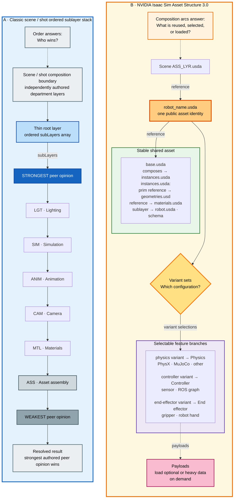
```mermaid
flowchart LR
    subgraph Classic["A · Classic scene / shot ordered sublayer stack"]
        direction TB
        ClassicQuestion["Order answers:<br/>Who wins?"]
        ClassicScope["Scene / shot composition boundary<br/>independently authored department layers"]
        ClassicRoot["Thin root layer<br/>ordered subLayers array"]
        Strong["STRONGEST peer opinion"]
        LGT["LGT · Lighting"]
        SIM["SIM · Simulation"]
        ANIM["ANIM · Animation"]
        CAM["CAM · Camera"]
        MTL["MTL · Materials"]
        ASS["ASS · Asset assembly"]
        Weak["WEAKEST peer opinion"]
        ClassicResult["Resolved result<br/>strongest authored peer opinion wins"]

        ClassicQuestion -.-> ClassicScope
        ClassicScope --> ClassicRoot
        ClassicRoot -->|"subLayers"| Strong
        Strong --> LGT --> SIM --> ANIM --> CAM --> MTL --> ASS --> Weak --> ClassicResult
    end

    subgraph Isaac["B · NVIDIA Isaac Sim Asset Structure 3.0"]
        direction TB
        IsaacQuestion["Composition arcs answer:<br/>What is reused, selected,<br/>or loaded?"]
        SceneASS["Scene ASS_LYR.usda"]
        Public["robot_name.usda<br/>one public asset identity"]

        subgraph Shared["Stable shared asset"]
            direction TB
            SharedStructure["base.usda<br/>composes → instances.usda<br/>instances.usda:<br/>prim reference → geometries.usd<br/>reference → materials.usda<br/>sublayer → robot.usda · schema"]
        end

        Variants{"Variant sets<br/>Which configuration?"}

        subgraph Choices["Selectable feature branches"]
            direction TB
            FeatureBranches["physics variant → Physics<br/>PhysX · MuJoCo · other<br/><br/>controller variant → Controller<br/>sensor · ROS graph<br/><br/>end-effector variant → End effector<br/>gripper · robot hand"]
        end

        Payloads["Payloads<br/>load optional or heavy data<br/>on demand"]

        IsaacQuestion -.-> SceneASS
        SceneASS -->|"reference"| Public
        Public -->|"reference"| SharedStructure
        SharedStructure ~~~ Variants
        Public --> Variants
        Variants -->|"variant selections"| FeatureBranches
        FeatureBranches -.->|"payloads"| Payloads
    end

    Classic ~~~ Isaac

    style Classic fill:#e3f2fd,stroke:#1565c0,stroke-width:3px,color:#000
    style Isaac fill:#fff8e1,stroke:#ef6c00,stroke-width:3px,color:#000
    style Shared fill:#e8f5e9,stroke:#2e7d32,stroke-width:2px,color:#000
    style Choices fill:#ede7f6,stroke:#5e35b1,stroke-width:2px,color:#000
    style ClassicRoot fill:#bbdefb,stroke:#0d47a1,stroke-width:2px,color:#000
    style Strong fill:#1565c0,stroke:#0d47a1,stroke-width:2px,color:#fff
    style Weak fill:#90a4ae,stroke:#455a64,stroke-width:2px,color:#000
    style ASS fill:#cfd8dc,stroke:#455a64,stroke-width:2px,color:#000
    style ClassicQuestion fill:#eceff1,stroke:#546e7a,stroke-width:2px,color:#000
    style ClassicScope fill:#eceff1,stroke:#546e7a,stroke-width:2px,color:#000
    style ClassicResult fill:#eceff1,stroke:#546e7a,stroke-width:2px,color:#000
    style Public fill:#ffcc80,stroke:#e65100,stroke-width:3px,color:#000
    style Variants fill:#ffe082,stroke:#f57f17,stroke-width:3px,color:#000
    style Payloads fill:#f8bbd0,stroke:#ad1457,stroke-width:2px,color:#000
    style IsaacQuestion fill:#fff3e0,stroke:#ef6c00,stroke-width:2px,color:#000
```

*Paradigm comparison — Both panels retain their full internal structure. The classic side shows the complete peer-opinion stack from strongest to weakest. The Isaac Sim side shows the scene reference, public asset identity, stable shared asset files, variant-selected feature branches, and deferred payload path. The layouts are normalized for direct side-by-side comparison; Section 16 provides the source evidence and detailed interpretation.*

### Sublayer-order paradigms

The M&E and proposed USD GoodStart diagrams mainly visualize **peer opinion strength**. Their vertical order answers who wins when multiple layers author an opinion at the same composed location. M&E commonly organizes the stack by downstream shot refinement, while the proposed USD GoodStart layer order organizes it by digital-twin ownership, update frequency, and operational responsibility. These are valid domain-specific policies, but they remain policies built on the same `subLayers` mechanism.

In this paradigm, changing the order can change the resolved result. The root should remain thin because local root opinions are stronger than every sublayer. References and payloads normally enter through an asset or assembly layer; they are not substitutes for defining the ownership and strength of peer scene contributions.

### Asset-publication paradigms

A reusable asset package asks a different question. It needs a stable downstream reference target even while its geometry, materials, metadata, or payload organization evolves internally. The public asset layer acts as a contract. Consumers reference that interface rather than sublayering or referencing its private implementation files individually.

Here the important boundary is **public versus internal**, not simply strongest versus weakest. References preserve reusable asset identity and namespace; payloads add load control for heavy data; internal sublayers allow independently authored but package-owned opinions to participate in the asset's layer stack.

### Why the Isaac Sim paradigm is special

Isaac Sim extends the published-asset model into a **configurable simulation product**. Its `robot_name.usda` interface keeps a single asset identity, while the package combines several composition strategies:

- A **reference** brings in the stable base asset stack.
- **Prim references** reuse geometry and material resources in the instances/assembly layer.
- **Sublayers** add compatible package-owned contributions such as robot schema or shared physics foundations.
- **Payloads** defer optional or backend-specific feature data until it is required.
- **Variant sets** expose controlled choices such as PhysX versus MuJoCo, controller configurations, or alternative end effectors.

This matters because a variant set expresses **configuration**, not chronological authorship and not department priority. Creating separate top-level scene layers for every physics engine, controller, and gripper would mix configuration with scene ownership and make the public asset path unstable. Isaac Sim instead keeps shared geometry and identity constant while selecting only the feature branches needed for a particular simulation context.

The pattern can be summarized as:

```text
scene ownership stack
  -> ASS_LYR references one public robot interface
       -> reference composes the shared base asset
       -> variant set selects a physics implementation
       -> variant set selects controller / ROS features
       -> variant set selects an end effector
       -> payloads load optional or heavy implementation data
```

The crucial lesson for the proposed USD GoodStart layer order is not to replace its scene-level ownership stack with the Isaac structure. The proposal should use the two paradigms **at different scales**: ordered scene layers define project ownership and strength, while Isaac-style composition below `ASS_LYR.usda` defines the reusable asset's identity, loading behavior, and supported configurations. Section 16 develops this case in detail and maps it onto the proposed USD GoodStart package boundary.

---

## Decision Matrix — Choosing a Composition Paradigm

Use this matrix **for one composition boundary at a time**: the project/scene root, a published asset package, or a configurable feature package. Do not force one answer onto the entire pipeline. A digital-twin scene can use **B** at the project root, **C** for its reusable machines, and **D** inside robots or other configurable simulation assets.

| Profile | Paradigm | Primary design question | Typical OpenUSD center of gravity |
|---------|----------|-------------------------|-----------------------------------|
| **A** | **Departmental / shot refinement** | Which peer contribution wins as departments refine the same shot or sequence? | Ordered `subLayers`; thin root; explicit strongest-to-weakest policy |
| **B** | **Scene / digital-twin ownership lanes** | Which system owns assets, metadata, simulation, cameras, runtime state, and overrides in a long-lived scene? | Ordered scene-level `subLayers`; write-target and lifecycle contracts; references/payloads at asset boundaries |
| **C** | **Published reusable asset** | How does an asset keep one stable public identity while its internal implementation and heavy data evolve? | Public interface layer; references; payloads; bounded asset-internal layers |
| **D** | **Configurable simulation product** | How does one asset identity expose controlled physics, controller, behavior, or equipment configurations? | Public interface + shared base; variant sets; references; payloads; optional feature stacks |

### Questions and scoring

Answer each question with **Yes**, **Partly**, or **No**. For **Yes**, add the displayed points; for **Partly**, add half the points; for **No**, add zero. A dash means the question is not a useful signal for that profile.

| # | Question | A | B | C | D |
|---|----------|--:|--:|--:|--:|
| 1 | Is the main production unit a **shot or sequence** refined by several departments? | +3 | — | — | — |
| 2 | Is the central conflict-resolution question **which peer layer should override another**? | +3 | +1 | — | — |
| 3 | Is the result a **long-lived scene or operational world**, rather than primarily a shot publish? | — | +3 | +1 | +1 |
| 4 | Must multiple tools or teams own separate scene concerns such as assets, metadata, simulation, cameras, and overrides? | +1 | +3 | — | — |
| 5 | Must live/latest runtime state remain separate from stable authored facts and configuration? | — | +3 | — | +1 |
| 6 | Will the same asset be reused by several scenes, projects, customers, or simulation contexts? | — | +1 | +3 | +2 |
| 7 | Must downstream users keep one **stable reference target** while asset internals change? | — | — | +3 | +2 |
| 8 | Is heavy or optional content required only on demand? | — | +1 | +2 | +2 |
| 9 | Does the asset expose a finite set of **supported configurations**, rather than arbitrary downstream edits? | — | — | +1 | +3 |
| 10 | Must users select physics backends, controllers, sensors, behaviors, end effectors, or equivalent feature families? | — | — | — | +3 |
| 11 | Must those configurations preserve the same public asset identity and downstream path? | — | — | +2 | +3 |
| 12 | Are reusable or configurable asset packages nested below a larger project/scene ownership stack? | — | +2 | +2 | +1 |

Because the profiles intentionally contain different numbers of relevant signals, compare **normalized scores**, not raw totals:

```text
A score = A raw total / 7  × 100
B score = B raw total / 14 × 100
C score = C raw total / 14 × 100
D score = D raw total / 18 × 100
```

### Validity gates

A high score is meaningful only when the profile's minimum condition is also true:

| Profile | Minimum condition before selecting it |
|---------|---------------------------------------|
| **A** | At least one of Questions **1–2** is Yes, and multiple peer contributions genuinely need an override order. |
| **B** | At least one of Questions **3–5** is Yes, and the scene has more than one ownership or lifecycle lane. |
| **C** | Questions **6 or 7** are Yes. There must be a real reuse or stable-interface requirement. |
| **D** | Question **9** is Yes and at least one of Questions **10–11** is Yes. A configurable product also requires the stable public interface of **C**. |

### Reading the result

1. Discard profiles that fail their validity gate.
2. The highest remaining **normalized percentage** is the **primary paradigm for the boundary being evaluated**.
3. Valid profiles within **10 percentage points** of each other indicate a likely hybrid—not an error.
4. Apply the paradigms at their natural scale instead of merging all of their files into one root stack.

| Result | Recommended starting architecture |
|--------|-----------------------------------|
| **A wins** | Thin shot/sequence root with an explicitly ordered departmental sublayer stack. |
| **B wins** | Thin project root with contracted ownership lanes, declared write targets, and separate treatment of authored versus runtime state. |
| **C wins** | One published asset interface referenced by consumers; hide implementation details and heavy content behind internal layers and payloads. |
| **D wins** | Start with **C**, then add controlled variant sets and optional payloaded feature stacks around a shared asset base. |
| **B + C** | Scene-level ownership stack containing reusable published asset packages—the common digital-twin pattern. |
| **B + C + D** | Scene-level ownership stack containing reusable, configurable simulation products—the factory/robot pattern developed in Section 16.1. |
| **A + C** | Departmental shot stack consuming stable published assets—the common M&E production pattern. |

> **Decision principle:** Choose `subLayers` when the question is primarily **“who owns or overrides this opinion?”** Choose a public asset interface with references/payloads when the question is **“what reusable thing is this?”** Add variant sets when the question is **“which supported configuration of that thing is active?”**

---

## 1. Michael O'Brien — M&E Shot Stack (Slack, June 2026)

**Context:** Discussion with Jan Haluszka about the [proposed USD GoodStart layer order](https://github.com/jph2/USD_GoodStart#tldr-too-long-didnt-read). Michael described how **Media & Entertainment (M&E)** pipelines usually think about layer resolution: departments refine the shot in passes; **ASS_LYR is the lowest (weakest) opinion** — the base asset import layer.

**Michael's principles (paraphrased):**

- **LGT on top** — you light *to the camera*
- **SIM above ANIM** — simulation consumes animation and must be able to override it
- **CAM below ANIM** — you animate *to the camera* (camera animation often lives with or below anim in the stack)
- **MAT above ASS** — materials/shading override imported asset defaults
- **ASS at bottom** — references, payloads, geometry import (weakest sublayer)

Michael shared **two related sketches** in Slack — both use **three parallel shot pillars** on a **shared MAT+ASS base**, but the second adds **sequence-wide SIM and LGT** bands that shots sit on top of (per-shot layers override the global defaults).

**Two views of the same rules:**

| View | Structure | Use when |
|------|-----------|----------|
| **Single-shot collapse** | One vertical stack: LGT → SIM → ANIM → CAM → MTL → ASS | Teaching dept strength order for one shot root |
| **Sketch 1 (upper)** | **Three pillars** (LGT→SIM→ANIM→CAM each) + **shared** MTL + ASS | Multi-shot tracks; each pillar carries full dept stack |
| **Sketch 2 (lower)** | **Global SIM + global LGT** (sequence-wide) → **three shot pillars on top** → shared MTL + ASS | Sequence defaults first; per-shot CAM/ANIM/SIM/LGT refine and override |

**Per-pillar stack (strong → weak, top → bottom):**

| # | Layer | Role |
|---|-------|------|
| 1 | **LGT** | Lighting — strongest opinion in that pillar (overrides global LGT) |
| 2 | **SIM** | Simulation (CFX, effects, etc.) — overrides global SIM |
| 3 | **ANIM** | Animation |
| 4 | **CAM** | Cameras — bottom of pillar, rests on global / shared layers |

**Sketch 2 — sequence-wide bands (strong → weak, between pillars and MAT):**

| # | Layer | Role |
|---|-------|------|
| 5 | **LGT (global)** | Sequence-wide lighting defaults — weaker than per-shot LGT |
| 6 | **SIM (global)** | Sequence-wide simulation setup — weaker than per-shot SIM |

**Shared base (strong → weak):**

| # | Layer | Role |
|---|-------|------|
| 7 | **MTL** | Materials & shading — overrides imported asset defaults |
| 8 | **ASS** | Asset import — references & payloads (weakest) |

**How the sketches might be realized in USD** (Michael did not prescribe file names — interpretive mapping):

- **Shared foundation:** sequence root sublayers **MTL** then **ASS** (ASS weakest / last in `subLayers`).
- **Sketch 2 middle:** sequence root also sublayers **global SIM** then **global LGT** above MAT (still below per-shot stacks).
- **Per pillar:** shot root sublayers **CAM → ANIM → SIM → LGT** (weak→strong in file; diagram shows strong at top), composed on the sequence stage.
- **Override rule:** per-shot LGT/SIM in a pillar **wins over** the global LGT/SIM bands; global provides defaults before shot-specific finish.

**Not a published spec** — studio pipeline convention shared in conversation. Aligns with several public VFX examples (SideFX, openusd.work) but is not authored by Pixar/ASWF as a normative standard.

#### Sketch 1

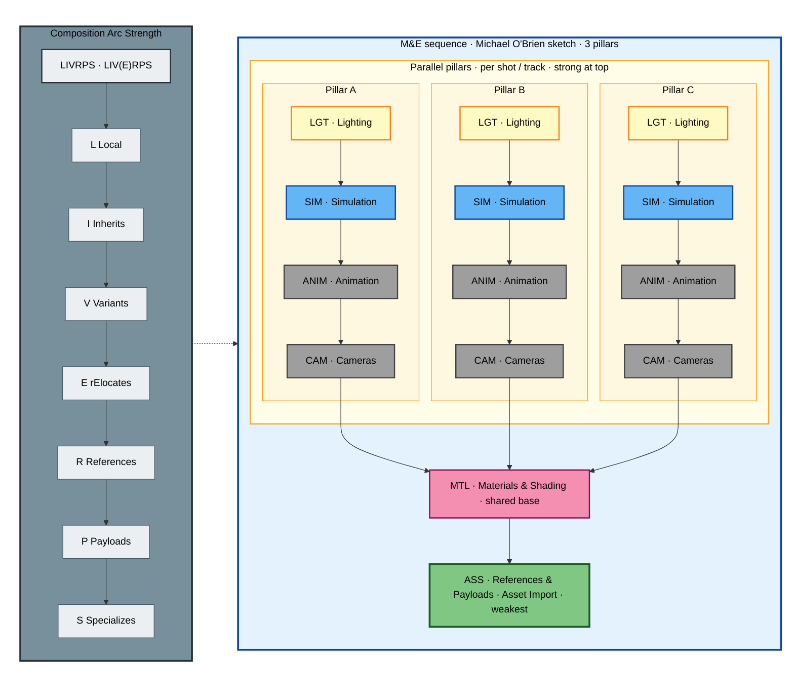
```mermaid
flowchart LR
    subgraph LeftColumn[" "]
        direction TB
        subgraph LIVRPSBox["Composition Arc Strength"]
            direction TB
            LIVHdr["LIVRPS · LIV(E)RPS"]
            ArcL["L Local"]
            ArcI["I Inherits"]
            ArcV["V Variants"]
            ArcE["E rElocates"]
            ArcR["R References"]
            ArcP["P Payloads"]
            ArcS["S Specializes"]
            LIVHdr --> ArcL --> ArcI --> ArcV --> ArcE --> ArcR --> ArcP --> ArcS
        end
    end

    subgraph RootContainer["M&E sequence · Michael O'Brien sketch · 3 pillars"]
        direction TB

        subgraph Pillars["Parallel pillars · per shot / track · strong at top"]
            direction LR
            subgraph PillarA["Pillar A"]
                direction TB
                LgtA["LGT · Lighting"]
                SimA["SIM · Simulation"]
                AnimA["ANIM · Animation"]
                CamA["CAM · Cameras"]
                LgtA --> SimA --> AnimA --> CamA
            end
            subgraph PillarB["Pillar B"]
                direction TB
                LgtB["LGT · Lighting"]
                SimB["SIM · Simulation"]
                AnimB["ANIM · Animation"]
                CamB["CAM · Cameras"]
                LgtB --> SimB --> AnimB --> CamB
            end
            subgraph PillarC["Pillar C"]
                direction TB
                LgtC["LGT · Lighting"]
                SimC["SIM · Simulation"]
                AnimC["ANIM · Animation"]
                CamC["CAM · Cameras"]
                LgtC --> SimC --> AnimC --> CamC
            end
        end

        Mtl["MTL · Materials & Shading · shared base"]
        Ass["ASS · References & Payloads · Asset Import · weakest"]

        CamA --> Mtl
        CamB --> Mtl
        CamC --> Mtl
        Mtl --> Ass
    end

    LIVRPSBox -.-> RootContainer

    style LeftColumn fill:none,stroke:none,color:#000
    style RootContainer fill:#e3f2fd,stroke:#0d47a1,stroke-width:3px,color:#000
    style Pillars fill:#fffde7,stroke:#f9a825,stroke-width:2px,color:#000
    style PillarA fill:#fff8e1,stroke:#ff8f00,stroke-width:1px,color:#000
    style PillarB fill:#fff8e1,stroke:#ff8f00,stroke-width:1px,color:#000
    style PillarC fill:#fff8e1,stroke:#ff8f00,stroke-width:1px,color:#000
    style LIVRPSBox fill:#78909c,stroke:#263238,stroke-width:3px,color:#000
    style LIVHdr fill:#eceff1,stroke:#263238,stroke-width:2px,color:#000
    style ArcL fill:#eceff1,stroke:#455a64,stroke-width:1px,color:#000
    style ArcI fill:#eceff1,stroke:#455a64,stroke-width:1px,color:#000
    style ArcV fill:#eceff1,stroke:#455a64,stroke-width:1px,color:#000
    style ArcE fill:#eceff1,stroke:#455a64,stroke-width:1px,color:#000
    style ArcR fill:#eceff1,stroke:#455a64,stroke-width:1px,color:#000
    style ArcP fill:#eceff1,stroke:#455a64,stroke-width:1px,color:#000
    style ArcS fill:#eceff1,stroke:#455a64,stroke-width:1px,color:#000
    style LgtA fill:#fff9c4,stroke:#f57f17,stroke-width:2px,color:#000
    style LgtB fill:#fff9c4,stroke:#f57f17,stroke-width:2px,color:#000
    style LgtC fill:#fff9c4,stroke:#f57f17,stroke-width:2px,color:#000
    style SimA fill:#64b5f6,stroke:#0d47a1,stroke-width:2px,color:#000
    style SimB fill:#64b5f6,stroke:#0d47a1,stroke-width:2px,color:#000
    style SimC fill:#64b5f6,stroke:#0d47a1,stroke-width:2px,color:#000
    style AnimA fill:#9e9e9e,stroke:#424242,stroke-width:2px,color:#000
    style AnimB fill:#9e9e9e,stroke:#424242,stroke-width:2px,color:#000
    style AnimC fill:#9e9e9e,stroke:#424242,stroke-width:2px,color:#000
    style CamA fill:#9e9e9e,stroke:#424242,stroke-width:2px,color:#000
    style CamB fill:#9e9e9e,stroke:#424242,stroke-width:2px,color:#000
    style CamC fill:#9e9e9e,stroke:#424242,stroke-width:2px,color:#000
    style Mtl fill:#f48fb1,stroke:#880e4f,stroke-width:2px,color:#000
    style Ass fill:#81c784,stroke:#1b5e20,stroke-width:3px,color:#000
```

#### Sketch 2

Sequence-wide **SIM** and **LGT** are defined once (shared bands). Each **shot pillar** stacks on that foundation; per-shot **LGT/SIM** override the global layers.

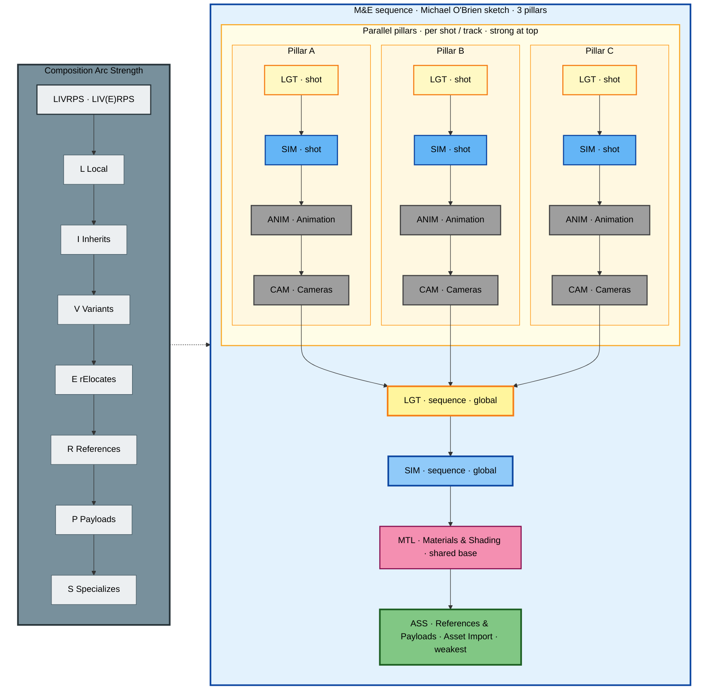
```mermaid
flowchart LR
    subgraph LeftColumn2[" "]
        direction TB
        subgraph LIVRPSBox2["Composition Arc Strength"]
            direction TB
            LIVHdr2["LIVRPS · LIV(E)RPS"]
            ArcL2["L Local"]
            ArcI2["I Inherits"]
            ArcV2["V Variants"]
            ArcE2["E rElocates"]
            ArcR2["R References"]
            ArcP2["P Payloads"]
            ArcS2["S Specializes"]
            LIVHdr2 --> ArcL2 --> ArcI2 --> ArcV2 --> ArcE2 --> ArcR2 --> ArcP2 --> ArcS2
        end
    end

    subgraph RootContainer2["M&E sequence · Michael O'Brien sketch · 3 pillars"]
        direction TB

        subgraph Pillars2["Parallel pillars · per shot / track · strong at top"]
            direction LR
            subgraph PillarA2["Pillar A"]
                direction TB
                LgtA2["LGT · shot"]
                SimA2["SIM · shot"]
                AnimA2["ANIM · Animation"]
                CamA2["CAM · Cameras"]
                LgtA2 --> SimA2 --> AnimA2 --> CamA2
            end
            subgraph PillarB2["Pillar B"]
                direction TB
                LgtB2["LGT · shot"]
                SimB2["SIM · shot"]
                AnimB2["ANIM · Animation"]
                CamB2["CAM · Cameras"]
                LgtB2 --> SimB2 --> AnimB2 --> CamB2
            end
            subgraph PillarC2["Pillar C"]
                direction TB
                LgtC2["LGT · shot"]
                SimC2["SIM · shot"]
                AnimC2["ANIM · Animation"]
                CamC2["CAM · Cameras"]
                LgtC2 --> SimC2 --> AnimC2 --> CamC2
            end
        end

        GlobalLgt["LGT · sequence · global"]
        GlobalSim["SIM · sequence · global"]
        Mtl2["MTL · Materials & Shading · shared base"]
        Ass2["ASS · References & Payloads · Asset Import · weakest"]

        CamA2 --> GlobalLgt
        CamB2 --> GlobalLgt
        CamC2 --> GlobalLgt
        GlobalLgt --> GlobalSim
        GlobalSim --> Mtl2
        Mtl2 --> Ass2
    end

    LIVRPSBox2 -.-> RootContainer2

    style LeftColumn2 fill:none,stroke:none,color:#000
    style RootContainer2 fill:#e3f2fd,stroke:#0d47a1,stroke-width:3px,color:#000
    style Pillars2 fill:#fffde7,stroke:#f9a825,stroke-width:2px,color:#000
    style PillarA2 fill:#fff8e1,stroke:#ff8f00,stroke-width:1px,color:#000
    style PillarB2 fill:#fff8e1,stroke:#ff8f00,stroke-width:1px,color:#000
    style PillarC2 fill:#fff8e1,stroke:#ff8f00,stroke-width:1px,color:#000
    style GlobalLgt fill:#fff59d,stroke:#f57f17,stroke-width:3px,color:#000
    style GlobalSim fill:#90caf9,stroke:#0d47a1,stroke-width:3px,color:#000
    style LIVRPSBox2 fill:#78909c,stroke:#263238,stroke-width:3px,color:#000
    style LIVHdr2 fill:#eceff1,stroke:#263238,stroke-width:2px,color:#000
    style ArcL2 fill:#eceff1,stroke:#455a64,stroke-width:1px,color:#000
    style ArcI2 fill:#eceff1,stroke:#455a64,stroke-width:1px,color:#000
    style ArcV2 fill:#eceff1,stroke:#455a64,stroke-width:1px,color:#000
    style ArcE2 fill:#eceff1,stroke:#455a64,stroke-width:1px,color:#000
    style ArcR2 fill:#eceff1,stroke:#455a64,stroke-width:1px,color:#000
    style ArcP2 fill:#eceff1,stroke:#455a64,stroke-width:1px,color:#000
    style ArcS2 fill:#eceff1,stroke:#455a64,stroke-width:1px,color:#000
    style LgtA2 fill:#fff9c4,stroke:#f57f17,stroke-width:2px,color:#000
    style LgtB2 fill:#fff9c4,stroke:#f57f17,stroke-width:2px,color:#000
    style LgtC2 fill:#fff9c4,stroke:#f57f17,stroke-width:2px,color:#000
    style SimA2 fill:#64b5f6,stroke:#0d47a1,stroke-width:2px,color:#000
    style SimB2 fill:#64b5f6,stroke:#0d47a1,stroke-width:2px,color:#000
    style SimC2 fill:#64b5f6,stroke:#0d47a1,stroke-width:2px,color:#000
    style AnimA2 fill:#9e9e9e,stroke:#424242,stroke-width:2px,color:#000
    style AnimB2 fill:#9e9e9e,stroke:#424242,stroke-width:2px,color:#000
    style AnimC2 fill:#9e9e9e,stroke:#424242,stroke-width:2px,color:#000
    style CamA2 fill:#9e9e9e,stroke:#424242,stroke-width:2px,color:#000
    style CamB2 fill:#9e9e9e,stroke:#424242,stroke-width:2px,color:#000
    style CamC2 fill:#9e9e9e,stroke:#424242,stroke-width:2px,color:#000
    style Mtl2 fill:#f48fb1,stroke:#880e4f,stroke-width:2px,color:#000
    style Ass2 fill:#81c784,stroke:#1b5e20,stroke-width:3px,color:#000
```

**Advantages**

- Matches how VFX artists think: **light last, assets first**
- **Three pillars** express multi-shot / NLE-track work without flattening into one misleading linear stack
- **Sketch 2** separates sequence-wide SIM/LGT defaults from per-shot refinement
- SIM above ANIM matches physical sim pipelines (cloth, hair, FX take anim as input)
- Shared MAT+ASS base keeps lookdev and asset import consistent across pillars
- Thin conceptual model — easy to teach once single-shot vs multi-pillar views are separated

**Disadvantages**

- No standard names or file layout — every studio implements differently
- No slot for **runtime/digital-twin data** (OPC UA, MQTT, PLM)
- **CAM below ANIM** conflicts with layouts that lock cameras early (previz, twin monitoring views)
- Combines **environment lighting** and **shot lighting** in one LGT bucket

---

## 2. ASWF / USD Working Group — Asset Timeline Principle

**Source:** [Guidelines for Structuring USD Assets](https://github.com/usd-wg/assets/blob/main/docs/asset-structure-guidelines.md) · [ASWF Wiki](https://lf-aswf.atlassian.net/wiki/spaces/WGUSD/pages/11273723/Guidelines+for+Structuring+USD+Assets)

**What it says:** Layer order follows **workflow timeline** — later contributors override earlier ones. Explicit quote:

> *“…geometry is at the bottom, then materials. And is why **lighting is usually one of the last layers** to contribute to USD assets/shots.”*

**Typical asset contribution order (weak → strong / bottom → top):**

| Bottom (weak) | → | Top (strong) |
|---------------|---|--------------|
| Geometry (payload) | Materials | Rigging / FX / … | **Lighting** |

Layers are often **referenced into payload**, not only sublayered — ASWF recommends referencing for predictable LIV(E)RPS “R” strength.

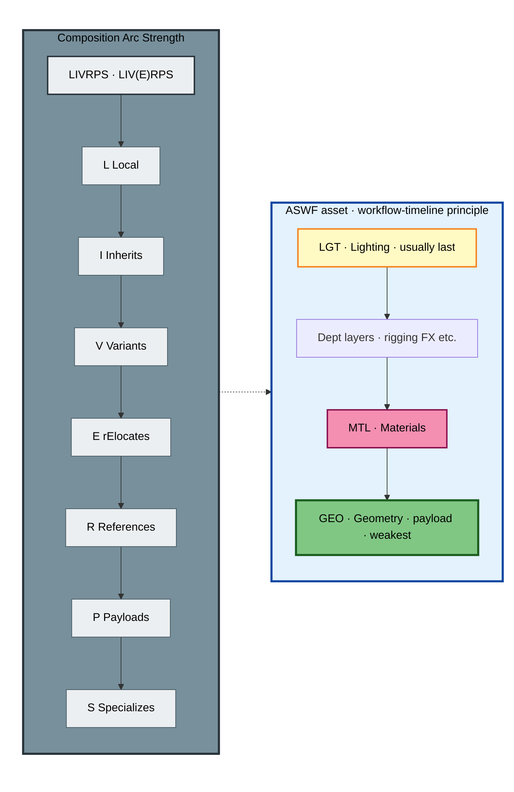
```mermaid
flowchart LR
    subgraph LeftColumn[" "]
        direction TB
        subgraph LIVRPSBox["Composition Arc Strength"]
            direction TB
            LIVHdr["LIVRPS · LIV(E)RPS"]
            ArcL["L Local"]
            ArcI["I Inherits"]
            ArcV["V Variants"]
            ArcE["E rElocates"]
            ArcR["R References"]
            ArcP["P Payloads"]
            ArcS["S Specializes"]
            LIVHdr --> ArcL --> ArcI --> ArcV --> ArcE --> ArcR --> ArcP --> ArcS
        end
    end

    subgraph RootContainer["ASWF asset · workflow-timeline principle"]
        direction TB
        Lgt[LGT · Lighting · usually last]
        Mid[Dept layers · rigging FX etc.]
        Mtl[MTL · Materials]
        Geo[GEO · Geometry · payload · weakest]
        Lgt --> Mid --> Mtl --> Geo
    end

    LIVRPSBox -.-> RootContainer

    style LeftColumn fill:none,stroke:none,color:#000
    style RootContainer fill:#e3f2fd,stroke:#0d47a1,stroke-width:3px,color:#000
    style LIVRPSBox fill:#78909c,stroke:#263238,stroke-width:3px,color:#000
    style LIVHdr fill:#eceff1,stroke:#263238,stroke-width:2px,color:#000
    style ArcL fill:#eceff1,stroke:#455a64,stroke-width:1px,color:#000
    style ArcI fill:#eceff1,stroke:#455a64,stroke-width:1px,color:#000
    style ArcV fill:#eceff1,stroke:#455a64,stroke-width:1px,color:#000
    style ArcE fill:#eceff1,stroke:#455a64,stroke-width:1px,color:#000
    style ArcR fill:#eceff1,stroke:#455a64,stroke-width:1px,color:#000
    style ArcP fill:#eceff1,stroke:#455a64,stroke-width:1px,color:#000
    style ArcS fill:#eceff1,stroke:#455a64,stroke-width:1px,color:#000
    style Geo fill:#81c784,stroke:#1b5e20,stroke-width:3px,color:#000
    style Mtl fill:#f48fb1,stroke:#880e4f,stroke-width:2px,color:#000
    style Lgt fill:#fff9c4,stroke:#f57f17,stroke-width:2px,color:#000
```

**Advantages**

- Industry-neutral, ASWF-backed starting point
- Explains **why** order matters, not just **what** to name layers
- Applies to **assets** and **shots**
- Encourages payloads + references — good for performance

**Disadvantages**

- **Not a fixed layer list** — “rigging, FX, etc.” is intentionally vague
- Per-asset vs per-shot stacking still requires studio decisions
- Does not address Omniverse live/session layers or digital-twin data feeds

---

## 3. SideFX Houdini — Shot Sublayer Example

**Source:** [Sublayer LOP documentation](https://www.sidefx.com/docs/houdini20.5/nodes/lop/sublayer.html)

Canonical teaching example for **shot-level** sublayers:

```usda
subLayers = [
    @shotLighting.usd@,
    @shotFX.usd@,
    @shotAnimation.usd@,
    @shotSetDressing.usd@,
    @sequence.usd@
]
```

**Order (strong → weak):** Lighting → FX → Animation → Set dressing → Sequence

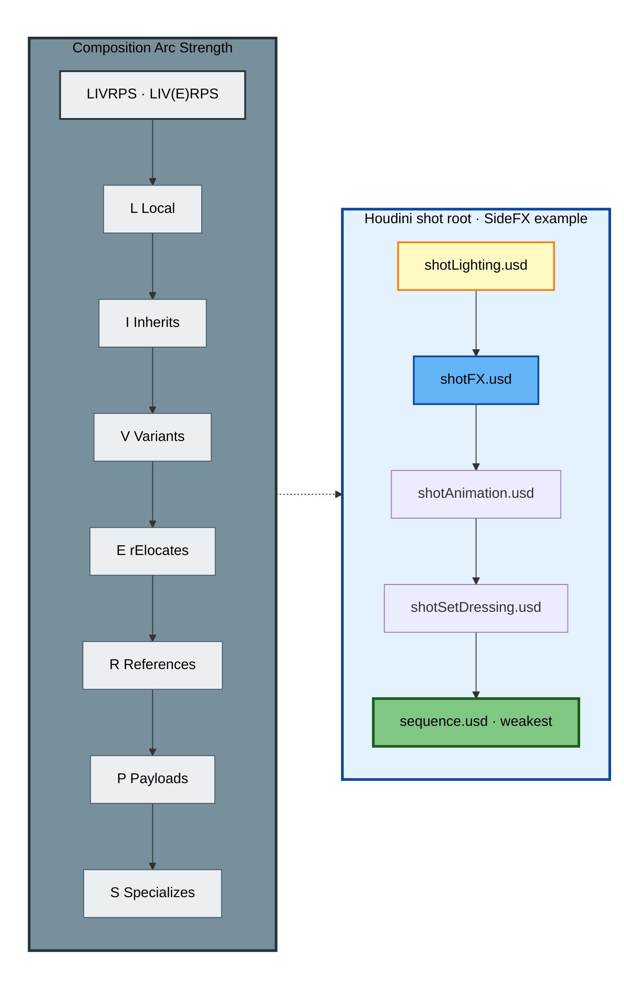
```mermaid
flowchart LR
    subgraph LeftColumn[" "]
        direction TB
        subgraph LIVRPSBox["Composition Arc Strength"]
            direction TB
            LIVHdr["LIVRPS · LIV(E)RPS"]
            ArcL["L Local"]
            ArcI["I Inherits"]
            ArcV["V Variants"]
            ArcE["E rElocates"]
            ArcR["R References"]
            ArcP["P Payloads"]
            ArcS["S Specializes"]
            LIVHdr --> ArcL --> ArcI --> ArcV --> ArcE --> ArcR --> ArcP --> ArcS
        end
    end

    subgraph RootContainer["Houdini shot root · SideFX example"]
        direction TB
        Lgt[shotLighting.usd]
        Fx[shotFX.usd]
        Anim[shotAnimation.usd]
        Dress[shotSetDressing.usd]
        Seq[sequence.usd · weakest]
        Lgt --> Fx --> Anim --> Dress --> Seq
    end

    LIVRPSBox -.-> RootContainer

    style LeftColumn fill:none,stroke:none,color:#000
    style RootContainer fill:#e3f2fd,stroke:#0d47a1,stroke-width:3px,color:#000
    style LIVRPSBox fill:#78909c,stroke:#263238,stroke-width:3px,color:#000
    style LIVHdr fill:#eceff1,stroke:#263238,stroke-width:2px,color:#000
    style ArcL fill:#eceff1,stroke:#455a64,stroke-width:1px,color:#000
    style ArcI fill:#eceff1,stroke:#455a64,stroke-width:1px,color:#000
    style ArcV fill:#eceff1,stroke:#455a64,stroke-width:1px,color:#000
    style ArcE fill:#eceff1,stroke:#455a64,stroke-width:1px,color:#000
    style ArcR fill:#eceff1,stroke:#455a64,stroke-width:1px,color:#000
    style ArcP fill:#eceff1,stroke:#455a64,stroke-width:1px,color:#000
    style ArcS fill:#eceff1,stroke:#455a64,stroke-width:1px,color:#000
    style Lgt fill:#fff9c4,stroke:#f57f17,stroke-width:2px,color:#000
    style Fx fill:#64b5f6,stroke:#0d47a1,stroke-width:2px,color:#000
    style Seq fill:#81c784,stroke:#1b5e20,stroke-width:3px,color:#000
```

**Advantages**

- **Concrete, copy-paste** shot stack from a major DCC
- Separates **FX** from **ANIM** explicitly (Michael's SIM slot)
- **Sequence** at bottom preserves seq-wide layout as weak base
- Documents sublayer **replacement/reorder** in LOP networks

**Disadvantages**

- VFX-specific — no materials layer in this minimal example (often on assets)
- No camera layer called out
- Assumes Houdini LOP “strongest empty root” authoring model

---

## 4. Pixar — SIGGRAPH 2019 Composition (Teaching Shot)

**Source:** [USD Composition — SIGGRAPH 2019 (PDF)](https://openusd.org/files/Siggraph2019_USD%20Composition.pdf)

Pixar's teaching example uses `shot.usd` with sublayers such as **`shot_layout.usd`** and **`shot_sets.usd`**. It demonstrates **merge + override**, not a full department stack:

- Layout positions characters and sets
- Stronger layers (root or earlier sublayers) **non-destructively override** layout transforms
- **LIV(E)RPS** introduced as the cross-arc strength rubric

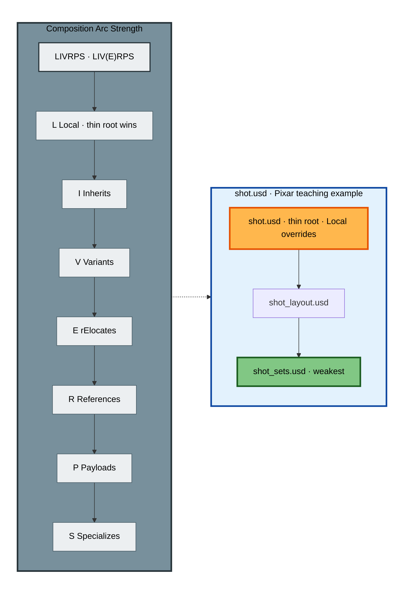
```mermaid
flowchart LR
    subgraph LeftColumn[" "]
        direction TB
        subgraph LIVRPSBox["Composition Arc Strength"]
            direction TB
            LIVHdr["LIVRPS · LIV(E)RPS"]
            ArcL["L Local · thin root wins"]
            ArcI["I Inherits"]
            ArcV["V Variants"]
            ArcE["E rElocates"]
            ArcR["R References"]
            ArcP["P Payloads"]
            ArcS["S Specializes"]
            LIVHdr --> ArcL --> ArcI --> ArcV --> ArcE --> ArcR --> ArcP --> ArcS
        end
    end

    subgraph RootContainer["shot.usd · Pixar teaching example"]
        direction TB
        RootLocal[shot.usd · thin root · Local overrides]
        Layout[shot_layout.usd]
        Sets[shot_sets.usd · weakest]
        RootLocal --> Layout --> Sets
    end

    LIVRPSBox -.-> RootContainer

    style LeftColumn fill:none,stroke:none,color:#000
    style RootContainer fill:#e3f2fd,stroke:#0d47a1,stroke-width:3px,color:#000
    style LIVRPSBox fill:#78909c,stroke:#263238,stroke-width:3px,color:#000
    style LIVHdr fill:#eceff1,stroke:#263238,stroke-width:2px,color:#000
    style ArcL fill:#eceff1,stroke:#455a64,stroke-width:1px,color:#000
    style ArcI fill:#eceff1,stroke:#455a64,stroke-width:1px,color:#000
    style ArcV fill:#eceff1,stroke:#455a64,stroke-width:1px,color:#000
    style ArcE fill:#eceff1,stroke:#455a64,stroke-width:1px,color:#000
    style ArcR fill:#eceff1,stroke:#455a64,stroke-width:1px,color:#000
    style ArcP fill:#eceff1,stroke:#455a64,stroke-width:1px,color:#000
    style ArcS fill:#eceff1,stroke:#455a64,stroke-width:1px,color:#000
    style RootLocal fill:#ffb74d,stroke:#e65100,stroke-width:3px,color:#000
    style Sets fill:#81c784,stroke:#1b5e20,stroke-width:3px,color:#000
```

**Advantages**

- **Authoritative** on composition mechanics (layer stack, strength, non-destructive override)
- Shows why **root must stay thin**
- Foundation for all other conventions

**Disadvantages**

- **Does not prescribe** LGT / ANIM / SIM ordering
- Shot examples are simplified vs real Presto pipelines
- PDF age — rElocates now in LIV(E)RPS spec

---

## 5. NVIDIA Omniverse — Explorer / Conductor Stage Layers

**Source:** [Omniverse Layers Extension](https://docs.omniverse.nvidia.com/extensions/latest/ext_core/ext_layers.html) · [Data Aggregation Best Practices](https://docs.omniverse.nvidia.com/usd/latest/learn-openusd/independent/best-practices.html)

Omniverse documents **named stage layers** for digital-twin / conductor workflows. UI stacks layers **bottom-up**: higher in the panel = **stronger**.

**Documented work layers (typical strength high → low):**

| Strong | → | Weak |
|--------|---|------|
| Animation | Layout | Material | Lighting | Camera | Simulation | **Assets** |

Plus: Session layer (strongest during live edit), thin ROOT, optional Locked / Markup / Waypoint layers.

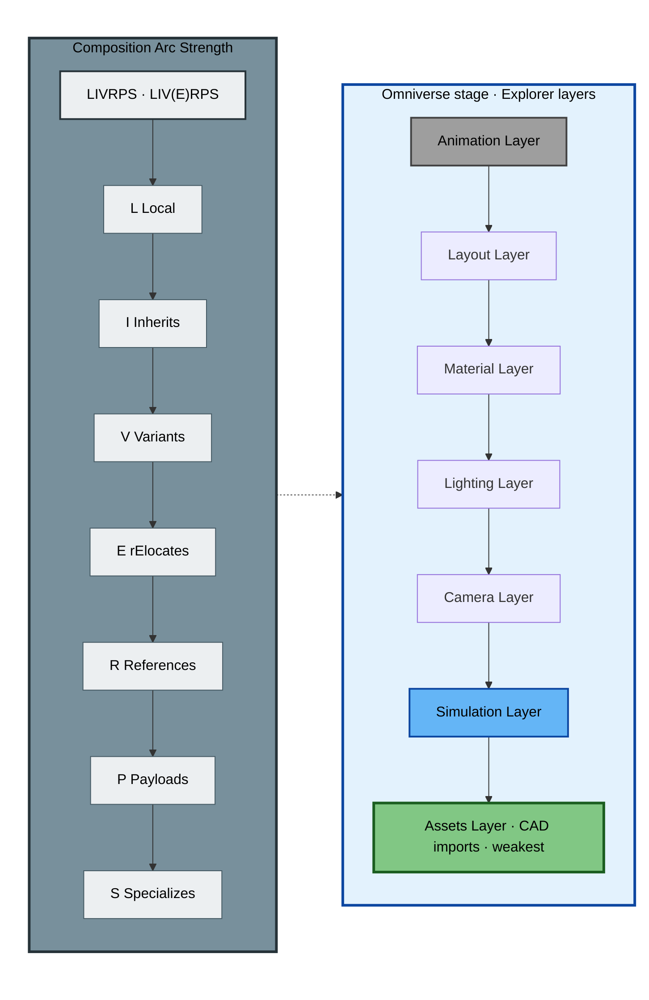
```mermaid
flowchart LR
    subgraph LeftColumn[" "]
        direction TB
        subgraph LIVRPSBox["Composition Arc Strength"]
            direction TB
            LIVHdr["LIVRPS · LIV(E)RPS"]
            ArcL["L Local"]
            ArcI["I Inherits"]
            ArcV["V Variants"]
            ArcE["E rElocates"]
            ArcR["R References"]
            ArcP["P Payloads"]
            ArcS["S Specializes"]
            LIVHdr --> ArcL --> ArcI --> ArcV --> ArcE --> ArcR --> ArcP --> ArcS
        end
    end

    subgraph RootContainer["Omniverse stage · Explorer layers"]
        direction TB
        Anim[Animation Layer]
        Layout[Layout Layer]
        Mtl[Material Layer]
        Lgt[Lighting Layer]
        Cam[Camera Layer]
        Sim[Simulation Layer]
        Ass[Assets Layer · CAD imports · weakest]
        Anim --> Layout --> Mtl --> Lgt --> Cam --> Sim --> Ass
    end

    LIVRPSBox -.-> RootContainer

    style LeftColumn fill:none,stroke:none,color:#000
    style RootContainer fill:#e3f2fd,stroke:#0d47a1,stroke-width:3px,color:#000
    style LIVRPSBox fill:#78909c,stroke:#263238,stroke-width:3px,color:#000
    style LIVHdr fill:#eceff1,stroke:#263238,stroke-width:2px,color:#000
    style ArcL fill:#eceff1,stroke:#455a64,stroke-width:1px,color:#000
    style ArcI fill:#eceff1,stroke:#455a64,stroke-width:1px,color:#000
    style ArcV fill:#eceff1,stroke:#455a64,stroke-width:1px,color:#000
    style ArcE fill:#eceff1,stroke:#455a64,stroke-width:1px,color:#000
    style ArcR fill:#eceff1,stroke:#455a64,stroke-width:1px,color:#000
    style ArcP fill:#eceff1,stroke:#455a64,stroke-width:1px,color:#000
    style ArcS fill:#eceff1,stroke:#455a64,stroke-width:1px,color:#000
    style Ass fill:#81c784,stroke:#1b5e20,stroke-width:3px,color:#000
    style Anim fill:#9e9e9e,stroke:#424242,stroke-width:2px,color:#000
    style Sim fill:#64b5f6,stroke:#0d47a1,stroke-width:2px,color:#000
```

**Advantages**

- **Closest public doc** to the [proposed USD GoodStart layer order](https://github.com/jph2/USD_GoodStart#tldr-too-long-didnt-read) and related digital-twin use cases
- Explicit **Assets layer** at bottom (like ASS_LYR)
- Session + live merge workflow documented
- Material vs Layout ordering explained for **edit protection**

**Disadvantages**

- Layer order in UI is **reorderable** — doc is guidance, not enforcement
- Material vs Layout strength notes can read contradictory without hands-on Kit experience
- VFX-style “LGT always on top” is **not** the Omniverse default narrative

---

## 6. NVIDIA DLI — Asset-Internal Layer Stack

**Source:** [NVIDIA Omniverse DLI workshop PDF](https://hprc.tamu.edu/files/events/workshops/NVIDIA_Omniverse%E2%80%93TAMU_HPRC_DLI_Session.pdf)

Training materials show **per-asset** data layer stacks (not shot roots):

**Order (strong → weak):** FX → Rigging → Shading → **Geometry**

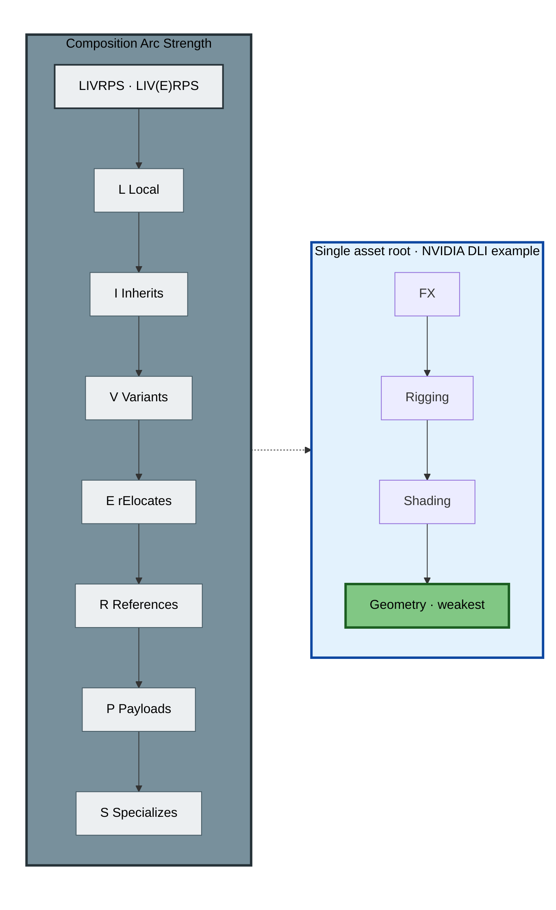
```mermaid
flowchart LR
    subgraph LeftColumn[" "]
        direction TB
        subgraph LIVRPSBox["Composition Arc Strength"]
            direction TB
            LIVHdr["LIVRPS · LIV(E)RPS"]
            ArcL["L Local"]
            ArcI["I Inherits"]
            ArcV["V Variants"]
            ArcE["E rElocates"]
            ArcR["R References"]
            ArcP["P Payloads"]
            ArcS["S Specializes"]
            LIVHdr --> ArcL --> ArcI --> ArcV --> ArcE --> ArcR --> ArcP --> ArcS
        end
    end

    subgraph RootContainer["Single asset root · NVIDIA DLI example"]
        direction TB
        Fx[FX]
        Rig[Rigging]
        Shd[Shading]
        Geo[Geometry · weakest]
        Fx --> Rig --> Shd --> Geo
    end

    LIVRPSBox -.-> RootContainer

    style LeftColumn fill:none,stroke:none,color:#000
    style RootContainer fill:#e3f2fd,stroke:#0d47a1,stroke-width:3px,color:#000
    style LIVRPSBox fill:#78909c,stroke:#263238,stroke-width:3px,color:#000
    style LIVHdr fill:#eceff1,stroke:#263238,stroke-width:2px,color:#000
    style ArcL fill:#eceff1,stroke:#455a64,stroke-width:1px,color:#000
    style ArcI fill:#eceff1,stroke:#455a64,stroke-width:1px,color:#000
    style ArcV fill:#eceff1,stroke:#455a64,stroke-width:1px,color:#000
    style ArcE fill:#eceff1,stroke:#455a64,stroke-width:1px,color:#000
    style ArcR fill:#eceff1,stroke:#455a64,stroke-width:1px,color:#000
    style ArcP fill:#eceff1,stroke:#455a64,stroke-width:1px,color:#000
    style ArcS fill:#eceff1,stroke:#455a64,stroke-width:1px,color:#000
    style Geo fill:#81c784,stroke:#1b5e20,stroke-width:3px,color:#000
```

**Advantages**

- Clear **geometry-at-bottom** rule for assets
- Matches ASWF timeline principle at asset granularity
- Good for explaining payload + department references

**Disadvantages**

- **Asset-scoped**, not shot-scoped — different problem than Michael's sketch
- Not tied to Omniverse Explorer layer names 1:1

---

## 7. openusd.work — Minimal Three-Layer Shot

**Source:** [openusd.work — Production Shot Assembly](https://openusd.work/)

Teaching shorthand:

```usda
subLayers = [
    @./layers/lighting.usd@,
    @./layers/animation.usd@,
    @./layers/layout.usd@
]
```

**Order (strong → weak):** Lighting → Animation → Layout

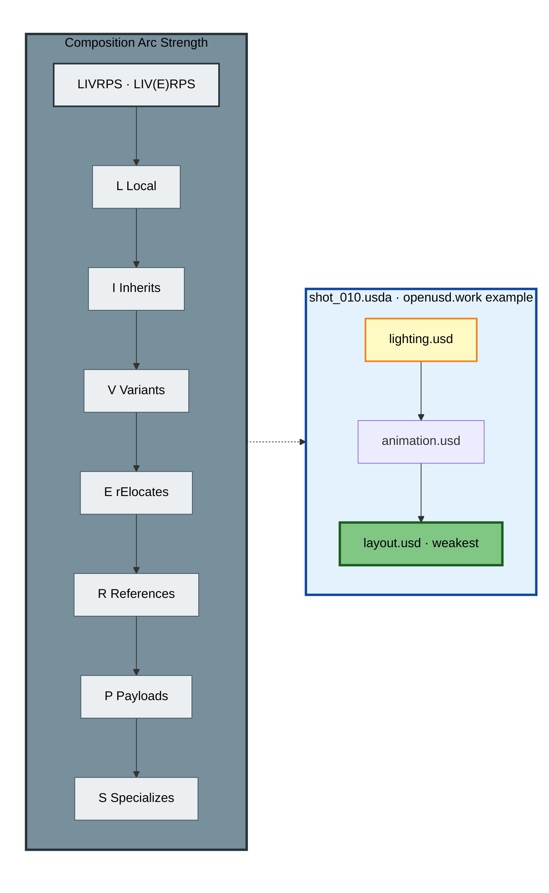
```mermaid
flowchart LR
    subgraph LeftColumn[" "]
        direction TB
        subgraph LIVRPSBox["Composition Arc Strength"]
            direction TB
            LIVHdr["LIVRPS · LIV(E)RPS"]
            ArcL["L Local"]
            ArcI["I Inherits"]
            ArcV["V Variants"]
            ArcE["E rElocates"]
            ArcR["R References"]
            ArcP["P Payloads"]
            ArcS["S Specializes"]
            LIVHdr --> ArcL --> ArcI --> ArcV --> ArcE --> ArcR --> ArcP --> ArcS
        end
    end

    subgraph RootContainer["shot_010.usda · openusd.work example"]
        direction TB
        Lgt[lighting.usd]
        Anim[animation.usd]
        Lay[layout.usd · weakest]
        Lgt --> Anim --> Lay
    end

    LIVRPSBox -.-> RootContainer

    style LeftColumn fill:none,stroke:none,color:#000
    style RootContainer fill:#e3f2fd,stroke:#0d47a1,stroke-width:3px,color:#000
    style LIVRPSBox fill:#78909c,stroke:#263238,stroke-width:3px,color:#000
    style LIVHdr fill:#eceff1,stroke:#263238,stroke-width:2px,color:#000
    style ArcL fill:#eceff1,stroke:#455a64,stroke-width:1px,color:#000
    style ArcI fill:#eceff1,stroke:#455a64,stroke-width:1px,color:#000
    style ArcV fill:#eceff1,stroke:#455a64,stroke-width:1px,color:#000
    style ArcE fill:#eceff1,stroke:#455a64,stroke-width:1px,color:#000
    style ArcR fill:#eceff1,stroke:#455a64,stroke-width:1px,color:#000
    style ArcP fill:#eceff1,stroke:#455a64,stroke-width:1px,color:#000
    style ArcS fill:#eceff1,stroke:#455a64,stroke-width:1px,color:#000
    style Lgt fill:#fff9c4,stroke:#f57f17,stroke-width:2px,color:#000
    style Lay fill:#81c784,stroke:#1b5e20,stroke-width:3px,color:#000
```

**Advantages**

- Minimal teaching stack — easy entry point
- **LGT on top** aligns with Michael and SideFX
- Includes payload/reference patterns in same article

**Disadvantages**

- Community/educational site — **not** Pixar/ASWF normative
- No FX/SIM/CAM/MTL slots

---

## 8. Proposed USD GoodStart Layer Order — Digital Twin + Omniverse Template

**Source:** [Proposed USD GoodStart layer order — TL;DR](https://github.com/jph2/USD_GoodStart#tldr-too-long-didnt-read) · [local USD_GoodStart README](../README.md) · this repo's `USD_GoodStart_ROOT.usda`

**Order (strong → weak):** OPIN → CAM → ENV → RUNTIME → SIM → DATA → ACTGR → ANIM → VAR → MTL → PHY → **ASS**

Full diagram (folder structure + layer stack) lives in the README:

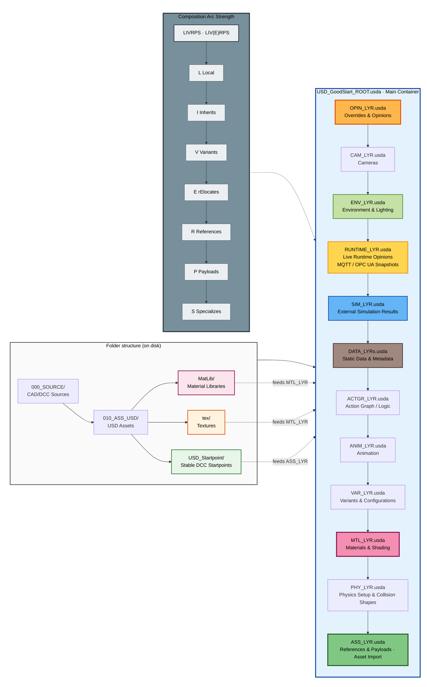
```mermaid
flowchart LR
    subgraph LeftColumn[" "]
        direction TB
        subgraph LIVRPSBox["Composition Arc Strength"]
            direction TB
            LIVHdr["LIVRPS · LIV(E)RPS"]
            ArcL["L Local"]
            ArcI["I Inherits"]
            ArcV["V Variants"]
            ArcE["E rElocates"]
            ArcR["R References"]
            ArcP["P Payloads"]
            ArcS["S Specializes"]
            LIVHdr --> ArcL --> ArcI --> ArcV --> ArcE --> ArcR --> ArcP --> ArcS
        end
        subgraph DiskSources["Folder structure (on disk)"]
            direction TB
            Source[000_SOURCE/<br/>CAD/DCC Sources]
            Assets[010_ASS_USD/<br/>USD Assets]
            MatLib[MatLib/<br/>Material Libraries]
            Tex[tex/<br/>Textures]
            Startpoint[USD_Startpoint/<br/>Stable DCC Startpoints]
            Source --> Assets
            Assets --> MatLib
            Assets --> Tex
            Assets --> Startpoint
        end
    end

    subgraph RootContainer["USD_GoodStart_ROOT.usda · Main Container"]
        direction TB
        Opinion[OPIN_LYR.usda<br/>Overrides & Opinions]
        Camera[CAM_LYR.usda<br/>Cameras]
        Env[ENV_LYR.usda<br/>Environment & Lighting]
        Runtime[RUNTIME_LYR.usda<br/>Live Runtime Opinions<br/>MQTT / OPC UA Snapshots]
        Sim[SIM_LYR.usda<br/>External Simulation Results]
        Data[DATA_LYRs.usda<br/>Static Data & Metadata]
        Actgr[ACTGR_LYR.usda<br/>Action Graph / Logic]
        Anim[ANIM_LYR.usda<br/>Animation]
        Variant[VAR_LYR.usda<br/>Variants & Configurations]
        Material[MTL_LYR.usda<br/>Materials & Shading]
        Physics[PHY_LYR.usda<br/>Physics Setup & Collision Shapes]
        Asset[ASS_LYR.usda<br/>References & Payloads · Asset Import]
        Opinion --> Camera
        Camera --> Env
        Env --> Runtime
        Runtime --> Sim
        Sim --> Data
        Data --> Actgr
        Actgr --> Anim
        Anim --> Variant
        Variant --> Material
        Material --> Physics
        Physics --> Asset
    end

    LIVRPSBox -.-> RootContainer
    DiskSources --> RootContainer
    MatLib -.->|feeds MTL_LYR| RootContainer
    Tex -.->|feeds MTL_LYR| RootContainer
    Startpoint -.->|feeds ASS_LYR| RootContainer

    style LeftColumn fill:none,stroke:none,color:#000
    style RootContainer fill:#e3f2fd,stroke:#0d47a1,stroke-width:3px,color:#000
    style DiskSources fill:#fafafa,stroke:#424242,stroke-width:2px,color:#000
    style LIVRPSBox fill:#78909c,stroke:#263238,stroke-width:3px,color:#000
    style LIVHdr fill:#eceff1,stroke:#263238,stroke-width:2px,color:#000
    style ArcL fill:#eceff1,stroke:#455a64,stroke-width:1px,color:#000
    style ArcI fill:#eceff1,stroke:#455a64,stroke-width:1px,color:#000
    style ArcV fill:#eceff1,stroke:#455a64,stroke-width:1px,color:#000
    style ArcE fill:#eceff1,stroke:#455a64,stroke-width:1px,color:#000
    style ArcR fill:#eceff1,stroke:#455a64,stroke-width:1px,color:#000
    style ArcP fill:#eceff1,stroke:#455a64,stroke-width:1px,color:#000
    style ArcS fill:#eceff1,stroke:#455a64,stroke-width:1px,color:#000
    style Asset fill:#81c784,stroke:#1b5e20,stroke-width:3px,color:#000
    style Opinion fill:#ffb74d,stroke:#e65100,stroke-width:3px,color:#000
    style Material fill:#f48fb1,stroke:#880e4f,stroke-width:3px,color:#000
    style Runtime fill:#ffd54f,stroke:#f57f17,stroke-width:2px,color:#000
    style Sim fill:#64b5f6,stroke:#0d47a1,stroke-width:2px,color:#000
    style Data fill:#a1887f,stroke:#3e2723,stroke-width:2px,color:#000
    style Env fill:#c5e1a5,stroke:#558b2f,stroke-width:2px,color:#000
    style Startpoint fill:#e8f5e9,stroke:#2e7d32,stroke-width:2px,color:#000
    style MatLib fill:#fce4ec,stroke:#880e4f,stroke-width:2px,color:#000
    style Tex fill:#fff3e0,stroke:#e65100,stroke-width:2px,color:#000
```

**Advantages**

- **ASS at bottom** — agrees with Michael, ASWF, Omniverse Assets layer
- **RUNTIME layer** for live/session-backed operational state and explicit MQTT/OPC UA snapshots
- **DATA layer** for static or slow-changing PLM, ERP, AAS, OPC UA mappings, CAD/Revit metadata, and identifiers
- **SIM above ANIM** — agrees with Michael's sim-over-anim rule
- **OPIN on top** — explicit override layer for reviews and emergencies
- Documented folder ↔ layer feed paths (Startpoint → ASS, MatLib/tex → MTL)
- Validation scripts and README per folder

**Disadvantages**

- **CAM high in stack** — opposite of Michael's “CAM below ANIM”
- **ENV mid-stack** — merges environment + lighting unlike dedicated top LGT
- **PHY vs SIM vs RUNTIME** split may confuse Isaac/Ansys/IoT users if the project does not document which layer owns setup, result overlays, and live latest-value state
- **Beta / not fully hardened** — order not battle-tested across all Omniverse Kit versions
- More layers than minimal stacks — higher authoring discipline required

---

## 9. NVIDIA Learn OpenUSD — Skyscraper exercise (shading over geometry)

**Source:** [Working with Sublayers](https://docs.nvidia.com/learn-openusd/latest/creating-composition-arcs/sublayers/working-with-sublayers.html) · [Value Resolution](https://docs.nvidia.com/learn-openusd/latest/beyond-basics/value-resolution.html)

**Pattern:** Two workstreams (`geometry.usd`, `shading.usd`) merged at a shot/building root. Teaching code lists **shading first** (stronger), **geometry second** (weaker):

```python
root_layer.subLayerPaths.append("./contents/shading.usd")
root_layer.subLayerPaths.append("./contents/geometry.usd")
```

**Why:** Material bindings and lookdev must **override** base geometry without editing the geo file — same principle as ASWF “materials above geometry,” but expressed as **sublayer order** instead of asset payload references.

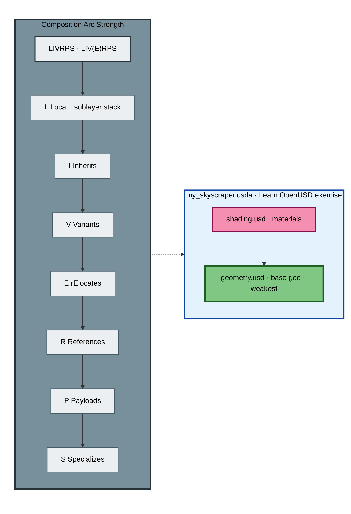
```mermaid
flowchart LR
    subgraph LeftColumn[" "]
        direction TB
        subgraph LIVRPSBox["Composition Arc Strength"]
            direction TB
            LIVHdr["LIVRPS · LIV(E)RPS"]
            ArcL["L Local · sublayer stack"]
            ArcI["I Inherits"]
            ArcV["V Variants"]
            ArcE["E rElocates"]
            ArcR["R References"]
            ArcP["P Payloads"]
            ArcS["S Specializes"]
            LIVHdr --> ArcL --> ArcI --> ArcV --> ArcE --> ArcR --> ArcP --> ArcS
        end
    end

    subgraph RootContainer["my_skyscraper.usda · Learn OpenUSD exercise"]
        direction TB
        Shd[shading.usd · materials]
        Geo[geometry.usd · base geo · weakest]
        Shd --> Geo
    end

    LIVRPSBox -.-> RootContainer

    style LeftColumn fill:none,stroke:none,color:#000
    style RootContainer fill:#e3f2fd,stroke:#0d47a1,stroke-width:3px,color:#000
    style LIVRPSBox fill:#78909c,stroke:#263238,stroke-width:3px,color:#000
    style LIVHdr fill:#eceff1,stroke:#263238,stroke-width:2px,color:#000
    style ArcL fill:#eceff1,stroke:#455a64,stroke-width:1px,color:#000
    style ArcI fill:#eceff1,stroke:#455a64,stroke-width:1px,color:#000
    style ArcV fill:#eceff1,stroke:#455a64,stroke-width:1px,color:#000
    style ArcE fill:#eceff1,stroke:#455a64,stroke-width:1px,color:#000
    style ArcR fill:#eceff1,stroke:#455a64,stroke-width:1px,color:#000
    style ArcP fill:#eceff1,stroke:#455a64,stroke-width:1px,color:#000
    style ArcS fill:#eceff1,stroke:#455a64,stroke-width:1px,color:#000
    style Geo fill:#81c784,stroke:#1b5e20,stroke-width:3px,color:#000
    style Shd fill:#f48fb1,stroke:#880e4f,stroke-width:2px,color:#000
```

**Advantages:** Clear teaching example; separates workstreams; matches “lookdev wins over model” in practice.

**Disadvantages:** Not a full shot stack (no anim/light/cam); easy to mis-read if you assume geometry should always be listed first in code.

---

## 10. NVIDIA da Vinci Workshop — delta layers (film production sample)

**Source:** [da Vinci’s Workshop — Omniverse USD](https://docs.omniverse.nvidia.com/usd/latest/usd_content_samples/davinci_workshop.html)

**Pattern:** Shot/sequence `_base.usd` aggregates **`pub/*/_delta.usda`** contributions in **production-process order**. Diagram is **strength order** — read **chronologically from the bottom**.

**Shot stack (strong → weak):**

| # | Delta layer | Role |
|---|-------------|------|
| 1 | **OVERRIDE** | Emergency / review overrides (rare; strongest) |
| 2 | **finish** | Look, lighting, material tweaks, sky, audio, final notes |
| 3 | **anim** | Deformation / transform caches |
| 4 | **camera** | Shot camera |
| 5 | **assembly** | Asset references + layout (weakest base) |

**Inside `finish`:** `_finish_light.usd`, `_finish_material.usd`, `_finish_sky.usd`, etc. — **lighting and material passes grouped**, similar in spirit to Michael’s top **LGT** + **MTL**, but as nested composition, not only sublayer names.

**Assets** use **references + payloads** at the asset interface (`.usd`), with contributions under `pub/geometry`, `pub/material`, `pub/rig` — **not** one flat sublayer list per mesh.

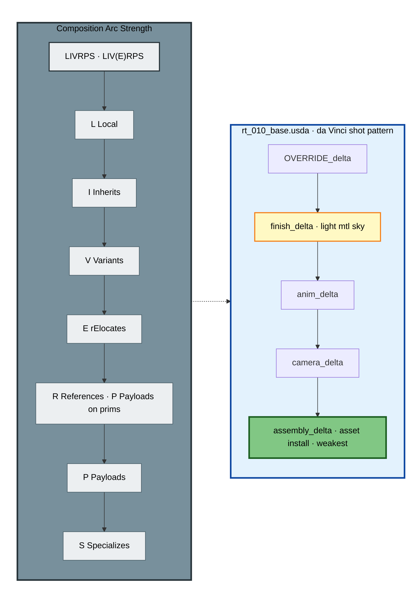
```mermaid
flowchart LR
    subgraph LeftColumn[" "]
        direction TB
        subgraph LIVRPSBox["Composition Arc Strength"]
            direction TB
            LIVHdr["LIVRPS · LIV(E)RPS"]
            ArcL["L Local"]
            ArcI["I Inherits"]
            ArcV["V Variants"]
            ArcE["E rElocates"]
            ArcR["R References · P Payloads on prims"]
            ArcP["P Payloads"]
            ArcS["S Specializes"]
            LIVHdr --> ArcL --> ArcI --> ArcV --> ArcE --> ArcR --> ArcP --> ArcS
        end
    end

    subgraph RootContainer["rt_010_base.usda · da Vinci shot pattern"]
        direction TB
        Ovr[OVERRIDE_delta]
        Fin[finish_delta · light mtl sky]
        Anim[anim_delta]
        Cam[camera_delta]
        Ass[assembly_delta · asset install · weakest]
        Ovr --> Fin --> Anim --> Cam --> Ass
    end

    LIVRPSBox -.-> RootContainer

    style LeftColumn fill:none,stroke:none,color:#000
    style RootContainer fill:#e3f2fd,stroke:#0d47a1,stroke-width:3px,color:#000
    style LIVRPSBox fill:#78909c,stroke:#263238,stroke-width:3px,color:#000
    style LIVHdr fill:#eceff1,stroke:#263238,stroke-width:2px,color:#000
    style ArcL fill:#eceff1,stroke:#455a64,stroke-width:1px,color:#000
    style ArcI fill:#eceff1,stroke:#455a64,stroke-width:1px,color:#000
    style ArcV fill:#eceff1,stroke:#455a64,stroke-width:1px,color:#000
    style ArcE fill:#eceff1,stroke:#455a64,stroke-width:1px,color:#000
    style ArcR fill:#eceff1,stroke:#455a64,stroke-width:1px,color:#000
    style ArcP fill:#eceff1,stroke:#455a64,stroke-width:1px,color:#000
    style ArcS fill:#eceff1,stroke:#455a64,stroke-width:1px,color:#000
    style Ass fill:#81c784,stroke:#1b5e20,stroke-width:3px,color:#000
    style Fin fill:#fff9c4,stroke:#f57f17,stroke-width:2px,color:#000
```

**Advantages:** Production-scale NVIDIA sample; combines sublayers **and** references/payloads/variants; documents OVERRIDE + finish passes; aligns with Michael on **assembly at bottom**, **look/light high**.

**Disadvantages:** Complex nested files; not a minimal template; **camera above anim** here (opposite Michael’s CAM-below-ANIM sketch).

---

## 11. Remedy — Book of USD / per-asset layer stack (games)

**Source:** [Layer Stack — USDBook](https://remedy-entertainment.github.io/USDBook/terminology/layer_stacks.html)

**Pattern:** A single asset root (`furniture_workbench01.usda`) sublayers **modelling → surfacing → rigging**. The layer’s **own opinions sit above all sublayers** (strongest).

**Interpretation:** Department contributions stack on the asset; **surfacing/rigging must override modelling** for materials and skeleton data — same override intent as Learn OpenUSD’s shading-over-geometry, extended to rigging.

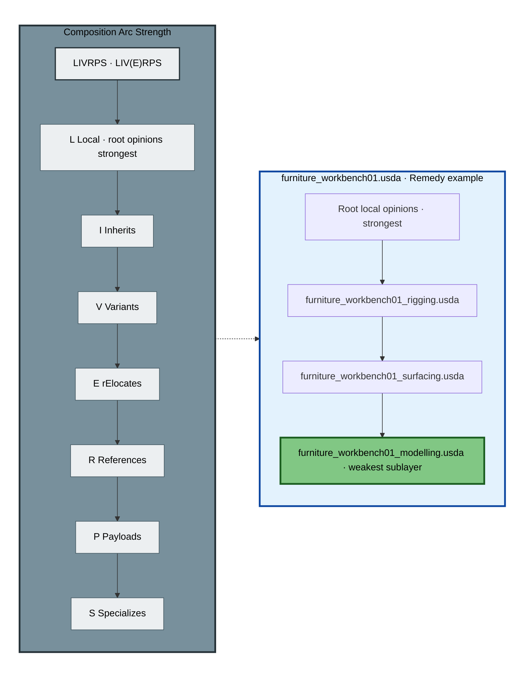
```mermaid
flowchart LR
    subgraph LeftColumn[" "]
        direction TB
        subgraph LIVRPSBox["Composition Arc Strength"]
            direction TB
            LIVHdr["LIVRPS · LIV(E)RPS"]
            ArcL["L Local · root opinions strongest"]
            ArcI["I Inherits"]
            ArcV["V Variants"]
            ArcE["E rElocates"]
            ArcR["R References"]
            ArcP["P Payloads"]
            ArcS["S Specializes"]
            LIVHdr --> ArcL --> ArcI --> ArcV --> ArcE --> ArcR --> ArcP --> ArcS
        end
    end

    subgraph RootContainer["furniture_workbench01.usda · Remedy example"]
        direction TB
        RootLocal[Root local opinions · strongest]
        Rig[furniture_workbench01_rigging.usda]
        Surf[furniture_workbench01_surfacing.usda]
        Mod[furniture_workbench01_modelling.usda · weakest sublayer]
        RootLocal --> Rig --> Surf --> Mod
    end

    LIVRPSBox -.-> RootContainer

    style LeftColumn fill:none,stroke:none,color:#000
    style RootContainer fill:#e3f2fd,stroke:#0d47a1,stroke-width:3px,color:#000
    style LIVRPSBox fill:#78909c,stroke:#263238,stroke-width:3px,color:#000
    style LIVHdr fill:#eceff1,stroke:#263238,stroke-width:2px,color:#000
    style ArcL fill:#eceff1,stroke:#455a64,stroke-width:1px,color:#000
    style ArcI fill:#eceff1,stroke:#455a64,stroke-width:1px,color:#000
    style ArcV fill:#eceff1,stroke:#455a64,stroke-width:1px,color:#000
    style ArcE fill:#eceff1,stroke:#455a64,stroke-width:1px,color:#000
    style ArcR fill:#eceff1,stroke:#455a64,stroke-width:1px,color:#000
    style ArcP fill:#eceff1,stroke:#455a64,stroke-width:1px,color:#000
    style ArcS fill:#eceff1,stroke:#455a64,stroke-width:1px,color:#000
    style Mod fill:#81c784,stroke:#1b5e20,stroke-width:3px,color:#000
```

**Advantages:** Shows **asset-scoped** stacks (not shot roots); reminds that root local edits beat sublayers.

**Disadvantages:** Does not spell `subLayerPaths` order explicitly; games-centric; must validate order against your DCC export tooling.

---

## 12. Luca Scheller — USD Survival Guide (VFX / Houdini)

**Source:** [Composition Strength Ordering (LIVRPS)](https://lucascheller.github.io/VFX-UsdSurvivalGuide/pages/core/composition/livrps.html) · SIGGRAPH 2023 Houdini Hive

**Pattern — architectural rules, not one fixed stack:**

| Mechanism | Use for | Avoid for |
|-----------|---------|-----------|
| **Sublayers** | Stage / shot **root layer stack**; department-sized USD files in shared namespace | Loading all heavy shot geometry |
| **References** | Modular assets, material libraries, shot assembly | — |
| **Payloads** | Heavy renderable geometry, lazy load | — |
| **Inherits** | Instanceable overrides across many referenced assets | — |

**Houdini LOP mental model:** LOP networks author into the **strongest new sublayer** on a mostly empty root — aligns with SideFX shot example (§3).

**Advantages:** Production-hardened VFX framing; explicit “**heavy lifting via R/P, not sublayers**”; matches the proposed USD GoodStart rule that **ASS_LYR uses references/payloads**.

**Disadvantages:** Does not prescribe LGT vs ANIM ordering; Houdini-specific authoring flow.

---

## 13. ASWF — reference-first asset contributions

**Source:** [ASWF asset structure guidelines](https://github.com/usd-wg/assets/blob/main/docs/asset-structure-guidelines.md)

**Pattern:** Department layers on a component are **referenced or sublayered** into the asset root; ASWF **prefers referencing** because each file enters as **R** in LIV(E)RPS — predictable strength vs arbitrary sublayer merge order.

**Timeline principle (unchanged):** geometry **weak**, materials next, **lighting usually last** — often implemented as **payload + referenced contribution files**, not necessarily six named shot sublayers.

**Advantages:** Interoperability focus; separates **asset structure** from **shot structure**; underpins AOUSD IEDT comparisons with the proposed USD GoodStart layer order.

**Disadvantages:** Leaves shot-level ordering to each studio; no standard layer filenames.

---

## 14. Omniverse — session & live layers (strongest of all)

**Source:** [Omniverse Layers Extension](https://docs.omniverse.nvidia.com/extensions/latest/ext_core/ext_layers.html)

**Pattern:** During live collaboration, **Session layer** (and temporary Live Session sublayers) sit **above** persistent ROOT — strongest opinions in the stack UI. Merge workflow promotes deltas into named persistent layers (Layout, Material, etc.).

**Stack context (persistent work below session):** see §5 — Animation / Layout / Material / … / Assets.

**Advantages:** Explains Omniverse-specific “why did my edit win?”; critical for digital twin ops rooms.

**Disadvantages:** Session semantics differ from plain USDA on disk; easy to pollute ROOT if merges go to wrong target.

---

## Cross-source synthesis — needs vs typical pattern

| Need / domain | Sublayer stack? | R/P on prims? | Typical strong→weak theme | Primary sources |
|---------------|-----------------|---------------|---------------------------|-----------------|
| **VFX shot finishing** | Yes — dept USD files | Assets referenced from weak assembly/layout layer | LGT/FX/finish high; layout/seq low | Michael M&E, SideFX, openusd.work, da Vinci |
| **Lookdev over model (same namespace)** | Yes — shading above geometry | Optional | Materials strong, geo weak | Learn OpenUSD skyscraper, ASWF timeline |
| **Published assets** | Sometimes | **Preferred** — geo in payload | Geo weak; surf/rig/light later | ASWF, da Vinci assets, Remedy |
| **Heavy CAD / twin plant** | Thin root + dept layers | **Payloads** in ASS/base layer | Twin data & sim override anim; assets at bottom | [Proposed USD GoodStart layer order](https://github.com/jph2/USD_GoodStart#tldr-too-long-didnt-read), Omniverse, Survival Guide |
| **Teaching mechanics only** | Minimal 2-layer examples | Demonstrate separately | Override demo | Pixar SIGGRAPH 2019 |
| **Live multi-user** | Persistent layers + **session** on top | Same as above | Session strongest | Omniverse Layers Extension |
| **Houdini / Solaris** | LOP-generated sublayer stack | Payloads per shot asset | Lighting → FX → Anim → … | SideFX LOP docs, Survival Guide |

### LIV(E)RPS handling — source comparison

| Source | How LIV(E)RPS is taught | Sublayers vs R/P |
|--------|-------------------------|------------------|
| [Pixar glossary](https://openusd.org/release/glossary.html) | L = Local prim specs in layer stack order | subLayers arc merges whole layers |
| [Learn OpenUSD LIVERPS module](https://docs.nvidia.com/learn-openusd/latest/creating-composition-arcs/strength-ordering/what-is-liverps.html) | L includes ordered sublayer stack; adds **E** rElocates → **LIVERPS** | Same |
| [USD Survival Guide](https://lucascheller.github.io/VFX-UsdSurvivalGuide/pages/core/composition/livrps.html) | L + sublayers for stage stack; R/P for assets | **Do not** load all geo via sublayers |
| [Omniverse USD Book (community)](https://omniverseusd.github.io/chapter3/composition_arcs.html) | “Local (and Sublayers)” first in search order | Photoshop analogy for sublayers |
| [**Proposed USD GoodStart layer order**](https://github.com/jph2/USD_GoodStart#tldr-too-long-didnt-read) | LIV(E)RPS for arc conflicts; **subLayers** for department/ownership order | **ASS_LYR** = References + Payloads only |

---

## Master Comparison Table

**Strongest → weakest (top → bottom).** ✓ = aligned with Michael's M&E sketch; ✗ = deliberate difference; ~ = partial.

| Layer role | Michael M&E | SideFX shot | da Vinci shot | Learn OpenUSD | Omniverse stage | Proposed USD GoodStart layer order |
|------------|-------------|-------------|---------------|---------------|-----------------|-----------|
| Overrides / review | — | — | **OVERRIDE** | — | Session / Markup | **OPIN** ✓ |
| Lighting / finish | **LGT** (top) ✓ | **LGT** (top) ✓ | **finish** (top) ✓ | — | LGT (mid) | ENV (mid) ~ |
| Simulation | **SIM** ✓ | FX ✓ | (in anim/finish) | — | Simulation | **SIM** ✓ |
| Animation | **ANIM** ✓ | **ANIM** ✓ | **anim** ✓ | — | Animation (top) | ANIM ✓ |
| Camera | **CAM** (below anim) | — | **camera** (above assembly) | — | Camera | **CAM** (high) ✗ |
| Materials | **MTL** ✓ | (on assets) | **finish/material** ✓ | **shading** (strong) ✓ | Material | **MTL** ✓ |
| Runtime latest-value state | — | — | — | — | Session / live edits | **RUNTIME** |
| Static twin metadata / identifiers | — | — | — | — | — | **DATA** |
| Assets / layout base | **ASS** (bottom) ✓ | sequence (base) | **assembly** (bottom) ✓ | **geometry** (weak) ✓ | **Assets** (bottom) ✓ | **ASS** (bottom) ✓ |

---

## Choosing an Approach — Decision Guide

| If your priority is… | Lean toward… |
|----------------------|--------------|
| Feature-film shot finishing | Michael M&E / SideFX / da Vinci / openusd.work (finish/LGT high, assembly low) |
| Lookdev merging with layout geo | Learn OpenUSD pattern — **shading sublayer above geometry sublayer** |
| Published asset interchange | ASWF + da Vinci asset interface — **references/payloads**, geo in payload |
| Omniverse conductor / factory twin | Omniverse Explorer layers + the [**proposed USD GoodStart layer order**](https://github.com/jph2/USD_GoodStart#tldr-too-long-didnt-read) (`RUNTIME_LYR` or session layer for live/latest-value state; `DATA_LYRs` for static metadata) |
| Houdini / Solaris production | SideFX LOP stack + **USD Survival Guide** (R/P for assets) |
| Teaching composition mechanics only | Pixar SIGGRAPH 2019 PDF + Learn OpenUSD sublayer exercises |
| Minimal layer count | openusd.work 3-layer shot |
| Live multi-user + session merges | Omniverse Layers Extension session workflow |

**Hybrid pattern (common in practice):** Keep **ASS (or Assets) at the bottom** and **departmental overrides above** — universal. Debate is *which* departments sit above animation and whether cameras/lighting are split or combined.

---

## OpenUSD Learning & Ecosystem Resources

Curated links for **deeper context** on composition, layers, and pipeline design — useful alongside the layer-order comparison above. Grouped by role; not an exhaustive list ([Awesome OpenUSD](https://github.com/matiascodesal/awesome-openusd) remains the best meta-index).

### Official & standards

| Resource | URL |
|----------|-----|
| **Alliance for OpenUSD (AOUSD)** | https://aousd.org/ |
| AOUSD Core Specification 1.0 announcement | https://aousd.org/blog/foundations-of-open-3d-development-introducing-aousd-core-specification-1-0/ |
| **OpenUSD — Pixar documentation hub** | https://openusd.org/ |
| Introduction to USD (26.x docs) | https://openusd.org/release/intro.html |
| USD Terms & Concepts (LayerStack, LIV(E)RPS) | https://openusd.org/release/glossary.html |

### NVIDIA — Learn OpenUSD & Omniverse

| Resource | URL |
|----------|-----|
| **Learn OpenUSD** (updated learning path) | https://docs.nvidia.com/learn-openusd/latest/index.html |
| Learn OpenUSD — source repo | https://github.com/NVIDIA-Omniverse/LearnOpenUSD/tree/main |
| NVIDIA OpenUSD learning path | https://www.nvidia.com/en-us/learn/learning-path/openusd/ |
| OpenUSD on-demand sessions (NVIDIA) | https://www.nvidia.com/en-us/on-demand/search/?facet.mimetype[]=event%20session&layout=list&page=1&q=OpenUSD&sort=date&sortDir=desc |
| What Is OpenUSD? (NVIDIA Glossary) | https://www.nvidia.com/en-us/glossary/openusd/ |
| OpenUSD code samples (Omniverse Developer Guide) | https://docs.omniverse.nvidia.com/dev-guide/latest/programmer_ref/usd/usd.html |
| Omniverse Kit — modules overview | https://docs.omniverse.nvidia.com/kit/docs/kit-manual/latest/guide/modules.html |
| Data aggregation best practices | https://docs.omniverse.nvidia.com/usd/latest/learn-openusd/independent/best-practices.html |
| OpenUSD Development Certification — study guide (community) | https://medium.com/@chaubenz/your-complete-guide-to-passing-the-nvidia-certified-professional-openusd-development-b129777b0ed6 |
| Learn OpenUSD community highlight (LinkedIn) | https://www.linkedin.com/posts/austin-hwang18_learn-openusd-activity-7351753987999559680-1YW_/ |

### Books, courses & practical guides

| Resource | URL |
|----------|-----|
| **OpenUSD in One Weekend** (Zhang, Green, Zhao) | https://learn-usd.github.io/ |
| **USD Survival Guide** (Luca Scheller) | https://lucascheller.github.io/VFX-UsdSurvivalGuide/ |
| Cave Academy — Introduction to OpenUSD (2025) | https://caveacademy.com/courses/introduction-to-openusd-2025/ |
| **Jan Haluszka — OpenUSD tutorials** | https://haluszka.com/#tutorials |

### Community & meta-lists

| Resource | URL |
|----------|-----|
| **Awesome OpenUSD** (Matias Codesal) | https://github.com/matiascodesal/awesome-openusd |
| ASWF USD Working Group — asset guidelines | https://github.com/usd-wg/assets/blob/main/docs/asset-structure-guidelines.md |
| OpenUSD Study Group (Discord — see NVIDIA Learn OpenUSD “First Steps”) | https://docs.nvidia.com/learn-openusd/latest/first-steps/first-steps.html |

### This project

| Resource | URL |
|----------|-----|
| [**Proposed USD GoodStart layer order**](https://github.com/jph2/USD_GoodStart#tldr-too-long-didnt-read) (this repo) | https://github.com/jph2/USD_GoodStart |
| Layer order comparison (this document) | [LAYER_ORDER_REFERENCES_RESEARCH.md](./LAYER_ORDER_REFERENCES_RESEARCH.md) |
| USD GoodStart README | [../README.md](../README.md) |

---

## Canonical Reference Links

| Topic | URL |
|-------|-----|
| Sublayers (strength order) | https://docs.nvidia.com/learn-openusd/latest/creating-composition-arcs/sublayers/what-are-sublayers.html |
| LIV(E)RPS / strength ordering | https://docs.nvidia.com/learn-openusd/latest/composition-basics/strength-ordering.html |
| OpenUSD glossary — LayerStack, LIVERPS | https://openusd.org/release/glossary.html |
| Pixar SIGGRAPH 2019 Composition | https://openusd.org/files/Siggraph2019_USD%20Composition.pdf |
| ASWF asset structure guidelines | https://github.com/usd-wg/assets/blob/main/docs/asset-structure-guidelines.md |
| SideFX Sublayer LOP | https://www.sidefx.com/docs/houdini20.5/nodes/lop/sublayer.html |
| Omniverse Layers Extension | https://docs.omniverse.nvidia.com/extensions/latest/ext_core/ext_layers.html |
| Omniverse data aggregation BP | https://docs.omniverse.nvidia.com/usd/latest/learn-openusd/independent/best-practices.html |
| da Vinci’s Workshop (NVIDIA sample) | https://docs.omniverse.nvidia.com/usd/latest/usd_content_samples/davinci_workshop.html |
| Learn OpenUSD — sublayer exercise | https://docs.nvidia.com/learn-openusd/latest/creating-composition-arcs/sublayers/working-with-sublayers.html |
| Learn OpenUSD — LIVERPS | https://docs.nvidia.com/learn-openusd/latest/creating-composition-arcs/strength-ordering/what-is-liverps.html |
| USD Survival Guide — LIVRPS | https://lucascheller.github.io/VFX-UsdSurvivalGuide/pages/core/composition/livrps.html |
| Remedy USDBook — layer stacks | https://remedy-entertainment.github.io/USDBook/terminology/layer_stacks.html |
| OpenUSD in One Weekend | https://learn-usd.github.io/ |
| openusd.work shot example | https://openusd.work/ |
| USD GoodStart README | ../README.md |

---

## Slack Reply Snippet (copy-paste)

> There isn’t one official OpenUSD layer-order spec — Pixar/ASWF/NVIDIA document the **mechanism** (first sublayer = strongest, thin root, LIV(E)RPS). Each pipeline picks order by workflow.
>
> **Public refs:** ASWF asset guidelines (geo bottom, lighting usually last), SideFX shot example (LGT→FX→ANIM→set dress→seq), Pixar SIGGRAPH 2019 composition PDF, Omniverse Layers Extension (Assets weakest), plus our comparison doc: `WIP_Docs/LAYER_ORDER_REFERENCES_RESEARCH.md`.
>
> Your M&E sketches: (1) three LGT→SIM→ANIM→CAM pillars on shared MAT+ASS; (2) global SIM+LGT with shot pillars on top. Collapsed to one shot that's LGT→SIM→ANIM→CAM→MTL→ASS. The proposed USD GoodStart layer order diverges on purpose for digital twins (RUNTIME, DATA, ACTGR, CAM high) but keeps ASS at the bottom and SIM above ANIM.

---

## 15. NVIDIA SimReady / Physical AI Addendum - rules that affect the proposed USD GoodStart layer order

This section records additional NVIDIA sources that are not primarily "layer order" documents, but they affect how the proposed USD GoodStart layer order should structure updateable digital twin assets. The common theme is that reusable assets need an explicit public interface, heavy content should sit behind payloads, and simulation metadata should be authored as separate, validated contributions rather than mixed into source geometry or root layers.

This addendum extracts **asset- and scene-architecture implications** from those sources. [Section 17](#17-nvidia-simready-foundation-capability-contracts-validation-and-standardization) treats the current SimReady Foundation separately as a versioned specification, capability, validation, and standardization system. The distinction prevents SimReady validation from being reduced to a folder convention or layer-order recommendation.

### Sources

| Source | Relevant scope |
|--------|----------------|
| [Principles of Scalable Asset Structure in OpenUSD](https://docs.omniverse.nvidia.com/usd/latest/learn-openusd/independent/asset-structure-principles.html) | Asset interface layers, workstream layers, reference-payload pattern, public vs internal asset roles |
| [Assembling Digital Twins With Omniverse and OpenUSD](https://docs.nvidia.com/learning/physical-ai/assembling-digital-twins/latest/getting-started/overview.html) | Digital twin workspace organization, asset metadata review, validation, asset organization fundamentals |
| [SimReady Assets for DSX Digital Twins](https://docs.omniverse.nvidia.com/dsx/latest/simready-assets.html) | CAD-to-USD, geometry validation/optimization, separate metadata and connection-point layers, internal/external payloads |
| [The SimReady Standardization Workflow](https://docs.omniverse.nvidia.com/simready/latest/simready-standards/standardization_workflow.html) | Domain specifications, data mapping, gap analysis, validators, reference pipelines |
| [NVIDIA-Omniverse/aif-pipeline-samples](https://github.com/NVIDIA-Omniverse/aif-pipeline-samples) | Sample scripts and presets for CAD ingestion, optimization, and SimReady USD asset production |
| [NVIDIA skills: omniverse-cad-to-simready](https://github.com/NVIDIA/skills/tree/main/skills/omniverse-cad-to-simready) | Agent-facing CAD-to-SimReady workflow skill reference |
| [NVIDIA/simready-foundation](https://github.com/NVIDIA/simready-foundation) | Central SimReady foundation repository for runtime-driven simulation content specifications |

### Rule 1 - Treat the asset root as an interface, not as storage

NVIDIA's scalable asset structure guidance frames an asset root layer as the way downstream users interact with the asset. The root/defaultPrim and other advertised public prims are the asset interface; expensive geometry and internal authoring details can live below that interface.

**Proposed USD GoodStart derivation:**

- Scene root remains thin: project metadata, `defaultPrim`, and ordered sublayers only.
- Reusable assets under `010_ASS_USD` should increasingly follow an asset-interface pattern: `<asset>.usd` as the reference target, with heavy contents in payloads.
- `ASS_LYR.usda` should reference or payload asset interface files, not reach into private internal payload files unless a contract explicitly declares that path public.
- Stable, queryable fields such as default prim, units, up axis, `kind`, `assetInfo`, supported variants, extents hints, and public semantic hooks should be available without requiring full payload loading when practical.

### Rule 2 - Model workstreams as bounded layers, not as version history

NVIDIA's asset-structure guidance supports using layer stacks to model user and computational workstreams, but it also warns that layer stacks should stay manageable and should not replace asset versioning. Each layer has an open/compose cost, and unbounded procedural layer growth becomes a pipeline liability.

**Proposed USD GoodStart derivation:**

- Proposed USD GoodStart layer names are ownership lanes, not a chronological change log.
- `APPROVAL_OVERRIDE_LYR`, `OV_DELTA_LYR`, `RUNTIME_LYR`, and similar lanes should be bounded by purpose and lifecycle rules.
- Version history belongs in Git, asset management, publish folders, or explicit bake/snapshot artifacts, not by endlessly prepending dated sublayers.
- Validators should reject unknown or unbounded layer lanes unless the layer contract declares them.

### Rule 3 - Use reference-payload structure for heavy or selectively loaded content

The reference-payload pattern keeps the downstream interaction simple: consumers reference the asset interface, while the asset internally payloads heavy content. NVIDIA's DSX SimReady example also splits internal and external geometry into separate payloads to enable selective loading.

**Proposed USD GoodStart derivation:**

- Imported CAD/Revit/Creo/startpoint files should be normalized into stable startpoints or wrapper/interface assets before scene assembly.
- Heavy geometry belongs behind payloads where possible; scene-level sublayers should not become the main mechanism for loading all CAD geometry.
- Internal/external geometry split is a useful pattern for industrial assets: external shell for navigation/render, internal detail on demand.
- `USD_Wrappers` can evolve from transform-only wrappers into asset interface layers when they expose public metadata, variants, or payload routing.

### Rule 4 - Keep simulation metadata as a separate authored contribution

The DSX SimReady asset journey describes visual geometry and SimReady metadata as parallel tracks that converge into a validated OpenUSD asset. Metadata is authored as separate USD layers and composed non-destructively onto the geometry.

**Proposed USD GoodStart derivation:**

- `DATA_LYRs.usda` owns stable semantic facts: source identifiers, Revit/CAD metadata, AAS/ERP/PLM mappings, manufacturer/model data, dimensions, ratings, and tool provenance.
- Runtime/latest values still belong in `RUNTIME_LYR.usda`, not in `DATA_LYRs.usda`.
- SimReady-style domain metadata should be generated from mapping tables or normalized property packages and then composed as authored USD opinions, not edited into imported source geometry.
- The contract should record which layer owns which metadata namespace, for example `aif:core:*`, `aif:spec:*`, `revit:*`, `aas:*`, or project-specific namespaces.

### Rule 5 - Treat connection points as first-class authored assets

The DSX SimReady example models equipment interfaces such as cooling, electrical, airflow, or piping ports as explicit connection-point prims, often with `guide` purpose so they are available to simulation runtimes without becoming render geometry.

**Proposed USD GoodStart derivation:**

- Digital twin assets should be able to carry connection-point layers or payloads alongside geometry and metadata.
- Connection points should not be hand-authored into the project root.
- If connection points describe physical interfaces, they may belong in a dedicated asset-internal `layers/<asset>_ConnectionPoints.usd` file or a declared layer in the proposed USD GoodStart order such as `PHY_LYR` / future `CONN_LYR`.
- Validators should check naming, purpose, placement, and required metadata for connection points when a project declares SimReady-style expectations.

### Rule 6 - Make validation part of the asset structure, not an afterthought

The Physical AI digital twin course and SimReady workflow both put asset inspection, metadata review, and validation into the expected workflow. SimReady standardization also calls for specifications, data mapping, gap analysis, validators, reference pipelines, and samples.

**Proposed USD GoodStart derivation:**

- `_contracts/layer_contract.json` is not optional decoration; it is the machine-readable statement of layer ownership, strength order, write targets, optional lanes, and validator policy.
- `_pipeline_reports` should record conversion, optimization, metadata enrichment, asset validation, layer validation, and final assembly validation.
- A project using the proposed USD GoodStart layer order should be able to prove which source files, specs, mapping rules, and validators produced the current USD output.
- Pipeline nodes should emit deterministic reports so a ComfyUI build, Omniverse edit pass, or headless bake can be compared later.

### Rule 7 - Separate asset-level package structure from scene-level layer order

The DSX SimReady delivered asset layout uses a main asset interface file, `layers/`, `payloads/`, and `data/`. The proposed USD GoodStart layer order uses scene-level folders such as `020_BASE_LYR`, `035_RUNTIME_LYR`, and `040_DATA_LYRs`. These are compatible but not identical scales.

**Proposed USD GoodStart derivation:**

- Scene-level root stack: controls project composition and ownership lanes.
- Asset-level package: controls one reusable asset's public interface, payloads, metadata layers, connection points, and raw data.
- `ASS_LYR.usda` is the boundary where the scene-level proposed USD GoodStart structure references asset-level packages.
- Do not flatten asset package internals into the scene-level layer stack unless the project explicitly promotes those contributions.

### Proposed USD GoodStart alignment table

| NVIDIA / SimReady concept | Proposed USD GoodStart scene-level owner | Asset-package owner |
|---------------------------|-----------------------------|---------------------|
| Main asset interface file | Referenced/payloaded by `ASS_LYR.usda` | `<asset>.usd` |
| Heavy visual geometry | Below `ASS_LYR` via payloads | `payloads/internal.usd`, `payloads/external.usd`, or equivalent |
| Stable metadata / identifiers | `040_DATA_LYRs/DATA_LYRs.usda` | `layers/<asset>_Properties.usda` |
| Connection points | `PHY_LYR` or declared future connection layer, if scene-owned | `layers/<asset>_ConnectionPoints.usd` |
| Runtime latest values | `035_RUNTIME_LYR/RUNTIME_LYR.usda` | Usually not asset package-owned |
| Validation outputs | `_pipeline_reports` | asset validation report / package manifest |
| Mapping and gap analysis | `_contracts`, `_pipeline_reports`, Requirements/Spec artifacts | `data/`, manifest, mapping profile |

### Practical next rule for the proposed USD GoodStart layer order

The proposed USD GoodStart layer order should keep its current scene-level thin-root stack, but adopt a clearer **asset package convention** for imported industrial assets:

```text
010_ASS_USD/
  USD_Startpoint/
    <raw_or_imported_startpoint>.usd
  USD_Wrappers/
    <asset_id>.usd                 # public asset interface / wrapper
    <asset_id>/
      layers/
        <asset_id>_Properties.usda
        <asset_id>_ConnectionPoints.usda
      payloads/
        internal.usd
        external.usd
      data/
        source_manifest.json
        mapping_profile.json
```

This keeps the proposed USD GoodStart scene assembly simple while allowing each industrial asset to evolve toward SimReady-style packaging without forcing every small project to use the full structure.

### Impact on the proposed USD GoodStart Minimal Layer Setup

The NVIDIA / SimReady material changes the **generated folder and contract structure**, not the default scene-level root stack.

**Do not change by default:**

- Do not add `CONN_LYR`, `PROPERTIES_LYR`, or similar scene-level root sublayers just because one asset has connection points or metadata.
- Do not place asset payload routing, source mapping data, or one asset's public interface directly in the project root.
- Do not turn sublayers into a version-history mechanism.

**Do change in projects generated from the proposed USD GoodStart layer order:**

- Generate `010_ASS_USD/USD_Wrappers` as a first-class sibling of `USD_Startpoint`.
- Generate an asset-package template under `010_ASS_USD/USD_Wrappers/_asset_package_template/{layers,payloads,data}` so users see the intended package shape.
- Generate `_contracts`, `_pipeline_reports`, and `_comfyui_workflows` in the baseline because contracts, reports, and build workflows are part of the updateable structure.
- Record the asset-package convention in `layer_contract.json` so downstream nodes and validators read the same paths.
- Put short setup notes into generated ComfyUI workflow metadata so a visual operator sees the thin-root, startpoint, wrapper, assembly, data, and runtime boundaries.

**Problem this avoids:** without an asset-package convention, metadata, connection points, internal/external payload split, and mapping evidence tend to leak into the scene root, `ASS_LYR`, or ad-hoc side folders. That makes CAD/Revit updates and ComfyUI rebuilds unsafe because there is no stable boundary between imported evidence, generated wrappers, reusable asset data, and scene assembly.

**Optimization:** keep the scene-level layer stack stable and small, then move per-asset complexity below a public asset interface file:

```text
ASS_LYR.usda
  -> references/payloads 010_ASS_USD/USD_Wrappers/<asset_id>.usd

010_ASS_USD/USD_Wrappers/<asset_id>.usd
  -> payloads private heavy geometry
  -> composes asset-local properties / connection points
  -> points to mapping evidence under data/
```

This gives projects based on the proposed USD GoodStart layer order a SimReady-style update path without forcing every minimal project to become a full SimReady asset pipeline.

---

## 16. NVIDIA Isaac Sim 6.0 - Asset Structure 3.0

Isaac Sim 6.0 provides a concrete production example for the asset-package principles derived above. NVIDIA calls this layout **USD Asset Structure 3.0** and uses it as the standard organization for Isaac Sim 6.0 robot assets. Its purpose is to keep geometry, materials, collision/instances, robot schema, and physics implementations independently maintainable while presenting one stable asset to downstream scenes.

This is an **asset-internal composition model**, not a new scene-level sublayer order. In terms of the [proposed USD GoodStart layer order](https://github.com/jph2/USD_GoodStart#tldr-too-long-didnt-read), the complete Isaac Sim package sits below the public asset interface consumed by `ASS_LYR.usda`; its internal files should not automatically become peer layers in the project root stack.

### Breakout - Reconstructed evolution from importer 1.x to Asset Structure 3.0

> **Evidence status:** NVIDIA explicitly names and documents **Asset Structure 3.0**, but no standalone NVIDIA specifications titled “Asset Structure 1.0” or “Asset Structure 2.0” were found. The earlier generations below are reconstructed from NVIDIA's archived URDF Importer changelog, tagged test outputs, versioned Isaac Sim documentation, and the 6.0 migration language. Therefore, **1.x** and **2.x** below identify evidenced importer/asset-structure generations; they should not be presented as formally published NVIDIA standards unless a primary source with those exact titles emerges.

| Date / generation | Direct evidence | Reconstructed structure and significance |
|-------------------|-----------------|------------------------------------------|
| **Importer 1.x, before 1.17** | The Isaac Sim 4.0-tagged importer is version 1.14.1 and its committed test output contains one `test_basic.usd`. Importer 1.15 later added internal mesh references and made imported meshes instanceable. | Predominantly one robot USD entry with geometry, hierarchy, joints, and PhysX-oriented simulation data much more tightly coupled than in 3.0. Mesh reuse improved over time, but there was not yet a published multi-file feature composition contract. |
| **Importer 1.17, September 2024** | The archived changelog states that export changed to multiple USD files: `base` for meshes, `physics` for joints and physical attributes, and `sensor` for sensor attributes. | Transitional multi-file generation. It introduced explicit domain separation but did not yet describe the final Reference + Payload + Variant interface used by the next generation. |
| **Importer 2.0.1, October 2024** | The changelog states that final asset composition changed to **Reference + Payloads with variants** so sensor and physics features could be enabled or disabled. | This is the strongest evidence for the 2.x asset-composition generation: one final asset interface, a base contribution, referenced physics, payloaded optional features, and variants for configuration. |
| **Isaac Sim 4.5-5.1 documented pattern** | NVIDIA documents `asset_base.usd`, `parts.usd`, `materials.usd`, an optional `asset_sim_optimized.usd`, feature files such as `asset_physics.usd`, `asset_sensors.usd`, `asset_control.usd`, and a final `asset.usd`. | Mature predecessor to 3.0. The optimized/base asset supplies structure and visuals; physics is referenced; sensors and controls are payloaded; variants can switch feature sets. The structure is modular, but its physics organization is still primarily one simulation feature rather than a neutral multi-backend stack. |
| **Asset Structure 3.0, Isaac Sim 6.0** | NVIDIA 6.0 release notes explicitly name Asset Structure 3.0 and the URDF/MJCF Importer 3.0. NVIDIA also supplies an Asset Transformer for converting legacy robots. | Geometry, materials, instances, base hierarchy, robot schema, neutral physics, and backend-specific PhysX/MuJoCo layers are isolated. The public interface selects physics and optional behaviors through variants and payloads while preserving one asset identity. |

#### Visual evolution at a glance

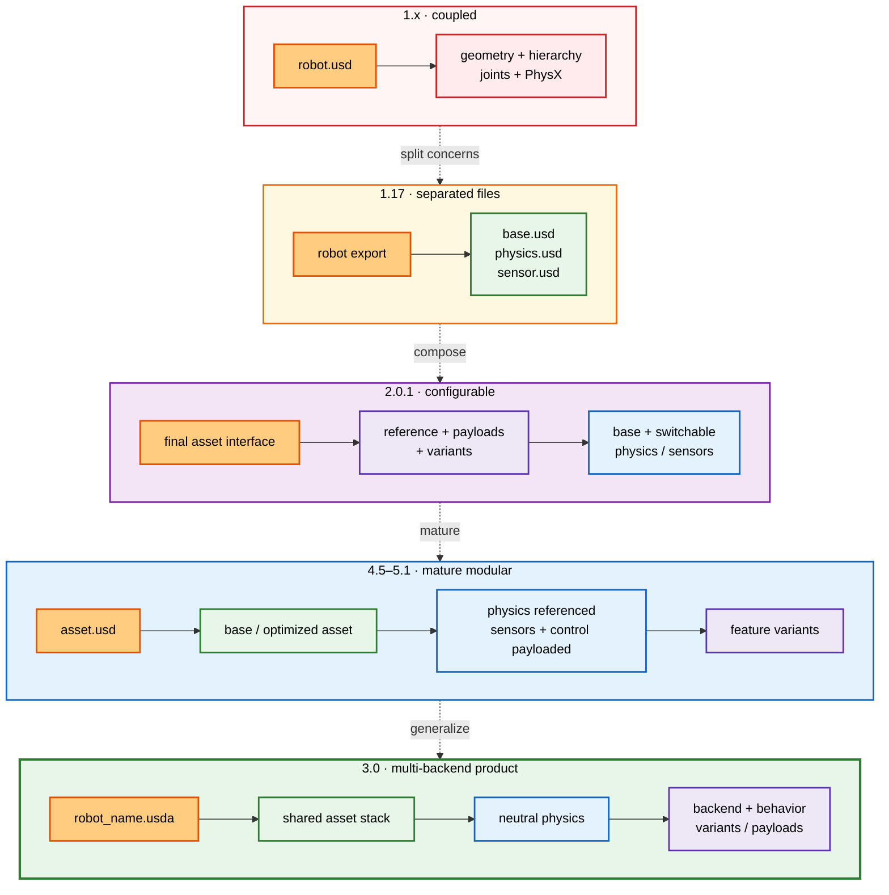
```mermaid
flowchart TB
    subgraph G1["1.x · coupled"]
        direction LR
        OneFile["robot.usd"]
        Coupled["geometry + hierarchy<br/>joints + PhysX"]
        OneFile --> Coupled
    end

    subgraph G117["1.17 · separated files"]
        direction LR
        Export117["robot export"]
        Files117["base.usd<br/>physics.usd<br/>sensor.usd"]
        Export117 --> Files117
    end

    subgraph G2["2.0.1 · configurable"]
        direction LR
        Public2["final asset interface"]
        Arcs2["reference + payloads<br/>+ variants"]
        Features2["base + switchable<br/>physics / sensors"]
        Public2 --> Arcs2 --> Features2
    end

    subgraph G45["4.5–5.1 · mature modular"]
        direction LR
        Public45["asset.usd"]
        Base45["base / optimized asset"]
        Features45["physics referenced<br/>sensors + control payloaded"]
        Variants45["feature variants"]
        Public45 --> Base45 --> Features45 --> Variants45
    end

    subgraph G3["3.0 · multi-backend product"]
        direction LR
        Public3["robot_name.usda"]
        Shared3["shared asset stack"]
        Neutral3["neutral physics"]
        Select3["backend + behavior<br/>variants / payloads"]
        Public3 --> Shared3 --> Neutral3 --> Select3
    end

    G1 -.->|"split concerns"| G117
    G117 -.->|"compose"| G2
    G2 -.->|"mature"| G45
    G45 -.->|"generalize"| G3

    classDef interface fill:#ffcc80,stroke:#e65100,stroke-width:2px,color:#000
    classDef structure fill:#e8f5e9,stroke:#2e7d32,stroke-width:2px,color:#000
    classDef composition fill:#ede7f6,stroke:#5e35b1,stroke-width:2px,color:#000
    classDef feature fill:#e3f2fd,stroke:#1565c0,stroke-width:2px,color:#000
    classDef coupled fill:#ffebee,stroke:#c62828,stroke-width:2px,color:#000

    class OneFile,Export117,Public2,Public45,Public3 interface
    class Files117,Base45,Shared3 structure
    class Arcs2,Variants45,Select3 composition
    class Features2,Features45,Neutral3 feature
    class Coupled coupled

    style G1 fill:#fff5f5,stroke:#c62828,stroke-width:2px,color:#000
    style G117 fill:#fff8e1,stroke:#ef6c00,stroke-width:2px,color:#000
    style G2 fill:#f3e5f5,stroke:#7b1fa2,stroke-width:2px,color:#000
    style G45 fill:#e3f2fd,stroke:#1565c0,stroke-width:2px,color:#000
    style G3 fill:#e8f5e9,stroke:#2e7d32,stroke-width:3px,color:#000
```

*Figure 16.A — Conceptual comparison, deliberately reduced to the architectural change in each generation. Five horizontal mini-structures are stacked from top to bottom so every generation can use the available page width while coupling, separation, composition, modularization, and multi-backend generalization remain visible in one continuous view. The evolution arrows connect the version containers rather than their internal nodes; this preserves each container's left-to-right layout. This is not a literal file-dependency specification.*

The evolution is therefore not simply “one file, then more files.” Each step assigns composition arcs a more deliberate role: **coupled content → separated domains → composed optional features → mature modular package → neutral multi-backend asset product**.

**What 3.0 improves over the documented predecessor:**

- It treats **multi-physics support as an asset-structure requirement**, not as an after-the-fact override.
- Neutral physics data can remain shared while PhysX, MuJoCo, Newton, or other runtime-specific tuning stays isolated.
- Geometry can remain efficient binary USD while the files most often reviewed and tuned are readable USDA and easier to diff.
- A stable interface can offer “no physics,” generic physics, or a specific backend without duplicating the robot asset or changing its downstream reference path.
- The Asset Transformer makes the boundary actionable by providing a migration path for legacy assets.

**Trade-off:** 3.0 is not automatically better for every asset. It adds files, composition arcs, validation requirements, and configuration choices. Its benefits become decisive when an asset is reused, independently updated, selectively loaded, or required to operate across multiple simulation backends.

Primary historical evidence:

- [Archived Isaac Sim URDF Importer changelog](https://github.com/isaac-sim/urdf-importer-extension/blob/4.5/source/extensions/isaacsim.asset.importer.urdf/docs/CHANGELOG.md)
- [Isaac Sim 4.0 importer test output](https://github.com/isaac-sim/urdf-importer-extension/tree/4.0/source/extensions/omni.importer.urdf/data/urdf/tests/tests_out)
- [Isaac Sim 5.1 Asset Structure](https://docs.isaacsim.omniverse.nvidia.com/5.1.0/robot_setup/asset_structure.html)
- [Isaac Sim 6.0 release notes](https://docs.isaacsim.omniverse.nvidia.com/6.0.0/overview/release_notes.html)
- [Isaac Sim 6.0 announcement - legacy assets and multi-backend structure](https://github.com/isaac-sim/IsaacSim/discussions/538)

### Composition overview

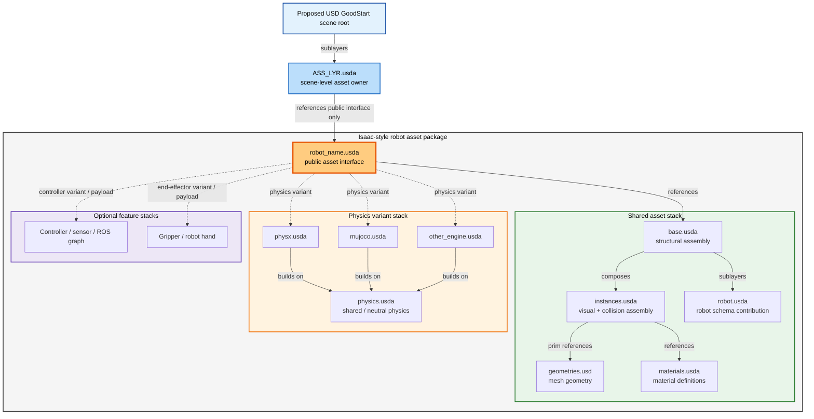
```mermaid
flowchart TB
    SceneRoot["Proposed USD GoodStart scene root"]
    ASS["ASS_LYR.usda<br/>scene-level asset owner"]

    subgraph Package["Isaac-style robot asset package"]
        direction TB
        Public["robot_name.usda<br/>public asset interface"]

        subgraph AssetStack["Shared asset stack"]
            direction TB
            Base["base.usda<br/>structural assembly"]
            Instances["instances.usda<br/>visual + collision assembly"]
            Geometry["geometries.usd<br/>mesh geometry"]
            Materials["materials.usda<br/>material definitions"]
            Robot["robot.usda<br/>robot schema contribution"]

            Base -->|"composes"| Instances
            Instances -->|"prim references"| Geometry
            Instances -->|"references"| Materials
            Base -->|"sublayers"| Robot
        end

        subgraph PhysicsStack["Physics variant stack"]
            direction LR
            Physics["physics.usda<br/>shared / neutral physics"]
            PhysX["physx.usda"]
            MuJoCo["mujoco.usda"]
            Other["other_engine.usda"]

            PhysX -->|"builds on"| Physics
            MuJoCo -->|"builds on"| Physics
            Other -->|"builds on"| Physics
        end

        subgraph OptionalStacks["Optional feature stacks"]
            direction LR
            Controller["Controller / sensor / ROS graph"]
            EndEffector["Gripper / robot hand"]
        end

        Public -->|"references"| Base
        Public -.->|"physics variant"| PhysX
        Public -.->|"physics variant"| MuJoCo
        Public -.->|"physics variant"| Other
        Public -.->|"controller variant / payload"| Controller
        Public -.->|"end-effector variant / payload"| EndEffector
    end

    SceneRoot -->|"sublayers"| ASS
    ASS -->|"references public interface only"| Public

    style SceneRoot fill:#e3f2fd,stroke:#0d47a1,stroke-width:2px,color:#000
    style ASS fill:#bbdefb,stroke:#1565c0,stroke-width:2px,color:#000
    style Package fill:#f5f5f5,stroke:#424242,stroke-width:2px,color:#000
    style Public fill:#ffcc80,stroke:#e65100,stroke-width:3px,color:#000
    style AssetStack fill:#e8f5e9,stroke:#2e7d32,stroke-width:2px,color:#000
    style PhysicsStack fill:#fff3e0,stroke:#ef6c00,stroke-width:2px,color:#000
    style OptionalStacks fill:#ede7f6,stroke:#5e35b1,stroke-width:2px,color:#000
```

*Figure 16.1 - The proposed USD GoodStart layer order references one public robot interface through `ASS_LYR.usda`. The interface composes the shared asset stack and exposes physics, controller, and end-effector choices through variants and payloads.*

### Evidence and source status

The screenshots below capture the Isaac Sim 6.0.1 documentation shown during the 14 July 2026 discussion. They are retained as research evidence. The linked NVIDIA documentation is the normative source:

- [Isaac Sim 6.0.0 - Asset Structure](https://docs.isaacsim.omniverse.nvidia.com/6.0.0/robot_setup/asset_structure.html)
- [Isaac Sim 6.0.1 - Tutorial 2: USD Asset Structure](https://docs.isaacsim.omniverse.nvidia.com/6.0.1/openusd_tuning_tutorials/tutorial_02_asset_structure.html)
- [Isaac Sim 6.0.1 - Robot Schema](https://docs.isaacsim.omniverse.nvidia.com/6.0.1/omniverse_usd/robot_schema.html)


*Figure 16.2 - Isaac Sim separates the reusable asset stack from a selectable physics stack. Meeting capture of the NVIDIA documentation.*

[Alternate capture of the base structure](Pics/IsaacSim_Asset_Structure/isaacsim_6_0_1_base_asset_structure_02.png)

### Base asset stack

The public asset, represented in the diagram as `robot_name.usda`, references a composed base asset rather than embedding all robot data in one file. The package separates concerns as follows:

| File / contribution | Primary responsibility | Composition role shown or described by NVIDIA |
|---------------------|------------------------|-----------------------------------------------|
| `robot_name.usda` | Stable downstream entry point for the finished robot asset | References the asset stack and exposes/selects feature variants |
| `base.usda` | Structural hierarchy and base assembly | Referenced by the public asset; composes the asset-local contributions |
| `geometries.usd` | Reusable mesh geometry | Referenced at prim level by the instances/assembly contribution |
| `materials.usda` | Material definitions | Referenced by the instances/assembly contribution |
| `instances.usda` | Visual and collision assembly using geometry and materials | Composed into the base asset |
| `robot.usda` | Robot schema/API contribution and robot-specific metadata | Kept in a separate layer and sublayered into the asset |
| `physics.usda` | Physics representation shared across or neutral to backends | Acts as the common physics foundation |
| `physx.usda`, `mujoco.usda`, other backend layer | Backend-specific physics opinions | Built on the common physics layer and selected through a physics variant |

The important architectural boundary is that consumers reference **one published asset**, while asset authors retain multiple independently owned files below that interface. This reduces duplication and prevents backend-specific physics data from colliding with shared geometry, materials, and metadata.

### Expanded feature stacks

NVIDIA extends the same package without modifying the source asset stack. Optional capabilities are isolated into feature stacks and exposed through variant sets and payloads.


*Figure 16.3 - End-effector, controller, and physics feature stacks are selected above the stable asset stack. Meeting capture of the NVIDIA documentation.*

[Alternate capture of the expanded structure](Pics/IsaacSim_Asset_Structure/isaacsim_6_0_1_expanded_asset_structure_02.png)

The expanded diagram shows four bounded areas:

1. **Asset stack** - instances, materials, geometries, base hierarchy, and robot schema.
2. **Physics stack** - a common physics definition plus PhysX, MuJoCo, or another engine implementation.
3. **Controller stack** - sensors, controllers, and ROS graph integration.
4. **End-effector stack** - alternatives such as a gripper or robot hand.

The public `robot_name.usda` remains the consumption point. Variant sets select alternatives such as the physics backend, controller setup, or end effector; payloads allow optional/heavy feature content to remain unloaded until required.

### What the composition arcs mean here

The example is useful because it assigns distinct jobs to composition arcs instead of treating them as interchangeable:

- **References** establish the reusable asset identity and bring the published base asset into the final robot.
- **Sublayers** combine compatible authored opinions that belong to one package or feature implementation, such as a schema contribution or a common physics foundation.
- **Payloads** defer optional or heavy feature content while preserving the public interface.
- **Variant sets** select a named alternative, for example PhysX versus MuJoCo, without requiring separate downstream asset paths.

A variant selection does not create a global scene-layer order. It chooses which authored branch contributes opinions at the variant's composition site. Likewise, `physx.usda` is not automatically stronger than a project `SIM_LYR.usda`; the result depends on the complete composition graph and the site where the asset is referenced.

### 16.1 Digital Twin Implications

At factory scale, the Isaac Sim pattern becomes more interesting, not less. A factory can be understood as a **system of systems**: it has a stable structural hierarchy, physical bodies, interfaces, sensors, controllers, operating configurations, and nested machines or robots. In that architectural sense, a factory behaves like a very large and heterogeneous robot whose “links” are areas, lines, cells, machines, utilities, and material-flow systems.

The analogy is useful but not literal. A robot normally has one bounded kinematic tree and a relatively coherent control/physics model. A factory combines many independently owned hierarchies, update cycles, coordinate systems, simulation domains, and live-data authorities. The correct conclusion is therefore not “store the whole factory like one robot,” but **apply the Asset Structure 3.0 principles recursively** at factory, line, cell, equipment, and robot boundaries.

#### Dataprep pipeline as the transformation boundary

An Asset Structure 3.0-inspired factory package does not emerge from a file-format conversion alone. CAD, BIM, plant-design, electrical, and robotics applications organize their source data for the needs of construction and engineering authoring. Their hierarchies may follow assemblies, drawing sets, CAD bodies, manufacturing parts, discipline files, product revisions, or tool-specific containers. That structure can be meaningful and must remain traceable, but it is not automatically the structure required for simulation, live-data binding, selective loading, or digital-twin operation.

The **dataprep pipeline is therefore responsible for translating between two valid but different models**:

```text
engineering source structure
  -> preserved source/startpoint
  -> parse and classify components, assemblies, machines, robots, and buildings
  -> normalize units, coordinates, names, materials, identifiers, and geometry
  -> restructure according to the digital-twin package contract
  -> generate public interfaces, payloads, variants, semantics, topology, and feature layers
  -> validate against declared simulation requirements
  -> publish the reproducible digital-twin asset packages
```

This transformation must preserve evidence rather than destructively “clean up” the source. Original files, source hierarchy, source identifiers, conversion versions, mapping decisions, rejected elements, and generated outputs must remain traceable through manifests and pipeline reports. If the CAD assembly tree contains useful engineering meaning, the pipeline can retain it as metadata or an alternate view while still generating a simulation-oriented hierarchy.

At minimum, the dataprep pipeline must be able to:

1. **Ingest heterogeneous sources without declaring one CAD tool authoritative for the final twin.** Revit, Creo, SolidWorks, NX, STEP, IFC, URDF, MJCF, point clouds, and supplier USD packages may contribute different parts of the result.
2. **Discover and preserve stable identity.** Components, assemblies, machines, robots, buildings, connection points, and functional systems need durable IDs that survive file renames, hierarchy changes, and re-imports whenever the source permits it.
3. **Normalize technical foundations.** Units, up axis, handedness, coordinate frames, pivots, materials, naming, instancing, geometry quality, and source-relative paths must meet one declared project contract.
4. **Rebuild hierarchy for the intended simulation.** Construction assemblies may need to become site/area/line/cell/equipment packages; nested rigid bodies may need flattening; visual meshes may need separate collision representations; repeated equipment may need instancing.
5. **Route authored concerns into owned outputs.** Geometry, materials, stable metadata, connection topology, neutral physics, backend-specific physics, controls, sensors, safety zones, and optional features must land in their declared layers or payloads rather than in a monolithic converted USD.
6. **Generate composition, not only files.** The output must expose stable public interfaces and author the correct references, payloads, variants, sublayers, default selections, and package-relative dependencies.
7. **Validate and report.** Geometry closure, composition dependencies, coordinates, naming, required metadata, physics readiness, topology, performance budgets, and source-to-output mappings need deterministic quality gates.
8. **Support incremental regeneration.** A changed CAD assembly, simulation profile, or mapping rule should rebuild only the affected packages while preserving stable public paths and downstream overrides.

The pipeline cannot perform this work safely unless the **simulation requirements are explicit inputs**. Those requirements should define, for example:

| Requirement area | Questions the profile must answer |
|------------------|-----------------------------------|
| Scope and hierarchy | Which buildings, areas, lines, cells, machines, links, or components must be independently addressable? |
| Geometry fidelity | Which visual LOD, collision representation, proxy, extent, and instancing rules are required? |
| Physics and behavior | Which simulation domains and backends are supported, and which attributes are neutral versus backend-specific? |
| Semantics and topology | Which IDs, classifications, ports, networks, relationships, and connection-point schemas are mandatory? |
| Loading and performance | Which subsets must be payloaded, streamed, instanced, or available without heavy geometry? |
| Data integration | Which prims bind to PLC, OPC UA, MES, SCADA, AAS, ERP, ROS, or time-series identifiers? |
| Validation | Which rules make a package publishable, and which deficiencies are warnings versus blocking errors? |

These requirements must be **versioned and adaptable**, not hard-coded as one frozen factory definition. A robust implementation uses machine-readable capability profiles, mapping tables, schema versions, optional feature declarations, and migration rules. New simulation needs should extend or replace profiles without invalidating unchanged source packages. The pipeline should record which profile and rule versions produced each output, compare old and new results, and provide controlled migrations when a package contract changes.

This leads to a key architectural principle: **the digital-twin structure is a generated product of requirements, mappings, and validated source evidence**. The CAD structure remains an authoritative engineering input; the simulation-oriented USD package becomes the authoritative published interface for the digital twin.

The Isaac Sim structure strengthens the distinction introduced in Section 15:

| Isaac Sim concept | Proposed USD GoodStart interpretation |
|-------------------|--------------------------|
| `robot_name.usda` | Public `<asset_id>.usd` wrapper/interface referenced by `ASS_LYR.usda` |
| `base.usda` plus geometry/material/instances files | Private asset-package assembly below the public wrapper |
| `robot.usda` | Asset-local schema/semantic contribution; do not author it into source geometry |
| Common plus backend-specific physics layers | Asset-local physics implementations; project `SIM_LYR` remains responsible for scene/shot simulation opinions |
| Controller, ROS, sensor, or end-effector stacks | Optional feature packages selected by variants and/or loaded by payloads |
| Variant selections | Stable configuration interface for downstream users and automation |

**Recommended rule for the proposed USD GoodStart layer order:** `ASS_LYR.usda` should reference only the published interface of an Isaac-style asset package. It should not reach directly into `geometries.usd`, `physx.usda`, controller graphs, or other package internals. Project-level layers may override declared public properties, but internal paths remain implementation details unless the asset contract explicitly promotes them.

#### What transfers directly to a factory digital twin

- **One public interface per reusable unit:** the factory, each production line, each cell, each machine, and each robot can expose a stable USD entry point.
- **Shared base separated from optional features:** spatial hierarchy, geometry, materials, and stable semantics remain independent from physics, control, sensor, process, or maintenance features.
- **Nested references:** a factory references line interfaces; a line references cell and equipment interfaces; a cell references machine and robot interfaces. Internal files remain private to their package.
- **Payload granularity:** buildings, line internals, detailed machines, collision meshes, and simulation-only features can load on demand.
- **Variants as bounded configuration:** variants can select approved layout alternatives, equipment options, physics backends, fidelity levels, or commissioned configurations without changing the public asset path.
- **Backend isolation:** rigid-body, logistics/material-flow, thermal, airflow, robotics, and other domain-specific simulation opinions should not overwrite shared geometry or stable metadata.

#### What must be adapted

| Robot-oriented 3.0 concept | Factory digital-twin adaptation |
|----------------------------|---------------------------------|
| One kinematic `base.usda` | Site/building/area/line/cell hierarchy assembled from nested public asset interfaces |
| `robot.usda` schema contribution | Stable semantics, asset identity, classification, topology, connection points, source IDs, and lifecycle metadata |
| `instances.usda` | Equipment placement, repeated-machine instancing, visual/collision assembly, and layout instances |
| Physics backend variant | Domain/fidelity profile such as rigid-body, logistics, thermal, airflow, or robotics backend; only where alternatives are genuinely exclusive |
| Controller / ROS stack | PLC, OPC UA, ROS, MES, SCADA, or simulation control adapters, kept separate from stable asset truth |
| End-effector variant | Tooling, fixture, product format, machine module, or robot tool-center-point configuration |
| Robot sensors | Factory sensors and logical measurement points with stable identities; live values remain external/session-backed |
| Robot package validation | Hierarchy, units, coordinates, connection topology, metadata, source provenance, payload closure, and domain-specific simulation validation |

The most important adaptation is **time semantics**. Variant sets describe discrete authored configurations; they should not be used as a high-frequency state machine for a running plant. Current temperatures, PLC bits, joint positions, work orders, alarms, and material locations belong in `RUNTIME_LYR.usda`, a session layer, Fabric, or an external time-series/data system. Stable identifiers and engineering metadata belong in `DATA_LYRs.usda` or asset-local property layers. Simulation scenarios and predicted states belong in `SIM_LYR.usda` or explicitly published scenario packages.

#### Recursive factory composition model

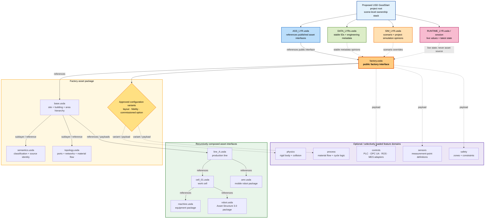
```mermaid
flowchart TB
    Root["Proposed USD GoodStart project root<br/>scene-level ownership stack"]
    ASS["ASS_LYR.usda<br/>references published asset interfaces"]
    DATA["DATA_LYRs.usda<br/>stable IDs + engineering metadata"]
    SIM["SIM_LYR.usda<br/>scenario + project simulation opinions"]
    RUN["RUNTIME_LYR.usda / session<br/>live values + latest state"]

    Factory["factory.usda<br/><b>public factory interface</b>"]

    subgraph FactoryPackage["Factory asset package"]
        direction TB
        FactoryBase["base.usda<br/>site + building + area hierarchy"]
        FactorySem["semantics.usda<br/>classification + source identity"]
        FactoryTopo["topology.usda<br/>ports + networks + material flow"]
        FactoryVariants{"Approved configuration variants<br/>layout · fidelity · commissioned option"}

        FactoryBase -->|"sublayer / reference"| FactorySem
        FactoryBase -->|"sublayer / reference"| FactoryTopo
    end

    subgraph NestedAssets["Recursively composed asset interfaces"]
        direction LR
        Line["line_A.usda<br/>production line"]
        Cell["cell_01.usda<br/>work cell"]
        Machine["machine.usda<br/>equipment package"]
        Robot["robot.usda<br/>Asset Structure 3.0 package"]
        Mobile["amr.usda<br/>mobile robot package"]

        Line -->|"references"| Cell
        Cell -->|"references"| Machine
        Cell -->|"references"| Robot
        Line -->|"references"| Mobile
    end

    subgraph FeatureDomains["Optional / selectively loaded feature domains"]
        direction LR
        Physics["physics<br/>rigid body + collision"]
        Process["process<br/>material flow + cycle logic"]
        Controls["controls<br/>PLC · OPC UA · ROS · MES adapters"]
        Sensors["sensors<br/>measurement-point definitions"]
        Safety["safety<br/>zones + constraints"]
    end

    Root --> ASS
    Root --> DATA
    Root --> SIM
    Root --> RUN
    ASS -->|"references public interface"| Factory
    Factory -->|"references"| FactoryBase
    FactoryBase -->|"references / payloads"| Line
    Factory --> FactoryVariants
    FactoryVariants -.->|"variant / payload"| Physics
    FactoryVariants -.->|"variant / payload"| Process
    Factory -.->|"payload"| Controls
    Factory -.->|"payload"| Sensors
    Factory -.->|"payload"| Safety
    DATA -.->|"stable metadata opinions"| Factory
    SIM -.->|"scenario overrides"| Factory
    RUN -.->|"live state; never asset source"| Factory

    style Root fill:#e3f2fd,stroke:#0d47a1,stroke-width:2px,color:#000
    style ASS fill:#bbdefb,stroke:#1565c0,stroke-width:2px,color:#000
    style DATA fill:#dcedc8,stroke:#558b2f,stroke-width:2px,color:#000
    style SIM fill:#ffe0b2,stroke:#ef6c00,stroke-width:2px,color:#000
    style RUN fill:#f8bbd0,stroke:#ad1457,stroke-width:2px,color:#000
    style Factory fill:#ffcc80,stroke:#e65100,stroke-width:3px,color:#000
    style FactoryPackage fill:#fff8e1,stroke:#f9a825,stroke-width:2px,color:#000
    style NestedAssets fill:#e8f5e9,stroke:#2e7d32,stroke-width:2px,color:#000
    style FeatureDomains fill:#ede7f6,stroke:#5e35b1,stroke-width:2px,color:#000
    style FactoryVariants fill:#ffe082,stroke:#f57f17,stroke-width:2px,color:#000
```

*Figure 16.4 - Proposed recursive factory adaptation. The proposed USD GoodStart layer order retains scene-level ownership lanes while the factory and its subsets expose nested public asset interfaces. Authored configurations use variants/payloads; runtime state remains a separate contribution.*

#### Proposed factory package profile

```text
010_ASS_USD/USD_Wrappers/<factory_id>/
  <factory_id>.usda                 # public factory interface
  payloads/
    base.usda                       # site/building/area hierarchy
    geometries.usd                  # package-owned geometry where applicable
    instances.usda                  # placements and reusable instances
    materials.usda
    semantics.usda                  # classification and stable asset identity
    topology.usda                   # ports, networks, adjacency, material flow
    areas/
      <line_id>.usda                # references public line/cell interfaces
  features/
    physics/
      neutral.usda
      physx.usda
      other_backend.usda
    process/
      material_flow.usda
      cycle_logic.usda
    controls/
      plc_interface.usda
      opcua_interface.usda
      ros_interface.usda
    sensors/
      measurement_points.usda
    safety/
      zones.usda
      constraints.usda
  data/
    source_manifest.json
    mapping_profile.json
    package_contract.json

010_ASS_USD/USD_Wrappers/<line_or_cell_id>/
  <line_or_cell_id>.usda            # independently reusable nested package

010_ASS_USD/USD_Wrappers/<machine_or_robot_id>/
  <machine_or_robot_id>.usda        # machine profile or robot Asset Structure 3.0
```

This is intentionally a **profile**, not a mandatory folder explosion. A small static factory model may need only a public interface, a base payload, materials, and metadata. Additional feature folders should be created only when a real ownership, loading, configuration, or simulation boundary exists.

#### Resulting USD GoodStart proposal

The proposed USD GoodStart layer order should consider Asset Structure 3.0 as the basis for an optional **recursive Digital Twin Asset Package profile**:

1. Keep the existing thin project root and scene-level layer-strength contract.
2. Make `ASS_LYR.usda` the boundary to public factory/equipment interfaces.
3. Allow the same interface/payload/variant pattern to repeat at factory, line, cell, machine, and robot scale.
4. Keep stable semantics and topology loadable independently from heavy geometry.
5. Keep runtime telemetry and latest operational state outside the authored configuration variants.
6. Validate every package boundary and record source/mapping evidence in its contract and reports.

The approach is therefore suitable for digital twins, but only after separating **recursive asset composition** from **project ownership layers** and **live operational state**. That separation is the part that prevents a factory-scale application of Asset Structure 3.0 from becoming an unmanageable robot package with thousands of unrelated responsibilities.

### 16.2 Case Study: Workcell-DigitalTwin to Asset Structure 3.0

This case study applies the preceding principles to the public [nAurava Technologies Workcell-DigitalTwin repository](https://github.com/nAurava-Technologies/Workcell-DigitalTwin) and to the locally inspected working copy at `E:\SynologyDrive\9999_LocalRepo\Workcell-DigitalTwin`. The purpose is not to criticize a functioning demonstration stage. It is to identify what a reproducible dataprep and publication pipeline must do when a composed engineering/simulation scene becomes a reusable 3.0-ready asset product.

#### Evidence boundary and terminology

The repository's canonical assembly is `workcell_digitaltwin.usd`. The detailed counts below come from the local ASCII inspection copy `workcell_digitaltwin.usda` on **2026-07-16**; that inspection copy was untracked in the Workcell repository and is therefore evidence for this case-study snapshot, not a claim about an additional published source file. The canonical binary stage, public repository, and generated ASCII inspection copy must be treated as different artifacts in provenance records.

“Asset Structure 3.0-ready” is used here as an **architectural target**, not as a claim that NVIDIA publishes a factory-specific conformance certificate. The official Isaac Sim pattern is robot-oriented. This case study adapts its stable public interface, shared base, payload, and variant principles recursively to a workcell while preserving the distinction between asset-local packaging and scene-level ownership.

#### Initial state: useful content with mixed ownership

The repository already contains two different maturity levels:

1. **UR10 and Robotiq are already close to the 3.0 pattern.** Their public `.usda` files reference `payloads/base.usda`, expose physics variant sets, and load backend-specific physics with payloads. They should be validated and reused, not flattened and rebuilt into the workcell.
2. **Most CAD-derived equipment remains single-file or lightly packaged.** Table, bin, robot base, wall, X-ray scanner, battery pack, and related items pair engineering source files such as STEP/STP with processed USD assets, but do not yet expose the same uniform public-interface contract.
3. **The workcell root is simultaneously an assembly, lookdev layer, physics integration layer, environment, runtime snapshot, and viewport/render document.** In the inspected ASCII copy, the 4,550-line stage contains 19 payload mentions, 73 `def` declarations, 729 `over` declarations, seven embedded materials, extensive physics/PhysX opinions, environment content, camera metadata, and render settings. It composes component files with payloads and authors many deep overrides below their imported prims.

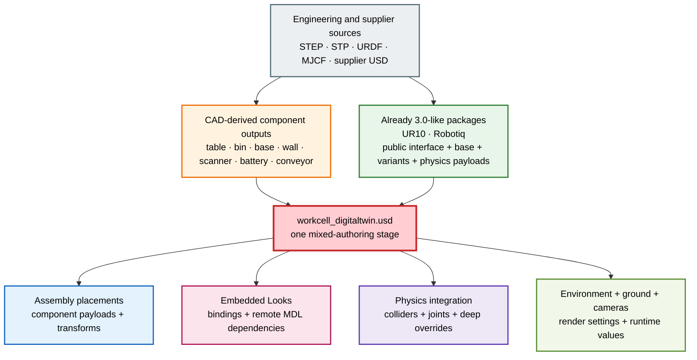
```mermaid
flowchart TB
    Sources["Engineering and supplier sources<br/>STEP · STP · URDF · MJCF · supplier USD"]
    CadAssets["CAD-derived component outputs<br/>table · bin · base · wall · scanner · battery · conveyor"]
    ReadyAssets["Already 3.0-like packages<br/>UR10 · Robotiq<br/>public interface + base + variants + physics payloads"]
    MixedRoot["workcell_digitaltwin.usd<br/>one mixed-authoring stage"]
    Assembly["Assembly placements<br/>component payloads + transforms"]
    Looks["Embedded Looks<br/>bindings + remote MDL dependencies"]
    Physics["Physics integration<br/>colliders + joints + deep overrides"]
    Scene["Environment + ground + cameras<br/>render settings + runtime values"]

    Sources --> CadAssets
    Sources --> ReadyAssets
    CadAssets --> MixedRoot
    ReadyAssets --> MixedRoot
    MixedRoot --> Assembly
    MixedRoot --> Looks
    MixedRoot --> Physics
    MixedRoot --> Scene

    style Sources fill:#eceff1,stroke:#546e7a,stroke-width:2px,color:#000
    style CadAssets fill:#fff3e0,stroke:#ef6c00,stroke-width:2px,color:#000
    style ReadyAssets fill:#e8f5e9,stroke:#2e7d32,stroke-width:2px,color:#000
    style MixedRoot fill:#ffcdd2,stroke:#c62828,stroke-width:3px,color:#000
    style Assembly fill:#e3f2fd,stroke:#1565c0,stroke-width:2px,color:#000
    style Looks fill:#fce4ec,stroke:#ad1457,stroke-width:2px,color:#000
    style Physics fill:#ede7f6,stroke:#5e35b1,stroke-width:2px,color:#000
    style Scene fill:#f1f8e9,stroke:#558b2f,stroke-width:2px,color:#000
```

*Figure 16.5 - Inspected initial state. The red box is not “bad USD”; it is a useful integration stage whose responsibilities must be classified before it can become a reusable asset publication.*

The conversion must therefore preserve the working composition while moving each opinion to an explicit owner. A naive “save every prim into a new folder” operation would break deep override paths, joint relationships, material bindings, source traceability, or all four.

#### Target invariant: package once, wrap as needed

The three requested outcomes should not be maintained as three separately converted workcells. They share one canonical 3.0-ready workcell package:

```text
canonical reusable product
  = Workcell Asset Structure 3.0-ready package

delivery A
  = canonical package opened directly

delivery B
  = minimal root + ENV + MTL + ASS around the canonical package

delivery C
  = proposed USD GoodStart ownership stack around the canonical package
```

The package owns reusable defaults and internal implementation. The envelope owns project-, scenario-, review-, or runtime-specific opinions. This avoids three copies drifting apart and makes migration from the minimal envelope to USD GoodStart a scene-governance change rather than another CAD conversion.

#### Required dataprep and publication pipeline


```mermaid
flowchart TB
    P0["0 · Declare target capability profile<br/>public prims · variants · loading · simulation requirements"]
    P1["1 · Freeze and manifest inputs<br/>source IDs · licenses · hashes · tool versions"]
    P2["2 · Inspect and classify current stage<br/>assembly · geometry · materials · physics · environment · runtime"]
    P3["3 · Define package boundaries<br/>workcell · robot · gripper · conveyor · scanner · table · bin · product"]
    P4["4 · Normalize and map<br/>units · Z-up · pivots · names · instances · stable IDs"]
    P5["5 · Build or retain component packages<br/>public interface · base · materials · semantics · feature payloads"]
    P6["6 · Build workcell package<br/>instances reference only component public interfaces"]
    P7["7 · Retarget authored opinions<br/>materials · joints · colliders · sensors · configuration · environment"]
    P8["8 · Validate equivalence and closure<br/>composition · transforms · appearance · physics · paths · performance"]
    P9["9 · Publish atomically<br/>versioned package + manifest + reports + chosen envelope"]

    P0 --> P1 --> P2 --> P3 --> P4 --> P5 --> P6 --> P7 --> P8 --> P9

    style P0 fill:#fff3e0,stroke:#ef6c00,stroke-width:2px,color:#000
    style P1 fill:#eceff1,stroke:#546e7a,stroke-width:2px,color:#000
    style P2 fill:#ffebee,stroke:#c62828,stroke-width:2px,color:#000
    style P3 fill:#e8eaf6,stroke:#3949ab,stroke-width:2px,color:#000
    style P4 fill:#e0f2f1,stroke:#00796b,stroke-width:2px,color:#000
    style P5 fill:#e8f5e9,stroke:#2e7d32,stroke-width:2px,color:#000
    style P6 fill:#e3f2fd,stroke:#1565c0,stroke-width:2px,color:#000
    style P7 fill:#f3e5f5,stroke:#7b1fa2,stroke-width:2px,color:#000
    style P8 fill:#fff8e1,stroke:#f9a825,stroke-width:2px,color:#000
    style P9 fill:#dcedc8,stroke:#558b2f,stroke-width:3px,color:#000
```

*Figure 16.6 - Conversion pipeline. File conversion occurs inside steps 4-6; requirements, ownership mapping, retargeting, validation, and publication are equally important deliverables.*

The steps have the following Workcell-specific responsibilities:

1. **Declare the product contract before restructuring.** Decide which prim paths are public, which subsets load independently, which physics/controller/sensor variants are supported, which component placements are addressable, and whether the environment belongs to the reusable workcell or to the consuming scene.
2. **Create a source manifest.** Record the STEP/STP, URDF, MJCF, supplier USD, textures, validation JSON, licenses, Git commit, conversion settings, and hashes. Preserve the existing source folders; generated packages must not replace their evidence.
3. **Inventory the composed stage.** Traverse prims and composition arcs, classify every authored field, and generate a source-path-to-target-owner mapping. Explicitly flag stale `delete payload` edits, absolute/external paths, remote material URLs, and overrides into package-private prims.
4. **Define reusable boundaries.** The workcell, UR10, Robotiq gripper, conveyor, scanner, robot base, tables, bins, battery pack, and wall/guarding should each have a stable public entry point when they are independently reusable or replaceable. Do not create a package merely because a CAD body exists; use functional and lifecycle boundaries.
5. **Normalize without erasing provenance.** Enforce meters and Z-up, establish stable pivots and local frames, sanitize names, preserve source IDs as metadata, detect repeated parts, and produce visual/collision representations according to the selected capability profile.
6. **Retain mature packages.** UR10 and Robotiq already demonstrate the desired public-interface/base/physics-variant pattern. Validate their defaults and dependencies, then reference their public files. Repacking their internal geometry into the workcell would destroy the boundary this migration is trying to create.
7. **Package the remaining components.** Generate a public `<asset_id>.usda`, a stable base, geometry/instance/material/semantic contributions, optional collision or backend physics payloads, and validation reports. Static props need only the features they actually support; they do not need empty robot/controller folders.
8. **Author the workcell assembly through public interfaces.** `instances.usda` or the equivalent assembly contribution owns component placement and references the published component roots. Scene code must not reference `geometries.usd`, internal links, or private material prims directly.
9. **Retarget integration opinions.** Move material bindings, fixed joints, collision overrides, conveyor behavior, grasp guides, sensors, and connections to package-local feature layers or declared scene layers. Deep `over` paths must be mapped to stable public prims or promoted connection points; textual path replacement is not sufficient.
10. **Separate discrete configuration from runtime state.** Layout, physics backend, robot tool, product format, and fidelity can be bounded variants. Belt velocity, live joint state, current battery position, PLC values, alarms, and measurements belong in runtime/session infrastructure, not in asset variants.
11. **Validate equivalence before publishing.** Compare transforms, extents, material assignments, loaded/unloaded payload behavior, collision coverage, joints, default variant selections, articulation behavior, and visual output against the accepted initial stage. A structurally cleaner stage that changes the working simulation is a failed conversion.
12. **Publish atomically.** Version the public package, dependency lock, source manifest, mapping report, validation results, and envelope together. Downstream consumers switch one published interface only after all gates pass.

#### Workcell concern-routing map

| Inspected initial concern | Canonical 3.0-ready owner | Minimal envelope override | Proposed USD GoodStart owner |
|---------------------------|---------------------------|---------------------------|----------------------------------|
| Component payloads and placements | `workcell/payloads/instances.usda`, referencing component public interfaces | `ASS_LYR.usda` references `workcell.usda` | `ASS_LYR.usda` references `workcell.usda` |
| UR10 and Robotiq package internals | Existing component packages; validate, do not copy | No direct access | No direct access |
| Workcell-owned geometry | Workcell base/geometry payload or a dedicated wall/ground asset | No geometry authored in root | No geometry authored in root |
| Reusable default materials | Asset-local `materials.usda` | Project look overrides in `MTL_LYR.usda` | Project look overrides in `MTL_LYR.usda` |
| Ground, lights, scene environment | Optional workcell environment feature only for self-contained delivery A | `ENV_LYR.usda` | `ENV_LYR.usda` |
| Reusable component collision/physics | Component-local neutral/backend feature payloads | Asset defaults remain active | Asset defaults remain active; `PHY_LYR.usda` authors project integration overrides |
| Fixed joints and connections between assets | Workcell-local topology/physics feature using promoted attachment points | Remains in workcell package unless project-specific | `PHY_LYR.usda` or `SIM_LYR.usda` only when scenario-specific |
| Layout or backend alternatives | Declared variant sets on the public workcell/component interface | Select public variants in `ASS` or a small configuration layer | Select public variants in `VAR_LYR.usda` |
| Stable source IDs and engineering metadata | Asset-local semantics plus manifest | Not duplicated | `DATA_LYRs.usda` adds project/system mappings without replacing asset identity |
| Conveyor speed, joint values, current product positions | Not authored as reusable asset truth | External/session state | `RUNTIME_LYR.usda` or session/Fabric/external data system |
| Cameras and viewport/render settings | Preview defaults only if deliberately part of the asset product | Root metadata or `ENV_LYR` by documented minimal policy | `CAM_LYR.usda`; review/render overrides may use `OPIN_LYR.usda` |
| Validation JSON and migration evidence | Package `data/` and publication reports | Referenced by release metadata, not composed as scene opinions | Same; project QA may aggregate results outside the USD stage |

#### Delivery A: pure Asset Structure 3.0-inspired workcell product

This is the reusable product without a project layer stack. It is appropriate when the workcell itself is the deliverable and must open directly with sensible defaults.

```text
Workcell_AS3/
  workcell.usda                       # stable public interface + default variants
  payloads/
    base.usda                         # stable hierarchy / package assembly
    instances.usda                    # placements; references component public roots
    geometries.usdc                   # only geometry genuinely owned by the workcell
    materials.usda                    # reusable default materials and bindings
    semantics.usda                    # stable IDs, classifications, attachment points
    Physics/
      physics.usda                    # neutral/shared physics contribution
      physx.usda                      # optional backend implementation
  features/
    environment/environment.usda      # optional self-contained preview environment
    process/material_flow.usda
    controls/controller_interfaces.usda
    sensors/measurement_points.usda
  data/
    source_manifest.json
    mapping_report.json
    package_contract.json
    validation/
  dependencies/
    dependency_lock.json              # UR10, Robotiq, conveyor, props, etc.
```

`workcell.usda` references the stable base, exposes only supported variants, and payloads optional/heavy features. `instances.usda` references `ur10.usda`, `Robotiq_2F_85.usda`, and every other component's public interface. The workcell package must not reach into their `payloads/` folders. If environment or process behavior is not part of the reusable product contract, omit those features rather than publishing empty placeholders.

#### Delivery B: thin three-layer scene plus 3.0-ready assets

This is the smallest governed scene envelope. The root contains metadata and the ordered sublayer list only. Strong-to-weak order is **ENV → MTL → ASS** so scene environment and look overrides can refine the referenced asset defaults.

```text
Workcell_Minimal/
  Workcell_ROOT.usda                  # thin root; subLayers only
  020_LYR/
    ENV_LYR.usda                      # ground, lights, scene environment
    MTL_LYR.usda                      # project-specific look overrides
    ASS_LYR.usda                      # references Workcell_AS3/workcell.usda
  010_ASS_USD/
    Workcell_AS3/                     # canonical package; not a copied rewrite
```

```usda
#usda 1.0
(
    defaultPrim = "World"
    metersPerUnit = 1
    upAxis = "Z"
    subLayers = [
        @./020_LYR/ENV_LYR.usda@,
        @./020_LYR/MTL_LYR.usda@,
        @./020_LYR/ASS_LYR.usda@
    ]
)
```

Physics defaults remain inside the 3.0-ready component/workcell packages. If project-specific physics, runtime state, animation, or data integration becomes necessary, do not overload these three layers indefinitely; graduate to delivery C.

#### Delivery C: proposed USD GoodStart layer order plus 3.0-ready assets

This is the operational digital-twin envelope. It uses the same canonical workcell package, but distributes scene-level authorship across explicit ownership lanes.

```text
Workcell_USDGoodStart/
  Workcell_ROOT.usda
  000_SOURCE/                        # preserved engineering sources / manifests
  010_ASS_USD/
    Workcell_AS3/workcell.usda       # canonical public workcell interface
  020_BASE_LYR/
    OPIN_LYR.usda
    CAM_LYR.usda
    ENV_LYR.usda
    ACTGR_LYR.usda
    ANIM_LYR.usda
    VAR_LYR.usda
    MTL_LYR.usda
    PHY_LYR.usda
    ASS_LYR.usda                     # references only workcell.usda
  030_SIM_LYR/SIM_LYR.usda
  035_RUNTIME_LYR/RUNTIME_LYR.usda
  040_DATA_LYRs/DATA_LYRs.usda
```

The proposed strong-to-weak order remains **OPIN → CAM → ENV → RUNTIME → SIM → DATA → ACTGR → ANIM → VAR → MTL → PHY → ASS**. The important constraint is that these project layers do not duplicate asset-package ownership:

- `ASS_LYR` places the public workcell interface; it does not rebuild the workcell.
- `PHY_LYR` owns scene/project integration overrides; reusable component physics remains asset-local.
- `VAR_LYR` selects declared public variants; it does not author private variant internals.
- `MTL_LYR` provides project look overrides; reusable default materials remain in their asset packages.
- `DATA_LYRs` maps project systems and identifiers; it does not replace source identity or package manifests.
- `RUNTIME_LYR` carries latest/live state; it never becomes the source for the next asset publication.

#### Comparing the three final states

| Decision | A - Pure 3.0-ready product | B - Thin layers + 3.0 | C - Proposed USD GoodStart + 3.0 |
|----------|----------------------------|-----------------------|----------------------------------|
| Canonical asset package | Yes | Same package | Same package |
| Scene-level layers | None | `ENV`, `MTL`, `ASS` | Full ownership stack |
| Opens as self-contained workcell | Yes, if preview environment is included | Yes | Yes |
| Best fit | Reusable library/product delivery | Small project, review, demonstration | Operational twin, simulation programs, multi-system collaboration |
| Runtime/live-state lane | External only | External only | Explicit `RUNTIME`/session lane |
| Project simulation lane | Asset defaults/features | Not explicit | Explicit `SIM` and `PHY` responsibilities |
| Static system-data lane | Package semantics/manifest | Not explicit | Explicit `DATA` aggregation/mapping |
| Authoring overhead | Lowest scene governance; strong package discipline | Low | Highest, justified only by real ownership needs |
| Migration relationship | Foundation | Wraps A | Wraps A; can replace B without reconverting A |

**Recommended sequence for this repository:** build and validate delivery A as the canonical publication; adopt delivery B as the immediate replacement for the mixed demonstration root; introduce delivery C when the Workcell becomes an operational twin with live state, scenario simulation, system mappings, multiple authoring roles, or persistent project overrides.

#### Acceptance gates for this case study

The conversion is complete only when all of the following are demonstrated:

- One stable public workcell path and one public path per reusable component.
- All assembly dependencies target public interfaces and resolve package-relatively or through a versioned resolver policy.
- No scene layer authors opinions against undocumented package-private prim paths.
- Meters, Z-up, time codes, pivots, and default prims are declared and validated consistently.
- Every supported variant has a documented meaning, valid default, complete dependency closure, and successful load test.
- The stage opens with all payloads loaded, with optional payloads unloaded, and under each supported configuration.
- Remote materials and third-party content have reproducible dependency and license records.
- Source-to-target prim mappings, removed/stale edits, and manually approved exceptions are recorded.
- Visual placement, material appearance, collision coverage, joints, articulation, conveyor behavior, and task behavior match the accepted initial-state baseline within declared tolerances.
- Re-importing one changed CAD component can regenerate and republish that component without changing unrelated public paths or rebuilding the entire workcell.

The final state is therefore not defined by a prettier folder tree. It is defined by **stable public contracts, explicit ownership, reproducible transformation, controlled configuration, selective loading, and proven behavioral equivalence**.

### Optional Isaac-style robot package profile

For robot and multi-physics assets, the generic proposed USD GoodStart asset-package template can support an Isaac-aligned profile such as:

```text
010_ASS_USD/USD_Wrappers/<robot_id>/
  <robot_id>.usda              # public asset interface
  layers/
    base.usda                  # structural assembly
    geometries.usd
    materials.usda
    instances.usda
    robot.usda                 # robot schema contribution
    physics/
      physics.usda             # shared / neutral physics
      physx.usda
      mujoco.usda
    controllers/
    end_effectors/
  data/
    source_manifest.json
    mapping_profile.json
```

This profile should be **optional**, because a static industrial asset does not need empty robot, controller, or multi-backend physics files. The package contract should declare supported variants, payloads, default selections, public prims, and which internal contributions are required. The proposed USD GoodStart scene root and its existing layer-strength policy remain unchanged.

### Research conclusion

Isaac Sim Asset Structure 3.0 is a strong reference implementation for the proposed USD GoodStart reusable asset boundary. It confirms that complex simulation assets scale by combining a thin public interface with purpose-specific internal layers, deferred payloads, and explicit variants. The transferable lesson is not the literal robot filenames; it is the stable separation of shared asset data, backend-specific simulation data, optional behavior stacks, and the single downstream reference target.

## 17. NVIDIA SimReady Foundation: Capability Contracts, Validation, and Standardization

**Primary sources:** [NVIDIA SimReady Foundation repository](https://github.com/NVIDIA/simready-foundation) · [SimReady Standardization Workflow](https://docs.omniverse.nvidia.com/simready/latest/simready-standards/standardization_workflow.html) · [Validation Workflow](https://github.com/NVIDIA/simready-foundation/blob/main/nv_core/sr_specs/docs/guides/validate_workflow.md) · [Profiles Validation Workflow](https://github.com/NVIDIA/simready-foundation/blob/main/nv_core/sr_specs/docs/guides/profiles_validation_workflow.md) · [Repository Acceptance Workflow](https://github.com/NVIDIA/simready-foundation/blob/main/nv_core/sr_specs/docs/guides/acceptance_workflow.md)

SimReady belongs in this research as a **separate architectural axis**. Asset Structure 3.0 is primarily a composition and packaging pattern: it determines how a reusable product can expose one public identity while organizing shared data, variants, and payloaded features. SimReady Foundation defines what a declared asset capability means, which requirements prove it, how validators execute those requirements, and how specifications mature into reproducible industry workflows.

The distinction can be summarized as follows:

| Concern | Main question | Primary mechanism |
|---------|---------------|-------------------|
| Asset Structure 3.0 | How is one configurable asset product composed, loaded, and published? | Public interface, references, payloads, variants, package-local layers |
| SimReady Foundation | What must an asset support for a named simulation use case, and how is that claim verified? | Versioned profiles, features, requirements, rules, reports, validation metadata |
| Proposed USD GoodStart layer order | Who owns scene/project opinions and which peer contribution wins? | Thin root and ordered scene-level ownership layers |
| Dataprep/publication pipeline | How are source models transformed into a package that satisfies the selected contracts? | Mapping, conversion, enrichment, validation, provenance, atomic publication |

These systems can reinforce one another, but none is a substitute for the others. A well-organized 3.0 package can fail its selected SimReady profile. A SimReady-validated asset can still be placed in a poorly governed scene. A clean USD GoodStart stack cannot repair missing collision, invalid units, or an incomplete articulation.

### The SimReady specification hierarchy

The current Foundation repository operationalizes SimReady through four interlocking specification surfaces. Profiles select features; features bundle requirements and dependencies; capabilities organize requirement domains; executable rules enforce the individual requirements.

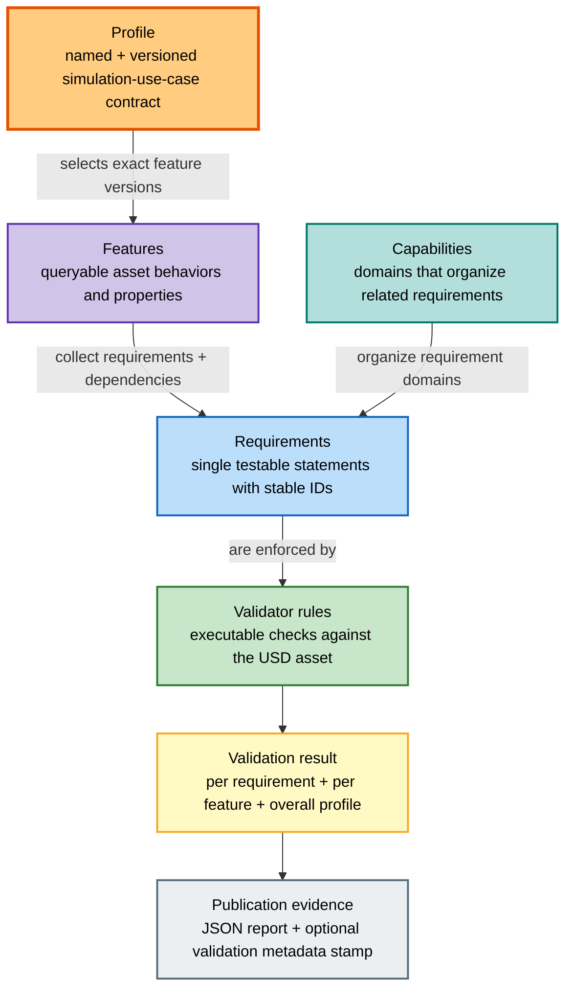
```mermaid
flowchart TB
    Profile["Profile<br/>named + versioned simulation-use-case contract"]
    Features["Features<br/>queryable asset behaviors and properties"]
    Capabilities["Capabilities<br/>domains that organize related requirements"]
    Requirements["Requirements<br/>single testable statements with stable IDs"]
    Rules["Validator rules<br/>executable checks against the USD asset"]
    Result["Validation result<br/>per requirement + per feature + overall profile"]
    Evidence["Publication evidence<br/>JSON report + optional validation metadata stamp"]

    Profile -->|"selects exact feature versions"| Features
    Features -->|"collect requirements + dependencies"| Requirements
    Capabilities -->|"organize requirement domains"| Requirements
    Requirements -->|"are enforced by"| Rules
    Rules --> Result
    Result --> Evidence

    style Profile fill:#ffcc80,stroke:#e65100,stroke-width:3px,color:#000
    style Features fill:#d1c4e9,stroke:#5e35b1,stroke-width:2px,color:#000
    style Capabilities fill:#b2dfdb,stroke:#00796b,stroke-width:2px,color:#000
    style Requirements fill:#bbdefb,stroke:#1565c0,stroke-width:2px,color:#000
    style Rules fill:#c8e6c9,stroke:#2e7d32,stroke-width:2px,color:#000
    style Result fill:#fff9c4,stroke:#f9a825,stroke-width:2px,color:#000
    style Evidence fill:#eceff1,stroke:#546e7a,stroke-width:2px,color:#000
```

*Figure 17.1 - SimReady's validation hierarchy. A profile claim is meaningful only when its pinned features, transitive requirements, executable rules, and results can be resolved for the declared versions.*

| Level | Role | Repository realization | Example from official guidance |
|-------|------|------------------------|--------------------------------|
| **Requirement** | One testable rule with an identifier | Requirement documentation and validation code under `nv_core/sr_specs/docs/capabilities/` | A stage must define a default prim |
| **Capability** | Domain/category that organizes related requirements | Capability folders such as Sample, Visualization/Geometry, or Units | Units, hierarchy, geometry, materials |
| **Feature** | Versioned bundle of requirements and feature dependencies describing a behavior/property | Feature JSON plus documentation under `nv_core/sr_specs/docs/features/` | Minimal placeable visual, rigid-body physics, driven joints |
| **Profile** | Named, versioned bundle of exact feature versions for one complete simulation scenario | `nv_core/sr_specs/docs/profiles/profiles.toml` and profile documentation | `Prop-Robotics-Neutral`, `Prop-Robotics-Physx`, `Robot-Body-Neutral`, `Robot-Body-Runnable` |

The profile is the producer/consumer contract. Validation resolves its exact feature versions, includes transitive feature dependencies, collects the associated requirement IDs, executes the backing rules, and reports results at requirement, feature, and profile level. This is substantially stronger than calling an asset “simulation ready” based on visual inspection or the presence of a physics API.

### What SimReady does and does not decide

SimReady can define and validate facts such as units, default prims, hierarchy properties, geometry readiness, materials, rigid-body behavior, articulations, joints, or other runtime-facing capabilities. It can also provide transformation and validation workflows between profiles, for example from a neutral asset toward a PhysX- or Isaac-oriented result.

SimReady does **not by itself prescribe one universal repository tree, sublayer order, or Asset Structure 3.0 package**. Individual requirements may constrain composition or prim organization when a capability depends on it, but a profile is fundamentally a capability contract, not a complete project architecture. It also does not define ownership of live telemetry, shot/scene overrides, review opinions, or project-level simulation results.

This matters for the Workcell case study. A table can pass a prop profile without using the same internal package layout as a robot. Conversely, a workcell may use the 3.0 interface/reference/payload/variant pattern and still lack a profile that proves material-flow, controller, sensor, safety, or workcell-topology capabilities.

### The SimReady standardization workflow

The published standardization workflow is not merely an asset-validation checklist. It is a process for defining a new simulation capability and making it adoptable:

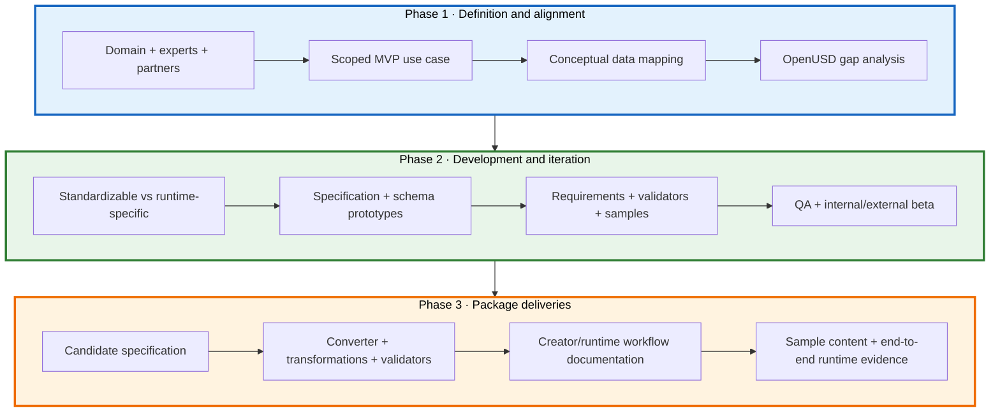
```mermaid
flowchart TB
    subgraph Phase1["Phase 1 · Definition and alignment"]
        direction LR
        Domain["Domain + experts + partners"]
        UseCase["Scoped MVP use case"]
        Mapping["Conceptual data mapping"]
        Gap["OpenUSD gap analysis"]
        Domain --> UseCase --> Mapping --> Gap
    end

    subgraph Phase2["Phase 2 · Development and iteration"]
        direction LR
        Viability["Standardizable vs runtime-specific"]
        Draft["Specification + schema prototypes"]
        Build["Requirements + validators + samples"]
        Beta["QA + internal/external beta"]
        Viability --> Draft --> Build --> Beta
    end

    subgraph Phase3["Phase 3 · Package deliveries"]
        direction LR
        Candidate["Candidate specification"]
        Pipeline["Converter + transformations + validators"]
        Docs["Creator/runtime workflow documentation"]
        Samples["Sample content + end-to-end runtime evidence"]
        Candidate --> Pipeline --> Docs --> Samples
    end

    Phase1 --> Phase2 --> Phase3

    style Phase1 fill:#e3f2fd,stroke:#1565c0,stroke-width:3px,color:#000
    style Phase2 fill:#e8f5e9,stroke:#2e7d32,stroke-width:3px,color:#000
    style Phase3 fill:#fff3e0,stroke:#ef6c00,stroke-width:3px,color:#000
```

*Figure 17.2 - Condensed SimReady Standardization Workflow. The output is not just a document: it includes specifications, validators, transformations, reference pipelines, workflow guidance, and sample content tested into target runtimes.*

#### Phase 1 - Definition and alignment

- Identify the domain, domain expert, OpenUSD expertise, QA/content/engineering responsibilities, stakeholders, and partners.
- Specify a deliberately bounded MVP use case, asset class, runtime interfaces, inputs, and outputs.
- Map existing standards or de facto domain data models to OpenUSD.
- Perform gap analysis where required data or behaviors have no suitable OpenUSD representation.

For a factory workcell, this phase must answer whether the target is only placeable visualization, rigid-body manipulation, robot execution, material-flow simulation, controller integration, sensor/synthetic-data generation, or a combination. “Digital twin” is too broad to serve as a single profile definition.

#### Phase 2 - Development and iteration

- Separate capabilities that are broadly standardizable from solver-, runtime-, or product-specific behavior that is not yet ready for standardization.
- Prototype content specifications, attributes, schemas, sample assets, and runtime connections.
- Define testable requirements and implement validators.
- Build creator workflows and iterate through QA, internal beta, and external beta against declared acceptance criteria.

This phase prevents a current project convention from being presented prematurely as an industry standard. A useful project-local workcell profile can exist before it is accepted as an official SimReady profile, provided its provenance and maturity are explicit.

#### Phase 3 - Package deliveries

- Publish the candidate specification and its versioned contracts.
- Provide converter/data-mapping implementation, post-export or pre-ingest transformations, validators, and runtime test procedures.
- Provide creator documentation showing how to author, validate, and exercise the capability.
- Supply sample content or datasets that demonstrate the capability and continuously exercise its validators.

The official workflow explicitly treats non-file sources such as streams and databases as valid pipeline inputs. That aligns with digital twins: the standardization problem is not limited to CAD-to-USD conversion, although authored runtime values must still be separated from stable asset truth.

### Where SimReady enters the dataprep pipeline

The Case Study pipeline in Section 16.2 should be extended with two separate kinds of contracts:

1. **Package contract:** public prims, private paths, dependencies, payload policy, variant interface, ownership, and versioning.
2. **Capability profile:** features and requirements the published entry point claims to satisfy for a named simulation scenario.

```text
source evidence
  -> conceptual data mapping
  -> conversion and normalization
  -> 3.0-ready package composition
  -> profile-specific enrichment / transformation
  -> requirement validation
  -> runtime acceptance tests
  -> publish package + profile/version claim + reports
```

Validation should run during conversion, at component publication, at workcell assembly, and in the target runtime. The chosen profile and version must be pinned in the build manifest and validation record; silently validating against “latest” would make a previously published claim non-reproducible.

### Applying SimReady to the Workcell case study

| Publication boundary | Existing or candidate profile direction | Immediate evidence required |
|----------------------|-----------------------------------------|-----------------------------|
| Table, bin, battery pack, static fixtures | Existing neutral/PhysX prop profiles where applicable | Placeability, units, geometry, materials, collision/rigid-body behavior, validation JSON |
| UR10 robot body | Existing neutral/runnable/Isaac-oriented robot profiles as supported | Articulation, driven joints, physics backend, default variants, runtime execution |
| Robotiq gripper | Applicable robot/end-effector feature set; do not assume the robot-body profile is automatically sufficient | Joint behavior, grasp/contact behavior, attachment interface, selected physics implementation |
| Conveyor | Existing features plus a project-local behavior profile if driven material transport is not covered | Collision, driven surface/actuation, velocity interface, runtime behavior |
| X-ray scanner and sensors | Existing placeable/visual features plus candidate sensor capability if required | Coordinate frame, sensor interface, outputs, runtime/synthetic-data behavior |
| Workcell public interface | Composition validation plus a candidate workcell profile if no accepted profile covers the use case | Dependency closure, public interfaces, configuration, topology, runtime task acceptance |

The workcell must not be stamped with a broad profile merely because each child asset passes some profile. Aggregate composition can introduce new failures: invalid attachment frames, overlapping collisions, broken relationships, incompatible variant defaults, missing material dependencies, or a task that no longer runs. Component validation and assembly/runtime acceptance are separate gates.

If the Foundation does not yet contain an accepted workcell or factory profile covering the desired use case, the correct path is:

1. select existing profiles for the component claims they genuinely cover;
2. define a clearly named **project-local candidate profile** for missing workcell capabilities;
3. document its data mapping, gaps, requirements, validators, and runtime tests;
4. avoid calling that candidate an official SimReady standard until it passes the relevant acceptance and standardization process.

### Required publication evidence

A SimReady-aware package publication should add evidence such as:

```text
data/
  package_contract.json
  source_manifest.json
  mapping_report.json
  capability_claims.json          # profile IDs + exact versions + applicability
  validation/
    <profile>-<version>.json       # machine-readable validator output
    runtime_acceptance.json
    validation_environment.json   # validator/tool/runtime versions
```

Validation metadata stamped into a USD layer can improve discoverability, but it must not replace the external report and reproducibility record. The claim needs an asset hash/version, profile version, feature/requirement resolution, validator version, execution environment, result, and date.

### Deferred integration with Asset Structure 3.0 and USD GoodStart

The final integration should be designed in a follow-up synthesis rather than assumed from folder names. The main open questions are:

| Integration question | Why it matters |
|----------------------|----------------|
| Which public entry point is validated? | Profile claims must attach to the stable interface consumers actually reference, not an arbitrary internal payload. |
| Does each variant require its own profile claim? | A neutral, PhysX, MuJoCo, controller, or end-effector configuration may satisfy different features and requirements. |
| Are unloaded payloads validated structurally and loaded payloads behaviorally? | Selective loading must not hide invalid dependencies or unsupported feature branches. |
| How are child-profile claims aggregated at workcell/factory level? | Passing components do not prove correct assembly, topology, or runtime task behavior. |
| Where are validation reports and stamps published? | Evidence must survive package versioning without turning mutable validation results into asset source truth. |
| Which checks belong to asset packages versus scene/project layers? | Asset-local capabilities and project-level scenario/runtime acceptance have different owners and release cycles. |
| How are official and project-local profiles distinguished? | Experimental capability work must not be misrepresented as an accepted NVIDIA or industry standard. |

The provisional responsibility split is therefore:

```text
Asset Structure 3.0  -> package and composition architecture
SimReady Foundation  -> capability semantics, specification maturity, and executable evidence
USD GoodStart        -> project/scene ownership and peer opinion strength
Dataprep pipeline    -> deterministic transformation that satisfies all selected contracts
```

This section intentionally stops at that boundary. A later combined design should map profiles and validation gates onto each 3.0 package/variant and then map assembly/runtime acceptance onto the relevant USD GoodStart project layers without duplicating ownership.

---

## Revision History

| Version | Date | Notes |
|---------|------|-------|
| 1.6.0 | 2026-07-16 | Added Section 17 treating NVIDIA SimReady Foundation as a distinct capability-contract, validation, and standardization axis; documented the requirement/capability/feature/profile hierarchy, three-phase workflow, dataprep insertion points, Workcell application, publication evidence, and deferred integration questions for Asset Structure 3.0 and the proposed USD GoodStart layer order |
| 1.5.0 | 2026-07-16 | Added Section 16.2, a Workcell-DigitalTwin conversion case study documenting the inspected mixed initial stage, a requirements-led dataprep/publication pipeline, concern-routing rules, acceptance gates, and three related delivery states: pure Asset Structure 3.0-ready product, thin ENV/MTL/ASS envelope, and the proposed USD GoodStart envelope around the same canonical package |
| 1.4.5 | 2026-07-15 | Corrected the over-simplified 1.4.4 comparison: restored the complete classic layer stack and all Isaac Sim files, arc types, variant branches, and payload semantics; reorganized only their visual grouping to produce readable, similarly sized vertical panels side by side |
| 1.4.4 | 2026-07-15 | Replaced the GitHub-unstable and visually unbalanced paradigm comparison with a balanced, flat two-panel Mermaid diagram; removed nested subgraphs and HTML label markup while retaining one minimal container-level alignment link |
| 1.4.3 | 2026-07-15 | Restored the Unreal Engine 6 direction as author-held first-hand meeting evidence, clearly distinguishing that non-public primary evidence from Epic's publicly verifiable current OpenUSD implementation status |
| 1.4.2 | 2026-07-15 | Strengthened the Introduction's “Why this matters” section with precise architectural claims, an official NVIDIA Omniverse foundation reference, evidence-based Unreal Engine OpenUSD status, and an explicit caveat against presenting Unreal Engine 6 speculation as confirmed roadmap |
| 1.4.1 | 2026-07-15 | Upgraded the frontmatter to ARYS 1.3 with synchronized canonical tags, Domain020 ownership, provenance, agent-native routing, maturation metadata, and a complete visible dual-header block |
| 1.4.0 | 2026-07-15 | Reorganized the opening into a brief results-focused Executive Summary, a separate research Introduction, and a Composition Foundations section for mechanics, LIV(E)RPS, and the two comparison axes |
| 1.3.9 | 2026-07-15 | Added a pre-case-study decision matrix with a scored questionnaire, validity gates, hybrid interpretation rules, and recommended starting architectures for the four composition paradigms |
| 1.3.8 | 2026-07-15 | Connected the evolution sequence at the Mermaid subgraph/container level so the versions remain vertically stacked while every individual version box preserves its horizontal left-to-right layout |
| 1.3.7 | 2026-07-15 | Restacked the five asset-structure evolution diagrams vertically, with each generation using a readable left-to-right internal layout across the available page width |
| 1.3.6 | 2026-07-15 | Added an opening research thesis framing the asset-structure history as evidence of OpenUSD's adaptable composition model, its transfer from film/VFX to robotics and digital twins, and the need for explicit interfaces, contracts, dataprep, provenance, and validation |
| 1.3.5 | 2026-07-15 | Added a compact side-by-side Mermaid comparison of all five reconstructed Isaac asset-structure generations, with simplified vertical mini-structures and a visible left-to-right evolution path |
| 1.3.4 | 2026-07-15 | Replaced context-free GoodStart shorthand in the Executive Summary and key comparisons with the linked term "proposed USD GoodStart layer order"; added a concise definition and a direct link to the repository TL;DR |
| 1.3.3 | 2026-07-15 | Added an Executive Summary reference to the recursive digital-twin implications and dataprep transformation responsibilities, with direct links to Section 16, Section 16.1, and the dataprep subsection |
| 1.3.2 | 2026-07-15 | Added the direct official Isaac Sim 6.0.1 Asset Structure page link to the prominent Asset Structure 3.0 mention in the Executive Summary |
| 1.3.1 | 2026-07-15 | Expanded the introduction to Section 16.1 with the dataprep transformation boundary: preservation of CAD/BIM source evidence, simulation-oriented restructuring, composition generation, validation, incremental regeneration, and versioned adaptable simulation-requirement profiles |
| 1.3.0 | 2026-07-15 | Added a historical breakout reconstructing importer/asset generations 1.x, 1.17, 2.0.1, and 3.0 with evidence caveats; added Section 16.1 Digital Twin Implications with a recursive factory composition model, adaptation rules, Mermaid diagram, and proposed factory package profile |
| 1.2.5 | 2026-07-15 | Forced the two vertical comparison subgraphs into a side-by-side layout with an invisible container-level Mermaid link that does not alter their internal top-to-bottom directions |
| 1.2.4 | 2026-07-15 | Restored the paradigm comparison to two vertical diagrams placed side by side; removed the cross-subgraph edge that caused Mermaid to flatten both structures horizontally |
| 1.2.3 | 2026-07-15 | Added a stylized Mermaid comparison between the classic linear scene/shot sublayer-strength stack and NVIDIA Isaac Sim Asset Structure 3.0 as a configurable asset composition graph |
| 1.2.2 | 2026-07-15 | Promoted NVIDIA Isaac Sim into the Executive Summary and added an early composition-paradigm comparison distinguishing peer sublayer strength, scene ownership lanes, published asset interfaces, and configurable simulation assets |
| 1.2.1 | 2026-07-15 | Added a Mermaid composition overview for the Isaac Sim Asset Structure 3.0 case study, including the GoodStart scene boundary, public asset interface, shared asset stack, physics variants, and optional feature stacks |
| 1.2.0 | 2026-07-14 | Added NVIDIA Isaac Sim 6.0 Asset Structure 3.0 case study with source screenshots, base and expanded feature-stack analysis, composition-arc roles, and an optional GoodStart robot/multi-physics asset-package profile |
| 1.1.9 | 2026-07-03 | Added explicit impact decision for GoodStart Minimal Layer Setup: keep default root stack stable, generate asset-package folders/contracts/reports/workflow notes, and keep per-asset metadata/connection points below public wrapper/interface assets |
| 1.1.8 | 2026-07-03 | Added NVIDIA SimReady / Physical AI addendum: asset interface rule, bounded workstream layers, reference-payload pattern, separate simulation metadata, connection points, validation artifacts, and scene-level vs asset-package ownership split |
| 1.0.0 | 2026-06-10 | Initial research doc from Slack thread with Michael O'Brien |
| 1.0.1 | 2026-06-10 | Added OpenUSD Learning & Ecosystem Resources link collection |
| 1.1.0 | 2026-06-10 | Added Learn OpenUSD, da Vinci, Remedy, Survival Guide, ASWF reference-first, session layers; LIV(E)RPS two-axis synthesis |
| 1.1.1 | 2026-06-10 | Michael §1 Mermaid: three parallel pillars (LGT→SIM→ANIM→CAM) on shared MAT+ASS base; USD realization notes |
| 1.1.2 | 2026-06-10 | Michael §1: Sketch 2 (global SIM/LGT + shots on top); padding via spacer nodes + subGraphTitleMargin |
| 1.1.3 | 2026-06-10 | Restore in-diagram subgraph titles (M&E sequence / Parallel pillars) with extra header spacing |
| 1.1.4 | 2026-06-10 | Michael diagrams: visible header nodes (SeqHdr/PillarHdr); PadLeft/PadRight centering; remove left-only spacers |
| 1.1.5 | 2026-06-10 | Revert Michael §1 Mermaid to simple nested subgraph titles (Screenshot-2 layout); drop spacer/header-node experiments |
| 1.1.6 | 2026-06-10 | Unify full LIV(E)RPS sidebar (L→S) in all comparison Mermaid diagrams §2–§11 |
| 1.1.7 | 2026-06-26 | Update USD GoodStart to explicit `RUNTIME_LYR` split: live/session-backed telemetry and snapshots are separate from static `DATA_LYRs` metadata/identifier layers |
