# USD Layer Order — Published References and Pipeline Comparisons

**Version**: 1.1.7 | **Date**: 26.06.2026 | **Status**: Draft (WIP)

**Purpose:** Collect documented USD sublayer-order conventions and **LIV(E)RPS / composition-arc strategies** from industry sources; compare them to **USD GoodStart** and **Michael O'Brien's M&E stack**; record trade-offs and diagrams for discussion.

**Related**: [README.md — Quick Structure & Layer Stack Order](../README.md#quick-structure)

**Tag block:** `#openusd #layers #composition #sublayers #LIVRPS #vfx #digital_twin #omniverse #best_practices #pipeline #usd_goodstart`

---

## Executive Summary

OpenUSD does **not** define one global “correct” sublayer order. It defines **mechanics**:

| Mechanism | Rule |
|-----------|------|
| **`subLayers` array** | First entry = **strongest** opinion; last = **weakest** |
| **Root layer (Local)** | Stronger than **all** sublayers — keep root **thin** |
| **LIV(E)RPS** | Resolves conflicts **between composition arc types** (Local > Inherits > Variants > rElocates > References > Payloads > Specializes) |

Every pipeline picks an order so that **later disciplines can override earlier work non-destructively**. That choice depends on domain: **feature-film shot**, **asset authoring**, **Omniverse digital twin**, etc.

[Michael O'Brien's Slack sketch](https://aousdgroup.slack.com/archives/C095ACELRSP/p1781024066409369) reflects classic **M&E shot refinement** in **two drawings**: (1) three parallel shot pillars on shared MAT+ASS, and (2) **global SIM + global LGT** with those shot pillars stacked on top so per-shot layers override sequence defaults. **USD GoodStart** is **one possible approach** among many — it targets **digital twin + Omniverse** and now separates **RUNTIME** live/session-backed state from **DATA** static metadata/identifier layers. That GoodStart stack is **work in progress** and **actively under discussion**; it is not presented here as a finished standard. **This document exists to collect and compare published conventions, evaluate alternatives side by side, and provide a shared reference base for a more informed pipeline discussion** — including whether and how GoodStart should evolve.

### Two axes you must not confuse

Most layer-order debates mix up **two separate mechanisms**:

| Axis | Question it answers | Where it is documented |
|------|---------------------|-------------------------|
| **1. Sublayer order** (`subLayerPaths`) | Among **peer department layers** at a shot/asset root, who wins? | SideFX, Michael M&E, da Vinci, Omniverse Layers, GoodStart |
| **2. LIV(E)RPS arc strength** | Among **composition arc types** on a prim, who wins? | [Pixar glossary](https://openusd.org/release/glossary.html), [Learn OpenUSD — LIVERPS](https://docs.nvidia.com/learn-openusd/latest/creating-composition-arcs/strength-ordering/what-is-liverps.html), [USD Survival Guide](https://lucascheller.github.io/VFX-UsdSurvivalGuide/pages/core/composition/livrps.html) |

**Key clarifications from sources:**

- **Local (L)** includes opinions authored in the **root layer and its ordered sublayer stack** — not a separate “sublayer arc” in the Pixar sense. NVIDIA Learn OpenUSD groups “Local + sublayers” when teaching LIV(E)RPS; [Learn OpenUSD glossary](https://docs.nvidia.com/learn-openusd/latest/glossary.html) wording can read differently from [Pixar’s glossary](https://openusd.org/release/glossary.html) — both agree on *behavior*, not always on *mnemonics*.
- **References (R) and Payloads (P)** are how **assets and heavy geometry** usually enter a stage — typically **on prims in a weak base layer**, not as unlimited sublayer merges ([ASWF](https://github.com/usd-wg/assets/blob/main/docs/asset-structure-guidelines.md), [USD Survival Guide](https://lucascheller.github.io/VFX-UsdSurvivalGuide/pages/core/composition/livrps.html)).
- **Any Local opinion in the root layer beats all sublayers** — universal reason every source says *keep root thin* ([Pixar SIGGRAPH 2019](https://openusd.org/files/Siggraph2019_USD%20Composition.pdf), GoodStart README).

---

## How to Read the Diagrams

All stack diagrams below reuse the layout from [README.md — Quick Structure](../README.md#quick-structure):

- **Left**: **Full** LIV(E)RPS reference (L → I → V → E → R → P → S, strongest at top) — **same in every diagram**; universal OpenUSD mechanics, not source-specific
- **Right**: `subLayers` stack (**strongest at top**, **weakest at bottom**) — Michael O'Brien uses **two sketches** (see §1): per-shot pillars, then global LGT/SIM with shots stacked above
- **Arrow**: LIV(E)RPS governs *how* opinions combine; sublayer order governs *who wins* among peer layers
> **Mermaid note:** Labels containing `(E)` in LIV(E)RPS must stay quoted in Mermaid source. Nested `subgraph` titles may sit close to the next row — acceptable for Michael §1; do not add spacer/header-node workarounds there.

---

## 1. Michael O'Brien — M&E Shot Stack (Slack, June 2026)

**Context:** Discussion with Jan Haluszka on USD GoodStart layer order. Michael described how **Media & Entertainment (M&E)** pipelines usually think about layer resolution: departments refine the shot in passes; **ASS_LYR is the lowest (weakest) opinion** — the base asset import layer.

**Michael's principles (paraphrased):**

- **LGT on top** — you light *to the camera*
- **SIM above ANIM** — simulation consumes animation and must be able to override it
- **CAM below ANIM** — you animate *to the camera* (camera animation often lives with or below anim in the stack)
- **MAT above ASS** — materials/shading override imported asset defaults
- **ASS at bottom** — references, payloads, geometry import (weakest sublayer)

Michael shared **two related sketches** in Slack — both use **three parallel shot pillars** on a **shared MAT+ASS base**, but the second adds **sequence-wide SIM and LGT** bands that shots sit on top of (per-shot layers override the global defaults).

**Two views of the same rules:**

| View | Structure | Use when |
|------|-----------|----------|
| **Single-shot collapse** | One vertical stack: LGT → SIM → ANIM → CAM → MTL → ASS | Teaching dept strength order for one shot root |
| **Sketch 1 (upper)** | **Three pillars** (LGT→SIM→ANIM→CAM each) + **shared** MTL + ASS | Multi-shot tracks; each pillar carries full dept stack |
| **Sketch 2 (lower)** | **Global SIM + global LGT** (sequence-wide) → **three shot pillars on top** → shared MTL + ASS | Sequence defaults first; per-shot CAM/ANIM/SIM/LGT refine and override |

**Per-pillar stack (strong → weak, top → bottom):**

| # | Layer | Role |
|---|-------|------|
| 1 | **LGT** | Lighting — strongest opinion in that pillar (overrides global LGT) |
| 2 | **SIM** | Simulation (CFX, effects, etc.) — overrides global SIM |
| 3 | **ANIM** | Animation |
| 4 | **CAM** | Cameras — bottom of pillar, rests on global / shared layers |

**Sketch 2 — sequence-wide bands (strong → weak, between pillars and MAT):**

| # | Layer | Role |
|---|-------|------|
| 5 | **LGT (global)** | Sequence-wide lighting defaults — weaker than per-shot LGT |
| 6 | **SIM (global)** | Sequence-wide simulation setup — weaker than per-shot SIM |

**Shared base (strong → weak):**

| # | Layer | Role |
|---|-------|------|
| 7 | **MTL** | Materials & shading — overrides imported asset defaults |
| 8 | **ASS** | Asset import — references & payloads (weakest) |

**How the sketches might be realized in USD** (Michael did not prescribe file names — interpretive mapping):

- **Shared foundation:** sequence root sublayers **MTL** then **ASS** (ASS weakest / last in `subLayers`).
- **Sketch 2 middle:** sequence root also sublayers **global SIM** then **global LGT** above MAT (still below per-shot stacks).
- **Per pillar:** shot root sublayers **CAM → ANIM → SIM → LGT** (weak→strong in file; diagram shows strong at top), composed on the sequence stage.
- **Override rule:** per-shot LGT/SIM in a pillar **wins over** the global LGT/SIM bands; global provides defaults before shot-specific finish.

**Not a published spec** — studio pipeline convention shared in conversation. Aligns with several public VFX examples (SideFX, openusd.work) but is not authored by Pixar/ASWF as a normative standard.

#### Sketch 1

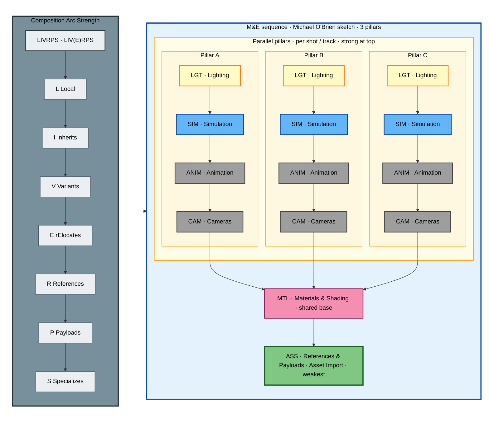

#### Sketch 2

Sequence-wide **SIM** and **LGT** are defined once (shared bands). Each **shot pillar** stacks on that foundation; per-shot **LGT/SIM** override the global layers.

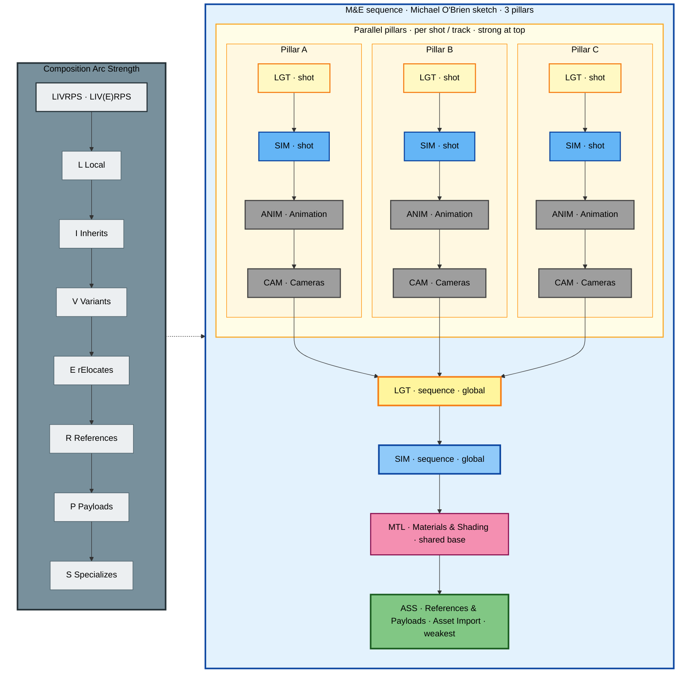

**Advantages**

- Matches how VFX artists think: **light last, assets first**
- **Three pillars** express multi-shot / NLE-track work without flattening into one misleading linear stack
- **Sketch 2** separates sequence-wide SIM/LGT defaults from per-shot refinement
- SIM above ANIM matches physical sim pipelines (cloth, hair, FX take anim as input)
- Shared MAT+ASS base keeps lookdev and asset import consistent across pillars
- Thin conceptual model — easy to teach once single-shot vs multi-pillar views are separated

**Disadvantages**

- No standard names or file layout — every studio implements differently
- No slot for **runtime/digital-twin data** (OPC UA, MQTT, PLM)
- **CAM below ANIM** conflicts with layouts that lock cameras early (previz, twin monitoring views)
- Combines **environment lighting** and **shot lighting** in one LGT bucket

---

## 2. ASWF / USD Working Group — Asset Timeline Principle

**Source:** [Guidelines for Structuring USD Assets](https://github.com/usd-wg/assets/blob/main/docs/asset-structure-guidelines.md) · [ASWF Wiki](https://lf-aswf.atlassian.net/wiki/spaces/WGUSD/pages/11273723/Guidelines+for+Structuring+USD+Assets)

**What it says:** Layer order follows **workflow timeline** — later contributors override earlier ones. Explicit quote:

> *“…geometry is at the bottom, then materials. And is why **lighting is usually one of the last layers** to contribute to USD assets/shots.”*

**Typical asset contribution order (weak → strong / bottom → top):**

| Bottom (weak) | → | Top (strong) |
|---------------|---|--------------|
| Geometry (payload) | Materials | Rigging / FX / … | **Lighting** |

Layers are often **referenced into payload**, not only sublayered — ASWF recommends referencing for predictable LIV(E)RPS “R” strength.

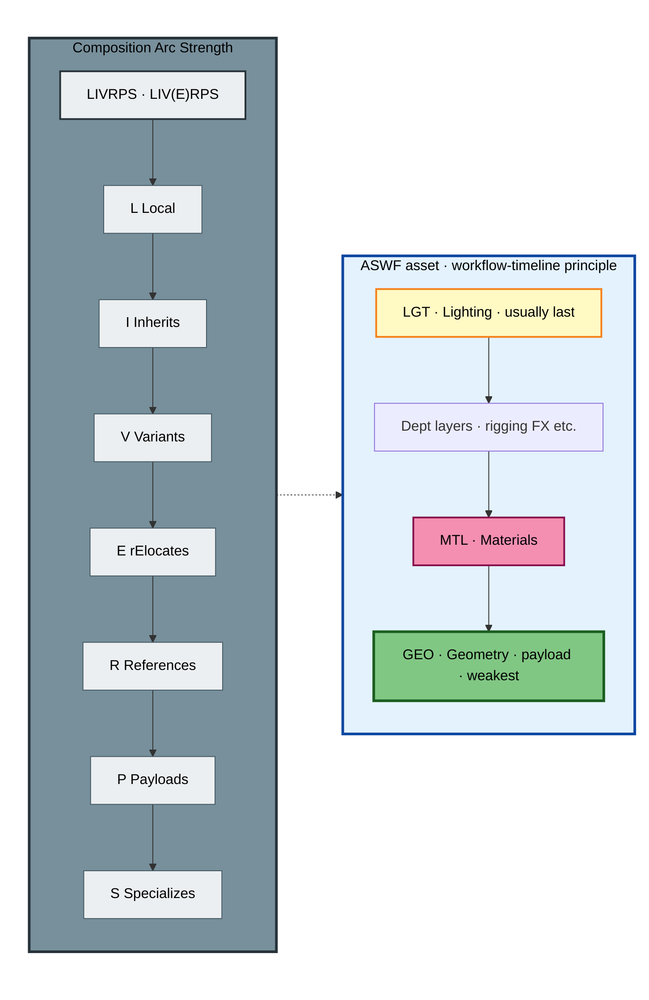

**Advantages**

- Industry-neutral, ASWF-backed starting point
- Explains **why** order matters, not just **what** to name layers
- Applies to **assets** and **shots**
- Encourages payloads + references — good for performance

**Disadvantages**

- **Not a fixed layer list** — “rigging, FX, etc.” is intentionally vague
- Per-asset vs per-shot stacking still requires studio decisions
- Does not address Omniverse live/session layers or digital-twin data feeds

---

## 3. SideFX Houdini — Shot Sublayer Example

**Source:** [Sublayer LOP documentation](https://www.sidefx.com/docs/houdini20.5/nodes/lop/sublayer.html)

Canonical teaching example for **shot-level** sublayers:

```usda
subLayers = [
    @shotLighting.usd@,
    @shotFX.usd@,
    @shotAnimation.usd@,
    @shotSetDressing.usd@,
    @sequence.usd@
]
```

**Order (strong → weak):** Lighting → FX → Animation → Set dressing → Sequence

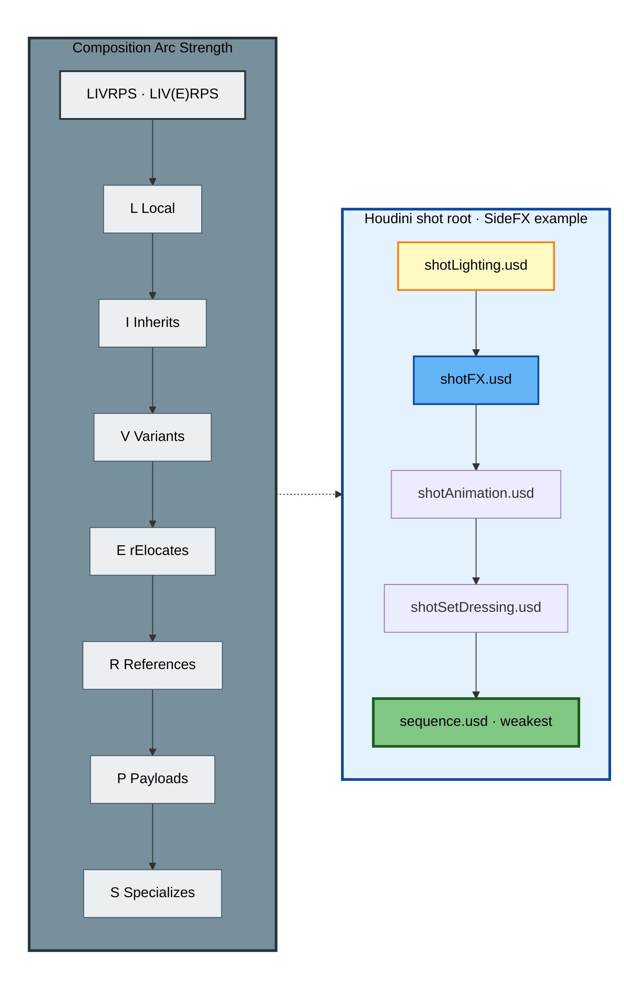

**Advantages**

- **Concrete, copy-paste** shot stack from a major DCC
- Separates **FX** from **ANIM** explicitly (Michael's SIM slot)
- **Sequence** at bottom preserves seq-wide layout as weak base
- Documents sublayer **replacement/reorder** in LOP networks

**Disadvantages**

- VFX-specific — no materials layer in this minimal example (often on assets)
- No camera layer called out
- Assumes Houdini LOP “strongest empty root” authoring model

---

## 4. Pixar — SIGGRAPH 2019 Composition (Teaching Shot)

**Source:** [USD Composition — SIGGRAPH 2019 (PDF)](https://openusd.org/files/Siggraph2019_USD%20Composition.pdf)

Pixar's teaching example uses `shot.usd` with sublayers such as **`shot_layout.usd`** and **`shot_sets.usd`**. It demonstrates **merge + override**, not a full department stack:

- Layout positions characters and sets
- Stronger layers (root or earlier sublayers) **non-destructively override** layout transforms
- **LIV(E)RPS** introduced as the cross-arc strength rubric

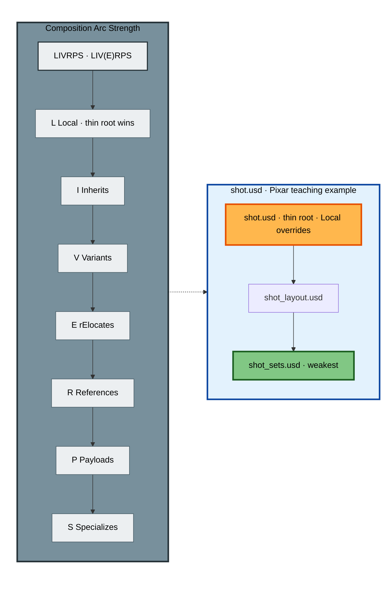

**Advantages**

- **Authoritative** on composition mechanics (layer stack, strength, non-destructive override)
- Shows why **root must stay thin**
- Foundation for all other conventions

**Disadvantages**

- **Does not prescribe** LGT / ANIM / SIM ordering
- Shot examples are simplified vs real Presto pipelines
- PDF age — rElocates now in LIV(E)RPS spec

---

## 5. NVIDIA Omniverse — Explorer / Conductor Stage Layers

**Source:** [Omniverse Layers Extension](https://docs.omniverse.nvidia.com/extensions/latest/ext_core/ext_layers.html) · [Data Aggregation Best Practices](https://docs.omniverse.nvidia.com/usd/latest/learn-openusd/independent/best-practices.html)

Omniverse documents **named stage layers** for digital-twin / conductor workflows. UI stacks layers **bottom-up**: higher in the panel = **stronger**.

**Documented work layers (typical strength high → low):**

| Strong | → | Weak |
|--------|---|------|
| Animation | Layout | Material | Lighting | Camera | Simulation | **Assets** |

Plus: Session layer (strongest during live edit), thin ROOT, optional Locked / Markup / Waypoint layers.

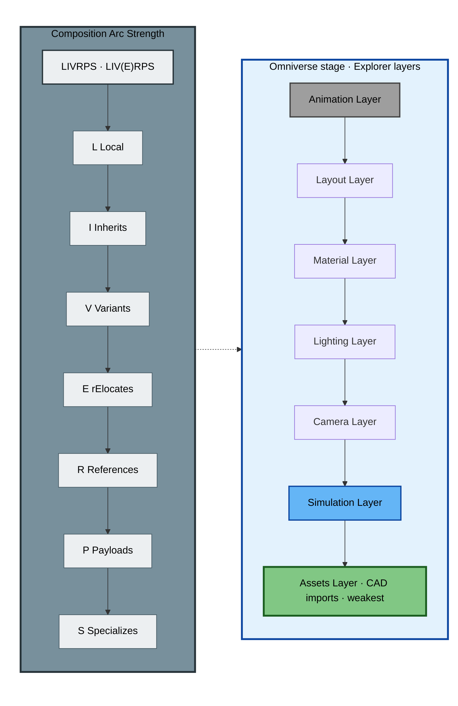

**Advantages**

- **Closest public doc** to USD GoodStart / digital-twin use cases
- Explicit **Assets layer** at bottom (like ASS_LYR)
- Session + live merge workflow documented
- Material vs Layout ordering explained for **edit protection**

**Disadvantages**

- Layer order in UI is **reorderable** — doc is guidance, not enforcement
- Material vs Layout strength notes can read contradictory without hands-on Kit experience
- VFX-style “LGT always on top” is **not** the Omniverse default narrative

---

## 6. NVIDIA DLI — Asset-Internal Layer Stack

**Source:** [NVIDIA Omniverse DLI workshop PDF](https://hprc.tamu.edu/files/events/workshops/NVIDIA_Omniverse%E2%80%93TAMU_HPRC_DLI_Session.pdf)

Training materials show **per-asset** data layer stacks (not shot roots):

**Order (strong → weak):** FX → Rigging → Shading → **Geometry**

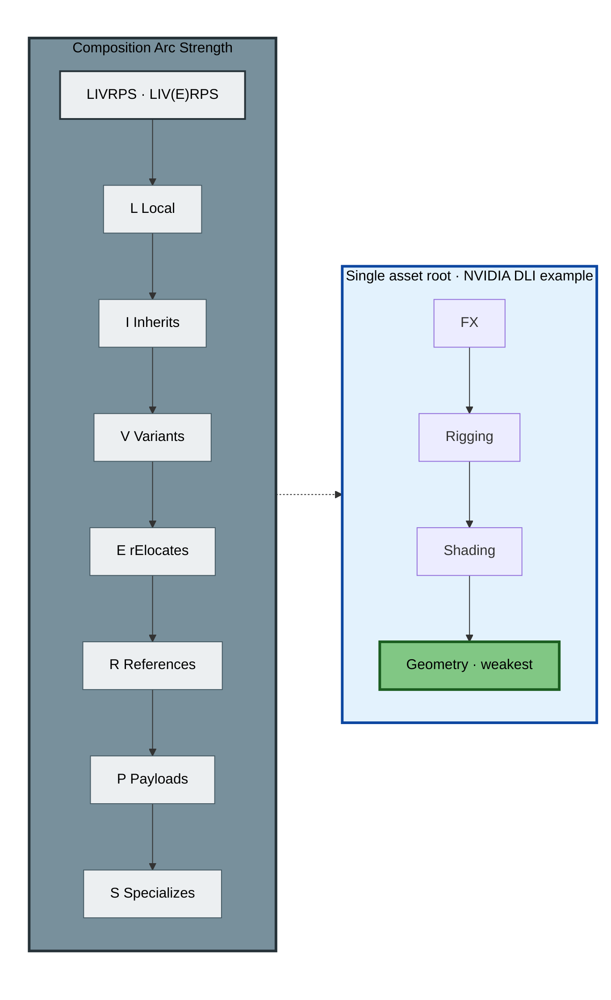

**Advantages**

- Clear **geometry-at-bottom** rule for assets
- Matches ASWF timeline principle at asset granularity
- Good for explaining payload + department references

**Disadvantages**

- **Asset-scoped**, not shot-scoped — different problem than Michael's sketch
- Not tied to Omniverse Explorer layer names 1:1

---

## 7. openusd.work — Minimal Three-Layer Shot

**Source:** [openusd.work — Production Shot Assembly](https://openusd.work/)

Teaching shorthand:

```usda
subLayers = [
    @./layers/lighting.usd@,
    @./layers/animation.usd@,
    @./layers/layout.usd@
]
```

**Order (strong → weak):** Lighting → Animation → Layout

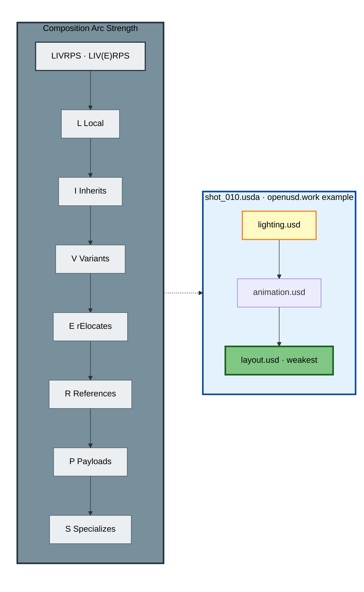

**Advantages**

- Minimal teaching stack — easy entry point
- **LGT on top** aligns with Michael and SideFX
- Includes payload/reference patterns in same article

**Disadvantages**

- Community/educational site — **not** Pixar/ASWF normative
- No FX/SIM/CAM/MTL slots

---

## 8. USD GoodStart — Digital Twin + Omniverse Template

**Source:** [USD_GoodStart README](../README.md) · this repo's `USD_GoodStart_ROOT.usda`

**Order (strong → weak):** OPIN → CAM → ENV → RUNTIME → SIM → DATA → ACTGR → ANIM → VAR → MTL → PHY → **ASS**

Full diagram (folder structure + layer stack) lives in the README:

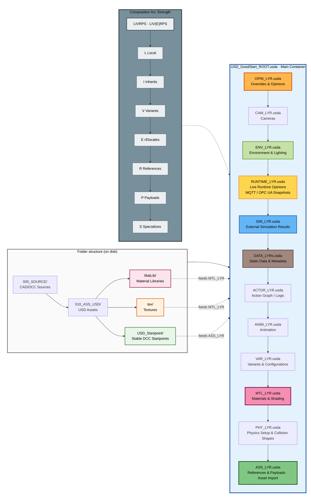

**Advantages**

- **ASS at bottom** — agrees with Michael, ASWF, Omniverse Assets layer
- **RUNTIME layer** for live/session-backed operational state and explicit MQTT/OPC UA snapshots
- **DATA layer** for static or slow-changing PLM, ERP, AAS, OPC UA mappings, CAD/Revit metadata, and identifiers
- **SIM above ANIM** — agrees with Michael's sim-over-anim rule
- **OPIN on top** — explicit override layer for reviews and emergencies
- Documented folder ↔ layer feed paths (Startpoint → ASS, MatLib/tex → MTL)
- Validation scripts and README per folder

**Disadvantages**

- **CAM high in stack** — opposite of Michael's “CAM below ANIM”
- **ENV mid-stack** — merges environment + lighting unlike dedicated top LGT
- **PHY vs SIM vs RUNTIME** split may confuse Isaac/Ansys/IoT users if the project does not document which layer owns setup, result overlays, and live latest-value state
- **Beta / not fully hardened** — order not battle-tested across all Omniverse Kit versions
- More layers than minimal stacks — higher authoring discipline required

---

## 9. NVIDIA Learn OpenUSD — Skyscraper exercise (shading over geometry)

**Source:** [Working with Sublayers](https://docs.nvidia.com/learn-openusd/latest/creating-composition-arcs/sublayers/working-with-sublayers.html) · [Value Resolution](https://docs.nvidia.com/learn-openusd/latest/beyond-basics/value-resolution.html)

**Pattern:** Two workstreams (`geometry.usd`, `shading.usd`) merged at a shot/building root. Teaching code lists **shading first** (stronger), **geometry second** (weaker):

```python
root_layer.subLayerPaths.append("./contents/shading.usd")
root_layer.subLayerPaths.append("./contents/geometry.usd")
```

**Why:** Material bindings and lookdev must **override** base geometry without editing the geo file — same principle as ASWF “materials above geometry,” but expressed as **sublayer order** instead of asset payload references.

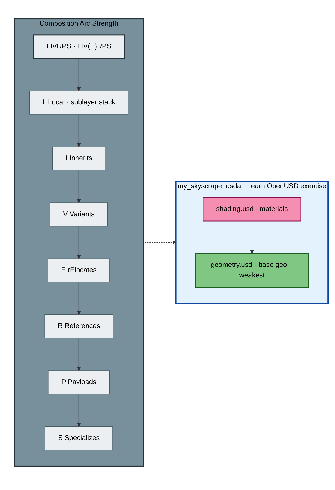

**Advantages:** Clear teaching example; separates workstreams; matches “lookdev wins over model” in practice.

**Disadvantages:** Not a full shot stack (no anim/light/cam); easy to mis-read if you assume geometry should always be listed first in code.

---

## 10. NVIDIA da Vinci Workshop — delta layers (film production sample)

**Source:** [da Vinci’s Workshop — Omniverse USD](https://docs.omniverse.nvidia.com/usd/latest/usd_content_samples/davinci_workshop.html)

**Pattern:** Shot/sequence `_base.usd` aggregates **`pub/*/_delta.usda`** contributions in **production-process order**. Diagram is **strength order** — read **chronologically from the bottom**.

**Shot stack (strong → weak):**

| # | Delta layer | Role |
|---|-------------|------|
| 1 | **OVERRIDE** | Emergency / review overrides (rare; strongest) |
| 2 | **finish** | Look, lighting, material tweaks, sky, audio, final notes |
| 3 | **anim** | Deformation / transform caches |
| 4 | **camera** | Shot camera |
| 5 | **assembly** | Asset references + layout (weakest base) |

**Inside `finish`:** `_finish_light.usd`, `_finish_material.usd`, `_finish_sky.usd`, etc. — **lighting and material passes grouped**, similar in spirit to Michael’s top **LGT** + **MTL**, but as nested composition, not only sublayer names.

**Assets** use **references + payloads** at the asset interface (`.usd`), with contributions under `pub/geometry`, `pub/material`, `pub/rig` — **not** one flat sublayer list per mesh.

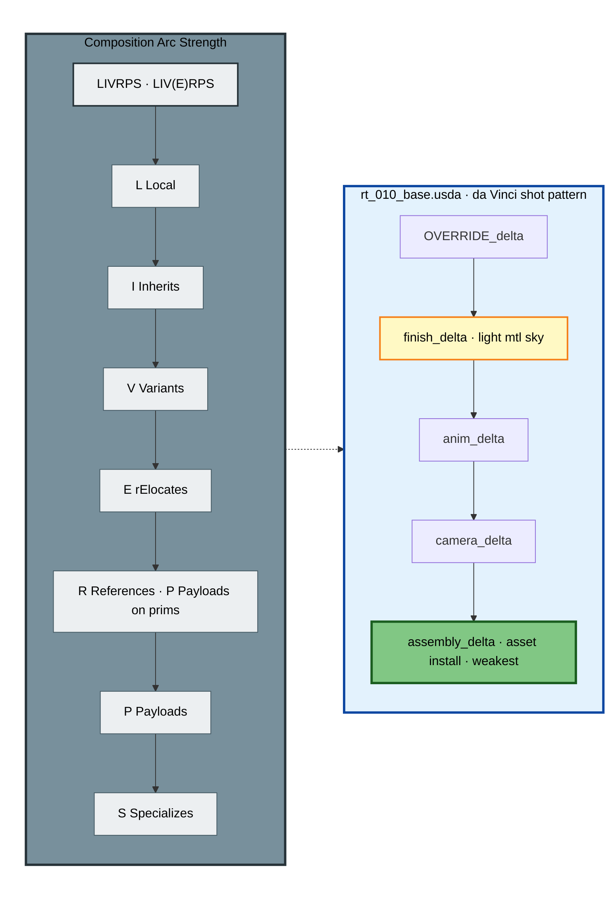

**Advantages:** Production-scale NVIDIA sample; combines sublayers **and** references/payloads/variants; documents OVERRIDE + finish passes; aligns with Michael on **assembly at bottom**, **look/light high**.

**Disadvantages:** Complex nested files; not a minimal template; **camera above anim** here (opposite Michael’s CAM-below-ANIM sketch).

---

## 11. Remedy — Book of USD / per-asset layer stack (games)

**Source:** [Layer Stack — USDBook](https://remedy-entertainment.github.io/USDBook/terminology/layer_stacks.html)

**Pattern:** A single asset root (`furniture_workbench01.usda`) sublayers **modelling → surfacing → rigging**. The layer’s **own opinions sit above all sublayers** (strongest).

**Interpretation:** Department contributions stack on the asset; **surfacing/rigging must override modelling** for materials and skeleton data — same override intent as Learn OpenUSD’s shading-over-geometry, extended to rigging.

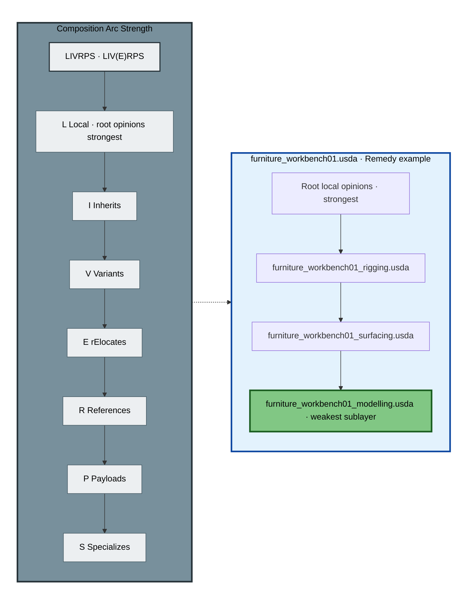

**Advantages:** Shows **asset-scoped** stacks (not shot roots); reminds that root local edits beat sublayers.

**Disadvantages:** Does not spell `subLayerPaths` order explicitly; games-centric; must validate order against your DCC export tooling.

---

## 12. Luca Scheller — USD Survival Guide (VFX / Houdini)

**Source:** [Composition Strength Ordering (LIVRPS)](https://lucascheller.github.io/VFX-UsdSurvivalGuide/pages/core/composition/livrps.html) · SIGGRAPH 2023 Houdini Hive

**Pattern — architectural rules, not one fixed stack:**

| Mechanism | Use for | Avoid for |
|-----------|---------|-----------|
| **Sublayers** | Stage / shot **root layer stack**; department-sized USD files in shared namespace | Loading all heavy shot geometry |
| **References** | Modular assets, material libraries, shot assembly | — |
| **Payloads** | Heavy renderable geometry, lazy load | — |
| **Inherits** | Instanceable overrides across many referenced assets | — |

**Houdini LOP mental model:** LOP networks author into the **strongest new sublayer** on a mostly empty root — aligns with SideFX shot example (§3).

**Advantages:** Production-hardened VFX framing; explicit “**heavy lifting via R/P, not sublayers**”; matches GoodStart **ASS_LYR uses references/payloads**.

**Disadvantages:** Does not prescribe LGT vs ANIM ordering; Houdini-specific authoring flow.

---

## 13. ASWF — reference-first asset contributions

**Source:** [ASWF asset structure guidelines](https://github.com/usd-wg/assets/blob/main/docs/asset-structure-guidelines.md)

**Pattern:** Department layers on a component are **referenced or sublayered** into the asset root; ASWF **prefers referencing** because each file enters as **R** in LIV(E)RPS — predictable strength vs arbitrary sublayer merge order.

**Timeline principle (unchanged):** geometry **weak**, materials next, **lighting usually last** — often implemented as **payload + referenced contribution files**, not necessarily six named shot sublayers.

**Advantages:** Interoperability focus; separates **asset structure** from **shot structure**; underpins AOUSD IEDT / GoodStart comparison work.

**Disadvantages:** Leaves shot-level ordering to each studio; no standard layer filenames.

---

## 14. Omniverse — session & live layers (strongest of all)

**Source:** [Omniverse Layers Extension](https://docs.omniverse.nvidia.com/extensions/latest/ext_core/ext_layers.html)

**Pattern:** During live collaboration, **Session layer** (and temporary Live Session sublayers) sit **above** persistent ROOT — strongest opinions in the stack UI. Merge workflow promotes deltas into named persistent layers (Layout, Material, etc.).

**Stack context (persistent work below session):** see §5 — Animation / Layout / Material / … / Assets.

**Advantages:** Explains Omniverse-specific “why did my edit win?”; critical for digital twin ops rooms.

**Disadvantages:** Session semantics differ from plain USDA on disk; easy to pollute ROOT if merges go to wrong target.

---

## Cross-source synthesis — needs vs typical pattern

| Need / domain | Sublayer stack? | R/P on prims? | Typical strong→weak theme | Primary sources |
|---------------|-----------------|---------------|---------------------------|-----------------|
| **VFX shot finishing** | Yes — dept USD files | Assets referenced from weak assembly/layout layer | LGT/FX/finish high; layout/seq low | Michael M&E, SideFX, openusd.work, da Vinci |
| **Lookdev over model (same namespace)** | Yes — shading above geometry | Optional | Materials strong, geo weak | Learn OpenUSD skyscraper, ASWF timeline |
| **Published assets** | Sometimes | **Preferred** — geo in payload | Geo weak; surf/rig/light later | ASWF, da Vinci assets, Remedy |
| **Heavy CAD / twin plant** | Thin root + dept layers | **Payloads** in ASS/base layer | Twin data & sim override anim; assets at bottom | GoodStart, Omniverse, Survival Guide |
| **Teaching mechanics only** | Minimal 2-layer examples | Demonstrate separately | Override demo | Pixar SIGGRAPH 2019 |
| **Live multi-user** | Persistent layers + **session** on top | Same as above | Session strongest | Omniverse Layers Extension |
| **Houdini / Solaris** | LOP-generated sublayer stack | Payloads per shot asset | Lighting → FX → Anim → … | SideFX LOP docs, Survival Guide |

### LIV(E)RPS handling — source comparison

| Source | How LIV(E)RPS is taught | Sublayers vs R/P |
|--------|-------------------------|------------------|
| [Pixar glossary](https://openusd.org/release/glossary.html) | L = Local prim specs in layer stack order | subLayers arc merges whole layers |
| [Learn OpenUSD LIVERPS module](https://docs.nvidia.com/learn-openusd/latest/creating-composition-arcs/strength-ordering/what-is-liverps.html) | L includes ordered sublayer stack; adds **E** rElocates → **LIVERPS** | Same |
| [USD Survival Guide](https://lucascheller.github.io/VFX-UsdSurvivalGuide/pages/core/composition/livrps.html) | L + sublayers for stage stack; R/P for assets | **Do not** load all geo via sublayers |
| [Omniverse USD Book (community)](https://omniverseusd.github.io/chapter3/composition_arcs.html) | “Local (and Sublayers)” first in search order | Photoshop analogy for sublayers |
| **GoodStart** | LIV(E)RPS for arc conflicts; **subLayers** for dept order | **ASS_LYR** = References + Payloads only |

---

## Master Comparison Table

**Strongest → weakest (top → bottom).** ✓ = aligned with Michael's M&E sketch; ✗ = deliberate difference; ~ = partial.

| Layer role | Michael M&E | SideFX shot | da Vinci shot | Learn OpenUSD | Omniverse stage | GoodStart |
|------------|-------------|-------------|---------------|---------------|-----------------|-----------|
| Overrides / review | — | — | **OVERRIDE** | — | Session / Markup | **OPIN** ✓ |
| Lighting / finish | **LGT** (top) ✓ | **LGT** (top) ✓ | **finish** (top) ✓ | — | LGT (mid) | ENV (mid) ~ |
| Simulation | **SIM** ✓ | FX ✓ | (in anim/finish) | — | Simulation | **SIM** ✓ |
| Animation | **ANIM** ✓ | **ANIM** ✓ | **anim** ✓ | — | Animation (top) | ANIM ✓ |
| Camera | **CAM** (below anim) | — | **camera** (above assembly) | — | Camera | **CAM** (high) ✗ |
| Materials | **MTL** ✓ | (on assets) | **finish/material** ✓ | **shading** (strong) ✓ | Material | **MTL** ✓ |
| Runtime latest-value state | — | — | — | — | Session / live edits | **RUNTIME** |
| Static twin metadata / identifiers | — | — | — | — | — | **DATA** |
| Assets / layout base | **ASS** (bottom) ✓ | sequence (base) | **assembly** (bottom) ✓ | **geometry** (weak) ✓ | **Assets** (bottom) ✓ | **ASS** (bottom) ✓ |

---

## Choosing an Approach — Decision Guide

| If your priority is… | Lean toward… |
|----------------------|--------------|
| Feature-film shot finishing | Michael M&E / SideFX / da Vinci / openusd.work (finish/LGT high, assembly low) |
| Lookdev merging with layout geo | Learn OpenUSD pattern — **shading sublayer above geometry sublayer** |
| Published asset interchange | ASWF + da Vinci asset interface — **references/payloads**, geo in payload |
| Omniverse conductor / factory twin | Omniverse Explorer layers + **GoodStart** (`RUNTIME_LYR` or session layer for live/latest-value state; `DATA_LYRs` for static metadata) |
| Houdini / Solaris production | SideFX LOP stack + **USD Survival Guide** (R/P for assets) |
| Teaching composition mechanics only | Pixar SIGGRAPH 2019 PDF + Learn OpenUSD sublayer exercises |
| Minimal layer count | openusd.work 3-layer shot |
| Live multi-user + session merges | Omniverse Layers Extension session workflow |

**Hybrid pattern (common in practice):** Keep **ASS (or Assets) at the bottom** and **departmental overrides above** — universal. Debate is *which* departments sit above animation and whether cameras/lighting are split or combined.

---

## OpenUSD Learning & Ecosystem Resources

Curated links for **deeper context** on composition, layers, and pipeline design — useful alongside the layer-order comparison above. Grouped by role; not an exhaustive list ([Awesome OpenUSD](https://github.com/matiascodesal/awesome-openusd) remains the best meta-index).

### Official & standards

| Resource | URL |
|----------|-----|
| **Alliance for OpenUSD (AOUSD)** | https://aousd.org/ |
| AOUSD Core Specification 1.0 announcement | https://aousd.org/blog/foundations-of-open-3d-development-introducing-aousd-core-specification-1-0/ |
| **OpenUSD — Pixar documentation hub** | https://openusd.org/ |
| Introduction to USD (26.x docs) | https://openusd.org/release/intro.html |
| USD Terms & Concepts (LayerStack, LIV(E)RPS) | https://openusd.org/release/glossary.html |

### NVIDIA — Learn OpenUSD & Omniverse

| Resource | URL |
|----------|-----|
| **Learn OpenUSD** (updated learning path) | https://docs.nvidia.com/learn-openusd/latest/index.html |
| Learn OpenUSD — source repo | https://github.com/NVIDIA-Omniverse/LearnOpenUSD/tree/main |
| NVIDIA OpenUSD learning path | https://www.nvidia.com/en-us/learn/learning-path/openusd/ |
| OpenUSD on-demand sessions (NVIDIA) | https://www.nvidia.com/en-us/on-demand/search/?facet.mimetype[]=event%20session&layout=list&page=1&q=OpenUSD&sort=date&sortDir=desc |
| What Is OpenUSD? (NVIDIA Glossary) | https://www.nvidia.com/en-us/glossary/openusd/ |
| OpenUSD code samples (Omniverse Developer Guide) | https://docs.omniverse.nvidia.com/dev-guide/latest/programmer_ref/usd/usd.html |
| Omniverse Kit — modules overview | https://docs.omniverse.nvidia.com/kit/docs/kit-manual/latest/guide/modules.html |
| Data aggregation best practices | https://docs.omniverse.nvidia.com/usd/latest/learn-openusd/independent/best-practices.html |
| OpenUSD Development Certification — study guide (community) | https://medium.com/@chaubenz/your-complete-guide-to-passing-the-nvidia-certified-professional-openusd-development-b129777b0ed6 |
| Learn OpenUSD community highlight (LinkedIn) | https://www.linkedin.com/posts/austin-hwang18_learn-openusd-activity-7351753987999559680-1YW_/ |

### Books, courses & practical guides

| Resource | URL |
|----------|-----|
| **OpenUSD in One Weekend** (Zhang, Green, Zhao) | https://learn-usd.github.io/ |
| **USD Survival Guide** (Luca Scheller) | https://lucascheller.github.io/VFX-UsdSurvivalGuide/ |
| Cave Academy — Introduction to OpenUSD (2025) | https://caveacademy.com/courses/introduction-to-openusd-2025/ |
| **Jan Haluszka — OpenUSD tutorials** | https://haluszka.com/#tutorials |

### Community & meta-lists

| Resource | URL |
|----------|-----|
| **Awesome OpenUSD** (Matias Codesal) | https://github.com/matiascodesal/awesome-openusd |
| ASWF USD Working Group — asset guidelines | https://github.com/usd-wg/assets/blob/main/docs/asset-structure-guidelines.md |
| OpenUSD Study Group (Discord — see NVIDIA Learn OpenUSD “First Steps”) | https://docs.nvidia.com/learn-openusd/latest/first-steps/first-steps.html |

### This project

| Resource | URL |
|----------|-----|
| **USD GoodStart** (this repo) | https://github.com/jph2/USD_GoodStart |
| Layer order comparison (this document) | [LAYER_ORDER_REFERENCES_RESEARCH.md](./LAYER_ORDER_REFERENCES_RESEARCH.md) |
| USD GoodStart README | [../README.md](../README.md) |

---

## Canonical Reference Links

| Topic | URL |
|-------|-----|
| Sublayers (strength order) | https://docs.nvidia.com/learn-openusd/latest/creating-composition-arcs/sublayers/what-are-sublayers.html |
| LIV(E)RPS / strength ordering | https://docs.nvidia.com/learn-openusd/latest/composition-basics/strength-ordering.html |
| OpenUSD glossary — LayerStack, LIVERPS | https://openusd.org/release/glossary.html |
| Pixar SIGGRAPH 2019 Composition | https://openusd.org/files/Siggraph2019_USD%20Composition.pdf |
| ASWF asset structure guidelines | https://github.com/usd-wg/assets/blob/main/docs/asset-structure-guidelines.md |
| SideFX Sublayer LOP | https://www.sidefx.com/docs/houdini20.5/nodes/lop/sublayer.html |
| Omniverse Layers Extension | https://docs.omniverse.nvidia.com/extensions/latest/ext_core/ext_layers.html |
| Omniverse data aggregation BP | https://docs.omniverse.nvidia.com/usd/latest/learn-openusd/independent/best-practices.html |
| da Vinci’s Workshop (NVIDIA sample) | https://docs.omniverse.nvidia.com/usd/latest/usd_content_samples/davinci_workshop.html |
| Learn OpenUSD — sublayer exercise | https://docs.nvidia.com/learn-openusd/latest/creating-composition-arcs/sublayers/working-with-sublayers.html |
| Learn OpenUSD — LIVERPS | https://docs.nvidia.com/learn-openusd/latest/creating-composition-arcs/strength-ordering/what-is-liverps.html |
| USD Survival Guide — LIVRPS | https://lucascheller.github.io/VFX-UsdSurvivalGuide/pages/core/composition/livrps.html |
| Remedy USDBook — layer stacks | https://remedy-entertainment.github.io/USDBook/terminology/layer_stacks.html |
| OpenUSD in One Weekend | https://learn-usd.github.io/ |
| openusd.work shot example | https://openusd.work/ |
| USD GoodStart README | ../README.md |

---

## Slack Reply Snippet (copy-paste)

> There isn’t one official OpenUSD layer-order spec — Pixar/ASWF/NVIDIA document the **mechanism** (first sublayer = strongest, thin root, LIV(E)RPS). Each pipeline picks order by workflow.
>
> **Public refs:** ASWF asset guidelines (geo bottom, lighting usually last), SideFX shot example (LGT→FX→ANIM→set dress→seq), Pixar SIGGRAPH 2019 composition PDF, Omniverse Layers Extension (Assets weakest), plus our comparison doc: `WIP_Docs/LAYER_ORDER_REFERENCES_RESEARCH.md`.
>
> Your M&E sketches: (1) three LGT→SIM→ANIM→CAM pillars on shared MAT+ASS; (2) global SIM+LGT with shot pillars on top. Collapsed to one shot that's LGT→SIM→ANIM→CAM→MTL→ASS. GoodStart diverges on purpose for digital twin (RUNTIME, DATA, ACTGR, CAM high) but keeps ASS at the bottom and SIM above ANIM.

---

## Revision History

| Version | Date | Notes |
|---------|------|-------|
| 1.0.0 | 2026-06-10 | Initial research doc from Slack thread with Michael O'Brien |
| 1.0.1 | 2026-06-10 | Added OpenUSD Learning & Ecosystem Resources link collection |
| 1.1.0 | 2026-06-10 | Added Learn OpenUSD, da Vinci, Remedy, Survival Guide, ASWF reference-first, session layers; LIV(E)RPS two-axis synthesis |
| 1.1.1 | 2026-06-10 | Michael §1 Mermaid: three parallel pillars (LGT→SIM→ANIM→CAM) on shared MAT+ASS base; USD realization notes |
| 1.1.2 | 2026-06-10 | Michael §1: Sketch 2 (global SIM/LGT + shots on top); padding via spacer nodes + subGraphTitleMargin |
| 1.1.3 | 2026-06-10 | Restore in-diagram subgraph titles (M&E sequence / Parallel pillars) with extra header spacing |
| 1.1.4 | 2026-06-10 | Michael diagrams: visible header nodes (SeqHdr/PillarHdr); PadLeft/PadRight centering; remove left-only spacers |
| 1.1.5 | 2026-06-10 | Revert Michael §1 Mermaid to simple nested subgraph titles (Screenshot-2 layout); drop spacer/header-node experiments |
| 1.1.6 | 2026-06-10 | Unify full LIV(E)RPS sidebar (L→S) in all comparison Mermaid diagrams §2–§11 |
| 1.1.7 | 2026-06-26 | Update USD GoodStart to explicit `RUNTIME_LYR` split: live/session-backed telemetry and snapshots are separate from static `DATA_LYRs` metadata/identifier layers |
