**Version:** 0.9.5-beta  
**Last Updated:** 12.12.2025

**Please NOTE this is a WIP document, some chapters only exist as headlines and bulletpoints**


# OpenUSD Best Practices Guide (Maximum Detail Edition)

## Chapter 0: Prerequisites and Setup

Before diving into OpenUSD development and digital twin workflows, ensure you have the necessary software, tools, and environment configured. This chapter covers the foundational requirements for working with USD GoodStart and OpenUSD in general.

### 0.1 Required Software

#### Omniverse Kit/App
- **Omniverse Composer**: Recommended version: Latest stable
- **Omniverse Kit SDK**: For extension development
- **Download**: [NVIDIA Omniverse](https://www.nvidia.com/en-us/omniverse/) and [kit-app-template](https://github.com/NVIDIA-Omniverse/kit-app-template)

#### Python Environment
- **Python**: 3.8+ (Python 3.10+ recommended)
- **USD Core**: `pip install usd-core` - Python bindings for USD
- **Additional packages**: May be required for CAD conversion

#### USD Tools
- **USD Python API** (`usd-core` from PyPI): Python bindings for USD
- **usdview**: Classic USD validation and inspection tool from Pixar
  - Essential for validating USD files and checking structure
  - Inspect prims, attributes, relationships, and composition
  - Visualize USD scenes and debug composition issues
  - Always helpful for USD file validation and troubleshooting
  - Part of the official OpenUSD repository
- **USD C++ SDK**: Optional for advanced development and custom plugins

### 0.2 CAD Tools (Optional, for CAD-to-USD workflows)

#### CAD Software
- CATIA, SolidWorks, Autodesk Inventor, Rhino 3D, or similar
- STEP file support for intermediate conversion

#### CAD Conversion Tools
- **NVIDIA Omniverse CAD Converter Extension**: Recommended production solution
  - Built-in CAD converter within Omniverse Kit apps and Composer
  - Supports common CAD formats (STEP, IGES, etc.) directly to USD
  - Works from content browser with context menu option
  - Actively maintained and optimized for Omniverse workflows
  - Official documentation: [CAD Converter Manual](https://docs.omniverse.nvidia.com/extensions/latest/ext_cad-converter/manual.html)
- **CAD-to-OpenUSD**: Open-source conversion scripts (Work in Progress, November 2024)
  - Useful for custom pipeline development
  - Requires development effort for production use
- **NVIDIA Omniverse Connectors**: Production-ready connectors for:
  - Autodesk 3ds Max, Maya, Revit, Inventor
  - SolidWorks, Siemens NX, CATIA
  - Blender, Unreal Engine, Unity
  - And many more CAD/DCC tools
- **OpenUSD Exchange SDK**: SDK for building custom USD I/O plugins and converters
  - For pipeline-specific requirements
  - Requires development using USD SDK and CAD SDKs (OpenCASCADE, FreeCAD, or commercial CAD SDKs)
- **CAD Vendor Native Exporters**: Many CAD vendors provide native USD export capabilities
- **STEP Intermediate Format**: Use STEP files as a stable intermediate format for CAD conversion workflows

### 0.3 DCC Tools (Optional, for content creation)

#### 3D Software
- **Houdini** (`.hiplc` files): Full USD support with layering and referencing
- **Maya** (`.ma`/`.mb` files): Full USD support with layering and referencing
- **3ds Max**: Full USD support with layering and referencing
- **Blender** (USD export support): Limited: Read/write only, no layering/referencing
- **Cinema 4D**: Limited: Read/write only, no layering/referencing

### 0.4 DCC Tool Limitations for USD Workflows

Some DCC tools have significant limitations when working with USD:

#### Blender, Cinema 4D, and Similar Tools:
- ✅ Can read and write USD files (`.usd`, `.usda`, `.usdc`, `.usdz` formats)
- ❌ Do NOT support USD's core composition features:
  - No layering support (cannot work with sublayers)
  - No referencing support (cannot create or maintain references)
  - No composition arcs (LIV(E)RPS) support
  - No non-destructive workflows
- ⚠️ Work destructively - These tools modify USD files directly without preserving composition structure
- 📍 Use case: Can only be used to create "endpoint" assets (the lowest sublayer - the asset itself)
- ❌ Cannot be used for modifying layers on top of assets or working with USD's composition system

#### Why This Matters:
- The difference between exporting USD from Blender/C4D vs. exporting FBX/Alembic/OBJ is minimal - they're essentially export endpoints
- For USD workflows requiring layering, referencing, or non-destructive editing, use Maya, Houdini, or 3ds Max instead
- Blender/C4D are suitable for creating base assets but cannot participate in USD's composition workflows

#### Recommendation:
- Use Maya, Houdini, or 3ds Max for USD workflows requiring:
  - Layer-based modifications
  - Asset referencing
  - Non-destructive editing
  - Composition arcs (variants, payloads, inherits, etc.)
- Use Blender/C4D only for creating final export assets that will be referenced by other USD files

### 0.5 Houdini: The Powerhouse for USD Pipeline Automation

Houdini stands out as the premier tool for USD pipeline development and automation, offering capabilities that complement and extend beyond what Omniverse provides.

#### Why Houdini is Essential for USD Workflows:

- 🎯 **Best USD Integration**: Houdini has the deepest and most comprehensive USD integration apart from Omniverse itself. It provides native, first-class support for all USD composition arcs and features.

- 🎨 **Visual Variant Creation**: Building variants in Houdini is visually cleaner and more intuitive than creating them directly in Omniverse. Houdini's node-based workflow makes variant management more accessible and maintainable.

- 🔄 **Reusable Workflows**: Once you build a workflow in Houdini, you can reuse it across projects. Houdini's procedural nature means you can create templates, tools, and pipelines that scale with your needs.

- 🤖 **Pipeline Automation**: Houdini's procedural nature makes it an excellent automation tool for building pipelines. You can run USD files through Houdini workflows to automate repetitive tasks, batch processing, and complex transformations.

- ✏️ **Geometry Modeling**: Unlike Omniverse, which cannot alter geometry, Houdini provides full modeling capabilities. You can model, sculpt, and modify geometry directly within USD workflows, making it essential for asset creation and refinement.

- ⚡ **Procedural Power**: Houdini's procedural nature is a killer feature for USD pipelines. You can:
  - Generate complex USD structures procedurally
  - Automate asset processing and transformation
  - Build reusable pipeline tools
  - Create dynamic, data-driven workflows
  - Process large batches of USD files efficiently

#### Use Cases:
- Creating and managing variants visually
- Building automated USD processing pipelines
- Geometry modeling and refinement within USD workflows
- Batch processing and transformation of USD assets
- Developing reusable pipeline tools and templates
- Complex procedural USD scene generation

#### Integration with USD GoodStart:
- Store Houdini files (`.hiplc`) in the project root
- Use Houdini to create variants, process assets, and automate workflows
- Export processed USD files to `010_ASS_USD/` for use in the scene
- Leverage Houdini's USD nodes for layer management and composition

#### Recommended Houdini USD Resources:
- **USD Survival Guide** by Luca Scheller: A practical onboarding guide to USD for software developers and pipeline TDs, with extensive Houdini examples and production workflows. Originally presented at Siggraph 2023.
- **Houdini USD Tutorial Collection**: Curated collection of Houdini USD tutorials and resources covering Solaris, LOPs, USD asset building, MaterialX, variants, and production workflows. Includes official SideFX documentation, YouTube tutorials, and practical guides.

### 0.6 Version Control: Why It Matters

Version control is essential for USD projects because it enables:
- **Collaboration**: Multiple team members can work on the same assets without conflicts
- **History tracking**: See what changed, when, and why
- **Rollback capability**: Safely revert to previous versions if something breaks
- **Clean reference paths**: No need for version numbers in file paths (e.g., `asset_v1.usd`, `asset_v2.usd`) - version control handles versioning automatically
- **Stable asset references**: USD references can point to stable paths like `@./010_ASS_USD/pump.usd@` without worrying about version numbers cluttering your scene structure

#### Why Clean Reference Paths Matter:
When using version control, your USD references should use stable, version-agnostic paths. Instead of:
```usda
# ❌ Bad: Version numbers in paths
def Xform "Pump" (
    references = @./010_ASS_USD/pump_v2.3.usd@
)
```

Use:
```usda
# ✅ Good: Clean, stable paths
def Xform "Pump" (
    references = @./010_ASS_USD/pump.usd@
)
```

Version control handles the versioning - you can always check out the specific version you need, and your USD files remain clean and maintainable.

#### Version Control Options:

| Solution | Best For | Integration | Key Features | Limitations |
|----------|----------|-------------|--------------|-------------|
| **Omniverse Nucleus** | **Omniverse-native workflows** | **Tightest integration** with Omniverse Kit/Apps | • **Live collaboration** - Real-time multi-user editing<br/>• **Checkpoints** - Immutable version snapshots<br/>• **USD-native** - Built specifically for USD workflows<br/>• **Branching support** - Parallel development (evolving)<br/>• **Direct DCC mounting** - Assets accessible in Omniverse/Unreal<br/>• **Centralized asset management** - Single source of truth | • Requires Nucleus Server setup<br/>• Omniverse ecosystem dependency<br/>• Less suitable for non-USD workflows |
| **Git + Git LFS** | **Open-source, flexible workflows** | Works with any tool | • **Industry standard** - Widely adopted<br/>• **Open source** - No vendor lock-in<br/>• **Branching & merging** - Full version control features<br/>• **Git LFS** - Handles large binary files<br/>• **CI/CD integration** - Automated workflows<br/>• **Standard VCS** - Can migrate between hosts | • Steeper learning curve<br/>• Requires technical knowledge<br/>• Binary file handling can be complex<br/>• No real-time collaboration |
| **Anchorpoint** | **Teams without version control** | Works with existing folder structure | • **Artist-friendly** - Simple two-button interface<br/>• **Git-based** - Built on Git/Git LFS<br/>• **No reorganization needed** - Works with existing folders<br/>• **File locking** - Prevents conflicts<br/>• **TB-scale support** - Handles large projects<br/>• **DCC integration** - Blender, Photoshop, Unity, Unreal | • Commercial tool<br/>• Not tested in this project<br/>• Requires Git server setup |
| **Diversion.dev** | **Game/3D pipelines, Unreal Engine** | Direct Unreal Engine plugin | • **Cloud-native** - Modern Git-like workflow<br/>• **Unreal integration** - Direct plugin for UE<br/>• **Easy setup** - Simple for small teams<br/>• **Fast uploads** - Optimized for large binaries<br/>• **Private workspaces** - Cloud syncs before commit | • Closed ecosystem - Vendor lock-in<br/>• Limited third-party integrations<br/>• Less mature than Git/Perforce |
| **Assembla** | **Enterprise compliance, hosted Perforce** | Git/SVN/Perforce repos | • **Enterprise compliance** - SOC 2, GDPR<br/>• **Hosted Perforce** - Only cloud Perforce service<br/>• **Mature ecosystem** - CI/CD, IDE integrations<br/>• **Multiple VCS** - Git, SVN, or Perforce<br/>• **Strong security** - Access controls, audit logs | • Traditional pull/push model<br/>• No real-time collaboration<br/>• Enterprise pricing<br/>• Manual import/export workflow |
| **PLM/PDM/ERP Systems** | **Established organizations** | Enterprise integration | • **Already in place** - No new system needed<br/>• **Product lifecycle management** - Full traceability<br/>• **Engineering data** - CAD/engineering integration<br/>• **Enterprise-grade** - Scalable and secure | • May not be USD-native<br/>• Integration complexity<br/>• May require custom connectors |

#### Omniverse Nucleus - Deep Integration:

Omniverse Nucleus is NVIDIA's version control and collaboration system specifically designed for USD workflows. It provides the **tightest integration** when working with Omniverse Kit applications:

- **Live Collaboration**: Multiple users can work simultaneously on the same USD stage with real-time updates
- **Checkpoints**: Create immutable snapshots of your work at any point, allowing safe rollback and version control
- **USD-Native**: Built from the ground up for USD, understanding composition arcs, layers, and references
- **Centralized Asset Management**: Single source of truth for all USD assets, ensuring consistency across projects
- **Seamless Integration**: Works directly with Omniverse Kit apps, Connectors, and extensions without additional setup

#### Anchorpoint - Artist-Friendly Git Solution:

Anchorpoint is a Git-based version control solution designed specifically for artists and creative teams. It's an excellent alternative to Nucleus for teams that want version control without committing to the Omniverse ecosystem:

- **Works with Your Existing Folder Structure**: Unlike Nucleus, Anchorpoint adds version control on top of your existing folder structure without requiring reorganization. This means you can version control assets in standard folders that any tool can access.

- **Universal Tool Access**: A major advantage over Nucleus - Tools like Photoshop, Substance Painter, and other DCC applications can directly access files in Anchorpoint-managed folders without special connectors or server mounting. This eliminates the complexity of storing assets in multiple locations.

- **Git-Based Foundation**: Built on Git and Git LFS, providing industry-standard version control with full branching, merging, and history tracking capabilities.

- **Artist-Friendly Interface**: Simple two-button interface designed for non-technical users, making Git accessible to artists who don't want to learn command-line tools.

- **File Locking**: Prevents conflicts when multiple team members work on the same files, essential for binary assets.

- **TB-Scale Support**: Handles large projects without slowdowns, with selective checkout to download only what you need.

- **DCC Integration**: Native support for Blender, ZBrush, Photoshop, Substance, Unity, Unreal Engine, and Godot.

- **Python API**: Automate workflows with Python-based actions for custom pipeline integration.

#### When Anchorpoint Makes Sense:

- **Mixed tool workflows**: When you need to work with tools that can't directly access Nucleus Server (Photoshop, Substance Designer, etc.)
- **Teams without version control**: If your team doesn't have version control yet and needs an easy-to-adopt solution
- **Standard folder structure**: When you want to keep your existing folder organization without restructuring for Nucleus
- **Git compatibility**: When you need Git-based version control but want an artist-friendly interface
- **Multi-platform workflows**: When working across different platforms and tools that need direct file system access

#### Practical Workflow: Combining Systems

Modern USD pipelines often benefit from **combining multiple version control systems**:

- **Use Nucleus for live collaboration**: Real-time, collaborative 3D scene development between Omniverse and Unreal Engine
- **Use traditional VCS for long-term versioning**: Git/Perforce/Assembla for source control, backup, compliance, and long-term asset management
- **Workflow example**:
  1. Pull latest assets from your traditional VCS (Git/Assembla)
  2. Work in Omniverse/Unreal, saving USD files to Nucleus for live collaboration
  3. Periodically commit changes back to traditional VCS for long-term versioning, backup, or compliance

#### When to Use Each Solution:

- **Use Nucleus** if you're working primarily in the Omniverse ecosystem and need tight integration with Kit apps and real-time collaboration
- **Use Git/Git LFS** if you need open-source, flexible version control that works across different tools and platforms
- **Use Anchorpoint** if your team doesn't have version control yet and needs an artist-friendly Git solution, or if you work with tools that can't directly access Nucleus Server (Photoshop, Substance Designer, etc.) - Anchorpoint works with standard folder structures that any tool can access
- **Use Diversion.dev** if you're working primarily with Unreal Engine and want a modern, cloud-native VCS with direct UE integration
- **Use Assembla** if you need enterprise compliance (SOC 2, GDPR) and want hosted Perforce or multiple VCS options (Git/SVN/Perforce)
- **Integrate with existing PLM/PDM** if you're working with established organizations that already have enterprise systems

#### For Established Organizations:
When implementing larger digital twins for established organizations, they very likely already have version control systems in place:
- **PLM systems** (Product Lifecycle Management) - Handle product data and revisions
- **PDM systems** (Product Data Management) - Manage engineering data and versions
- **Enterprise version control** - May use Perforce, SVN, or other enterprise solutions

In these cases, integrate your USD workflow with their existing systems rather than introducing new version control tools.

### 0.7 Additional Tools

#### ShapeFX Loki
**Promising USD-native tool** based on OpenDCC:
- Built on **OpenDCC** - Open-source application framework from the AOUSD community
- **Native USD reading** - Can read USD files natively with full composition support
- **USD-native editing** - Edit OpenUSD files directly without export/import workflows
- **Material Editor** - Create and refine materials using USDShade graphs with MaterialX support
- **Multi-stage editing** - Open and manage multiple USD stages simultaneously
- **Hydra rendering** - Production-grade rendering powered by Hydra
- **Python scripting** - Access USDStage directly via built-in Python Script Editor
- **Layer management** - Inspect and manage stage compositions with intuitive tools
- **Render View** - Standalone tool for AOV and image inspection
- **Comprehensive USD inspection** - Explore and edit every aspect of USD scenes
- **Apache 2.0 license** - Open-source framework (OpenDCC) with commercial application (ShapeFX Loki)
- **Active development** - Actively developed by Alex Kalyuzhnyy and the ShapeFX team
- **Community support** - Part of the AOUSD community ecosystem
- **Good to have in the toolbox** - Useful for USD workflows and scene management
- **Support the development** - Consider supporting Alex Kalyuzhnyy's development efforts
- GitHub: [shapefx/OpenDCC](https://github.com/shapefx/OpenDCC)
- Forum: [OpenDCC is now open source](https://forum.aousd.org/t/opendcc-is-now-open-source/2448)

---

## Chapter 1: Core Principles

**USD Terms & Concepts:** [Composition](https://openusd.org/release/glossary.html#composition), [Layer](https://openusd.org/release/glossary.html#layer), [Prim](https://openusd.org/release/glossary.html#prim), [Property](https://openusd.org/release/glossary.html#property), [Value Resolution](https://openusd.org/release/glossary.html#value-resolution), [Attribute](https://openusd.org/release/glossary.html#attribute), [Relationship](https://openusd.org/release/glossary.html#relationship), [Metadata](https://openusd.org/release/glossary.html#metadata), [Composition Arcs](https://openusd.org/release/glossary.html#composition-arcs), [LayerStack](https://openusd.org/release/glossary.html#layerstack), [PrimSpec](https://openusd.org/release/glossary.html#primspec), [PropertySpec](https://openusd.org/release/glossary.html#propertyspec), [Specifier](https://openusd.org/release/glossary.html#specifier), [Path](https://openusd.org/release/glossary.html#path), [Namespace](https://openusd.org/release/glossary.html#namespace)

OpenUSD (Universal Scene Description) provides a powerful, scalable, and non-destructive way to represent complex digital worlds. The core strengths of OpenUSD lie in its **flexibility** and **non-destructiveness**—the ability to reorganize assets in multiple ways, stacking features and adjustments on top of each other without losing the original data. This compositional approach allows teams to add modifications, variants, materials, and overrides as separate layers that can be enabled, disabled, or swapped without altering the underlying geometry or structure.

The schemas and architecture of OpenUSD are designed to accommodate extensive customization and adjustments, enabling workflows that adapt to diverse industry requirements. The **Alliance for OpenUSD (AOUSD)**—the foundation steering OpenUSD's further development—is actively working to evolve schemas and standards to meet the emerging needs across different industries, ensuring OpenUSD remains a forward-looking, adaptable platform.

**Crucially, when implementing OpenUSD, it is essential to define its purpose** for your specific use case and organization. Start small—begin with a proof-of-concept or minimal viable product—and learn as you evolve with the system. This iterative approach allows teams to discover what works best for their workflows, tools, and requirements while building expertise incrementally. However, while OpenUSD's flexibility is one of its greatest strengths, **it is equally important to establish clear team workflows, rules, and standards** from the beginning. Without defined governance, the same flexibility that enables powerful workflows can lead to inconsistency, confusion, and technical debt. Establishing naming conventions, layer organization rules, path standards, and composition patterns early ensures that as your pipeline scales, all team members can collaborate effectively and assets remain maintainable.

The core principles below suggest how assets, scenes, and pipelines should be structured for maximum performance, collaboration, and clarity. These principles apply across industries including VFX, robotics, industrial digital twins, simulation, and gaming, but each case needs solutions tailored to its specific needs.

**OpenUSD in the Enterprise Context:** Digital twins and industrial assets rarely exist in isolation. They are part of larger organizational ecosystems governed by backend systems. **PLM (Product Lifecycle Management)** and **PDM (Product Data Management)** systems organize product data, revisions, and engineering metadata. **ERP (Enterprise Resource Planning)** systems manage business processes, supply chains, and operational data. Various standards and frameworks may be used for digital twin administration—for example, the **Asset Administration Shell (AAS)** is one Industry 4.0 standard that provides standardized interfaces, but organizations may choose different approaches (Catena-X, OPC UA, custom solutions, etc.) based on their specific needs and existing infrastructure. Additionally, **sensor data, databases, and APIs** continuously feed real-time information into digital twins. OpenUSD assets must integrate with these governance systems, storing metadata (PLM IDs, system identifiers, ERP links) and connecting to backend services for live data updates. The diagram below illustrates how these governance layers connect to and organize the OpenUSD pipeline.

```mermaid
flowchart TD
    %% Styling - High Contrast
    classDef governance fill:#b39ddb,stroke:#4a148c,stroke-width:3px,color:#000;
    classDef assets fill:#90caf9,stroke:#0d47a1,stroke-width:3px,color:#000;
    classDef pipeline fill:#81c784,stroke:#1b5e20,stroke-width:3px,color:#000;
    classDef runtime fill:#ffb74d,stroke:#e65100,stroke-width:3px,color:#000;

    subgraph Governance["1. Governance & Backend"]
        direction TB
        PLM[PLM / PDM / ERP]
        AAS[Asset Admin Shell\n(e.g. AAS, Catena-X, OPC UA)]
        DB[Databases & Sensors]
    end

    subgraph Assets["2. OpenUSD Asset Pipeline"]
        direction TB
        A_Source[000_SOURCE]
        A_Geom[010_ASS_USD\nPayloads]
        A_Layers[030_USD_LYR\nLogic Layers]
        A_Tex[020_TEX]
    end

    subgraph Pipeline["3. Pipeline & Publishing"]
        direction TB
        Tools[DCC Tools\nHoudini/Maya/Omniverse]
        CI[Validation & CI/CD]
        Pub[Publishing API]
    end

    subgraph Runtime["4. Execution & Digital Twin"]
        direction TB
        OV[Omniverse / Isaac Sim]
        Render[Rendering]
        Control[Robotics Control]
    end

    %% Connections
    PLM --> A_Source
    AAS --> A_Layers
    DB --> A_Layers

    A_Source --> A_Geom
    A_Geom --> A_Layers
    A_Tex --> A_Layers

    A_Layers --> Tools
    Tools --> CI
    CI --> Pub

    Pub --> OV
    Pub --> Render
    Pub --> Control
    
    DB -.->|Live Data| OV
    AAS -.->|Live Update| OV

    %% Apply Styles
    class PLM,AAS,DB governance;
    class A_Source,A_Geom,A_Layers,A_Tex assets;
    class Tools,CI,Pub pipeline;
    class OV,Render,Control runtime;
```


---

### 1.1 Legibility

**USD Terms & Concepts:** [Naming Conventions](https://openusd.org/release/glossary.html#naming-conventions), [Public vs Private Namespaces](https://openusd.org/release/glossary.html#public-vs-private-namespaces), [Path](https://openusd.org/release/glossary.html#path), [Prim](https://openusd.org/release/glossary.html#prim), [Property](https://openusd.org/release/glossary.html#property), [Attribute](https://openusd.org/release/glossary.html#attribute), [Relationship](https://openusd.org/release/glossary.html#relationship), [Metadata](https://openusd.org/release/glossary.html#metadata)

Legibility ensures that teams can understand assets instantly, even years later. USD files may be opened by many teams—simulation engineers, artists, robotics researchers—so clarity is essential.

#### **1.1.1 Naming Conventions**

Use descriptive, intent-driven names:

- **Good**
  - `/Factory/ConveyorA/MainMotor`
  - `/Robot/Arm/Joint_03`
  - `/Env/Lighting/KeyLight_Left`

- **Avoid**
  - `/testA/mesh001`
  - `/temp/part_final_v7`

#### **1.1.2 File Naming Conventions (GoodStart Standard)**

**File Type Suffixes:**
- **`_LYR.usda`** → Layer files (USD composition layers)
- **`_GEO.usda/.usd`** → Geometry asset files
- **`_MAT.usda`** → Material asset files

**Naming Patterns:**
- **Import layers**: `*_import_LYR.usda` (e.g., `Ass_import_LYR.usda`, `Mtl_import_LYR.usda`)
- **Opinion layers**: `*_[identifier]_Opinion_LYR.usda` (e.g., `abc_Opinion_LYR.usda`, `xyz_Opinion_LYR.usda`)
- **Asset files**: `*_[TYPE].usda` (e.g., `0_CUBE_GEO.usda`, `MatLib_a_MAT.usda`)
- **Variant layers**: `*_VAR_LYR.usda` (e.g., `VAR_LYR.usda`)
- **Simulation layers**: `*_[type]_SIM_LYR.usda` (e.g., `sample_SIM_LYR.usda`)

**Benefits:**
- **Type identification**: Suffixes immediately show file purpose (`_LYR`, `_GEO`, `_MAT`)
- **Logical grouping**: Import functions grouped with `_import_`
- **Alphabetical sorting**: Opinion files sort properly (`abc_Opinion_LYR.usda` before `xyz_Opinion_LYR.usda`)
- **Consistency**: Standardized abbreviations (`Ass_` for Asset, `Mtl_` for Material, `Var_` for Variant)

#### **1.1.2 Public vs Private Namespaces**

**Note:** This convention is not explicitly documented in official OpenUSD specifications but follows common programming best practices (similar to Python's `_private` convention). Teams may adopt this pattern to distinguish between public API prims and internal implementation details.

Internal structure can be hidden using prefixed underscores:

```
def Xform "Pump" {
    def Xform "Geometry" { ... }     # public - intended for external use
    def Xform "_internalRig" { ... } # private - internal implementation detail
}
```

This convention helps prevent accidental overrides or misuse of internal prims by other teams or scripts. However, USD itself does not enforce any access restrictions based on naming—this is purely a team convention for legibility and workflow safety. (TO BE DISCUSSE )

---

### 1.2 Modularity

**USD Terms & Concepts:** [Composition](https://openusd.org/release/glossary.html#composition), [Composition Arcs](https://openusd.org/release/glossary.html#composition-arcs), [References](https://openusd.org/release/glossary.html#references), [Payload](https://openusd.org/release/glossary.html#payload), [Inherits](https://openusd.org/release/glossary.html#inherits), [Specializes](https://openusd.org/release/glossary.html#specializes), [Layer](https://openusd.org/release/glossary.html#layer), [LayerStack](https://openusd.org/release/glossary.html#layerstack), [Asset](https://openusd.org/release/glossary.html#asset), [Asset Resolution](https://openusd.org/release/glossary.html#asset-resolution), [Path Translation](https://openusd.org/release/glossary.html#path-translation), [Value Resolution](https://openusd.org/release/glossary.html#value-resolution)

Modularity allows assets to be reused, composed, and versioned cleanly.

#### **1.2.1 Self-Contained Assets**

Each asset should reference ONLY files inside its own folder using **relative paths**:

```
@./payloads/Pump_payload.usdc@
```

**PLM/PDM Integration: Governance vs Representation**

When assets are managed by ERP/PDM/PLM systems across multiple production sites, it's crucial to understand the **separation of concerns**:

**PLM/PDM Systems Handle Governance:**
- **Versioning**: Track asset revisions, change history, approvals
- **Distribution**: Replicate assets to production sites automatically
- **Lifecycle Management**: Control release states (Work → Review → Publish → Release → Archive)
- **Metadata Management**: Store engineering data, BOMs, specifications, sensor data
- **Access Control**: Manage permissions and workflows

**OpenUSD's Role: Representation Layer**
- **Structure**: Self-contained assets with relative paths (portable, regardless of location)
- **Reactivity**: Designed to accept automatic updates from PLM/PDM systems
- **Synchronization**: Changes in PLM/PDM should automatically propagate to USD without manual intervention
- **Goal**: Keep the digital twin "alive and kicking" by staying synchronized with the governing system

**Key Architectural Principle:**
OpenUSD assets should be structured to be **reactive** to PLM/PDM changes, not duplicate governance functionality. The PLM/PDM system:
1. Manages the canonical version and distribution strategy
2. Automatically updates USD assets when engineering data changes
3. Handles versioning, replication, and lifecycle transitions
4. Provides metadata that USD assets reference (via `customData` or attributes)

**USD Asset Structure for PLM/PDM Integration:**
- **Self-contained**: Relative paths ensure portability when PLM/PDM replicates assets
- **Metadata-aware**: Store PLM IDs, version numbers, and lifecycle state in USD metadata
- **Update-friendly**: Structure allows PLM/PDM scripts to modify geometry, materials, or metadata without breaking references
- **Automation-ready**: Design assets so PLM/PDM can programmatically update them (e.g., CAD geometry changes → USD payload updates)

**Reducing Manual Labor:**
The goal is **zero-touch updates**: When an engineer updates a CAD model in PLM, the system should:
1. Convert CAD → USD automatically (via converters/connectors)
2. Update the USD asset structure (replace payloads, update metadata)
3. Replicate to production sites
4. Digital twin reflects changes without manual USD editing

**Recommendation**: Structure USD assets to be **governance-agnostic** (self-contained with relative paths) while being **governance-reactive** (accept automatic updates from PLM/PDM). The PLM/PDM system handles the "where" and "when" of distribution—USD handles the "how" of representation.

#### **1.2.2 Relative Paths (Not Absolute)**

Use **relative paths** (`@./folder/file.usd@`), not absolute paths (`@C:/Assets/file.usd@`).

**Simple Rule:**
- ✅ **Relative path**: `@./payloads/Pump_payload.usdc@` 
- ❌ **Absolute path**: `@C:/PLM/Assets/Pump_v2.1/payloads/Pump_payload.usdc@`

**How USD Resolves Relative Paths:**

USD resolves relative paths relative to **the file that contains the reference**, not your current working directory.

**Example:**

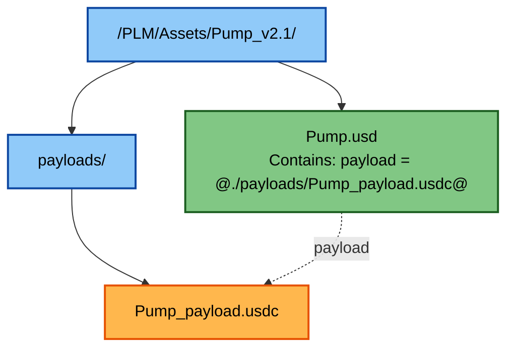
```mermaid
flowchart TD
    Root["/PLM/Assets/Pump_v2.1/"]:::folder
    Pump[Pump.usd<br/>Contains: payload = @./payloads/Pump_payload.usdc@]:::usd
    Payloads[payloads/]:::folder
    PayloadFile[Pump_payload.usdc]:::usdc
    
    Root --> Pump
    Root --> Payloads
    Payloads --> PayloadFile
    Pump -.->|payload| PayloadFile
    
    classDef folder fill:#90caf9,stroke:#0d47a1,stroke-width:2px,color:#000;
    classDef usd fill:#81c784,stroke:#1b5e20,stroke-width:2px,color:#000;
    classDef usdc fill:#ffb74d,stroke:#e65100,stroke-width:2px,color:#000;
```

When USD reads `Pump.usd`, it looks for `./payloads/Pump_payload.usdc` relative to where `Pump.usd` is located. This works regardless of where you open the scene from.

**Why Relative Paths Matter:**

- **Portable**: Asset folders can be moved anywhere and still work
- **PLM/PDM Friendly**: When systems replicate assets to different sites, paths remain valid
- **Version Control**: Works when checked out to different locations
- **Cloud/Network**: Works across different storage systems

**That's it.** Use relative paths, and USD handles the rest.

#### **1.2.3 Stable Entry Points**

**Two Types of Stability:**

**1. Stable Root Prim Name (USD Structure)**

Each asset must expose a **single, stable root prim** that doesn't change:

```
/PumpAsset
```

Never expose internal structure as the root (e.g., don't use `/PumpAsset/Geometry/Mesh` as the entry point). This ensures that references to the asset always work, even if the internal structure changes.

**2. Stable File Paths (Versioning)**

For versioning and maintainability, **file paths should be stable**—version numbers should NOT be in filenames. Version control is handled by PLM/PDM/Git systems running in the background.

**❌ Bad (Version in Filename):**
```
/Pump_v2.1/Pump_v2.1.usd
/Pump_v2.2/Pump_v2.2.usd
```

**✅ Good (Stable Path, Version in System):**
```
/Pump/Pump.usd          # Always the same path
```

The PLM/PDM/version control system manages which version is at `/Pump/Pump.usd`:
- Version 2.1 → `/Pump/Pump.usd` (checked out or published)
- Version 2.2 → `/Pump/Pump.usd` (after update)

**Why This Matters:**

- **References stay valid**: Other scenes reference `/Pump/Pump.usd` and don't break when versions change
- **PLM/PDM integration**: Version control systems can swap versions without breaking references
- **Maintainability**: One stable path to reference, versioning handled by governance systems

**Key Point:** Both the root prim name (`/PumpAsset`) and the file path (`/Pump/Pump.usd`) should remain stable. Versioning happens in the background via PLM/PDM/version control, not in filenames.

---

### 1.3 Performance

**USD Terms & Concepts:** [Stage](https://openusd.org/release/glossary.html#stage), [Stage Traversal](https://openusd.org/release/glossary.html#stage-traversal), [Instancing](https://openusd.org/release/glossary.html#instancing), [Instanceable](https://openusd.org/release/glossary.html#instanceable), [Load / Unload](https://openusd.org/release/glossary.html#load-unload), [Crate File Format](https://openusd.org/release/glossary.html#crate-file-format), [Layer](https://openusd.org/release/glossary.html#layer), [Layer Offset](https://openusd.org/release/glossary.html#layer-offset), [Value Clips](https://openusd.org/release/glossary.html#value-clips), [TimeSample](https://openusd.org/release/glossary.html#timesample), [Spline](https://openusd.org/release/glossary.html#spline), [Flatten](https://openusd.org/release/glossary.html#flatten)

Performance is essential for real-time visualization, robotics simulation, and large scenes.

**Fundamental Best Practice: References First**

Every asset should be **reusable** and referenced, not duplicated. Assets should only exist in scenes as **references**, never as pure geometry/mesh data copied directly into the scene. This reduces redundancy and ensures consistency.

**Key Performance Techniques:**

1. **References** - Keep assets reusable, reduce redundancy
2. **Payloads** - Lazy-load heavy data only when needed
3. **Instancing** - Share geometry across many instances
4. **Lofting** - Move controls above payloads for fast access
5. **USDC** - Use binary format for fast I/O

#### **1.3.1 References (Minimal Best Practice)**

**Always reference assets, never copy geometry:**

```
# ✅ Good: Reference the asset
def Xform "Pump" {
    references = @./Pump.usd@
}

# ❌ Bad: Copying mesh data directly
def Mesh "PumpMesh" {
    point3f[] points = [(0,0,0), (1,0,0), ...]  # Don't do this!
}
```

**Why References Matter:**
- **Reusability**: One asset definition, used everywhere
- **Consistency**: Updates propagate automatically
- **Redundancy Reduction**: No duplicate geometry data
- **Maintainability**: Fix once, works everywhere

#### **1.3.2 Payloads (Lazy Loading)**

**Payloads are loaded only when needed**, unlike references which load immediately.

```
# ✅ Good: Use payload for heavy assets
def Xform "Pump" {
    payload = @./Pump_payload.usdc@  # Loads only when requested
}

# ⚠️ Caution: Reference loads immediately
def Xform "Pump" {
    references = @./Pump_payload.usdc@  # Loads right away
}
```

**When to Use Payloads:**
- Heavy geometry (meshes with millions of points)
- Complex materials and textures
- Large simulation data
- Anything that might not be needed immediately

**When References Are OK:**
- Lightweight assets (simple transforms, metadata)
- Assets that must be loaded immediately
- Small helper objects

#### **1.3.3 Instancing (Memory Efficiency)**

**Instancing allows one geometry definition to be reused thousands of times**, dramatically reducing memory usage.

**How Instancing Works:**

1. **Prototype**: Define the geometry once (e.g., a screw)
2. **Instances**: Place many copies using positions/transforms
3. **Memory**: Only one copy of geometry in memory, regardless of instance count

**Example: Point Instancing**

```
# Define the prototype (the actual geometry)
def Xform "ScrewPrototype" {
    def Mesh "ScrewMesh" {
        point3f[] points = [...]  # Geometry defined once
    }
}

# Create many instances
def PointInstancer "Screws" {
    rel prototypes = </ScrewPrototype>  # Reference to prototype
    point3f[] positions = [(0,0,0), (1,0,0), (2,0,0), ...]  # 1 million positions
    int[] protoIndices = [0, 0, 0, ...]  # All use prototype 0
}
```

**Why This Is Crucial:**

If you have a screw used **1 million times** in a factory scene:
- **Without instancing**: 1 million copies of geometry = massive memory usage
- **With instancing**: 1 copy of geometry + 1 million transforms = minimal memory

**Memory Savings:**
- 1 screw mesh: ~1 MB
- 1 million copies without instancing: ~1,000,000 MB (1 TB!)
- 1 million instances: ~1 MB + (1 million × 16 bytes for transforms) ≈ ~17 MB

**Instancing reduces memory by 99.998%** for repeated geometry.

#### **1.3.4 Geometry in Payloads**

**Heavy mesh data should NEVER sit in root layers.**

**Critical Side Note: Root Layer Must Stay Clean**

Anything stored directly in the **root layer cannot be manipulated or resolved in composition arcs** within the LIVERPS system. The root layer has the strongest opinion (Local), so:
- Sublayers cannot override root layer data
- Variants cannot override root layer data
- References cannot override root layer data

**Keep the root layer minimal:**
- ✅ Structure (def Xform "World")
- ✅ Sublayer composition
- ✅ Metadata (defaultPrim, upAxis)
- ❌ No geometry data
- ❌ No references/payloads (put these in sublayers)
- ❌ No attribute values (put these in sublayers)

#### **1.3.5 Classification and Classes**

**Important Distinction:** This section covers `kind` metadata for classification. For USD **class specifiers** (abstract templates used with inherits), see Chapter 3, Section 3.9.5.

**Classification via `kind` Metadata**

USD supports classification via `kind` metadata to organize and categorize assets:

```
def Xform "Factory" (
    kind = "assembly"  # Top-level assembly
) {
    def Xform "ConveyorBelt" (
        kind = "component"  # Individual component
    ) {
        def Xform "Motor" (
            kind = "component"
        ) { ... }
    }
}
```

**Common Kind Values:**
- `"model"` - A complete, reusable asset
- `"component"` - Part of a larger assembly
- `"assembly"` - Container for multiple components
- `"group"` - Logical grouping without hierarchy

**Why Classification Matters:**
- **Organization**: Quickly identify asset types
- **Filtering**: Query scenes by kind (e.g., "show all components")
- **Validation**: Ensure assets follow expected structure
- **PLM Integration**: Map USD kinds to PLM/PDM classifications

**Best Practice:** Set `kind` metadata on root prims to enable efficient scene queries and organization.

**Note:** `kind` is metadata for organization. USD **classes** (`Sdf.SpecifierClass`) are abstract templates used with inherits for property templates—see Chapter 3, Section 3.9.5 for details.

---

### 1.4 Navigability

**USD Terms & Concepts:** [Model](https://openusd.org/release/glossary.html#model), [Model Hierarchy](https://openusd.org/release/glossary.html#model-hierarchy), [Assembly](https://openusd.org/release/glossary.html#assembly), [Component](https://openusd.org/release/glossary.html#component), [Group](https://openusd.org/release/glossary.html#group), [Kind](https://openusd.org/release/glossary.html#kind), [Purpose](https://openusd.org/release/glossary.html#purpose), [Collection](https://openusd.org/release/glossary.html#collection), [Subcomponent](https://openusd.org/release/glossary.html#subcomponent), [Path](https://openusd.org/release/glossary.html#path), [Namespace](https://openusd.org/release/glossary.html#namespace), [PseudoRoot](https://openusd.org/release/glossary.html#pseudoroot), [Stage Traversal](https://openusd.org/release/glossary.html#stage-traversal)

Large digital twins may contain millions of prims, so clear hierarchy is critical.

#### **1.4.1 Recommended Hierarchy**

```
/World
    /Factory
        /Line01
            /Robots
            /Conveyors
            /Sensors
```

#### **1.4.2 Collections**

Use collections to group logical sets:

```
def Collection "AllSafetySensors" {
    uniform token expansionRule = "expandPrims"
    rel includes = [
        </World/Factory/Line01/Sensors/SensorA>,
        </World/Factory/Line01/Sensors/SensorB>
    ]
}
```

---

### 1.5 Summary of Core Principles

| Principle     | Purpose |
|---------------|---------|
| Legibility    | Clarity across teams |
| Modularity    | Reusability & maintainability |
| Performance   | Speed & scalability |
| Navigability  | Efficient workflows |
| Stability     | Long-term asset health |

---

## Chapter 1.5: Project Structure and Organization

Successful USD projects require clear organizational patterns that scale with team size and project complexity. This chapter covers the USD GoodStart folder structure and organizational principles that have proven effective for digital twin and industrial workflows.

### 1.5.1 USD GoodStart Folder Structure

The USD GoodStart template provides a proven folder hierarchy that separates concerns while maintaining clear relationships between different types of content:

```
USD_GoodStart/
├── 000_SOURCE/          # Source files used in the project (CAD/DCC originals, configs)
├── 010_ASS_USD/         # All USD geometry/payload assets (converted from source)
├── 020_TEX/             # Global/shared texture files
├── 030_USD_LYR/         # General USD layers (materials, opinions, layout, asset import)
├── 040_SIM_LYR/         # Simulation/physics layers (collisions, joints, sensors, etc.)
├── 050_VARIANTS_LYR/    # Variant/configuration layers / payload references
├── 060_METADATA_LYR/    # Metadata & standards layers (PLM/ERP/CAD, AAS, OPC UA, etc.)
├── GoodStart_ROOT.usda  # Master root file that references all layer stacks + assets
├── GoodStart.hiplc      # Houdini file (or .ma/.mb/.max for other DCC tools)
└── README.md            # This file
```

#### Important Notes:
- **Folder numbers do not indicate layer order** - Layer order is determined by the `subLayers` array in `GoodStart_ROOT.usda`, not folder names
- **Numbers are organizational prefixes** for clarity and categorization only
- **Relative paths are mandatory** - All USD references must use `@./folder/file.usd@` syntax

### 1.5.2 Folder Purpose and Workflow

#### 000_SOURCE/ - Source Files and Materials
**Purpose:** Store original CAD/DCC source files, configurations, and materials used in the project.

**Contents:**
- CAD files (JT, CATIA, Rhino, STEP, etc.)
- DCC source files (Maya scenes, Houdini files, etc.)
- Original textures and materials
- Configuration files and scripts

**Workflow:**
1. Place original CAD exports here
2. Use as input for CAD-to-USD conversion
3. Maintain version control for traceability
4. Never modify files in this folder - they're the source of truth

#### 010_ASS_USD/ - USD Geometry & Payload Assets
**Purpose:** Store all converted USD geometry and payload assets.

**Contents:**
- Converted CAD models (`pump.usd`, `conveyor.usdc`)
- DCC-created assets (`robot_arm.usd`)
- Payload files with heavy geometry
- Asset-specific textures (if not global)

**Workflow:**
1. Convert CAD files from `000_SOURCE/` to USD format
2. Validate assets with `python scripts/validate_asset.py`
3. Store as either `.usda` (interface) or `.usdc` (heavy geometry)
4. Reference from layer files in `030_USD_LYR/`

#### 020_TEX/ - Global/Shared Textures
**Purpose:** Centralized storage for textures used across multiple assets.

**Contents:**
- Shared material textures (diffuse, normal, roughness maps)
- Environment textures
- Procedural texture definitions

**Workflow:**
1. Store global textures here for reuse across assets
2. Asset-specific textures can stay in asset folders
3. Use relative paths in material definitions
4. Optimize texture formats for target platform

#### 030_USD_LYR/ - General USD Layers
**Purpose:** Department-specific modifications, materials, layouts, and opinions.

**Contents:**
- `Ass_import_LYR.usda` - References to assets from `010_ASS_USD/`
- `Mtl_import_LYR.usda` - Material assignments and shading
- `xyz_Opinion_LYR.usda` - Department-specific overrides and modifications
- Layout and animation layers

**Critical Layer Stack Order:**
```usda
subLayers = [
    @./030_USD_LYR/xyz_Opinion_LYR.usda@,    # First = strongest (applied last)
    @./030_USD_LYR/Variant_LYR.usda@,        # Second
    @./030_USD_LYR/Mtl_import_LYR.usda@,     # Third
    @./030_USD_LYR/Ass_import_LYR.usda@     # Last = weakest (applied first)
]
```

#### 040_SIM_LYR/ - Simulation & Physics Layers
**Purpose:** Physics properties, collision geometry, and simulation parameters.

**Contents:**
- Collision meshes and physics properties
- Joint definitions and articulations
- Sensor configurations
- Simulation parameters

**Workflow:**
- Add physics properties to assets without modifying geometry
- Define collision proxies separate from visual geometry
- Configure simulation parameters (mass, friction, etc.)

#### 050_VARIANTS_LYR/ - Variant & Configuration Layers
**Purpose:** Manage different versions and configurations of assets.

**Contents:**
- Variant sets for different asset configurations
- LOD (Level of Detail) switching
- Configuration options (colors, sizes, features)

**Workflow:**
- Define variant sets in asset interface layers
- Use for product configurators and digital twin variations
- Enable runtime switching between configurations

#### 060_METADATA_LYR/ - Metadata & Standards Layers
**Purpose:** Store PLM/PDM/ERP integration data and digital twin standards.

**Contents:**
- PLM system identifiers and revision information
- AAS (Asset Administration Shell) mappings
- OPC UA data connections
- ERP system links
- Digital product passport information

**Workflow:**
- Map CAD metadata to USD attributes during conversion
- Connect to external systems for live data updates
- Store standards-compliant metadata for interoperability

### 1.5.3 Layer Organization Philosophy

#### Use Only What You Need
OpenUSD is powerful but can become overwhelming. **Only use layers you actually need** for your project.

**Philosophy:** Start simple, add complexity only when you have a clear requirement that justifies it.

**Anti-Pattern to Avoid:** Creating layers "just in case" or because "it might be useful later."

#### Layer Responsibility Principle
Each layer should have a single, clear responsibility:

- **Asset Import Layer**: Only handles asset references and basic transforms
- **Material Layer**: Only handles material assignments and shading
- **Opinion Layers**: Only contain department-specific modifications
- **Simulation Layers**: Only contain physics and simulation properties

#### Layer Naming Conventions
Following the GoodStart standard:

**File Type Suffixes:**
- `_LYR.usda` → Layer files (USD composition layers)
- `_GEO.usda/.usd` → Geometry asset files
- `_MAT.usda` → Material asset files

**Naming Patterns:**
- `*_import_LYR.usda` → Import layers (Ass_import, Mtl_import)
- `*_[identifier]_Opinion_LYR.usda` → Opinion layers (abc_Opinion, xyz_Opinion)
- `*_VAR_LYR.usda` → Variant layers
- `*_[type]_SIM_LYR.usda` → Simulation layers

### 1.5.4 Root File Management

#### GoodStart_ROOT.usda Purpose
The root file serves as the master composition file that:
- Defines the base scene structure (`def Xform "World"`)
- Contains the `subLayers` array defining layer order
- Sets metadata (defaultPrim, upAxis, etc.)
- Provides the entry point for the entire project

#### Root File Thinness Principle
**Keep the root layer minimal** - anything in the root layer cannot be overridden by sublayers because Local > Sublayer in LIV(E)RPS.

**✅ Root Layer Should Contain:**
- Base scene structure (`def Xform "World"`)
- `subLayers` array
- Metadata (defaultPrim, upAxis)
- Custom data and documentation

**❌ Root Layer Should NOT Contain:**
- Geometry data
- References or payloads
- Attribute values
- Material bindings

#### Layer Stacking Strategy
The `subLayers` array determines composition strength. Order matters:

1. **Opinion layers first** (strongest) - Final department overrides
2. **Variant layers** - Configuration switching
3. **Material layers** - Shading and materials
4. **Asset import layers last** (weakest) - Asset loading

### 1.5.5 Path Management

#### Relative Paths Only
**Critical:** Always use relative paths (`@./folder/file.usd@`), never absolute paths.

**Why Relative Paths Matter:**
- **Portability**: Projects can be moved without breaking references
- **Collaboration**: Works across different machines and networks
- **Version Control**: Compatible with Git and other VCS systems
- **Deployment**: Works in different environments (dev, staging, production)

**Path Resolution Rules:**
- USD resolves relative paths relative to the file containing the reference
- Validation scripts convert relative paths to absolute for checking
- Use `@./` for same directory, `@../` for parent directory

### 1.5.6 DCC File Integration

#### DCC Files in Project Root
Store working DCC files alongside the USD structure:
- `GoodStart.hiplc` (Houdini)
- `.ma/.mb` files (Maya)
- `.max` files (3ds Max)

#### DCC Workflow Integration
- DCC files reference and modify the USD layers
- Changes are layered as opinions within USD structure
- USD files remain the source of truth
- Different team members can use preferred DCC tools

#### Important DCC Limitations
- **Full USD Support**: Maya, Houdini, 3ds Max support full USD workflows
- **Limited Support**: Blender/Cinema 4D can only create endpoint assets (destructive workflow)
- Use appropriate tools based on your composition needs

### 1.5.7 Scaling Considerations

#### Small Projects (POC/MVP)
- Use minimal structure: `000_SOURCE/`, `010_ASS_USD/`, `030_USD_LYR/`, root file
- Single opinion layer for all modifications
- Focus on learning USD fundamentals

#### Medium Projects (Team Development)
- Add simulation and variant layers as needed
- Implement proper validation and CI/CD
- Establish team workflows and standards

#### Large Projects (Enterprise Digital Twins)
- Full folder structure with metadata integration
- Automated conversion pipelines
- PLM/PDM/ERP system integration
- Multi-team collaboration workflows

---

## Chapter 2 — The Reference/Payload Pattern (Full Deep Dive)

**USD Terms & Concepts:** [References](https://openusd.org/release/glossary.html#references), [Payload](https://openusd.org/release/glossary.html#payload), [Composition Arcs](https://openusd.org/release/glossary.html#composition-arcs), [Asset](https://openusd.org/release/glossary.html#asset), [Asset Resolution](https://openusd.org/release/glossary.html#asset-resolution), [Path Translation](https://openusd.org/release/glossary.html#path-translation), [Layer](https://openusd.org/release/glossary.html#layer), [LayerStack](https://openusd.org/release/glossary.html#layerstack), [Value Resolution](https://openusd.org/release/glossary.html#value-resolution), [Load / Unload](https://openusd.org/release/glossary.html#load-unload), [PrimSpec](https://openusd.org/release/glossary.html#primspec), [List Editing](https://openusd.org/release/glossary.html#list-editing), [Sublayers](https://openusd.org/release/glossary.html#sublayers), [Variant](https://openusd.org/release/glossary.html#variant), [VariantSet](https://openusd.org/release/glossary.html#variantset)

The Reference/Payload Pattern is the single most critical structural concept in OpenUSD production pipelines. It defines how lightweight “interface layers” connect to heavyweight “implementation layers,” enabling teams to build scalable, high‑performance, modular digital worlds.

This chapter provides a complete, enterprise‑grade breakdown of the pattern with diagrams, real‑world analogies, advanced USD code examples, and best practices from VFX, manufacturing, robotics, and digital twin pipelines.

---

# 2.1 Why the Pattern Exists

Large assets—robots, vehicles, machinery, architectural assemblies—contain **heavy geometry**, sometimes millions of polygons.  
Loading this data everywhere would destroy performance.

USD solves this by separating:

### **Interface Layer (Light)**  
A small, fast-loading USD file containing:
- The root prim
- Variants
- Primvars
- Relationship groups
- Metadata
- Transform opinions
- LOD switching controls
- Simulation parameters
- Semantic tags
- Material bindings
- *But NOT geometry*

### **Payload Layer (Heavy)**  
A binary `.usdc` file containing:
- Raw mesh data  
- Hierarchical geometry  
- Collision meshes  
- High-density CAD-derived structure  
- Rigging internals  
- **ST (texture coordinates)** — see Chapter 9, section 9.9.1 for terminology  
- High-fidelity material networks  

---

# 2.2 Conceptual Model

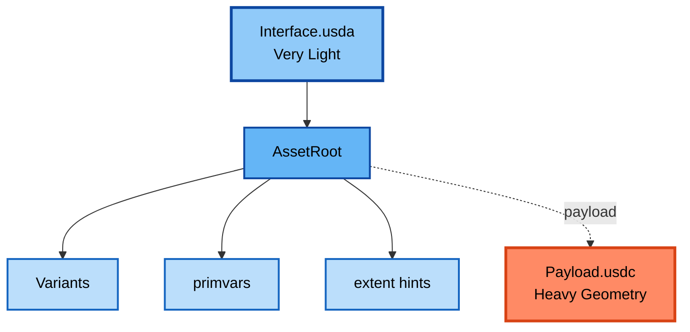
```mermaid
flowchart TD
    Interface[Interface.usda<br/>Very Light]:::light
    AssetRoot[AssetRoot]:::prim
    Variants[Variants]:::feature
    Primvars[primvars]:::feature
    Extent[extent hints]:::feature
    Payload[Payload.usdc<br/>Heavy Geometry]:::heavy
    
    Interface --> AssetRoot
    AssetRoot --> Variants
    AssetRoot --> Primvars
    AssetRoot --> Extent
    AssetRoot -.->|payload| Payload
    
    classDef light fill:#90caf9,stroke:#0d47a1,stroke-width:3px,color:#000;
    classDef prim fill:#64b5f6,stroke:#0d47a1,stroke-width:2px,color:#000;
    classDef feature fill:#bbdefb,stroke:#1565c0,stroke-width:2px,color:#000;
    classDef heavy fill:#ff8a65,stroke:#d84315,stroke-width:3px,color:#000;
```

The interface loads instantly.  
The payload loads *only when* needed.

---

# 2.3 Visual Diagram—The Pattern

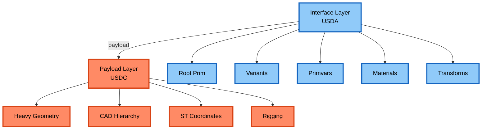
```mermaid
flowchart TD
    A[Interface Layer<br/>USDA] -->|payload| B[Payload Layer<br/>USDC]

    A --> A1[Root Prim]
    A --> A2[Variants]
    A --> A3[Primvars]
    A --> A4[Materials]
    A --> A5[Transforms]

    B --> B1[Heavy Geometry]
    B --> B2[CAD Hierarchy]
    B --> B3[ST Coordinates]
    B --> B4[Rigging]

    classDef light fill:#90caf9,stroke:#1565c0,stroke-width:3px,color:#000;
    classDef heavy fill:#ff8a65,stroke:#d84315,stroke-width:3px,color:#000;

    class A,A1,A2,A3,A4,A5 light;
    class B,B1,B2,B3,B4 heavy;
```

---

# 2.4 What Problems It Solves

## **1. Viewport performance**  
Scenes open instantly because heavy data doesn’t load until explicitly requested.

## **2. Multi-user workflows**  
Modelers, animators, lighters, simulation engineers can work independently.

## **3. Network efficiency**  
Only small `.usda` files sync across networks most of the time.

## **4. USD-native LOD system**  
Switching variants doesn't require reloading full scenes.

## **5. Digital twin scalability**  
Factories with 10,000+ assets become possible.

---

# 2.5 When to Use References vs Payloads

### **Use Payloads when:**
- The file contains heavy geometry  
- You want lazy-loading behavior  
- The asset is used widely (robots, machines, parts)  
- Real-time simulation performance matters  
- CAD-derived geometry is involved  

### **Use References when:**
- The file is lightweight  
- Always needed (metadata-only layers, animation clips, layout)  
- Composition must occur immediately  

### Table Overview

| Use Case | Reference | Payload |
|---------|-----------|---------|
| Heavy geometry | ❌ | ✅ |
| Metadata & logic layers | ✅ | ❌ |
| Animation clips | ✅ | ❌ |
| LOD switching | ❌ | ✅ |
| CAD imports | ❌ | ✅ |
| Root-level assembly | Often × | Sometimes |

---

# 2.6 USD Code Example: Simple Payload Pattern

```usda
def Xform "Pump" (
    prepend payload = @./Payloads/Pump_payload.usdc@
)
{
    double3 xformOp:translate = (0, 0, 0)
    uniform token assetType = "industrial_pump"
}
```

---

# 2.7 USD Code Example: Lofting Variants Above the Payload

```usda
def Xform "Pump" (
    prepend payload = @./Payloads/Pump_payload.usdc@
)
{
    variantSet "resolution" = "high" {
        "low"  {
            uniform token model:lod = "low"
        }
        "high" {
            uniform token model:lod = "high"
        }
    }
}
```

### Lofting Makes Variants Visible *Without* Loading the Heavy File.

---

# 2.8 USD Code Example: Lofting Materials

```usda
def Material "M_Pump" {
    color3f inputs:displayColor = (0.3, 0.5, 0.9)
}

def Xform "Pump" (
    prepend payload = @./Payloads/Pump_payload.usdc@
)
{
    rel material:binding = </M_Pump>
}
```

---

# 2.9 Multi-Layer Payload Chains

Large industrial assets may chain payloads:

```
Pump.usd
  → Pump_geom_payload.usdc
      → CAD_raw_payload.usdc
```

Why chain?
- Stage 1: Raw CAD  
- Stage 2: Optimized meshes  
- Stage 3: Final cleaned industrial asset  

---

# 2.10 Example Multi-Layer USD Pattern

```usda
def Xform "Pump" (
    prepend payload = @./pump_clean.usdc@
)
{
    # lofted metadata
    string digitalTwin:plmId = "PLM-00982"
    double operational:rpm = 3550
}
```

Inside `pump_clean.usdc`:

```usda
def Xform "PumpGeom" (
    prepend payload = @./pump_rawCAD.usdc@
)
{
}
```

---

# 2.11 Payload vs Sublayer: Critical Differences

### **Sublayer:**
Merges content at the *layer* level  
Used for:
- Pipeline steps  
- Workstream edits  
- Overrides  
- Scene-level assembly

### **Payload:**
Composes content at the *prim* level  
Used for:
- Geometry  
- Internal hierarchies  
- CAD data  

This distinction is core to USD architecture.

---

# 2.12 Common Anti-Patterns & Their Fixes

### ❌ **Anti-Pattern 1: Geometry stored directly in the interface layer**  
Fix: Move geometry into a `.usdc` payload.

---

### ❌ **Anti-Pattern 2: Large text-based `.usda` payloads**  
Fix: Use **USDC** for heavy data.

---

### ❌ **Anti-Pattern 3: Direct references instead of payloads**  
Fix: Only reference lightweight files.

---

### ❌ **Anti-Pattern 4: Variants authored inside the payload**  
Fix: Loft variant sets to the interface layer.

---

# 2.13 Payload Loading Behavior in USDView

USDView loads payloads only if the user selects:

```
Load > Load All Payloads
```

Or loads individual payloads by expanding prims.

This is *critical* for performance debugging.

---

# 2.14 Real-World Examples (Industry)

### **Robotics (Omniverse Isaac Sim)**
Robots have:
- Payload for full geometry  
- Lofted primvars for physical parameters  
- Lofted variants for tools/grippers  

### **Manufacturing Digital Twins**
Machines, pumps, conveyors all follow:
```
Machine.usda (interface)
  → Machine_geom.usdc (payload)
```

### **VFX**
Hero assets use:
- 5–10 payload layers  
- Complex variant networks  
- Full shader lofting  

---

# 2.15 Summary of Chapter 2

| Topic | Summary |
|------|---------|
| Purpose | Separate interface from heavy geometry |
| Benefit | Massive performance and modularity |
| Lofting | Expose controls without loading heavy files |
| Best File Types | `.usda` for interface, `.usdc` for payload |
| Anti-Patterns | Inline geometry, direct refs, unlofted variants |
| Result | Fast, scalable digital twins & scenes |

---


## Chapter 3 — Composition Strength (LIVERPS)

**USD Terms & Concepts:** [Composition](https://openusd.org/release/glossary.html#composition), [Composition Arcs](https://openusd.org/release/glossary.html#composition-arcs), [LIVERPS Strength Ordering](https://openusd.org/release/glossary.html#liverps-strength-ordering), [Layer](https://openusd.org/release/glossary.html#layer), [LayerStack](https://openusd.org/release/glossary.html#layerstack), [PrimSpec](https://openusd.org/release/glossary.html#primspec), [Value Resolution](https://openusd.org/release/glossary.html#value-resolution), [Inherits](https://openusd.org/release/glossary.html#inherits), [Specializes](https://openusd.org/release/glossary.html#specializes), [References](https://openusd.org/release/glossary.html#references), [Payload](https://openusd.org/release/glossary.html#payload), [Sublayers](https://openusd.org/release/glossary.html#sublayers), [VariantSet](https://openusd.org/release/glossary.html#variantset), [Direct Opinion](https://openusd.org/release/glossary.html#direct-opinion)

OpenUSD’s **composition engine** is one of its most powerful capabilities. It allows multiple contributors, tools, and systems to apply changes to the same scene **non-destructively**, while USD determines which opinions win. To master USD at a production level, you must understand the **LIVERPS** ordering system:

```
Local > Inherits > Variants > References > Payloads > Sublayers
```

This ordering determines which authored opinions override others. Misunderstanding LIVERPS leads to some of the most common USD mistakes—especially the **Root Layer Trap**, silent overrides, or changes that “don’t seem to apply.”

---

# 3.1 What Is Composition Strength?

Every USD opinion (attribute value, property, metadata, transform, material binding) has a *strength*.  
Higher-strength opinions override lower-strength ones.

### Strength Ordering (Top = Strongest):
1. **Local** (Strongest)
2. **Inherits**
3. **Variants**
4. **rElocates** (E in LIV(E)RPS)
5. **References**
6. **Payloads**
7. **Sublayers** (Weakest)

---

# 3.2 Visual Diagram of LIV(E)RPS Strength

**Stack Visualization (Strongest → Weakest):**

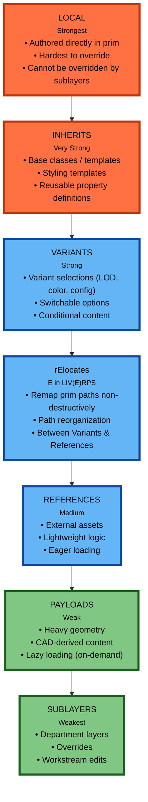
```mermaid
flowchart TD
    %% LIV(E)RPS Strength Stack - Top to Bottom (Strongest to Weakest)
    
    L["LOCAL<br/><small>Strongest</small><br/>• Authored directly in prim<br/>• Hardest to override<br/>• Cannot be overridden by sublayers"]:::strong
    
    I["INHERITS<br/><small>Very Strong</small><br/>• Base classes / templates<br/>• Styling templates<br/>• Reusable property definitions"]:::strong
    
    V["VARIANTS<br/><small>Strong</small><br/>• Variant selections (LOD, color, config)<br/>• Switchable options<br/>• Conditional content"]:::medium
    
    E["rElocates<br/><small>E in LIV(E)RPS</small><br/>• Remap prim paths non-destructively<br/>• Path reorganization<br/>• Between Variants & References"]:::medium
    
    R["REFERENCES<br/><small>Medium</small><br/>• External assets<br/>• Lightweight logic<br/>• Eager loading"]:::medium
    
    P["PAYLOADS<br/><small>Weak</small><br/>• Heavy geometry<br/>• CAD-derived content<br/>• Lazy loading (on-demand)"]:::weak
    
    S["SUBLAYERS<br/><small>Weakest</small><br/>• Department layers<br/>• Overrides<br/>• Workstream edits"]:::weak
    
    L --> I
    I --> V
    V --> E
    E --> R
    R --> P
    P --> S
    
    classDef strong fill:#ff7043,stroke:#bf360c,stroke-width:4px,color:#000;
    classDef medium fill:#64b5f6,stroke:#0d47a1,stroke-width:4px,color:#000;
    classDef weak fill:#81c784,stroke:#1b5e20,stroke-width:4px,color:#000;
```

**Bottom-to-Top Flow View (Weakest → Strongest):**

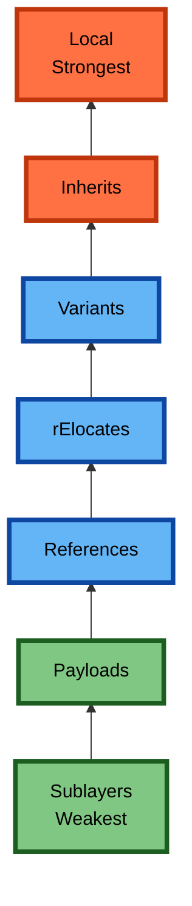
```mermaid
graph BT
    %% Bottom-to-Top: Weakest to Strongest
    %% LIV(E)RPS Strength Ordering Visualization
    
    S[Sublayers<br/>Weakest]:::weak
    P[Payloads]:::weak
    R[References]:::medium
    E[rElocates]:::medium
    V[Variants]:::medium
    I[Inherits]:::strong
    L[Local<br/>Strongest]:::strong

    S --> P
    P --> R
    R --> E
    E --> V
    V --> I
    I --> L

    classDef strong fill:#ff7043,stroke:#bf360c,stroke-width:4px,color:#000;
    classDef medium fill:#64b5f6,stroke:#0d47a1,stroke-width:4px,color:#000;
    classDef weak fill:#81c784,stroke:#1b5e20,stroke-width:4px,color:#000;
```

---

# 3.3 The Root Layer Trap (Critical)

The **root layer** is where your USD stage is launched.  
Any Local opinions authored here are **unbeatable** by any other layer in the stack.

### ❌ Common failure:
A user accidentally sets a transform directly in the root `.usda`:

```usda
def Xform "RobotA" {
    double3 xformOp:translate = (10, 0, 0)
}
```

Then tries to change it in a sublayer:

```usda
# In Layout_LYR.usda
over "RobotA" {
    double3 xformOp:translate = (0, 0, 0)
}
```

### Result:
The override does **not** apply.  
Local > Sublayer, so the root layer wins.

### ✔ Correct workflow:
Author opinions in department layers, not the root.

---

# 3.4 Example: Using Sublayers Correctly

### Root.usda (Thin File)
```usda
(
    subLayers = [
        "./030_USD_LYR/Layout_LYR.usda",
        "./030_USD_LYR/Animation_LYR.usda",
        "./030_USD_LYR/Lighting_LYR.usda"
    ]
)
```

### Layout.usda (Editable)
```usda
over "RobotA" {
    double3 xformOp:translate = (0, 0, 0)
}
```

The layout layer can now successfully override transforms.

---

# 3.5 Composition Arc Comparison Table

| Arc Type | Purpose | Strength | Load Behavior |
|----------|---------|----------|---------------|
| Local | Explicit value on prim | ⭐⭐⭐⭐⭐⭐ strongest | Immediate |
| Inherits | Style templates | ⭐⭐⭐⭐⭐ | Immediate |
| Variants | Switching sets | ⭐⭐⭐⭐ | Based on selection |
| References | External assets | ⭐⭐⭐ | Immediate load |
| Payloads | Heavy data | ⭐⭐ | Lazy-load |
| Sublayers | Workstream changes | ⭐ weakest | Merged |

---

# 3.6 Example: Demonstrating LIVERPS in Practice

### Reference Layer
```usda
def Xform "Machine" {
    double size = 1.0
}
```

### Variant Layer
```usda
over "Machine" {
    double size = 2.0
}
```

### Local in Root Layer
```usda
over "Machine" {
    double size = 3.0
}
```

### Final Result:
```
size = 3.0  (local overrides everything)
```

---

# 3.7 Real-World Example: CAD Pipelines

In CAD pipelines:

- CAD conversion stage produces geometry → payload layer  
- Cleanup/retopo departments write transforms → sublayers  
- Variant authors write configuration options → variant layers  
- Engineers add metadata → inherits or references  
- Integrators assemble scenes → root layer  

If any stage mistakenly writes a local root opinion, changes downstream break.

---

# 3.8 Example: LAYER ORDER IS NOT STRENGTH ORDER

Users often confuse these:

```
subLayers = [
    "./LayerB.usda",
    "./LayerA.usda"
]
```

This does **not** mean B overrides A.  
LIVERPS still applies.

---

# 3.9 Inherits: The Most Underrated Arc

Inherits allow you to define templates:

### Base Class
```usda
class "BaseConveyor" {
    double speed = 1.0
}
```

### Instance
```usda
def Xform "ConveyorA" (
    inherits = </BaseConveyor>
)
```

### Override
```usda
over "ConveyorA" {
    double speed = 1.2
}
```

Inheritance creates clean, reusable patterns for:

- Robots  
- Conveyor belts  
- Pumps  
- Lighting rigs  
- Safety devices  

---

## 3.9.5 Classes: Abstract Templates for Inheritance

**USD Terms & Concepts:** [Class](https://openusd.org/release/glossary.html#class), [Specifier](https://openusd.org/release/glossary.html#specifier), [Inherits](https://openusd.org/release/glossary.html#inherits), [PrimSpec](https://openusd.org/release/glossary.html#primspec), [Composition](https://openusd.org/release/glossary.html#composition), [Value Resolution](https://openusd.org/release/glossary.html#value-resolution)

**Classes** in OpenUSD are prims with the `Sdf.SpecifierClass` specifier. They act as abstract templates or blueprints that define reusable patterns for other prims.

**Key Characteristics:**

- **Abstract prims** that don't appear in the final composed scene
- **Templates** that define properties, attributes, and metadata
- **Used as targets** for composition arcs (especially Inherits)
- **Not visited** by default traversals (e.g., rendering)

### How Classes Work

**1. Creating Class Prims**

```python
from pxr import Usd, UsdGeom, Sdf

stage = Usd.Stage.CreateInMemory()

# Create a class prim that serves as a template
class_prim = stage.DefinePrim("/World/_CubeTemplate", "Cube")
class_prim.SetSpecifier(Sdf.SpecifierClass)

# Set default properties on the class
cube_schema = UsdGeom.Cube(class_prim)
cube_schema.GetSizeAttr().Set(1.0)
cube_schema.GetDisplayColorAttr().Set([(0.5, 0.5, 0.5)])  # Gray default
```

**2. Using Classes with Inherits Arc**

```python
# Create a concrete prim that inherits from the class
concrete_prim = stage.DefinePrim("/World/MyCube", "Cube")

# Inherit properties from the class template
concrete_prim.GetInherits().AddInherit("/World/_CubeTemplate")

# The concrete prim now has the class's default properties
# but can override them
cube_schema = UsdGeom.Cube(concrete_prim)
cube_schema.GetDisplayColorAttr().Set([(1.0, 0.0, 0.0)])  # Override to red
```

**3. USDA Syntax**

```usda
#usda 1.0

class "_VehicleTemplate" {
    # Class prim - abstract template
    float speed = 60.0
    token fuelType = "gasoline"
}

def "Car" (
    inherits = </_VehicleTemplate>
) {
    # Concrete prim inheriting from class
    # Gets speed=60.0 and fuelType="gasoline" by default
    float speed = 80.0  # Override the inherited value
}
```

### Benefits

- **DRY (Don't Repeat Yourself)**: Define common properties once and reuse them
- **Consistency**: Ensures all inheriting prims share the same base structure
- **Maintainability**: Update the class to affect all inheriting prims
- **Template Pattern**: Similar to OOP class inheritance
- **Composition Flexibility**: Works with other composition arcs (References, Payloads, etc.)

### Pitfalls and Challenges

- **Composition Complexity**: Classes add another layer to the composition stack, which can make debugging harder
- **Performance Overhead**: Inheritance resolution requires additional composition work
- **Inheritance Conflicts**: When multiple classes are inherited, conflicts can occur:
  ```python
  # If two classes define the same property, which wins?
  prim.GetInherits().AddInherit("/ClassA")
  prim.GetInherits().AddInherit("/ClassB")  # Potential conflict!
  ```
- **Not Visited by Default Traversals**: Class prims are abstract and won't appear in rendering or default traversals
- **Debugging Difficulty**: Understanding the final composed result requires tracing through inheritance chains
- **Overuse**: Using classes for simple cases can add unnecessary complexity

### Best Practices

- ✅ Use classes for reusable templates with shared properties
- ✅ Name class prims with a leading underscore (e.g., `/_Template`) to indicate they're abstract
- ✅ Prefer references or payloads when you need instance data, not just property templates
- ✅ Document inheritance hierarchies clearly
- ✅ Use `UsdPrimCompositionQuery` to debug inheritance chains when issues arise
- ❌ Don't use classes for simple cases that don't need templates
- ❌ Avoid deep inheritance hierarchies that become hard to debug

### Related Concepts

- **Inherits Arc**: The "I" in LIVERPS (Layers, Inherits, Variants, References, Payloads, Specializes)
- **Specializes**: Similar to inherits but with different composition semantics
- **Specifiers**: `Def` (concrete), `Over` (override), `Class` (abstract template)

**Key Point:** Classes are useful for creating reusable templates, but use them judiciously to avoid unnecessary complexity in your USD scenes.

---

# 3.10 Variants and Strength

Variants sit *above* References and Payloads but *below* Local.

### Variant Example
```
variantSet "ColorMode" = "Red"
```

Inside variant:
```usda
"Red" {
    color3f displayColor = (1, 0, 0)
}
```

---

# 3.11 Practical Patterns for Digital Twins

### Pattern: Engineering → Design → Simulation → Layout

| Department | Arc Type |
|-----------|----------|
| Engineering | Payloads |
| Design | References |
| Simulation | Variants |
| Layout | Sublayers |
| Root Layer | Local |

This allows every team to contribute without overwriting each other.

---

# 3.12 Debugging Composition Issues

### Use:
- `usdresolve`
- `usdcat --flatten`
- `usdview` → Display → Composition Pane
- Omniverse: "Show Asset Resolution"

Typical symptoms:
- Values not updating  
- Colors/materials wrong  
- Wrong LODs  
- Unexpected transforms  

Usually caused by LIVERPS confusion.

---

# 3.13 Summary of Chapter 3

| Concept | Key Idea |
|--------|----------|
| LIVERPS | Defines override strength |
| Root Layer Trap | Never author strong opinions in root |
| Sublayers | Weakest, for workstreams |
| Payloads | For heavy geometry |
| References | Lightweight composition |
| Variants | Configurable states |
| Inherits | Templates & prototypes |
| Local | Avoid except when intentional |

Mastering LIVERPS is essential for building scalable industrial USD systems.

---


## Chapter 4 — Layer Stacking & Workstreams (Full Expansion)

**USD Terms & Concepts:** [Layer](https://openusd.org/release/glossary.html#layer), [LayerStack](https://openusd.org/release/glossary.html#layerstack), [Sublayers](https://openusd.org/release/glossary.html#sublayers), [Layer Offset](https://openusd.org/release/glossary.html#layer-offset), [Composition](https://openusd.org/release/glossary.html#composition), [Composition Arcs](https://openusd.org/release/glossary.html#composition-arcs), [Value Resolution](https://openusd.org/release/glossary.html#value-resolution), [TimeCode](https://openusd.org/release/glossary.html#timecode), [TimeSample](https://openusd.org/release/glossary.html#timesample), [EditTarget](https://openusd.org/release/glossary.html#edittarget), [Session Layer](https://openusd.org/release/glossary.html#session-layer)

Layer stacking is the backbone of USD’s non-destructive workflow. Instead of a single monolithic file, USD encourages **parallel workstreams**, where each department (modeling, materials, simulation, layout, variants, overrides) works in its own layer. USD then composes these layers together in a predictable, controlled order.

This chapter explains how to build robust, large-scale pipelines using clean layer stacks and provides real industrial/VFX examples with USD code and diagrams.

---

# 4.1 What Is a Layer?

A **layer** is a USD file representing a specific contribution to an asset or scene.

Layers contain:
- Geometry
- Transforms
- Materials
- Metadata
- Variants
- Overrides
- Simulation parameters
- Animation
- Layout

But crucially, **layers are composed together**, not merged destructively.

---

# 4.2 The Purpose of Layer Stacking

Layer stacking allows:
- Departmental independence  
- Safe overrides  
- Versioning strategies  
- Undoable changes  
- Reusable assets  
- Multi-contributor editing  
- Non-destructive updates  
- Debuggability

---

# 4.3 Standard Workstream-Based Layer Structure

A typical USD asset or scene uses this hierarchy:

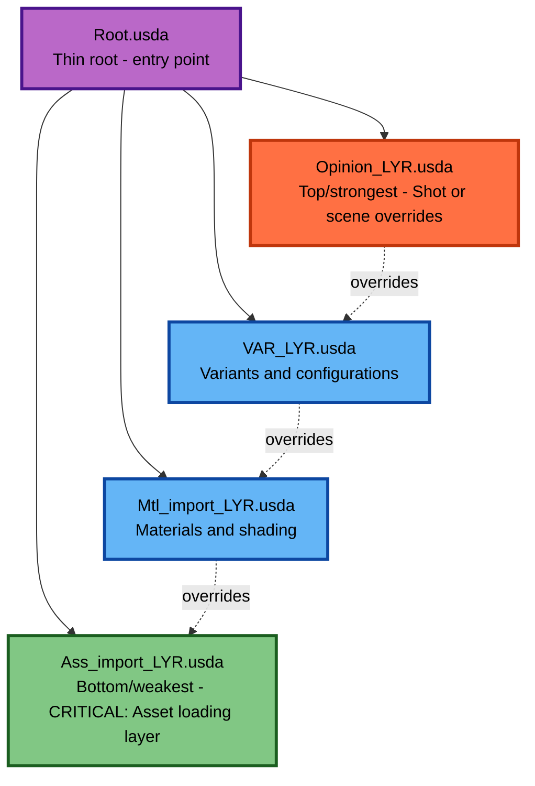
```mermaid
flowchart TD
    Root[Root.usda<br/>Thin root - entry point]:::root
    Opinion[Opinion_LYR.usda<br/>Top/strongest - Shot or scene overrides]:::strong
    Variant[VAR_LYR.usda<br/>Variants and configurations]:::medium
    Material[Mtl_import_LYR.usda<br/>Materials and shading]:::medium
    AssetImport[Ass_import_LYR.usda<br/>Bottom/weakest - CRITICAL: Asset loading layer]:::weak
    
    Root --> Opinion
    Root --> Variant
    Root --> Material
    Root --> AssetImport
    
    Opinion -.->|overrides| Variant
    Variant -.->|overrides| Material
    Material -.->|overrides| AssetImport
    
    classDef root fill:#ba68c8,stroke:#4a148c,stroke-width:3px,color:#000;
    classDef strong fill:#ff7043,stroke:#bf360c,stroke-width:3px,color:#000;
    classDef medium fill:#64b5f6,stroke:#0d47a1,stroke-width:3px,color:#000;
    classDef weak fill:#81c784,stroke:#1b5e20,stroke-width:3px,color:#000;
```

**CRITICAL: Layer Order Matters**

The layer stack is ordered from **weakest (bottom)** to **strongest (top)**. The **AssetImport layer MUST be at the bottom** because:

- **Asset Loading**: This is where all assets enter the scene via references/payloads
- **Override Capability**: Higher layers (materials, variants, opinions) must be able to override what's loaded
- **Composition Strength**: Following LIVERPS, weaker layers (bottom) can be overridden by stronger layers (top)
- **If AssetImport were higher**: Nothing could override the loaded assets, breaking the non-destructive workflow

Each layer serves a unique purpose, and the order is **fundamental** to USD's composition system.

---

# 4.4 Layer Stacking Visualization

**Layer Stack (Top = Strongest, Bottom = Weakest):**

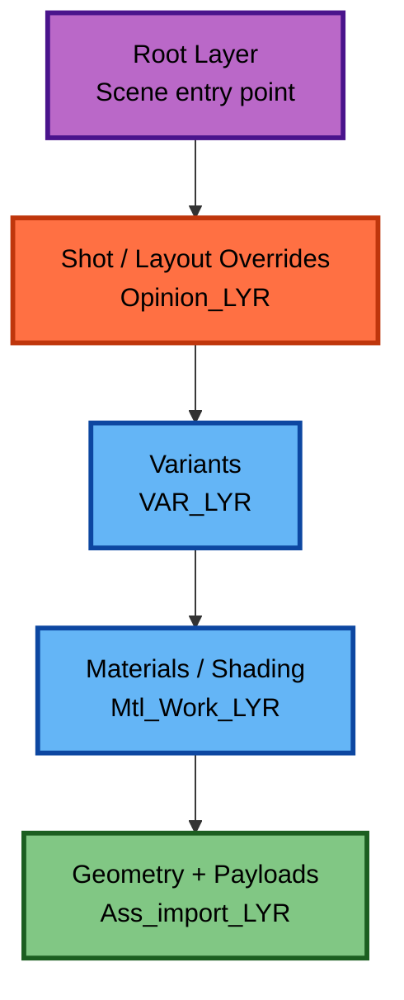
```mermaid
flowchart TD
    %% Top-to-Bottom: Strongest to Weakest
    Root[Root Layer<br/>Scene entry point]:::root
    Opinion[Shot / Layout Overrides<br/>Opinion_LYR]:::strong
    Variant[Variants<br/>VAR_LYR]:::medium
    Material[Materials / Shading<br/>Mtl_Work_LYR]:::medium
    Import[Geometry + Payloads<br/>Ass_import_LYR]:::weak
    
    Root --> Opinion
    Opinion --> Variant
    Variant --> Material
    Material --> Import
    
    classDef root fill:#ba68c8,stroke:#4a148c,stroke-width:3px,color:#000;
    classDef strong fill:#ff7043,stroke:#bf360c,stroke-width:3px,color:#000;
    classDef medium fill:#64b5f6,stroke:#0d47a1,stroke-width:3px,color:#000;
    classDef weak fill:#81c784,stroke:#1b5e20,stroke-width:3px,color:#000;
```

**Bottom-to-Top Construction View:**

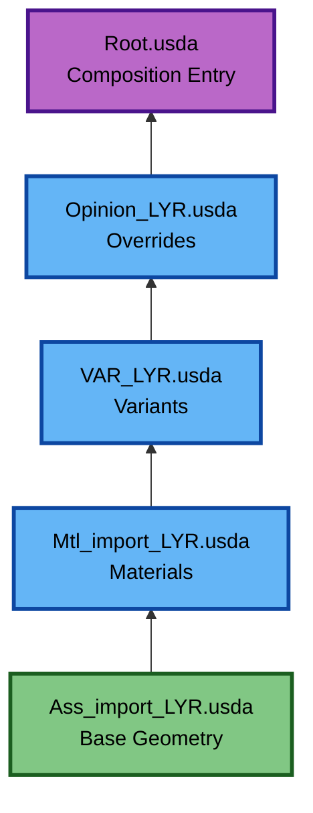
```mermaid
graph BT
    %% Bottom-Up Construction
    Import[Ass_import_LYR.usda<br/>Base Geometry]:::base
    Mtl[Mtl_import_LYR.usda<br/>Materials]:::layer
    Variant[VAR_LYR.usda<br/>Variants]:::layer
    Opinion[Opinion_LYR.usda<br/>Overrides]:::layer
    Root[Root.usda<br/>Composition Entry]:::root

    Import --> Mtl
    Mtl --> Variant
    Variant --> Opinion
    Opinion --> Root

    classDef root fill:#ba68c8,stroke:#4a148c,stroke-width:3px,color:#000;
    classDef layer fill:#64b5f6,stroke:#0d47a1,stroke-width:3px,color:#000;
    classDef base fill:#81c784,stroke:#1b5e20,stroke-width:3px,color:#000;
```

The **lower** the layer, the **weaker** the opinions.


---

# 4.5 Example: Root.usda

A thin root file should contain only sublayers (no geometry, no transforms, no references, no payloads).

**CRITICAL: Layer Order**

The `subLayers` array is ordered from **top (strongest)** to **bottom (weakest)**. AssetImport must be **last** (bottom):

```usda
#usda 1.0
(
    defaultPrim = "World"
    subLayers = [
        @./030_USD_LYR/Opinion_xyz_LYR.usda@,      # Top (strongest) - overrides everything
        @./030_USD_LYR/VAR_LYR.usda@,          # Variants and configurations
        @./030_USD_LYR/Mtl_import_LYR.usda@,         # Materials and shading
        @./030_USD_LYR/Ass_import_LYR.usda@      # Bottom (weakest) - CRITICAL: loads assets
    ]
)

def Xform "World" {}
```

**Why This Order:**
- **AssetImport at bottom**: Assets are loaded first (weakest layer)
- **Materials above**: Can override asset materials
- **Variants above materials**: Can switch between different configurations
- **Opinions at top**: Final overrides for scene-specific modifications

This is the *correct* structure.  
Nothing else should be authored in the root file unless absolutely necessary.

---

# 4.6 Geometry Layer: Ass_import_LYR.usda

**CRITICAL: This layer MUST be at the bottom of the layer stack.**

This layer provides:
- **References or payloads** - All asset loading happens here
- Base transforms (optional)
- Clean geometry routing
- Asset entry point into the scene

**Why AssetImport Must Be at the Bottom:**

1. **Asset Loading**: This is where assets enter the scene via `references` or `payload` arcs
2. **Override Capability**: Higher layers (materials, variants, opinions) need to override loaded assets
3. **Composition Strength**: As the weakest layer, it can be overridden by all layers above it
4. **Non-Destructive Workflow**: Assets are loaded once, then modified by layers above without changing source files

**Example:**

```usda
# Ass_import_LYR.usda - Bottom layer (weakest)
def Xform "Conveyor" (
    prepend payload = @../010_ASS_USD/Conveyor/Conveyor_payload.usdc@
)
{
    # Asset is loaded here - can be overridden by layers above
}
```

**What Happens Next:**
- Materials layer (`Mtl_import_LYR.usda`) can override materials on loaded assets
- Variants layer (`VAR_LYR.usda`) can switch between different asset configurations
- Opinions layer (`Opinion_xyz_LYR.usda`) can make final scene-specific modifications

This is the **foundation layer** - everything else builds on top of it.

---

# 4.7 Material Layer: Mtl_import_LYR.usda

Materials live **above** geometry but **below** scene variants.

Example:

```usda
over "Conveyor" {
    rel material:binding = </Materials/M_ConveyorPaint>
}
```

This allows:
- Shading artists to iterate independently
- Simulation/modeling teams to avoid conflict
- Root or layout layers to override later if needed

---

# 4.8 Variant Layer: VAR_LYR.usda

Variants define discrete configurations.

Example:

```usda
over "Conveyor" {
    variantSet "ModelConfig" = "WithSensor" {
        "WithSensor" {
            prepend references = @./Conveyor_withSensor.usdc@
        }
        "Default" { }
    }
}
```

This enables:
- CAD configurations
- Tool attachments
- Damage states
- LOD variations

---

# 4.9 Opinion Layer: Opinion_LYR.usda

Used for:
- Shot-level overrides  
- Temporary adjustments  
- Layout tweaks  
- Performance debugging  

Example:

```usda
over "Conveyor" {
    double3 xformOp:translate = (0, 0, 2)
}
```

This is where layout artists work.

---

# 4.10 Example: How Layers Compose Together

Consider a robot asset:

### Ass_import_LYR
Defines geometry and payload:

```usda
def Xform "RobotA" (
    prepend payload = @./Payloads/RobotA_geom.usdc@
)
```

### Mtl_Work_LYR
Assigns materials:

```usda
over "RobotA" {
    rel material:binding = </Materials/M_RobotMetal>
}
```

### VAR_LYR
Adds tool attachments:

```usda
over "RobotA" {
    variantSet "Tooling" = "Gripper"
}
```

### Opinion_LYR
Layout artist adjusts position:

```usda
over "RobotA" {
    double3 xformOp:translate = (1.2, 0, 0)
}
```

### Result:
USD resolves all layers according to LIVERPS and sublayer order.

---

# 4.11 Designing Workstreams for Real Projects

### Manufacturing / Industrial Digital Twin
- Geometry: CAD → Payload layer  
- Materials: Industrial coating/shader layer  
- Variants: CAD options (motor type, sensors)  
- Simulation: Physics + collision layer  
- Layout: Factory scene assembly layer  

### Robotics (Omniverse Isaac Sim)
- Geometry → Payload  
- Joints/kinematics → Simulation layer  
- Sensors → Variant layer  
- ROS/AI metadata → Custom attributes layer  
- Layout → Environment assembly  

### VFX Pipelines
- Model  
- Surfacing  
- Rig  
- Animation  
- FX  
- Lighting  
- Layout  
All represented in separate USD layers.

---

# 4.12 Multi-Department Pipelines Example

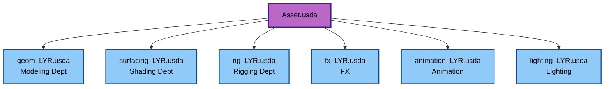
```mermaid
flowchart TD
    Asset[Asset.usda]:::root
    Geom[geom_LYR.usda<br/>Modeling Dept]:::dept
    Surfacing[surfacing_LYR.usda<br/>Shading Dept]:::dept
    Rig[rig_LYR.usda<br/>Rigging Dept]:::dept
    FX[fx_LYR.usda<br/>FX]:::dept
    Animation[animation_LYR.usda<br/>Animation]:::dept
    Lighting[lighting_LYR.usda<br/>Lighting]:::dept
    
    Asset --> Geom
    Asset --> Surfacing
    Asset --> Rig
    Asset --> FX
    Asset --> Animation
    Asset --> Lighting
    
    classDef root fill:#ba68c8,stroke:#4a148c,stroke-width:3px,color:#000;
    classDef dept fill:#90caf9,stroke:#0d47a1,stroke-width:2px,color:#000;
```

Each team writes only to their own USD file.

---

# 4.13 Best Practices for Layer Stacking

### ✔ ALWAYS use relative paths  
Ensures portability and stable references.

### ✔ Keep the root layer thin  
Do **not** author strong opinions here.

### ✔ Only put geometry or heavy data in payload layers  
Never in variant or material layers.

### ✔ Use sublayers for departmental edits  
Not references or payloads.

### ✔ Use multiple layers instead of overwriting  
Layering is the power of USD.

### ✔ **Lock layers you're not working on**
**Critical workflow safety practice:** Always lock layers that you are not actively editing. This prevents accidental modifications to the wrong layer, which can cause composition conflicts, break overrides, or corrupt the layer stack. In Omniverse Composer and other USD editing tools, use the layer locking feature to protect layers from unintended changes. Only unlock the specific layer you need to edit, work on it, then lock it again before moving to another layer.

**Why this matters:**
- Editing the wrong layer can break composition order and override relationships
- Locked layers provide visual feedback about which layer is active
- Prevents accidental drag-and-drop operations between layers (see warning below)
- Essential for multi-user workflows where multiple team members work on different layers

### ⚠️ **Drag-and-Drop Between Layers: Use with Caution**
Within the layer tab of USD editing tools (such as Omniverse Composer), you can move actions, deltas, and edits between layers via drag-and-drop. While this can be convenient for reorganizing edits, **use this feature with extreme caution**:

**Risks:**
- Moving edits to the wrong layer can break composition strength ordering (LIV(E)RPS)
- Overrides may stop working if moved to a weaker layer
- Can create circular dependencies or invalid layer relationships
- May cause unexpected composition results that are hard to debug

**Best Practice:**
- **Prefer creating new edits in the correct layer** rather than moving existing edits
- If you must move edits, verify the layer stack order and composition strength first
- Test thoroughly after moving edits between layers
- Document any layer reorganization in your project notes
- Consider using version control to track layer changes before drag-and-drop operations

---

# 4.14 Anti-Patterns

### ❌ Anti-pattern 1: Materials inside geometry layer  
Causes conflicts, complicates shading pipelines.

### ❌ Anti-pattern 2: Variants defined in payload  
They won’t work properly unless lofted.

### ❌ Anti-pattern 3: Artists editing root.usda  
Overwrites are unbeatable due to LIVERPS.

### ❌ Anti-pattern 4: One giant USD file  
Defeats USD’s modularity.

---

# 4.15 Summary

| Layer | Purpose |
|-------|---------|
| Root | Entry point only |
| Opinion | Shot/scene overrides |
| Variant | Configurations & options |
| Material | Shaders & bindings |
| AssetImport | Geometry, payloads, references |

Layer stacking is the key to building stable, scalable OpenUSD pipelines across industries.

---


## Chapter 5 — Parameterization (Variants & Primvars) — Full Expansion

**USD Terms & Concepts:** [Variant](https://openusd.org/release/glossary.html#variant), [VariantSet](https://openusd.org/release/glossary.html#variantset), [Primvar](https://openusd.org/release/glossary.html#primvar), [Interpolation](https://openusd.org/release/glossary.html#interpolation), [Attribute](https://openusd.org/release/glossary.html#attribute), [Value Resolution](https://openusd.org/release/glossary.html#value-resolution), [Composition Arcs](https://openusd.org/release/glossary.html#composition-arcs), [Layer](https://openusd.org/release/glossary.html#layer), [PrimSpec](https://openusd.org/release/glossary.html#primspec)

Parameterization is one of the most powerful aspects of OpenUSD. It allows assets to be dynamic, configurable, and reusable across endless scenarios. In digital twins, robotics, VFX, CAD pipelines, simulation, and large-scale configurators, **variants and primvars** provide the backbone for flexibility.

This chapter covers the complete theory and practice of USD parameterization, including deep examples, diagrams, multi-layer workflows, best practices, anti-patterns, and enterprise deployment strategies.

---

# 5.1 What is Parameterization?

Parameterization is the process of exposing **controllable attributes** that modify the behavior, visuals, or structure of an asset without duplicating its geometry or logic.

USD supports two key mechanisms:

### ✔ Variants → Discrete states  
Examples:  
- LOD: high / medium / low  
- CAD options: motor_A / motor_B  
- Robot configurations: gripper / welder / sanding_tool  
- Damage states: pristine / dented  
- Material themes: glossy / matte  
- Assembly alternatives  

### ✔ Primvars → Continuous values  
Examples:  
- Colors  
- Roughness  
- Temperature  
- Material coefficients  
- Simulation parameters  
- Semantic tags  

Variants change *what* the asset is.  
Primvars change *how* the asset behaves or appears.

---

# 5.2 Variant Sets in Depth

Variants define **mutually exclusive choices** inside a USD prim.

```
variantSet "Resolution" = "High"
```

Each variant contains its own set of authored opinions.

---

# 5.3 Full Variant Structure Example

```
def Xform "Pump" {
    variantSet "Resolution" = "High" {

        "Low" {
            uniform token model:lod = "low"
            prepend payload = @./pump_low.usdc@
        }

        "Medium" {
            uniform token model:lod = "medium"
            prepend payload = @./pump_med.usdc@
        }

        "High" {
            uniform token model:lod = "high"
            prepend payload = @./pump_high.usdc@
        }
    }
}
```

This allows:
- Fast loading (low LOD)
- Preview modes
- High-quality rendering
- Optimized real-time simulation

---

# 5.4 Lofting Variants (Best Practice)

Variants should be authored **in the interface layer**, not inside payloads.

### ❌ Anti-pattern
Variants inside the payload:

```usda
# In pump_payload.usda
variantSet "Color" = "Blue"
```

This loads heavy geometry just to switch a color. Bad!

### ✔ Correct (Lofted Variant)
Variants moved above payload:

```usda
def Xform "Pump" (
    prepend payload = @./pump_payload.usdc@
)
{
    variantSet "Color" = "Blue" {
        "Blue"  { color3f primvars:displayColor = (0.1, 0.1, 1.0) }
        "Red"   { color3f primvars:displayColor = (1.0, 0.1, 0.1) }
        "Green" { color3f primvars:displayColor = (0.1, 1.0, 0.1) }
    }
}
```

---

# 5.5 Types of Variants

### Structural Variants  
Add/remove/restructure prims.

Examples:
- Robot arm has 4-axis vs 6-axis configuration  
- Pump has large vs small motor  
- Conveyor has safety cover vs no cover  

### Non-Structural Variants  
Modify attributes without changing structure.

Examples:
- Material color  
- LOD selection  
- Simulation mode  
- Behavior logic  

---

# 5.6 Variant Composition Across Layers

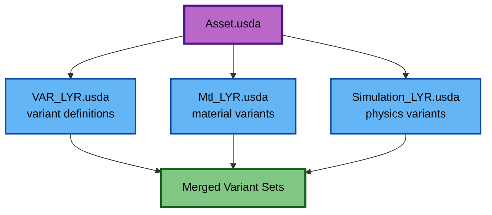
```mermaid
flowchart TD
    Asset[Asset.usda]:::root
    VariantLayer[VAR_LYR.usda<br/>variant definitions]:::variant
    MtlLayer[Mtl_LYR.usda<br/>material variants]:::variant
    SimLayer[Simulation_LYR.usda<br/>physics variants]:::variant
    Merged[Merged Variant Sets]:::result
    
    Asset --> VariantLayer
    Asset --> MtlLayer
    Asset --> SimLayer
    
    VariantLayer --> Merged
    MtlLayer --> Merged
    SimLayer --> Merged
    
    classDef root fill:#ba68c8,stroke:#4a148c,stroke-width:3px,color:#000;
    classDef variant fill:#64b5f6,stroke:#0d47a1,stroke-width:2px,color:#000;
    classDef result fill:#81c784,stroke:#1b5e20,stroke-width:3px,color:#000;
```

USD merges variants from multiple layers into single variant sets.

---

# 5.7 Best Practices for Variants

### ✔ Keep variant sets small and focused  
50 variants in one set = confusion  
5–10 variants = ideal

### ✔ Avoid mixing structural & non-structural variants  
Easier debugging and composition

### ✔ Avoid referencing huge files inside variants  
Use payloads whenever possible

### ✔ Use variants for states, not animations  
Animations belong in clips or primvars

### ✔ Declare properties without values to allow variant overrides  
When adding variants to existing assets, **declare properties without initial values** rather than removing them entirely. This preserves property definitions for connections while allowing variants to set values.

**The Problem: Local Property Values Override Variants**

This is a common issue when retrofitting variants onto existing assets. Consider this scenario:

**Step 1: Artist creates an asset with a local property value:**
```usda
def Xform "Branch" {
  custom double length = 1  # Local opinion - strongest in LIVERPS
}
```

**Step 2: You want to add variants for "small" and "large" sizes:**
The intuitive approach would be to add variants while keeping the existing property:

```usda
def Xform "Branch" (
  variantSets = ["sizes"]
  variants = {
    string sizes = "small"
  }
)
{
  custom double length = 1  # ❌ PROBLEM: This Local opinion overrides variants!
  variantSet "sizes" = {
    "small" {
      custom double length = 0.5  # ❌ This value is ignored!
    }
    "large" {
      custom double length = 2    # ❌ This value is also ignored!
    }
  }
}
```

**Why this doesn't work:** Due to LIVERPS composition strength (Local > Variants), the local `length = 1` always wins, regardless of which variant is selected. The variant values are silently ignored.

**Step 3: The problematic workaround (removing the property entirely):**
Many developers discover they must remove the local property to make variants work:

```usda
def Xform "Branch" (
  variantSets = ["sizes"]
  variants = {
    string sizes = "small"
  }
)
{
  # Property removed - variants can now set values
  variantSet "sizes" = {
    "small" {
      custom double length = 0.5
    }
    "large" {
      custom double length = 2
    }
  }
}
```

**New problem:** The property no longer exists at the prim level, which causes issues:
- **Connections break:** `</Branch.length>` doesn't resolve when variants aren't loaded
  ```usda
  # This connection fails if length property doesn't exist at prim level:
  def Cylinder "Visual" {
    double height.connect = </Branch.length>  # ❌ Connection to "nothing"
  }
  ```
- **Property feels "missing":** Tools and scripts expect the property to exist
- **No metadata possible:** Can't add documentation or metadata to a non-existent property
- **Type safety lost:** The property type isn't declared upfront
- **Confusing for artists:** The property appears to be missing where you'd expect it to be

**Root cause:** A local property value (`custom double length = 1`) creates a Local opinion that overrides variant values due to LIVERPS strength ordering.

**❌ Incorrect approach #1 (local value overrides variants):**
```usda
def Xform "Branch" (
  variantSets = ["sizes"]
  variants = {
    string sizes = "small"
  }
)
{
  custom double length = 1  # ❌ Local opinion overrides variants - variant values ignored!
  variantSet "sizes" = {
    "small" {
      custom double length = 0.5  # This value is never used
    }
    "large" {
      custom double length = 2    # This value is also never used
    }
  }
}
# Result: length always equals 1, regardless of variant selection
```

**❌ Incorrect approach #2 (removing property breaks connections):**
```usda
def Xform "Branch" (
  variantSets = ["sizes"]
  variants = {
    string sizes = "small"
  }
)
{
  # Property removed - variants work, but connections break!
  variantSet "sizes" = {
    "small" {
      custom double length = 0.5
    }
    "large" {
      custom double length = 2
    }
  }
}
# Result: </Branch.length> doesn't resolve when variants aren't loaded
```

**✅ Correct approach (declare without value):**
```usda
def Xform "Branch" (
  variantSets = ["sizes"]
  variants = {
    string sizes = "small"
  }
)
{
  custom double length  # Declared but NOT assigned - variants can set values
  variantSet "sizes" = {
    "small" {
      custom double length = 0.5
    }
    "large" {
      custom double length = 2
    }
  }
}
```

**Benefits:**
- Property exists for connections (e.g., `</Branch.length>` works even when variants aren't loaded)
- Allows metadata on property declaration (e.g., `custom color3f myColor ( colorSpace = "srgb_linear")`)
- Provides type safety and documentation
- Variants can set values without Local opinion conflicts

**Key principle:** A property declaration without a value doesn't create a Local opinion, so variant opinions (which are weaker than Local but stronger than Payloads) can provide the values.

### When to Use Thomas's Approach vs Jan's Payload Pattern

These are **complementary strategies** that solve different problems at different architectural levels:

**Thomas's Approach (Property Declaration Technique):**
- **Use when:** Adding variants to **existing assets** that already have properties
- **Use when:** Retrofitting variant support to legacy USD files
- **Use when:** Properties need to exist for connections but values come from variants
- **Scope:** Property-level technique within an asset
- **Example:** Artist created `custom double length = 1`, now you want variants to control it

**Jan's Approach (Payload-Based Architecture):**
- **Use when:** Designing **new assets from scratch**
- **Use when:** Building production-ready, scalable asset libraries
- **Use when:** Heavy geometry needs lazy loading (CAD, robots, machinery)
- **Scope:** Asset-level architecture pattern
- **Example:** Creating a new pump asset with geometry in payload, variants lofted above

**Combined Best Practice:**
For new assets, use **Jan's payload pattern** AND **Thomas's property declaration technique** together:

```usda
# Asset Root File (minimal, as per Jan's approach)
def Xform "Branch" (
  prepend payload = @./Payloads/Branch_payload.usdc@  # Geometry in payload (never Local)
)
{
  # Property declared without value (Thomas's approach)
  # This allows variants to set values while keeping property available for connections
  custom double length  # No Local opinion - variants control the value
  
  # Variants lofted above payload (Jan's approach)
  variantSet "sizes" = "small" {
    "small" {
      custom double length = 0.5
    }
    "large" {
      custom double length = 2
    }
  }
}
```

**Decision Matrix:**

| Scenario | Approach | Reason |
|----------|----------|--------|
| New asset with heavy geometry | Jan's payload pattern | Performance, scalability |
| Adding variants to existing asset | Thomas's property declaration | Preserves connections, allows overrides |
| Property needs metadata | Thomas's approach | Metadata requires property declaration |
| Building asset library | Jan's payload pattern | Standard production architecture |
| Legacy asset retrofit | Thomas's approach | Works with existing structure |
| Property must exist for connections | Thomas's approach | Property declaration enables connections |

**Key Insight:** Jan's approach prevents the problem (no Local opinions in payloads), while Thomas's approach solves it when you can't avoid Local opinions (retrofitting existing assets).

---

# 5.7.1 Case Study — 3DEXPERIENCE / CATIA Configurator → USD Variants

This case study shows how a 3DEXPERIENCE (PLM) + CATIA configuration workflow can produce a **single USD asset** with a **stable base payload** and a **variantSet that mirrors configurator options**. It applies all best practices from this chapter:

- **Payload‑based architecture** (heavy geometry in `.usdc` payloads, not in the interface layer)
- **Lofted variants** (variants authored above payloads, not inside them)
- **Property declaration technique** (declare properties without values so variants can safely drive them)
- **GoodStart folder structure** (`000_SOURCE`, `010_ASS_USD`, `020_TEX`, `030_USD_LYR`, `040_SIM_LYR`, `050_VAR_LYR`, `060_META_LYR`, `Asset_ROOT.usda`)

### Context & Goals

- **Source systems**:
  - 3DEXPERIENCE (ENOVIA) manages **machines, assemblies, and configurations**.
  - CATIA defines **assemblies and parts** (mechanical structure).
- **Goal in USD**:
  - One **base asset** representing the common machine geometry.
  - A `variantSet "Configuration"` that maps PLM/3DEXPERIENCE configurations to **USD variants**, each composing the appropriate variant payloads and metadata.

This follows the governance pattern from Chapter 1:
- 3DEXPERIENCE **governs** product structure, revisions, and options.
- USD **represents** configured results and exposes them as **variants and metadata**, but does not re‑implement configurator logic.

### Folder & Asset Structure (GoodStart Pattern)

Per machine family (e.g. `Machine_X`), use a local asset folder (or equivalent Nucleus project subtree):

```text
Machine_X/
  000_SOURCE/
    # CATIA / PLM exports (STEP, JT, etc.) - never referenced directly

  010_ASS_USD/
    Machine_X_base_payload.usdc        # Common geometry for all configurations

  050_VARIANTS/
    Machine_X/
      Motor_A_payload.usdc
      Motor_B_payload.usdc
      Guard_On_payload.usdc
      Guard_Off_payload.usdc

  030_USD_LYR/
    Metadata_LYR.usda                  # Optional: PLM/CAD metadata

  Machine_X_ROOT.usda                  # Interface asset with variantSet "Configuration"
```

This layout is a direct application of Chapter 6 (Project Structure) and Chapter 9 (CAD → USD payload pattern).

### Step‑by‑Step Workflow

1. **Define configurations in PLM / CATIA**
   - In 3DEXPERIENCE, define options/rules and generate **named configurations**, e.g.:
     - `Config_A` = `Motor_A` + `Guard_On`
     - `Config_B` = `Motor_B` + `Guard_Off`
   - PLM remains the **source of truth** for:
     - Which components belong to each configuration,
     - Valid combinations, and
     - Lifecycle / revision information.

2. **Export base and variant CAD geometry**
   - From CATIA / 3DEXPERIENCE, export:
     - **Base assembly** geometry (common to all configurations) → converted to `Machine_X_base_payload.usdc`.
     - **Variant sub‑assemblies** that change per configuration (motors, guards, tool options, etc.) → each converted to a **separate payload** in `050_VARIANTS/Machine_X/`.

3. **Convert CAD to USD payloads**
   - Use a CAD → USD converter (e.g. Omniverse CAD Converter, custom pipeline, or connectors) to:
     - Tessellate geometry (Chapter 9.4).
     - Optimize (decimate, unify normals, detect instancing) (Chapter 9.6).
     - Write heavy geometry into `.usdc` payloads in `010_ASS_USD` and `050_VARIANTS`.

4. **Author the interface asset with variants (Machine_X_ROOT.usda)**
   - Create `Machine_X_ROOT.usda` as a **thin interface layer**:
     - Payloads in `010_ASS_USD` and `050_VARIANTS`.
     - A `variantSet "Configuration"` that composes variant payloads and sets configuration metadata.
     - Properties declared without initial values so variants can safely set them (Thomas’s approach).

```usda
# Machine_X_ROOT.usda  (interface + variants, no heavy geometry)

def Xform "Machine_X" (
    prepend payload = @./010_ASS_USD/Machine_X_base_payload.usdc@
)
{
    # Configuration‑level metadata (declared, but not assigned here)
    custom token config:identifier      # e.g. "Config_A", "Config_B"
    custom string plm:configId         # mapping back to 3DEXPERIENCE

    variantSet "Configuration" = "Config_A" {

        "Config_A" {
            custom token config:identifier = "Config_A"
            custom string plm:configId    = "3DX_CFG_001"

            # Compose configuration‑specific payloads
            prepend payload = @./050_VARIANTS/Machine_X/Motor_A_payload.usdc@
            prepend payload = @./050_VARIANTS/Machine_X/Guard_On_payload.usdc@
        }

        "Config_B" {
            custom token config:identifier = "Config_B"
            custom string plm:configId    = "3DX_CFG_002"

            prepend payload = @./050_VARIANTS/Machine_X/Motor_B_payload.usdc@
            prepend payload = @./050_VARIANTS/Machine_X/Guard_Off_payload.usdc@
        }
    }
}
```

This pattern:
- Keeps **all heavy geometry** in payloads (`.usdc` files).
- Authors variants **above** payloads (interface layer, not inside payloads).
- Declares configuration properties without values at the prim level, then **lets variants set values** (5.7 pattern).

5. **Use configurations in scenes (Ass_import_LYR / factory scenes)**
   - In `030_USD_LYR/Ass_import_LYR.usda` (or scene‑specific import layer), reference the interface asset and choose variants per instance:

```usda
# 030_USD_LYR/Ass_import_LYR.usda

def Xform "Factory" {

    def Xform "Machine_X_Instance_01" (
        prepend references = @../Machine_X/Machine_X_ROOT.usda@
    )
    {
        variantSet "Configuration" = "Config_A"
    }

    def Xform "Machine_X_Instance_02" (
        prepend references = @../Machine_X/Machine_X_ROOT.usda@
    )
    {
        variantSet "Configuration" = "Config_B"
    }
}
```

This keeps:
- **Asset‑level configuration logic** encapsulated in the asset (`Machine_X_ROOT.usda`).
- **Scene‑level choices** (which machine gets which configuration) in the **layer stack** (Chapter 4).

### Case Study Diagrams (Mermaid)

#### PLM → CAD → USD Config Pipeline

```mermaid
flowchart TD
    PLM[3DEXPERIENCE / ENOVIA\nConfigurations & Governance]:::gov
    CATIA[CATIA Assemblies\n(Parts & Sub-Assemblies)]:::cad
    Conf[3DEXPERIENCE Configurator\n(Options & Rules)]:::gov

    PLM --> CATIA
    PLM --> Conf
    CATIA --> Export[Configured CAD Exports\n(Per-Config or Delta Geometry)]:::step
    Conf --> Export

    Export --> BaseTess[Base Geometry Tessellation\nCommon Assembly]:::step
    Export --> VarTess[Variant Tessellation\nConfig-Dependent Parts]:::step

    BaseTess --> BaseUSD[010_ASS_USD/\nMachine_X_base_payload.usdc]:::usd
    VarTess --> VarUSD[050_VARIANTS/\nMotor_A/B, Guard_On/Off payloads]:::usd

    BaseUSD --> Interface[Machine_X_ROOT.usda\nInterface + variantSet \"Configuration\"]:::root
    VarUSD --> Interface

    Interface --> Scene[030_USD_LYR/Ass_import_LYR.usda\nFactory / Line Scenes]:::scene

    classDef gov fill:#b39ddb,stroke:#4a148c,stroke-width:3px,color:#000;
    classDef cad fill:#90caf9,stroke:#0d47a1,stroke-width:3px,color:#000;
    classDef step fill:#bbdefb,stroke:#1565c0,stroke-width:2px,color:#000;
    classDef usd fill:#ffb74d,stroke:#e65100,stroke-width:3px,color:#000;
    classDef root fill:#ba68c8,stroke:#4a148c,stroke-width:3px,color:#000;
    classDef scene fill:#81c784,stroke:#1b5e20,stroke-width:3px,color:#000;
```

#### Asset Folder & Variant Structure (GoodStart Style)

```mermaid
flowchart TD
    Root[Machine_X/]:::root
    Root --> S000[000_SOURCE/\nCATIA/3DX Exports]
    Root --> S010[010_ASS_USD/\nMachine_X_base_payload.usdc]
    Root --> S020[030_USD_LYR/\nLayers]
    Root --> S050[050_VARIANTS/\nVariant payloads]
    Root --> AR[Machine_X_ROOT.usda\nInterface + variantSet \"Configuration\"]

    S020 --> L_Meta[Metadata_LYR.usda]
    S050 --> V1[Motor_A_payload.usdc]
    S050 --> V2[Motor_B_payload.usdc]
    S050 --> V3[Guard_On_payload.usdc]
    S050 --> V4[Guard_Off_payload.usdc]

    classDef root fill:#ffb74d,stroke:#e65100,stroke-width:3px,color:#000;
    classDef folder fill:#90caf9,stroke:#0d47a1,stroke-width:3px,color:#000;

    class Root,AR root;
    class S000,S010,S020,S050,L_Meta,V1,V2,V3,V4 folder;
```

### Related Best Practices & References

- **Variants & composition arcs**:
  - [Learn OpenUSD — Sublayers & Composition Arcs](https://docs.nvidia.com/learn-openusd/latest/creating-composition-arcs/sublayers/what-are-sublayers.html)
  - [Learn OpenUSD — Value Resolution](https://docs.nvidia.com/learn-openusd/latest/beyond-basics/value-resolution.html)
- **Connectors & CAD pipelines**:
  - [NVIDIA Omniverse CAD Converter Extension](https://docs.omniverse.nvidia.com/extensions/latest/ext_cad-converter.html)
  - [Omniverse Third‑Party Connectors](https://docs.omniverse.nvidia.com/connect/latest/3rd-party-connectors.html)
  - [OpenUSD Exchange SDK](https://github.com/NVIDIA-Omniverse/usd-exchange)
- **Governance vs representation**:
  - See **Chapter 1.2 (PLM/PDM Integration)** and **Chapter 9 (CAD → USD Workflow)** in this guide for foundational patterns.

### 5.7.2 Hybrid Pattern: Unified Interface with Shared Defaults

**Use when:** You want to keep all variant logic in a single interface file while ensuring meaningful asset presentation even without variant selection. This pattern bridges the gap between Thomas's property-level technique and Jan's payload-based architecture.

**Key characteristics:**
- **Single file definition** - All variant logic lives in one interface layer
- **Shared defaults** - Base asset provides meaningful values for non-variant scenarios
- **DCC-friendly** - Easier to implement than property declaration retrofits
- **Post-processing ready** - Can be applied as a "chaser" script after DCC export

```usda
def Xform "Branch" (
  references = </Branch_base>  # Reference to base asset
)
{
  # Declare properties without values (allows variant control)
  custom double length

  # Variant set with meaningful defaults in base asset
  variantSet "sizes" = "small" {
    "small" {
      custom double length = 0.5
    }
    "large" {
      custom double length = 2
    }
  }
}

# Base asset provides default values for meaningful presentation
over "Branch_base" {
  custom double length = 1  # Default/fallback value
}
```

**Benefits:**
- **Simplified workflow** - Single file contains all variant definitions
- **Meaningful defaults** - Asset works even without variant selection
- **DCC integration** - Can be applied as post-processing after standard exports
- **Namespace editing** - USD's namespace editing makes this pattern practical for automation

**Integration with GoodStart:**
This pattern works well in `030_USD_LYR/` layers when you want to add variant logic to existing assets without modifying their payload structure. Particularly useful for shading variants and configuration-level choices that don't require separate geometry payloads.

### 5.7.3 LIVERPS History: Why Variants Are Weaker Than Local (insights from the Legend Spiff  ;)

**You are not alone in your expectation of how variants should work**, including some Pixarians as they came into USD - after all, variants are "more specific" opinions than local, so shouldn't they be stronger? In fact that was the **original behavior** reached by the Presto designers back in 2004/05. However, as we worked with it in the pipeline over the next six or so years, we learned two things:

#### The Problem with "Strong" Variants

It can be incredibly inconvenient. Imagine I have a layerStack, in which a weak layer defines a variantSet with a bunch of variants. Now in a stronger layer in that stack, I simply want to universally override a value that happens to be specified in that weaker variantSet. In the "simple" and very efficient composition engine that ships with USD today, we essentially first "flatten" the layerStack before interpreting the composition arcs. That would mean that the stronger layer's local/direct opinion would lose to the weaker variant opinions, so to override such an opinion, you'd need to add a new one to each variant in the stronger layer… assuming you knew which variantSet was providing it. This obviously wouldn't stand, so…

#### The Complexity Crisis

The Presto algorithm became not-simple, with arcs (possibly even only variantSets, though I'm not sure) being interpreted layer-by-layer within a stack. As we needed to add and modify core composition behaviors, these special rules had to become more and more complex, and by 2010/11, the composition system was kind of buckling under its own complexity and becoming unmaintainable.

#### The Modern Solution

The creation of the modern **Pcp composition engine** was the single-biggest precursor that gave us confidence we could create an open-sourceable scene description system, and IIRC, @blevin discovered in his prototyping that making that change to the relative strength of variant and local opinions was (one of) the big unlock that made the current, recursive, encapsulated composition algorithm possible. Luckily for us, the pattern described above (and our other tooling) just so happened to not, at that point in our pipeline's evolution, rely on the old behavior. So we were able to roll out the new behavior without much of a blip.

---

# 5.8 Primvars — The Power Tool of USD

Primvars (primitive variables) allow assets to carry **continuous values**.

They can store:
- Material inputs  
- Simulation coefficients  
- Temperature  
- Roughness  
- Semantic labels  
- Shader-driven values  
- IoT data  
- ML tags  

---

# 5.9 Primvar Scope

Primvars flow down the hierarchy.

```
/Pump
   primvars:heat = 40.0
   /Housing
       /Bolt
```

Bolt automatically inherits heat=40 unless overridden.

---

# 5.10 Primvar Types

USD supports many primvar types:

- float  
- double  
- int  
- bool  
- color3f  
- normal3f  
- vector3f  
- string  
- token  
- arrays of the above  

---

# 5.11 Primvar Example: Material Control

```usda
def Material "M_Paint" {
    color3f inputs:baseColor = (1.0, 0.2, 0.2)
    float inputs:roughness = 0.25
}

def Xform "Pump" {
    float primvars:roughness = 0.34
    color3f primvars:baseColor = (0.4, 0.4, 1.0)
}
```

Primvars override material defaults without breaking instancing.

---

# 5.12 Simulation Primvars

Simulation metadata can be expressed as primvars.

Examples:
```usda
float physics:mass = 12.4
float physics:friction = 0.25
float sim:temperature = 350.0
token sim:state = "running"
```

These control digital twin behavior.

---

# 5.13 Primvars vs Custom Attributes

### ✔ Use primvars for:  
- Shader inputs  
- Continuous values  
- Simulation data  

### ✔ Use custom attributes for:  
- Metadata  
- CAD IDs  
- PLM values  
- ERP system mappings  

Example custom attribute:
```usda
string digitalTwin:plmId = "PLM-992-AB"
```

---

# 5.14 Enterprise Parameterization Patterns

### Pattern 1: Product Configurators  
Variants map to manufacturing options.

### Pattern 2: Robotics  
Variants control tools or tasks.  
Primvars represent robot parameters.

### Pattern 3: Industrial Digital Twins  
Primvars track:
- Speed  
- Flow rate  
- Temperature  
- Load  

### Pattern 4: Simulation  
Variant: “simulation mode”  
Primvars: physical coefficients  

---

# 5.15 Advanced Example: Parameterized Robot Arm

```
/RobotArm
   variantSet "Tool" = "Gripper"
   variantSet "LODs" = "High"
   float primvars:jointStiffness = 0.85
   float primvars:thermalLoad = 38.0
```

Switching between:
- Welding torch  
- Gripper  
- Sanding head  

Automatically changes:
- Geometry  
- Material  
- Simulation metadata  

---

# 5.16 Anti-Patterns to Avoid

### ❌ Primvars inside payloads  
Makes parameterization inaccessible.

### ❌ Variant sets inside nested payloads  
Causes unpredictable composition behavior.

### ❌ Massive variant sets (20+ values)  
Difficult to maintain.

### ❌ Using variants for material color  
Primvars should do that.

### ❌ Local property values overriding variants  
Setting a property value at the local level (`custom double length = 1`) prevents variants from overriding it due to LIVERPS strength (Local > Variants). Instead, declare the property without a value and let variants set it. See Section 5.7 for the correct pattern.

---

# 5.17 Summary of Chapter 5

| Concept | Variants | Primvars |
|---------|----------|----------|
| Type | Discrete | Continuous |
| Common Use | LOD, CAD options | Shader & sim parameters |
| Performance | Heavy (switching may reload) | Very light |
| Best Used For | Structural state changes | Fine-grained control |
| Lofting? | Yes | Not required |

Parameterization is critical for large-scale digital twins and configurable asset libraries.

---


## Chapter 6 — Project Structure (Full Expansion)

**USD Terms & Concepts:** [Layer](https://openusd.org/release/glossary.html#layer), [LayerStack](https://openusd.org/release/glossary.html#layerstack), [Composition](https://openusd.org/release/glossary.html#composition), [Composition Arcs](https://openusd.org/release/glossary.html#composition-arcs), [Sublayers](https://openusd.org/release/glossary.html#sublayers), [References](https://openusd.org/release/glossary.html#references), [Payload](https://openusd.org/release/glossary.html#payload), [Path](https://openusd.org/release/glossary.html#path), [Namespace](https://openusd.org/release/glossary.html#namespace), [Asset](https://openusd.org/release/glossary.html#asset), [Asset Resolution](https://openusd.org/release/glossary.html#asset-resolution)

A clear, standardized project structure is essential for building scalable, maintainable OpenUSD pipelines.  
Whether your domain is industrial digital twins, VFX, enterprise robotics, automotive, aerospace, or simulation, the arrangement of folders and layers determines:

- How teams collaborate  
- How assets scale  
- How payloads load  
- How materials are shared  
- How CAD data flows  
- How scenes are assembled  
- How validation tools operate  
- How CI/CD automates publishing  

This chapter presents complete, production-grade project structures, explains every folder, and provides real-world examples.

---

# 6.1 Why Project Structure Matters

### ✔ Performance
USD resolves relative paths extremely fast when folder layout is clean.

### ✔ Collaboration
Teams can work in parallel when responsibilities are separated into folders.

### ✔ Automation
Pipeline tools rely on predictable structure for:
- Versioning
- Validation
- Publishing
- Rendering
- Simulation
- Testing

### ✔ Enterprise Maintainability
A consistent project layout supports:
- Multi-year projects
- Hundreds of contributors
- Thousands of assets
- Automated updates

---

# 6.2 Core "USD GoodStart" Structure

```mermaid
flowchart TD
    Root[USD_GoodStart/]:::root
    Source[000_SOURCE/<br/>CAD, vendor files, raw data]:::folder
    Assets[010_ASS_USD/<br/>Converted USD assets (geometry)]:::folder
    Tex[020_TEX/<br/>Global textures]:::folder
    Lyr[030_USD_LYR/<br/>General USD layers]:::folder
    Sim[040_SIM_LYR/<br/>Physics, collision, sim metadata]:::folder
    Vars[050_VAR_LYR/<br/>Variant & config layers]:::folder
    Meta[060_META_LYR/<br/>Metadata & standards layers]:::folder
    RootFile[GoodStart_ROOT.usda<br/>Entry point file]:::usd
    
    ImportLayer[Ass_import_LYR.usda]:::layer
    MtlLayer[Mtl_import_LYR.usda]:::layer
    VariantLayer[VAR_LYR.usda]:::layer
    OpinionLayer[Opinion_LYR.usda]:::layer
    
    Root --> Source
    Root --> Assets
    Root --> Tex
    Root --> Lyr
    Root --> Sim
    Root --> Vars
    Root --> Meta
    Root --> RootFile
    
    Lyr --> ImportLayer
    Lyr --> MtlLayer
    Lyr --> VariantLayer
    Lyr --> OpinionLayer
    
    classDef root fill:#ffb74d,stroke:#e65100,stroke-width:3px,color:#000;
    classDef folder fill:#90caf9,stroke:#0d47a1,stroke-width:2px,color:#000;
    classDef usd fill:#ba68c8,stroke:#4a148c,stroke-width:3px,color:#000;
    classDef layer fill:#64b5f6,stroke:#0d47a1,stroke-width:2px,color:#000;
```

Each folder has a specific, well-defined role.

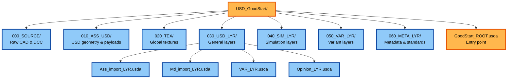
```mermaid
flowchart TD
    root[USD_GoodStart/]:::root
    root --> S000[000_SOURCE/\nRaw CAD & DCC]
    root --> S010[010_ASS_USD/\nUSD geometry & payloads]
    root --> S020[020_TEX/\nGlobal textures]
    root --> S030[030_USD_LYR/\nGeneral layers]
    root --> S040[040_SIM_LYR/\nSimulation layers]
    root --> S050[050_VAR_LYR/\nVariant layers]
    root --> S060[060_META_LYR/\nMetadata & standards]
    root --> RootUsd[GoodStart_ROOT.usda\nEntry point]
    
    S030 --> L_Import[Ass_import_LYR.usda]
    S030 --> L_Mtl[Mtl_import_LYR.usda]
    S030 --> L_Var[VAR_LYR.usda]
    S030 --> L_Opinion[Opinion_LYR.usda]
    
    classDef root fill:#ffb74d,stroke:#e65100,stroke-width:3px,color:#000;
    classDef folder fill:#90caf9,stroke:#0d47a1,stroke-width:3px,color:#000;
    
    class root,RootUsd root;
    class S000,S010,S020,S030,S040,S050,S060,L_Import,L_Mtl,L_Var,L_Opinion folder;
```

**Important Note:** Folder numbers (030, 040, 050, 060) **do not indicate layer order**. Layer order is determined by the `subLayers` array in the root file (`GoodStart_ROOT.usda`), not by folder names. The folder numbers are simply organizational prefixes for clarity and categorization.

---

## ⚠️ Critical Philosophy: Use Only What You Need

**OpenUSD is powerful, but complexity can become overwhelming.**

When you use OpenUSD, you're navigating between peaks on a mountain using a narrow ridge. You can achieve things that are impossible with any other 3D format, but **the abyss is a mile deep**.

This folder structure provides a **complete, ready-to-use foundation** with all possibilities defined. However, **only use what you actually need** for your project.

### Why This Matters

- **Overcomplication Risk**: If you start using all possibilities from the beginning—like adding multiple layers at the asset level when a single layer would suffice, or nesting layers within layers unnecessarily—you can easily create structures that are overcomplicated and hard to maintain.

- **Example Anti-Pattern**: Using an asset in several scenes where the asset is always the same, but then adding layers at the root level of that asset, or within the asset with other layers, when simpler approaches would work.

- **The Threshold**: You need to decide where the complexity threshold is for your project. Start simple, add complexity only when you have a clear need for it.

**Best Practice**: Begin with the minimal structure needed for your use case. Add layers, variants, and metadata layers only when you have a specific requirement that justifies the added complexity.

---

## 6.2.1 Development Mindset & Architecture Principles

**USD Terms & Concepts:** [Composition](https://openusd.org/release/glossary.html#composition), [Layer](https://openusd.org/release/glossary.html#layer), [LayerStack](https://openusd.org/release/glossary.html#layerstack), [Composition Arcs](https://openusd.org/release/glossary.html#composition-arcs), [Value Resolution](https://openusd.org/release/glossary.html#value-resolution), [LIVERPS Strength Ordering](https://openusd.org/release/glossary.html#liverps-strength-ordering)

### Mindset

**Get Started!!! But Start Structured**

- Use a proven foundation like [USD_GoodStart](https://github.com/jph2/USD_GoodStart) to begin with a structured approach
- Having a clear structure from the beginning prevents technical debt and confusion later
- Structure provides a common language for teams and makes onboarding easier

**Start Small**

- Begin with a proof-of-concept (POC) or minimal viable product (MVP)
- Learn incrementally as you evolve with the system
- Discover what works best for your workflows, tools, and requirements through iteration
- Avoid trying to implement everything at once

**Work Cleanly!!! + Document Properly**

- Establish clear team workflows, rules, and standards from the beginning
- Define naming conventions, layer organization rules, path standards, and composition patterns early
- Document decisions, patterns, and anti-patterns as you discover them
- Clean code and structure make collaboration and maintenance possible at scale

**Expect to Make Mistakes, Find Smart Ways to Fix Them**

- Mistakes are part of the learning process
- When issues arise, analyze root causes and document solutions
- Build validation and testing into your pipeline to catch issues early
- Learn from failures and update your practices accordingly

### Architecture

**Use Open Source Wherever You Can**

- Leverage open-source tools, libraries, and frameworks
- Contribute back to the community when possible
- Open source provides transparency, community support, and avoids vendor lock-in

**Adapt the Solution to the Existing Environment**

- Understand your organization's current systems and workflows
- Integrate OpenUSD into existing PLM/PDM/ERP systems rather than replacing them
- Work with your IT infrastructure, not against it
- Respect existing data governance and security requirements

**Get to Know Its Limitations**

- Understand what OpenUSD excels at and where it has limitations
- Know when to use OpenUSD and when other tools are more appropriate
- Be aware of tool limitations (e.g., Blender/Cinema 4D vs. Maya/Houdini USD support)
- Make informed decisions about when to push boundaries vs. when to work within constraints

**Make Conscious Decisions About What Needs to Be Adjusted**

- Don't blindly follow patterns—understand why they exist
- Evaluate trade-offs before making architectural decisions
- Document why you chose a particular approach
- Be prepared to refactor when requirements change

**Develop Modules in Such a Way That a Clear Architecture Emerges**

- Design components to be modular and interchangeable
- Separate concerns: geometry, materials, variants, metadata, simulation
- Create clear interfaces between modules
- Enable teams to work independently on different parts of the system

**Let Backend Handle What Backend Has to Handle**

- PLM/PDM/ERP systems manage product lifecycle, revisions, and business data
- Databases and APIs handle real-time data and queries
- OpenUSD focuses on 3D scene representation and composition
- Use OpenUSD metadata to **reference** backend data, not to duplicate it

**Let Frontend Handle What Frontend Has to Handle**

- Rendering, visualization, and user interaction belong in the frontend
- OpenUSD provides the scene description; rendering engines provide the visualization
- Keep presentation logic separate from data structure
- Design for multiple frontends (Omniverse, web viewers, AR/VR, etc.)

### Metadata Integration

**Check What Is Defined in USD Schemas**

- Before creating custom attributes, check if USD already provides what you need
- Use standard USD schemas (`UsdGeom`, `UsdShade`, `UsdPhysics`, etc.) when possible
- Review [OpenUSD API documentation](https://openusd.org/) for existing schema capabilities
- Standard schemas provide better tool compatibility and future-proofing

**If You Define New Schemas, Make Sure to Coordinate with AOUSD**

- The [Alliance for OpenUSD (AOUSD)](https://aousd.org/) steers OpenUSD's development
- Coordinate schema proposals with AOUSD to ensure compatibility and adoption
- Contribute to open standards rather than creating proprietary extensions
- Follow AOUSD's schema development process and guidelines

**Orient Yourself to Existing Standards**

- **Catena-X**: Automotive industry data standards for supply chain transparency
- **Asset Administration Shell (AAS)**: Industry 4.0 standard for digital twin administration
- **OPC UA**: Industrial automation communication standard
- **Digital Product Passport (DPP)**: European requirement for product traceability and sustainability data
- Use these standards as reference points for metadata structure and naming

**Use Data from the Digital Product Passport (DPP)**

- Europe is making DPP a requirement for many product categories
- DPP provides standardized product information (materials, sustainability, supply chain, etc.)
- Integrate DPP data into your USD metadata layers (`060_META_LYR/`)
- Design your metadata structure to accommodate DPP requirements from the start
- This ensures compliance and future-proofs your digital twin implementations

**Best Practice**: Create dedicated metadata layers (e.g., `DPP_LYR.usda`, `AAS_LYR.usda`) in `060_META_LYR/` that reference external standards and systems, rather than duplicating all data in USD files.

---

## 6.2.2 Collaboration via Task Fragments (Omniverse Digital Twin)

**USD Terms & Concepts:** [Layer](https://openusd.org/release/glossary.html#layer), [LayerStack](https://openusd.org/release/glossary.html#layerstack), [Composition](https://openusd.org/release/glossary.html#composition), [Composition Arcs](https://openusd.org/release/glossary.html#composition-arcs), [Sublayers](https://openusd.org/release/glossary.html#sublayers), [References](https://openusd.org/release/glossary.html#references), [Payload](https://openusd.org/release/glossary.html#payload), [Path](https://openusd.org/release/glossary.html#path), [Namespace](https://openusd.org/release/glossary.html#namespace), [Asset](https://openusd.org/release/glossary.html#asset)

This repository is optimized for **realtime, interactive digital twins** in Omniverse/Kit (not primarily for offline rendering). The collaboration model is still the same core OpenUSD idea: **parallel workstreams** in separate layers that compose together.

### Core rule: one responsibility = one layer

- **Goal**: reduce merge conflicts and accidental “wrong layer” edits by keeping each responsibility isolated.
- **Practice**: treat each task as a **fragment** (a layer change) that can be reviewed, merged, and rolled back independently.

Recommended responsibility split (folder is organizational; layer order comes from `subLayers`):

- **General/visual edits** (`030_USD_LYR/`): materials, layout, “opinions”
- **Simulation edits** (`040_SIM_LYR/`): physics, collisions, sensors, articulation metadata
- **Variants/configuration** (`050_VAR_LYR/`): configuration logic, LOD selection logic
- **Metadata & standards mappings** (`060_META_LYR/`): PLM IDs, AAS mappings, OPC UA node mappings, Catena-X/DPP mapping keys

### Personal opinion vs publishable layers

- **Personal opinions** are useful for exploration and iteration, but they are not automatically “production-ready”.
- Treat opinions as **Draft** until reviewed (especially when they affect shared assets or shared scenes).

### Minimal review workflow (lightweight)

- **Draft → Review → Approved**
  - Draft: local edits, experimentation, rapid iteration
  - Review: check correctness, scope, and layering discipline
  - Approved: mergeable and safe to use in shared stages

---

## 6.2.3 Definition of Done (DoD): “Publishable” for Digital Twins

In an Omniverse context, “publishable” means **safe to load and interact with** in a Kit-based app, and safe to bind to your realtime adapters.

### DoD checklist (recommended)

- **Loadability**
  - Stage opens in Omniverse Kit/Composer
  - No missing layer files, references, or payloads
  - No absolute paths that break portability
- **Layer discipline**
  - Variants live in `050_VAR_LYR/` (not scattered across unrelated layers)
  - Simulation edits live in `040_SIM_LYR/`
  - Metadata mappings live in `060_META_LYR/` (not mixed into random visual layers)
  - “Opinion” layers only contain intended overrides (no accidental geometry imports)
- **Validation**
  - `python scripts/validate_asset.py <asset>` passes for modified assets
  - `python scripts/validate_scene.py GoodStart_ROOT.usda` passes for the composed stage
- **Interactivity readiness (digital twin)**
  - Stable prim paths for anything that external systems bind to
  - Attributes intended for runtime updates are not baked as strong, conflicting opinions in high-strength layers

---

## 6.2.4 Realtime Data Integration + Schemas (Pragmatic Strategy)

### Mental model (Omniverse / Kit)

Realtime data is streamed into Omniverse by having external systems publish data over a protocol/SDK, which is then bound to USD prims and attributes inside a running Kit-based app. The app reacts (Python callbacks, ActionGraph, extensions) and updates the stage in place.

It helps to separate:
- **Frame streaming** (video/pixel streaming) vs
- **Data streaming** (telemetry/commands into USD attributes)

### Raw custom attributes vs schemas

You do **not** need schemas to add metadata:
- Use namespaced custom attributes: `opcua:runtime:temperature`, `aas:submodel:identification`, `plm:id`, etc.

Define schemas when you need:
- **Validation** (types/ranges/defaults)
- **Tooling/UI** (structured property panels, discovery)
- **Interoperability** across teams and apps

**Hybrid best practice**: start with raw namespaced attributes for speed, promote stable fields to schemas when the data model stabilizes and needs stronger guarantees.

### Keep a registry (high leverage)

Maintain a project “what metadata exists” registry:
- Prefixes, concrete fields, source-of-truth, where it is authored, and whether it is runtime-updated

Template: `WIP_Docs/Metadata_Schema_Registry.md`

# References (selected)

- ASWF USD Assets Working Group (community focus incl. asset structure + schema design): `https://lf-aswf.atlassian.net/wiki/spaces/WGUSD/pages/11274232/USD+Assets`
- USDWG Collective Project 001 (collaboration + pipeline organization inspiration): `https://github.com/usd-wg/collectiveproject001`
- AOUSD schema explainer (schemas mental model): `https://aousd.org/blog/explainer-series-for-developers-what-are-openusd-schemas/`
- Omniverse USD schemas (Omniverse-facing schema notes): `https://docs.omniverse.nvidia.com/usd/latest/usd_schemas.html`
- Omniverse streaming technology (frame streaming context): `https://docs.omniverse.nvidia.com/omniverse-dgxc/latest/overview/technical_summary/streaming_technology.html`

# 6.3 Folder-by-Folder Deep Explanation

**Note:** Folder numbers (030, 040, 050, 060) **do not indicate layer order**. Layer order is determined by the `subLayers` array in the root file, not by folder names. These numbers are organizational prefixes for clarity.

## **000_SOURCE/**  
Raw input data:
- STEP, IGES, JT, Parasolid
- Vendor robot models
- Original CAD assemblies
- FBX/OBJ from DCC  
- BIM/IFC files  
- Engineering PDFs (optional metadata)  

**Rules:**  
- Never reference files directly from here.  
- Treat as read-only.  

**Note on Source File Management:**

In enterprise environments, source files (CAD, DCC originals) are often managed by **higher-level systems** such as:
- **PLM (Product Lifecycle Management)** systems
- **PDM (Product Data Management)** systems  
- **ERP (Enterprise Resource Planning)** systems
- Other organizing/paradigm programs

The entire source file management may be handled **entirely differently** in these systems, with their own versioning, access control, and storage strategies. However, **for starting out and learning**, it's good practice to maintain a local `000_SOURCE/` folder structure. This provides:
- **Learning clarity**: Clear visibility of source-to-USD conversion workflow
- **Development flexibility**: Easy access during initial project setup
- **Migration path**: As projects mature, source management can migrate to PLM/PDM/ERP systems while maintaining the USD asset structure

The USD asset structure (`010_ASS_USD/`, `030_USD_LYR/`) remains independent of source file management, allowing flexibility in how source files are organized and versioned.

---

## **010_ASS_USD/**  
Converted USD assets.  
This is where CAD → USD conversion outputs live.

### May contain:
- `assetA_geom.usdc`
- `robot_arm_clean.usdc`
- `pump_highLOD.usdc`
- Subfolders per asset

**Best practice:**  
Each geometric asset has one payload `.usdc` file in this folder.

---

## **030_USD_LYR/**  
Layer-driven composition files for **general USD logic** (visual/layout/material).

These files control *behavior*, not heavy geometry.

### Recommended files:
- **Ass_import_LYR.usda**  
  References payloads from `010_ASS_USD`

- **Mtl_import_LYR.usda**  
  Material assignments and adjustments

- **VAR_LYR.usda**  
  All variant sets

- **Opinion_LYR.usda**  
  Overrides, pose tweaks, shot edits

Pipelines may add:
- `Sim_LYR.usda`
- `Metadata_LYR.usda`
- `IoT_LYR.usda`
- `AAS_LYR.usda` (for Asset Administration Shell mapping, if using AAS)
- `Standards_LYR.usda` (for other standards integration like Catena-X, OPC UA, etc.)

---

## **020_TEX/**  
Texture maps, normal maps, roughness maps, baked light textures, etc.

**Rules:**  
- Use `png`, `jpg`, or `.ktx2` for compression  
- Never reference absolute Windows drive paths  
- Keep textures next to shaders or globally here  

---

## **040_SIM_LYR/**  
Simulation and physics data.

Contents:
- Collision meshes  
- Rigid body definitions  
- Sensor configuration  
- Articulation definitions  
- Isaac Sim metadata  
- Physical materials  

**File formats:**
- USD
- JSON (IoT or physics)
- Python (simulation scripts)  

---

## **050_VAR_LYR/**  
Variant and configuration layers and/or payload references.

Used for LODs, tool options, product variants, and other discrete states.

---

## **060_META_LYR/**  
Metadata and standards integration layers (PLM/ERP/CAD metadata, AAS, OPC UA, Catena-X, etc.).

---

# 6.4 Scene Root File: GoodStart_ROOT.usda

The root file assembles everything:

```usda
(
    subLayers = [
        "./030_USD_LYR/Opinion_LYR.usda",
        "./050_VAR_LYR/VAR_LYR.usda",
        "./030_USD_LYR/Mtl_import_LYR.usda",
        "./030_USD_LYR/Ass_import_LYR.usda"
    ]
)
```

### **Rules:**
- No geometry
- No transforms
- No strong opinions
- Only subLayers

**Important:** The order of layers in the `subLayers` array determines composition strength (first = strongest, last = weakest). Folder numbers (030, 040, 050, 060) do not indicate layer order—you can reference layers from any folder in any order in the `subLayers` array.

This ensures:
- Easy overrides
- Good composition behavior
- Prevents Root Layer Trap

---

# 6.5 Enterprise-Scale Asset Library Structure

For large organizations, structure scales horizontally:

```
/Assets/
    /Robots/
        /UR10/
        /Panda/
    /Conveyors/
    /Sensors/
    /Facility/
        /Walls/
        /Floors/
        /Doors/
    /Furniture/
    /Utilities/
        /Electrics/
        /Pipes/
```

Each asset folder contains:

```
/AssetName/
    000_SOURCE/
    010_ASS_USD/
    020_TEX/
    030_USD_LYR/
    040_SIM_LYR/
    050_VAR_LYR/
    060_META_LYR/
    AssetName_ROOT.usda
```

This allows teams to contribute cleanly to enterprise libraries.

---

# 6.6 Industrial Factory Scene Structure

```
/Factory/
    /Line01/
        /Robots/
        /Sensors/
        /Conveyors/
    /Line02/
    /Shared/
    Factory_ROOT.usda
```

### Each line can be composed separately and linked into the factory scene.

---

# 6.7 Automotive Scene Structure

```
/Vehicle/
    /Body/
    /Interior/
    /Chassis/
    /DriveTrain/
    /Power/
    Vehicle_ROOT.usda
```

Variants map to:
- Engine type  
- Trim levels  
- Equipment package  
- Regional market differences  

---

# 6.8 Multi-Team Collaboration Example

### Team Responsibilities

| Team | Folder / Layers |
|------|-----------------|
| Modelers | 000_SOURCE, 010_ASS_USD |
| Shaders | 020_TEX, 030_USD_LYR/Mtl_Work_LYR |
| Variant Authors | 050_VAR_LYR, 030_USD_LYR/VAR_LYR |
| Simulation | 040_SIM_LYR |
| Metadata / Standards | 060_META_LYR |
| Layout | 030_USD_LYR/Opinion_LYR |
| Pipeline | Root, validation |

Each team edits *only their layer*.

---

# 6.9 Anchoring and Relative Paths

Always use:

```
@./relative/path@
```

Never use:

```
@C:/absolute/path@
@/home/user/...@
```

Anchoring ensures:
- Portability  
- Nucleus compatibility  
- Cloud environment compatibility  
- Version control friendliness  

---

# 6.10 Versioning Strategy

### Folder remains stable  
Asset folder name never changes.

### Versions stored in PLM/PDM/Git  
Not in USD filenames.

### Publish patterns:
- `/publish/v001/Asset.usd`
- `/publish/v002/Asset.usd`

Consumers always reference:
```
@./latest/Asset.usd@
```

---

# 6.11 Integration With Nucleus Servers

Nucleus-friendly layout uses same structure:

```
omniverse://server/Project/
    USD_GoodStart/
    Assets/
    Scenes/
    Materials/
```

Relative paths still work.

---

# 6.12 Common Anti-Patterns

### ❌ One folder per artist  
Leads to chaos.

### ❌ Mixing binaries, source, layers, and scenes  
Hard to automate.

### ❌ Overuse of `_v023` in filenames  
Version control, not filenames, should track history.

### ❌ Materials inside geometry folders  
Reduced reuse.

---

# 6.13 Summary of Chapter 6

| Folder | Purpose |
|--------|---------|
| 000_SOURCE | Raw CAD/DCC input |
| 010_ASS_USD | Geometry/payloads |
| 020_TEX | Global textures |
| 030_USD_LYR | Layers: materials, variants, overrides |
| 040_SIM_LYR | Simulation metadata & sim layers |
| 050_VAR_LYR | Variant/configuration layers |
| 060_META_LYR | Metadata & standards layers |
| Root | Scene/asset entry point |

A clear folder structure is essential for maintainable USD pipelines.

---


## Chapter 7: Path Handling

**USD Terms & Concepts:** [Path](https://openusd.org/release/glossary.html#path), [Path Translation](https://openusd.org/release/glossary.html#path-translation), [Asset Resolution](https://openusd.org/release/glossary.html#asset-resolution), [Asset](https://openusd.org/release/glossary.html#asset), [References](https://openusd.org/release/glossary.html#references), [Payload](https://openusd.org/release/glossary.html#payload), [Sublayers](https://openusd.org/release/glossary.html#sublayers), [Namespace](https://openusd.org/release/glossary.html#namespace)

**Critical**: Always use **relative paths** in USD files for portability and collaboration.

# 7.1 Why Relative Paths Matter

- ✅ **Portability**: Projects can be moved or shared without breaking references
- ✅ **Collaboration**: Works across different machines and operating systems
- ✅ **Version Control**: Relative paths work correctly in Git repositories
- ❌ **Absolute paths break** when projects are moved, shared, or accessed from different locations

# 7.2 Path Format Examples

### Layer References (in root file)
```usda
subLayers = [
    @./030_USD_LYR/Opinion_xyz_LYR.usda@,
    @./050_VAR_LYR/VAR_LYR.usda@,
    @./030_USD_LYR/Mtl_import_LYR.usda@,
    @./030_USD_LYR/Ass_import_LYR.usda@
]
```

### Asset References (in layer files)
```usda
def Xform "PartAssembly" (
    prepend references = @../010_ASS_USD/part_assembly.usd@
)
{
    # Asset referenced using relative path
}
```

### Texture References (in material definitions)
```usda
asset inputs:diffuse_texture = @../020_TEX/texture_name.png@ (
    colorSpace = "sRGB"
)
```

# 7.3 Path Resolution Logic

- **USD's `@` syntax**: The `@` symbols indicate USD asset paths
- **Relative path resolution**: USD resolves paths relative to the file containing the reference
- **Scripts use `.resolve()` internally**: Validation scripts convert paths to absolute for checking, but USD files should contain relative paths
- **Path examples**:
  - `@./030_USD_LYR/file.usda@` - Same directory level
  - `@../010_ASS_USD/asset.usd@` - One directory up
  - `@../../textures/texture.png@` - Two directories up

# 7.4 Common Mistakes to Avoid

❌ **Don't use absolute paths**:
```usda
# BAD - Breaks when project is moved
prepend references = @C:/Projects/USD_GoodStart/010_ASS_USD/asset.usd@
```

✅ **Use relative paths**:
```usda
# GOOD - Works anywhere
prepend references = @../010_ASS_USD/asset.usd@
```
...

## Chapter 8: Tools & Software

**USD Terms & Concepts:** [Stage](https://openusd.org/release/glossary.html#stage), [Layer](https://openusd.org/release/glossary.html#layer), [Prim](https://openusd.org/release/glossary.html#prim), [Composition](https://openusd.org/release/glossary.html#composition), [UsdView](https://openusd.org/release/glossary.html#usdview), [usdcat](https://openusd.org/release/glossary.html#usdcat), [usdedit](https://openusd.org/release/glossary.html#usdedit), [usdzip](https://openusd.org/release/glossary.html#usdzip), [usdresolve](https://openusd.org/release/glossary.html#usdresolve), [Crate File Format](https://openusd.org/release/glossary.html#crate-file-format)

# 8.1 Required Software

### Omniverse Kit/App
- **Omniverse Composer** (recommended version: Latest stable)
- **Omniverse Kit SDK** (for extension development)
- Download from [NVIDIA Omniverse](https://www.nvidia.com/en-us/omniverse/)

### Python Environment
- Python 3.8+ (Python 3.10+ recommended)
- `usd-core` package: `pip install usd-core`
- Additional packages may be required for CAD conversion

### USD Tools
- **USD Python API** (`usd-core` from PyPI) - Python bindings for USD
- **[usdview](https://github.com/PixarAnimationStudios/OpenUSD)** - **The classic USD validation and inspection tool** from Pixar:
  - Essential for validating USD files and checking structure
  - Inspect prims, attributes, relationships, and composition
  - Visualize USD scenes and debug composition issues
  - Part of the official OpenUSD repository
- **USD C++ SDK** (optional) - For advanced development and custom plugins

# 8.2 CAD Tools (For CAD-to-USD Workflows)

### CAD Software
- CATIA, SolidWorks, Autodesk Inventor, or similar
- Rhino 3D
- STEP file support (for intermediate conversion)

### CAD Conversion Tools
- **[NVIDIA Omniverse CAD Converter Extension](https://docs.omniverse.nvidia.com/extensions/latest/ext_cad-converter.html)** - **Recommended Production Solution**
- **[CAD-to-OpenUSD](https://github.com/nAurava-Technologies/CAD-to-OpenUSD)** - Open-source conversion scripts
- **[NVIDIA Omniverse Connectors](https://docs.omniverse.nvidia.com/connect/latest/3rd-party-connectors.html)** - Production-ready connectors for 3ds Max, Maya, Revit, etc.
- **[OpenUSD Exchange SDK](https://github.com/NVIDIA-Omniverse/usd-exchange)** - SDK for building custom USD I/O plugins

# 8.3 DCC Tools (For Content Creation)

### 3D Software
- **Houdini** (`.hiplc` files) - **Full USD support** with layering and referencing
- **Maya** (`.ma`/`.mb` files) - **Full USD support** with layering and referencing
- **3ds Max** - **Full USD support** with layering and referencing
- **Blender** (USD export support) - **Limited: Read/write only, no layering/referencing**
- **Cinema 4D** - **Limited: Read/write only, no layering/referencing**

### Important: DCC Tool Limitations

Some DCC tools have **significant limitations** when working with USD:

**Blender, Cinema 4D, and Similar Tools:**
- ✅ Can **read and write** USD files (`.usd`, `.usda`, `.usdc`, `.usdz` formats)
- ❌ **Do NOT support** USD's core composition features:
  - No layering support (cannot work with sublayers)
  - No referencing support (cannot create or maintain references)
  - No composition arcs (LIV(E)RPS) support
  - No non-destructive workflows
- ⚠️ **Work destructively** - These tools modify USD files directly without preserving composition structure
- 📍 **Use case**: Can only be used to create **"endpoint" assets** (the lowest sublayer - the asset itself)
- ❌ **Cannot be used** for modifying layers on top of assets or working with USD's composition system

**Recommendation:**
- Use **Maya, Houdini, or 3ds Max** for USD workflows that require layer-based modifications, referencing, and non-destructive editing.
- Use **Blender/C4D** only for creating final export assets that will be referenced by other USD files.

# 8.4 Houdini: The Powerhouse for USD Pipeline Automation

Houdini stands out as the premier tool for USD pipeline development and automation, offering capabilities that complement and extend beyond what Omniverse provides.

**Why Houdini is Essential:**
- 🎯 **Best USD Integration**: Deepest USD support apart from Omniverse itself.
- 🎨 **Visual Variant Creation**: Visually cleaner and more intuitive variant building.
- 🔄 **Reusable Workflows**: Create templates and tools that scale across projects.
- 🤖 **Pipeline Automation**: Excellent for batch processing and complex transformations.
- ✏️ **Geometry Modeling**: Full modeling capabilities (unlike Omniverse).
- ⚡ **Procedural Power**: Generate complex USD structures procedurally.

**Integration Strategy:**
- Store Houdini files (`.hiplc`) in the project root
- Use Houdini to create variants, process assets, and automate workflows
- Export processed USD files to `010_ASS_USD/` for use in the scene

# 8.5 Version Control Tools

**Version control is essential for USD projects** to enable collaboration, history tracking, and rollback capabilities.

### Version Control Options Comparison

| Solution | Best For | Integration | Key Features | Limitations |
|----------|----------|-------------|--------------|-------------|
| **[Omniverse Nucleus](https://docs.omniverse.nvidia.com/nucleus/latest/index.html)** | **Omniverse-native workflows** | **Tightest integration** with Omniverse Kit/Apps | • **Live collaboration**<br/>• **Checkpoints**<br/>• **USD-native**<br/>• **Centralized asset management** | • Requires Nucleus Server setup<br/>• Less suitable for non-USD workflows |
| **Git + Git LFS** | **Open-source, flexible workflows** | Works with any tool | • **Industry standard**<br/>• **Open source**<br/>• **Branching & merging**<br/>• **CI/CD integration** | • Steeper learning curve<br/>• Binary file handling complexity<br/>• No real-time collaboration |
| **[Anchorpoint](https://www.anchorpoint.app/)** | **Teams without version control** | Works with existing folder structure | • **Artist-friendly**<br/>• **Git-based**<br/>• **File locking**<br/>• **DCC integration** | • Commercial tool<br/>• Requires Git server setup |
| **[Diversion.dev](https://www.diversion.dev/)** | **Game/3D pipelines, Unreal Engine** | Direct Unreal Engine plugin | • **Cloud-native**<br/>• **Unreal integration**<br/>• **Fast uploads** | • Closed ecosystem<br/>• Limited integrations |
| **[Assembla](https://get.assembla.com/)** | **Enterprise compliance** | Git/SVN/Perforce repos | • **Enterprise compliance**<br/>• **Hosted Perforce**<br/>• **Strong security** | • Enterprise pricing<br/>• Manual import/export workflow |
| **PLM/PDM/ERP Systems** | **Established organizations** | Enterprise integration | • **Already in place**<br/>• **Lifecycle management**<br/>• **Enterprise-grade** | • May not be USD-native<br/>• Integration complexity |

### Recommendation: Combining Systems
Modern USD pipelines often benefit from combining systems:
1. **Use Nucleus for live collaboration** (Omniverse <-> Unreal)
2. **Use traditional VCS (Git/Perforce) for long-term versioning**, backup, and compliance.

# 8.6 Additional Tools

- **[ShapeFX Loki](https://shapefx.app/)** - **Promising USD-native tool** based on OpenDCC:
  - Native USD reading and editing
  - Material Editor with MaterialX support
  - Hydra rendering
  - Python scripting and layer management
  - **Apache 2.0 license** (OpenDCC framework)
...


## Chapter 9 — CAD to USD Workflow (Full Expansion)

**USD Terms & Concepts:** [Asset](https://openusd.org/release/glossary.html#asset), [Asset Resolution](https://openusd.org/release/glossary.html#asset-resolution), [Payload](https://openusd.org/release/glossary.html#payload), [References](https://openusd.org/release/glossary.html#references), [Prim](https://openusd.org/release/glossary.html#prim), [Gprim](https://openusd.org/release/glossary.html#gprim), [Attribute](https://openusd.org/release/glossary.html#attribute), [Property](https://openusd.org/release/glossary.html#property), [Material Binding](https://openusd.org/release/glossary.html#material-binding), [Collection](https://openusd.org/release/glossary.html#collection), [Variant](https://openusd.org/release/glossary.html#variant), [VariantSet](https://openusd.org/release/glossary.html#variantset), [Kind](https://openusd.org/release/glossary.html#kind), [Model Hierarchy](https://openusd.org/release/glossary.html#model-hierarchy)

The CAD → USD pipeline is foundational for industrial digital twins, robotics, and manufacturing.  
Most of the heavy geometry used in USD originates from engineering systems such as CATIA, NX, SolidWorks, Creo, or Inventor.

This chapter provides a complete production workflow for converting CAD data into efficient, structured, simulation-ready USD assets.

---

# 9.1 Overview of the CAD → USD Pipeline

Typical end-to-end flow:

```
CAD Source → CAD Preprocessing → Tessellation → USD Geometry → USD Payload → Material Layer → Variants → Simulation Layer
```

This pipeline preserves:
- Geometry fidelity  
- Metadata  
- Product structure (assembly hierarchy)  
- Material semantics  
- Engineering identifiers (PLM IDs, CAD part numbers)  

```mermaid
flowchart TD
    %% Vertical Pipeline for readability
    CAD[CAD Source\n(CATIA, NX, SW, JT...)] --> Pre[CAD Preprocessing\nClean & simplify]
    Pre --> Tess[Tessellation\n(surface → mesh)]
    Tess --> Geo[Geometry Cleanup\nLOD, instancing, flatten hierarchy]
    Geo --> USDGeom[USD Payload\n010_ASS_USD/*.usdc]
    USDGeom --> Layers[Layer Stacking\n030_USD_LYR/*.usda]
    Layers --> Mtl[Material Mapping\nMtl_Work_LYR]
    Mtl --> Var[Variant Authoring\nLOD, options]
    Var --> Sim[Simulation Data\n040_SIM: collisions, joints]
    Sim --> Publish[Publish & Validate\nusdchecker, CI/CD]

    classDef step fill:#90caf9,stroke:#0d47a1,stroke-width:3px,color:#000;
    classDef heavy fill:#f48fb1,stroke:#880e4f,stroke-width:3px,color:#000;

    class CAD,Pre,Tess,Geo,USDGeom,Layers,Mtl,Var,Sim,Publish step;
    class USDGeom heavy;
```


---

# 9.2 Supported CAD Formats

Common formats:

| CAD Type | Extensions | Notes |
|----------|------------|-------|
| Neutral CAD | `.step`, `.stp`, `.igs`, `.iges` | Best interoperability |
| Parasolid | `.x_t`, `.x_b` | Very common in PLM |
| JT | `.jt` | Lightweight Siemens format |
| NX | `.prt` | Native Siemens |
| CATIA V5/V6 | `.catpart`, `.catproduct` | Automotive & aerospace |
| SolidWorks | `.sldprt`, `.sldasm` | SMB manufacturing |
| Creo | `.prt`, `.asm` | Engineering heavy |

Convert all CAD into **tessellated meshes** for USD payloads.

---

# 9.3 CAD Preprocessing

Before tessellation:

### ✔ Ensure clean CAD representation
- Remove construction geometry  
- Remove sketches & parameters  
- Suppress manufacturing-only features  
- Simplify fillets, chamfers, threads  
- Avoid non-manifold surfaces  

### ✔ Decide on level of detail
High-resolution CAD may produce:
- Millions of polygons  
- Very deep hierarchies  
- Large disk footprint  

Create:
- **High LOD**: Full fidelity  
- **Medium LOD**: 50% tessellation  
- **Low LOD**: Proxy collision mesh  

---

# 9.4 Tessellation

CAD → Mesh conversion.

Key parameters:
- Chord height deviation  
- Angle tolerance  
- Max edge length  
- Normal consistency  

Recommendation:
- Use **medium** tessellation for most digital twin use cases  
- Use **high** tessellation only for hero assets  

---

# 9.5 USD Geometry Generation

Place tessellated geometry in:

```
010_ASS_USD/Asset_payload.usdc
```

A minimal payload file:

```usda
def Xform "RobotBase" {
    def Mesh "Housing" {
        int[] faceVertexCounts = [...]
        int[] faceVertexIndices = [...]
        point3f[] points = [...]
    }
}
```

Save heavy data in binary `.usdc`—never `.usda`.

---

# 9.6 Geometry Cleanup / Post-Processing

After tessellation, perform:

### ✔ Mesh decimation  
Reduce triangle count by 40–80% without visibly losing quality.

### ✔ Normal unification  
Ensure consistent shading.

### ✔ Instance detection  
CAD exports often replicate bolts/brackets thousands of times.

Convert these to **point instancers**:

```usda
def PointInstancer "Bolts" {
    rel prototypes = </BoltPrototype>
    matrix4d[] xforms = [...]
}
```

### ✔ Hierarchy flattening  
Overly deep CAD structure slows USD traversal.

Flatten from:
```
/Assembly/SubA/SubB/SubC/Body
```

to:
```
/Asset/Body
```

---

# 9.7 Mapping CAD Structure to USD Structure

CAD hierarchies reflect **design intent**.  
USD hierarchies reflect **runtime intent**.

Transformations:

| CAD Element | USD Translation |
|-------------|-----------------|
| Product Root | Asset Root |
| Part | Xform |
| Body | Mesh |
| Assembly | Xform / Scope |
| Material | Material/Shader |

Keep:
- Product identity  
- Assembly semantics  

Remove:
- Manufacturing steps  
- Parametric construction  

---

# 9.8 Metadata Migration

Critical metadata to preserve:

- Part number  
- Material name  
- Supplier  
- PLM ID  
- Revision number  
- Engineer  
- Release date  

Use **custom attributes**:

```usda
string digitalTwin:plmId = "P-99861"
string cad:partNumber = "AX-4920"
string cad:material = "Aluminum_6061"
```

---

# 9.9 Creating USD Payloads

Payload pattern:

```usda
def Xform "Pump" (
    prepend payload = @./Pump_payload.usdc@
)
{
}
```

Payload file contains:
- Heavy geometry  
- CAD-structured hierarchy  
- **ST (texture coordinates, commonly called UVs)** — see section 9.9.1 below  
- Instancer prototypes  

---

# 9.9.1 Critical: Texture Coordinates Are Called "ST" in OpenUSD

**⚠️ Important Terminology Note:**

In OpenUSD, texture coordinates are **not called "UVs"**—they are called **"ST"** (or `st` in code). This terminology difference often confuses artists and developers coming from other DCC tools.

**Why "ST" instead of "UV"?**
- OpenUSD uses mathematical notation: **S** and **T** are the two-dimensional texture coordinate axes (analogous to X and Y in 2D space)
- This follows the convention used in computer graphics literature and shader programming
- The attribute name in USD is `primvars:st` (not `primvars:uv`)

**In Practice:**
```usda
def Mesh "PumpHousing" {
    # Texture coordinates are stored as:
    float2[] primvars:st = [(0, 0), (1, 0), (1, 1), (0, 1)]  # ✅ Correct
    # NOT primvars:uv  # ❌ This doesn't exist in USD
}
```

**CAD-to-USD Conversion:**
When converting CAD models to USD, **preserve texture coordinates (ST) when available**. Many CAD formats include UV mapping information that should be maintained during conversion:

- **Preserve ST coordinates** from source CAD files (if present)
- **Map CAD UV data** to USD `primvars:st` attributes
- **Validate ST coordinates** after conversion to ensure they're in the expected range (typically 0-1)
- **Document ST availability** in asset metadata if texture coordinates are missing

**Common Confusion Points:**
- Artists may look for "UVs" in USD files and not find them—they need to look for `primvars:st`
- DCC tools may display "UV" in their UI, but the underlying USD data uses `st`
- When scripting or querying USD, use `primvars:st` (not `primvars:uv`)

**Best Practice:**
Always refer to texture coordinates as **"ST"** in USD documentation and code to avoid confusion. When communicating with artists, you can clarify: "ST (texture coordinates, commonly called UVs in other tools)."

---

# 9.10 LOD Creation

LOD variants are mandatory in CAD pipelines.

Folder layout:

```
050_VARIANTS/
    pump_LOD0.usdc
    pump_LOD1.usdc
    pump_LOD2.usdc
```

Variant definition:

```usda
variantSet "LOD" = "LOD0" {
    "LOD0" { prepend payload = @./pump_LOD0.usdc@ }
    "LOD1" { prepend payload = @./pump_LOD1.usdc@ }
    "LOD2" { prepend payload = @./pump_LOD2.usdc@ }
}
```

---

# 9.11 Material Conversion

CAD materials are usually symbolic.

Map them to USD/MDL materials:

```
cad:material = "Steel_S304"
```

Map to:

```
/Materials/M_Steel
```

Use `Mtl_import_LYR.usda` to bind materials.

---

# 9.12 Collision Mesh Generation

Simulation requires low-poly collision geometry.

Export:
- Convex hulls  
- Simplified meshes  
- Primitive collisions (box, capsule, sphere)  

Example:

```usda
def Sphere "Collision" {
    float radius = 0.5
    rel physics:material:binding = </Materials/PM_Steel>
}
```

Place these in:

```
040_SIM/Physics_LYR.usda
```

---

# 9.13 Robotics: Articulations & Joints

CAD joints → USD articulation hierarchies.

Example:

```usda
def Joint "Shoulder" {
    token jointType = "revolute"
    float physics:lowerLimit = -3.14
    float physics:upperLimit = 3.14
    rel physics:body0 = </Robot/Base>
    rel physics:body1 = </Robot/Arm1>
}
```

Articulations appear in Isaac Sim.

---

# 9.14 Automation: CAD Conversion Scripts

Example Python snippet:

```python
from pxr import Usd, UsdGeom, Sdf

stage = Usd.Stage.CreateNew("robot_payload.usdc")
root = UsdGeom.Xform.Define(stage, "/Robot")

# Import cleaned meshes
mesh = UsdGeom.Mesh.Define(stage, "/Robot/Body")
mesh.CreatePointsAttr([...])
mesh.CreateFaceVertexCountsAttr([...])
mesh.CreateFaceVertexIndicesAttr([...])

stage.GetRootLayer().Save()
```

Automate this process in CI/CD.

---

# 9.15 Enterprise CAD → USD Pipeline

### Step-by-step:

1. **CAD Export**  
   Export STEP/JT or native CAD.

2. **Preprocess**  
   Clean, remove parametric junk.

3. **Tessellate**  
   Generate consistent meshes.

4. **Optimize**  
   Decimate, unify normals, detect instancers.

5. **Convert to USD**  
   Produce `.usdc` payloads.

6. **Apply Materials**  
   Add binding layer.

7. **Add Variants**  
   LOD + configuration sets.

8. **Add Simulation Layer**  
   Collisions, joints, physics materials.

9. **Publish**  
   Upload to Nucleus or publish pipeline.

10. **Validate**  
    usdchecker, path scan, metadata validation.

---

# 9.16 Anti-Patterns in CAD Pipelines

### ❌ Putting tessellated geometry in `.usda`  
Too slow and too large.

### ❌ Maintaining the original CAD hierarchy  
Often 10–50 levels deep—breaks USD performance.

### ❌ No LODs  
Massive performance impact.

### ❌ No instancing  
Bolts repeated thousands of times = gigabytes of data.

### ❌ No metadata preservation  
Lose critical engineering context.

---

# 9.17 Summary

| Stage | Purpose |
|--------|---------|
| CAD preprocessing | Clean geometry |
| Tessellation | Convert to mesh |
| USD payload | Store heavy geometry |
| LOD creation | Performance |
| Material mapping | Visual fidelity |
| Collision generation | Simulation |
| Metadata migration | Engineering context |
| Publishing | Distribution |

A robust CAD → USD workflow ensures your industrial assets are lightweight, scalable, accurate, and ready for simulation.

---


## Chapter 10 — Metadata Strategy (Full Expansion)

**USD Terms & Concepts:** [Metadata](https://openusd.org/release/glossary.html#metadata), [AssetInfo](https://openusd.org/release/glossary.html#assetinfo), [CustomData](https://openusd.org/release/glossary.html#customdata), [Prim](https://openusd.org/release/glossary.html#prim), [Property](https://openusd.org/release/glossary.html#property), [Attribute](https://openusd.org/release/glossary.html#attribute), [Relationship](https://openusd.org/release/glossary.html#relationship), [Kind](https://openusd.org/release/glossary.html#kind), [Purpose](https://openusd.org/release/glossary.html#purpose), [Collection](https://openusd.org/release/glossary.html#collection), [Layer](https://openusd.org/release/glossary.html#layer), [Composition](https://openusd.org/release/glossary.html#composition)

Metadata is the backbone of industrial USD pipelines.  
Geometry describes what an object looks like — **metadata describes what an object *is***.

Metadata enables:
- Digital thread continuity  
- Traceability (PLM → USD → Simulation → IoT)  
- Automated scene reasoning  
- Simulation correctness  
- Industrial interoperability  
- AI/ML labeling  
- Semantic queries (“find all pumps with flow rate > 50L/min”)  

This chapter provides the most comprehensive metadata strategy for OpenUSD in industrial, robotics, and enterprise environments.

---

# 10.1 Types of Metadata in USD

USD offers multiple ways to store metadata:

| Type | Example | Purpose |
|------|---------|---------|
| **Prim Metadata** | `assetInfo`, `kind`, `doc` | Describe asset-level facts |
| **Custom Attributes** | `string cad:partNumber` | Frequently-used metadata |
| **Primvars** | `primvars:temperature` | Simulation & shader data |
| **customData** | JSON-like dictionaries | Arbitrary structured metadata |
| **Schemas** | Custom API schemas | Enterprise-level validation |

Each serves different needs.

---

# 10.2 Prim Metadata (Built-in)

Examples:

```usda
def Xform "Pump" (
    kind = "component"
    assetInfo:identifier = "Pump_4389"
    assetInfo:version = "v12.3"
)
```

Use for:
- Asset identity  
- Documentation  
- Asset versioning  
- Asset category  

Do **not** store engineering metadata here.

---

# 10.3 Custom Attributes (Recommended for Most Metadata)

Examples:

```usda
string cad:material = "Aluminum_6061"
string cad:partNumber = "AX-2032"
string digitalTwin:plmId = "PLM-98277"
token maintenance:status = "operational"
float sim:flowRate = 32.5
```

### Why custom attributes?

✔ Human-readable  
✔ Easy to query  
✔ Serializable  
✔ Good for PLM/ERP mappings  
✔ Works across all DCC tools  
✔ Can be namespaced

---

# 10.4 Namespacing Strategy (Critical)

Recommended namespaces:

- `cad:` — CAD-derived metadata  
- `plm:` — PLM system data  
- `erp:` — Enterprise resource metadata  
- `sim:` — Simulation metadata  
- `dt:` — Digital twin runtime metadata  
- `maintenance:` — OEE / maintenance data  
- `aas:` — Asset Administration Shell mapping (if using AAS standard)  
- `catena:` — Catena-X integration (if using Catena-X)  
- `opcua:` — OPC UA information models (if using OPC UA)  
- `semantic:` — ML/AI labels  

Example:

```usda
string plm:serialNumber = "SN-882992"
float sim:mass = 12.4
token semantic:category = "RobotArm"
```

---

# 10.5 customData (JSON-like Dictionaries)

Useful for structured metadata:

```usda
customData = {
    string productLine = "PumpSeriesA"
    string manufacturer = "Kuka Industrial"
    int warrantyYears = 2
}
```

Store multi-field objects that belong together.

---

# 10.6 Storing Engineering Metadata

Examples:

```usda
string cad:material = "Steel_304"
string cad:surfaceFinish = "Anodized_Blue"
token cad:tolerance = "Fine"
float cad:weight = 14.2
```

CAD → USD converters should write this metadata in **030_USD_LYR/Metadata_LYR.usda**.

---

# 10.7 Storing PLM / ERP Metadata

Use these conventions:

```usda
string plm:id = "PLM-002998"
string plm:revision = "R3"
string plm:supplier = "Bosch Rexroth"
string plm:costCenter = "MFG-32"
```

---

# 10.8 Storing Simulation Metadata

Simulation metadata should be consistent across tools.

Example:

```usda
float sim:mass = 2.3
float sim:friction = 0.32
float sim:temperature = 78.2
float sim:maxRpm = 3500
token sim:state = "running"
```

---

# 10.9 Storing IoT / Runtime Metadata

Digital twin runtime engines (e.g., Omniverse, TwinMaker) often inject metadata.

Example:

```usda
float dt:iot:lastValue = 22.92
double dt:iot:timestamp = 1712012349.0
token dt:iot:status = "nominal"
```

---

# 10.10 Schema-Based Metadata (Advanced)

For large enterprises, define **USDSchema** extensions.

Example schema (Python):

```python
class IndustrialMetadataAPI(UsdAPISchemaBase):
    mass = Usd.AttributeSpec("industrial:mass", Sdf.ValueTypeNames.Double)
    serialNumber = Usd.AttributeSpec("industrial:serialNumber", Sdf.ValueTypeNames.String)
```

Advantages:
- Enforces type  
- Enforces presence  
- Enables validation  
- Prevents typos  
- Industrial interoperability  

---

# 10.11 Enterprise Standards Integration (Example: Asset Administration Shell)

Various Industry 4.0 standards and frameworks can be integrated with USD assets. The **Asset Administration Shell (AAS)** is one example standard that some organizations use for digital twin administration, but different approaches may be appropriate depending on your environment, existing systems, and requirements (e.g., Catena-X, OPC UA, custom solutions).

**Note:** Standards integration is an evolving area with different opinions and approaches. Choose solutions that fit your specific context rather than adopting standards rigidly.

**Combining Standards:** Research institutions have demonstrated that standards can be **combined** rather than requiring a choice between them. For example, AAS and OPC UA can be integrated together, allowing organizations to use the best aspects of each standard. This hybrid approach enables:
- Leveraging AAS for asset administration and lifecycle management
- Using OPC UA for real-time data communication and information models
- Combining both in a modular architecture where components are exchangeable
- Adapting to existing infrastructure without forcing a single-standard solution

**Example: AAS Mapping to USD** (if using AAS):

| AAS Concept | USD Mapping |
|-------------|-------------|
| Submodel | Namespace (e.g., `aas:`) |
| Property | Custom attribute |
| Relationship | USD relationship |
| Operations | USD custom schema |

Example USD metadata using AAS namespace:

```usda
string aas:submodel:identification = "PumpType42"
float aas:operating:temperature = 55.0
```

**Combined AAS + OPC UA Example:**

```usda
# AAS metadata for asset administration
string aas:submodel:identification = "PumpType42"

# OPC UA data for real-time operational values
float opcua:runtime:temperature = 55.0
float opcua:runtime:pressure = 2.3
token opcua:status = "running"
```

**Alternative approaches** might use different namespaces:
- `catena:` for Catena-X integration
- `opcua:` for OPC UA information models
- `custom:` for organization-specific standards
- Or no namespace if using simple custom attributes
- **Combined namespaces** when using multiple standards together

### How Standards Data Integration Works Through Layers

**Yes, exactly!** Standards data (AAS, OPC UA, Catena-X, etc.) is integrated into USD assets **layer by layer** using the same non-destructive layer stacking system. Here's how it works:

**1. Create a Standards Layer**

Create a dedicated layer file (e.g., `AAS_LYR.usda` or `Standards_LYR.usda`) in your `030_USD_LYR/` folder:

```usda
# AAS_LYR.usda - Standards data integration layer
over "Pump" {
  # Connect AAS data to existing prims using 'over' (non-destructive override)
  string aas:submodel:identification = "PumpType42"
  string aas:manufacturer = "Bosch Rexroth"
  float aas:operating:temperature = 55.0
}

over "Conveyor" {
  string aas:submodel:identification = "ConveyorBelt_A"
  float aas:operating:speed = 2.5
}
```

**2. Add the Layer to Your Root File**

Include the standards layer in your root file's `subLayers` array. The position in the stack determines when standards data is applied:

```usda
# GoodStart_ROOT.usda
(
  subLayers = [
  @./030_USD_LYR/Opinion_LYR.usda@,           # opinions of somebody
  @./050_VAR_LYR/VAR_LYR.usda@,      # Variants 
  @./030_USD_LYR/Mtl_import_LYR.usda@,      # Material adjustments
  @./060_META_LYR/OPCUA_LYR.usda@,        # OPC UA real-time data
  @./060_META_LYR/AAS_LYR.usda@,          # AAS asset administration
  @./060_META_LYR/CatenaX_LYR.usda@,      # Catena-X supply chain data
  @./030_USD_LYR/Ass_import_LYR.usda@        # Geometry/assets
  ]
)
```

**3. How Data Flows Through Layers**

The layer stack processes from **bottom to top** (weakest to strongest):

```
1. Ass_import_LYR.usda (bottom)
   ↓ Loads geometry/assets
   
2. AAS_LYR.usda
   ↓ Adds standards metadata to loaded prims
   
3. Mtl_import_LYR.usda
   ↓ Adds materials (can reference standards data)
   
4. VAR_LYR.usda
   ↓ Adds variants (can use standards data for configuration)
   
5. Opinion_xyz_LYR.usda (top)
   ↓ Final overrides (can override standards data if needed)
```

**4. Connecting Standards Data to Existing Prims**

Use `over` to add standards data to prims that were loaded in lower layers:

```usda
# AAS_LYR.usda
# This layer connects AAS data to prims loaded in Ass_import_LYR.usda

over "Pump" {
  # These attributes are added to the Pump prim
  string aas:submodel:identification = "PumpType42"
  float aas:operating:temperature = 55.0
  
  # You can also add data to nested prims
  over "Motor" {
    string aas:submodel:identification = "Motor_TypeA"
    float aas:power:rating = 5.5  # kW
  }
}
```

**5. Multiple Standards Layers**

You can have **separate layers for different standards**, allowing modular integration:

```usda
# Root.usda
subLayers = [
  @./030_USD_LYR/Opinion_LYR.usda@,           # opinions of somebody
  @./050_VAR_LYR/VAR_LYR.usda@,      # Variants 
  @./030_USD_LYR/Mtl_import_LYR.usda@,          # Material adjustments
  @./060_META_LYR/OPCUA_LYR.usda@,        # OPC UA real-time data
  @./060_META_LYR/AAS_LYR.usda@,          # AAS asset administration
  @./060_META_LYR/CatenaX_LYR.usda@,      # Catena-X supply chain data
  @./030_USD_LYR/Ass_import_LYR.usda@        # Geometry/assets
]
```

Each standards layer adds its own metadata to the same prims:

```usda
# AAS_LYR.usda
over "Pump" {
  string aas:submodel:identification = "PumpType42"
}

# OPCUA_LYR.usda (loaded after AAS_LYR, so it's stronger)
over "Pump" {
  float opcua:runtime:temperature = 55.0  # Real-time value
  float opcua:runtime:pressure = 2.3
}
```

**Result:** The `Pump` prim now has both AAS identification AND OPC UA runtime data.

**6. Dynamic Data Updates**

For **live data** (sensor feeds, IoT, real-time systems), you can update the layer dynamically:

```usda
# OPCUA_LYR.usda - Can be updated by external systems
over "Pump" {
  # These values can be updated by OPC UA clients
  float opcua:runtime:temperature = 55.0  # Updated from sensors
  float opcua:runtime:pressure = 2.3     # Updated from sensors
  token opcua:status = "running"          # Updated from control system
}
```

**7. Complete Example: Layer-by-Layer Integration**

```usda
# Ass_import_LYR.usda (bottom layer - loads geometry)
def Xform "Pump" (
  prepend payload = @../010_ASS_USD/Pump_payload.usdc@
)
{
  # Geometry loaded, but no standards data yet
}

# AAS_LYR.usda (adds AAS metadata)
over "Pump" {
  string aas:submodel:identification = "PumpType42"
  string aas:manufacturer = "Bosch Rexroth"
}

# OPCUA_LYR.usda (adds real-time OPC UA data)
over "Pump" {
  float opcua:runtime:temperature = 55.0
  float opcua:runtime:pressure = 2.3
}

# VAR_LYR.usda (can use standards data for configuration)
over "Pump" {
  variantSet "Configuration" = "Standard" {
    "Standard" {
      # Variant can reference AAS data
      string model:variant = "Standard"
    }
    "HighPerformance" {
      string model:variant = "HighPerformance"
    }
  }
}

# Opinion_xyz_LYR.usda (top layer - final overrides)
over "Pump" {
  # Can override standards data if needed for this specific scene
  float opcua:runtime:temperature = 60.0  # Override for testing
}
```

**Key Benefits of Layer-Based Standards Integration:**

✅ **Non-destructive:** Standards data doesn't modify source geometry files  
✅ **Modular:** Each standard gets its own layer, can be enabled/disabled  
✅ **Composable:** Multiple standards can work together on the same prims  
✅ **Overrideable:** Higher layers can override standards data when needed  
✅ **Maintainable:** Standards data is separate from geometry and materials  
✅ **Dynamic:** Real-time data layers can be updated without touching geometry  

**Summary:** Yes, you add a layer (e.g., `AAS_LYR.usda`) where standards data comes in and connects to existing prims. The data flows through the entire system layer by layer, with each layer adding its contribution to the final composed result.

**Official Documentation References:**

**Important Note:** USD does not have named concepts like "AAS layers" or "OPC UA layers." However, the pattern described above is a **valid application of core USD mechanisms** documented in Pixar's official USD documentation. The following links point to the exact USD concepts that enable this pattern.

**URL Note:** The `graphics.pixar.com` and `openusd.org` URLs are the official USD/OpenUSD documentation sites. The `graphics.pixar.com` URLs may redirect to `openusd.org` in some cases. All links below have been verified as of the last guide update.

**1. Using Layers to Integrate Different Data Sources:**
- **[USD Glossary → Layer](https://graphics.pixar.com/usd/release/glossary.html#usdglossary-layer)** - Definition of USD layers
- **[USD Composition → Sublayers](https://docs.nvidia.com/learn-openusd/latest/creating-composition-arcs/sublayers/what-are-sublayers.html)** - Official documentation on sublayers and layer stacking
  - *Quote:* "A layer may sublayer other layers. Stronger layers override weaker layers. Sublayers allow combining multiple data sources into a single composed scene."
  - This is the formal basis for using separate layers for AAS, OPC UA, Catena-X, etc.

**2. Applying Metadata from Different Standards Using Namespace Prefixes:**
- **[USD Custom Data & Namespaces](https://graphics.pixar.com/usd/release/api/usd_page_front.html#Usd_Page_CustomData)** - Official documentation on custom attributes and namespaced metadata
  - *Quote:* "Custom attributes and metadata can be added freely as long as they use namespaced identifiers."
  - This covers using `aas:`, `opcua:`, `catena:` prefixes for domain-specific semantics

**3. Multiple Layers Contributing Opinions to the Same Prim:**
- **[USD Composition → Value Resolution](https://docs.nvidia.com/learn-openusd/latest/beyond-basics/value-resolution.html)** - Official documentation on how USD resolves opinions from multiple layers
  - Explains how both AAS and OPC UA layers can modify the same prim
  - Documents how later (stronger) layers override earlier (weaker) ones
  - All attributes are merged through USD's composition engine

**4. Dynamic / Live Updates:**
- **[USD Stage Lifetimes and Mutability](https://graphics.pixar.com/usd/release/api/class_usd_stage.html)** - Official documentation on editing layers while stages are open
  - A stage updates when its underlying layers change
  - You can write to a layer while a stage is open
- **[USD File Format Plugins](https://openusd.org/dev/api/_sdf__page__file_format_plugin.html)** - Official mechanism for live data integration
  - *Quote:* "A file format plugin can generate layer data dynamically at open time."
  - This is how companies integrate OPC UA, ROS, PLC values, IoT telemetry, etc.
  - Instead of updating `.usda` on disk, the plugin pulls live data from external systems
  - Documentation covers creating plugins that adapt other file formats to USD, with support for reading, writing, and editing capabilities

**5. Modular Integration Using Separate Layers:**
- **[USD Glossary → Layer Stack](https://graphics.pixar.com/usd/release/glossary.html#usdglossary-layerstack)** - Official documentation on layer stacks
  - *Quote:* "Layer stacks allow constructing a composed result from multiple independent sources of opinions."
  - USD encourages this pattern for material overrides, variant definitions, departmental data, and production pipelines

**Mapping Table: Standards Integration Patterns to Official USD Concepts**

| Your Concept | Where It Exists in Official USD Docs |
|-------------|--------------------------------------|
| Layers for standards (AAS, OPC UA, Catena-X) | **Sublayers & Layer Stacking** |
| Different layers modifying same prim | **Value Resolution / Composition** |
| Custom metadata like `aas:*` or `opcua:*` | **Custom Data & Namespaces** |
| Stronger layers overriding weaker | **Layer Strength Ordering** |
| Dynamic sensor updates | **Editable layers** or **Dynamic File Format Plugins** |
| Modular integration architecture | **USD Composition Model** |

**Summary:** While USD doesn't describe "OPC UA layers" or "AAS layers" as named concepts, it **explicitly documents the general mechanisms** (sublayers, value resolution, custom namespaces, dynamic file formats), and using separate layers for different standards is a **valid, endorsed application** of these core USD features.

---

# 10.12 Semantic Metadata (AI/ML)

For synthetic data workflows:

```usda
token semantic:class = "Forklift"
int semantic:instanceId = 42
color3f semantic:maskColor = (1, 0, 0)
```

Used by:
- Computer vision training  
- Segmentation  
- Synthetic datasets  

---

# 10.13 Layer-Based Metadata Organization

Recommended layers:

```
030_USD_LYR/
    Ass_import_LYR.usda        (geometry)
    VAR_LYR.usda            (variants)
    Mtl_import_LYR.usda           (materials)
    Metadata_LYR.usda           (metadata)
```

Keep metadata **separate** from geometry and materials.

---

# 10.14 Enterprise Metadata Validation

Automated checks:

- Required fields exist  
- Types correct  
- No empty strings  
- Namespace rules followed  
- No duplicates  
- No absolute paths  
- PLM ID format validation  

Example CI script:

```python
from pxr import Usd

errors = []
stage = Usd.Stage.Open("Asset.usda")

for prim in stage.Traverse():
    if prim.HasAttribute("plm:id"):
        if not prim.GetAttribute("plm:id").Get().startswith("PLM-"):
            errors.append(f"Invalid PLM ID on {prim.GetPath()}")
```

---

# 10.15 Metadata Anti-Patterns

### ❌ Storing metadata inside payload files  
Payloads should contain geometry only.

### ❌ Using `customData` for *everything*  
Use custom attributes for frequently used fields.

### ❌ Storing massive objects in metadata  
Avoid storing MBs of JSON.

### ❌ Mixing namespaces  
Do not do:
```
string meta_id = "123"
```
Always:
```
string plm:id = "123"
```

---

# 10.16 Summary of Chapter 10

| Topic | Best Practice |
|-------|---------------|
| CAD Metadata | custom attributes under `cad:` |
| PLM/ERP Metadata | `plm:` + string-based attributes |
| Simulation | `sim:` primvars & custom attrs |
| Digital Twin | `dt:` runtime updates |
| Namespaces | Required for clean pipelines |
| Schemas | Use for enterprise-scale validation |

Metadata is the glue that binds the digital twin ecosystem together.  
Properly managed metadata turns USD from a geometry container into an enterprise asset model.

---


## Chapter 11 — Physics, Simulation & Robotics (Full Expansion)

**USD Terms & Concepts:** [Prim](https://openusd.org/release/glossary.html#prim), [Attribute](https://openusd.org/release/glossary.html#attribute), [Relationship](https://openusd.org/release/glossary.html#relationship), [Metadata](https://openusd.org/release/glossary.html#metadata), [Layer](https://openusd.org/release/glossary.html#layer), [Composition](https://openusd.org/release/glossary.html#composition), [Value Resolution](https://openusd.org/release/glossary.html#value-resolution), [TimeSample](https://openusd.org/release/glossary.html#timesample), [TimeCode](https://openusd.org/release/glossary.html#timecode), [Animation](https://openusd.org/release/glossary.html#animation), [Spline](https://openusd.org/release/glossary.html#spline), [Interpolation](https://openusd.org/release/glossary.html#interpolation), [Primvar](https://openusd.org/release/glossary.html#primvar), [Purpose](https://openusd.org/release/glossary.html#purpose), [Instanceable](https://openusd.org/release/glossary.html#instanceable), [Instancing](https://openusd.org/release/glossary.html#instancing)

Simulation in OpenUSD allows digital twins, robots, and industrial assets to behave like their real-world counterparts. USD’s physics schemas define rigid bodies, collisions, articulations, joints, and materials. Tools like Isaac Sim and PhysX interpret these schemas to drive high-fidelity simulations.

This chapter provides a complete production workflow for building simulation-ready USD assets.

---

# 11.1 Physics in USD: Core Concepts

USD physics is authored using *APIs* that attach simulation behaviors to prims.

### Key APIs:
- **PhysicsRigidBodyAPI**
- **PhysicsCollisionAPI**
- **PhysicsMaterialAPI**
- **ArticulationRootAPI**
- **Joint schemas** (Revolute, Prismatic, Fixed, Spherical)

### Simulation flow:
```
Geometry → Collision Primitives → Rigid Bodies → Joints → Articulations → Control System
```

---

# 11.2 Rigid Bodies

Add physical simulation to a prim:

```usda
def Xform "Box" (
    apiSchemas = ["PhysicsRigidBodyAPI"]
)
{
    float physics:mass = 2.0
}
```

Rigid bodies require:
- Mass
- Density or inertia
- Collision geometry

---

# 11.3 Collision Shapes

Use simplified collision shapes—not CAD geometry.

### Example: Box collision

```usda
def Cube "Collision" (
    apiSchemas = ["PhysicsCollisionAPI"]
)
{
    float3 size = (1, 1, 1)
}
```

### Convex hull:
```usda
apiSchemas = ["PhysicsCollisionAPI"]
token physics:approximation = "convexHull"
```

### Mesh collision:
Use only **very low poly** meshes.

---

# 11.4 Physics Materials

Materials control friction, restitution, and density.

```usda
def PhysicsMaterial "PM_Rubber" {
    float physics:restitution = 0.2
    float physics:staticFriction = 1.1
    float physics:dynamicFriction = 1.0
}
```

Bind to prim:

```usda
rel physics:material:binding = </Materials/PM_Rubber>
```

---

# 11.5 Articulations

Articulations represent robot joint hierarchies.

Apply to base:

```usda
def Xform "Robot" (
    apiSchemas = ["ArticulationRootAPI"]
)
{
}
```

Benefits:
- Stable solving
- Joint-level control
- Reduced simulation drift

---

# 11.6 Joints

Attach two bodies.

### Revolute Joint:

```usda
def Joint "Shoulder" (
    type="revolute"
)
{
    rel physics:body0 = </Robot/Base>
    rel physics:body1 = </Robot/Link1>
    float physics:lowerLimit = -3.14
    float physics:upperLimit = 3.14
}
```

### Prismatic Joint:

```usda
def Joint "Slide" (
    type="prismatic"
)
{
    rel physics:body0 = </Conveyor/Frame>
    rel physics:body1 = </Conveyor/Sled>
}
```

---

# 11.7 Building a Robot Articulation

A robot typically has joints like:

```
Base → Shoulder → Arm → Wrist → Tool
```

Example:

```usda
def Joint "Wrist" (
    type="revolute"
)
{
    rel physics:body0 = </Robot/Arm3>
    rel physics:body1 = </Robot/Wrist>
    float physics:lowerLimit = -1.57
    float physics:upperLimit = 1.57
}
```

---

# 11.8 Simulation Layers

Follow this folder structure:

```
040_SIM/
    Collision_LYR.usda
    Physics_LYR.usda
    Articulation_LYR.usda
    Sensors_LYR.usda
```

### Collision layer:
Defines collisions separately from visuals.

### Physics layer:
Adds rigid bodies + physics materials.

### Articulation layer:
Joint definitions + articulation root.

### Sensors layer:
Camera/LiDAR/IMU configs.

---

# 11.9 Sensors

Example camera:

```usda
def Camera "CamA" (
    apiSchemas = ["SensorAPI"]
)
{
    float sensors:fov = 90
}
```

Example LiDAR:

```usda
def Xform "Lidar" (
    apiSchemas = ["RtxLidarSensor"]
)
{
    int sensors:horizontalResolution = 2048
}
```

---

# 11.10 Simulation Performance Best Practices

### ✔ Use collision primitives whenever possible  
Boxes, spheres, capsules.

### ✔ Replace CAD meshes with convex hulls  
Never simulate CAD tessellation.

### ✔ Reduce joint count  
Fewer than 12 is ideal for real-time.

### ✔ Avoid deep transform hierarchies  
Flatten where possible.

### ✔ Keep simulation layers separate  
Do not mix geometry and physics.

---

# 11.11 Robotics Guidelines (Isaac Sim)

### Naming:
```
link1, link2, link3...
joint1, joint2...
```

### Required components:
- Articulation root  
- Collision meshes  
- Rigid bodies  
- Joint limits  
- Inertia tensors  

### ROS2 integration:
Add frame IDs:

```usda
string ros:frameName = "robot_link1"
```

---

# 11.12 Industrial Simulation Patterns

### Pumps:
- Flow rate primvars  
- Temperature primvars  
- Motor torque  

### Conveyors:
- Motor joints  
- Sled prismatic joints  
- Box collisions  

### AGVs:
- Wheel articulations  
- LiDAR + camera  
- Battery simulation primvars  

---

# 11.13 Example: Simulation-Ready Robot Asset

```
/Robot
   /Base (RigidBody + Collision)
   /Link1 (RigidBody + Collision)
   /Link2 ...
   /Wrist ...
   /Tool ...
   Joints/
       Shoulder
       Elbow
       Wrist
   Sensors/
       Cam
       Lidar
```

Each contribution lives in its own layer.

---

# 11.14 Anti-Patterns

### ❌ CAD geometry as collision  
Leads to instability.

### ❌ Missing articulation root  
Joints won’t solve correctly.

### ❌ Deep CAD hierarchy  
Simulation becomes slow.

### ❌ Very high-resolution meshes  
PhysX chokes on tiny triangles.

---

# 11.15 Summary

- USD physics schemas define rigid bodies, joints, collisions.
- Articulations power robotic systems.
- Sensors add perception.
- Use simplified collisions—not CAD geometry.
- Keep simulation in dedicated layers.
- Metadata and naming conventions are vital.

USD is uniquely capable of running real industrial simulations when structured properly.

---


## Chapter 12 — Materials & Shading (Full Expansion)

**USD Terms & Concepts:** [Material Binding](https://openusd.org/release/glossary.html#material-binding), [Primvar](https://openusd.org/release/glossary.html#primvar), [Interpolation](https://openusd.org/release/glossary.html#interpolation), [Attribute](https://openusd.org/release/glossary.html#attribute), [Relationship](https://openusd.org/release/glossary.html#relationship), [Connection](https://openusd.org/release/glossary.html#connection), [Shader](https://openusd.org/release/glossary.html#shader), [Texture](https://openusd.org/release/glossary.html#texture), [Asset](https://openusd.org/release/glossary.html#asset), [Asset Resolution](https://openusd.org/release/glossary.html#asset-resolution), [Layer](https://openusd.org/release/glossary.html#layer), [Composition](https://openusd.org/release/glossary.html#composition), [Value Resolution](https://openusd.org/release/glossary.html#value-resolution), [Purpose](https://openusd.org/release/glossary.html#purpose)

USDShade defines a powerful material system supporting MDL, MaterialX, and USD Preview Surface. This chapter covers enterprise workflows for industrial digital twins, robotics, and VFX.

---

# 12.1 Material Systems Overview

USD supports multiple shading paradigms:
- **USD Preview Surface** (portable)
- **MDL** (physically-accurate, RTX-optimized)
- **MaterialX** (open standard)
- **Hydra delegate materials** (Arnold, RenderMan)

Use MDL or MaterialX for high-fidelity digital twins.

---

# 12.2 USDShade Basics

Material definition:
```usda
def Material "M_PaintRed" {
    token outputs:surface.connect = </M_PaintRed/PBS.surface>

    def Shader "PBS" (
        info:id = "UsdPreviewSurface"
    )
    {
        color3f inputs:diffuseColor = (1,0,0)
        float inputs:roughness = 0.3
    }
}
```

Binding:
```usda
rel material:binding = </Materials/M_PaintRed>
```

---

# 12.3 MDL Materials

Example MDL material:
```usda
def Material "M_Steel" {
    token outputs:mdl:surface.connect = </M_Steel/Shader.surface>

    def Shader "Shader" (
        info:id = "mdlMaterial"
    )
    {
        asset inputs:file = @./MDL/steel.mdl@
    }
}
```

Advantages:
- Accurate industrial appearance
- Realistic metals, plastics, coatings

---

# 12.4 Material Libraries

Enterprise structure:
```
/Materials/
    M_Steel.usda
    M_PaintBlue.usda
    M_PlasticBlack.usda
```

Keep materials centralized to improve reuse.

---

# 12.5 Texture Workflows

Textures must use **relative paths**:
```
@./Textures/metal_baseColor.png@
```

Recommended formats:
- `.ktx2` (compressed)
- `.png` (lightweight)

UDIM example:
```
asset inputs:diffuse_texture = @./Textures/BodyColor_<UDIM>.png@
```

---

# 12.6 Industrial Material Patterns

### Metals  
Use MDL:
- Aluminum
- Steel
- Stainless > USDPreview

### Plastics  
Use roughness attributes:
```usda
float inputs:roughness = 0.45
```

### Paint  
Multi-layer paint systems using MDL stack.

---

# 12.7 Material Variants

Allow swapping surface appearance:

```usda
variantSet "Finish" = "Glossy" {
    "Glossy"  {
        rel material:binding = </Materials/M_Glossy>
    }
    "Matte" {
        rel material:binding = </Materials/M_Matte>
    }
}
```

---

# 12.8 Primvars for Shading

```usda
color3f primvars:displayColor = (0.2, 0.6, 0.9)
float primvars:roughness = 0.4
```

Primvars provide lightweight overrides.

---

# 12.9 Layering Materials

Stack material overrides in:
```
030_USD_LYR/Mtl_import_LYR.usda
```

Example override:
```usda
over "/Pump/Housing" {
    rel material:binding = </Materials/M_PaintBlue>
}
```

---

# 12.10 Rendering Pipelines

### RTX Renderer
- Real-time path tracing
- MDL native
- Recommended for industrial twins

### Hydra Delegates
- Arnold (solaris)
- RenderMan
- Redshift

---

# 12.11 Anti-Patterns

### ❌ Storing textures with geometry  
Keep textures in `/Textures`.

### ❌ Using variants for color changes  
Use primvars.

### ❌ Hardcoding absolute texture paths  
Always use relative.

---

# 12.12 Summary

Materials define appearance of assets; USDShade provides a robust, scalable system.  
MDL is recommended for high-fidelity industrial materials; MaterialX improves portability.  
Use proper texture pipelines and structure material overrides in dedicated layers.

---


## Chapter 13 — Implementation Strategy (Full Expansion)

**USD Terms & Concepts:** [Composition](https://openusd.org/release/glossary.html#composition), [Composition Arcs](https://openusd.org/release/glossary.html#composition-arcs), [Layer](https://openusd.org/release/glossary.html#layer), [LayerStack](https://openusd.org/release/glossary.html#layerstack), [References](https://openusd.org/release/glossary.html#references), [Payload](https://openusd.org/release/glossary.html#payload), [Asset](https://openusd.org/release/glossary.html#asset), [Asset Resolution](https://openusd.org/release/glossary.html#asset-resolution), [Path](https://openusd.org/release/glossary.html#path), [Namespace](https://openusd.org/release/glossary.html#namespace), [Stage](https://openusd.org/release/glossary.html#stage), [Value Resolution](https://openusd.org/release/glossary.html#value-resolution), [LIVERPS Strength Ordering](https://openusd.org/release/glossary.html#liverps-strength-ordering), [EditTarget](https://openusd.org/release/glossary.html#edittarget)

A successful OpenUSD deployment requires more than correct files—  
it requires **a coherent strategy**, governance, automation, and cross-team alignment.  
This chapter provides the blueprint used in enterprise digital twins, robotics pipelines, and large VFX studios.

---

# 13.1 Pipeline Architecture Models

USD pipelines generally follow one of three patterns:

### ✔ **1. Payload-Driven Pipeline (Recommended)**
```
Payload (.usdc) → Layer Overrides → Variants → Scene Assembly
```
Best for:
- Industrial assets  
- CAD-based pipelines  
- Robotics  

### ✔ **2. Layer-Driven Pipeline**
```
Geometry Layer → Material Layer → Variant Layer → Simulation Layer → Layout Layer
```

### ✔ **3. Thin-Asset / Thick-Scene**
Assets minimal → Scenes heavy  
Used in VFX layout pipelines.

---

# 13.2 Governance Model

A governance model defines:
- Naming rules  
- Project structure  
- Layer rules  
- Variant rules  
- Path constraints  
- Publishing standards  

### Example governance rules:
- All assets use `Asset_ROOT.usda`
- Geometry always lives in `010_ASS_USD`
- Materials authored only in `030_USD_LYR/Mtl_import_LYR.usda`
- No absolute paths  
- No geometry in variant layers  
- No authoring in root layer  

---

# 13.3 Publishing Workflow (CI/CD)

Standard pipeline:

```
Artist Edit → Validator → Publish → Versioning → Distribution
```

### CI Steps:
1. **usdchecker**  
2. **Path validator**  
3. **Schema validator**  
4. **Metadata completeness check**  
5. **LOD existence check**  
6. **Collision presence (for robotics)**  
7. **Variant validation**  

Publishing:
```
/publish/v001/Asset.usd
/publish/latest/Asset.usd
```

---

# 13.4 Toolchain Integration

### CAD → USD
- STEP/JT import  
- Mesh optimization  
- Auto-instancing  
- Payload packaging  

### Simulation Pipeline
- Collision generation  
- Joint extraction  
- Physics materials  

### Material Pipeline
- Standardized MDL library  
- Material overrides per asset  

### Scene Pipeline
- Automated scene assembly  
- Factory/line generation  
- Robotics environment staging  

---

# 13.5 Project Planning and Strategy

Before diving deep into implementation, establish clear project planning and management processes. This is **critical** for successful digital twin projects.

### Start Small: POC and MVP Approach

**Begin with a small sample project** before scaling to larger implementations:

1. **Proof of Concept (POC)**: Start with a small, focused project to validate:
   - Technical feasibility
   - Workflow concepts
   - Tool integration
   - Team capabilities

2. **Minimum Viable Product (MVP)**: Build a minimal but functional version that:
   - Demonstrates core value
   - Tests key workflows
   - Identifies challenges early
   - Provides learning opportunities

3. **Iterative Learning**: Through POC and MVP, necessary learnings will be discovered:
   - **Within teams**: Technical capabilities and workflow preferences
   - **Among stakeholders**: Requirements and expectations
   - **Across organizations**: Integration points and collaboration patterns

**This is NOT a waterfall project** - adopt an **agile, iterative approach**:
- Incremental development
- Regular feedback loops
- Continuous improvement
- Adapt to discoveries and changing requirements

### Recommended Implementation Approach

When implementing OpenUSD in enterprise environments, follow these principles:

**Start Agile:**
- Begin with small, focused projects (POC/MVP)
- Iterate quickly and learn from each cycle
- Don't try to solve everything at once

**Work Cleanly + Document Properly:**
- Maintain clean code and asset structure
- Document decisions, patterns, and learnings
- Keep documentation up-to-date as you evolve

**Use Open Source:**
- Leverage open-source tools and standards where possible
- Contribute back to the community when feasible
- Avoid vendor lock-in when alternatives exist

**Adapt to Existing Environment:**
- Don't force-fit solutions that don't match your infrastructure
- Integrate with existing PLM/PDM/ERP systems
- Respect organizational constraints and workflows

**Develop Modular Architecture:**
- Build modules with clear interfaces
- Design for exchangeability and replaceability
- Enable teams to work independently on different components

**Orient to Existing Standards:**
- Consider established standards (e.g., Catena-X, AAS, OPC UA) as reference points
- Adapt standards to your needs rather than adopting them rigidly
- Use standards that fit your ecosystem and requirements
- **Combine standards when beneficial:** Research shows that standards like AAS and OPC UA can be integrated together—you don't have to choose exclusively between them. Use the best aspects of each standard in a modular architecture

**Leverage Digital Product Passport (DPP) Data:**
- Integrate data from Digital Product Passports where available
- Use DPP information to enrich USD asset metadata
- Connect product lifecycle data to digital twin representations
- **Vision:** When all individual components have complete DPP information, systems could automatically calculate aggregate performance metrics (e.g., total power consumption, efficiency ratings)
- **Real-world application:** If a single component is replaced (e.g., supplier change), the system could automatically recalculate overall machine performance based on the new component's DPP data
- **Current state:** This granular component-level integration is still emerging, but machine-to-machine and production-line-level integration is already demonstrated in prototypes (e.g., Bosch Rexroth's "Intelligent Floor" model factory concept)
- **Practical approach:** Start with production-line and machine-level integration, then evolve toward component-level granularity as DPP data becomes more widely available

**Key Principle:** There is no one-size-fits-all solution. Different organizations have different needs, existing systems, and constraints. The best approach is one that:
- Starts small and iterates
- Adapts to your specific environment
- Builds on open standards without being rigid
- Creates a maintainable, modular architecture
- Integrates with your existing data sources and systems

### Storage and Version Control Planning

**Define rules and workflows BEFORE implementation:**

1. **Storage Location Rules**: Define where different file types are stored and document hierarchies.
2. **Version Control Workflows**: Determine strategy for each file type (Git, Nucleus, PLM).
3. **File Organization**: Plan for source files, final assets, and CAD integration.
4. **Integration Points**: Define how storage systems connect and synchronize.

---

# 13.6 Troubleshooting Common Issues

### Problem: USD file won't open
- **Solution**: Validate file with `usdview` or validation scripts (`scripts/validate_asset.py`)
- Check for syntax errors in USDA files
- Verify all referenced files exist using relative paths

### Problem: Layers not applying correctly
- **Solution**: Check layer order in `subLayers` array
- Verify layer file syntax
- Ensure `Ass_import_LYR` is at the bottom of the stack (weakest opinion)

### Problem: Missing textures
- **Solution**: Check texture paths (relative vs absolute)
- Verify texture files exist in `030_TEX/` or asset-specific texture folders
- Check color space settings in material definitions

### Problem: CAD conversion issues
- **Solution**: Use STEP as an intermediate format for stability
- Check CAD-to-OpenUSD conversion scripts
- Validate source CAD file integrity

---

# 13.7 Enterprise Deployment Models

### **Model A: Nucleus-Centered**
- Live collaboration  
- Perfect for large user groups  
- Automatic checkpointing  

### **Model B: Git-Centered**
- Better for software-heavy teams  
- Version control + LFS  
- Deterministic publishing  

### **Hybrid (Best Practice)**
```
Authoring → Nucleus
Publishing → Git LFS
Distribution → Nucleus
CI/CD → Git
```

---

# 13.6 Team Responsibilities

### Modeling Team
- CAD conversion  
- Tessellation  
- Geometry cleanup  

### Materials Team
- MDL/MaterialX libraries  
- Material assignment  
- Texture pipeline  

### Simulation Team
- Collision meshes  
- Articulations  
- Physics materials  

### Robotics Team
- ROS2 metadata  
- Joint limits  
- Sensor configurations  

### Pipeline Team
- CI/CD  
- Validators  
- Asset registry  
- Schema management  

### QA / Validation
- Path checks  
- Performance tests  
- Simulation stability tests  

---

# 13.7 Asset Lifecycle Governance

Stages:
```
Work → Review → Publish → Release → Archive
```

Rules:
- Work files never referenced by release scenes  
- Release artifacts immutable  
- Automated flattening for deliveries  

---

# 13.8 Automated Validation Examples

### Validate all USD files:
```bash
usdchecker ./Assets/**/*.usd
```

### Python validation:
```python
from pxr import Usd

def validate_layer_paths(stage):
    for layer in stage.GetUsedLayers():
        for sub in layer.subLayerPaths:
            if sub.startswith("/") or ":" in sub:
                print("ERROR: Absolute path:", sub)

stage = Usd.Stage.Open("Asset_ROOT.usda")
validate_layer_paths(stage)
```

---

# 13.9 Pipeline Diagrams

### High-level Flow
```
CAD → USD Payload → Layer Overrides → Materials → Variants → Simulation → QA → Publish → Scene Assembly
```

### Team Interaction
```
Modeling → Materials → Simulation → Robotics → Pipeline → QA → Publishing
```

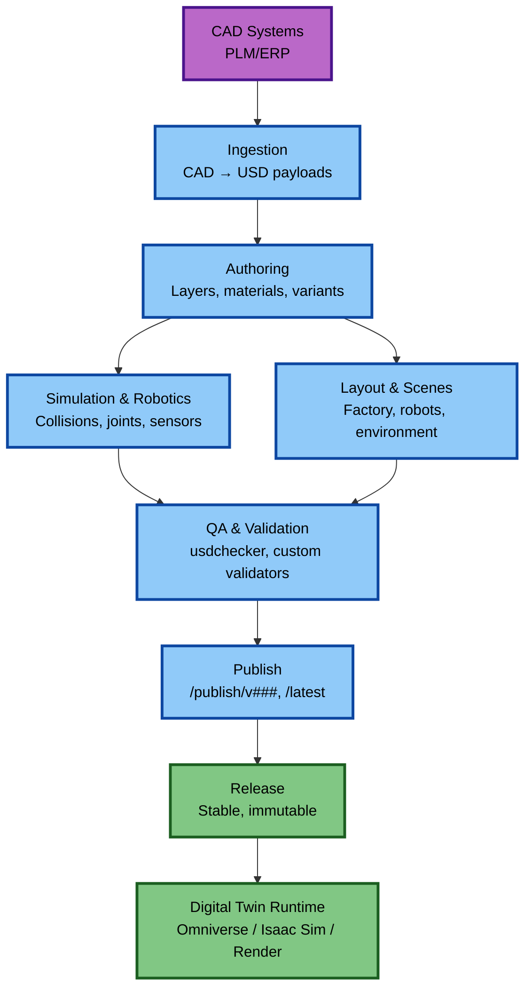
```mermaid
flowchart TD
    %% Vertical Flow
    CAD[CAD Systems\nPLM/ERP] --> Ingest[Ingestion\nCAD → USD payloads]
    Ingest --> Author[Authoring\nLayers, materials, variants]
    Author --> Sim[Simulation & Robotics\nCollisions, joints, sensors]
    Author --> Layout[Layout & Scenes\nFactory, robots, environment]
    Sim --> QA[QA & Validation\nusdchecker, custom validators]
    Layout --> QA
    QA --> Publish[Publish\n/publish/v###, /latest]
    Publish --> Release[Release\nStable, immutable]
    Release --> DT[Digital Twin Runtime\nOmniverse / Isaac Sim / Render]

    classDef sys fill:#ba68c8,stroke:#4a148c,stroke-width:3px,color:#000;
    classDef step fill:#90caf9,stroke:#0d47a1,stroke-width:3px,color:#000;
    classDef out fill:#81c784,stroke:#1b5e20,stroke-width:3px,color:#000;

    class CAD sys;
    class Ingest,Author,Sim,Layout,QA,Publish step;
    class Release,DT out;
```


---

# 13.10 Anti-Patterns

### ❌ Authoring geometry in layer files  
Use payloads.

### ❌ Random folder structures  
Use `/000_SOURCE`, `/010_ASS_USD`, `/030_USD_LYR`.

### ❌ No CI/CD validation  
Allows broken assets to slip in.

### ❌ Using root layer for editing  
Causes LIVERPS conflicts.

---

# 13.11 Summary

A strong implementation strategy requires:

- Clean asset structure  
- Governance policies  
- Stable toolchain  
- Automated validation  
- Cross-team workflow  
- Proper publishing pipeline  

USD succeeds when the entire organization aligns on structure and rules.

---


## Chapter 14 — Asset Lifecycle (Full Expansion)

**USD Terms & Concepts:** [Asset](https://openusd.org/release/glossary.html#asset), [AssetInfo](https://openusd.org/release/glossary.html#assetinfo), [Layer](https://openusd.org/release/glossary.html#layer), [LayerStack](https://openusd.org/release/glossary.html#layerstack), [Composition](https://openusd.org/release/glossary.html#composition), [References](https://openusd.org/release/glossary.html#references), [Payload](https://openusd.org/release/glossary.html#payload), [Value Resolution](https://openusd.org/release/glossary.html#value-resolution), [Metadata](https://openusd.org/release/glossary.html#metadata), [Kind](https://openusd.org/release/glossary.html#kind), [Model Hierarchy](https://openusd.org/release/glossary.html#model-hierarchy), [Asset Resolution](https://openusd.org/release/glossary.html#asset-resolution), [Path](https://openusd.org/release/glossary.html#path), [Namespace](https://openusd.org/release/glossary.html#namespace)

A robust USD pipeline needs a clearly defined asset lifecycle so that teams can collaborate without overwriting each other, breaking scenes, or losing history.  
A mature asset lifecycle governs how assets move from **Work → Review → Publish → Release → Archive**.

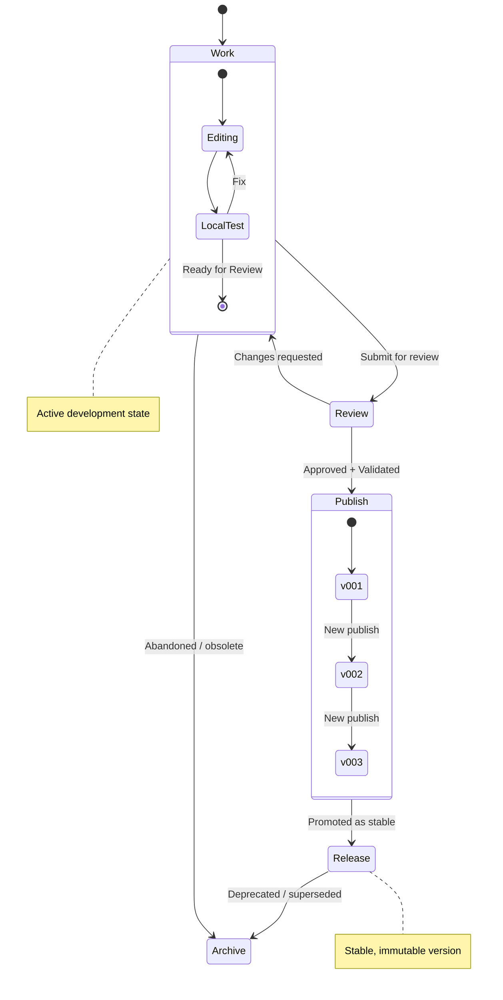
```mermaid
stateDiagram-v2
    [*] --> Work
    Work --> Review: Submit for review
    Review --> Work: Changes requested
    Review --> Publish: Approved + Validated
    Publish --> Release: Promoted as stable
    Release --> Archive: Deprecated / superseded
    Work --> Archive: Abandoned / obsolete

    state Work {
        [*] --> Editing
        Editing --> LocalTest
        LocalTest --> Editing: Fix
        LocalTest --> [*]: Ready for Review
    }

    state Publish {
        [*] --> v001
        v001 --> v002: New publish
        v002 --> v003: New publish
    }
    
    note right of Work
        Active development state
    end note
    
    note right of Release
        Stable, immutable version
    end note
```


This chapter describes the full lifecycle used in industrial digital twins, robotics simulation pipelines, and large VFX/animation studios.

---

# 14.1 Why Asset Lifecycle Matters

A strong lifecycle ensures:

- ✔ Predictable asset quality  
- ✔ Stable releases for downstream teams  
- ✔ Safe updates without breaking scenes  
- ✔ Clean separation of experiment vs production  
- ✔ Traceability  
- ✔ Automated validation gates  
- ✔ Cross-team consistency  

Without a lifecycle, assets quickly become unreliable.

---

# 14.2 The Five Lifecycle States

```
Work → Review → Publish → Release → Archive
```

### **1. Work**
Artists create or modify assets.  
Files may be incomplete, unvalidated, or experimental.

Folder:
```
/work/
```

### **2. Review**
Assets ready for team/lead review.

Folder:
```
/review/
```

### **3. Publish**
Approved assets, validated by CI and governance rules.

Folder:
```
/publish/v001/Asset.usd
/publish/v002/Asset.usd
/publish/latest/Asset.usd
```

### **4. Release**
Official externally-facing or cross-department stable asset.

Folder:
```
/release/
```

### **5. Archive**
Old versions or deprecated assets.

Folder:
```
/archive/
```

---

# 14.3 Folder Structure Example

```
Assets/
   PumpA/
      work/
      review/
      publish/
         v001/PumpA.usd
         v002/PumpA.usd
         latest/PumpA.usd
      release/
         PumpA.usd
      archive/
```

---

# 14.4 Versioning Strategy

### Semantic versioning recommended:
```
MAJOR.MINOR.PATCH
```

- **MAJOR**: Breaking changes (structure, variants)  
- **MINOR**: New features, metadata, variants  
- **PATCH**: Bug fixes, material tweaks  

---

# 14.5 Publishing Workflow

### Step 1 — Artist submits asset for review  
Placed in:
```
/review/
```

### Step 2 — Validation pipeline runs

Checks include:
- Path correctness  
- USD schema validity  
- LOD presence  
- Material bindings  
- Simulation metadata  
- Variant correctness  
- Performance metrics  

### Step 3 — Approver publishes asset

CI copies to:
```
/publish/vXXX/
```

And updates:
```
/publish/latest/
```

### Step 4 — Release (optional)

Promote stable version to:
```
/release/
```

Used for:
- Deliveries  
- Customer handoff  
- Factory installations  

---

# 14.6 Dependency Tracking

Assets may depend on:

- Payloads  
- Material libraries  
- Simulation layers  
- Variant families  
- Textures  
- External schemas  

When publishing, CI must analyze dependency graph.

---

# 14.7 Safe Updating Rules

### Rule 1: Do not break `release/`
If a published scene uses Release v001:
- v001 must remain immutable.

### Rule 2: Breaking changes → new MAJOR version  
Example breaking changes:
- Rename prim paths  
- Reorganize hierarchy  
- Delete or rename variants  
- Change payload structure  

### Rule 3: Always maintain `publish/latest`  
This simplifies referencing for downstream teams.

---

# 14.8 Update Scenarios

### ✔ Safe Update (Material Tweak)
- Roughness changed  
- Normal map updated  

This is a **PATCH**.

### ✔ Moderate Update (New Variant)
- Added “PaintBlue” variant  
Becomes **MINOR**.

### ❌ Unsafe Update (Deleting Variant)
This breaks scenes → **MAJOR**.

---

# 14.9 Publishing Diagrams

### High-Level Lifecycle
```
work → review → publish → release → archive
```

### Developer Perspective
```
Make Edits → Submit Review → Automated Validation → Publish → Notify Teams
```

### CI/CD Flow
```
Trigger → Validate → Build → Version → Distribute → Report
```

---

# 14.10 Delivering Assets to Partners

Some workflows require delivering final assets externally.

### Deliverable options:
- **Flattened USD**  
- **Package folder (textures + USD)**  
- **USDC-only deliverable**  

Flattening example:
```
usdcat scene.usd --flatten > deliverable.usda
```

---

# 14.11 Archive Strategy

Archive:
- Deprecated assets  
- Old versions  
- Assets replaced by new CAD  

Rules:
- Archived assets are read-only  
- CI ignores archived folders  
- They remain available for audit

---

# 14.12 Anti-Patterns

### ❌ Single-folder assets  
No separation of work/release.

### ❌ Editing published assets  
Breaks scenes.

### ❌ Publishing without validation  
Allows corrupted USDs downstream.

### ❌ Storing release assets in “work”  
Causes accidental overwrites.

---

# 14.13 Summary

A strong asset lifecycle:

- Organizes assets cleanly  
- Prevents breaking changes  
- Enables trust between teams  
- Supports automation  
- Retains auditability  
- Enables stable production USD pipelines  

The lifecycle is the backbone of a scalable USD deployment.

---


## Chapter 15 — Resources (Massively Expanded Edition)

**USD Terms & Concepts:** [Stage](https://openusd.org/release/glossary.html#stage), [Layer](https://openusd.org/release/glossary.html#layer), [Prim](https://openusd.org/release/glossary.html#prim), [Property](https://openusd.org/release/glossary.html#property), [Attribute](https://openusd.org/release/glossary.html#attribute), [Relationship](https://openusd.org/release/glossary.html#relationship), [Composition](https://openusd.org/release/glossary.html#composition), [Composition Arcs](https://openusd.org/release/glossary.html#composition-arcs), [References](https://openusd.org/release/glossary.html#references), [Payload](https://openusd.org/release/glossary.html#payload), [Sublayers](https://openusd.org/release/glossary.html#sublayers), [Inherits](https://openusd.org/release/glossary.html#inherits), [Specializes](https://openusd.org/release/glossary.html#specializes), [Variant](https://openusd.org/release/glossary.html#variant), [VariantSet](https://openusd.org/release/glossary.html#variantset), [Asset](https://openusd.org/release/glossary.html#asset), [Asset Resolution](https://openusd.org/release/glossary.html#asset-resolution), [Metadata](https://openusd.org/release/glossary.html#metadata), [Schema](https://openusd.org/release/glossary.html#schema), [API Schema](https://openusd.org/release/glossary.html#api-schema), [IsA Schema](https://openusd.org/release/glossary.html#isa-schema), [Typed Schema](https://openusd.org/release/glossary.html#typed-schema)

This chapter provides a deep, curated, and comprehensive resource index for OpenUSD, covering documentation, specs, ecosystem tools, learning materials, research topics, standards, and professional training references. It is designed to serve as a long-term reference for engineering, simulation, robotics, VFX, CAD, digital twin, and manufacturing teams.

---

# 15.1 Official USD Documentation (Core Canonical Resources)

These are the **authoritative, always-current** references maintained by Pixar and the USD working group.

### ✔ USD Core Documentation

**Official USD Documentation Sites:**
- **[openusd.org](https://openusd.org/)** - Official OpenUSD website
- **[Learn OpenUSD](https://docs.nvidia.com/learn-openusd/latest/)** - Official Learn OpenUSD portal (tutorials, guides, and docs)
- **[USD GitHub Repository](https://github.com/PixarAnimationStudios/OpenUSD)** - Source code and documentation

**Key Documentation Topics:**
- **USD Basics**: Composition, pruning, payloads, references, variants  
- **Schemas**: Built-in schema families with detailed descriptions  
- **Value Resolution**: How USD merges opinions  
- **Layer System**: Sublayers, strengths, authorship rules  
- **Stage Management**: Opening, saving, and composing USD stages

**Official Documentation Links for Layer-Based Data Integration:**

**Note:** The following links point to the exact USD concepts that enable standards integration patterns (AAS, OPC UA, Catena-X, etc.). While USD doesn't have named "standards layers," these patterns are valid applications of core USD mechanisms.

1. **[USD Glossary → Layer](https://graphics.pixar.com/usd/release/glossary.html#usdglossary-layer)** - Official definition of USD layers
   - Foundation concept for understanding how layers work

2. **[USD Composition → Sublayers](https://docs.nvidia.com/learn-openusd/latest/creating-composition-arcs/sublayers/what-are-sublayers.html)** - Official documentation on sublayers and layer stacking
   - *Quote:* "A layer may sublayer other layers. Stronger layers override weaker layers. Sublayers allow combining multiple data sources into a single composed scene."
   - This is the formal basis for using separate layers for different standards

3. **[USD Composition → Value Resolution](https://docs.nvidia.com/learn-openusd/latest/beyond-basics/value-resolution.html)** - Official documentation on how USD resolves opinions from multiple layers
   - Explains how multiple layers can contribute opinions to the same prim
   - Documents layer strength ordering and composition

4. **[USD Custom Data & Namespaces](https://graphics.pixar.com/usd/release/api/usd_page_front.html#Usd_Page_CustomData)** - Official documentation on custom attributes and namespaced metadata
   - *Quote:* "Custom attributes and metadata can be added freely as long as they use namespaced identifiers."
   - This covers using `aas:`, `opcua:`, `catena:` prefixes for domain-specific semantics

5. **[USD Stage Lifetimes and Mutability](https://graphics.pixar.com/usd/release/api/class_usd_stage.html)** - Official documentation on editing layers while stages are open
   - Documents how stages update when underlying layers change
   - Enables dynamic data updates for real-time systems

6. **[USD File Format Plugins](https://openusd.org/dev/api/_sdf__page__file_format_plugin.html)** - Official mechanism for live data integration
   - *Quote:* "A file format plugin can generate layer data dynamically at open time."
   - This is how companies integrate OPC UA, ROS, PLC values, IoT telemetry, etc.
   - Documentation covers creating plugins that adapt other file formats to USD, with support for reading, writing, and editing capabilities

7. **[USD Glossary → Layer Stack](https://graphics.pixar.com/usd/release/glossary.html#usdglossary-layerstack)** - Official documentation on layer stacks
   - *Quote:* "Layer stacks allow constructing a composed result from multiple independent sources of opinions."
   - USD encourages this pattern for modular, domain-specific data integration

8. **[NVIDIA Omniverse USD Documentation](https://docs.omniverse.nvidia.com/usd/latest/index.html)** - NVIDIA's USD documentation with practical examples
   - Layer-based workflows
   - Real-world examples and tutorials  

### ✔ Schema Reference Guides
- UsdGeom  
- UsdShade  
- UsdPhysics  
- UsdSkel  
- UsdLux  
- UsdRender  
- UsdVol  
- UsdMedia  

Each schema category includes:
- Prim definitions  
- Attribute types  
- API inheritance  
- Use cases  
- Examples  

---

# 15.2 USD Python & C++ API References

### Python API Documentation:
Covers:
- Stage navigation  
- Prim editing  
- Layer authoring  
- Value ops  
- Variant manipulation  
- Physics authoring  
- Shader graph creation  

### C++ API Documentation:
- Low-level composition engine  
- Custom schema creation  
- High-performance USD operations  
- Asset resolution integration  

---

# 15.3 USD Command-Line Tools (Master-Level Summary)

| Tool | Purpose | Typical Use |
|------|---------|--------------|
| **usdview** | Inspect USD | Debug, inspect, visualize |
| **usdcat** | Convert/flatten USD | Publishing, debugging |
| **usddiff** | Compare layers | Version tracking |
| **usdchecker** | Validate USD | CI/CD |
| **usdresolve** | Evaluate asset paths | Path debugging |
| **usdrecord** | Render frames | Quick previews |

---

# 15.4 Material & Shading Resources

### USDShade Specification
- Preview Surface  
- MDL Integration  
- MaterialX integration  
- Binding models  
- Multiple render delegates  

### MaterialX Resources
- Node definitions  
- Surface/BSDF models  
- Texture pipelines  
- USD ↔ MaterialX translation  

### MDL Resources
- MDL Handbook  
- Standard Library  
- Physically-based materials documentation  
- Enterprise coating models  

---

# 15.5 Physics, Robotics & Simulation Resources

### USD Physics
- Rigid bodies  
- Collisions  
- Materials  
- Joints  
- Articulations  
- Physics scene configuration  

### NVIDIA PhysX Documentation
- USD Physics backend  
- Timestep control  
- Scene stability  
- Articulation solver  

### Isaac Sim Documentation
- Robot authoring  
- Sensor models  
- Control policies  
- Contact & force simulation  
- Synthetic data pipelines  

### Robotics Standards
- ROS2  
- URDF  
- SRDF  
- OpenDrive  
- OpenScenario  

---

# 15.6 Learning Materials & Training

### Beginner
- Pixar USD Introductions  
- Omniverse fundamentals  
- USD for Artists  
- Introduction to USD for Robotics  

### Intermediate
- USD composition theory  
- Layer-based workflows  
- Variant configuration  
- CAD → USD conversion  

### Advanced
- Custom schema authoring  
- High-performance pipelines  
- USD in cloud environments  
- Real-time simulation with PhysX  
- Material authoring with MDL/MaterialX  

### Video Resources
- SIGGRAPH USD Sessions  
- GTC NVIDIA Sessions  
- USD + Robotics deep dives  
- Digital twin architecture talks  

---

# 15.7 Ecosystem Tools & Extensions

### Omniverse Extensions
- USD Explorer  
- Layer Debugger  
- Physics Inspector  
- Material Graph  
- Transform Tools  
- Path Utilities  
- ROS2 Bridge  
- Synthetic Data tools  

### Pipeline Tools
- Omniverse Farm  
- USD validate scripts  
- Asset publishing services  
- SimReady asset tools  
- CAD Importer Extensions  

---

# 15.8 Community Libraries & Repositories

### Pixar USD GitHub
Includes:
- Full source  
- Tests  
- Sample models  
- Hydra examples  

### NVIDIA/Omniverse GitHub
- Isaac Sim assets  
- Robotics examples  
- Digital twin factories  
- Automated pipelines  
- USD utilities  

### Community Tools
- Blender USD I/O (endpoint pipeline)  
- Unreal USD tools  
- Unity USD importer  
- MaterialX viewer  

---

# 15.9 Standards & Cross-Domain Frameworks

### Digital Twin Standards (Examples)
Various standards and frameworks exist for digital twin integration. Choose based on your specific needs:
- AAS (Asset Administration Shell) - Industry 4.0 standard  
- Catena-X - Automotive industry data ecosystem
- Digital Thread (PLM-driven) - Product lifecycle integration
- MTConnect - Manufacturing equipment connectivity
- OPC UA Information Models - Industrial automation standards  

### Material Standards
- MaterialX  
- MDL  
- OpenPBR (coming)  

### Simulation / Autonomous Standards
- OpenDrive  
- OpenScenario  
- OpenXR  

### Enterprise Standards
- PLM schema mapping  
- ERP metadata models  
- CAD metadata standards  

### Real-World Examples & Case Studies

**Bosch Rexroth "Intelligent Floor" Model Factory:**
- Demonstrates machine-to-machine and production-line-level digital twin integration
- Prototype showcasing production line digitalization concepts
- Reference: [Bosch Rexroth Blog - Intelligent Floor Model Factory](https://www.boschrexroth.com/de/de/blog/intelligenter-boden-modellfabrik/)
- Shows practical application of standards integration at production scale

**Combined Standards Integration:**
- Research institutions have demonstrated successful integration of AAS and OPC UA
- Organizations can combine standards rather than choosing exclusively between them
- Use best aspects of each standard in a modular, exchangeable architecture

---

# 15.10 Recommended Books, Papers & Research

### USD Papers
- “OpenUSD: Universal Scene Description for Scalable Workflows”  
- Hydra rendering papers  
- USD shading and material pipelines  

### Robotics Papers
- Articulations in simulation  
- Domain randomization & synthetic data  
- USD for robot control systems  

### Digital Twin Papers
- Factory simulation via USD  
- Enterprise digital twin reference architectures  

---

# 15.11 Example Asset Libraries

### USD Sample Assets (Pixar)
- Kitchen  
- City  
- Synthetic examples  
- USD Kitchen set  
- Material samples  

### NVIDIA SimReady Assets
- Robots  
- Sensors  
- Conveyors  
- Industrial components  
- Simulation-ready materials  

### USD Assets Working Group (ASWF)
- [USD Assets Working Group Repository](https://github.com/usd-wg/assets) – Small, schema- and pipeline-oriented USD assets with documentation and test cases. Focused on educational and test assets rather than full production scenes.

### Enterprise Sample Projects
- Full factories  
- Warehouses  
- AGV fleets  
- Robotic cells  

---

# 15.12 Summary

This expanded resources chapter provides:
- Canonical USD references  
- Tooling ecosystem  
- Material & shading documentation  
- Robotics & simulation resources  
- Training materials  
- Industry standards  
- Sample repositories  
- Research & academic papers  

Use this section as your long-term reference index as you build advanced USD pipelines across robotics, manufacturing, VFX, CAD, and digital twins.

---

## Chapter 16: Quick Start & Practical Workflows

This chapter provides a "cheat sheet" for getting started quickly with the folder structure and workflows defined in this guide.

# 16.1 Quick Workflow Overview

1. **Source Prep**: Convert CAD → USD assets → place in `010_ASS_USD/`
2. **Layer Creation**: Create layer files in `030_USD_LYR/` for modifications (variants, materials, overrides)
3. **Composition**: Reference layers in `GoodStart_ROOT.usda` (array order: Opinion → Variant → Material → AssetImport, where first = strongest)
4. **Pathing**: Use **relative paths** (`@./folder/file.usd@`) for portability
5. **Validation**: Validate with `python scripts/validate_asset.py` (for individual assets) or `python scripts/validate_scene.py` (for entire scenes)

# 16.2 Example Asset Lifecycle

This section illustrates a complete asset lifecycle from source conversion through production deployment:

### Step 1: Source File Preparation
```bash
# Place CAD source files in 000_SOURCE/
# Example: Export STEP file from CAD system
cp /path/to/cad/export/part_assembly.step 000_SOURCE/
```

### Step 2: CAD to USD Conversion
```bash
# Using CAD-to-OpenUSD conversion scripts
cd 000_SOURCE/
# Convert STEP to USD
python cad2usd.py part_assembly.step ../010_ASS_USD/part_assembly.usd
```

### Step 3: Asset Validation
```bash
# Validate USD asset (see validation scripts section)
python scripts/validate_asset.py 010_ASS_USD/part_assembly.usd
```

### Step 4: Create Asset Import Layer
```usda
# In 030_USD_LYR/Ass_import_LYR.usda
def Xform "PartAssembly" (
    prepend references = @../010_ASS_USD/part_assembly.usd@
)
{
    # Asset is now referenced in the scene
}
```

### Step 5: Add Modifications via Layers
```usda
# In 030_USD_LYR/Mtl_import_LYR.usda
over "PartAssembly"
{
    over "SubAssembly"
    {
        # Add material overrides, metadata, etc.
        string digitalTwin:assetId = "DT-001"
        string digitalTwin:plmLink = "PLM://system/part/12345"
    }
}
```

### Step 6: Link to Root File
The root file (`GoodStart_ROOT.usda`) automatically includes all layers via `subLayers`:

```usda
subLayers = [
    @./030_USD_LYR/Opinion_xyz_LYR.usda@,       # First = strongest (applied last, overrides others)
     @./050_VAR_LYR/VAR_LYR.usda@,      # Second
    @./030_USD_LYR/Mtl_import_LYR.usda@,          # Third
    @./030_USD_LYR/Ass_import_LYR.usda@   # Last = weakest (applied first, can be overridden)
]
```

### Step 7: Production Deployment
```bash
# Validate entire scene
python scripts/validate_scene.py GoodStart_ROOT.usda

# Export for production (if needed)
usdcat GoodStart_ROOT.usda -o production/GoodStart_ROOT.usdc
```

# 16.3 Workflow by Domain

### Digital Twin Workflow
1. **Source Files**: CAD files in `000_SOURCE/` or external PLM/PDM systems
2. **Convert to USD**: Convert to `010_ASS_USD/`
3. **Add Metadata**: Map CAD metadata to USD metadata (custom attributes or customData)
4. **Apply Modifications**: Use layers in `030_USD_LYR/`
5. **Link to Root**: Ensure proper linking in `GoodStart_ROOT.usda`
6. **Standards Integration** (optional): Connect USD assets to enterprise standards (e.g., AAS, Catena-X, OPC UA) based on your organization's requirements

### DCC Workflow
1. **Import Assets**: Export USD files from DCC tools to `010_ASS_USD/`
   - **Maya, Houdini, 3ds Max**: Full support
   - **Blender, Cinema 4D**: Endpoint assets only (destructive export)
2. **Reference Assets**: Use layers in `030_USD_LYR/` to reference assets
3. **Apply Modifications**: Add opinions, variants, and material changes through layers (using Maya/Houdini)
4. **Link to Root**: Ensure proper linking in `GoodStart_ROOT.usda`


---


