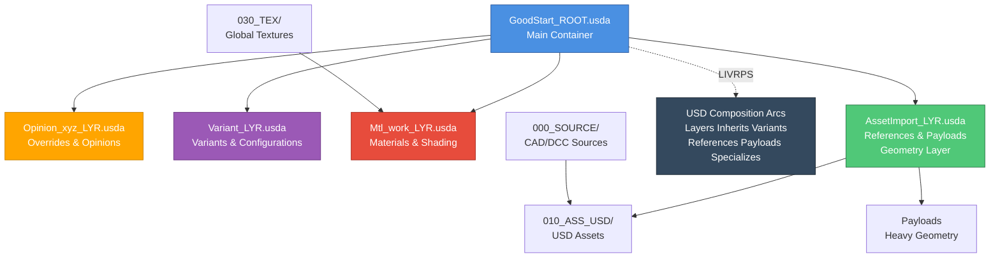

- USD GoodStart

**Version:** 0.9.2-beta  
**Last Updated:** 11.21.2025

A clean, organized USD project template for starting new projects, with a focus on **digital twin applications**, adapted from VFX industry best practices.

> **⚠️ Beta Status:** This is an early-stage beta project. Use with caution!

## TLDR (Too Long; Didn't Read)

**Quick Structure:**



**Quick Workflow:**
1.  **Convert**: CAD → USD assets → place in `010_ASS_USD/`
2.  **Modify**: Create layer files in `020_LYR_USD/` for modifications (variants, materials, overrides)
3.  **Compose**: Reference layers in `GoodStart_ROOT.usda` (bottom-to-top: AssetImport → Materials → Variants → Opinions)
4.  **Validate**: `python scripts/validate_usd.py`

---

## 1. Best Practices for Asset Structure

> **Critical:** Understand these principles before starting.

### **Core Principles**
*   **Legibility**: Clear, intent-driven naming (e.g., `LargeCardboardBox`, not `Box01`). Use ASCII/UTF-8 identifiers.
*   **Modularity**: Self-contained assets with anchored paths. Define stable entry points (root prims).
*   **Performance**: Use **Payloads** to defer loading heavy data. Use **Instancing** for repetitive geometry.
*   **Navigability**: Use Collections and Relationships to group logical items.

### **Composition Strength (LIVERPS) & The "Root Layer Trap"**
*   **The Trap**: If you define attributes/references directly in the Root File (e.g., `translate`), sublayers cannot override them because **Local opinions (Root) > SubLayers**.
*   **The Fix**: Keep the Root File "thin". Author actual opinions in sublayers (`Layout.usd`, `Geometry.usd`) so other layers can override them.

### **Reference/Payload Pattern**
*   **Structure**: Separate lightweight "interface" from heavy "implementation".
    ```text
    Asset.usd (Interface) ──[Payload]──> Payload.usd (Heavy Geometry)
    ```
*   **Why**: Allows fast opening in bounding-box mode.
*   **Lofting**: Move key controls (Variants, Extents, Draw Modes) *above* the payload so they are accessible without loading heavy geometry.

### **Anti-Patterns (Avoid These)**
| Approach | Status | Why? |
| :--- | :--- | :--- |
| **Inline Geometry in Root** | ⛔ **CRITICAL ANTI-PATTERN** | Bloats file, slows parsing, cannot be unloaded. |
| **Direct References** | ⚠️ **Use with Caution** | Forces eager loading. Kills viewport performance for heavy assets. |
| **Payloads** | ✅ **Best Practice** | Enables "lazy" loading and memory management. |

### **Workstreams & Layer Stacking**
Organize by *who* is working:
*   `AssetImport_LYR.usda`: Geometry/Payloads (Modeler)
*   `Mtl_work_LYR.usda`: Materials (Texture Artist)
*   `Variant_LYR.usda`: Configuration logic (Technical Artist)
*   `Opinion_xyz_LYR.usda`: Shot-specific overrides (Lighter/Layout)

### **Parameterization**
*   **Variant Sets**: For discrete choices (Model A vs Model B, Damaged vs New). Changes scene graph structure.
*   **Primvars**: For continuous values (`primvars:color`, `primvars:roughness`). Passed to shaders.

---

## 2. Project Organization

```
USD_GoodStart/
├── 000_SOURCE/          # Original CAD/DCC source files
├── 010_ASS_USD/         # USD assets (converted/exported)
├── 020_LYR_USD/         # Layer files for modifications
├── 030_TEX/             # Global textures
├── GoodStart_ROOT.usda  # Master root file (entry point)
├── GoodStart.hiplc      # Houdini working file
└── README.md            # This file
```

### **Folder Details**
*   **[000_SOURCE/](000_SOURCE/README.md)**: Source files and materials.
*   **[010_ASS_USD/](010_ASS_USD/README.md)**: All USD assets.
*   **[020_LYR_USD/](020_LYR_USD/README.md)**: Layer files for composition.
*   **[030_TEX/](030_TEX/README.md)**: Global textures.

### **Path Rules**
*   ✅ **ALWAYS use relative paths**: `@./folder/file.usd@`
*   ❌ **NEVER use absolute paths**: `@C:/Projects/file.usd@` (Breaks portability)

---

## 3. Tools & Software

### **Required**
*   **Omniverse Kit/Composer**: For assembly and viewing.
*   **Python 3.10+** & `usd-core`: For validation scripts.

### **Recommended DCCs**
*   **Houdini**: 👑 **Best-in-class USD integration**. Ideal for procedural pipelines, visual variant creation, and automation.
    *   *Why*: Deepest integration, visual variant creation, procedural power.
*   **Maya / 3ds Max**: Good USD support with layering and referencing.
*   **ShapeFX Loki**: Native USD editor.
*   **usdview**: Essential for debugging.

### **DCC Tool Limitations**
> **⚠️ Blender / Cinema 4D**: Limited to **endpoint creation**. They export destructive USD files and cannot handle layering or composition arcs effectively. Use them for modeling base assets only.

### **Version Control**
*   **Git**: For code and small USD files.
*   **Git LFS**: Required for large assets (`.usd`, `.usdc`, textures).
*   **Anchorpoint**: Recommended for artist-friendly Git management.

---

## 4. Workflow: Digital Twin & CAD Integration

### **CAD Conversion Pipeline**
1.  **Source**: Place CAD files (STEP, JT, CATIA) in `000_SOURCE/`.
2.  **Convert**: Use **[CAD-to-OpenUSD](https://github.com/nAurava-Technologies/CAD-to-OpenUSD)** or Omniverse CAD Converter.
3.  **Validate**: Run `python scripts/validate_asset.py`.

### **Metadata Strategy**
This template supports two approaches for metadata, based on query needs:

**Option 1: Custom Attributes (Recommended)**
*   *Use for*: Queryable, dynamic data (PLM IDs, Status).
*   *Syntax*: `string digitalTwin:plmId = "12345"`
*   *Pros*: Strong typing, animatable, fast querying.

**Option 2: customData Dictionary**
*   *Use for*: Static documentation/archival info.
*   *Syntax*: `customData = { dictionary digitalTwin = { string author = "Me" } }`
*   *Pros*: Descriptive, organized, but slower to query.

### **Asset Administration Shell (AAS)**
Connect USD assets to AAS for standardized digital twin management. Store AAS IDs in custom attributes (`digitalTwin:aasId`).

### **Physical AI & Simulation**
*   **Rigging**: Add physics properties (`mass`, `collision`) for Isaac Sim.
*   **Annotation**: Add semantic labels for synthetic data generation (`ml:class`, `ml:category`).

---

## 5. Project Planning Strategy (MVP)

**Start Small (Agile Approach):**
1.  **POC**: Technical feasibility test (one asset, one layer).
2.  **MVP**: Minimal functional twin (small assembly).
3.  **Scale**: Iterate based on learnings. **Do not use Waterfall.**

---

## 6. Troubleshooting

*   **Missing Assets?** Check relative paths (`@./@`).
*   **Layers not loading?** Check `subLayers` array order in Root file.
*   **Metadata missing?** Verify schema/namespace syntax.
*   **Performance slow?** Check if you are using direct references instead of Payloads.

---

## 7. Detailed Reference (Original Content)

### Why VFX Practices Matter for Digital Twins
OpenUSD was originally developed by Pixar for VFX. These practices translate excellently to digital twins:
- **Large-scale pipelines**: Managing thousands of assets.
- **Non-destructive workflows**: Composition arcs allow safe iteration.
- **Multi-DCC workflows**: Different tools for different tasks.

### Example Asset Lifecycle
1.  **Source**: CAD export to `000_SOURCE/`.
2.  **Conversion**: STEP to USD via `cad2usd.py`.
3.  **Import**: Create `AssetImport_LYR.usda` referencing the converted asset.
4.  **Modify**: Add metadata in `Mtl_work_LYR.usda`.
5.  **Publish**: Validate and export to `.usdc`.

### Storage & CI/CD
*   **Storage**: Use Nucleus for live collaboration, or NAS/Git for file storage.
*   **CI/CD**: Use automated validation scripts (`scripts/validate_scene.py`) in your pipeline.

### Additional Resources
*   **[NVIDIA Digital Twin Learning Path](https://www.nvidia.com/en-us/learn/learning-path/digital-twins/)**
*   **[USDWG Collective Project](https://github.com/usd-wg/collectiveproject001)** (VFX Best Practices)
*   **[AOUSD](https://aousd.org/)** (Standards)
*   **[CAD-to-OpenUSD](https://github.com/nAurava-Technologies/CAD-to-OpenUSD)** (Conversion Tools)
