# Rendering and Visualizing OpenUSD Scenes — Video Deep-Dive Tutorial

**Version**: 0.3.10 | **Date**: 04.03.2026 | **Time**: 18:24 | **GlobalID**: 20260303_0212_USD_GoodStart_016

**Tag block:**
#openusd #usd_visualization #usdgeom #imageable #primvars #materials #usdlux #timesamples #composition #certification #digital_twin #best_practices

[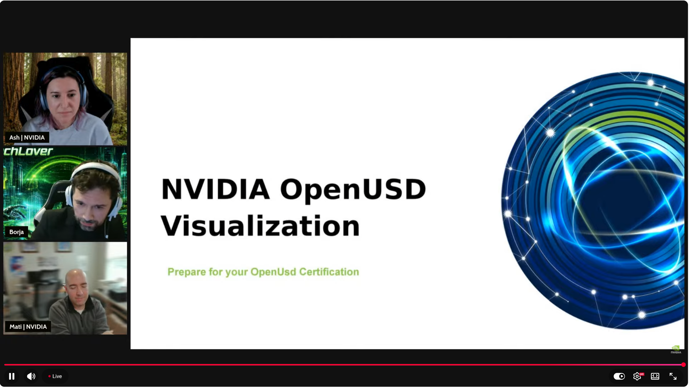](Pics/RenderingVisualizingOpenUSD_Scenes/Rendering_VisualizingOpenUSD_Scenes_2026-03-02_20h04_30.png)

Click the image to open it full-size; it’s the title slide that frames the session.

**Canonical Video Source:** [YouTube — Rendering and Visualizing OpenUSD Scenes | OpenUSD Community Office Hours](https://www.youtube.com/watch?v=-6x8fuYVBPk) [1 — YouTube video](#link-1) <br>
**Presenter:** Borja Mayoral Arauz <br>
**NVIDIA Session Hosts / Contributors:** Ashley Goldstein and Matias "Mati" Codesal <br>
**Video Deep-Dive Tutorial** build post factum by [Jan Haluszka](https://www.linkedin.com/in/jan-haluszka-tangible-digital-twins/) <br>
**Primary Learning Backbone:** [NVIDIA Learn OpenUSD](https://docs.nvidia.com/learn-openusd/latest/index.html) [2 — Learn OpenUSD curriculum](#link-2)

**Most important resources (keep these open):** [2 — Learn OpenUSD curriculum](#link-2), [19 — Awesome OpenUSD](#link-19), [35 — USD WG Composition Puzzles](#link-35), and [36 — Composition / aggregation reference deck](#link-36)

Use the Learn OpenUSD curriculum as the “hands-on drill” companion to this tutorial; it is where you practice the exact APIs and concepts discussed in the livestream.

---

## Series Position

This tutorial is a companion deep-dive that supports the OpenUSD certification series progression.

1. [Understanding Composition Arcs](./Understanding%20Composition%20Arcs__VIDEO_DEEP_DIVE_TUTORIAL.md) - released
2. [What You Should Know About Content Aggregation](./WhatYouShouldKnowAboutContentAggregation__VIDEO_DEEP_DIVE_TUTORIAL.md) - released
3. [Customizing OpenUSD for Your Pipeline](./Customizing_OpenUSD_for_Your_Pipeline__VIDEO_DEEP_DIVE_TUTORIAL.md) - released
4. [Building an OpenUSD Pipeline With Data Modeling](./Building%20an%20OpenUSD%20Pipeline%20With%20Data%20Modeling__VIDEO_DEEP_DIVE_TUTORIAL.md) - released
5. Rendering and Visualizing OpenUSD Scenes - coming soon
6. Session 6 - coming soon

---

> **Part of USD GoodStart** — for repo structure and conventions, start with [README.md](../README.md). This tutorial lives in `WIP_Docs`. Companion deep-dives:  
> - [Building an OpenUSD Pipeline With Data Modeling__VIDEO_DEEP_DIVE_TUTORIAL.md](./Building%20an%20OpenUSD%20Pipeline%20With%20Data%20Modeling__VIDEO_DEEP_DIVE_TUTORIAL.md)  
> - [Customizing_OpenUSD_for_Your_Pipeline__VIDEO_DEEP_DIVE_TUTORIAL.md](./Customizing_OpenUSD_for_Your_Pipeline__VIDEO_DEEP_DIVE_TUTORIAL.md)

---

## The Five-Minute Version

Rendering is where digital twins start lying to you first — because different tools have different defaults, and those defaults change what you see.

The recurring failure pattern looks like this:

- The robot “fits” in the cell because someone’s viewer silently scaled it (units mismatch hidden).
- The cell is rotated or gravity looks wrong because axis conventions were never normalized (upAxis mismatch).
- Safety geometry disappears because it was authored as `guide`, and the renderer excludes `guide` by default (purpose mismatch).
- A QA overlay vanishes when final materials are bound (material wins over `displayColor`).
- Someone queries a time-sampled attribute without a `Usd.TimeCode` and gets the wrong answer (time sampling misread).

This deep dive turns those into a repeatable trust procedure:

- Make stage contracts explicit (units, axis, defaultPrim, purposes, time settings).
- Predict visibility/purpose/material binding behavior instead of “checking the viewport and hoping.”
- Validate what you see by tracing back to authored sources and timeCode context.

### Mental model map (quick view)

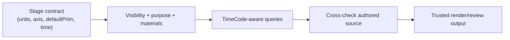
```mermaid
flowchart LR
    Contract["Stage contract\n(units, axis, defaultPrim, time)"] --> Interpret["Visibility + purpose + materials"]
    Interpret --> Sample["TimeCode-aware queries"]
    Sample --> Verify["Cross-check authored source"]
    Verify --> Trusted["Trusted render/review output"]
```

> **Companion video:** Use the timestamps to watch a short segment, then come back here for the “why it broke” and “how to standardize it” layer.

---

## Before You Start (Quick Setup)

You want:

- A working USD + Python environment (`pxr`)
- `usdview` installed for visual inspection
- This deep-dive file open alongside the companion video timestamps

Follow the official setup guide:
- [Learn OpenUSD — Installing usdview and Setting Up Python](https://docs.nvidia.com/learn-openusd/latest/usdview-install-instructions.html) [3 — usdview + Python setup](#link-3)
- [Isaac Sim (GitHub)](https://github.com/isaac-sim/IsaacSim)
- [Isaac Lab (GitHub)](https://github.com/isaac-sim/IsaacLab)
- [Omniverse Kit App Template (GitHub, Composer -> Kit App path)](https://github.com/NVIDIA-Omniverse/kit-app-template)

---

## How This Tutorial Works

This is a two-layer document:

1. **Story layer** — Packaging Cell 3 evolves step by step (from “I can see it” to “I can trust what I see”).
2. **Production layer** — pipeline decisions, common pitfalls, and “what to standardize” guidance.

Every chapter ends with a **Learn OpenUSD →** pointer, so you can jump from video concepts to hands-on practice.

Between chapters you’ll see a short **Packaging Cell 3 checkpoint** that connects the technical topic back to the commissioning story.

---

## The Story (Packaging Cell 3)

Throughout this deep dive, we’ll run one story all the way through: a digital twin that starts as **“something I can see”** and ends as **“something I can trust”**.

You’re building **Packaging Cell 3** of a factory line:

- a robot arm picks products off a conveyor and places them into boxes
- an inspection camera validates label alignment after each placement
- pressure sensors on the gripper report force per pick cycle
- three safety scanners monitor the cell perimeter and trigger stops on intrusion
- your stakeholders span engineering (fast debug), simulation (physics-correct), and management (photorealistic review)

The twist is that *every stakeholder can be correct at the same time* while the twin is still wrong. They are each looking at the “same” USD through different defaults (units, up-axis, included purposes, render settings), and those defaults silently change the meaning of what you see.

### The scenario

A packaging manufacturer is commissioning a new production line. The client engineering team works in CAD (Rhino, CATIA) and exports robot cell geometry in **centimeters** with a **Z-up** axis. The simulation team runs Isaac Sim in **meters** (axis conventions can vary by source/runtime configuration). The visualization team reviews in Omniverse USD Composer.

Meanwhile the real-world deliverables pile up: a safety engineer needs reach-envelope and scanner overlays for sign-off, and a plant manager needs a photorealistic review render once a week to track commissioning progress. You are responsible for making all of that work from one USD-centric truth.

### Why visualization is the first trust problem

Digital twin projects often fail *before* the data-integration problem shows up — because the first disagreements happen in the viewport. The pixels are where the twin lies to you first:

- **Units mismatch** — The robot is authored in centimeters, the simulation stage is in meters. If someone sublayers the CAD file instead of referencing it (and correcting the scale), the robot appears **100×** too large. The reach-envelope overlay “passes” for the wrong volume.
- **Axis flip** — CAD is Z-up, simulation is Y-up. If the correction is not applied at a controlled insertion point, the cell is physically rotated and gravity/motion previews become nonsense.
- **Purpose/visibility mismatch** — Safety scanner guides are authored as `guide`. The review renderer excludes `guide`. The weekly render looks clean because the safety geometry was never drawn.
- **Primvars vs materials** — QA uses `primvars:displayColor` for OK/WARN/FAULT overlays. Lookdev binds a final material and the overlay colors vanish (materials win). The data still exists; it just stopped being visible.
- **TimeSample misread** — A jam happened at timeCode 35. Someone queries the attribute without a timeCode and gets the default value. Root-cause analysis points to the wrong location.

None of these are exotic edge cases. They are predictable failure modes with predictable fixes — if you understand how USD evaluates, composes, and renders.

### What changes after this tutorial

After working through Packaging Cell 3 chapter by chapter, you will be able to:

- Set up a stage with explicit, validated unit and axis conventions *before* importing any asset.
- Choose the right composition arc when bringing in CAD exports versus layering in simulation opinions.
- Predict which prims will be drawn by which renderer in which mode — and which will silently disappear.
- Keep data overlays (primvars) visible even after final materials are bound.
- Query time-sampled values correctly and reason about “what happened at timeCode 35?” without guesswork.

That’s the difference between a twin that merely *looks plausible* and one you can *use as evidence*.

---

## Chapter Outcomes at a Glance

| Chapter | Video section (approx) | Exam-relevant topic | What you will be able to do after | Learn OpenUSD → quick jump |
|---|---|---|---|---|
| [Chapter 0](#chapter-0) | [00:00](https://www.youtube.com/watch?v=-6x8fuYVBPk&t=0s) | Visualization mindset | Explain why “rendering” is a trust problem for digital twins. | [2 — Curriculum](#link-2), [4 — Glossary](#link-4) |
| [Chapter 1](#chapter-1) | [03:53](https://www.youtube.com/watch?v=-6x8fuYVBPk&t=233s) | Stage configuration | Avoid unit/axis pitfalls; understand reference/payload vs sublayer behavior. | [5 — Metadata](#link-5), [6 — Units](#link-6) |
| [Chapter 2](#chapter-2) | [20:36](https://www.youtube.com/watch?v=-6x8fuYVBPk&t=1236s) | Mesh rendering basics | Read USDA mesh snippets and reason about what *must* exist to render. | [20 — Schemas](#link-20), [21 — Xform](#link-21) |
| [Chapter 3](#chapter-3) | [33:14](https://www.youtube.com/watch?v=-6x8fuYVBPk&t=1994s) | `UsdGeomImageable` | Predict effective visibility/purpose and why content “disappears”. | [10 — Purpose and visibility](#link-10) |
| [Chapter 4](#chapter-4) | [48:19](https://www.youtube.com/watch?v=-6x8fuYVBPk&t=2899s) | `UsdLux` | Choose the right light type; understand typed lights vs `LightAPI`. | [20 — Schemas](#link-20) |
| [Chapter 5](#chapter-5) | [55:23](https://www.youtube.com/watch?v=-6x8fuYVBPk&t=3323s) | Materials | Predict binding inheritance, collections, and common override pitfalls. | [13 — Materials and Shaders](#link-13), [22 — Materials and Shaders](#link-22) |
| [Chapter 6](#chapter-6) | [1:02:53](https://www.youtube.com/watch?v=-6x8fuYVBPk&t=3773s) | Primvars | Author displayColor correctly for each interpolation; debug value counts. | [15 — Primvars](#link-15) |
| [Chapter 7](#chapter-7) | [1:10:25](https://www.youtube.com/watch?v=-6x8fuYVBPk&t=4225s) | TimeSamples | Author/query time samples; reason about timeCode/FPS precedence. | [17 — TimeCodes and TimeSamples](#link-17) |

*Timestamp note: chapter jumps are approximate and aligned to slide sequence anchors; YouTube chapter drift of a few seconds is normal.*

---

## Key Moments Index

| Timestamp | Transcript cue | Why this moment matters |
|---|---|---|
| [03:53](https://www.youtube.com/watch?v=-6x8fuYVBPk&t=233s) | Stage setup starts | Most trust failures begin with unit/axis/entry-contract mistakes. |
| [33:14](https://www.youtube.com/watch?v=-6x8fuYVBPk&t=1994s) | Imageable visibility/purpose | Explains why valid data can disappear in render/review outputs. |
| [1:10:25](https://www.youtube.com/watch?v=-6x8fuYVBPk&t=4225s) | TimeSamples and queries | Separates default-value reads from explicit timeCode debugging. |

---

## Packaging Cell 3 — Validation Checklist (Operational)

Use this as a “before you trust the viewport” checklist.

### Stage contract (scene meaning)

- `metersPerUnit` is set to the project standard (and you can explain why).
- `upAxis` is set to the project standard (and you can explain why).
- `defaultPrim` exists and points to the intended entry point prim.
- Timing metadata is intentional (at minimum: `timeCodesPerSecond` / `framesPerSecond` are known and documented).

### Composition rules (how assets enter the stage)

- External assets enter via **reference/payload** (so corrections can live at the insertion prim without modifying the asset).
- Sublayers are reserved for **same-convention** opinions (materials, overrides, simulation layers, etc.).
- If any cross-convention correction exists, it is **explicit** (authored xform ops you can find and test).
- Cross-convention fixups are **repeatable and versioned** (source normalization, importer-generated fixup layers, or a dedicated composition-time `over` layer) — not manual one-off transforms.

### Render controls (what is drawn)

- You know which purposes your viewport/review renderer includes (`default`/`render`/`proxy`/`guide`).
- Safety and debug geometry usage is intentional (e.g., scanners/overlays as `guide`) and review outputs document whether `guide` is included.

### Overlays (data-to-visualization)

- Primvars are authored with correct interpolation/value counts.
- If final materials are bound, you either:
  - accept `displayColor` as a fallback/diagnostic only, or
  - ensure your shader/viewer mode consumes the primvars you rely on.

### Time (reproducibility)

- All time-based queries specify `Usd.TimeCode(t)` (no accidental “default-time” reads).

## Debug Playbook — The Top 5 Viewport 'Lies' (Symptom → Likely cause → Quick check)

1. **“The robot clips the fence / reach envelope looks wrong.”**
   - Likely cause: unit mismatch (`metersPerUnit`) or “correction” applied at an unexpected insertion point. The common outcomes are not subtle: the robot becomes ~100× too big/small, and any reach envelope authored in the other convention either collapses into a “stamp” at the origin or balloons far beyond the robot. In both cases, the apparent world-space position can also drift if the fixup xform lives on the wrong prim.
   - Quick check: read `metersPerUnit` on both the stage and the referenced asset; then locate the **insertion prim** where the asset is referenced/payloaded and verify whether compensating xform ops exist there (and only there). Finally: confirm the fix lives in a **saved, versioned layer** so the next import composes the same correction.

2. **“Gravity/motion looks sideways.”**
   - Likely cause: up-axis mismatch (`upAxis`) or an orientation correction missing at composition time.
   - Quick check: read `upAxis` on both stages; confirm how the asset was composed (reference vs sublayer).

3. **“My safety overlays disappeared in review renders.”**
   - Likely cause: `purpose = guide` filtered out by renderer settings (or visibility inherited as `invisible`).
   - Quick check: inspect included purposes; verify visibility on the prim and its ancestors.

4. **“My sensor colors vanished after lookdev.”**
   - Likely cause: materials/shaders define final appearance; `displayColor` is only a fallback/preview.
   - Quick check: verify a material binding exists above the prim; decide whether overlay belongs in a separate view mode or in shader logic.

5. **“At time 35 the values are wrong.”**
   - Likely cause: querying without a timeCode (default value), wrong FPS assumptions, or missing samples.
   - Quick check: list timeSamples on the attribute; query explicitly at `Usd.TimeCode(35)`; confirm timing metadata precedence.

---

<a id="chapter-0"></a>
## Chapter 0 — Visualization is a Trust Problem (Not a Beauty Problem) <br> -> Digital twin rendering mindset | *Production safety*

**Watch this section first:** [Video jump ~00:00](https://www.youtube.com/watch?v=-6x8fuYVBPk&t=0s)

The session is framed around the **OpenUSD Developer Certification**: visualization is a smaller slice of the exam, but it is a *high-leverage slice* because visualization bugs tend to look like “pipeline bugs”.

In Packaging Cell 3, “pipeline bug” usually means “trust bug”: something *looks* right, but your team is about to make a decision based on pixels that no longer correspond to physical reality. This chapter sets the mindset you’ll reuse throughout the deep dive: every time you look at a viewport, you are implicitly accepting a contract (units, up-axis, included purposes, shading mode, time evaluation).

If you adopt one habit from this tutorial, make it this: **separate “what data exists” from “what is currently being drawn.”** Digital twins fail when those two drift apart silently.

If you are building a digital twin (like Packaging Cell 3), visualization is not only about the final pixels. It’s about answering, reliably:

- *Is the object actually present and visible?*
- *Is it the correct size and orientation in physical space?*
- *Is the view showing “render” geometry, “proxy” geometry, or “guide” helpers?*
- *Are we seeing the “status overlay” (primvars) or the “final material look”?*
- *At what time did this state happen, and can we reproduce it?*

### Session context (slides)

[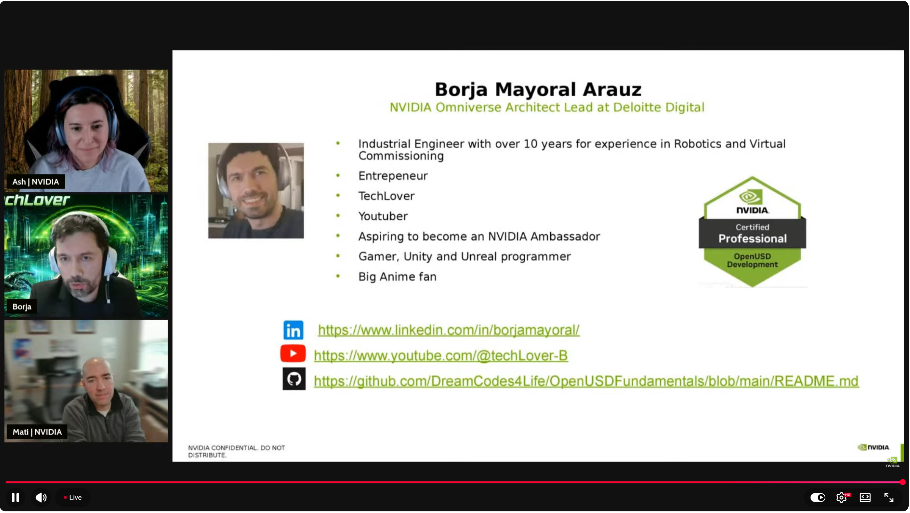](Pics/RenderingVisualizingOpenUSD_Scenes/Rendering_VisualizingOpenUSD_Scenes_2026-03-02_20h03_56.png)

### The chapter map for this deep dive

[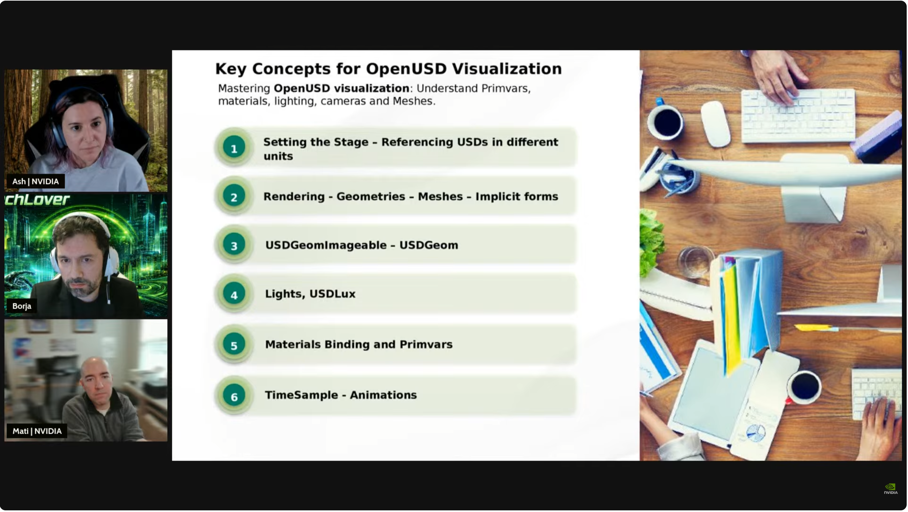](Pics/RenderingVisualizingOpenUSD_Scenes/Rendering_VisualizingOpenUSD_Scenes_2026-03-02_20h04_43.png)

This is the structure we will follow:

1. Setting the stage (units/axis/time defaults + composition pitfalls)
2. Mesh rendering basics (what must exist to draw)
3. `UsdGeomImageable` (visibility + purpose)
4. Lights (`UsdLux`)
5. Materials + material bindings
6. Primvars (data visualization overlays)
7. Time samples + animation timing

### Digital twin translation (Packaging Cell 3)

Packaging Cell 3 is a good example because it forces *physical correctness*:

- If the robot is scaled 100×, your “reach envelope” validation is nonsense.
- If Z-up/Y-up is flipped, gravity and motion previews are misleading.
- If your “sensor status overlay” is implemented via `primvars:displayColor`, it may disappear the moment you bind final materials.

**Learn OpenUSD →** Keep the curriculum open while you read this: it is the fastest way to turn “I can follow the talk” into “I can author and debug this.” Start with the curriculum index [2 — Learn OpenUSD curriculum](#link-2), and keep the glossary handy for vocabulary checks [4 — Glossary](#link-4).

---

<a id="chapter-1"></a>
## Chapter 1 — Setting the Stage (Units, Axis, and Composition Pitfalls) <br> -> Referencing vs sublayers | *Interoperability*

**Watch this section first:** [Video jump ~03:53](https://www.youtube.com/watch?v=-6x8fuYVBPk&t=233s)

Chapter 1 is the moment Packaging Cell 3 becomes real: you create a stage that will host robot, conveyor, sensors, and overlays — and you decide what “one unit” and “up” actually mean for the project.

The first visualization mistakes almost always happen **before** you import any asset:

- the stage is in the wrong units
- the stage is in the wrong up-axis
- the stage “looks fine” until you compose content authored elsewhere

This chapter covers what a stage “means” to tools, and why **how you compose** matters (reference/payload vs sublayer). The goal is not “fix it once until it looks right” — the goal is a **repeatable fix strategy** your pipeline can apply every time.

[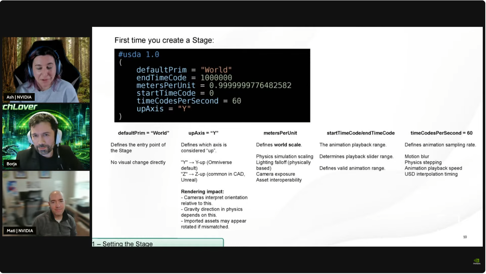](Pics/RenderingVisualizingOpenUSD_Scenes/Rendering_VisualizingOpenUSD_Scenes_2026-03-02_20h06_58.png)

### Stage-level metadata that changes reality

These fields are not decoration — they are “physics of the scene”:

- **`defaultPrim`** — what a consumer should treat as the “entry point” when referencing this stage.
- **`upAxis`** — which axis is “up” (`"Y"` or `"Z"` are the common ones). Cameras, gravity defaults in physics previews, and imported content expectations often rely on this.
- **`metersPerUnit`** — the world scale. Common values:
  - `1.0` → **meters** (default Isaac Sim / Lab)
  - `0.01` → **centimeters** (default Composer)
- **`startTimeCode` / `endTimeCode`** — playback range (mainly relevant for animation and timelines).
- **`timeCodesPerSecond` / `framesPerSecond`** — how timeCodes map to “real time” conventions (we go deep in Chapter 7).

#### Tool defaults you must know (Isaac Sim vs Omniverse USD Composer)

This is an easy way to get “everything is the wrong scale” bugs:

- **Isaac Sim** tends to default to **meters** (`metersPerUnit = 1.0`) because it lives in the robotics/simulation realm.
- **Omniverse USD Composer** commonly defaults to **centimeters** (`metersPerUnit = 0.01`) because many DCC-style workflows and asset libraries assume cm scale.

This mismatch can cause issues when you move assets/stages between applications. In Kit/Omniverse workflows, tools **can** author compensating transforms when you bring assets in via references/payloads — but that is **tool behavior**, not a universal OpenUSD guarantee. Treat it as a convenience, not a contract (next section).

### Exam-style question: What happens when you reference stages with different units/axis?

[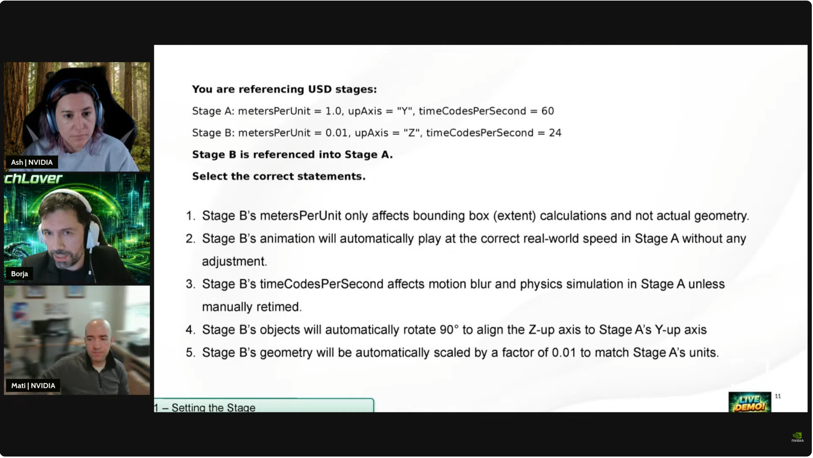](Pics/RenderingVisualizingOpenUSD_Scenes/Rendering_VisualizingOpenUSD_Scenes_2026-03-02_20h09_39.png)

In the session’s Omniverse/Kit context, the correct statements were (4) and (5): Kit **can** apply a rotation and scale correction when Stage B is referenced into Stage A.

[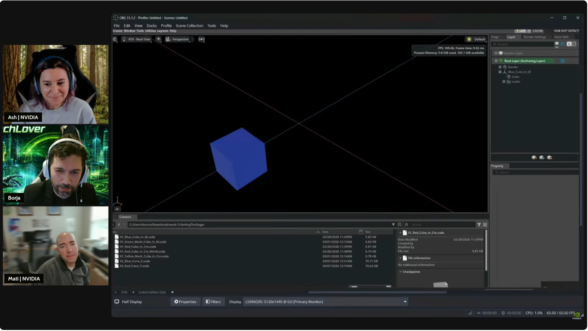](Pics/RenderingVisualizingOpenUSD_Scenes/Rendering_VisualizingOpenUSD_Scenes_2026-03-02_20h13_21.png)

The same “correct answers” are also visible in this later capture with explicit checkmarks:

[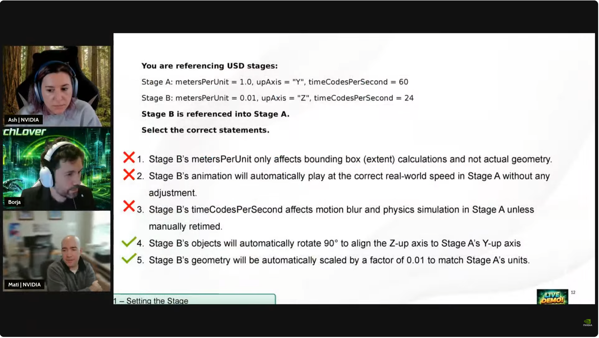](Pics/RenderingVisualizingOpenUSD_Scenes/Rendering_VisualizingOpenUSD_Scenes_2026-03-02_20h20_56.png)

Here is how that correction discussion shows up in a real viewport during the live demo:

[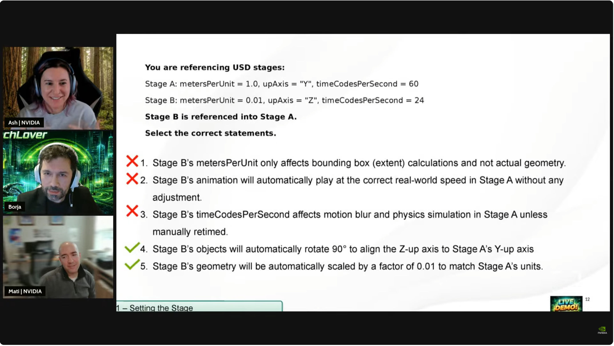](Pics/RenderingVisualizingOpenUSD_Scenes/Rendering_VisualizingOpenUSD_Scenes_2026-03-02_20h11_57.png)

[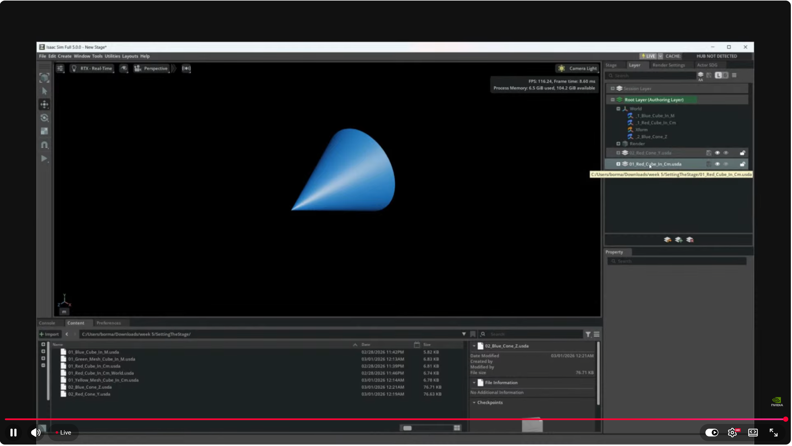](Pics/RenderingVisualizingOpenUSD_Scenes/Rendering_VisualizingOpenUSD_Scenes_2026-03-02_20h19_04.png)

**Pipeline reality check (important):** USD itself does not magically convert your authored geometry. What happened here is **tool behavior**: Kit can author corrective xform ops on the referencing prim so that content *appears physically consistent*.

That leads directly to the pitfall that matters for digital twins:

### Reference/payload vs sublayer is not “just another way to bring things in”

[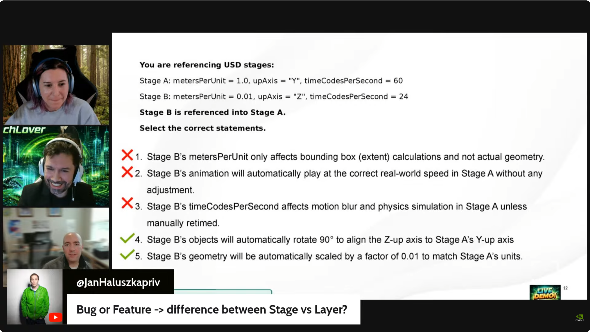](Pics/RenderingVisualizingOpenUSD_Scenes/Rendering_VisualizingOpenUSD_Scenes_2026-03-02_20h21_22.png)

The key idea from the session discussion:

- **Reference/payload**: you are bringing an asset onto a prim. A tool has an opportunity to add correctives on that prim (scale/orientation fixes).
- **Sublayer**: you are composing opinions into the same namespace. If you “fix” scale/orientation here, you typically do it by authoring new opinions (often xforms) that can be harder to scope cleanly and can unintentionally affect unrelated prims.

That’s why sublayering an asset authored in cm into a stage authored in m can produce the “massive cube” problem.

#### Live demo: “Why is this cube huge?”

[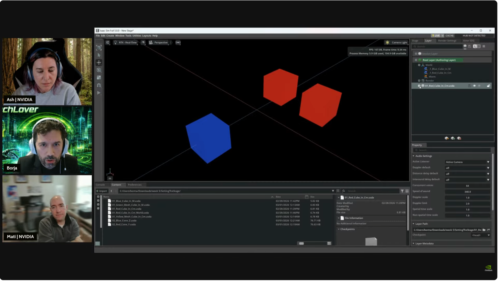](Pics/RenderingVisualizingOpenUSD_Scenes/Rendering_VisualizingOpenUSD_Scenes_2026-03-02_20h17_35.png)

[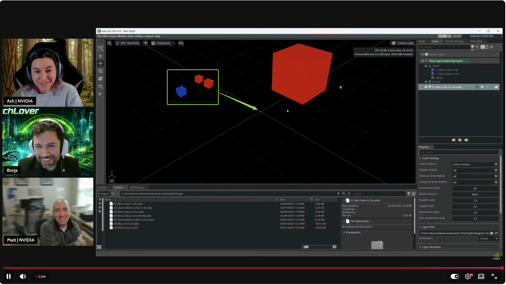](Pics/RenderingVisualizingOpenUSD_Scenes/Rendering_VisualizingOpenUSD_Scenes_2026-03-02_20h17_56.png)

**Digital twin implication:** if your “robot base” USD is authored in cm (common in CAD exports) and you sublayer it into a meter-based simulation stage, your cell layout is instantly untrustworthy.

#### Live demo: “Why is this cone rotated?”

[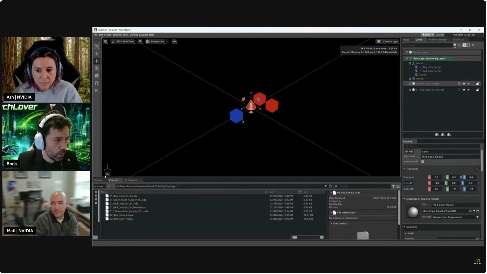](Pics/RenderingVisualizingOpenUSD_Scenes/Rendering_VisualizingOpenUSD_Scenes_2026-03-02_20h18_28.png)

[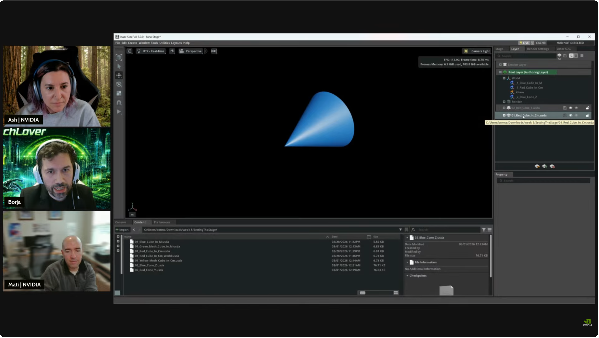](Pics/RenderingVisualizingOpenUSD_Scenes/Rendering_VisualizingOpenUSD_Scenes_2026-03-02_20h18_54.png)

[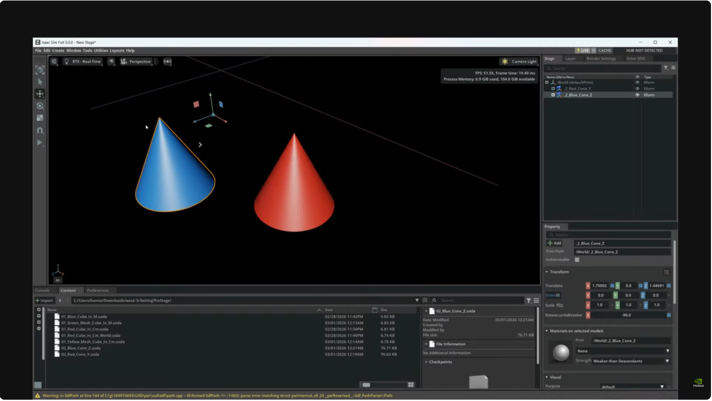](Pics/RenderingVisualizingOpenUSD_Scenes/Rendering_VisualizingOpenUSD_Scenes_2026-03-02_20h19_38.png)

[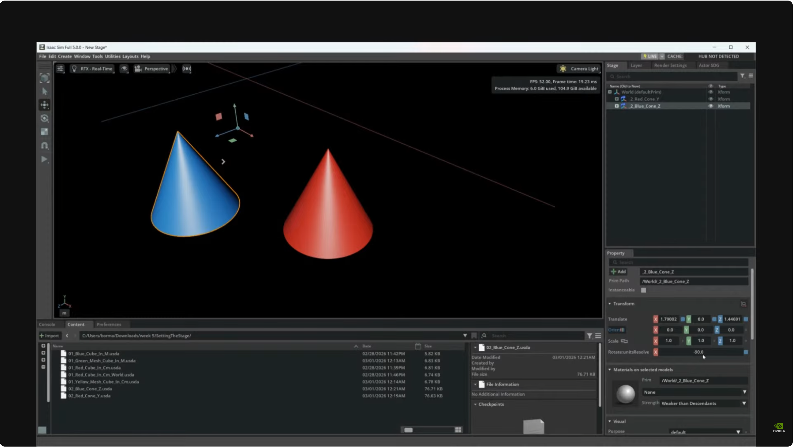](Pics/RenderingVisualizingOpenUSD_Scenes/Rendering_VisualizingOpenUSD_Scenes_2026-03-02_20h19_45.png)

### Practical rules for Packaging Cell 3

Use these rules to avoid the most common “visualization lies”:

1. **Pick a canonical stage convention** for your project (units + upAxis) and enforce it at publish time.
2. **Use references/payloads for assets**, not sublayers — assets frequently originate from mixed conventions.
3. **Use sublayers for opinions within one convention** (materials, overrides, simulation layers, etc.).
4. If you must compose across conventions, **make the correction explicit and testable** (a known scale + rotate op on the referencing prim, and a validation check that asserts it exists).

#### Stabilize your fixups (pipeline decision, not a one-off viewport tweak)

The worst outcome is “someone fixed it once” with manual transforms and nobody can reproduce the fix on the next import. Pick one strategy and make it the team rule:

- **Fix at the source** (preferred when possible): normalize units/up-axis at export time so the published asset already matches the project contract.
- **Fix in the import pipeline**: your importer creates a *normalized variant* (or writes a deterministic fixup layer) every time the asset is ingested.
- **Fix at composition time**: keep the original asset untouched, and apply a dedicated `over` layer that authors the compensating xform ops on the **insertion prim** (the prim that holds the reference/payload). This keeps fixups versioned, reviewable, and repeatable.

**Learn OpenUSD →** Practice stage metadata and unit conventions in Learn OpenUSD: stage metadata [5 — Metadata](#link-5) and units [6 — Units](#link-6). Treat this as “digital twin alignment 101”.

### Script Lab (Chapter 1)

Planned scripts (not yet committed):

- `basic/00_create_stage_metadata.py` — author a stage header for Packaging Cell 3 (defaults + deliberate choices).
- `basic/01_units_axis_reference_vs_sublayer.py` — generate assets in different units/axis and compose them two ways.

**Packaging Cell 3 checkpoint:** you now have a stage with declared physical meaning (axis + scale) and you know which composition choices preserve that meaning when you bring in real assets. Next we zoom in from “the world is correct” to “the geometry is correct”.

---

<a id="chapter-2"></a>
## Chapter 2 — Rendering Geometries: Meshes (What’s Required, What’s Not) <br> -> Mesh minimums | *Debug literacy*

**Watch this section first:** [Video jump ~20:36](https://www.youtube.com/watch?v=-6x8fuYVBPk&t=1236s)

Now that the stage contract is declared, you start bringing in Packaging Cell 3 geometry: robot base, gripper, conveyor rails, fixtures. The next failure mode is sneaky: something renders, but not in the way you think — because the geometry data is incomplete, mis-authored, or “looks OK” only under one renderer’s forgiving defaults.

If Chapter 1 is about *stage meaning*, Chapter 2 is about *geometry meaning*.

Certification questions here often look like “read this USDA and decide what happens.” The goal is not to memorize arrays — it is to know what each array *means*.

[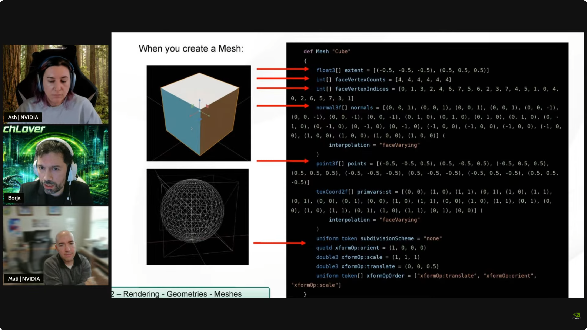](Pics/RenderingVisualizingOpenUSD_Scenes/Rendering_VisualizingOpenUSD_Scenes_2026-03-02_20h23_41.png)

### Mesh basics you must internalize

- **`points`**: vertex positions (the geometry).
- **`faceVertexCounts`**: how many vertices per face (topology).
- **`faceVertexIndices`**: indices into `points` (topology wiring).
- **`normals`**: optional; if missing, many renderers compute them.
- **`extent`**: bounds for acceleration structures and fast calculations — it is not “the scale of the mesh”.

For Packaging Cell 3: if your mesh topology is wrong, your inspection overlays (primvars) can be technically “correct” but visually meaningless, because you’re coloring the wrong vertices/faces.

### Exam-style question: minimum required elements for viewport rendering

[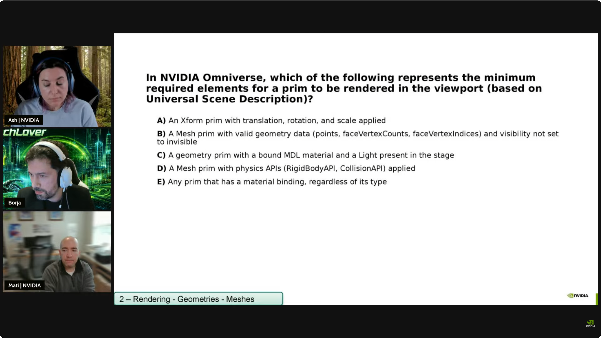](Pics/RenderingVisualizingOpenUSD_Scenes/Rendering_VisualizingOpenUSD_Scenes_2026-03-02_20h27_01.png)

The takeaway: you don’t need physics, materials, or even transforms to *render*. You need:

- a renderable prim (typically a `Mesh` or other `UsdGeom` typed prim)
- valid geometry data
- visibility not set to `invisible`

### Exam-style question: interpret these USDA snippets

[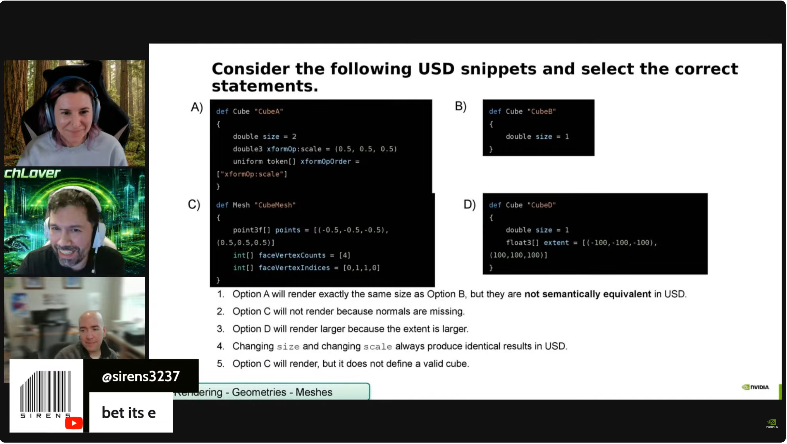](Pics/RenderingVisualizingOpenUSD_Scenes/Rendering_VisualizingOpenUSD_Scenes_2026-03-02_20h29_05.png)

[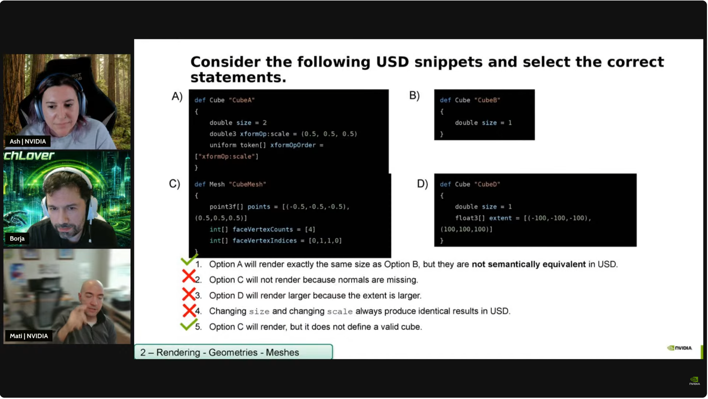](Pics/RenderingVisualizingOpenUSD_Scenes/Rendering_VisualizingOpenUSD_Scenes_2026-03-02_20h32_39.png)

### Code Breakout — Mesh snippets A/B/C/D (foolproof)

Below is the same logic from the slide, rewritten with comments so a beginner can reason about it line by line.

```usda
# A) CubeA
def Cube "CubeA"
{
    double size = 2
    double3 xformOp:scale = (0.5, 0.5, 0.5)
    uniform token[] xformOpOrder = ["xformOp:scale"]
}
# Net effect: geometric size 2, then scaled by 0.5 -> renders like size 1.
# Important: this is NOT semantically the same as authoring size=1.

# B) CubeB
def Cube "CubeB"
{
    double size = 1
}
# Direct authoring: true unit cube, no extra xform op.

# C) MeshCubeish
def Mesh "CubeMesh"
{
    point3f[] points = [(-0.5, -0.5, -0.5), (0.5, 0.5, 0.5)]
    int[] faceVertexCounts = [4]
    int[] faceVertexIndices = [0, 1, 1, 0]
}
# It authors a mesh prim, but topology is degenerate.
# Many renderers may show no visible surface (zero-area/invalid face construction).

# D) CubeD
def Cube "CubeD"
{
    double size = 1
    float3[] extent = [(-100, -100, -100), (100, 100, 100)]
}
# extent is metadata-style bounding info, not geometric scale.
# The rendered cube is still size 1 unless transform/size data says otherwise.
```

**Why each statement works or fails:**

- **1) "A renders same size as B, but not semantically equivalent" -> works**
  - Visual result can match (2 * 0.5 = 1).
  - Semantic authoring differs: one encodes size in schema param, one in transform stack.
- **2) "C will not render because normals are missing" -> fails**
  - Missing normals usually does not block rendering; viewers/renderers can compute normals.
- **3) "D will render larger because extent is larger" -> fails**
  - `extent` does not scale geometry; it informs bounds queries/acceleration/selection behavior.
- **4) "Changing size and changing scale always produce identical results" -> fails**
  - Not always identical in downstream behavior (override location, inherited transforms, intent, tools).
- **5) "C will render, but does not define a valid cube" -> partially true / tool-dependent**
  - Correct: it does not define a valid cube.
  - Visibility outcome is renderer-dependent because geometry is degenerate.

Key reasoning patterns:

- **“Same result” ≠ “same meaning.”** Two cubes can render the same size while being authored differently (e.g., `size` vs xform scale). In pipelines, this matters for downstream logic, authoring intent, and where overrides should live.
- **Missing normals usually doesn’t prevent rendering.** Renderers can compute them.
- **Changing `extent` doesn’t scale the mesh.** It changes bounds used for internal calculations.
- **“Renders” is not the same as “is semantically a cube.”** A mesh can author successfully yet still be degenerate and produce little or no visible result.

### Exam-style question: which USD structure is correct?

[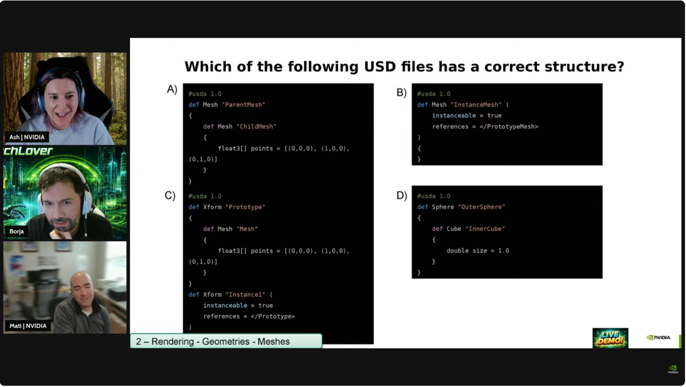](Pics/RenderingVisualizingOpenUSD_Scenes/Rendering_VisualizingOpenUSD_Scenes_2026-03-02_20h33_09.png)

[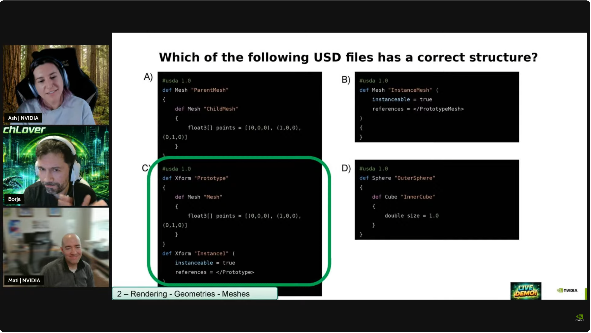](Pics/RenderingVisualizingOpenUSD_Scenes/Rendering_VisualizingOpenUSD_Scenes_2026-03-02_20h36_10.png)

### Code Breakout — Correct USD structure for instancing (why this works)

The point of this question is: **what exactly should be instanced** so per-instance placement stays clean and predictable.

```usda
# Recommended pattern (works well):
def Xform "PrototypeRoot" (
    instanceable = true
)
{
    # Reference the reusable asset under a transformable container.
    prepend references = @./assets/robot_module.usd@
}

def Xform "CellA_Module_01" (
    instanceable = true
)
{
    prepend references = </PrototypeRoot>
    double3 xformOp:translate = (0, 0, 0)
    uniform token[] xformOpOrder = ["xformOp:translate"]
}

def Xform "CellA_Module_02" (
    instanceable = true
)
{
    prepend references = </PrototypeRoot>
    double3 xformOp:translate = (2.5, 0, 0)
    uniform token[] xformOpOrder = ["xformOp:translate"]
}
```

**Why this works:**

- You instance an `Xform` container, not a naked mesh.
- Each instance has a clear local transform boundary (`xformOp:*`).
- The prototype can contain multiple prims/materials without breaking placement logic.

**What usually fails (or becomes painful):**

- **Instancing a mesh prim directly**: technically possible in some setups, but brittle for real scenes (poor structure for multi-prim assets, awkward transform management).
- **No transform container**: per-instance placement/override intent gets muddy and harder to debug.
- **Mixing asset structure and placement in one prim**: works short-term, hurts reuse and pipeline clarity later.

The production insight: instancing “works” when you instance **a transformable container** (usually an `Xform`) that references a prototype. Instancing a mesh directly is usually a smell because you lose meaningful per-instance placement control.

**Learn OpenUSD →** Mesh authoring and inspection skills are foundational for the rest: `UsdGeomMesh` [7 — UsdGeomMesh](#link-7) and transforms (`UsdGeomXformable`) [8 — UsdGeomXformable](#link-8).

### Script Lab (Chapter 2)

Planned scripts (not yet committed):

- `geometry/10_mesh_minimums_and_extent.py` — generate minimal mesh examples and common pitfalls.

**Packaging Cell 3 checkpoint:** you can now read a mesh like a mechanic reads an engine — not “does it look right?”, but “does it have the parts required to behave predictably?”. Next we add render controls so you can decide what is drawn (and what is intentionally hidden).

---

<a id="chapter-3"></a>
## Chapter 3 — `UsdGeomImageable`: Visibility + Purpose (Render-Control Layer) <br> -> What renders and why | *Viewport correctness*

**Watch this section first:** [Video jump ~33:14](https://www.youtube.com/watch?v=-6x8fuYVBPk&t=1994s)

Once Packaging Cell 3 geometry is structurally sound, the next question is operational: **what should the viewer draw right now?** In production you rarely want “everything, full-res, always.” You want proxies for the whole plant (fast), final render geometry for the station under review (credible), and guide geometry for debugging rigs, measurements, and safety overlays.

This chapter is the part that turns “I have geometry” into “I control what is drawn”.

If you’re building Packaging Cell 3, purpose and visibility are how you keep your cell usable:

- show proxies for the full factory (fast)
- show full render geometry only for the station you’re inspecting
- show guide geometry only when debugging rigs, measurements, or overlays

[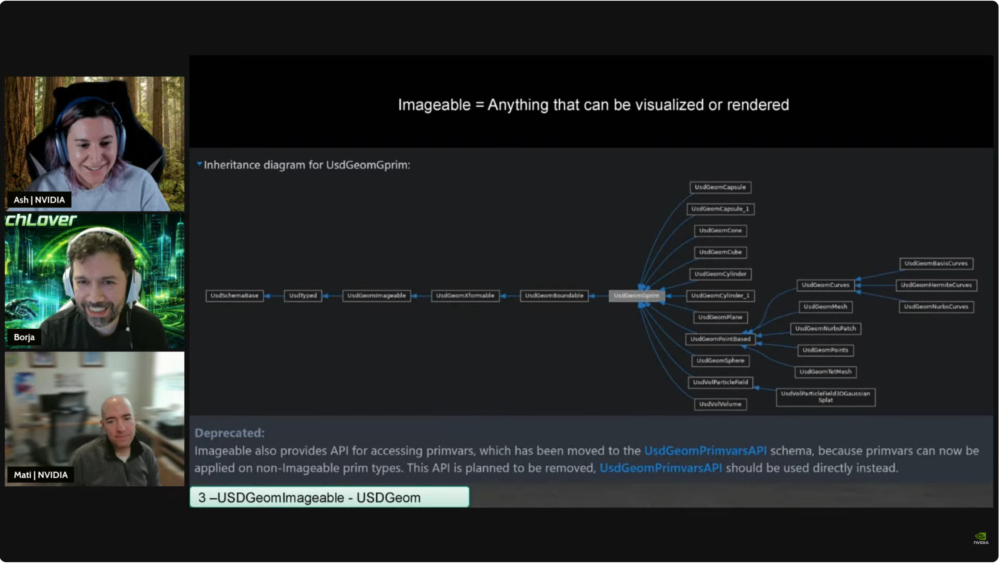](Pics/RenderingVisualizingOpenUSD_Scenes/Rendering_VisualizingOpenUSD_Scenes_2026-03-02_20h36_19.png)

[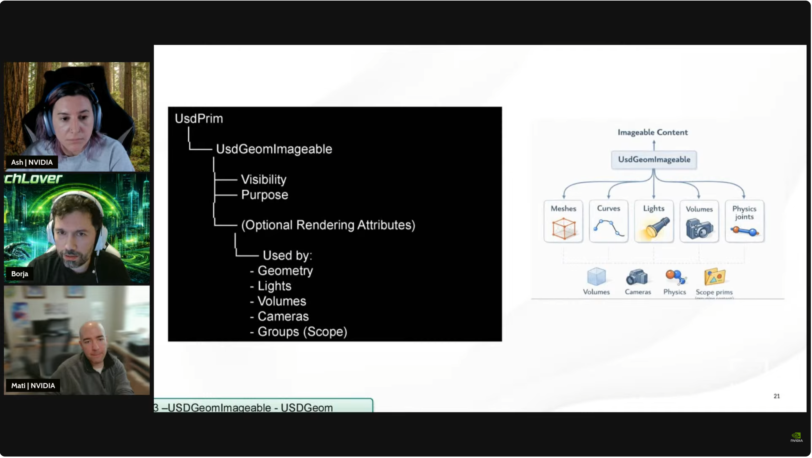](Pics/RenderingVisualizingOpenUSD_Scenes/Rendering_VisualizingOpenUSD_Scenes_2026-03-02_20h39_30.png)

[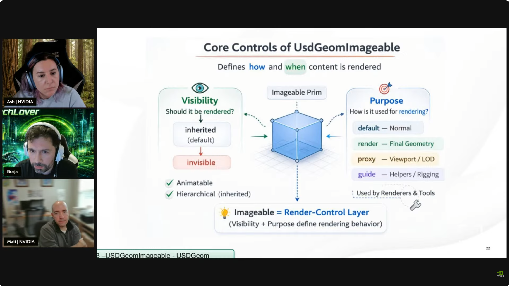](Pics/RenderingVisualizingOpenUSD_Scenes/Rendering_VisualizingOpenUSD_Scenes_2026-03-02_20h40_50.png)

### Two knobs: `visibility` and `purpose`

#### Visibility

Visibility is simple but exam questions like to trick you:

- Valid values are **`inherited`** (default) and **`invisible`**.
- There is no “visible” token to switch to.
- Visibility behaves hierarchically (a parent can hide whole subtrees).

#### Purpose

Purpose is how you tag geometry for a specific “use case view”:

- `default` — normal geometry
- `render` — final/high-quality representation
- `proxy` — viewport/LOD stand-in
- `guide` — helpers/debug/rigging overlays

Renderers and tools decide what to show by selecting which purposes are included.

### Exam-style question: effective purpose of imageable prims

[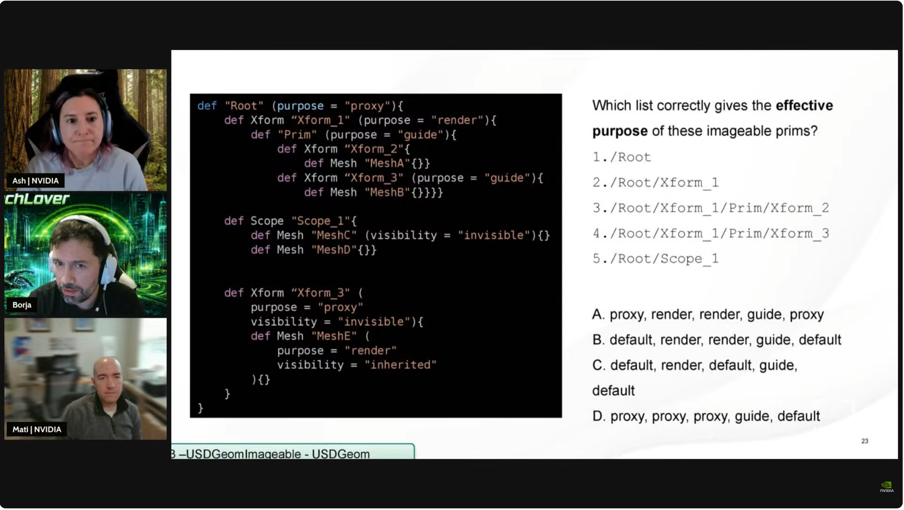](Pics/RenderingVisualizingOpenUSD_Scenes/Rendering_VisualizingOpenUSD_Scenes_2026-03-02_20h42_49.png)

[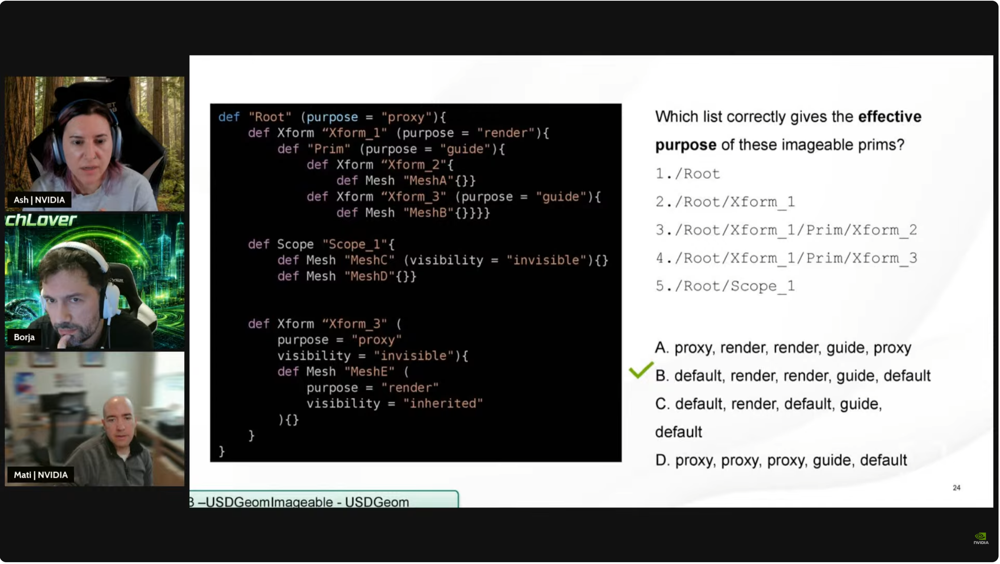](Pics/RenderingVisualizingOpenUSD_Scenes/Rendering_VisualizingOpenUSD_Scenes_2026-03-02_20h46_34.png)

The reasoning pattern is:

1. Effective purpose is computed along the ancestor chain (and only makes sense for prims that are treated as imageable by tools).
2. If a prim has an explicit purpose, that is its purpose.
3. If it doesn’t, it inherits the nearest meaningful purpose from its imageable ancestors; otherwise it’s `default`.

### Exam-style question: what actually renders with included purposes?

[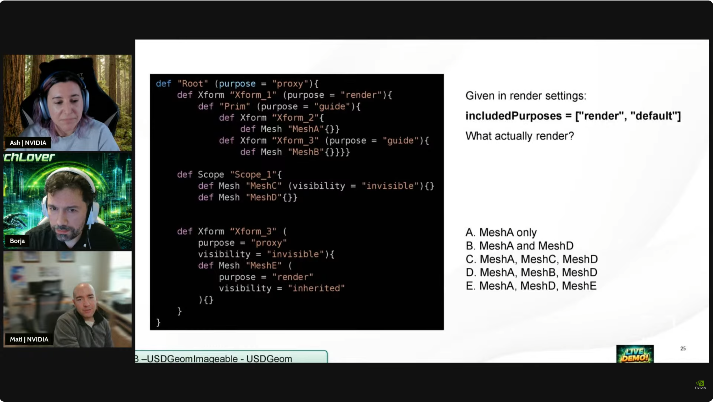](Pics/RenderingVisualizingOpenUSD_Scenes/Rendering_VisualizingOpenUSD_Scenes_2026-03-02_20h47_50.png)

[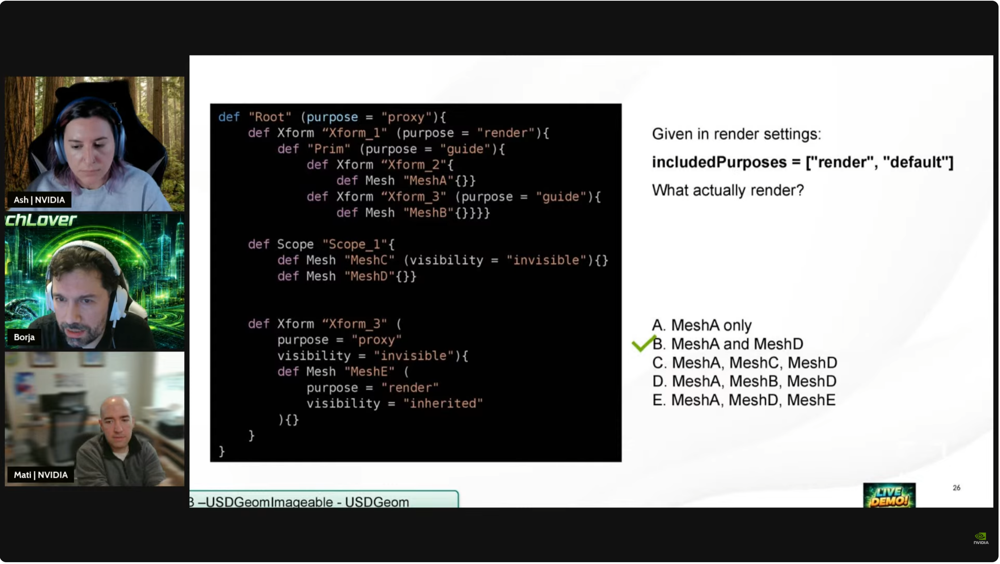](Pics/RenderingVisualizingOpenUSD_Scenes/Rendering_VisualizingOpenUSD_Scenes_2026-03-02_20h50_56.png)

This is the core insight: **purpose is a render filter**. In Packaging Cell 3, if your “jam sensor guides” are authored as `guide` and your renderer doesn’t include `guide`, they are not just “hard to see” — they are not drawn at all.

**Learn OpenUSD →** Read purpose/visibility as a render-control layer: `UsdGeomImageable` (API) [9 — UsdGeomImageable](#link-9) and Learn OpenUSD guidance on purpose/visibility [10 — Purpose and visibility](#link-10).

### Script Lab (Chapter 3)

Planned scripts (not yet committed):

- `render_controls/20_visibility_and_purpose.py` — generate a purpose/visibility sandbox stage.

**Packaging Cell 3 checkpoint:** you can now explain “it’s missing in the render” without superstition — you can point to visibility and purpose as deliberate filters. Next we make the view legible and trustworthy by lighting it.

---

<a id="chapter-4"></a>
## Chapter 4 — Lights (`UsdLux`): Typed Lights vs `LightAPI` <br> -> Hydra semantics | *Lighting correctness*

**Watch this section first:** [Video jump ~48:19](https://www.youtube.com/watch?v=-6x8fuYVBPk&t=2899s)

With purpose and visibility under control, you can finally make Packaging Cell 3 *legible*. Lighting is not only about beauty; it changes what stakeholders believe: whether surfaces read as metal vs plastic, whether edges are visible for clearance checks, and whether your “review render” has stable exposure week to week.

Lights are a classic exam topic because they test two things at once:

1. Do you know the **typed light schemas** (`UsdLuxDomeLight`, `UsdLuxRectLight`, …)?
2. Do you understand the difference between a **typed schema** and an **API schema** (`UsdLux.LightAPI`)?

### Choose the right light type for the job

[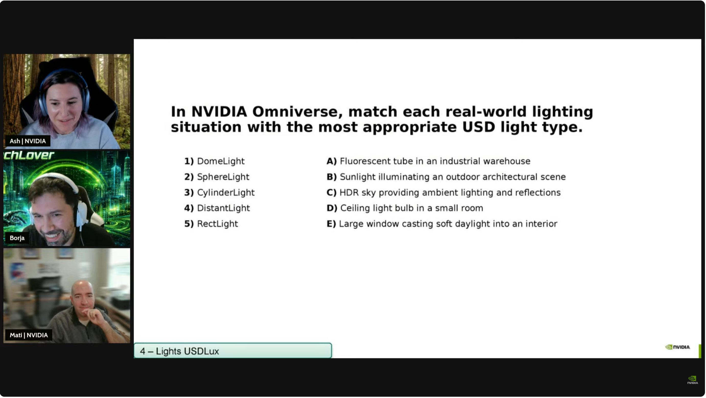](Pics/RenderingVisualizingOpenUSD_Scenes/Rendering_VisualizingOpenUSD_Scenes_2026-03-02_20h51_24.png)

[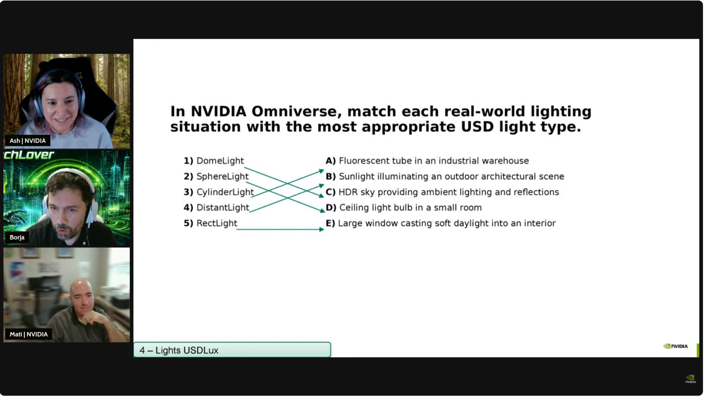](Pics/RenderingVisualizingOpenUSD_Scenes/Rendering_VisualizingOpenUSD_Scenes_2026-03-02_20h51_17.png)

Packaging Cell 3 translations:

- **DomeLight**: “industrial HDRI” baseline for reflections and ambient.
- **RectLight**: window/area-light behavior (common in “review renders”).
- **DistantLight**: sun/parallel light (common for outdoor digital twins).
- **Sphere/CylinderLight**: practical fixtures (bulbs/tubes) in real factory lighting.

### Typed light vs `LightAPI`: why Hydra cares

The session uses a small Python snippet and asks multiple exam-style questions about it.

[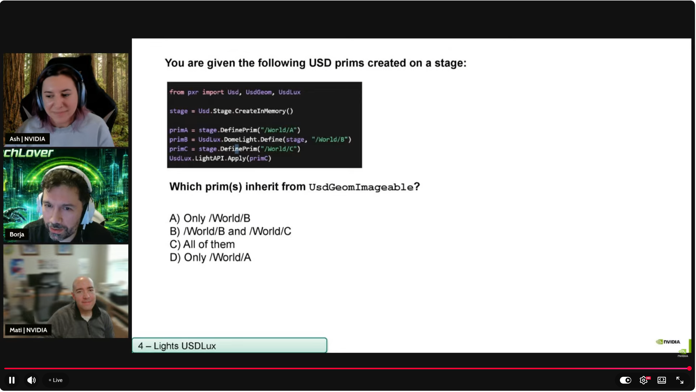](Pics/RenderingVisualizingOpenUSD_Scenes/Rendering_VisualizingOpenUSD_Scenes_2026-03-02_20h53_26.png)

[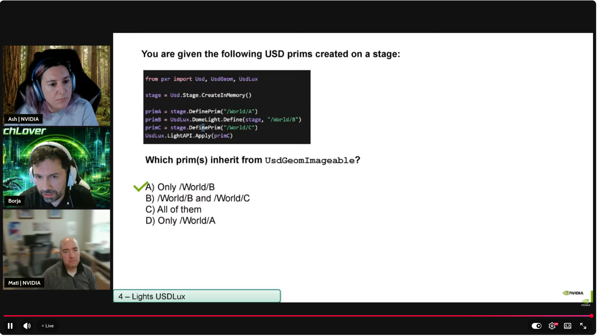](Pics/RenderingVisualizingOpenUSD_Scenes/Rendering_VisualizingOpenUSD_Scenes_2026-03-02_20h55_16.png)

### Code Breakout — Typed light vs `LightAPI` snippet

The same snippet is reused across several questions in this section. Here is the commented version:

```python
from pxr import Usd, UsdGeom, UsdLux

stage = Usd.Stage.CreateInMemory()

# A plain prim with no geometry/light type. Just a generic UsdPrim.
primA = stage.DefinePrim("/World/A")

# A typed light prim: this IS a real UsdLux DomeLight schema prim.
primB = UsdLux.DomeLight.Define(stage, "/World/B")

# Another plain prim.
primC = stage.DefinePrim("/World/C")

# Apply LightAPI to C: adds light-related API properties, but does NOT
# convert C's prim type into a typed light schema.
UsdLux.LightAPI.Apply(primC)
```

**Why answers work/fail in this group:**

- **"Which prim inherits from `UsdGeomImageable`?" -> only `/World/B` works**
  - `/World/B` is typed as `UsdLuxDomeLight`, and typed lights are imageable.
  - `/World/A` and `/World/C` are generic prims (not typed imageable schemas).
- **"Which prim is guaranteed to be a typed light schema?" -> only `/World/B` works**
  - `/World/B` is explicitly typed as `UsdLuxDomeLight`.
  - `LightAPI` on `/World/C` does not change its type name.
- **"`UsdLux.LightAPI` creates/converts/makes-anything-a-light" -> fails**
  - It only adds API attributes to an existing prim type.
- **"After applying `LightAPI` to `/World/C`, can we set intensity?" -> works**
  - Yes, because API attributes become legal to author.
  - But this still does not auto-convert `/World/C` to `UsdLuxDomeLight`.

The mental model:

- A **typed light prim** (like `UsdLuxDomeLight`) is explicit and discoverable by type.
- `UsdLux.LightAPI` does not change prim type name; it applies light API semantics/attributes to an existing prim.

[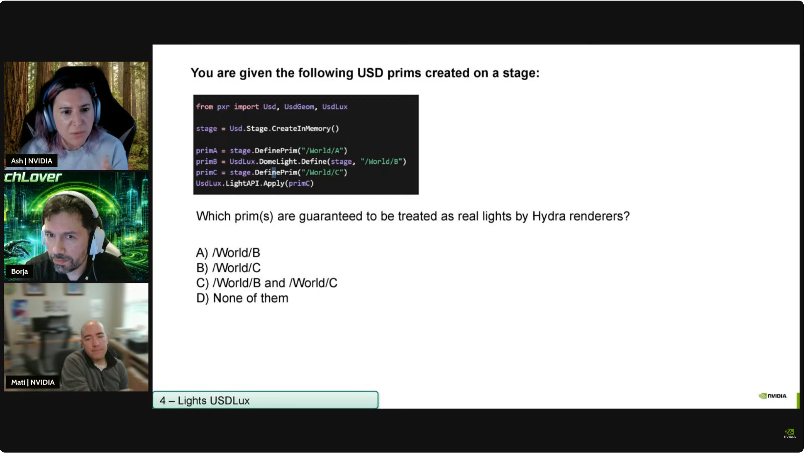](Pics/RenderingVisualizingOpenUSD_Scenes/Rendering_VisualizingOpenUSD_Scenes_2026-03-02_20h55_37.png)

[](Pics/RenderingVisualizingOpenUSD_Scenes/Rendering_VisualizingOpenUSD_Scenes_2026-03-02_20h57_03.png)

### What is `UsdLux.LightAPI`?

[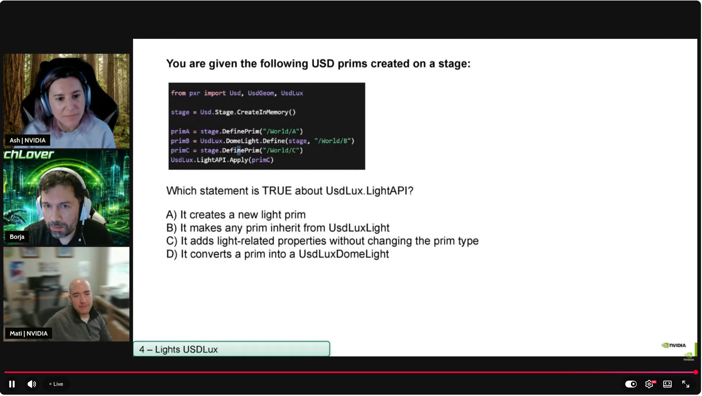](Pics/RenderingVisualizingOpenUSD_Scenes/Rendering_VisualizingOpenUSD_Scenes_2026-03-02_20h57_17.png)

[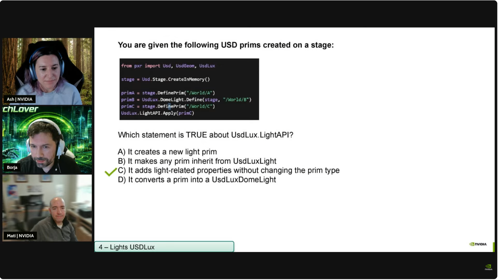](Pics/RenderingVisualizingOpenUSD_Scenes/Rendering_VisualizingOpenUSD_Scenes_2026-03-02_20h57_43.png)

If you apply `UsdLux.LightAPI` to a prim, you can author light attributes and impart light API semantics, but you do not convert that prim into a typed dome light schema.

[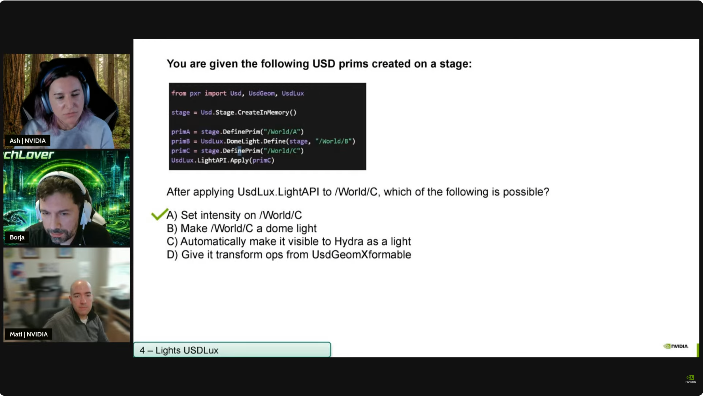](Pics/RenderingVisualizingOpenUSD_Scenes/Rendering_VisualizingOpenUSD_Scenes_2026-03-02_20h58_08.png)

And typed lights support `UsdGeomImageable`-style visibility controls:

[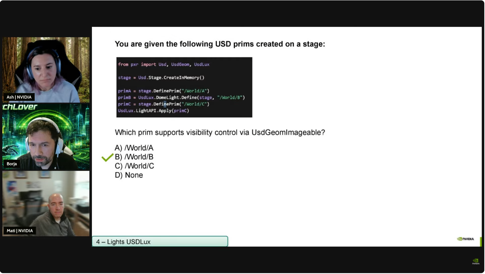](Pics/RenderingVisualizingOpenUSD_Scenes/Rendering_VisualizingOpenUSD_Scenes_2026-03-02_20h58_25.png)

**Digital twin insight:** treat lighting as two separate workflows:

- **Diagnostic lighting**: “Can I see what’s wrong?” (fast, obvious, consistent).
- **Review lighting**: “Would a stakeholder trust this view?” (physically plausible, stable exposure/reflections).

**Learn OpenUSD →** The official references to keep open while practicing:

- `UsdLux` overview + types [11 — UsdLux](#link-11)
- `UsdLuxLightAPI` [12 — UsdLuxLightAPI](#link-12)

### Script Lab (Chapter 4)

Planned scripts (not yet committed):

- `lights/30_usdlux_typed_vs_lightapi.py` — generate typed vs API light examples.

**Packaging Cell 3 checkpoint:** you now have two lighting modes in your pocket — one for debugging and one for stakeholder review — without confusing “light properties” with “actual lights”. Next we lock down the final look layer: materials and binding rules.

---

<a id="chapter-5"></a>
## Chapter 5 — Materials: Binding, Purpose, Collections, and Strength <br> -> What wins | *Lookdev correctness*

**Watch this section first:** [Video jump ~55:23](https://www.youtube.com/watch?v=-6x8fuYVBPk&t=3323s)

At this point Packaging Cell 3 can be staged, seen, filtered, and lit. Chapter 5 is where “it renders” turns into “it has a stable look.” Materials are also where pipelines accidentally create chaos: bindings scattered everywhere, overrides hiding missing authoring, and “one-off fixes” that don’t survive the next import.

Materials show up in certification questions because they are a perfect test of composition:

- author a binding at a parent → children inherit
- author a binding at a child → it overrides
- bind via collections → you reduce authoring repetition

[](Pics/RenderingVisualizingOpenUSD_Scenes/Rendering_VisualizingOpenUSD_Scenes_2026-03-02_20h58_28.png)

### Binding patterns you will see in USDA

These naming patterns are the “grammar” of material binding:

- **Direct**: `material:binding`
- **Purpose restricted**: `material:binding:<purpose>` (common: `preview`, `full`)
- **Collection-based**: `material:binding:collection:<collectionName>`
- **Purpose restricted + collection**: `material:binding:collection:<purpose>:<collectionName>`

Collection bindings are a scalability tool: in Packaging Cell 3, you might bind a “safety yellow” material to a collection of guard rails without touching every rail prim individually.

[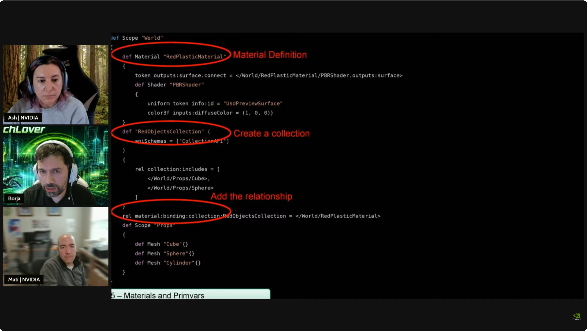](Pics/RenderingVisualizingOpenUSD_Scenes/Rendering_VisualizingOpenUSD_Scenes_2026-03-02_21h00_37.png)

### Code Breakout — Collection-based material binding

```usda
def Scope "World"
{
    # Apply CollectionAPI namespace on a REAL prim.
    prepend apiSchemas = ["CollectionAPI:RedObjects"]

    def Scope "Looks"
    {
        def Material "RedPlasticMaterial"
        {
            token outputs:surface.connect = </World/Looks/RedPlasticMaterial/PBRShader.outputs:surface>
            def Shader "PBRShader"
            {
                uniform token info:id = "UsdPreviewSurface"
                color3f inputs:diffuseColor = (1, 0, 0)
                token outputs:surface
            }
        }
    }

    def Scope "Props"
    {
        def Mesh "Cube" {}
        def Mesh "Sphere" {}
        def Mesh "Cylinder" {}
    }

    # Collection membership authored in CollectionAPI namespace.
    rel collection:RedObjects:includes = [
        </World/Props/Cube>,
        </World/Props/Sphere>
    ]

    # Collection-based binding to one material.
    rel material:binding:collection:RedObjects = </World/Looks/RedPlasticMaterial>
}
```

**Why this works well in production:**

- One relationship binds many targets through a named collection.
- You avoid repeating direct bindings on each mesh.
- It is easier to maintain when membership changes frequently.

**Why it fails when authored incorrectly:**

- Wrong relationship token naming -> binding is ignored.
- Missing/empty collection includes -> nothing receives material.
- Invalid material target path -> relationship resolves to nowhere.

### Exam-style question: which material is applied to each mesh?

[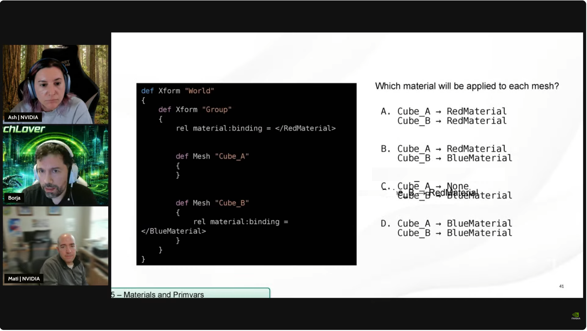](Pics/RenderingVisualizingOpenUSD_Scenes/Rendering_VisualizingOpenUSD_Scenes_2026-03-02_21h01_40.png)

[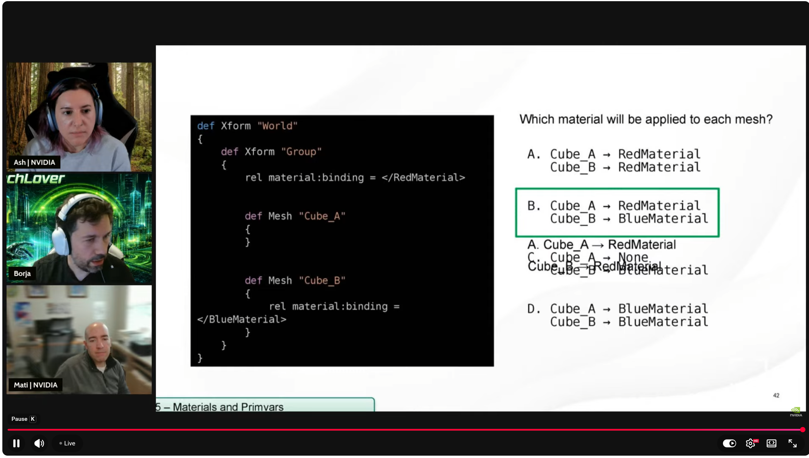](Pics/RenderingVisualizingOpenUSD_Scenes/Rendering_VisualizingOpenUSD_Scenes_2026-03-02_21h04_29.png)

### Code Breakout — Inheritance + local override (why B works)

```usda
def Xform "World"
{
    def Xform "Group"
    {
        # Parent-level binding: descendants inherit by default.
        rel material:binding = </RedMaterial>

        def Mesh "Cube_A"
        {
            # No local binding -> inherits RedMaterial.
        }

        def Mesh "Cube_B"
        {
            # Local binding on child -> overrides inherited parent binding.
            rel material:binding = </BlueMaterial>
        }
    }
}
```

**Why option B is correct:**

- `Cube_A` gets `RedMaterial` (inherited from `Group`).
- `Cube_B` gets `BlueMaterial` (local override wins over inherited binding).

**Why the other options fail:**

- **A fails**: ignores local override on `Cube_B`.
- **C fails**: claims missing binding where inheritance clearly exists.
- **D fails**: claims `Cube_A` is blue without a local blue binding.

Reasoning:

- `Group` binds `RedMaterial`
- `Cube_A` has no local binding → inherits `RedMaterial`
- `Cube_B` binds `BlueMaterial` → overrides the inherited binding

#### Binding strength (a subtle but real production lever)

USD also has a notion of “binding strength” (often surfaced in tools as something like *weaker/stronger than descendants*). The default behavior is “children override parents”, but you can author bindings to be stronger if you need a hard override.

Use this sparingly in digital twins: strong overrides are powerful, but they can hide mistakes (e.g., a local override masking a missing binding in a weaker layer).

#### Primvars vs materials: which color wins?

One practical pitfall called out in the session:

If you have a `primvars:displayColor` on a prim and you also bind a material that produces a different color, then in most “final look” render contexts **the bound material/shader defines the appearance** and `displayColor` is treated as a preview/fallback. Use `displayColor` as a lightweight diagnostic overlay unless your shader is authored to explicitly consume primvars (or you have a dedicated “overlay visualization mode” in your viewer).

**Learn OpenUSD →** Material binding and shader basics:

- Learn OpenUSD material concepts [13 — Shading & materials](#link-13)
- `UsdShadeMaterialBindingAPI` reference [14 — UsdShadeMaterialBindingAPI](#link-14)

### Script Lab (Chapter 5)

Planned scripts (not yet committed):

- `materials_primvars/40_material_binding_strength_and_collections.py` — direct bindings, overrides, and collections.

**Packaging Cell 3 checkpoint:** the cell can now have a stable “final look” without turning into a binding spaghetti mess. Next we bring back what makes it a *digital twin*: data overlays (primvars) that survive in a material-bound world.

---

<a id="chapter-6"></a>
## Chapter 6 — Primvars: `displayColor` + Interpolation (Data Visualization) <br> -> Field overlays | *Digital twin observability*

**Watch this section first:** [Video jump ~1:02:53](https://www.youtube.com/watch?v=-6x8fuYVBPk&t=3773s)

Materials give Packaging Cell 3 a believable physical look. Primvars are what make it a **digital twin**: speed heatmaps, jam zones, OK/WARN/FAULT overlays, and “show me what the sensors think is happening.”

This chapter gives you the mental model for authoring overlays that don’t break the moment the scene becomes “real”: you’ll learn the interpolation modes, the value-count rules, and the practical boundary between **diagnostic overlays** (fast, explicit) and **final look** shading (credible, stable). It’s also where you learn to recognize a classic digital-twin lie: the data is correct, but it’s mapped onto the wrong vertices/faces, so the picture is wrong.

Primvars are where “digital twin data” meets “rendered pixels”.

In Packaging Cell 3, primvars are how you visualize:

- conveyor speed heatmaps
- quality metrics per batch zone
- sensor states (OK/WARN/FAULT)

The certification often focuses on the same foundational question:

> Given a mesh and a primvar interpolation, how many values must be authored?

[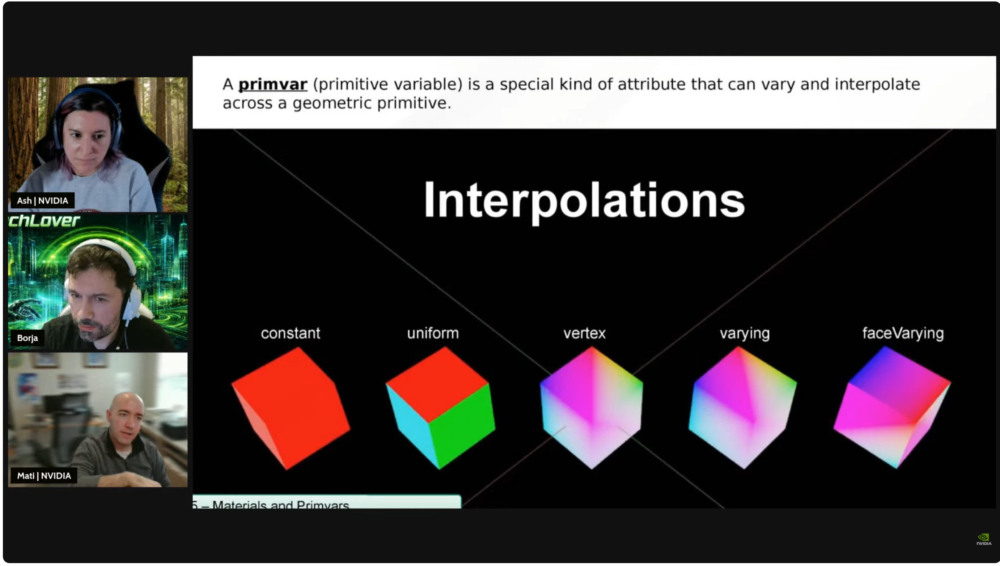](Pics/RenderingVisualizingOpenUSD_Scenes/Rendering_VisualizingOpenUSD_Scenes_2026-03-02_21h12_00.png)

### The five interpolations (and the one formula that saves you)

Treat this as your “primvar value-count cheat sheet”:

- **`constant`**: `1` value (whole prim)
- **`uniform`**: `numFaces` values (one per face)
- **`vertex`**: `len(points)` values (one per point/vertex)
- **`varying`**: often `len(points)` for polygon meshes; differs in meaning for subdivision surfaces
- **`faceVarying`**: `sum(faceVertexCounts)` values (one per face-vertex corner)

[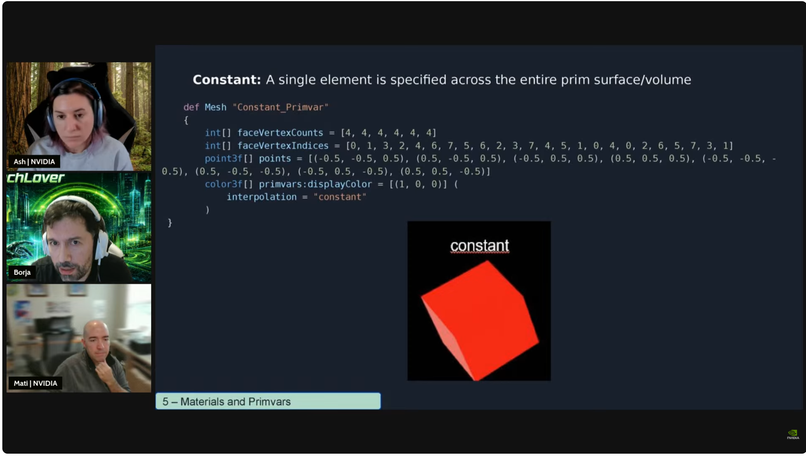](Pics/RenderingVisualizingOpenUSD_Scenes/Rendering_VisualizingOpenUSD_Scenes_2026-03-02_21h05_58.png)

[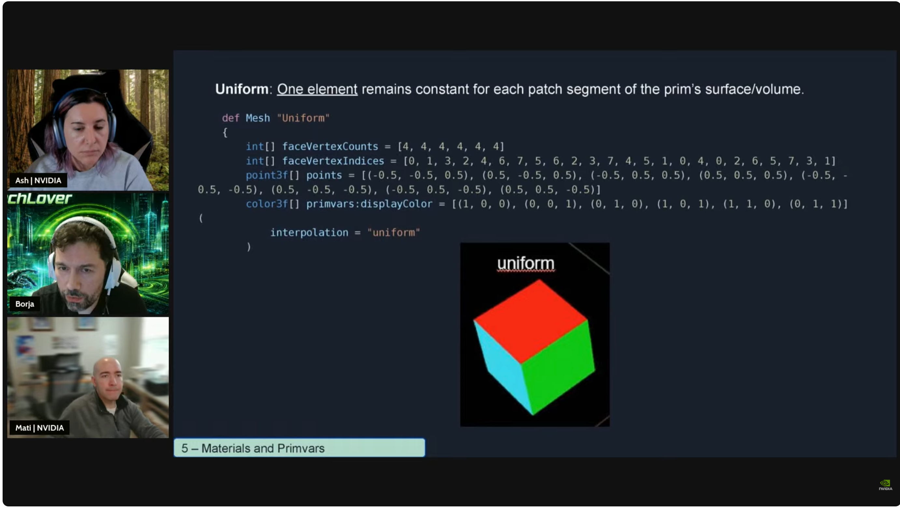](Pics/RenderingVisualizingOpenUSD_Scenes/Rendering_VisualizingOpenUSD_Scenes_2026-03-02_21h06_42.png)

[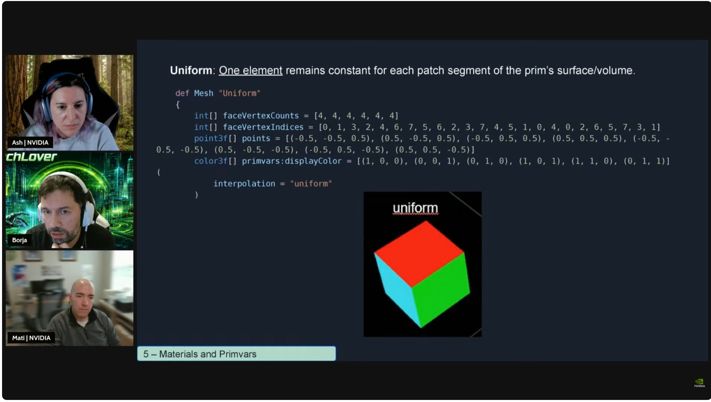](Pics/RenderingVisualizingOpenUSD_Scenes/Rendering_VisualizingOpenUSD_Scenes_2026-03-02_21h11_02.png)

[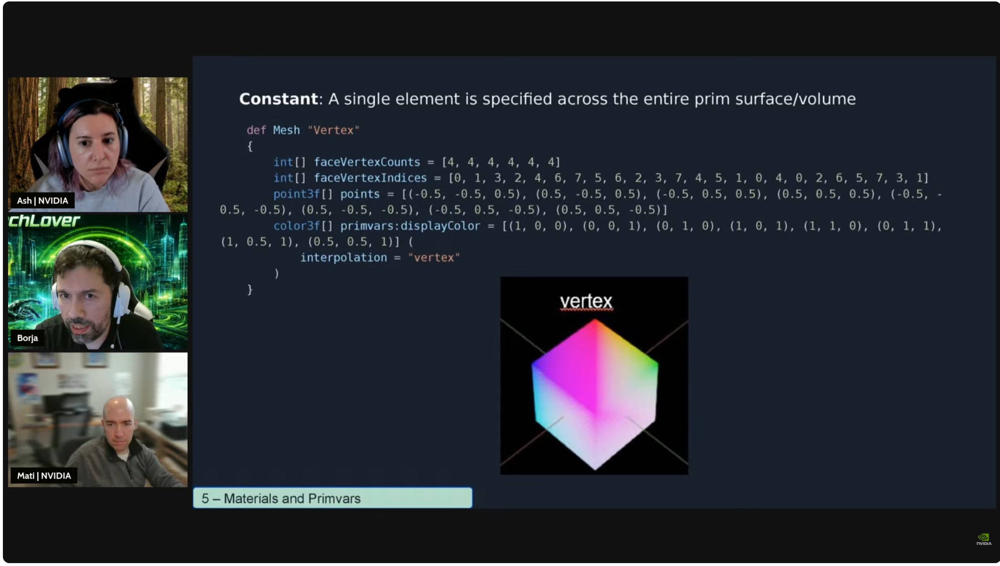](Pics/RenderingVisualizingOpenUSD_Scenes/Rendering_VisualizingOpenUSD_Scenes_2026-03-02_21h07_04.png)

[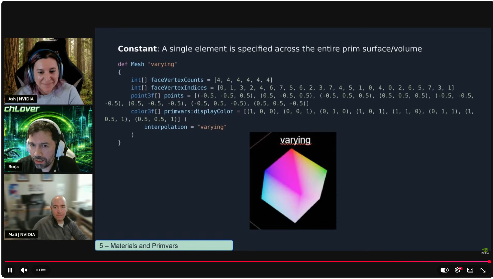](Pics/RenderingVisualizingOpenUSD_Scenes/Rendering_VisualizingOpenUSD_Scenes_2026-03-02_21h07_25.png)

[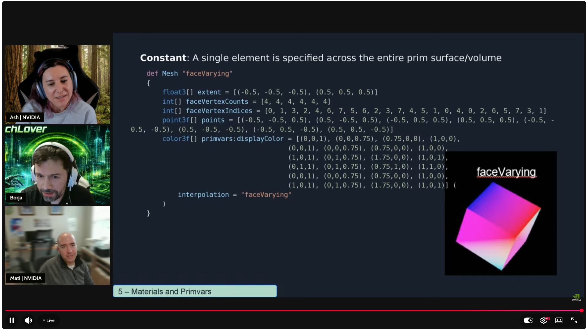](Pics/RenderingVisualizingOpenUSD_Scenes/Rendering_VisualizingOpenUSD_Scenes_2026-03-02_21h08_11.png)

### Code Breakout — Primvar interpolation modes (what changes, what stays)

All these slides use the same mesh topology and only change the primvar payload + interpolation token.

```usda
def Mesh "AnyMesh"
{
    int[] faceVertexCounts = [4, 4, 4, 4, 4, 4]   # six quad faces (cube)
    int[] faceVertexIndices = [...]                # topology wiring
    point3f[] points = [...]                       # vertex positions

    # Only these two things vary by mode:
    color3f[] primvars:displayColor = [...]        # value count depends on interpolation
    (
        interpolation = "constant"                 # or uniform/vertex/varying/faceVarying
    )
}
```

**Required value counts (foolproof rule):**

- `constant` -> exactly `1` value.
- `uniform` -> exactly `numFaces` values (cube here: `6`).
- `vertex` -> exactly `len(points)` values (cube here: `8`).
- `varying` -> typically `len(points)` on polygon meshes (cube here: `8`).
- `faceVarying` -> exactly `sum(faceVertexCounts)` (cube here: `24`).

**Why code works/fails in this family:**

- Works when count matches interpolation semantics.
- Fails (or gets validation errors/unexpected results) when counts mismatch.
- Looks similar does not mean same semantics: `vertex` vs `varying` can diverge in subdiv/evaluation behavior.

#### Vertex vs varying (what’s the actual difference?)

On simple polygon meshes (like a cube), **`vertex` and `varying` often look the same** in practice. The meaningful difference shows up when subdivision or surface interpolation behavior matters: `varying` is typically treated as more “linear/unsmoothed”, while `vertex` is treated as part of the “smooth surface” interpolation set. If you don’t live in subdiv workflows, the exam-relevant memory is: **both commonly require one value per point**, but their semantics differ in advanced rendering/subdivision contexts.

### Exam-style question: which primvar is correctly authored?

[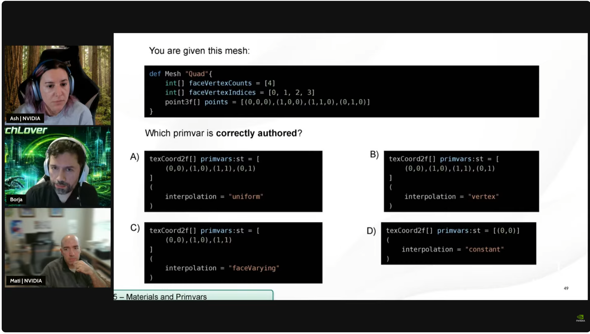](Pics/RenderingVisualizingOpenUSD_Scenes/Rendering_VisualizingOpenUSD_Scenes_2026-03-02_21h09_23.png)

[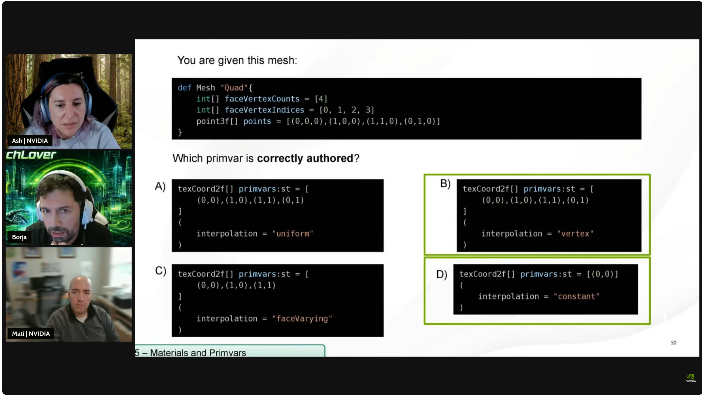](Pics/RenderingVisualizingOpenUSD_Scenes/Rendering_VisualizingOpenUSD_Scenes_2026-03-02_21h10_47.png)

### Code Breakout — Quad primvar question (why B and D work)

Base mesh from the slide:

```usda
def Mesh "Quad"
{
    int[] faceVertexCounts = [4]               # one face
    int[] faceVertexIndices = [0, 1, 2, 3]     # one quad
    point3f[] points = [(0,0,0), (1,0,0), (1,1,0), (0,1,0)]  # four points
}
```

Option breakdown:

```usda
# A) Fails
texCoord2f[] primvars:st = [(0,0), (1,0), (1,1), (0,1)]
(
    interpolation = "uniform"
)
# uniform needs 1 value per face. Here there is 1 face, but 4 values authored -> mismatch.

# B) Works
texCoord2f[] primvars:st = [(0,0), (1,0), (1,1), (0,1)]
(
    interpolation = "vertex"
)
# vertex needs 1 value per point. There are 4 points -> 4 values is correct.

# C) Fails
texCoord2f[] primvars:st = [(0,0), (1,0), (1,1)]
(
    interpolation = "faceVarying"
)
# faceVarying needs 1 value per face-corner.
# Quad has 4 corners -> needs 4 values, but only 3 provided.

# D) Works
texCoord2f[] primvars:st = [(0,0)]
(
    interpolation = "constant"
)
# constant always needs exactly 1 value -> correct.
```

Why are **B** and **D** correct?

- The mesh is one quad → `len(points) = 4` and there is one face.
- **B (`vertex`)**: provides 4 values → correct for `vertex`.
- **D (`constant`)**: provides 1 value → always correct for `constant`, regardless of face/vertex counts.

The session includes a follow-up Q&A that reinforces the “constant is always one value” rule:

[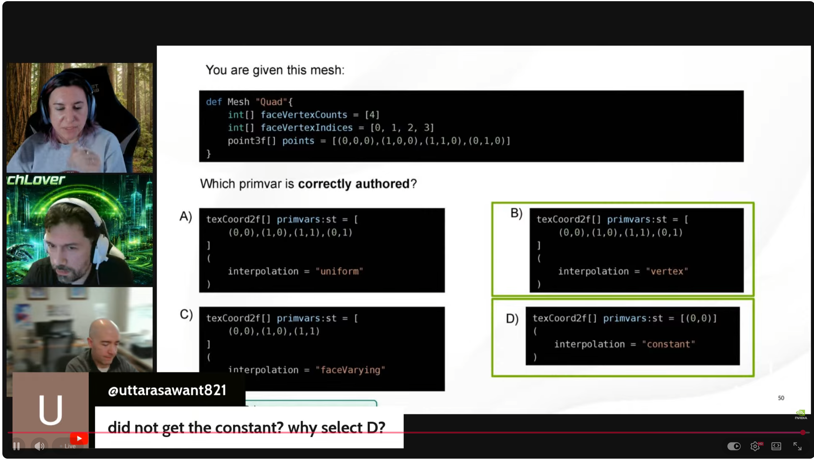](Pics/RenderingVisualizingOpenUSD_Scenes/Rendering_VisualizingOpenUSD_Scenes_2026-03-02_21h13_13.png)

**Learn OpenUSD →** Primvars are the core “data-to-visualization” bridge:

- Learn OpenUSD primvars module [15 — Primvars](#link-15)
- `UsdGeomPrimvarsAPI` reference [16 — UsdGeomPrimvarsAPI](#link-16)

### Script Lab (Chapter 6)

Planned scripts (not yet committed):

- `materials_primvars/41_primvars_displaycolor_interpolations.py` — generate one stage per interpolation mode.

**Packaging Cell 3 checkpoint:** your conveyor speed and sensor-state overlays are now authored *correctly* (counts match interpolation), which means “green/yellow/red” is no longer a fragile illusion. Next we make time trustworthy, so playback and root-cause analysis can’t silently lie.

---

<a id="chapter-7"></a>
## Chapter 7 — TimeSamples & Animation (TimeCodes, FPS, and Querying) <br> -> When did it happen? | *Temporal correctness*

**Watch this section first:** [Video jump ~1:10:25](https://www.youtube.com/watch?v=-6x8fuYVBPk&t=4225s)

Now we make the twin operational for investigation. In Packaging Cell 3, “what happened?” is almost always a time question: *When did the jam start? Where was the gripper at that moment? Did the sensor go WARN before FAULT?*

If Chapter 6 made your overlays reliable, Chapter 7 makes your playback and queries reliable. The target outcome is simple: when someone says “check timeCode 35,” your pipeline produces the same state in every tool, and your scripts read the same values every time.

Time is the easiest place to accidentally lie to yourself.

If your Packaging Cell 3 twin is used for simulation playback, root-cause analysis, or operator training, you need:

- a deterministic mapping from “timeCode” to “what frame/state is shown”
- a deterministic way to query: “what is the value at time 35?”

[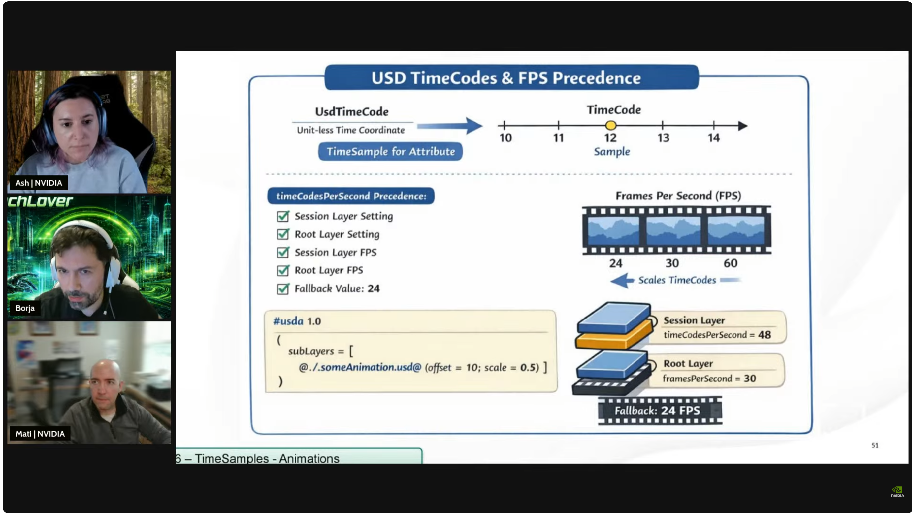](Pics/RenderingVisualizingOpenUSD_Scenes/Rendering_VisualizingOpenUSD_Scenes_2026-03-02_21h13_30.png)

[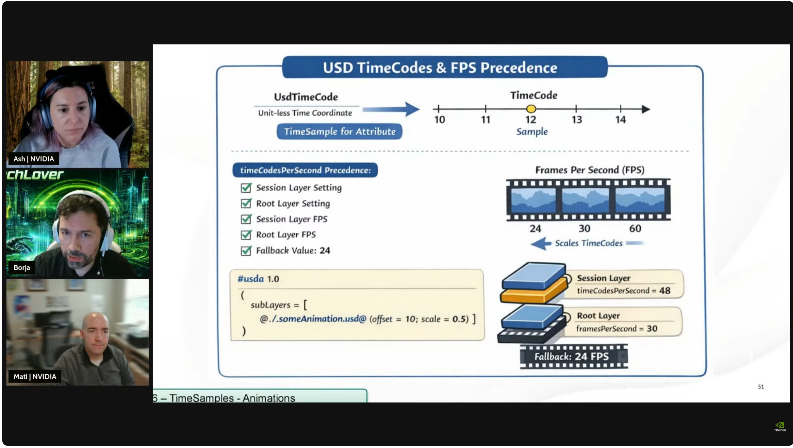](Pics/RenderingVisualizingOpenUSD_Scenes/Rendering_VisualizingOpenUSD_Scenes_2026-03-02_21h14_43.png)

### TimeCodes are unitless — FPS settings give them meaning

The practical mental model:

- USD stores samples at **timeCodes** (numbers).
- The stage/layers can declare how those timeCodes map to “seconds” or “frames”.
- When multiple layers declare timing, you get a **precedence** order (session layer settings can override root layer settings).

The takeaway for production: if you rely on real-time playback speed (for motion blur, physics stepping assumptions, etc.), timing metadata becomes part of the “contract” you must govern.

### Exam-style question: checking a time-sampled world-space value

[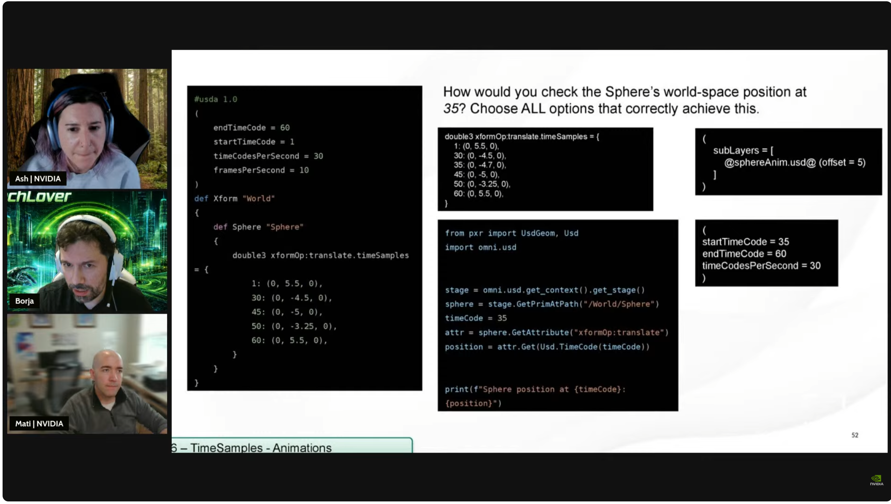](Pics/RenderingVisualizingOpenUSD_Scenes/Rendering_VisualizingOpenUSD_Scenes_2026-03-02_21h14_35.png)

### Code Breakout — TimeSamples query at `timeCode=35` (what works, what fails)

Snippet core from the slide:

```usda
#usda 1.0
(
    # Timeline range for this stage (authoring metadata, not a query by itself).
    startTimeCode = 1
    endTimeCode = 60

    # Mapping between abstract timeCodes and seconds.
    timeCodesPerSecond = 30

    # Playback hint used by many tools for UI frame playback.
    framesPerSecond = 10
)

def Xform "World"
{
    def Sphere "Sphere"
    {
        # Time-sampled local translate op.
        # Keys are authored sample times; values are local XYZ at that time.
        double3 xformOp:translate.timeSamples = {
            1:  (0, 5.5, 0),    # start high
            30: (0, -4.5, 0),   # moving down
            45: (0, -5, 0),     # near lowest point
            50: (0, -3.25, 0),  # rising
            60: (0, 5.5, 0),    # back high
        }
    }
}
```

Python query pattern:

```python
from pxr import Usd, UsdGeom

# 1) Open or fetch composed stage.
stage = ...  # e.g. Usd.Stage.Open("scene.usda")

# 2) Locate target prim.
sphere = stage.GetPrimAtPath("/World/Sphere")

# 3) Build an xform cache at timeCode 35.
cache = UsdGeom.XformCache(Usd.TimeCode(35))

# 4) Compute full local-to-world transform matrix for the prim at that time.
world_mtx = cache.GetLocalToWorldTransform(sphere)

# 5) Extract world-space translation.
world_pos = world_mtx.ExtractTranslation()
print(world_pos)

# Optional comparison (NOT world-space):
# local_attr = sphere.GetAttribute("xformOp:translate")
# local_pos = local_attr.Get(Usd.TimeCode(35))
```

**Why this works:**

- `UsdGeom.XformCache(Usd.TimeCode(35))` evaluates composed transforms at exactly timeCode 35.
- `GetLocalToWorldTransform(...)` resolves parent + local xform stack, then `ExtractTranslation()` gives world-space position.

**Why common alternatives fail (or do not answer the question directly):**

- Changing only stage metadata (`startTimeCode`, `endTimeCode`, `timeCodesPerSecond`) does not itself query the value at 35.
- SubLayer offset edits retime composition, but that is not the same as directly reading current value at 35 unless you evaluate the composed result after retime.
- Calling `attr.Get()` without `Usd.TimeCode(...)` asks for default-value path, not "value at 35".

**Important precision note:**

- Local attribute reads (`xformOp:translate`) and world-space queries answer different questions.
- If parent prims add transforms, use xform-stack evaluation (as above) for world-space answers.

The core rule that matters more than the multiple choice formatting:

- If an attribute has **timeSamples**, the value you see at a given time is the sampled value (and the “first visible value” is determined by the earliest authored sample in the current evaluation context).
- Querying “without a time” is not the same as “time 0” — it’s a **default** evaluation path that can return the unvarying default value instead of a sampled value.
- Between authored samples, consumers may **interpolate** (or hold) values depending on data type and the consuming app’s evaluation rules.
- To answer “what is the value at time 35?”, you either:
  - query the attribute at `Usd.TimeCode(35)`, or
  - author a sample at 35 (if the goal is to force the value at that time).

The session also included a live demo attempt for how this looks in a Kit-based app:

[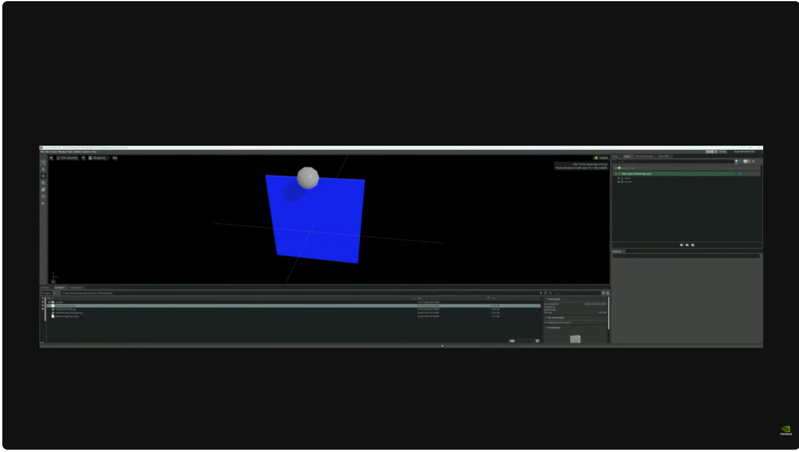](Pics/RenderingVisualizingOpenUSD_Scenes/Rendering_VisualizingOpenUSD_Scenes_2026-03-02_21h17_15.png)

**Learn OpenUSD →** Animation and time sampling practice:

- Learn OpenUSD animation/time sampling concepts [17 — TimeSamples](#link-17)
- `UsdTimeCode` reference (querying time-varying attribute values) [18 — UsdTimeCode](#link-18)

### Script Lab (Chapter 7)

Planned scripts (not yet committed):

- `timesamples/50_timesamples_fps_precedence_and_offsets.py` — author timeSamples, set timing metadata, and demonstrate retiming offsets.

**Packaging Cell 3 checkpoint:** at this point you can answer the two questions that make a twin operational: “what do I see?” and “*when* did I see it?”. That’s enough to turn viewport images into debug evidence and review artifacts.

---

## If You Remember Only 10 Things

1. Pixels are evidence only when stage contracts are explicit.
2. `metersPerUnit` and `upAxis` must be validated before review.
3. Composition entry choice controls correction and ownership boundaries.
4. Purpose/visibility filters hide data more often than people expect.
5. `displayColor` overlays and material bindings serve different intents.
6. Query time-varying attributes with explicit `Usd.TimeCode(t)`.
7. Keep debug overlays and final look layers deliberately separated.
8. Test in multiple viewers/runtimes before trusting conclusions.
9. Track render settings alongside validation snapshots.
10. Treat visualization checks as release gates, not optional polish.

---

## Industrial Digital Twin Continuity (Series Crosswalk)

| Scenario | Why this tutorial matters there | Where to continue |
|---|---|---|
| Aggregation-heavy factory reviews | Visualization reveals composition and ownership mistakes early. | [What You Should Know About Content Aggregation](./WhatYouShouldKnowAboutContentAggregation__VIDEO_DEEP_DIVE_TUTORIAL.md) |
| Station 7 data-rich operations | Render and overlay correctness depends on typed data + metadata contracts. | [Building an OpenUSD Pipeline With Data Modeling](./Building%20an%20OpenUSD%20Pipeline%20With%20Data%20Modeling__VIDEO_DEEP_DIVE_TUTORIAL.md) |
| Custom runtime deployment | Viewer behavior depends on extension choices and runtime integration policy. | [Customizing OpenUSD for Your Pipeline](./Customizing_OpenUSD_for_Your_Pipeline__VIDEO_DEEP_DIVE_TUTORIAL.md) |

---

## Links

1. <a id="link-1"></a>[YouTube — Rendering and Visualizing OpenUSD Scenes](https://www.youtube.com/watch?v=-6x8fuYVBPk) — canonical video source.
2. <a id="link-2"></a>[NVIDIA Learn OpenUSD — Curriculum Index](https://docs.nvidia.com/learn-openusd/latest/index.html) — the primary practice backbone.
3. <a id="link-3"></a>[Learn OpenUSD — Installing usdview and Setting Up Python](https://docs.nvidia.com/learn-openusd/latest/usdview-install-instructions.html) — reliable local setup guide.
4. <a id="link-4"></a>[Learn OpenUSD — Glossary](https://docs.nvidia.com/learn-openusd/latest/glossary.html) — vocabulary reference (use it while studying).
5. <a id="link-5"></a>[Learn OpenUSD — Metadata](https://docs.nvidia.com/learn-openusd/latest/stage-setting/metadata.html) — stage-level metadata concepts and authoring.
6. <a id="link-6"></a>[Learn OpenUSD — Units](https://docs.nvidia.com/learn-openusd/latest/beyond-basics/units.html) — `metersPerUnit`, `upAxis`, and interoperability behavior across conventions.
7. <a id="link-7"></a>[OpenUSD API — `UsdGeomMesh`](https://openusd.org/release/api/class_usd_geom_mesh.html) — mesh schema reference (topology + attributes).
8. <a id="link-8"></a>[OpenUSD API — `UsdGeomXformable`](https://openusd.org/release/api/class_usd_geom_xformable.html) — transform ops and xformOp ordering.
9. <a id="link-9"></a>[OpenUSD API — `UsdGeomImageable`](https://openusd.org/release/api/class_usd_geom_imageable.html) — purpose + visibility.
10. <a id="link-10"></a>[OpenUSD API — `UsdGeomImageable` (purpose/visibility semantics)](https://openusd.org/release/api/class_usd_geom_imageable.html) — authoritative purpose + visibility behavior.
11. <a id="link-11"></a>[OpenUSD API — `UsdLux` (module)](https://openusd.org/release/api/usd_lux_page_front.html) — typed lights overview.
12. <a id="link-12"></a>[OpenUSD API — `UsdLuxLightAPI`](https://openusd.org/release/api/class_usd_lux_light_a_p_i.html) — API schema for light properties.
13. <a id="link-13"></a>[Learn OpenUSD — Materials and Shaders](https://docs.nvidia.com/learn-openusd/latest/scene-description-blueprints/materials-shaders.html) — material authoring concepts and workflows.
14. <a id="link-14"></a>[OpenUSD API — `UsdShadeMaterialBindingAPI`](https://openusd.org/release/api/class_usd_shade_material_binding_a_p_i.html) — binding mechanics, collections, and strength.
15. <a id="link-15"></a>[Learn OpenUSD — Primvars](https://docs.nvidia.com/learn-openusd/latest/beyond-basics/primvars.html) — primvars fundamentals + interpolation.
16. <a id="link-16"></a>[OpenUSD API — `UsdGeomPrimvarsAPI`](https://openusd.org/release/api/class_usd_geom_primvars_a_p_i.html) — modern primvars access and authoring.
17. <a id="link-17"></a>[Learn OpenUSD — TimeCodes and TimeSamples](https://docs.nvidia.com/learn-openusd/latest/stage-setting/timecodes-timesamples.html) — authoring and reading time-varying values.
18. <a id="link-18"></a>[OpenUSD API — `UsdTimeCode`](https://openusd.org/release/api/class_usd_time_code.html) — querying time-varying attribute values.
19. <a id="link-19"></a>[Awesome OpenUSD](https://github.com/matiascodesal/awesome-openusd) — curated ecosystem links (useful beyond the core curriculum).
20. <a id="link-20"></a>[Learn OpenUSD — Schemas](https://docs.nvidia.com/learn-openusd/latest/scene-description-blueprints/schemas.html) — typed (IsA) vs API schemas (includes `UsdGeomMesh`, `UsdLux*` examples, and the “schema mental model” behind many exam questions).
21. <a id="link-21"></a>[Learn OpenUSD — Xform](https://docs.nvidia.com/learn-openusd/latest/scene-description-blueprints/xform.html) — transform hierarchy, grouping, and the practical meaning of “put it in an Xform”.
22. <a id="link-22"></a>[Learn OpenUSD — Materials and Shaders](https://docs.nvidia.com/learn-openusd/latest/scene-description-blueprints/materials-shaders.html) — a schema-centric intro to `UsdShade` materials and shader containers.
23. <a id="link-23"></a>[OpenUSD Documentation — Introduction to USD](https://openusd.org/release/intro.html) — Pixar’s official “start here” overview (great as a reset when studying).
24. <a id="link-24"></a>[OpenUSD Documentation — Index](https://openusd.org/release/index.html) — landing page for the official docs (includes imaging/Hydra topics and versioned reference material).
25. <a id="link-25"></a>[OpenUSD GitHub Repository (Pixar)](https://github.com/PixarAnimationStudios/OpenUSD) — upstream source, build docs, and the canonical reference implementation.
26. <a id="link-26"></a>[Pixar USD Tutorials](https://openusd.org/release/tut_usd_tutorials.html) — Pixar’s 14-module tutorial series with step-by-step `pxr` Python exercises and USDA outputs (very aligned with certification prep).
27. <a id="link-27"></a>[Pixar Sample Assets](https://openusd.org/release/dl_downloads.html#assets) — Kitchen Set, City Set, UsdSkel examples; useful for stress-testing materials/lights/purposes in real-world complexity.
28. <a id="link-28"></a>[Awesome OpenUSD — Learning](https://github.com/matiascodesal/awesome-openusd#learning) — curated learning path links for composition, schemas, and workflow fundamentals.
29. <a id="link-29"></a>[OpenUSD API — UsdGeomBoundable](https://openusd.org/dev/api/class_usd_geom_boundable.html) — `extent` semantics and bounding behavior.
30. <a id="link-30"></a>[SideFX — usd_primvarinterpolation](https://www.sidefx.com/docs/houdini/vex/functions/usd_primvarinterpolation.html) — concise interpolation mode definitions.
31. <a id="link-31"></a>[SideFX — usd_setprimvarinterpolation](https://www.sidefx.com/docs/houdini/vex/functions/usd_setprimvarinterpolation.html) — practical interpolation assignment API.
32. <a id="link-32"></a>[SideFX forum — upAxis/metersPerUnit import behavior discussion](https://www.sidefx.com/forum/topic/71925/) — practical example of host-tool auto-correction behavior.
33. <a id="link-33"></a>[Awesome OpenUSD — Integrations](https://github.com/matiascodesal/awesome-openusd#integrations) — host app and runtime ecosystem map.
34. <a id="link-34"></a>[mxpv/openusd](https://github.com/mxpv/openusd) — example of an alternate OpenUSD runtime/library implementation.
35. <a id="link-35"></a>[USD WG — Composition Puzzles](https://github.com/usd-wg/assets/tree/main/docs/CompositionPuzzles) — exam-style composition puzzle set for practicing value resolution and arc interactions.
36. <a id="link-36"></a>[Composition / aggregation reference deck (Aaron Luk recommendation)](https://drive.google.com/file/d/1lh-28b4mN37WrH2zVM5d0YQ2gZtS8wNO/view?usp=drive_link) — supplemental visual walkthrough for aggregation and composition reasoning.

**Most important wrap-up:** if you want one “ecosystem map” bookmark beyond Learn OpenUSD, use [19 — Awesome OpenUSD](#link-19) (tools, sample assets, Pixar resources, and practical community links).

---

## Appendix — Key Pitfalls Checklist (Digital Twin + Exam)


Further reading / ecosystem hub: Awesome OpenUSD is a curated index of high-signal resources across learning material, core references, and production tooling. Use it as a jump hub to quickly find validators, viewers, libraries, and integrations relevant to the pitfalls above—then follow through to the primary docs for the final word.
https://github.com/matiascodesal/awesome-openusd?tab=readme-ov-file

Use this as a pre-flight check before certification practice and before publishing digital twin content.

### 1) Stage conventions (`upAxis`, `metersPerUnit`)

Lock one project convention and validate every incoming asset against it. Unit/axis mismatch can create 100x scale and orientation errors if left uncorrected.

- Helpful resources: [6 — Learn OpenUSD — Units](#link-6), [19 — Awesome OpenUSD](#link-19)

### 2) Sublayers vs reference/payload

Use **sublayers** for layered opinions in the same logical stage convention. Use **reference/payload** for modular asset composition, especially when mixed asset conventions require scoped transforms/fixups.

- Helpful resources: [28 — Awesome OpenUSD Learning section](#link-28), [20 — Learn OpenUSD — Schemas](#link-20)

### 3) `extent` is not scale

Changing `extent` does not resize geometry. It changes bounds metadata used by culling/selection/acceleration logic. To scale geometry, use transform ops or point edits.

- Helpful resources: [29 — OpenUSD API — UsdGeomBoundable](#link-29), [24 — OpenUSD Documentation — Index](#link-24)

### 4) `UsdGeomImageable` rules: visibility + purpose

`visibility` is inherited (`inherited` / `invisible`). `purpose` (`default`/`render`/`proxy`/`guide`) is a render filter. A missing object is often a filter/hierarchy issue, not missing data.

- Helpful resources: [9 — OpenUSD API — UsdGeomImageable](#link-9), [10 — Learn OpenUSD — Purpose and visibility](#link-10)

### 5) Typed lights vs `LightAPI`

Typed `UsdLux` lights are renderer-native light schemas. `LightAPI` adds light-related attributes to an existing prim, but does not convert prim type into a typed light schema.

- Helpful resources: [11 — OpenUSD API — UsdLux](#link-11), [12 — OpenUSD API — UsdLuxLightAPI](#link-12)

### 6) Material vs `displayColor`

In final-look contexts, bound material/shader usually defines appearance. Treat `primvars:displayColor` as diagnostic/preview unless your shader explicitly consumes it.

- Helpful resources: [13 — Learn OpenUSD — Shading & materials](#link-13), [14 — OpenUSD API — UsdShadeMaterialBindingAPI](#link-14)

### 7) Primvars and interpolation counts

Value array size must match interpolation semantics:

- `constant` -> 1 value
- `uniform` -> 1 value per face
- `vertex` -> 1 value per point
- `faceVarying` -> `sum(faceVertexCounts)` values

Wrong counts often produce misleading visuals instead of clear hard failures.

- Helpful resources: [15 — Learn OpenUSD — Primvars](#link-15), [30 — SideFX — usd_primvarinterpolation](#link-30), [31 — SideFX — usd_setprimvarinterpolation](#link-31)

### 8) TimeSamples vs defaults

If an attribute has timeSamples, sampled values are evaluated at authored times (with interpolation/holding between samples). Query with explicit `Usd.TimeCode(t)` when validating animation state.

- Helpful resources: [17 — Learn OpenUSD — TimeSamples](#link-17), [18 — OpenUSD API — UsdTimeCode](#link-18)

### 9) Tool behavior vs USD core behavior

Omniverse Kit, Solaris, Unreal, and other runtimes may add useful auto-corrections. Treat these as host-tool behavior, not guaranteed OpenUSD core behavior.

- Helpful resources: [32 — SideFX forum (upAxis/metersPerUnit auto-transform discussion)](#link-32), [6 — Learn OpenUSD — Units](#link-6)

### 10) Always validate in target runtime

Cross-runtime differences can appear due to render delegates, purpose filters, plugin behavior, and fallback handling. Validate in the app/runtime that will run production scenes.

- Helpful resources: [33 — Awesome OpenUSD Integrations section](#link-33), [34 — mxpv/openusd (alternate runtime implementation)](#link-34)


---

## Appendix — Full Transcript (Verbatim)

```text
OpenUSD Developer Certification, that is the keyword of what we're going to be talking about today and what this is all about. Borja, who are you and what are you going to be talking about?

Hello, I am Borja and I will be talking about visualization today, which is one of the main topics for the exam of OpenUSD certification and currently working as an Omniverse Architect Lead in INEAS at Deloitte UK, which is just a fancy name and just an eternal student. I'm very happy to be here. Thank you for having me. Awesome.

We have so many cool things. So, Georgia, I'm just going to let you kick it off. I'm going to go ahead and share your slide and we can get into the meat and potatoes of today's topic. All right, let's go.

Do you want me to pick off? Yeah.

Yeah, go ahead.

Okay, so this is a slide. Well, do you know that in two weeks we have the GTC in San Jose and you will have the opportunity to get your certification there for whoever is joining in San Jose? I'm going to move forward because, well, this is today's week. So we are talking about the five topic, only one more week to go. And I totally wish I had this video before I prepare for my certification. Some people, well this is me, I got my certification.

On January, the first week of January, as a New Year proposal, so... Thank you. Congratulations. Something that everybody is asking me is how much time you should be prepared to study for this certification. For everybody it's different, but for me my test was over 100 hours with It looks a lot, but it's a lot of material to cover. So my advice is just to save this time for yourself. You are going to be performing certification.

Here you can reach out to me through my LinkedIn, I'm really approachable. And well, enough about myself. I'm going to jump directly to the topic. So visualization is like 8% of this exam. So you should expect to have between five, seven questions about this topic. And I started by doing this topic in It's different. Topics. And I'm pretty sure that I got at least One question of each of these subtopics.

So Listen to this if you're preparing for the Open Use Day, you have some Easter eggs on this presentation. The good thing about visualization is that most of the questions that you might have maybe are a little bit more straightforward than other topics. So if you understand properly the The documentation is to be found for these questions. The first thing we have to see is about how we are configuring the state.

This is your first step when you are preparing to visualize frames or objects in your viewport in your Omniverse application. And then what's happening when you are referencing other USDs which have been configured in a different way than your current state, okay? We'll see about that. Then we will then how we are rendering object prints, what are the geometry, the main properties and attributes. Everything that is renderable in OpenGSD is inherited from GSD in NetExtra.

Remember this, but you might have also questions about that class. Then I will not spend a lot of time, but about lights and used in looks, you need to understand the difference between both. Light is a type of schema. Okay, so out of the box original from and usually looks will be an API schema. So we'll see the difference between both of them. Then we have material bindings and printbacks. We see the difference between both and how we use them.

And finally, we will dig a little bit more on time samples and animations. Oh, yeah. That's not funny. How are you doing, Julie?

Sounds great. A lot of good information coming up.

The first thing when you are creating a new stage, the first thing you are going to see is this configuration out of the box. If you don't do anything in Omniverse, this is the first properties that your stage will have. The first thing is the default print. We already saw that in previous sessions. Basically, when you are referencing this use define into another use define, The thing that you are going to be referencing or rendering will be this default print.

If you have all the prints at the same level, will not be shown, will not be rendered in your new .z file. And then we have the orientation of the scene. You have only two options here. White or red? By default, most of Here's the file. We've come with access white app, When you are bringingHigh-fives from the applications. Most of them will be coming in Zip App. So you need to take that into consideration so they will not be torn into degrees.

Then we have meter per unit. You can choose between one centimeter and one meter. By default, All this space came in one meter. But we will also show what happens when you are referencing different USB files in different Metasperge units configurations. Then you have the start time. This is for animation only. By default you have between zero and one million, which is like forever. But if you release this 10 code, now I do like 60 or 100.

Every 100 times close, the animation will be looping. Basically, time codes are not any specific unit, is unitless. which means that it's not a frame, not a second, it's just a unit of timing in amniotis. Then we can see standard pulse per second. And you might think, okay, that means that 60, 10 courts are Equivalent to one second? Not really. Okay. It could be more, but it's also depending on your frames per second in your personal computer.

But it's a way to divide the time codes in OpenGST. And I'm going to start with a question already. So let's see if we understand how this works. If you are referencing Use the status. And you have this stage A. With this axis up in one and meters per unit, one meter and a stage B is one centimeter and up axis Z. I'm ignoring the 10 crocs per second because I think we don't have any answer for that.

But what's happening when you are referencing the stage B into the stage A? What do you think is the correct statement? Ooh. Could be more than one answer, yeah.

Could be more than one answer. All right, our first one is stage B's meters per unit only affects the bounty box calculations and not the geometry. Stage B's animation will automatically play at the correct real-world speed in Stage A without any adjustment. Stage B time code per second affects motion blur in physics simulation. Stage A unless manually retimed. Stage B objects will automatically rotate 90 degrees to align the Z-up axis to Stage A's Y-up axis.

And Stage B's geometry will be automatically scaled by a factor of 0.01 to match Stage A's unit. Yeah, if you are watching live, you want to drop your answer in the chat. This one is a tricky one. I would say... Ugh. I'm going to fail. This one. I did not know this one. I'm a say. Five, no. Okay, I don't know. I give up. I don't know what the answer is. I'll take too long.

Well, Omniverse is very smart, okay? So it's taken me from Civilization the difference between units. So automatically you will get a conversion. For the apaxis, and also for the nithya. So the correct answers are Or I'm five.

Okay, I was gonna say five. So, okay, I need to have more confidence in myself and actually like say what I think. Even if it makes me look really silly and in front of whoever's watching, like, I got it. I can do it.

And also I didn't see it in the answer, but 10 calls per second will also be automatically adapted to the 10 cos per second from the space B. So here's 24, but let's say it was 30. Wait, you say that and you have... That'd be in... Let's say that if that was happening in 10 seconds, it will be happening in 10 seconds in the next stage as well. Can you save my screen? Yeah, let me swap it out. So...

Here I have This blue cube, which is in meters, okay? You can see on the bottom left that this is in meters. I don't see a blue cube.

Oh? Are we supposed to see a blue cube in your stage? Please.

For us on my screenAnd the call. Oh, there we go. Why it takes so long to--Who knows?

Okay.

I was in the blue cube all the time. Then I have another USB 5. We've already viewed which is in centimeters, okay? Oh. Why is that been so long to...

It's probably because it's OBS, so there's probably a little bit of a delay of sharing your screen because of GPU resources.

Okay, so let's say, well, I will explain. I have the blue cubing centimeters and the red cubing in... The other way around. The red cube is centimeters and the blue cube in meters. Now, if I create A new space. This new space is in meters, by the way. The way to modify your state, you can do it directly in your useDefine. Or you can do it eating preferences If you just turn it here, it's fake. Here you have all the options for your stage.

Okay, there are boxes if you want the meters per unit in one meter or centimeters, etc. If I change this, It will not change automatically, but when I create a new state, It wouldn't get this changes, okay? So it's not an automatic change in the current state. It will happen when you get a new space. Now what I want to showcase, I'm going to reference in this stage, which is in liters, the blue cube.

We're just in meters, so it's okay. And now, when I'm referencing the Rift Cube in Centimetres, You see both look the same. You can see here that we have Oh my God, I need to... I'm doing that. There we go, yeah.

Yeah, we see it now.

I don't know why the obvious is not on the arena. And then I have to check the whole screen now. You know what? I'm going to share my...

Yeah, you want to give it a try?

Maya, talk to you soon.

I will highlight something that you mentioned.

Kit is very smart about this and will apply the corrections. If you try to do the same thing in another USD-based application, it's very likely that they may not.

automatically update or adjust. Okay.

Good to know. Can I change the application to present another window instead? Yeah.

This is the beauty of live streaming.

Sorry about that. I'm going to share my exact same application directly. Okay. Let's try again. Okay, so now I have these two cubes references are payloads. If you do the same as references, will be the same if you add a sub-reference to the cube. which is in centimeters. Still the same size. Now, it's something very tricky. What will happen is... instead of referencing in the States. and add in the red cube As Asambledia. What do you think is going to happen? If you bring in the red cube.

in a different state, maybe because it's KIT, it'll automatically adjust.

Basically, when you are adding this as a layer, basically we are respecting the original values completely. So we are not updating, we are not scaling. But what happened with the reptile? Is it small or big? Originally it was in centimeters, this red kill. We will see a massive cube or a very small cube. What do you think?

Small cube.

I go with big.

Okay, I go big.

I change my answer. Thank you, but you know, this is opposite to what you expect. Massive! So take that in consideration, okay? Because it's not the same referencing an asset, referencing a print thatOkay, aside from offensively, yeah. There is a big difference. Oh, that's really cool. Exactly the same happens with orientation, okay?

Here I have a phone.

A red cone, which is originally oriented in Y, the same orientation as this one. And I have another one which is a vintage. I mean... Blue One second, because... I just said, I... I didn't test the assembly yet. I didn't want to do that. But you see, it's the same as the cube because it's in... as a sublayer We are respecting the original orientation, so that's why it shows 90 degrees. Yeah, oriented.

pointing to the Z axis. But if I remove this... Tony, I want to remove everything. I'm going to add again The Red corn. Pointing up. And then when I add the So Omniverse is automatically Let's start with the difference in the orientation. As you can see here, the bottom, minus 90 degrees. This is because Omniverse is automatically recognizing that the orientation is wrong. But if I add the clone, As assemblymen, yeah.

it will be pointing to the Z axis. The same that happened with the size. Take that in consideration. It's not the same referencing here than referencing Asa Sablaya Okay.

Okay, that's cool. I didn't know that Kit did that. Like you had to either bring it in its own stage or have it as its own layer and they'll behave depending on how you bring it in.

I totally recommend when people is preparing for the certification to play around with all these concepts. I like to use basic forms because they are more clearer for me. You should be playing with the USB 8 file and changing style

I don't know if that's the representation, Ash.

There are a few questions if we want to.

Okay. Let's throw him up there.

I don't have the, you'll have to.

Oh, I can do it. Which one is it?

Yeah, it's about a bugger feature.

Bug or feature? Bugger feature, difference between stage versus layer.

Ah, good. That's a question for Mati and India.

So USD by itself doesn't do any of that automatic conversion. So what KITT did is it applied correctives on the prins. So you saw that there was a resolve to resolve the orientation property. When you bring it in as a sublayer, so when you reference, you're referencing onto a prim and you can put the corrective on the prim. When you do a sublayer, you're just mashing the scenes together. And so there isn't a good opportunity to apply those correctives on the things that are coming in.

So we kind of just said, no, the sublayers, we're not correcting for you. So if you want that automatic correction in kit, you use payloads or references. So, by design. Great.

I love this question. Okay.

All right. So let's go for next. Okay. This is what's happening when you are sitting in a mess, okay? Eh, These are the two things that you can track. Automatically when you're creating a mess, in this case we're creating a mess of that cube, We make a difference between this schema mesh and The schema queue is not the same. Basically, when you are creating a queue directly, OmniVersion has recognized that this is a cube, but when you're creating a mess,So since Omniverse Kid...

with the form that we are rendering. So the first time that you pick a mess, this is what out of the box you are having. Okay, this element. First you have the extent. The extent is a bouncing box and I have added this image on the bottom with the sphere because the extent will be the square that is surrounding the sphere. Basically, we are using extent only for internal calculations and has nothing to do with how we are rendering the object in the viewport.

I have read somewhere Just in case that you might find a question about that, that if the extent is too big or too small, The print will not be a run back. But I was not able to confirm that. It's just something I've written documentation for Nambivia. Just in case that you find a question about that. But basically it doesn't matter which values you put here. It has nothing to do with the rendering and visualization, which is the objective of this topic.

Then we have the vertex columns. The vertex columns, Uh... Basically, for each face of this object, how many points you have, you can replace the word vertex. Okay. Four points and nine tally. Basically, you can see this is just a cube, so we have six spaces with four points each space. And then we have. face vertex indices. This is how we are connecting all these points. Basically, when you are importing an attack file, Normally, they are coming in the form of an array of vectors.

But when we are flattering these vectors, to And MegaGram... Understandable by OpenGSD, we are flattening all these vectors into one single vector with connecting all these points between them. So we'll be coming from zero, one, two, three, four, five, six, etc. Then we have the normals. If we don't have the normal It's blessed here. This is exactly the norm I would have, okay? Like, orthogonal. to these phases.

It will have the interpolation for phase bias. So this is the stand I could All bus normal, but here we are specifying the normal is one per point. So this normal must match the number of points that we have here. which is 24. Then we have the different kinds of ponds. So it will be single ponds. Yeah, one, two, three, four. If we have a cube, we have One, two, three, four, five, six, seven, eight points.

Go over the pictures and the transcript twice. And this is by default one print back. This and this are related. Basically for this normals is how they light. are being and focus on this fair. I would love to see what happens when we are done with the non-math. from the used file, but basically you will see a slightly different Eh, wait, um, eh... The night will be rendering a little bit different. And finally you will see the external orientation, position.

I want to jump that really to some question and then we will jump to a exact same and we'll see some difference for that. Cool. Do you want to read a question for me because I'm getting a little bit of a drag?

In NVIDIA Omniverse, which of the following represents the minimum required elements for a prim to be rendered in the viewport based on Universal Scene Description? A. An XWorm prim with translation, rotation, and scale applied. B. A mesh prim with valid geometry data points and visibility not set to invisible. C, a geometry prim with a bound MDL material and a light present in the sea. D, a mesh PRAM with physics APIs applied, or E, any PRAM that has a material binding regardless of its type.

Yeah, drop your answers in the chat here. Thank you. Let me see. If I can overcome my fear of answering wrong in front of lots of people. Which of the following represents the minimum required elements for a prim to be rendered? I would say, Is there more than one answer or is it just one?

Could be, could be.

Okay, well I'm gonna say B. And Thank you. I'm just I'm going to go pee. I feel like the other ones like,You don't have to bother.

You can come later. Yeah, the police are also happy. So you don't need an X-Pong with translation in fact when you are keeping aNormally, by default, you don't see the transformation in the object. It doesn't appear. The minimum requirement is B. So if you have only these three values, the object will be rendered. Okay, you don't need materials, you don't need a rigid body. You don't need even an X form.

Okay. I'm here for the certification. Another question for you guys. Considering the following, use this map and select the correct They demand soYeah.

Okay, so we have four different snippets. We have to select the correct statement, so that means there's more than one answer.

Let's say yes. So let's say the first statement. Option A will render exactly the same size as Option B, but they are not semantically equivalent. This is something I wanted to show you, but not to share my VS Code later maybe. Okay. In.

Do you need a scissor?

Paolo, do you think one is correct or false? Missed a... What do you think, Mati?

I think that's correct.

Half the size. Very good. One? One is correct. I'm not going to go to the next slide because I have all the answers. Let's go one by one. Option C, we not render because normals are missing. I think we answered that in our previous question. Yeah. So this is... False. Okay, guys. All right. Yes, I go with D again, not D. So two is false. Option 3, option D will render larger because the extent is larger.

I already explained that as well.

That would be false. Yeah. Very good.

Changing the size and changing the scale always produce identical results in USD. When is it in cash?

No, that's false.

That's totally false, yes. And option C will render but it does not I cannot read because I-It does not define a valid cube.

I'm curious about that one. if it's like it's false but like why is it false like it's option c is different it has points the other ones don't Why is that false?

It's not false. It's not false. It will render, but it will not say Almost anything. We'll see the export probably, well, the mess, I will sayOkay. It will be rendered as a cube, it will be rendered as something, because the The three elements needed to have some rendering. They are there. and they will work. OK?

I see. Because it's a mesh. And-OK.

Yeah, the giveaway-The FH is correct. there's only one face, right? The second array tells you that there's a face with four vertices, but you need You need six faces to make a cube, right?

Yes, correct. You will not see anything, but it will be rendered anyway. So you will not have an error, basically.

So this is a great example of for anybody that's planning on taking the exam, you got to be comfortable reading this USDA like this because this is the really the only way that we had to kind of show USD content in the exam. So you got to be comfortable looking at this and deciphering it and also practicing like this and taking all this information and not being overloaded by it. is a good thing to practice.

Yeah, me. I need to practice that. Okay, I'm glad that five was true because I was like, when you said A and I was like, wait, I was picking five. Okay.

Yeah, taking it state, like option by option like that is probably the best way.

I'm doing best. Yeah, also, I mean, I wanted to focus on preparing a lot of questions. It's extremely light because to be able to practice this, it was very difficult for me. I didn't find A lot of information. Obviously they are very different from the exam, but you know, you will see these UD files and this kind of stuff in your certification for sure. Which of the following user files have a quality structure here?

Only thing X. Uh... We work for a not a I or I could say that right now. Not you do You know what, why? Because I didn't explain that, okay? So I'm remembering things that I have explained before.

Yeah, if not, I say not A because it has a parent mesh and a child mesh. From what I understand, you can't. do that. That'sA no-no. Exactly. And B, you have You have an instant mesh and stancable is set to true. It has a reference and then C as an X for him with a mesh. And then another--Base correct or base correct on is false. It feels false to me.

I feel in my soul it's lost.

If you think about that, Is it possible to have a mass in the transceval? Yes, yes it's possible but it makes sense. No, and the reason that it doesn't make sense is because Eh... If you create a lot of messes, it's tangible. When they're creating some print, it's tangible because you want to have this print around your estate in many places, right? You are saving memory because you are, You have only one.

All the instances are coming from the same prototype. But if you create a match in some server, what is going to happen is that all the matches are going to be one on top of the next one, and you will not be able to move them. because the position All right. will be always the same position because it's an instance of the position as well. So the only instanceable objects that you must have are X-Bones.

That's my understanding.

Okay. And then, so that means, like, C feels, I feel the most confident with C because of what you just said. And then, like, D also, very similar to A, like, you can't have a parent object. and then a child object. So I'm going to say C. My soul feels sea.

Yes.

I'm doing really good.

Yeah, yeah, you can go straight forward. Are you going to present in the DTC? No.

I will be around and I will be listening and I will be learning. I don't know.

Okay, the next subtopic is about the graph USD/JPY in Metabol. I think, um... Nandu talked about this in the previous session, but This is very important because anything that can be visualized will be inheriting from this UDGM in natural world. Okay, you might have questions about this class. so We will see in the next slide what can be in heading from here. But one tricky question or one tricky thing is a scope.

For me, it's very tricky because What do you think, is Scopes inheriting from the UDGM in MetaWall or not?

The scope is inherited from the USD... GM. No.

Yes, it is. Because a scope, even if the are not being rendered and you are not there have an X form or transform. They can contain a lot of things that actually they have. So it needs properties like, for example, disability. Okay. If you want to set your scope as visible or not, and everything that is inside this scope visible or not, then it needs to inherit properties from USDGM in Metaforce. So that's one of the things, for example.

The same happens for lights, etc. Something I'm adding here at the bottom, because I think I say one question related to that in the exam. It's because Green Vought. And They were inherited from this class at the beginning. So basically when you want to retrieve an opinion from a print bar, you could use a gate attribute from that print bar. But now NVIDIA is moving this to a specific API for PrintBus, so now you will need to use the methodOkay.

Get print bar instead of get attribute. I think for now both of them are working, but You should know that the current way to retrieve print bus information is using the USDG on print bus API. Yeah. You spent all, the current ones.

And that's-Yeah, that's a great thing to bring up is that USD is evolving very quickly. So Keeping up with LearnOpenUSD and recertifying every few years. is really a great way to keep up with those changes.

Tomato mortality with hwika because then it's kicking. So yeah, basically when you are inheriting from UVGem in Matinable, the way to visualize your prints Your object in your viewport is through visibility and purpose. Then you have now properties when running from useDigitalMeanMetaVault. Here on the right, you can see that from this class, Renegade in light. Eh... Type-ed lights, not API-y. Schema like for example, use Deluxe.

But you are also even enjoying some statistics. Are you having from using Geometry Amore? So in many days, I'm not visually rendered it. You need to take into consideration in case that you have questions like that, that these are also inherent from this class. And you see up here on the bottom that we are also creating a scope print. Um... The next slide. Here are the two ways to control what is being visualized in your space.

What is visibility? You have only two options and be careful with that because you might have some tricky questions. For example, they can be asking you, OK, if this object, if this print is set as invisible, If I want to have it visible, should I change from invisible to visible? No, because this email doesn't exist as an option. is only inherited or invisible. So... be careful with these questions.

and then you have full pause. Okay, we just proposed that These are the four type of purposes that we have. If you don't specify any, Therefore, but value will be default. So this is for generic purposes. And normally everything always with purpose as default. and visibility inherited and All the parents inherited as well. will be visualized We have the food post as a render for the highest quality of rendering.

Then we have the proxy one. This is forLower quality, the potential in you could have an and need in your open USD for proxy and render so you could When you want to test things, you could use proxy for faster rendering. and for your final solution, you could use Renda for the highest quality. Then you have also Git that Git is only for calculations and logic. So this will not be rendered K-GaN. specified in your renderer.

which of these purposes? have to be rendered. Okay? So there is an option. So basically you could say, well, I think I have an example here. Yeah. That's the question. What's the list? correctly gives the effective purpose of this In its world, Prince. Uh... So these are the prints and this is what is each of them, okay? Something I will mention here, is that purposes are being inherited, but To be able to set a purpose that bring needs to be It makes a world.

So the prim needs to be inherited from USDGM in MetaWall. HeyI want to tell you that in advance, the root one, This is not an X-form. This is not a mass. This is not imageable. This is not being rendered. This is not being handed in from USD geom imageable. Which means? that doesn't matter what I put here. A root will be always default because it's not in Maxable. Okay, so I already told you the first one.

So I'm going to do B and C. Which one is correct? The second one, export one, obviously it's a render. I'm going to follow along with that because it's an X-form. So an X-form is in ferritin from UD J-On in Machiavelli So we are setting this purpose to Brenda. Then what happened with Xform 2? Excellent. Has not a purpose assigned? But Each parent has a purpose, which is Guide, bat.

print is not inheriting from the geome immutable. So this purpose grid is being ignored. Then we go to the next parent, which is XFont1, which is a render. That means that XFoam 2 will be a brand as well. So that's why we have Rinda. Expo three. Okay. This one has its own purpose, which is proxy. Alright.

Guide, right? Guide, yeah. It's Purpose's guide. Yeah, someone asked a question. I have this question too. How to interpret X form 3's repetition? Since its parent is a purpose guide, It just inherits its parent since it's a guide already. Okay. Okay.

uh Sorry, I'm thinking that Xperm 3It would be... A proxy actually. Hmm. That should be a proxy, okay? So this is wrong. Because XFORM3 is inherited from USDGOM In the chapel. And we are setting the purpose to proxy, so instead of guide, should be proxy here. Okay. Thank you.

So is the answer two regardless because the... X form one. Or is it? Oh, wait. So we're picking out of one through five or we're picking A, B, C, D?

So basically it's B, but the problem is that the guide is not guide, it's proxy. Okay, so this is an error here.

Well, no, it is, the B is still correct. It's just that the X form 3 that has proxy is its path is root X form 3. So that one's not even in the list. One that we care about, the one that's being referred to in number four. is is the one that's nested under prim. Okay.

Is this how we would see the question in the exam? Because this question kind of confuses me. I don't understand. what I'm picking.

Yes, basically I saw questions like that and basically you have like this list here and then Maybe I solve two or three questions like that and then you have a list of answers. So basically the first one is for the First one here, the second answer is for the second, print, etc.

Oh, I see. Okay. That's a little bit better.

Writing, writing. USD exam questions is really hard. Yeah, as we see that some of the questions are just poorly written, we will cycle them out, don't worry. Sorry if we're really bad.

You can use this question for your next exam, Mati. Okay, one more question. I need to go faster. Given in when the second is okay. What actually Renders? Okay. I'm going to go through and start this one directly. So basically, this question is asking you, OK, you have this usually fine. On the net? and you have these render settings in your renderer. and it is Asking you What of these prints are actually being rendered in your viewport?

So... Mass A. You need to understand what are the purpose of the NSA to be able to answer this question. Math A is... Which book was Hasmose? From your understanding, so it is.

Uh, I guess guide.

Not because green is not inherited from the Nature World. So we need to go to the next screen, which is Render. So because it's Render, Messe will be rendered. That's a yes. And actually, all the answers have Messe. I just realized that. uh, next D We have scope, scope, have a... Eh... A scope is also in fighting from using a metal bomb, so And because a scope has not any purpose specified, We go to the four block port plus which is default.

So, MESD is also being rendered. That's also correct. Next, three. Hey boys, this is Juan. We have the visibility set to invisible, so that one will not be rendered. Okay, because we have no visibility. Yeah. We have the Neth B. This one Which is... inheriting from its parent, which is an X form, which is okay, inexorable as well, and has a purpose to give, but guide is not. included in this purposes.

So MESB will not be rendered Finally, we have E, which has its parent,Hey. with its purpose and also vicinity in this symbol so we'll not be running the data. So the current time size is It's big.

Okay, I need to prepare that one.

When I take the exam, I'm going to be like sitting in front of the computer, like studying these so hard. These are really intense questions. I like them.

I'm showing the answers here already. Okay. Okay, maybe you don't remember what you saw. Here we're talking about light and we need to make a difference between light and used in looks, you need to understand the difference between both. Light is a type of schema. Okay, so out of the box original from and usually looks will be an API schema.

But these are type Life, all this are inherited from... You did your image of it as well. Then we have used the NUCs API schema, which are not inherited from using Metamod.

So here I just wanted to for each of these kind of lights. Which one would you use for this option? For the dome light? What will be used for in your What do you think, Cass? Dumb right?

Dome lights. would be for your HDR Sky providing ambient lighting and reflections.

Very good. Then we have this Fairlight. Yes.

Fear light would be... So sorry if you hear my dogs, they're having a really good time. I'm also trying to answer the questions. I would say... A ceiling light bulb in a small room.

Very good. And then we have the cylinder light.

Cylinder light, yeah, a fluorescent tube in an industrial warehouse.

Distant light.

Distant light, sunlight eliminating an outdoor architectural scene. And rec light is large window casting soft alien interior. I'm really good at lighting. This, confident. I got this. Yeah.

Okay, well done, Max. Okay, more questions, wow. I really have time for questions. You are giving the following user prints created on an stage. So basically here, when you're using Python to create this stage, OK? and with the plain-sized refitting from using Geometry MetaNav here. Or what I said before. What do you think? As VE is correct, Okay.

Let's break it down. A would be only world B. World B is Which inherit the US, it has US Deluxe, Stone Light, Define, it's in the stage at World B. Selection B is world B and world C. which is prim C is just a stain to define prim. Uh... at world C. C is all of them and D is only world A. So world A and world C are similar. So... Thank you. I don't like which one of them are defining. Oh, it's B. Or it's A or B?

We are defining a print, but we are not specifying any time of print. So it's not an XForm. It's just a print, so it's not from. youSo that's why this is not a... And then next of all, print.

I have a question before we go to that one. When you use the USDLUX Light API applied to Prim-C, That is obviously not applying a light to world C, it is just saying that a light is going to be needed to render this?

No, light using looks is like adding any kind of properties to to another print. So it's another properties and API schemas. Like you cannot add materials, you cannot print both, you cannot also one type of light. So basically, if I created-I used the looks like API to JavaScript. JavaScript will look similar to Today is the Lighters Fair, but you will not have as many properties as you have. with the happy skin.

Okay.

Okay.

So.

This is a One question related to this, and so I'm keeping the sameYeah. the same state and I'm just asking different questions. So here I'm I'm going to go to the answers because we are... Consummate the time.

I was going to say that one anyway.

Yes, but basically it's big, okay, because this is the dumb light, this is the type of schema. And then which is the next two about using looks. It creates a new light spring. It makes anything in head from just it looks like. It adds library-related properties without changing the parent tag.

Oh, see.

What do you think? Very good.

Okay, more questions after I find the using news? Which of the following is possible? intensity or One thing Magma fear don't light. automatically make it visible to Hydra as a light. We feed transport ops from I say A.

Very good.

Mm-hmm. And last question, which train to port facility control via use the German material? This is related to the first question. Okay.

Oh, so world B.

Yeah, very good.

Yeah, you can go to that camp. I'm going to move away from that. The naming convention for materials We have to make a difference between materials and green bus okay because you can add Colors, two materials, you can add colors from print box and sometimes people get confused about that. Materials are much more,Eh, Christopher, I will say, So you can make very realistic deals using materials and you can kill materials using different shaders, etc.

But when you are reading these files, just thinking about possible questions in your exam, you will see something. for different ways to to naming convention. The first one is just adding a binding material to your print. So that's the most common one that you will see. OK? But then you can add the purpose. I wish something for it. but the pulp was here we have preview and full. Basically, both are the same, but preview will be a light weight of the material.

So we'll be mad faster to run that. Just in case you have questions about that, and four will be much slower. So you can add a purpose to your material and you can switch between purposes if you are just testing or you want to deploy the final solution. And then you can add a separation. Collection here is a collection of of prints. So basically I'm saying, okay, instead of attaching this material to each print individually, I want to attach this material to all this collection of prints.

Also, Not nor. Have you got any memory? And you can do both. You can have a collection and also a purpose. So these are the four ways that you can see a binding material into your prints. Just to show an example, This is how we do it. So first we create the material in our USD file. Here I'm creating a collection of materials. So this is some kind of red plastic for the name. Here we're getting a collection of bricks using the API schema collection API.

and inside this collection and including this cube and this sphere, these two prints. So what is going to happen after I have the relationship binding this material to the collection. So this is the naming for that. What is going to happen is when we are rendering this state, The cube and the sphere. We'll do that. And the cylinder, not. The cylinder will have another thing. Okay. This is just in case that you need to understand how bending materials are being written down in the UCD5, this is their way.

Eh. Okay.

Something happened when I uploaded this PowerPoint.

I think I can still read it though.

Okay, can you go for it Ash?

Yeah, which material will be applied to each mesh? We have A, which is cube A red material, cube B red material, cube A, red material with QB blue material, Or C, cube A, none, cube B, blue material. or D cube A blue material cube D blue material. If we look at the X form, it's a world with a... X-worm group, immaterial binding red, mesh A has no material binding, cube B has material binding, So I am...

I'm going to go A. Wait, it's nested in the group. Do they inherit their material? No, they inherit it from... Okay, no. Not none.

So basically, kube8 is inherited from group. So we'll be having material and QB is It's helping us to improve, but it's having its own local opinion. As we saw in the first lesson, which is blue material. Basically, it will be a red material and for Cubate and Blue Material for Cube.

B. Okay, answer B. So it doesn't matter that it's nested under another X form that... So it doesn't inherit that material from the XROM that it sends.

You are creating a new local opinion for that nest. This is what is happening. So first you have the inheritance. And okay, I want to make a point on that because here we are not specifying it. But there is an option for the materials that you can change between Wicca than descendants or stronger than descendants. Oh, right. So maybe that can cause some confusion. By default, it's always weak and understand that, but you can replace in the X-Tone group, you could select stronger than.

And the send dance. What's mean that Red material will beOkay.

Is that a kit thing or is that just a USD thing? Eh.

How do you do now? Do you think? Do you think? Yeah.

Yes. I'm going to go for print bus now. The first thing that you need to have clear about printbar, printbars is an API schema. So it's an extra property that you add into any mesh and you can add as many printbars as you want. And one popular printbar, in this case, I'm showing the color printbar. So we are adding some color to these cubes. And the first thing you need to have clear about print bus is that you havePart of the trend.

Interpolations? Uh... I will show you in a bit, value of constant, which means that the whole the whole mess will have the same color. Uniform is one color per face. Done, thanks. and var_in are very similar but in both our cubes, It will see the same, but if they have different forms with cubes, they will be a bit different for how we are mixing the colors here. And then we have face-valuing, which is a mix between Uniform and valid.

Please keep the camera script. how that works. And this is something that you need to have very clear when you go to the exam. Okay? Because 100% you have questions about that. That's how we are representing a constant print bar. So you have the face vertex comes, fault points Red face because it's a cube. Then the connections, you have 24 points here. Here you have the eight different single individual points.

Then we have. The uniform one You can see the difference here that we have one color per face.

So we have six faces, we need six colors. Okay. So here we have the six faces.

You can see one, two, three, four, six. For the vertex, We need One. Color. Good. Individual symbol different point. So we need one color for each corner, per corner, as you can see here. And then it's making a... What, tannis? Of course. It's very pretty. at Ramble. And then, uh... This is very similar. You also need one whole row. for Horner Patricia, the way that you are. Calculating the.

Hey, I don't know if Mati can explain better this because I'm having a bit of confusion on the difference between both.

But basically, depending on the of the form of the print It will be a little bit different or not for the Autogonals.

Yeah, I don't have a better description off the top of my head, sorry. I always have to check again what the difference is.

Is varying using vertex and you're just changing the interpolation?

I can't know. I can't know for sure off the top of my head. I'll look it up and I'll share the link.

Okay. Put a pin on that. Because it looked like it was... doing vertex. It seems like it's the same amount.

Yeah, not many of you use that one. Okay. This is for depending on your of your curves and your paint. This is the last one. The last one is our next. Here you can see that we need a color. uh in the third vertex. So we need one color for each of these here. Okay, and then we are getting that because we need four colors for one phase, four colors for the second phase, four colors for the third phase.

So you need to memorize this for exam questions. You need to understand if this is the correct structure or you need more points, etc. Okay, let's go for a custom here. Oh. I'm happy sharing questions and explaining through the questions because I think it's the best way to understand concepts. So that's why I put so many questions in this presentation. Here you are giving this mask. which is basically a Ah, a plane.

We have only one phase with four points and we have one color per point. Oh. which is currently authored here.

Oh, this one is really hard. Um... It's a plane. And has point. I don't know. Maybe A, maybe B. I'm stuck between A or D. Okay, I got it half right.

Yeah, this is because For VertiFx, we need One point. where the point here for vertex indices. For a post-stand, we only need one value. That's correct. And this is in quarter because for uniform, if we go back, We need 1, 2, 3, 4, 5, 6 values. which is one per count. In this case, we have only one, so we need only one value. Here we have four values. I will name one. Okay. That's why A is wrong. Okay.

For French-Berlin, we need and for values, because we need one phase vertex indexes and we only have three. This is very Light. We're still on tonight in the exam. Not tanto. of questions for Poon Parth. Finally, the last subtopic. Do we have time? I don't know if we have a limit of time here.

and take it to them. No, it's fine. We can go over.

Yeah, and I can answer the question about varying or vertex. Vertex interpolates based off of the-and hopefully I get this right. Vertex is affected by the surface of the geometry, the interpolation is, whereas varying is purely linear. There is a really good guide which I'll share the link to. That makes it for a really quick way to look this up. I'll share that. And we'll get that up on the chat.

Yeah. And then we can quickly answer this. Why select D? Why was it answer B and D? You explained the B well, but why D?

but constant underneath one value always. That's the matter how many Vertex counts and doesn't matter how many vertex indices. Constant will always have only one value.

OK, so you can interpret either or. So it is correct. Interesting. Okay.

Constant underneath one value always.

Share the link too. Thank you. That makes it for a really quick way to look this up. I'll share that and we'll get that up on the chat.

Yeah. Maybe we can quickly add into this. Why select b? Why was it answer b, Andy? You explained the b well, but why b?

Constant only need one value always. Doesn't matter how many vertex bounds and doesn't matter how many vertex indices. Constant will always have only one value.

OK. So you can interpret either way.

That is correct. Okay. Now, Mark, you will have also questions about how we are interpreting useDipend codes and animations. I like a lot this topic because I enjoy making animations in Omniverse. The first thing you need to understand is that useDipend codes is not, is useless as I'm explaining here. It's not frames, it's not seconds, but you can add different properties in your space for frames per seconds, for seconds per timecode.

I will show you that in a bit. But something that you need to have clear for the exam as well is that you can have different timecodes per seconds configuration in your space. When we were talking about different piece, we talked about what we are resolving, which value is being resolved when we are flattening the stage or when we are executing the stage. This is the same, but this is from the highest to the lowest priority.

First is the session layer settings. So you can, the time spots per second that you can see here. Next. Can you distance close the sequence? Override difference per second. That means if you're in your state, you have this value. And God's best tech guns. These frames per second will be Ignored. So This is not doing anything. Now. The session layer settings, this is 10 codes per second in the layer settings.

Route layer settings is also 10 codes per second. After that, We have the friends. per second in the section layer. Then we have the frames per second in the root layer. If we don't have anything, We have had five I fall by value. "28-4" Your bread is the best candy. Okay? And Then when we are referencing from our current state and I'll use this file, we can set some offsets. As you can see here on the bottom left, and the offset equal to 10 means thatE.

The fact that we are referencing Have some value. at the time code 30, in our current stage will be 40. and after that we are scaling. 0.5, so that means that will beHi, Ed. Time code 20. I want to show you this in a section because it's a bit complex to read. Am I too? But before that, I want to finalize the presentation with this question. And This is a very good question to understand how this is working.

In fact, I think I want to show you  Can we share my screen? I want to show you this.

Let me put this down and throw your isaxim up.

I got this example from the open news day pathway. You see, no man, that is just a bolt out of this bone, see, Mark. Hey, Now. How can I say this now? Right. I want to share my VS Code. protect count.

Do you wanna share it as a window and we'll swap over and then swap back? Ed.

Let's try to... It's because I have an ultra-wide, but I'm going to show... Let's see how we see that, okay? Just try it, yeah.

That was insane. Maybe if you make Isaac Sam take up one quarter of it and then put up VS Code. I don't know if anyone would be able to read the...

I can make. Let me play something.

And Can you see this model there? Can you read the text on this?

No. Not at all.

Is that the key? Well, I'm going to explain. That's not matter. Let's go to the presentation. I will explain. Sorry about that. Okay. Thank you. Basically, what I wanted to say is that you can see here on the left, that will have our 10 sample, okay? This 10 sample basically is defining the position of this sphere. at the timecode specific points. Basically, we know that when we reach 45 span codes, The stair will be in the position minus five, right?

And One thing that you need to have clear is Doesn't matter the original position of the sphere. So you could define a sphere by default in position I don't know, 100? God. When you have by samples This value in the number one, in the time code one, Will be the value of the sphere at the beginning of your simulation. Not even at the beginning. So even if you don't click play, your Nesfea will be at 5.5, always.

So you cannot modify locally the position of the sphere. The position of the sphere will be 5.5 because it is defined in the time sample. Now, if I change the one for 10, for example, It will still be 5.5. Okay. So basically the sphere will be The first position of the sphere in your viewport will be the lowest value in the time samples. In this case it's 1. is instead of one, we have 16 will be 16, but the position of the sphere will be that one, 5.4.

5.4. 5.5. I hope that was clear. So something that is happening is that sometimes we need to understand where this sphere is going to be And... At some point, Bond in time. So here I have four different options. I want you to look at these options and try to Hey, imagine which one is correct. or more than one. So we move on. Can I say that this one, Here what we are doing is adding a new than Sampora certified because I want to null.

When this fair will be certified, It should be correct or not?

A is the one that says double three X form OP. That's A. Or like these are all, wait. These are all options. Yes.

No.

No, A is not correct because it doesn't check the world position at 35.

Well, sorry. Actually, it works because I already have in the open news day, I'm turning. I'm forcing the They used it to be at minus 4%. 7 out of 75. Basically, I'm doing it problematically. Depending on the kind of question, to be honest, now that you mentioned that, Actually, you are right. This is wrong.

Okay. Wait, which one's A?

Sorry, the first one should be that one. The first one, okay. Let's turn out this way and see. Basically here, I'm just forcing to be minus 4.7 at 35. But this is just me forcing it. It's not working with the original file. So it's not for a Windows-original file. So A should be wrong, OK? And then-I don't know if Mati thinks the same, but it depends on how the question is.

So I'm going to pick the one that says double three x for MOP and it lists the time samples, 1, 30, 35, 45, blah, blah, blah. And then the other one that has the Python code from Pixar import and then it checks the time code at 35. So I'm going to go with those two. And maybe the one that says start time code equals 35 and time code 60. Yeah, I'm going to pick that one too. Anyone that has 35 in it.

Yes, so the three are covered by the first one. Okay. and Starting the start time code at 35 means that the sphere will start at this position. So we are ignoring the previous position, okay, because we don't know anything about that. Uh What I want to do for the rest of the people to know, I'm going to I feel bad because I was not able to share my screen with my own application to solve a few things.

But I will complete this presentation with some videos. So everybody could be able to say what I wanted to explain.

Okay. You did a really good job explaining it just without it, too. So...

I think we've covered the main concepts that we might find in the exam either way. I think it was very complicated for me and I'm pretty sure I've gained a few questions in the exam about that. I hope you don't.

I think this helps us get really prepared on what, like, for me, I know the lighting really well, but the material binding stuff was a little bit more confusing for me. And animation stuff is the time samples, like going through all of these last few weeks, like has for me been like, okay, I know what I need to study more than others. I'm good at this. I'm not so good at this. And so that's, what's great about like having these questions filtered in.

So like people were even like, yeah, I want to see more of this. OpenUSD series and having the questions filtered through.

My advice is to try to break the USD files as much as you can and try to change a lot of values in the attributes. Something I didn't mention but I want to mention since we are still here. What will happen if you have a printback color in one print? and you attach a material with a different color to that print. Which one is stronger, the print bar or the material?

I'm thinking about my liver peas. I'm going to go Primbar.

Yeah, you are wrong guys, you are wrong.

No! Materials, 50% yeah.

Okay, that's good.

Yeah, if you attach a material and you attach a primba with a different color, you will see the color of the material, not the primba. Wow.

The display color print bar is really useful for rough colors before you apply the final materials. It's like a preview.

Yes, and I will use SpringBus to have a light weight of your simulation. So things are running much faster. Then for the realistic visualization and with powerful GPUs, you can work for materials. Wonderful.

All right. I don't see like a whole lot of questions that we didn't answer in real time. Matty, did you see anything as we were going through?

No, I think we hit them all.

Yeah, this was so informational. Yeah. One of the coolest offers I was back to. I totally agree. This is, I hope everyone has found this very helpful and they're prepared to get certified and take the Learn Open USD courses. Before I kick off and start talking about GTC stuff, Georgia or Maddie, was there anything you wanted to end off on?

Now, I hope to see you all in the TTC. I will be coming. This year.

Awesome. Yay. Thank you. Thank you for coming on here and teaching this topic. Awesome. Yay. Thank you. Thank you for coming on here and teaching this topic. Very helpful. Thank you for inviting me.
```
