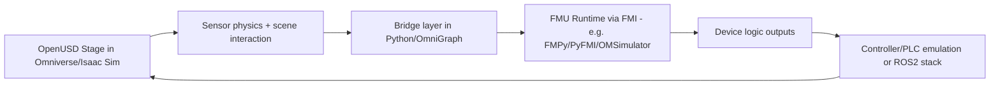

# SICK AG Industrial Metaverse - FMI/FMU Discovery

**Meeting Notes:** [Meeting Notes](https://www.notion.so/260306-Omniverse-Pioneers-SICK-Creating-Virtual-Sensor-Solutions-31b6adb1102b80d5a248e7d36474fe07?source=copy_link)

**Version**: 0.6.0 | **Date**: 06.03.2026 | **Time**: 11:51 | **GlobalID**: 20260306_1052_USD_GoodStart_041
**Last Updated:** 06.03.2026 11:51
**Framework:** General_Research (Discovery Phase)
**Status:** Discovery - Active
**Context:** KI Park / NVIDIA Omniverse User Group talk transcript + slide screenshots
**Tag block:**
#openusd #omniverse #isaac_sim #digital_twin #industrial_automation #workflow_optimization #integration_pattern #best_practices #usd_core #openusd_goodstart #analysis #validation

---

## Discovery Overview

**Subject:** SICK AG talk about Industrial Metaverse with strong focus on virtual commissioning, sensor simulation, and FMI/FMU integration.

**Your explicit focus for this discovery:**
- Slide range around **16-24** (core technical section)
- **FMI** and **FMU** understanding
- Practical relevance for OpenUSD/Omniverse/Isaac Sim workflows

**Primary source package in this session:**
- Full transcript (user-provided)
- Slide screenshots (user-provided, including key technical slides)

---

## Executive Summary

SICK presents a concrete architecture for virtual commissioning where:
- the **physical sensing behavior** is simulated in **Isaac Sim**,
- the **device logic/interface behavior** is packaged as **FMU**,
- both are connected via the **FMI standard interface contract**,
- and OpenUSD/Omniverse acts as collaboration/simulation backbone.

The core message is not "nice visualization", but **engineering-grade workflow acceleration**:
- earlier validation of sensor behavior in real application context,
- faster and safer parameterization before real commissioning,
- reduced late-stage integration risk and lower commissioning cost.

For your learning path, the key unlock is:
1. Understand `FMI` as the standard contract.
2. Understand `FMU` as the executable model package implementing that contract.
3. Understand why this split is powerful in OpenUSD-based digital twin pipelines.

---

## Fast Learning Links (Start Here)

If you wrote "FME", you most likely mean **FMI**. In this context:
- `FMI` = Functional Mock-up Interface (standard)
- `FMU` = Functional Mock-up Unit (model package)

## SICK context (official)

- SICK company website: [https://www.sick.com](https://www.sick.com) - Official company and product entry point.
- SICK article on Industrial Metaverse: [Industrial metaverse: what opportunities the new virtual world offers us](https://www.sick.com/ag/en/sick-sensor-blog/industrial-metaverse-what-opportunities-the-new-virtual-world-offers-us/w/blog-possibilities-industrial-metaverse-podcast) - Official SICK framing of industrial metaverse use cases.
- SICK + NVIDIA Omniverse virtualization article: [Revolutionizing Industrial Automation, SICK Offers Virtual Sensor Solutions Powered by NVIDIA Omniverse](https://www.sick.com/it/it/sick-sensor-blog/revolutionizing-industrial-automation-sick-offers-virtual-sensor-solutions-powered-by-nvidia-omniverse/w/blog-nvidia-omniverse-virtualization-technologies) - Real-world sensor simulation narrative tied to Omniverse.

## FMI / FMU fundamentals (official)

- FMI main site (official): [https://fmi-standard.org](https://fmi-standard.org) - Canonical project homepage and release index.
- FMI 3.0.2 specification: [https://fmi-standard.org/docs/3.0.2/](https://fmi-standard.org/docs/3.0.2/) - Latest stable normative specification.
- FMI 3.0 docs entry (versioned docs): [https://fmi-standard.org/docs/3.0/](https://fmi-standard.org/docs/3.0/) - Major version landing page with structured chapters.
- FMI Implementers' Guide: [https://modelica.github.io/fmi-guides/main/fmi-guide/](https://modelica.github.io/fmi-guides/main/fmi-guide/) - Practical guidance for implementation details.
- FMI standard GitHub (source/spec repo): [https://github.com/modelica/fmi-standard](https://github.com/modelica/fmi-standard) - Source-controlled spec history and issue discussions.

## Practical FMU tooling (learn by doing)

- FMPy docs (Python FMU simulation): [https://fmpy.readthedocs.io/en/stable](https://fmpy.readthedocs.io/en/stable) - Quickest Python path for loading and stepping FMUs.
- FMPy GitHub: [https://github.com/CATIA-Systems/FMPy](https://github.com/CATIA-Systems/FMPy) - Repository, issues, and examples for FMPy workflows.
- PyFMI GitHub: [https://github.com/modelon-community/PyFMI](https://github.com/modelon-community/PyFMI) - Alternative Python FMI runtime maintained by community.
- OpenModelica FMI docs: [Functional Mock-up Interface - OpenModelica User's Guide](https://openmodelica.org/doc/OpenModelicaUsersGuide/1.25/fmitlm.html) - FMI/FMU usage from OpenModelica perspective.
- OMSimulator (FMI co-simulation): [https://openmodelica.org/free-and-open-source-software/omsimulator](https://openmodelica.org/free-and-open-source-software/omsimulator) - Co-simulation master tool reference.

## Omniverse / Isaac references

- Isaac Sim docs home: [https://docs.omniverse.nvidia.com/isaacsim/latest/index.html](https://docs.omniverse.nvidia.com/isaacsim/latest/index.html) - Main documentation hub for simulation platform features.
- Isaac Sim overview: [What Is Isaac Sim?](https://docs.omniverse.nvidia.com/isaacsim/latest/isaac_sim_reference_architecture.html) - Architecture-level description of Isaac Sim capabilities.
- Isaac Sim ROS 2 tutorials: [ROS and ROS 2 in Isaac Sim](https://docs.omniverse.nvidia.com/isaacsim/latest/ros_ros2_tutorials.html) - Official bridge path for external controller ecosystems.

---

## What Is FMI and What Is FMU

## `FMI` (Functional Mock-up Interface)

`FMI` is a **standardized interface specification** for model exchange and co-simulation.

In plain terms:
- It defines how tools/models talk to each other.
- It is tool-agnostic.
- It enables one model producer and another simulation runtime to interoperate.

Think of FMI as:
- USB-C protocol for simulation models: same interface rules, different devices.

## `FMU` (Functional Mock-up Unit)

`FMU` is the **model package** that implements FMI.

In plain terms:
- An FMU contains model logic + metadata + interface definitions.
- It is imported into a simulation runtime that supports FMI.
- It behaves like a reusable simulation component.

Think of FMU as:
- The "device" that plugs into the USB-C port (FMI).

## `FMI` vs `FMU` in one line

- `FMI` = the standard interface contract
- `FMU` = the packaged model artifact using that contract

---

## How FMI/FMU Integrates with OpenUSD and Omniverse (Practical Sketch)

Important: OpenUSD/Omniverse is not "replaced" by FMI/FMU. They solve different layers.

- OpenUSD/Omniverse handles scene, assets, physics world, rendering, collaboration.
- FMI/FMUs handle portable behavior models and co-simulation contracts.

The integration pattern is therefore a **bridge pattern**.

## Integration architecture (conceptual)



## Minimal implementation flow

1. Build your scene in OpenUSD (robot, conveyors, sensors, materials).
2. Run simulation in Isaac Sim; collect sensor-relevant measurements.
3. Pass those measurements to an FMU runtime through a Python bridge.
4. Step the FMU with simulation time (`dt`) and read FMU outputs.
5. Feed outputs back into Omniverse entities or controller/ROS interfaces.
6. Record KPIs (safety events, false positives, cycle time, stops).
7. Export validated configuration to real commissioning toolchain.

## Where to place the bridge in Omniverse

- **Python update loop**: easiest first implementation for proof-of-concept.
- **OmniGraph node wrapper**: better for maintainability and visual pipeline composition.
- **ROS 2 bridge coupling**: useful when controller ecosystem is already ROS-centric.

## Typical data contracts in the bridge

- Inputs to FMU:
  - distances, velocities, detections, occupancy cues, timestamps
- Outputs from FMU:
  - state machine outputs, warnings, stop/release flags, diagnostics
- Sync:
  - deterministic timestep and clear ownership of simulation clock

## What this gives you

- Repeatable virtual commissioning loops
- Vendor-neutral behavior model packaging (`FMU`)
- Clear separation between physical simulation and control logic
- Better scaling across scenarios and hardware variants

## What to watch carefully

- Time synchronization and stepping strategy
- Input/output unit consistency and signal normalization
- FMU version governance and reproducibility
- Material/sensor fidelity assumptions (sim-to-real quality)

---

## Key Technical Takeaways From Slides 16-24

## Slide 16-17 area (SICK sensors in Isaac Sim + synthetic data)

- SICK exposes selected sensor models in Isaac Sim.
- They use these models to generate synthetic sensor output (e.g., point clouds).
- Data can be extracted downstream (e.g., via ROS nodes) for algorithm development and validation.

Discovery significance:
- This is a practical bridge from digital twin scene to ML/sensor pipeline.

## Slide 18-19 area (fidelity levels + high fidelity model usage)

- SICK distinguishes multiple fidelity levels (visualization, understanding, adaptation, high-fidelity).
- High-fidelity aims to minimize sim-to-real gap for sensor behavior and application relevance.
- Synthetic data plus correct modeling enables stronger transfer to real-world deployment.

Discovery significance:
- "Fidelity governance" is strategic; not every use case needs max fidelity.

## Slide 20-24 area (virtual commissioning + full sensor model)

Critical architecture statement:
- Sensor model has two sides:
 - **Sensing model** (physical measurement behavior)
 - **Logic/interface model** (device logic, controller-facing behavior)
- Physical part is simulated in Isaac Sim/OpenUSD environment.
- Logic/interface part is represented as FMU.
- Co-simulation combines both so controller-side behavior is testable before real hardware rollout.

Discovery significance:
- This is the core Industrial Metaverse pattern in this talk.
- OpenUSD is positioned as a practical integration substrate, not only visualization layer.

---

## Interpreted Architecture Pattern (From Transcript)

1. Build/prepare scene and environment in OpenUSD/Isaac Sim.
2. Simulate physical sensor interaction with environment (optics/geometry/material effects).
3. Route measurement results to FMU-based device behavior model.
4. Generate control-relevant outputs/signals as if from real device.
5. Validate commissioning scenarios before real deployment.
6. Export/deploy resulting configuration to real device/system.

Why this matters:
- Decouples tool strengths while preserving system-level behavior.
- Supports iterative parameter tuning in virtual environment.
- Enables earlier fault detection and safety verification.

---

## Open Questions Explicitly Visible in Talk

- How to scale FMU lifecycle management across many sensor types and versions?
- How to standardize material fidelity requirements for near-IR or sensor-specific wavelengths?
- How to measure and report sim-to-real quality in a repeatable way?
- How to package this for broader ecosystem adoption beyond single-vendor setups?

---

## Discovery Hypotheses For Your Next Step

1. **FMI/FMU is a key integration lever for OpenUSD industrial adoption.**
   - Reason: it links controller/device behavior with physically grounded simulation.

2. **Sensor-centric virtual commissioning is a high-value entry point.**
   - Reason: directly tied to commissioning cost, safety, and downtime risk.

3. **Material fidelity is a hidden bottleneck in "looks good" pipelines.**
   - Reason: sensor simulation needs physically relevant material properties, not only visual plausibility.

4. **The strongest strategic angle is not replacing existing tools, but connecting silos.**
   - Reason: this was repeatedly emphasized in Q&A and aligns with your own positioning goal.

---

## Practical Next Discovery Questions (Focused)

1. Which open-source and commercial toolchains already support robust FMI/FMU workflows with OpenUSD scenes?
2. What are best practices for FMU versioning, validation, and compatibility governance in production?
3. Which fidelity metrics are actionable for sensor simulation in commissioning contexts?
4. How should OpenPBR/MDL material workflows be adapted when sensor wavelengths differ from visible-light assumptions?
5. Which minimum reproducible demo would prove this value in your own ecosystem?

---

## Minimal Glossary (for fast orientation)

- **Industrial Metaverse:** Operational use of virtual/connected industrial environments for engineering, validation, and operations.
- **Virtual Commissioning:** Testing and validating machine/system behavior in simulation before or alongside real commissioning.
- **Sim-to-Real Gap:** Difference between simulated and real-world behavior.
- **FMI:** Open standard interface for simulation model exchange/co-simulation.
- **FMU:** Packaged model implementing FMI.
- **Co-Simulation:** Coordinated simulation of multiple model parts/runtimes.

---

## Why This Discovery Is Valuable For OpenUSD GoodStart

This topic extends OpenUSD learning from:
- composition/layer mechanics
to:
- real industrial simulation interoperability patterns.

That makes it highly relevant for your two strategic pillars:
- automated content/simulation workflows,
- digital twin/industrial integration.

---

## Evidence and Documentation Status (NVIDIA + FMI/FMU + Real World)

This section consolidates the current evidence level for your core question:
"Is FMU/FMI integration with Isaac Sim/Omniverse practical and documented?"

## 1) Evidence for Jan's statement ("integration is easy because Python")

## Primary evidence from your transcript

In your transcript, Jan states (paraphrased):
- FMU integration in Isaac Sim was not difficult.
- Reason: FMU libraries are available in Python.
- Isaac Sim is Python-based, so integration hurdle is low.

This is direct practitioner evidence from a real implementation team (SICK talk context).

## Corroborating technical evidence (official docs)

- Isaac Sim has a dedicated Python scripting stack:  
  [Python Scripting and Tutorials](https://docs.isaacsim.omniverse.nvidia.com/6.0.0/python_scripting/index.html)
- Isaac Sim can run as Python environment and execute scripts via `SimulationApp`:  
  [Python Environment Installation](https://docs.isaacsim.omniverse.nvidia.com/6.0.0/installation/install_python.html)
- Isaac Sim supports installing additional Python dependencies (explicitly documented via pip):  
  [Python Environment Installation - additional packages note](https://docs.isaacsim.omniverse.nvidia.com/6.0.0/installation/install_python.html)

Interpretation:
- Jan's "easy because Python" claim is technically plausible and aligned with official platform design.

## 2) What exists officially from NVIDIA (and what does not)

## Officially available (building blocks)

- Isaac Sim Python APIs and scripting model (official)
- Omniverse Kit mechanism to install/use Python packages:
  - [Using Python pip Packages (Kit Manual)](https://docs.omniverse.nvidia.com/kit/docs/kit-manual/latest/guide/using_pip_packages.html)
  - [Install a New Python Package from PyPI (Dev Guide)](https://docs.omniverse.nvidia.com/dev-guide/latest/programmer_ref/python/install-new-python-package-pypi.html)
- OmniGraph node authoring:
  - [Creating Python Nodes](https://docs.omniverse.nvidia.com/kit/docs/omni.graph.docs/latest/dev/CreatingPythonNodes.html)
- ROS2 bridge for external controller/data pipelines:
  - [ROS 2 Bridge](https://docs.isaacsim.omniverse.nvidia.com/4.2.0/features/external_communication/ext_omni_isaac_ros_bridge.html)

## Not found as official NVIDIA end-to-end tutorial

- No canonical NVIDIA page found that explicitly documents:
  - "Import FMU into Isaac Sim"
  - "FMI co-simulation workflow in Omniverse"
  - "Reference architecture: OpenUSD + FMU/FMI + control loop" as a complete official tutorial.

Practical implication:
- You currently compose the workflow from official primitives + external FMI/FM U ecosystem tools.

## 3) Where you can see real-world FMI/Omniverse context

- SICK + Omniverse virtual sensor article:  
  [Revolutionizing Industrial Automation, SICK Offers Virtual Sensor Solutions Powered by NVIDIA Omniverse](https://www.sick.com/it/it/sick-sensor-blog/revolutionizing-industrial-automation-sick-offers-virtual-sensor-solutions-powered-by-nvidia-omniverse/w/blog-nvidia-omniverse-virtualization-technologies)
- SICK Industrial Metaverse article:  
  [Industrial metaverse: what opportunities the new virtual world offers us](https://www.sick.com/ag/en/sick-sensor-blog/industrial-metaverse-what-opportunities-the-new-virtual-world-offers-us/w/blog-possibilities-industrial-metaverse-podcast)

Note:
- These are strong real-world signals and use-case framing.
- They are not public low-level implementation code/tutorials.

## 4) Official FMI/FM U references (authoritative)

- FMI home: [https://fmi-standard.org/](https://fmi-standard.org/)
- FMI 3.0.2 spec: [https://fmi-standard.org/docs/3.0.2/](https://fmi-standard.org/docs/3.0.2/)
- FMI Implementers' Guide: [https://modelica.github.io/fmi-guides/main/fmi-guide/](https://modelica.github.io/fmi-guides/main/fmi-guide/)
- FMI standard repository: [https://github.com/modelica/fmi-standard](https://github.com/modelica/fmi-standard)

## 5) Practical conclusion (current confidence)

- **High confidence:** FMU/FMI integration with Isaac Sim is technically feasible using Python bridge patterns.
- **Medium confidence:** Integration effort is manageable for experienced Python/Omniverse teams.
- **High confidence:** Official NVIDIA docs provide all necessary platform hooks.
- **Low confidence:** Availability of a single official NVIDIA "copy-paste complete FMU tutorial" (not identified).

Recommended framing:
- Treat this as an **integration architecture task**, not a missing-feature blocker.

---

## Proposed Follow-Up Artifact

If you want, next step is a dedicated:
- `SICK_Industrial_Metaverse_FMI_FMU_RESEARCH.md`

with:
- toolchain matrix (Isaac Sim, FMU runtimes, standards support),
- implementation pattern options (lightweight to enterprise),
- concrete pilot architecture recommendation for your ecosystem.

---

## Links

1. <a id="link-1"></a>[SICK official website](https://www.sick.com) - Corporate and product homepage for SICK.
2. <a id="link-2"></a>[SICK: Industrial metaverse opportunities](https://www.sick.com/ag/en/sick-sensor-blog/industrial-metaverse-what-opportunities-the-new-virtual-world-offers-us/w/blog-possibilities-industrial-metaverse-podcast) - Official SICK article describing industrial metaverse strategy.
3. <a id="link-3"></a>[SICK x NVIDIA Omniverse virtual sensor solutions](https://www.sick.com/it/it/sick-sensor-blog/revolutionizing-industrial-automation-sick-offers-virtual-sensor-solutions-powered-by-nvidia-omniverse/w/blog-nvidia-omniverse-virtualization-technologies) - Public example connecting SICK virtual sensors and Omniverse.
4. <a id="link-4"></a>[FMI standard home](https://fmi-standard.org/) - Canonical home for FMI releases and project scope.
5. <a id="link-5"></a>[FMI 3.0.2 specification](https://fmi-standard.org/docs/3.0.2/) - Latest stable normative specification.
6. <a id="link-6"></a>[FMI 3.0 documentation entry](https://fmi-standard.org/docs/3.0/) - Versioned documentation entry for FMI 3.
7. <a id="link-7"></a>[FMI Implementers' Guide](https://modelica.github.io/fmi-guides/main/fmi-guide/) - Implementation-oriented guidance and clarifications.
8. <a id="link-8"></a>[FMI standard GitHub](https://github.com/modelica/fmi-standard) - Source repository and issue tracker for the standard.
9. <a id="link-9"></a>[Isaac Sim docs home](https://docs.omniverse.nvidia.com/isaacsim/latest/index.html) - Main official documentation entry for Isaac Sim.
10. <a id="link-10"></a>[Isaac Sim Python scripting and tutorials](https://docs.isaacsim.omniverse.nvidia.com/6.0.0/python_scripting/index.html) - Official Python-first scripting documentation.
11. <a id="link-11"></a>[Isaac Sim Python environment installation](https://docs.isaacsim.omniverse.nvidia.com/6.0.0/installation/install_python.html) - Official install guide including package management notes.
12. <a id="link-12"></a>[Omniverse Kit: using Python pip packages](https://docs.omniverse.nvidia.com/kit/docs/kit-manual/latest/guide/using_pip_packages.html) - Official Kit guidance for Python package usage in extensions/apps.
13. <a id="link-13"></a>[Omniverse Dev Guide: install Python package from PyPI](https://docs.omniverse.nvidia.com/dev-guide/latest/programmer_ref/python/install-new-python-package-pypi.html) - Official developer snippet for installing Python packages in Kit context.
14. <a id="link-14"></a>[OmniGraph: creating Python nodes](https://docs.omniverse.nvidia.com/kit/docs/omni.graph.docs/latest/dev/CreatingPythonNodes.html) - Official node-authoring path for graph-based integration.
15. <a id="link-15"></a>[Isaac Sim ROS2 bridge](https://docs.isaacsim.omniverse.nvidia.com/4.2.0/features/external_communication/ext_omni_isaac_ros_bridge.html) - Official bridge to ROS2 ecosystems.
16. <a id="link-16"></a>[FMPy docs](https://fmpy.readthedocs.io/en/stable) - Practical Python FMU simulation tool documentation.
17. <a id="link-17"></a>[FMPy GitHub](https://github.com/CATIA-Systems/FMPy) - Source and issues for FMPy runtime usage.
18. <a id="link-18"></a>[PyFMI GitHub](https://github.com/modelon-community/PyFMI) - Alternative Python FMU runtime project.
19. <a id="link-19"></a>[OpenModelica FMI/TLM docs](https://openmodelica.org/doc/OpenModelicaUsersGuide/1.25/fmitlm.html) - FMI usage from OpenModelica and co-simulation perspective.
20. <a id="link-20"></a>[OMSimulator overview](https://openmodelica.org/free-and-open-source-software/omsimulator) - Co-simulation master tool reference in the FMI ecosystem.
21. <a id="link-21"></a>[Meeting Notes](https://www.notion.so/260306-Omniverse-Pioneers-SICK-Creating-Virtual-Sensor-Solutions-31b6adb1102b80d5a248e7d36474fe07?source=copy_link) - Personal meeting notes for the Omniverse Pioneers SICK session.

---

## Appendix: Raw Findings

**Purpose:** Paste raw notes, snippets, and unstructured findings here before integration into the discovery body.

Current note:
- Raw transcript and screenshot interpretation has been integrated into main sections; no detached raw block pending.

---

## External Review Prompt

These prompts are designed for external research systems (LLMs, web-research tools, specialist agents).  
Goal: produce verifiable, source-linked outputs with explicit "official vs community" separation.

### B1) Evidence scan prompt (official docs first)

```text
Task: Verify whether NVIDIA Isaac Sim / Omniverse provides official end-to-end documentation for FMI/FM U integration.

Requirements:
1) Prioritize official NVIDIA domains first (docs.omniverse.nvidia.com, docs.isaacsim.omniverse.nvidia.com, developer.nvidia.com).
2) Return results in 3 buckets:
   - Official end-to-end tutorial found
   - Official building blocks only
   - Non-official/community/vendor examples
3) For each result include:
   - title
   - URL
   - one-sentence relevance
   - confidence (high/medium/low)
4) Do not speculate. If not found, state "not found in official docs".
5) Include a final verdict: "is there an official copy-paste FMU/FMI tutorial for Isaac Sim?"
```

### B2) Integration design prompt (architecture-oriented)

```text
Context:
- OpenUSD/Omniverse scene simulation
- Need to integrate FMU behavior model via FMI
- Target runtime: Isaac Sim (Python-based)

Task:
Propose a minimal but robust integration architecture for FMU/FMI in Isaac Sim.

Output format:
1) Architecture diagram (text form)
2) Data contracts (inputs/outputs, units, timestep ownership)
3) Execution loop pseudocode
4) Failure modes (time sync, unit mismatch, solver drift)
5) Validation checklist for sim-to-real readiness
6) Explicitly label which parts are based on official NVIDIA docs vs ecosystem best practice
```

### B3) Source validation prompt (anti-hallucination)

```text
Validate the following claims and mark each as:
- Verified by official source
- Verified by non-official source
- Not verified

Claims:
1) "Isaac Sim has native first-class FMU import UI"
2) "Isaac Sim is Python-scriptable and supports external Python packages"
3) "FMI is maintained by the Modelica Association"
4) "SICK publicly shows Omniverse-based virtual sensor workflows"

Rules:
- Provide at least one URL per verified claim.
- If a claim is not verified, explain what evidence is missing.
- Keep answer concise and evidence-centric.
```

### B4) Deep dive prompt (FMI/FM U learning for beginners)

```text
Act as a technical tutor for someone new to FMI/FM U.

Explain:
1) FMI vs FMU in plain language
2) Model Exchange vs Co-Simulation
3) Why this matters for virtual commissioning
4) How this can connect to OpenUSD/Isaac Sim workflows

Constraints:
- Use practical examples from industrial automation
- Include links to official sources
- Avoid undefined jargon
- End with a 7-day learning path (beginner to first prototype)
```

