# Understanding Composition Arcs — Video Deep-Dive Tutorial

**Version**: 0.1.9 | **Date**: 03.03.2026 | **Time**: 18:30 | **GlobalID**: 20260303_1830_USD_GoodStart_025

**Tag block:**
#openusd #composition_arcs #livrps #layers #references #payloads #inherits #specializes #variants #digital_twin #certification #best_practices


**Canonical Video Source:** [YouTube — Understanding Composition Arcs | OpenUSD Community Office Hours](https://www.youtube.com/watch?v=85gC4Vja5Uo&t=12s) [1 — YouTube video](#link-1)  
**Presenter:** Austin Hwang (with Edmar + Madi from NVIDIA)  
**Video Deep-Dive Tutorial** build post factum by [Jan Haluszka](https://www.linkedin.com/in/jan-haluszka-tangible-digital-twins/)  
**Primary Learning Backbone:** [NVIDIA Learn OpenUSD](https://docs.nvidia.com/learn-openusd/latest/index.html) [2 — Learn OpenUSD curriculum](#link-2)

**Most important resources (keep these open):** [19 — Awesome OpenUSD](#link-19), [2 — Learn OpenUSD curriculum](#link-2)

---

## Before You Start (Quick Setup)

- USD Python environment with `pxr`
- `usdview` installed
- This deep-dive file + key-moment screenshot folder open side-by-side

Setup reference:
- [Learn OpenUSD — usdview + Python setup](https://docs.nvidia.com/learn-openusd/latest/usdview-install-instructions.html) [3 — setup](#link-3)


[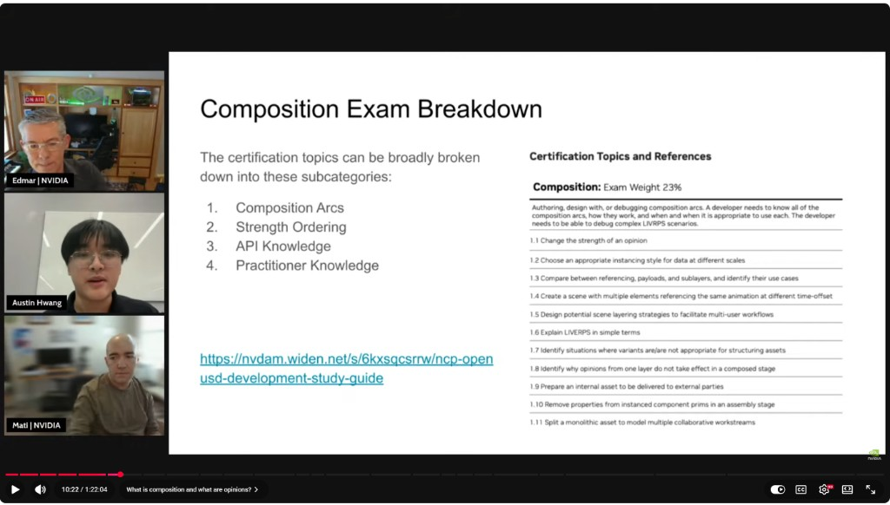](Pics/UnderstandingCompositionArcs/UCA1__2026-03-03_40_55.png)

[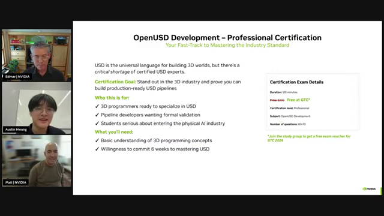](Pics/UnderstandingCompositionArcs/UCA_02_000116_what_is_the_openusd_certification.png)

[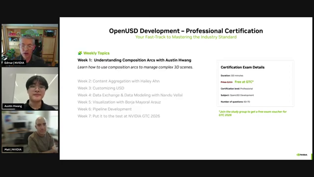](Pics/UnderstandingCompositionArcs/UCA_03_000303_exam_structure_and_candidate_profile.png)

**Quick note on this slide:** treat this deep dive as “exam-style composition practice with a production storyline.”  
If you’re actively going for the credential, start with [14 — OpenUSD Development Certification (NCP-OUSD)](#link-14) for scope + prep, then [20 — Register for the exam (Certiverse)](#link-20). Keep [21 — Official study guide (PDF)](#link-21) and [22 — Why certification matters](#link-22) nearby as your “what to study next” map.

---

## How This Tutorial Works

Two-layer structure:

1. **Story layer** — one narrative thread across all chapters.
2. **Production layer** — practical pipeline behavior, checks, and pitfalls.

### Story anchor for this session: **Packaging Cell 3**

You are building a digital twin for **Packaging Cell 3**:

- A robot arm picks products off a conveyor and places them into boxes.
- An inspection camera validates label alignment after each placement.
- A QA overlay shows station status and failure reasons (OK/WARN/FAULT).
- Operations wants stable, auditable answers to: “what changed, where did that value come from, and why did it win?”

Composition arcs are the mechanism that lets **multiple teams author the “same” twin without editing the same file**, while still letting you predict which opinion wins at runtime.

### LIVRPS in one minute (keep this in working memory)

Most exam questions and most production incidents boil down to the same task: *“Given several authored opinions, which one wins?”*  
The fastest mental model is **LIVRPS** (sometimes written as **LIVERPS**):

- **L — Local opinions** (authored directly on the composed prim)
- **I — Inherits**
- **V — Variant sets**
- **R — References**
- **P — Payloads**
- **S — Specializes**

You don’t need to recite this order under stress; you need to **use it as a trace procedure**:

1. Find the prim you care about.
2. Ask “is the value authored locally here?” If yes, you’re often done.
3. If not, walk down the arc stack in **LIVRPS** order and identify where the winning opinion originates.

The flowchart below mirrors the **Strength Ordering Flowchart (from the Book of USD)** — the same logic USD uses to resolve property and metadata values:

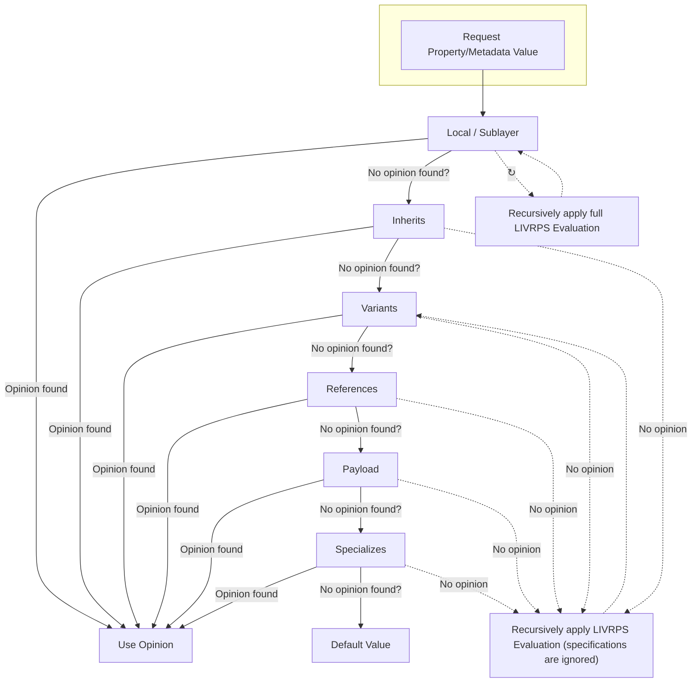
```mermaid
flowchart TD
    subgraph Entry[" "]
        Start["Request Property/Metadata Value"]
    end

    L["Local / Sublayer"]
    I["Inherits"]
    V["Variants"]
    R["References"]
    P["Payload"]
    S["Specializes"]

    UseOpinion["Use Opinion"]
    Default["Default Value"]

    RecursiveFull["Recursively apply full LIVRPS Evaluation"]
    RecursivePartial["Recursively apply LIVRPS Evaluation (specifications are ignored)"]

    Start --> L
    L -->|"Opinion found"| UseOpinion
    L -->|"No opinion found?"| I
    I -->|"Opinion found"| UseOpinion
    I -->|"No opinion found?"| V
    V -->|"Opinion found"| UseOpinion
    V -->|"No opinion found?"| R
    R -->|"Opinion found"| UseOpinion
    R -->|"No opinion found?"| P
    P -->|"Opinion found"| UseOpinion
    P -->|"No opinion found?"| S
    S -->|"Opinion found"| UseOpinion
    S -->|"No opinion found?"| Default

    L -.->|"↻"| RecursiveFull
    RecursiveFull -.-> L

    I -.->|"No opinion"| RecursivePartial
    V -.->|"No opinion"| RecursivePartial
    R -.->|"No opinion"| RecursivePartial
    P -.->|"No opinion"| RecursivePartial
    S -.->|"No opinion"| RecursivePartial
    RecursivePartial -.-> V
```

*Interpretation:* At each stage, if an opinion is found, use it. If not, proceed to the next weaker arc. If nothing is found through the entire stack, the result is the default value.

*Advanced note:* **Local/Sublayer** can trigger a recursive re-evaluation (e.g. when resolving composed opinions from sublayers). For **Inherits, Variants, References, Payload, Specializes**, USD may recursively walk the arc stack when no opinion is found. The full rules are in the [Book of USD](https://remedy-entertainment.github.io/USDBook/index.html); for exam and most production tracing, the linear "walk until you find an opinion" model is sufficient.

**Learn OpenUSD ->** [12 — LIVRPS](#link-12), [17 — Value resolution](#link-17). **Book of USD:** [Strength Ordering (LIVRPS)](https://remedy-entertainment.github.io/USDBook/terminology/LIVRPS.html?highlight=LIVRPS#strength-ordering-livrps)

---

## Chapter Outcomes at a Glance

| Chapter | Video section (approx) | Exam topic | Outcome | Learn OpenUSD quick jump |
|---|---|---|---|---|
| [Chapter 0](#chapter-0) | [00:00](https://www.youtube.com/watch?v=85gC4Vja5Uo&t=0s) | Certification context | Understand what composition questions are testing. | [2 — Curriculum](#link-2), [4 — Glossary](#link-4) |
| [Chapter 1](#chapter-1) | [09:08](https://www.youtube.com/watch?v=85gC4Vja5Uo&t=548s) | Composition fundamentals | Explain composition, opinions, and value resolution source. | [5 — Introduction to composition](#link-5) |
| [Chapter 2](#chapter-2) | [12:28](https://www.youtube.com/watch?v=85gC4Vja5Uo&t=748s) | Layers / sublayers | Use sublayers for team collaboration with strength ordering. | [6 — Layers and sublayers](#link-6) |
| [Chapter 3](#chapter-3) | [14:34](https://www.youtube.com/watch?v=85gC4Vja5Uo&t=874s) | Inherits / variants | Distinguish inherits, variants, and when each is appropriate. | [7 — Inherits](#link-7), [8 — Variants](#link-8) |
| [Chapter 4](#chapter-4) | [19:54](https://www.youtube.com/watch?v=85gC4Vja5Uo&t=1194s) | References / payloads / specializes | Choose arc by runtime behavior and data weight. | [9 — References](#link-9), [10 — Payloads](#link-10), [11 — Specializes](#link-11) |
| [Chapter 5](#chapter-5) | [27:53](https://www.youtube.com/watch?v=85gC4Vja5Uo&t=1673s) | LIVRPS tracing | Trace opinion resolution in exam-style multi-file setups. | [12 — LIVRPS](#link-12), [13 — Stage API](#link-13) |
| [Chapter 6](#chapter-6) | [40:01](https://www.youtube.com/watch?v=85gC4Vja5Uo&t=2401s) | Practical exam strategy | Recognize question patterns and avoid common traps. | [14 — Certification page](#link-14), [15 — Pixar tutorials](#link-15) |
| [Chapter 7](#chapter-7) | [51:13](https://www.youtube.com/watch?v=85gC4Vja5Uo&t=3073s) | Debug / production behavior | Build a repeatable debug checklist for composition issues. | [16 — Asset structure](#link-16), [17 — Value resolution](#link-17) |

---

<a id="chapter-0"></a>
## Chapter 0 — Why Composition Arcs First

**Watch first:** [~00:00](https://www.youtube.com/watch?v=85gC4Vja5Uo&t=0s)

This session starts with certification framing on purpose: composition is not “advanced trivia,” it is a core developer competency. If you cannot predict where a value comes from in a composed stage, you cannot trust your digital twin in production.

For Packaging Cell 3, this is immediate: layout, simulation, and QA each author different layers. Composition arcs decide which opinion wins — not team hierarchy and not wishful thinking.


**Learn OpenUSD ->** [2 — Curriculum](#link-2)

### Packaging Cell 3 Takeover — What “composition” looks like on a real shop floor

Before we touch any arc, freeze the commissioning reality:

- **One physical cell, many stakeholders**: mechanical layout, simulation, QA, ops, safety.
- **One digital twin**: the stage you hand to a runtime/viewer.
- **Many authored opinions**: each team “fixes” something, and the stage composes them.

Your job is not “make USD files.” Your job is: **make opinion ownership and value resolution predictable** so the twin is defensible.

---

<a id="chapter-1"></a>
## Chapter 1 — Composition, Opinions, and Value Sources

**Watch first:** [~09:08](https://www.youtube.com/watch?v=85gC4Vja5Uo&t=548s)

Now the session moves from “why this matters” to the definitions you need for every exam question. This is where we turn “composition” from a vibe into a traceable mechanism.

- **Composition**: assembling layers into one stage.
- **Composition arcs**: operators that drive assembly behavior.
- **Opinion**: authored value that participates in resolution.
- **Value resolution source**: the layer where the winning opinion originates.

[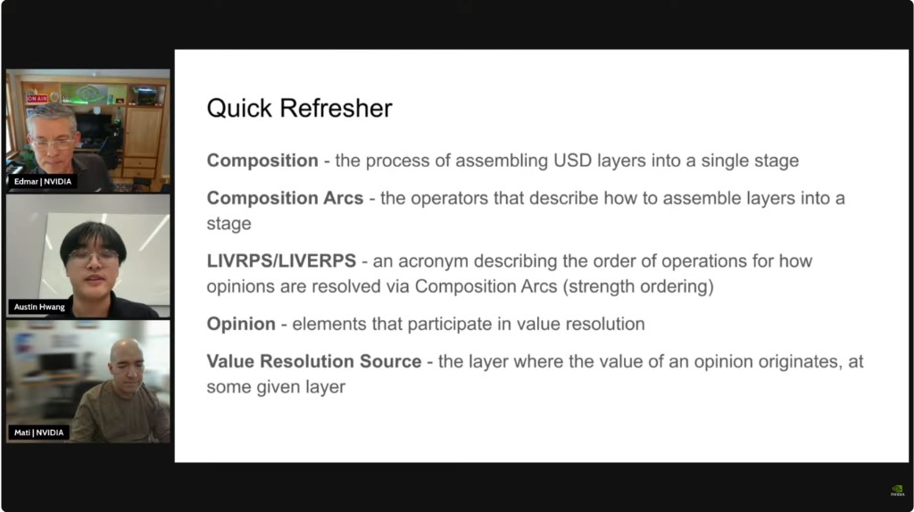](Pics/UnderstandingCompositionArcs/UCA0_2026-03-03_11h13_02.png)

This sounds abstract until you apply it to Packaging Cell 3: one robot’s status overlay color looks wrong. The fix is not “change color somewhere” — the fix is tracing which layer authored the winning value and why it outranked others.

**Learn OpenUSD ->** [5 — Composition basics](#link-5)

### Packaging Cell 3 Takeover — The only question that matters under pressure

When the line is down and someone says “the twin is wrong,” the one question that prevents chaos is:

> **Where does the winning value come from?**

If you can answer that, you can fix it without collateral damage. If you can’t, you’ll “fix” the wrong file and the problem will come back next import.

### Script Lab

Planned scripts (not yet committed):
- `composition_arcs/00_opinion_source_walkthrough.py`

---

<a id="chapter-2"></a>
## Chapter 2 — Layers and Sublayers for Team Collaboration

**Watch first:** [~12:28](https://www.youtube.com/watch?v=85gC4Vja5Uo&t=748s)

This chapter introduces **sublayers** — the first practical composition mechanism. Sublayers participate in strength ordering and composition, but are often discussed separately from the six LIVRPS arcs (inherits, variants, references, payloads, specializes). After Chapter 1, you have the vocabulary; now you get the first “team choreography” mechanism.

For Packaging Cell 3, think:

- `cell03_layout.usda` (layout team)
- `cell03_sim.usda` (simulation team)
- `cell03_qa.usda` (QA overlays)

The sublayer stack defines opinion strength. This is how three teams can work in parallel without file-lock chaos.

[](Pics/UnderstandingCompositionArcs/UCA1__2026-03-03_40_55.png)

*The slide introduces the core idea: a layer is like a USD file on disk; sublayers are an ordered list where the first is strongest, the last weakest. Adding a sublayer brings all its contents into the destination layer with no remapping.*

[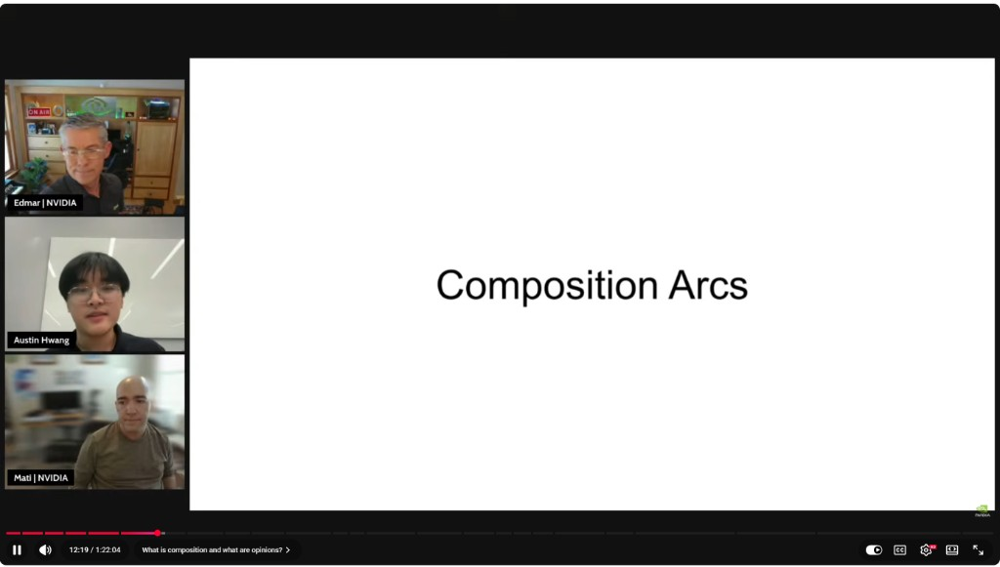](Pics/UnderstandingCompositionArcs/UCA1__2026-03-03_42_22.png)

*Austin’s practical advice: teams often own their own layer (e.g. lighting team owns a lighting layer) and compose them together for the final product. This avoids file-lock chaos.*

[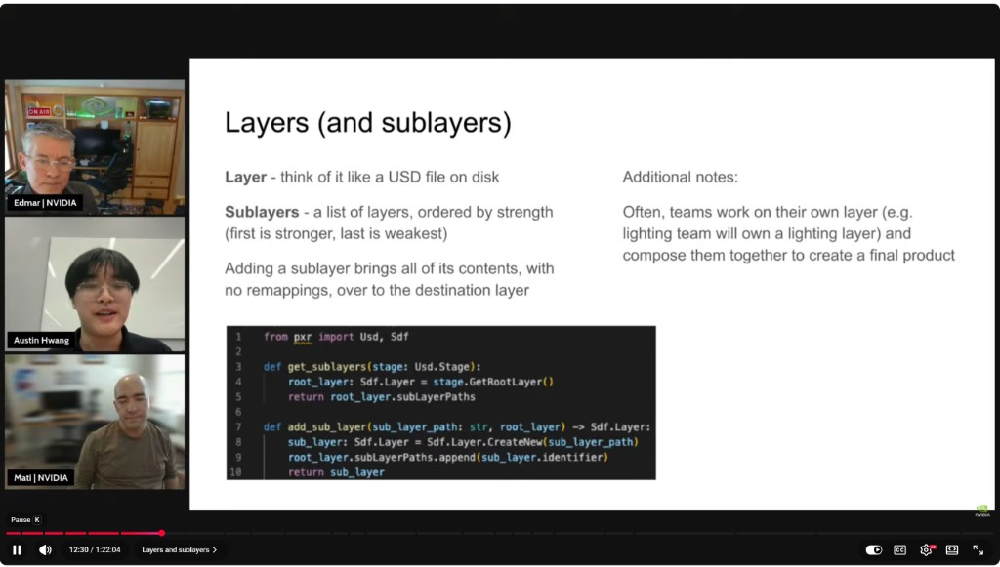](Pics/UnderstandingCompositionArcs/UCA1__2026-03-03_42_27.png)

*The same pattern applies across disciplines: lighting, shading, and animation can each author into their own layer. The sublayer stack decides which opinion wins.*

### Code Breakout — Sublayer query and add (Python API)

**Raw snippet:**

```py
from pxr import Usd, Sdf

def get_sublayers(stage: Usd.Stage):
    root_layer: Sdf.Layer = stage.GetRootLayer()
    return root_layer.subLayerPaths

def add_sub_layer(sub_layer_path: str, root_layer) -> Sdf.Layer:
    sub_layer: Sdf.Layer = Sdf.Layer.CreateNew(sub_layer_path)
    root_layer.subLayerPaths.append(sub_layer.identifier)
    return sub_layer
```

**Commented walkthrough:**

```py
from pxr import Usd, Sdf

def get_sublayers(stage: Usd.Stage):
    # Root layer is the top of the sublayer stack — strongest opinions live here
    root_layer: Sdf.Layer = stage.GetRootLayer()
    # subLayerPaths is the ordered list; first = strongest, last = weakest
    return root_layer.subLayerPaths

def add_sub_layer(sub_layer_path: str, root_layer) -> Sdf.Layer:
    # Create a new layer on disk (or in memory)
    sub_layer: Sdf.Layer = Sdf.Layer.CreateNew(sub_layer_path)
    # Append = add to the WEAK end of the stack (new layer gets overridden by root)
    root_layer.subLayerPaths.append(sub_layer.identifier)
    return sub_layer
```

**Why this works**
- `GetRootLayer()` gives you the layer that owns the stage; its sublayers define the composition stack.
- `subLayerPaths` is a list-edit; append adds to the weak end. Prepend would add to the strong end.
- `Sdf.Layer.CreateNew()` creates an empty layer; you can then author into it.

**Why this fails**
- Appending to `subLayerPaths` without creating the layer first can leave dangling paths if the path is invalid.
- If teams author into sublayers without agreeing on units/naming, the composed result becomes unpredictable — sublayers merge namespaces directly.

**Production warning:** sublayering pulls opinions into one namespace directly; it is powerful, but if your conventions diverge (units, naming, intended ownership), resolution becomes confusing fast.

**Learn OpenUSD ->** [6 — Layers and sublayers](#link-6)

### Packaging Cell 3 Takeover — Ownership is a layer stack, not a meeting

In Packaging Cell 3, you’ll typically end up with something like:

- `cell03_layout.usda` (layout owns prim paths + geometry)
- `cell03_sim.usda` (simulation owns kinematics/physics hints)
- `cell03_qa.usda` (QA owns diagnostic overlays + station state)

Sublayers are great **when conventions match** and you want “one stage, stacked opinions.”  
They’re dangerous when you mix conventions or use them as a dumping ground — because suddenly *everything* can override *everything*.

### Script Lab

Planned scripts (not yet committed):
- `composition_arcs/10_sublayer_strength_demo.py`

---

<a id="chapter-3"></a>
## Chapter 3 — Inherits and Variants (Reuse Without Duplication)

**Watch first:** [~14:34](https://www.youtube.com/watch?v=85gC4Vja5Uo&t=874s)

Chapter 3 sharpens two concepts that people mix up. After sublayers (stack opinions), you now get mechanisms that help you **reuse intent** without copy/paste.

- **Inherits**: broadcast-style reuse of authored opinions from a class-like source.
- **Variants**: discrete alternatives within a variant set; set can exist even if no selection is authored.

The speaker also flags a useful nuance: OOP inheritance is only a partial analogy for USD inherits. Treat the analogy as a mnemonic, not as a strict equivalence model.

[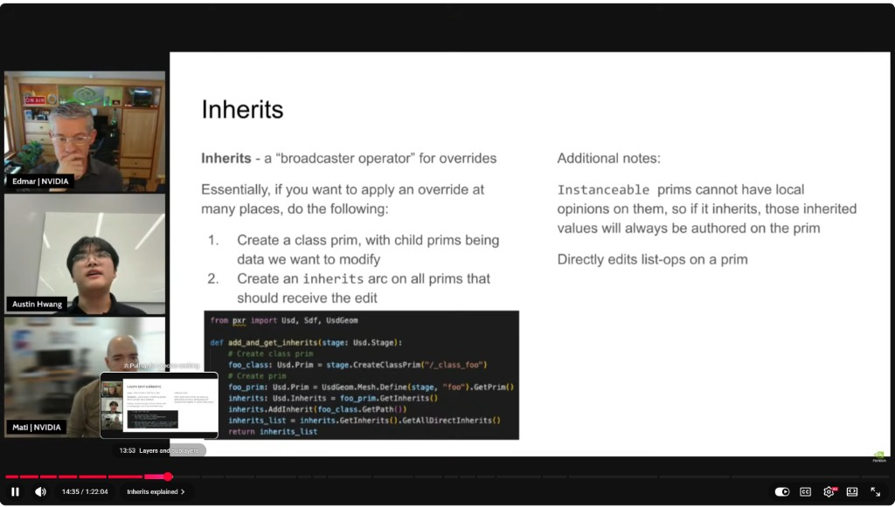](Pics/UnderstandingCompositionArcs/UCA1__2026-03-03_42_37.png)

*Inherits: a "broadcaster operator" for overrides. Create a class prim with child prims you want to modify; add an inherits arc on all prims that should receive the edit. Instanceable prims cannot have local opinions — inherited values are always authored on the prim.*

### Code Breakout — Add inherits arc (Python API)

**Raw snippet:**

```py
from pxr import Usd, Sdf, UsdGeom

def add_and_get_inherits(stage: Usd.Stage):
    foo_class: Usd.Prim = stage.CreateClassPrim("/_class_foo")
    foo_prim: Usd.Prim = UsdGeom.Mesh.Define(stage, "/foo").GetPrim()
    inherits: Usd.Inherits = foo_prim.GetInherits()
    inherits.AddInherit(foo_class.GetPath())
    inherits_list = inherits.GetAllDirectInherits()
    return inherits_list
```

**Commented walkthrough:**

```py
from pxr import Usd, Sdf, UsdGeom

def add_and_get_inherits(stage: Usd.Stage):
    # Create a "class" prim — a template that other prims inherit from
    foo_class: Usd.Prim = stage.CreateClassPrim("/_class_foo")
    # Create a mesh prim that will receive the inherit arc
    foo_prim: Usd.Prim = UsdGeom.Mesh.Define(stage, "/foo").GetPrim()
    # Get the Inherits API (list-ops on the prim)
    inherits: Usd.Inherits = foo_prim.GetInherits()
    # Add the class as an inherit — foo_prim now gets opinions from foo_class
    inherits.AddInherit(foo_class.GetPath())
    # Return the list of direct inherits for inspection
    inherits_list = inherits.GetAllDirectInherits()
    return inherits_list
```

**Why this works**
- Inherits is a “broadcaster”: edit the class prim, and all prims that inherit from it receive the override.
- In LIVRPS, **I (Inherits)** is strong — useful when you want many prims to share a base and override in one place.
- Class prims are often under `/_class_*` by convention to distinguish them from scene prims.

**Why this fails**
- When editing instance proxies or descendants of instanceable prims, inheritance and local overrides behave differently — the instance prototype controls what can be overridden per-instance. This often trips up users who expect to author local opinions on instance proxies.
- Directly edits list-ops; ordering matters when multiple inherits exist (strongest first).

[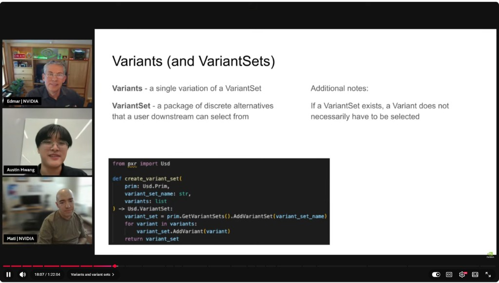](Pics/UnderstandingCompositionArcs/UCA1__2026-03-03_42_55.png)

*Variants: a single variation of a VariantSet. VariantSet: a package of discrete alternatives that a user downstream can select from. If a VariantSet exists, a Variant does not necessarily have to be selected.*

### Code Breakout — Create variant set (Python API)

**Raw snippet:**

```py
from pxr import Usd

def create_variant_set(
    prim: Usd.Prim,
    variant_set_name: str,
    variants: list
) -> Usd.VariantSet:
    variant_set = prim.GetVariantSets().AddVariantSet(variant_set_name)
    for variant in variants:
        variant_set.AddVariant(variant)
    return variant_set
```

**Commented walkthrough:**

```py
from pxr import Usd

def create_variant_set(
    prim: Usd.Prim,
    variant_set_name: str,
    variants: list
) -> Usd.VariantSet:
    # Get the prim's VariantSets, then add a new VariantSet by name
    variant_set = prim.GetVariantSets().AddVariantSet(variant_set_name)
    # Add each variant name to the set (e.g. ["suction", "parallel_jaw"])
    for variant in variants:
        variant_set.AddVariant(variant)
    return variant_set
```

**Why this works**
- VariantSet packages discrete alternatives; downstream users select one.
- In LIVRPS, **V (Variants)** sits between Inherits and References — strong enough to override Specializes/References/Payloads when selected.
- A VariantSet can exist without a selection authored; the composed result then falls through to weaker arcs.

**Why this fails**
- Don't confuse variant *selection* (which variant is active) with variant *authoring* (adding variants to the set). Both are separate list-ops.
- If no variant is selected, USD walks to the next arc in LIVRPS. Plan for that case.

In Packaging Cell 3 terms, variants are perfect for controlled alternates like:

- `gripper = suction` / `gripper = parallel_jaw`
- `safetyMode = normal` / `safetyMode = reduced_speed`

**Learn OpenUSD ->** [7 — Inherits](#link-7), [8 — Variants](#link-8)

### Packaging Cell 3 Takeover — Keep “options” explicit, not accidental

Variants are the clean way to represent “either/or” choices that the real cell will switch between:

- **End-effector**: suction vs parallel-jaw gripper
- **Inspection mode**: barcode-only vs OCR+alignment
- **Safety mode**: normal vs reduced speed

If you don’t model these explicitly, teams will encode them as one-off overrides in random layers — and your “why did this change?” story evaporates.

### Script Lab

Planned scripts (not yet committed):
- `composition_arcs/20_inherits_vs_local_opinions.py`
- `composition_arcs/21_variant_set_no_selection_case.py`

---

<a id="chapter-4"></a>
## Chapter 4 — References, Payloads, Specializes (Choosing the Right Arc)

**Watch first:** [~19:54](https://www.youtube.com/watch?v=85gC4Vja5Uo&t=1194s)

This is where composition stops being theory and becomes runtime behavior. After Chapters 2–3 (team collaboration + reuse), Chapter 4 is about **assembling heavyweight assets** without turning your stage into sludge.

- **Reference**: bring external prims into your stage composition graph.
- **Payload**: like reference but with deferred loading control.
- **Specializes**: template-like base behavior with easy override by stronger arcs/opinions.

[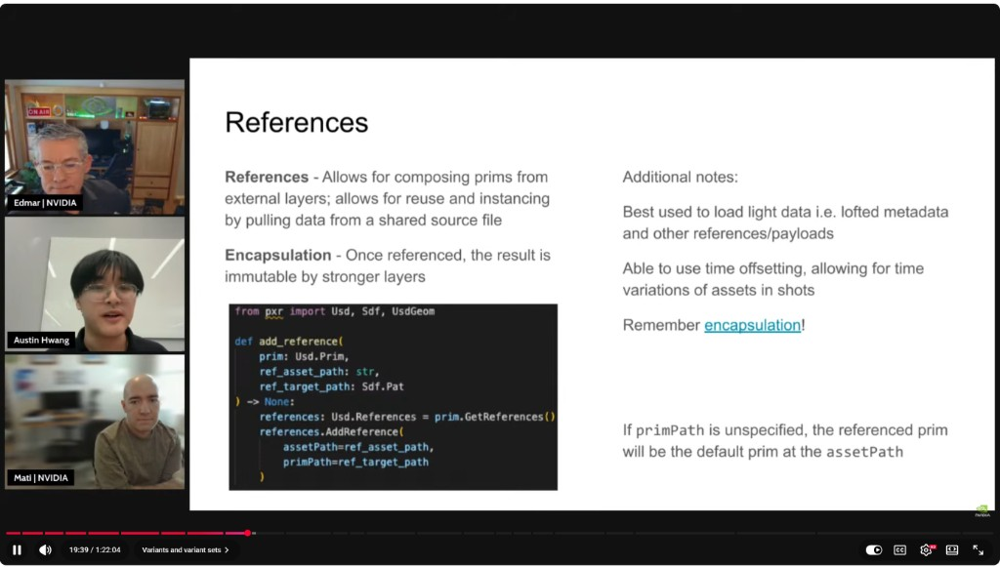](Pics/UnderstandingCompositionArcs/UCA1__2026-03-03_43_02.png)

*References: compose prims from external layers; reuse and instancing by pulling data from a shared source file. Encapsulation: once referenced, the result is immutable by stronger layers. Best for light data (metadata, references/payloads). Supports time offsetting for shot variations.*

### Code Breakout — Add reference arc (Python API)

**Raw snippet:**

```py
from pxr import Usd, Sdf

def add_reference(
    prim: Usd.Prim,
    ref_asset_path: str,
    ref_target_path: Sdf.Path
) -> None:
    references: Usd.References = prim.GetReferences()
    references.AddReference(
        assetPath=ref_asset_path,
        primPath=ref_target_path
    )
```

**Commented walkthrough:**

```py
from pxr import Usd, Sdf

def add_reference(
    prim: Usd.Prim,
    ref_asset_path: str,
    ref_target_path: Sdf.Path
) -> None:
    # Get the References API — list-ops on the prim that manage external layer composition
    references: Usd.References = prim.GetReferences()
    # Add a reference: pulls prims from the external layer into this prim's namespace.
    # The referenced prims are composed in; stronger layers can override, weaker cannot (encapsulation).
    references.AddReference(
        assetPath=ref_asset_path,   # Path to .usda/.usdc/.usdz (resolved by asset resolver)
        primPath=ref_target_path   # Prim path inside that asset; omit to use defaultPrim
    )
```

**Why this works**
- References compose external layers into the stage; great for reuse and instancing.
- **Encapsulation:** once referenced, the result is immutable by weaker layers — stronger layers can override.
- Best for light data (metadata, more references/payloads). Supports time offsetting for shot variations.

**Why this fails**
- If `primPath` is unspecified, the referenced prim is the defaultPrim at `assetPath` — can surprise you if the asset's defaultPrim changes.
- Heavy geometry in every reference loads eagerly; use payloads for deferred loading when you need selective load.

[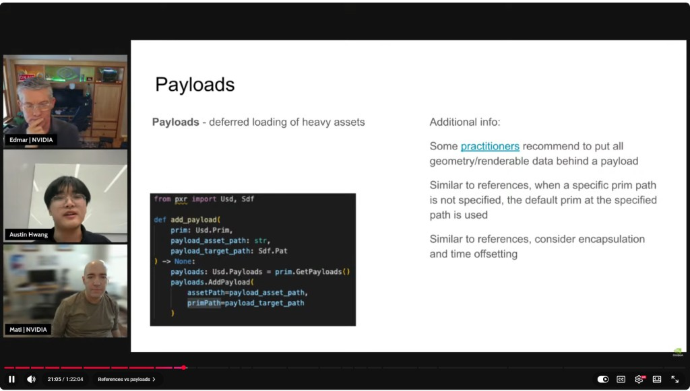](Pics/UnderstandingCompositionArcs/UCA1__2026-03-03_43_09.png)

*Payloads: deferred loading of heavy assets. Some practitioners recommend putting all geometry/renderable data behind a payload. Similar to references: default prim used when prim path unspecified; consider encapsulation and time offsetting.*

### Code Breakout — Add payload arc (Python API)

**Raw snippet:**

```py
from pxr import Usd, Sdf

def add_payload(
    prim: Usd.Prim,
    payload_asset_path: str,
    payload_target_path: Sdf.Path
) -> None:
    payloads: Usd.Payloads = prim.GetPayloads()
    payloads.AddPayload(
        assetPath=payload_asset_path,
        primPath=payload_target_path
    )
```

**Commented walkthrough:**

```py
from pxr import Usd, Sdf

def add_payload(
    prim: Usd.Prim,
    payload_asset_path: str,
    payload_target_path: Sdf.Path
) -> None:
    # Get the Payloads API — list-ops on the prim, same shape as References
    payloads: Usd.Payloads = prim.GetPayloads()
    # Add a payload: same composition as reference, but loading is deferred until requested.
    # Use Load/Unload to control when heavy geometry enters the stage.
    payloads.AddPayload(
        assetPath=payload_asset_path,   # Path to .usda/.usdc/.usdz
        primPath=payload_target_path   # Prim path inside that asset; omit to use defaultPrim
    )
```

**Why this works**
- Payloads compose like references but load lazily — critical for heavy scenes.
- In LIVRPS, **P (Payloads)** sits between References and Specializes.
- Best for geometry/renderable data; practitioners often put all heavy content behind payloads.

**Why this fails**
- If you never load the payload, the prim exists but has no geometry. Downstream code must call `Usd.Stage.Load()` / `Unload()`.
- Same encapsulation rules as references; omit `primPath` to use defaultPrim — same surprise risk if the asset changes.

[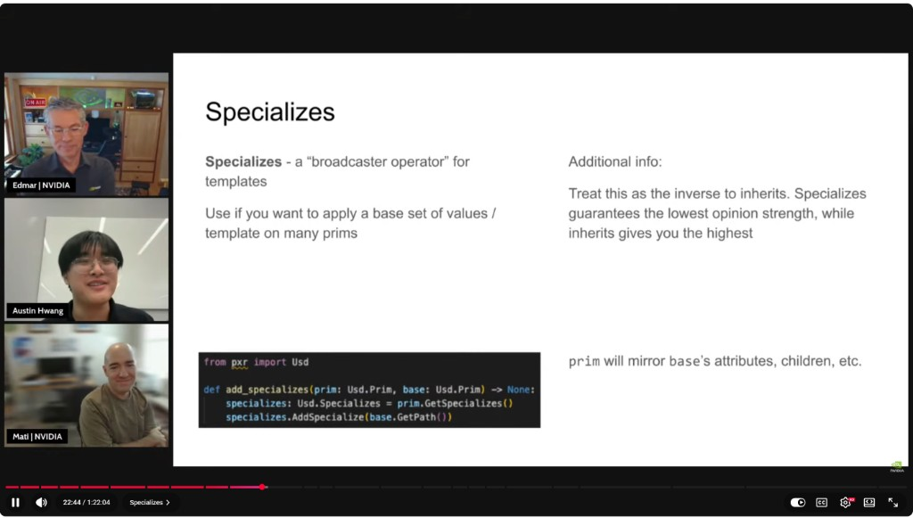](Pics/UnderstandingCompositionArcs/UCA1__2026-03-03_43_18.png)

*References vs payloads: the key distinction is when data loads. References load eagerly; payloads defer until requested.*

[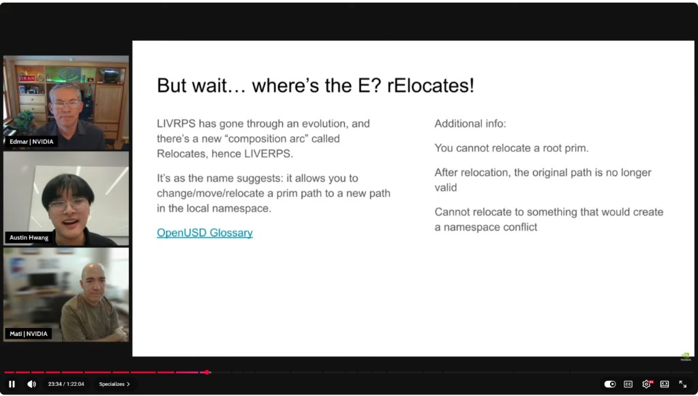](Pics/UnderstandingCompositionArcs/UCA1__2026-03-03_43_26.png)

*Specializes: a "broadcaster operator" for templates. Use when you want to apply a base set of values on many prims. Inverse of inherits — Specializes guarantees lowest opinion strength; Inherits gives highest.*

### Code Breakout — Add specializes arc (Python API)

**Raw snippet:**

```py
from pxr import Usd

def add_specializes(prim: Usd.Prim, base: Usd.Prim) -> None:
    specializes: Usd.Specializes = prim.GetSpecializes()
    specializes.AddSpecialize(base.GetPath())
```

**Commented walkthrough:**

```py
from pxr import Usd

def add_specializes(prim: Usd.Prim, base: Usd.Prim) -> None:
    # Get the Specializes API (list-ops on the prim)
    specializes: Usd.Specializes = prim.GetSpecializes()
    # Add the base prim — prim now mirrors base's attributes, children, etc.
    specializes.AddSpecialize(base.GetPath())
```

**Why this works**
- Specializes is a "broadcaster for templates": apply a base set of values to many prims.
- In LIVRPS, **S (Specializes)** is weakest — easy to override by local, inherits, variants, references, payloads.
- Prim mirrors base's attributes, children, etc. Use when you want a shared baseline that stronger arcs can override.

**Why this fails**
- Inverse of inherits: inherits gives highest opinion strength among arcs; specializes gives lowest. Don't confuse them.
- If you need the base to "win" over local edits, use inherits instead. Specializes is for "default template, override per prim."

The “if you had only one arc” discussion favoring payloads is a strong production hint: heavy scenes need selective load strategies.

For Packaging Cell 3:

- Reference reusable robot assets.
- Payload high-detail fixture assemblies.
- Specialize baseline station templates and override per deployment.

**Learn OpenUSD ->** [9 — References](#link-9), [10 — Payloads](#link-10), [11 — Specializes](#link-11)

### Packaging Cell 3 Takeover — “How heavy is this asset, and do I need it right now?”

Packaging Cell 3 has the classic “heavy vs light” split:

- The conveyor + robot + fixture assembly can be *heavy*.
- The station status overlay needs to be *fast*.
- The manager review render wants *everything*, but not always.

References/payloads aren’t academic. They’re your runtime performance dial — and your “can we even load this stage” survival mechanism.

### Script Lab

Planned scripts (not yet committed):
- `composition_arcs/30_reference_vs_payload_runtime_load.py`
- `composition_arcs/30b_add_payload_arc.py`
- `composition_arcs/31_specializes_template_override.py`

---

<a id="chapter-5"></a>
## Chapter 5 — LIVRPS Tracing Like an Exam Pro

**Watch first:** [~27:53](https://www.youtube.com/watch?v=85gC4Vja5Uo&t=1673s)

This is the core competency chapter. You get a practical mental model and walkthrough for ordering and tracing. If you can do Chapter 5 reliably, both the exam and production incidents get dramatically easier.

- Layer stack context
- Arc precedence
- Opinion strength and local overrides

**LIVRPS and Relocates — the full picture**

The acronym **LIVERPS** extends LIVRPS with **Relocates** (the “E”). Relocates is a composition arc, but it does *not* participate in the same strength-ordering flowchart: it affects *namespace/path resolution* (where a prim lives), not *opinion strength* (which value wins). For trace questions like “which value wins?”, use **LIVRPS** only.

[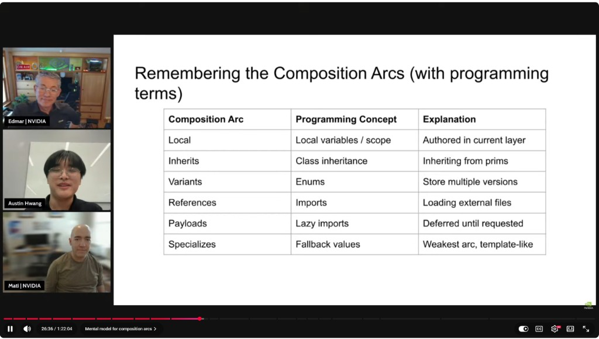](Pics/UnderstandingCompositionArcs/UCA1__2026-03-03_43_38.png)

*Relocates: change/move a prim path to a new path in the local namespace. Constraints: cannot relocate a root prim; after relocation the original path is no longer valid; cannot relocate to something that would create a namespace conflict.*

[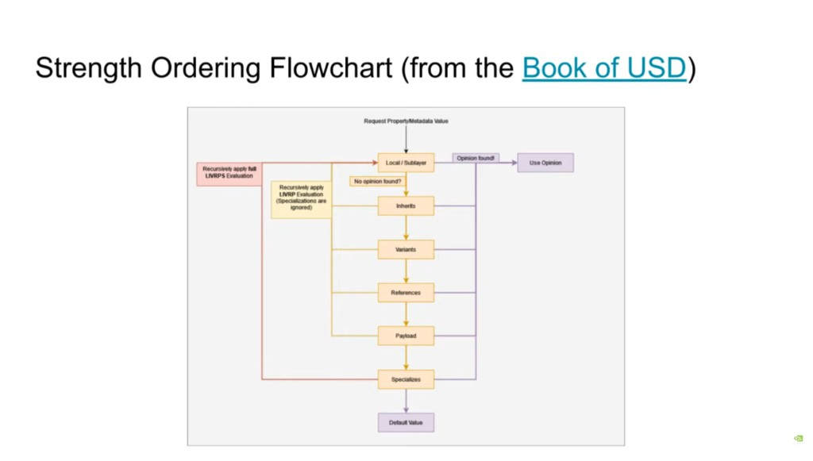](Pics/UnderstandingCompositionArcs/UCA1__2026-03-03_44_09.png)

*Remembering composition arcs with programming terms: Local = local variables/scope; Inherits = class inheritance; Variants = enums; References = imports; Payloads = lazy imports; Specializes = fallback values.*


*Strength Ordering Flowchart (LIVRPS): Request value → Local/Sublayer → Inherits → Variants → References → Payload → Specializes → Default. At each step: opinion found? Use it. No? Proceed to next. Relocates is not in this chain — it resolves paths, not property values.*

**The exam-style multi-file setup**

The video walks through a classic exam pattern: four USD files (`root.usda`, `shading.usda`, `ball.usda`, `asset.usda`) connected by sublayers, inherits, references, and variant sets. The slide asks: *Which composition arcs matter to root.usda?*

[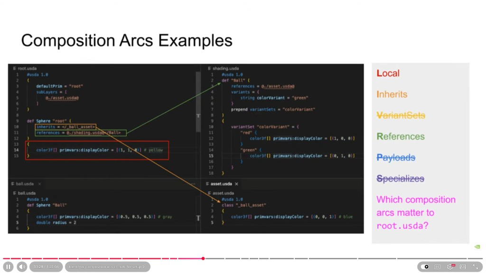](Pics/UnderstandingCompositionArcs/UCA1__2026-03-03_44_53.png)

*Four code panels show the structure: root sublayers asset.usda, inherits from ball_asset, references shading.usda’s Ball. Colored arrows highlight Local (red), Inherits (orange), References (green). The legend lists LIVRPS arcs.*

[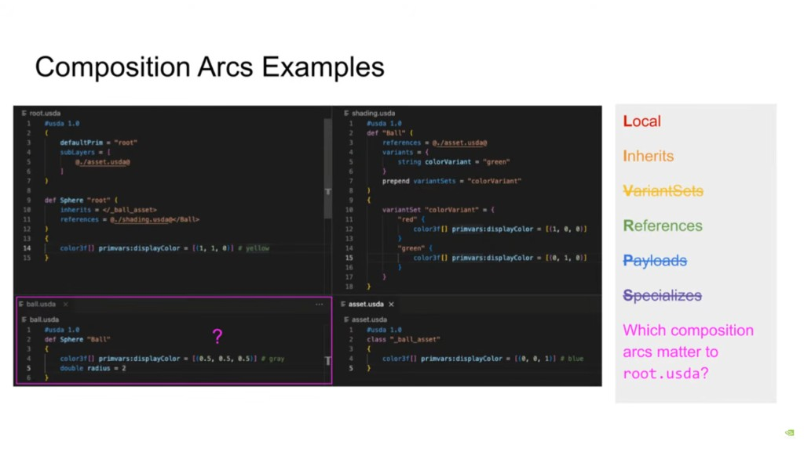](Pics/UnderstandingCompositionArcs/UCA1__2026-03-03_45_01.png)

*The same slide with ball.usda highlighted — a “spot the arc” moment. Root references shading.usda’s Ball, not ball.usda directly. ball.usda is a standalone sphere; shading.usda references asset.usda and adds a variant set.*

[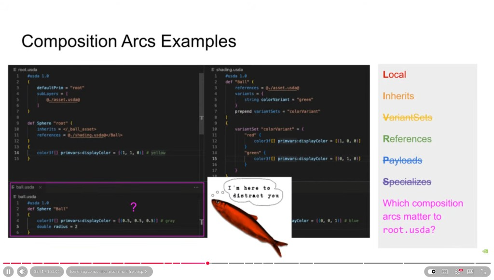](Pics/UnderstandingCompositionArcs/UCA1__2026-03-03_45_05.png)

*Local opinion wins: root.usda authors `primvars:displayColor = [(1, 1, 0)]` (yellow) directly on the prim. In LIVRPS, Local beats Inherits, Variants, References — so the composed result is yellow.*

**Resolving displayColor step-by-step**

Austin then demonstrates what happens when you remove the local opinion: the next-strongest arc (Inherits) wins.

[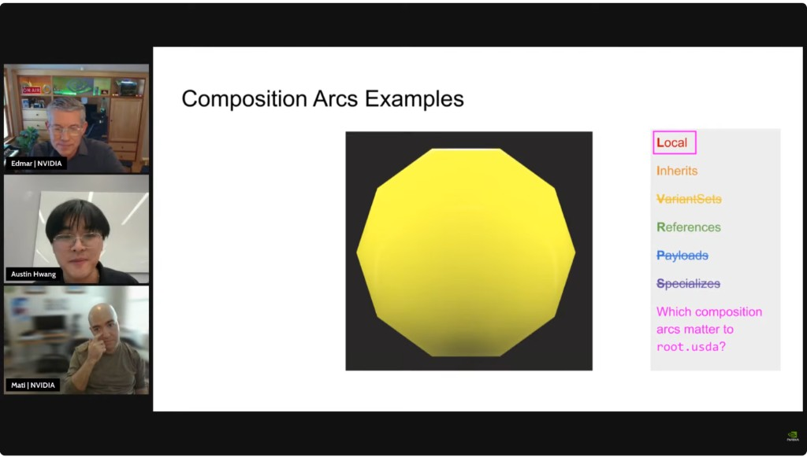](Pics/UnderstandingCompositionArcs/UCA1__2026-03-03_46_40.png)

*The slide highlights Local in the LIVRPS list — you’re tracing where displayColor comes from. With local authored, you stop here.*

[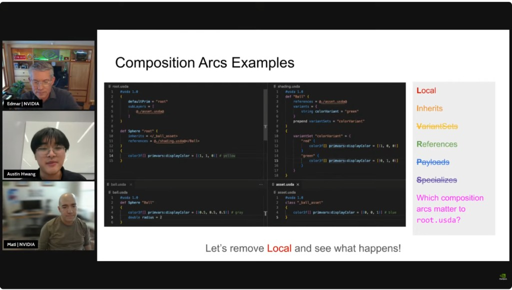](Pics/UnderstandingCompositionArcs/UCA1__2026-03-03_46_44.png)

*The 3D view shows the sphere rendered yellow — the local opinion from root.usda.*

[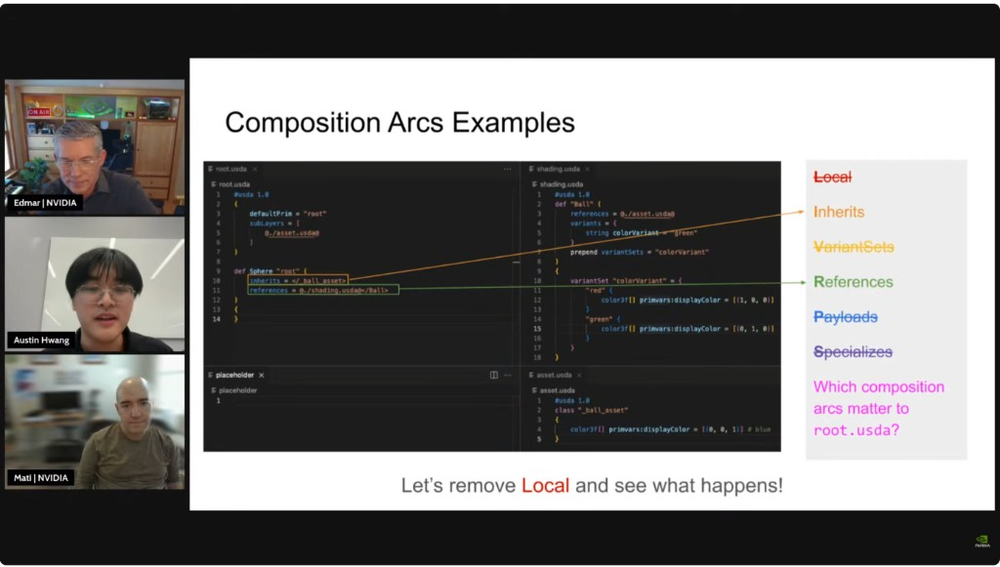](Pics/UnderstandingCompositionArcs/UCA1__2026-03-03_46_49.png)

*Remove the local displayColor from root.usda. Now no Local opinion; USD walks to Inherits. The class ball_asset in asset.usda has blue — that wins.*

[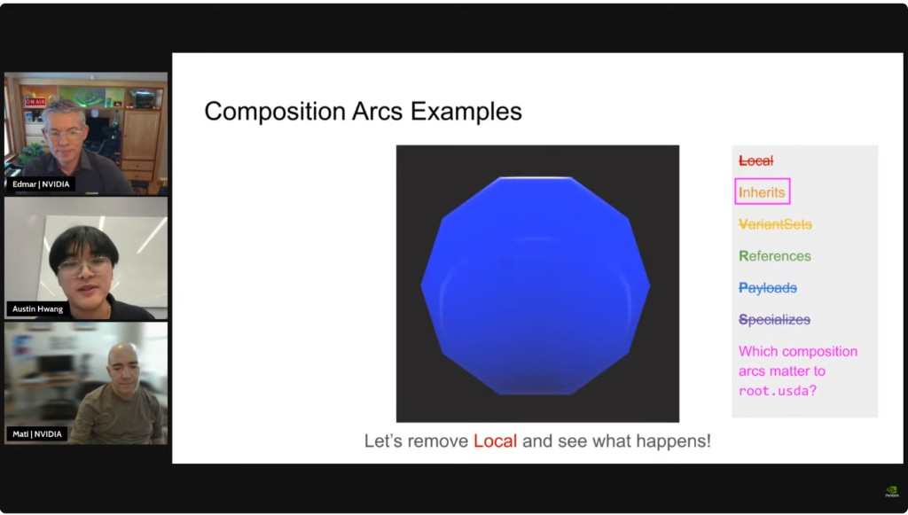](Pics/UnderstandingCompositionArcs/UCA1__2026-03-03_46_57.png)

*The sphere renders blue — proof that Inherits supplied the winning opinion.*

**The LIVERPS flowchart and exam-style questions**

[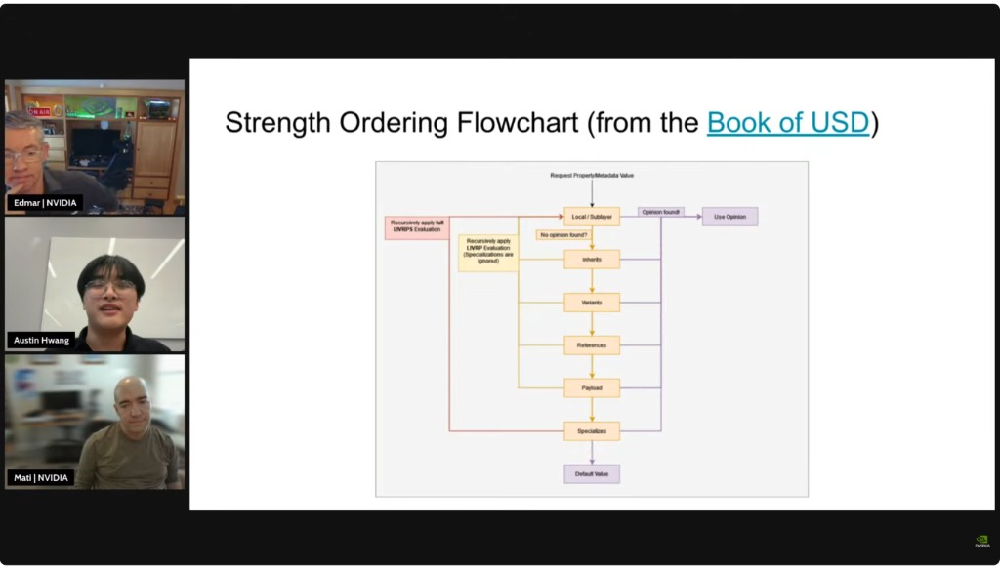](Pics/UnderstandingCompositionArcs/UCA1__2026-03-03_47_29.png)

*The Strength Ordering Flowchart from the Book of USD: Request value → Local/Sublayer → Inherits → Variants → References → Payload → Specializes → Default. At each step: opinion found? Use it. No? Proceed to next.*

[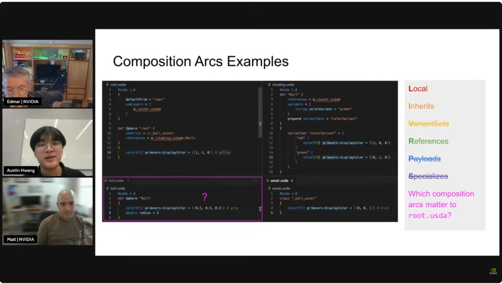](Pics/UnderstandingCompositionArcs/UCA1__2026-03-03_47_38.png)

*Exam-style question: given a composed stage, which value wins? The trace procedure is always the same.*

[](Pics/UnderstandingCompositionArcs/UCA1__2026-03-03_47_41.png)

*More trace questions — practice identifying arcs and walking LIVRPS.*

[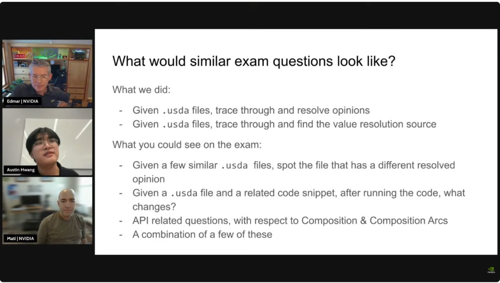](Pics/UnderstandingCompositionArcs/UCA1__2026-03-03_47_45.png)

*The mantra: find the opinion, find the source. That’s the skill the exam tests — and the one that saves you in production.*

**Why this matters for twins:** this is the difference between “we think QA overrode layout” and “we can prove exactly where the winning value came from.”

**Learn OpenUSD ->** [12 — LIVRPS](#link-12), [17 — Value resolution](#link-17)

### Code Breakout — The exam-style “4 files” setup (reconstructed)

The slides show a common exam pattern: **a small composed stage** built from several files, each adding opinions via different arcs.

Even if the exact filenames/paths differ in the exam, the *trace method* is the same. Below is a faithful reconstruction of the structure shown in the slide. Three files compose; the fourth (`ball.usda`) is an exam distractor not in the composition.

*Formatting note:* For readability in this Markdown setup, some **USDA snippets below use `py` fences** even though the content is USDA text.

#### `root.usda` (sublayers, inherits, references, local opinion)

```py
#usda 1.0
(
    defaultPrim = "root"
    sublayers = [
        @./asset.usda@
    ]
)

def Sphere "root" (
    inherits = </ball_asset>
    references = @./shading.usda@</Ball>
)
{
    color3f[] primvars:displayColor = [(1, 1, 0)]  # yellow — local wins
}
```

- **What’s going on**: `root.usda` **sublayers** `asset.usda`, **inherits** from `/ball_asset` (class in asset.usda), **references** `shading.usda`'s `/Ball` prim, and authors `primvars:displayColor` **locally** (yellow).
- **Why it works**: Local opinions are strongest (L in LIVRPS). The composed prim ends up yellow.
- **Arcs that matter to root**: Sublayers, Inherits, References, Local.

#### `ball.usda` (exam distractor — not in this composition)

```py
#usda 1.0

def Sphere "Ball"
{
    color3f[] primvars:displayColor = [(0.5, 0.5, 0.5)]  # gray
    double radius = 2
}
```

- **What’s going on**: This file is an exam-style distractor. It defines a standalone sphere but is **not referenced** by `root.usda` or `shading.usda` in this setup.
- **Why it appears**: Exam questions often include extra files and ask "which arcs contribute?" — here, `ball.usda` does not.

#### `shading.usda` (references asset, variant set)

```py
#usda 1.0

def "Ball" (
    references = @./asset.usda@</ball_asset>
    variants = {
        string colorVariant = "green"
    }
    prepend variantSets = "colorVariant"
)
{
    variantSet "colorVariant" = {
        "red" {
            color3f[] primvars:displayColor = [(1, 0, 0)]  # red
        }
        "green" {
            color3f[] primvars:displayColor = [(0, 1, 0)]  # green
        }
    }
}
```

- **What’s going on**: A **variant set** introduces a switchable opinion: green vs red.
- **Why this matters**: In LIVRPS, **V (Variants)** is stronger than **R (References)**. So if there were *no local opinion*, the selected variant could override the referenced value.
- **Why it still loses here**: **Local** beats **Variants**. So even if the variant selects green, the composed prim still ends up yellow (because `root.usda` authored it locally).

#### `asset.usda` (class definition — sublayered and referenced)

*Pedagogic note:* `asset.usda` enters the composition via two paths — **sublayered** into `root.usda` (so `/ball_asset` is available for inherits) and **referenced** from `shading.usda`'s `/Ball`. When tracing, ask: "Which path brought this opinion?" The inherits arc pulls from the sublayered class; the reference arc brings shading's variant set. Local on `root` wins over both.

```py
#usda 1.0
(
    defaultPrim = "ball_asset"
)

class "ball_asset"
{
    color3f[] primvars:displayColor = [(0, 0, 1)]  # blue
}
```

- **What’s going on**: The slide uses multiple small files so you can practice identifying arcs and tracing.
- **How exam questions use this**: “Which arcs do you see?” / “Which opinions matter to `root.usda`?”

### How to trace the answer (foolproof procedure)

When the question is “what value wins?” do this, in this order:

1. **Find the composed prim path** (here: `/root`).
2. **Check local opinions on that prim** in the strongest layer you’re evaluating.  
   - If you see a local authored value (here: yellow), you’re usually done.
3. If not, proceed through LIVRPS:
   - **Inherits** (class-like values)
   - **Variants** (selected value in a variant set)
   - **References** (opinions coming from referenced assets)
   - **Payloads** (same category as references, but load-controlled)
   - **Specializes** (template-like base values)

### Packaging Cell 3 Takeover — Why Chapter 5 is the “twin truth machine”

Packaging Cell 3 will constantly produce “this looks wrong” moments:

- A QA overlay shows **yellow** (WARN) but the line is actually running fine.
- Simulation says the gripper is in a safe position, but ops sees a collision risk.

If you can **trace the winning source**, you can answer:

- **Which team authored the winning opinion?**
- **Was it intended, or collateral override?**
- **Where should the fix live so it stays fixed next import?**

### Script Lab

Planned scripts (not yet committed):
- `composition_arcs/40_livrps_trace_solver.py`

---

<a id="chapter-6"></a>
## Chapter 6 — Exam Patterns and Common Misuse Traps

**Watch first:** [~40:01](https://www.youtube.com/watch?v=85gC4Vja5Uo&t=2401s)

At this point the session pivots to exam-readiness and practical anti-patterns. After Chapter 5, you have a trace method; now you learn what kinds of traps are designed to make you abandon it.

- Recognize question types.
- Avoid over-generalizing one arc for every scenario.
- Separate API syntax recall from conceptual trace reasoning.

[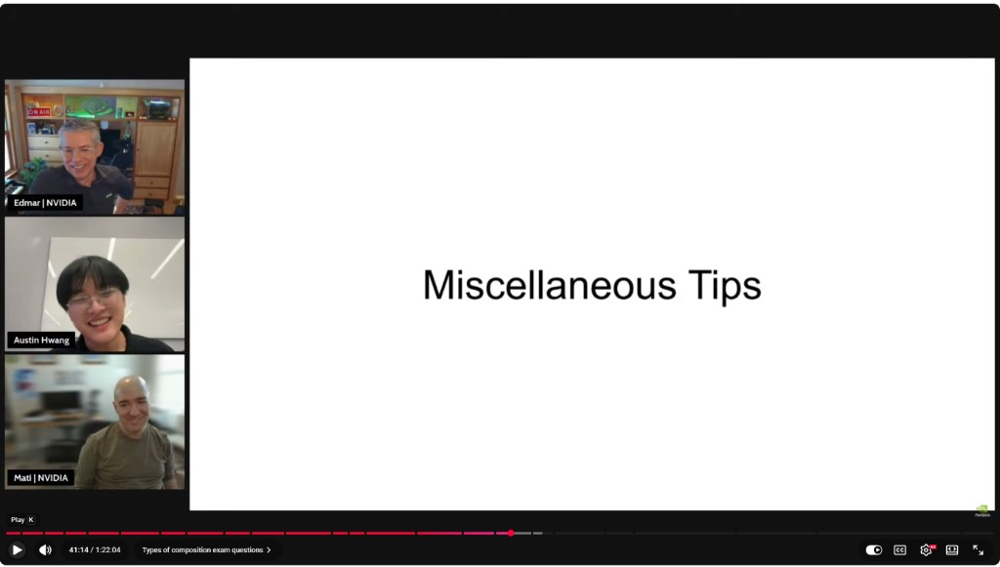](Pics/UnderstandingCompositionArcs/UCA1__2026-03-03_49_09.png)

*Slides on common misuse patterns: wrong arc for the job, overrides with no ownership discipline, variants used as hidden config. These are the traps that break production pipelines.*

[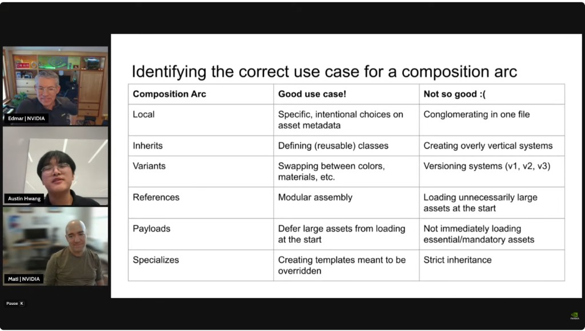](Pics/UnderstandingCompositionArcs/UCA1__2026-03-03_49_13.png)

*Nuances around variants, versioning, and payloads — when to use each, and how exam questions can trip you up.*

[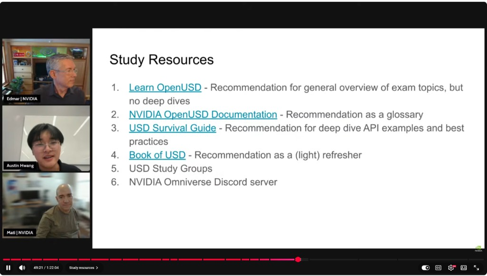](Pics/UnderstandingCompositionArcs/UCA1__2026-03-03_50_36.png)

*Study groups, Learn OpenUSD, and other resources. The session points to curated references for follow-through.*

**Learn OpenUSD ->** [14 — Certification page](#link-14), [15 — Pixar tutorials](#link-15)

### Packaging Cell 3 Takeover — Misuse patterns are the same patterns that break a plant

Every “common misuse pattern” slide translates directly to production pain:

- wrong arc for the job (sublayering assets instead of referencing)
- overrides with no ownership discipline
- variants used as “hidden config” instead of explicit choices

The certification is testing whether you can avoid these in the wild — because the wild is expensive.

### Script Lab

Planned scripts (not yet committed):
- `composition_arcs/50_exam_style_composition_quiz.py`

---

<a id="chapter-7"></a>
## Chapter 7 — Live Q&A Debugging Playbook (Production Lens)

**Watch first:** [~51:13](https://www.youtube.com/watch?v=85gC4Vja5Uo&t=3073s)

The Q&A section is gold for real work because it shows confusion points in the wild. After the structured “exam examples,” you get the messier, more realistic debugging mode.

- Debugging inherited opinions
- Clarifying “opinion” terminology
- Translating certification language into operational decisions

[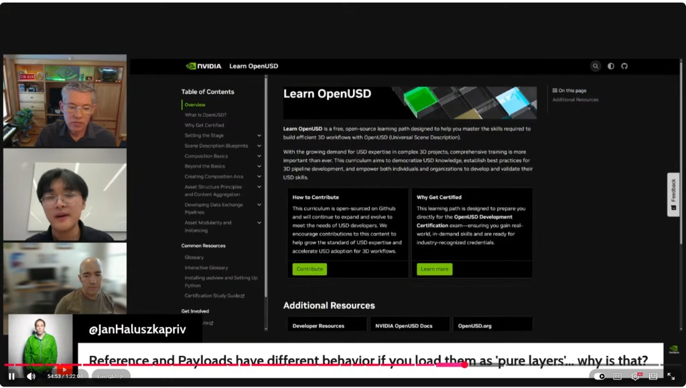](Pics/UnderstandingCompositionArcs/UCA1__2026-03-03_51_13.png)

*The structured session ends; live Q&A begins. Real questions from the chat surface confusion points that the slides didn’t cover.*

[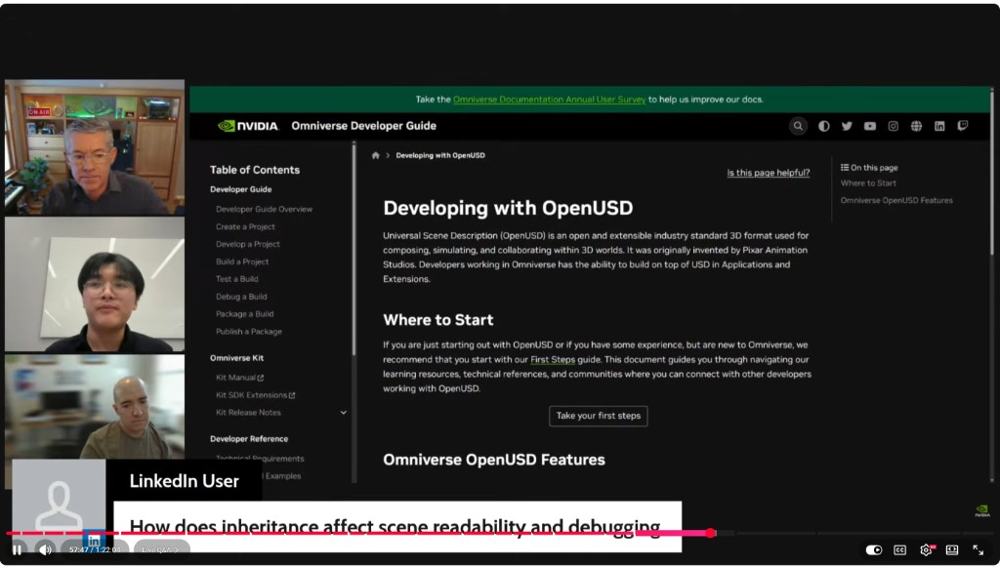](Pics/UnderstandingCompositionArcs/UCA1__2026-03-03_51_41.png)

*Discussion of Developing with OpenUSD — practical workflows and tooling beyond the exam.*

[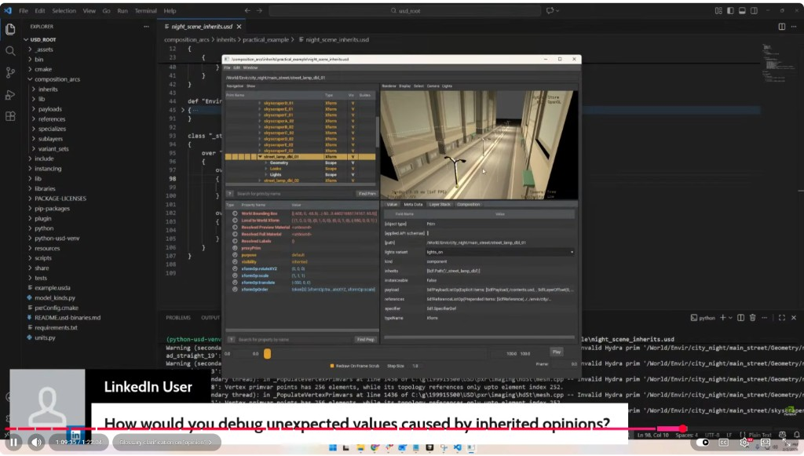](Pics/UnderstandingCompositionArcs/UCA1__2026-03-03_52_40.png)

*Austin demos debugging inherited opinions: VS Code with a USD file open, Omniverse Composer showing the prim browser and composition tab. The property inspector shows inherits, payload, references — the exact data you need to trace “where did this value come from?”*

[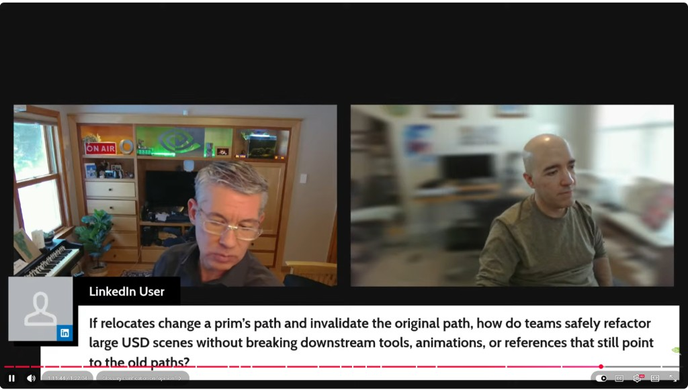](Pics/UnderstandingCompositionArcs/UCA1__2026-03-03_52_48.png)

*Relocates and path refactoring — when you move assets, how composition arcs update (or break).*

[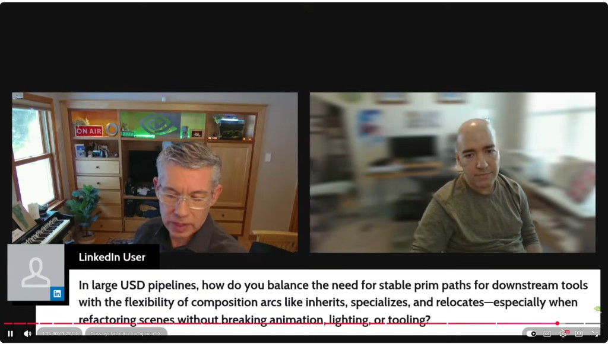](Pics/UnderstandingCompositionArcs/UCA1__2026-03-03_53_49.png)

*Back to the exam setup: local opinion in root.usda wins. The Q&A reinforces the trace procedure with live examples.*

For Packaging Cell 3, this chapter translates to one operating rule:

> Do not “fix composition by eyeballing.” Trace it. Record winning source. Document intent in layer structure.

**Learn OpenUSD ->** [16 — Asset structure](#link-16), [17 — Value resolution](#link-17)

### Code Breakout — Debugging inherited opinions (what to look for)

The screenshot shows a very real situation: you author what you *think* is valid USD, and the runtime gives you warnings or renders something unexpected.

When debugging inherited/stacked opinions, use this quick checklist:

1. **Confirm the prim path you’re looking at is the composed prim** (not the definition in a weaker layer).
2. **Confirm which layer is being edited** (session vs root vs a referenced layer).
3. **Reduce the question**: pick one attribute (e.g. `primvars:displayColor` or `xformOp:translate`) and trace just that.
4. **Validate the authored data shape**:
   - For `UsdGeomMesh`, do `points`, `faceVertexCounts`, and `faceVertexIndices` agree?
   - For primvars, does your interpolation match the value count?

In practice, most “mysterious composition bugs” are either:

- **A valid but unintended stronger opinion** (some layer is winning silently), or
- **An invalid data shape** that a renderer/tool tries to “soldier through,” producing warnings.

### Packaging Cell 3 Takeover — How to debug without breaking the pipeline

If Packaging Cell 3 is in commissioning, people will be tempted to “just override it until it looks right.”  
That’s how pipelines become unrepeatable.

Instead:

- **Trace** the winning opinion source.
- **Fix at the correct ownership layer** (or add a deliberate corrective layer with documented intent).
- **Verify the fix survives a clean recompose** (new session, new stage load, same result).

### Script Lab

Planned scripts (not yet committed):
- `composition_arcs/60_debug_playbook_checks.py`

---

## Operational Validation Checklist (Digital Twin + Composition)

- Stage contract is documented (units, axis, naming, root prim policy).
- Layer ownership is clear (layout/sim/QA cannot unknowingly clobber each other).
- Arc choice is intentional (`reference`/`payload`/`specializes`/`inherits`/`variants`).
- Payload strategy is tested under real scene weight.
- LIVRPS trace is reproducible for critical attributes (color, transform, material, purpose).
- Team can explain “winning opinion source” without guesswork.

---

## Quality Assessment Against Existing 3 Deep Dives

Compared against:

- `Building an OpenUSD Pipeline With Data Modeling__VIDEO_DEEP_DIVE_TUTORIAL.md`
- `Customizing_OpenUSD_for_Your_Pipeline__VIDEO_DEEP_DIVE_TUTORIAL.md`
- `Rendering and Visualizing OpenUSD Scenes__VIDEO_DEEP_DIVE_TUTORIAL.md`

### Pass criteria check

- **Narrative spine:** present (`Packaging Cell 3`) and continuous through chapters.
- **Chapter bridge intros:** present in every chapter with explicit handoff logic.
- **Video jump usability:** chapter-level timestamps included.
- **Visual grounding:** 25 key screenshots mapped and embedded.
- **Certification alignment:** chapter outcomes and exam framing included.
- **Digital-twin translation:** each arc mapped to operational behavior.
- **Resource quality:** Learn OpenUSD + Pixar + Awesome OpenUSD coverage included.
- **Template compliance:** high; script labs included as planned placeholders (not fake links).

Residual gap:
- Companion runnable script pack is not yet committed (explicitly marked planned to avoid false promises).

---

## Links

<a id="link-1"></a>
1. **YouTube Session** — https://www.youtube.com/watch?v=85gC4Vja5Uo&t=12s

<a id="link-2"></a>
2. **Learn OpenUSD Curriculum** — https://docs.nvidia.com/learn-openusd/latest/index.html

<a id="link-3"></a>
3. **usdview + Python Setup** — https://docs.nvidia.com/learn-openusd/latest/usdview-install-instructions.html

<a id="link-4"></a>
4. **Learn OpenUSD Glossary** — https://docs.nvidia.com/learn-openusd/latest/glossary.html

<a id="link-5"></a>
5. **Learn OpenUSD — Composition Fundamentals** — https://docs.nvidia.com/learn-openusd/latest/creating-composition-arcs/index.html

<a id="link-6"></a>
6. **Learn OpenUSD — Layers and Sublayers** — https://docs.nvidia.com/learn-openusd/latest/creating-composition-arcs/sublayers/index.html

<a id="link-7"></a>
7. **Learn OpenUSD — Inherits** — https://docs.nvidia.com/learn-openusd/latest/creating-composition-arcs/inherits/index.html

<a id="link-8"></a>
8. **Learn OpenUSD — Variant Sets** — https://docs.nvidia.com/learn-openusd/latest/creating-composition-arcs/variant-sets/index.html

<a id="link-9"></a>
9. **Learn OpenUSD — References** — https://docs.nvidia.com/learn-openusd/latest/creating-composition-arcs/references/index.html

<a id="link-10"></a>
10. **Learn OpenUSD — Payloads** — https://docs.nvidia.com/learn-openusd/latest/creating-composition-arcs/payloads/index.html

<a id="link-11"></a>
11. **Learn OpenUSD — Specializes** — https://docs.nvidia.com/learn-openusd/latest/creating-composition-arcs/specializes/index.html

<a id="link-12"></a>
12. **Learn OpenUSD — LIVRPS and Strength Ordering** — https://docs.nvidia.com/learn-openusd/latest/composition-basics/livrps-liverps.html

<a id="link-13"></a>
13. **OpenUSD API — UsdStage** — https://openusd.org/release/api/class_usd_stage.html

<a id="link-14"></a>
14. **OpenUSD Development Certification (NCP-OUSD)** — https://nvidia.com/en-gb/learn/certification/openusd-development-professional

<a id="link-15"></a>
15. **Pixar USD Tutorials** — https://openusd.org/release/tut_usd_tutorials.html

<a id="link-16"></a>
16. **Learn OpenUSD — Asset Structure** — https://docs.nvidia.com/learn-openusd/latest/asset-structure/index.html

<a id="link-17"></a>
17. **Learn OpenUSD — Value Resolution** — https://docs.nvidia.com/learn-openusd/latest/beyond-basics/value-resolution.html

<a id="link-18"></a>
18. **OpenUSD FAQ** — https://openusd.org/release/usdfaq.html

<a id="link-19"></a>
19. **Awesome OpenUSD (curated ecosystem index)** — https://github.com/matiascodesal/awesome-openusd

<a id="link-20"></a>
20. **Exam registration (Certiverse checkout)** — https://www.certiverse.com/#/checkout/nvidia/store-exam/NCP-OUSD

<a id="link-21"></a>
21. **Official study guide (PDF)** — https://nvdam.widen.net/s/6kxsqcsrrw/ncp-openusd-development-study-guide

<a id="link-22"></a>
22. **Why OpenUSD Developer Certification matters** — https://docs.nvidia.com/learn-openusd/latest/why-openusd-developer-certification.html

**Most important wrap-up:** keep [19 — Awesome OpenUSD](#link-19) and [2 — Learn OpenUSD curriculum](#link-2) open while studying or implementing.

---

## Appendix — Key Moments Index (UCA1 Screenshot-to-Transcript Mapping)

Screenshots aligned to transcript by video timestamp (red timeline + bottom-left time). Use these to jump from transcript to the corresponding visual moment.

| Video time | Screenshot | Transcript line | Context |
|------------|------------|-----------------|---------|
| `11:21` | `UCA1__2026-03-03_40_55.png` | ~1119 | Layers intro |
| `13:26` | `UCA1__2026-03-03_42_22.png` | ~1158 | Team layers advice |
| `13:32` | `UCA1__2026-03-03_42_27.png` | ~1160 | Lighting/shading/animation teams |
| `33:28` | `UCA1__2026-03-03_44_53.png` | ~1549 | Exam-style 4 files setup |
| `33:32` | `UCA1__2026-03-03_45_01.png` | ~1532 | Composition arcs in root.usda |
| `33:39` | `UCA1__2026-03-03_45_05.png` | ~1532 | Local opinion wins |
| `37:16` | `UCA1__2026-03-03_46_40.png` | ~1603 | Resolving displayColor step-by-step |
| `37:27` | `UCA1__2026-03-03_46_44.png` | ~1605 | Local yellow rendered |
| `37:32` | `UCA1__2026-03-03_46_49.png` | ~1607 | Remove local, inherits wins |
| `37:52` | `UCA1__2026-03-03_46_57.png` | ~1613 | Blue from inherits rendered |
| `38:58` | `UCA1__2026-03-03_47_29.png` | ~1635 | LIVERPS diagram walkthrough |
| `39:16` | `UCA1__2026-03-03_47_38.png` | ~1641 | Exam question example |
| `39:28` | `UCA1__2026-03-03_47_41.png` | ~1645 | USD trace exam questions |
| `39:35` | `UCA1__2026-03-03_47_45.png` | ~1647 | Find opinion, find source |
| `41:15` | `UCA1__2026-03-03_49_09.png` | ~1680 | Common misuse patterns |
| `41:23` | `UCA1__2026-03-03_49_13.png` | ~1683 | Variants, versioning, payloads |
| `49:22` | `UCA1__2026-03-03_50_36.png` | ~1830 | Study groups, resources |
| `51:13` | `UCA1__2026-03-03_51_13.png` | ~3073 | Live Q&A starts |
| `57:48` | `UCA1__2026-03-03_51_41.png` | ~1989 | Developing with OpenUSD |
| `1:09:32` | `UCA1__2026-03-03_52_40.png` | ~2215 | Debugging inherited opinions |
| `1:11:52` | `UCA1__2026-03-03_52_48.png` | ~2261 | Relocates, path refactoring |
| `1:15:24` | `UCA1__2026-03-03_53_49.png` | ~2327 | Local opinion wins (root.usda) |

*Note: UCA1 screenshots in the range 33:32–41:23 may lack visible red timeline; alignment relies on content and user-provided mapping. Copy `UCA1__2026-03-03_*.png` into `Pics/UnderstandingCompositionArcs/` for links to resolve.*

---

## Appendix — Full Transcript (Verbatim)

Verbatim transcript file:

- `Understanding Composition Arcs__VIDEO_DEEP_DIVE_TRANSCRIPT.txt`

This file was extracted from available YouTube subtitle track and kept as-is (including duplicate overlapping auto-caption lines).

---

### Transcript


our first
0:43
presenter, no stranger to the community, Austin. Austin, thank you so much for for jumping in. Um, really excited to
0:50
have you here. Austin's going to introduce himself in a second. We also have Maddie here from the Nvidia team. Hey, Maddie.
0:55
Hello. So Maddie, this is this is so this this the this series will actually be a playlist on YouTube. So it'll be an
1:01
evergreen resource for people. This first week, Austin is going to go into the topic he's covering, but let's talk
1:06
a little bit about what OpenUSD certification actually is. Um for for anyone who might not be familiar.
What is the OpenUSD Certification?
1:14
Yeah. So go ahead, Austin. Oh, thanks Maddie. Yeah. Hey, everyone. I'm Austin. Um this is the first of many
1:22
um exam reviews um where we're going to go over open USD development and the
1:28
professional certification exam. And uh if you're unfamiliar, USD is the universal language for building 3D
1:35
worlds. And this certification will help you um show to employers and people out
1:40
there that you are familiar with this um material. It's very exciting and and for those uh
1:48
uh if you happen to be watching this live or before GTC 2026, we will be offering free certification exams at
1:54
upcoming GTC206 in March in San Jose. Um typically we always offer certification
2:00
exams for OpenUSD at a GTC. So if there's one coming up, you'll be you'll be sure to have an opportunity to take
2:05
the exam there. But luckily for this one, we're actually able to wave the costs um and um and that will make
2:12
things a little little easier. And um we also have study groups that you can use to complement these live stream series.
2:17
So those we have a weekly study group actually a few of them that meet. Uh I see Yan in in our chat. He's one of the
2:23
participants in our open USC study group. Austin is also that's another great resource you can use in addition
2:29
to the learning path for open USD which is a free self-paced uh learning course open source actually um as well as this
2:36
live stream series. Um so very excited to to kick things off with Austin here and this series is going to cover about
2:43
six different uh sessions. Uh we're going to do one every week. Uh it's
2:48
going to cover eight different exam domains uh and with live Q&A of course.
2:54
Um again uh we highly encourage people to uh participate in the study groups to take it a step further.
Exam structure and candidate profile
3:01
And today we're going to cover we thought it would be actually Maddie you planned actually the outline of of of
3:06
the topics here. What was the reason for starting off with composition arcs?
3:12
Yeah. So um just I wanted just a little bit more about the certification. So um
3:18
the certification uh is uh valid once you've passed it's valid for two years. So another great thing is um taking
3:25
advantage of of GTC and other events like that to certify in person is also uh a really good opportunity. But
3:30
obviously it's it's brand new so uh not anything to worry about for a lot of people. But uh with this initiative we
3:36
really want to encourage people to come out together and and and take take advantage of this uh free offering. um
3:45
uh try is you know if if you study and and and and work at it I'm I'm sure you can you can pass at the event and if if
3:52
you don't have time to prepare but you'll be there um try it out and and just check out the exam and see what
3:57
it's like so that you can be prepared when uh know know how to prepare for for when you're when you're ready.
4:03
No risk. What do we say? Free to fail. It's free to fail at [laughter] 2026. It is it is a tough test. We'll we'll say
4:09
that right out of the bat, right? It is a chilling test. So you do have the reason why we're doing this live stream series is to give pe people as much
4:14
information as they can and prepare them the best. Uh but again there are three great resources the learning path for
4:20
open USD which we will put uh in the chat the study groups that happen on our discord server and those are managed by
4:25
community members like Austin and then obviously this live stream series. So I think everyone who who wants to pass
4:31
will have all the tools available to do that. Um about the topics um week one we're
Why start with composition arcs
4:38
starting out with composition marks. Uh if you look at the study guide for the certification, you'll see that every
4:43
week we're covering a topic that's uh on the certification. These are buckets of of things uh that we're tasks that uh uh
4:52
open USD developer are expected to do on the job. And so we bucket these into these different topics. And composition
4:59
arcs uh is one of the most powerful features in OpenUSD. Uh it's there's a
5:05
lot to talk about there. And so we wanted to make sure to cover that first. uh and uh today with Austin who um has
5:11
had a lot of time to uh work with this. Yeah, thank you everyone. Um I don't
5:17
know if you all already said it earlier, but about the GC certification exams. Um
5:22
I'm pretty sure we'll have a certification at every GTC that appears or that comes up, not just 26 or the one
5:30
that's happening in a month. Just wanted to say that. Yeah. But let's let's get started.
5:38
Um yeah so this certification is for you um with uh two primary uh
5:44
pre-qualifications you definitely want some programming experience and you also want open UXC experience for sure and um
5:52
so some candidate audiences would be open USC developer data engineer etc people that work with USD and built
5:59
these pipelines uh it's definitely this certification would definitely be for you um it is two hours long and There
6:07
are about 60 to 70 multiple choice questions. I think I had uh about 70. And there are definitely going to be a
6:14
lot of references to things like the OpenUSD API as well as um just looking at USD files in general and going
6:20
through and um understanding that. Yeah.
Composition exam breakdown
6:26
Yep. Uh so about me. Oh yeah, M there to uh the candidate audiences. uh
6:34
these are people that uh we the type of roles that we're targeting for for the
6:40
uh the open USD developer is is what we consider but um these are people that are data engineers, pipeline engineers,
6:47
they're uh they're the backbone of of any any sort of workflows whether it's
6:52
um physical AI or machine learning. They're moving data in and out of different applications, cleaning it up,
6:57
preparing it uh for different uh purposes. Um so if that sounds
7:02
interesting to you or that's the kind of work that you're already doing this this is uh great for for you and also if your
7:09
team is missing that kind of person uh which is what we're finding a lot um this is the kind of role that you kind
7:15
of want to explore is as the data engineer pipeline engineer and now with physical AI it's the open developer
7:21
specifically. Yeah, thank you, Maddie. Uh, about me and like why you shouldn't
7:28
listen to me about uh going over composition today. Uh, I passed the beta open USD certification exam in July, so
7:35
about six or seven months ago. And um that that was the first one that came
7:42
out and uh I've been working with this USD and Nvidia Omniverse at large since
7:48
2024. So about two years of working with it. I've contributed to some open source USD code samples repos and I'm a NVIDIA
7:56
Omniverse ambassador. So I want everyone to leave with the following takeaways. One like ideas on
8:02
how to prepare for the exam for compet composition specifically other than just reviewing tutorials and documentation
8:08
online as well as like an understanding of how composition questions are framed on the exam. So you'll have more of an
8:14
idea of what you're going to be seeing before you go go in. Whether this is your first or uh or you haven't taken
8:22
your first one or you're going to retake. Um I think this resource will be quite valuable for you. And today we'll
8:29
go over some like basics on composition arcs, but I'm assuming that you already have had some exposure to it and have
8:36
been working with USD prior to watching this. We'll go through a liver piece trace. um essentially looking through uh
8:43
strength ordering and if you had a sample USD project for instance like how
8:48
would you able to resolve uh opinions and then we're also going to talk about
8:54
um other composition related questions that you would be finding on the exam
9:00
and as a quick refresher just like like what is composition what are composition arcs and some of these acronyms I've
What is composition and what are opinions?
9:06
been mentioning um composition is the process of assembling USD layers into a
9:12
single stage. The composition arcs are the operators that describe how to assemble these layers. And liverps is an
9:19
acronym describing the order of operations for how composition arcs um
9:24
will resolve opin uh resolve values for opinions. Opinions are elements that participate
9:30
in value resolution. And the value resolution source is the layer where an
9:35
value of an opinion originates at some given layer. And if uh these are kind of abstract right now, don't worry. We'll
9:42
get into that and what each of these means later and through our example.
9:48
Uh is there anything else that you think is important to mention as like some definitions, Maddie?
9:55
Uh no, I think I think those are those are the ones that are tricky and and unique to to USC.
10:01
Awesome. Great. Um yeah, so an exam breakdown for
10:07
composition. If you all haven't already seen the the study guide that's available online, there's a there's a
10:13
link in the slideshow that I will be sharing after the fact, but um this is
10:19
the breakdown of composition on the exam. It's about 23% of the actual exam.
10:24
And they basically just want you to be able to um work with composition arcs
10:30
and know how they work. and when you would want to use each of them. Uh there
10:35
are some like chapters of sorts in here like some things that you should know. Uh for example, 1.1 in that that image
10:43
there is change the strength of an opinion. Um that's something you would want to know when it comes to
10:48
composition and when you're working with USD in general. And that list is not exhaustive. There are definitely a lot
10:54
more things that uh pertain to composition. This is just like a a subset of knowledge that you would need
11:01
to know. And you could break down each of those chapters into I would say like four
11:07
different subcategories. You have your composition arcs, uh strength ordering and strength ordering tracing. Uh API
11:15
knowledge relating to composition and then also like practitioner knowledge like when when would you want to use
11:21

[](Pics/UnderstandingCompositionArcs/UCA1__2026-03-03_40_55.png)

this in the industry or like what are some workflows that would help teams collaborate while using composition?
11:28
Yeah. Yeah. Um I can add a little bit of to background to to those tasks. Um those
11:34
are so when we developed the certification uh we worked with subject matter experts from a number of
11:40
different companies and and industries to uh verify that you know the things that we were looking for in this type of
11:47
role were things that they agreed with. And so one of the things that we did is we uh wrote out these these tasks for
11:53
what we thought somebody a USD developer should be able to do. And these are just some of the ones that that we uh came up
11:59
with. And so that's what drove uh all of uh this exam. So it is it is tough but
12:06
this is the kind of thing that uh everybody agreed on uh needed to be uh taught and and people needed to know to
12:14
do the job. Yeah. Thank you, Maddie.
12:19
Uh let's get into uh composition arcs. Uh so we're starting with layers. Um,
Layers and sublayers
12:26
layers is something that you might think is L and liver P's, but it's more of a
12:31
foundational thing within USD. I like to think of it as a USD file on disk. That's not entirely correct. You can
12:37
definitely have it in memory, but to me, when I think of a layer, I think of a USDA file with all of the USD elements
12:46
and data defined, metadata, attributes, whatnot. And we also have sub layers, which is just a bunch of layers within a
12:53
layer, and they're ordered by strength. So, I imagine that uh when you're
12:59
watching this, you already kind of have an idea of what all of these words mean. So, I'm just going to add some additional notes that um pertain to what
13:07
I found to be um useful information to know on the exam and things that I
13:13
actively use during the exam to uh help me come up with answers to questions.
13:19
So um some practitioner knowledge practitioner knowledge you might want to know for layers is that um the general
13:26

[](Pics/UnderstandingCompositionArcs/UCA1__2026-03-03_42_22.png)

like advice is that uh diff if you have a team of people working in in a USD
13:32

[](Pics/UnderstandingCompositionArcs/UCA1__2026-03-03_42_27.png)

project say you have a lighting team a shading team animation team you would want all of them to work in their own
13:38
layer and then you can easily compose them uh via USD and that's one of the
13:43
most powerful things when it comes to composition and composition arcs um in each of these slides. I'll also have
13:49
like a API example. I sourced these from the USD code samples repo that uh Maddie
13:55
had put together. And yeah, uh oh, something else to know is that when you add a sub layer into a
14:02
layer, it brings all of its contents over. So no remappings or anything. Uh
14:07
that that data straight to you. But you also have to um keep in mind that layers
14:13
are ordered by strength. So maybe a an opinion that you have for a certain prim
14:19
at a stronger layer would override an opinion at a lower layer.
14:28
Um going on to inherits. Uh inherits is basically a broadcast
Inherits explained
14:33
operator for overrides. uh if you want like a more uh structured definition, I
14:40
would think of it in terms of programming like uh has a lot of similarities to class inheritance. So
14:46
when you when you have a class in programming, you can like inherit its attributes, methods and whatnot. In USD,
14:52
it's similar. you're going to bring in that those attributes and data that you have on a class prim and you can use
15:01
inheritance to bring that data in. And uh yeah, so if you let's say we had
15:10
a spear prim and we made it inherit another like spear prim with some colors
15:18
and like a radius attribute on it. those opinions from the class frame will
15:25
override any other opinion that you have on that on what you're overriding. I
15:31
mean yeah besides for uh local opinions on there. So
15:37
uh there is a example from the API on there on the on
15:42
the slide in the bottom left. Uh basically what's happening there is we're creating a class prim and we have
15:49
a a mesh prim called fu. We're going to get the inherits of that foo prim and
15:58
add the class prim to that inherits list. And that way you're able to
16:03
programmatically assign uh inheritance to your USD prims.
16:10
Uh something else to note is that instanceable prims can't have local opinions on them. So if you inherit
16:17
um some data from a class prim, those values will always be authored on the prim.
16:24
Yep. I uh I will say I don't like the object-oriented programming inheritance
16:31
uh analogy only because maybe uh if you take it too far, it starts to get tricky. Um so uh
16:39
inherit in this case so if you think about object-oriented programming um you have a class variable uh the the base
16:46
class can define it and give it a default value say 10 you have uh fu equals 10 um then later on another class
16:54
inherits it and says um actually I want fu to be five. Um if then you went back
17:02
into your base class uh and you said actually I want the default now to be 11
17:08
any of those subass the subclass would ignore it right they would say oh no my
17:14
five is more important um and that's the that's the uh slight difference there
17:19
with with inherits and in open USD uh when we look at specializes you'll see that as confusing as it is uh
17:27
specializes is a better uh inherit inheritance in object-oriented
17:32
programming is a better analogy for specializes. Yeah, thank you Maddie for that.
17:41
Uh I also get very confused with inherits and specializes as well. So going through making these slides was
Variants and variant sets
17:47
also very much a uh a learning opportunity for me to get a better understanding of these and I just
17:53
learned something here. So it's tricky, but uh it's more niche at least. Uh so it doesn't doesn't come up
17:59
as often. Oh yeah. Uh on to variance and variance sets. So a variant is a single variation
18:06
of a variant set. That's a lot of variance in a single sentence. Uh a variance set is a package of discrete
18:13
alternatives that um you can select from on a on a prim. I'm realizing right now
18:20
I probably should have added some uh examples of what these looks like rather than just the API definitions, but we'll
18:26
get to and we'll get to that in the example later on. Um yeah, so you're
18:31
able you you define a variance set which is essentially like an enum of different
18:36
things that uh you could say are like alternatives
18:42
of one asset. So, for example, if I have a if I have a spear and I want to select
18:50
between a bunch of different colors on that spear, a variant set would be a perfect thing for that. And just because
18:57
a variant exa a variant set exists doesn't mean that a variant has to be selected. Uh that's that's one thing
19:03
that helped me a lot on the exam. I think there was a question uh very similar to like
19:10
uh like do you necessarily need to have one and if so like uh what would look
19:16
like if you didn't have a variant even though there is some varian set
19:24
uh references so references and payloads they often get confused they confuse me
19:30
as well but uh something I want to acknowledge here is that um references
19:36
allow you to pull in prims from other layers that exist in your project and
19:41
allows for reuse and instances by and instancing by pulling data from
19:46
somewhere else. So, um, for example, if,
References vs payloads
19:52
uh, if we have a, I don't know, a tree asset defined in a different file, you're able to reference
19:58
that and whichever one that you're working in right now. Um, generally, you
20:04
want to use references for uh, lighter data that aren't necessarily like
20:10
resource intensive, has a lot of like geometry and meshes and uh, rendering
20:15
stuff associated with it. That's something that payloads would be good with. Um,
20:22
yeah. Uh, some some other things to know is that you can use references for time offsetting. Uh, if you're familiar with
20:30
the SDF API, it allows you to do like time offsets on references and layers.
20:37
And, uh, encapsulation is also important here. We'll talk more about that later and probably in some of the future
20:44
streams. Uh not the composition one, but in future ones will definitely be important.
20:50
Yep. Yeah. Did you want to add something here, Maddie? No, no. Yeah, we can definitely cover
20:55
that in the content aggregation. Yep. Yep. Uh payloads. I already talked a little
21:01
bit about that but in the previous slide but essentially you're you're still in a
21:08
way referencing things but you can defer that uh loading from happening when you
21:14
load up a stage. So you can selectively choose at runtime whether you would want
21:20
to load in these assets. And so they're perfect for uh when you have heavy
21:26
assets with a lot of geometry and uh rendering stuff associated with it because uh maybe for instance you want
21:33
to pull up your scene quite bare and then only selectively pull things in because um loading all of that at once
21:41
is kind of a mess. Um
21:46
yep. And a lot of the things that apply to references also apply to payloads.
21:53
Yeah, as we were preparing for preparing the exam, one thing one question that came up that I thought was interesting
21:58
is if you could have only one uh one composition arc, which which
22:04
would it be? Um, and the the answer uh that that we all kind of finally agreed
22:11
on is is payloads. Um, there are scenes that are so big that uh without
22:16
payloads, you wouldn't be able to load them. Sub payloads allow you to uh pick and choose which parts of the scene you want you want to choose. Um so we
22:22
thought that that was if I if I could only have one that's the one that I could never do without.
22:27
Is it your favorite one, Maddie? No, I chose I chose a different one, but they the rest of the experts convinced
22:34
me that that payloads was good. Oh man. [laughter] Uh on to specializes. Um it is almost
Specializes
22:42
like uh the counterpart to inherits. Uh as Maddie said earlier, probably the
22:47
object-oriented analogy is better for this. Um I often use specializes when I
22:53
want to apply a base set of values or temp or like a template of sorts on many prims and then uh we can override that
23:00
by using literally any other composition arc. Um, I think this one people often
23:08
get mixed up with inherits, definitely me included, but um, it is probably also
23:14
one of the more commonly seen ones, especially um, when you're not applying, uh, many
23:21
composition arcs on top of things that has specializes associated with it.
23:29
Yeah, a lot of people in the comments actually brought up uh relocates and how
23:35
liver piece libr uh had a e added in. Um yeah, there is a
23:42
new composition arc or well newish called relocates and you can uh relocate
23:49
prim paths to a new to a new path. I don't have a API example for this because I wasn't too sure on if this
23:56
would be appearing in the um in newer exams. I don't believe it was in my beta
24:02
one. Yeah. Yeah. But Maddie, do you have something to say about that? Yeah. Yeah. So, um the exam will be
24:09
updated uh periodically and we will be uh adding uh questions about new
24:15
features in in USD. Um this relocates existed when we when we worked on the exam. we just didn't feel like it was
24:22
used enough to really start testing people on it. So, um we will be adding it. Um we would also love help uh
24:32
teaching it. So, if if you have any ideas about how to teach uh a relocate so you can uh contribute to learn
24:38
OpenUSD and and and help us with that. Um but we we do want to try to have uh
24:45
curriculum for everything that shows up on on the exam. Yeah. A great thing about um Nvidia's
24:52
OpenUSD resources is that a lot of them are open source and that anyone in the community can contribute. Uh myself or I
25:00
did so maybe a year or two back when I first started learning as kind of a exercise to get familiar with USD. I
25:07
definitely recommend doing so. It's very easy. The Nvidia makes it easy and the
25:13
folks that uh will review your work are also very helpful when it comes to um
25:19
revising and teaching you new things in the process. Mattie was that person for me. So very
25:25
grateful to him. Yeah. Uh I Yeah. One of the things that makes me most happy is is getting
25:31
contributions like that. uh not because it makes my life easier, but uh [laughter] because uh it's it's just exciting to
25:37
see people uh learning and also teaching uh and giving back uh what they what they've learned.
25:43
[snorts] Yeah. Oh, well, something to say off that is um I think one of the best
25:49
things about the OpenUSD and Omniverse community is how people give back. Like for example, Liuchi AI's uh work is
25:58
something that is grown by the community and also uh many people use for learning
26:03
things or tools like Omniverse, IsaacM, Isaac Lab and yeah, Nvidia is able to
26:09
create that um community that allows us to contribute and share and learn
26:15
together and oh and things like these or these uh presentations that we can uh
26:22
host by community and members for community members. It's It's all very great. Yep.
26:29
Yeah. Um uh now now thinking about this maybe uh
Mental model for composition arcs
26:34
this was a little uh jump in the jump in the dark, but this is kind of how I um
26:40
associate or how I mentally frame composition arcs. Maybe this needs a
26:45
little bit of uh fine-tuning before um I release the slide deck, but
26:52
a lot of the different composition arcs have um
26:58
similarities to programming. Like for example, the local composition arc L um
27:04
you're only really working that within a current layer. So you can kind of say that it is a local variable or scope.
27:11
Um, variants are like enums. References are like imports where you bring things in from other files. Payloads are uh
27:19
lazily loaded ones. And um, specializes are like fallback values in programming
27:26
where you don't necessarily have um, the information that you uh, need right now.
27:32
So, you're going to use this as a default. Uh I took this from the book of USD, one
27:38
of the an amazing online resource that is free to access for anyone. Um as kind
27:45
of a mental model of how uh I would um
LIVRPS strength ordering walkthrough
27:51
tackle liver's style questions on the exam. Um you would start from the top
27:57
here in the orange like uh do we see like a local or sub uh sub layer arc? If
28:03
so, then that will probably be the opinion um or the val or that would give
28:10
you the value that is associated with the opinion that you're looking for at that layer and then so on and so forth
28:17
with inherits and variance and references in that order. So essentially
28:22
liver peas gives you that um oh thank you for zooming in here. I I
28:29
know it's a little hard to see. That's okay. But yeah, we're going to essentially recursively go through from
28:36
the top, go down between each uh composition arc and say, does this
28:42
exist? Uh if so, then that's our opinion. If not, we're going to go look
28:47
for the next one. And I want us to uh try doing this with our example that's
28:53
coming up. So, um I hope everyone can see this.
28:59
Maybe if you're on a mobile device right now. Okay. Oh, yeah. Maybe you're on mobile, but
29:05
but I think it looks good. But here I've defined a um a USD project
Exam-style USD trace example
29:10
of sorts. There are four files here. We have a root file on the top left, a
29:15
shading file top uh top right, an asset file on the bottom right, and a ball
29:23
file in the b in the bottom left. And uh if everyone could just take like a
29:29
minute or two and look through these and uh see which composition arcs you could spot and later on we'll try to deduce um
29:38
what display color will show up at the at the root prim.
29:53
All
30:09
right. I hope everyone had had a chance to look through, but um if not, sorry.
30:15
You can pause the stream and look back later. Um I like to I think when I was studying
30:25
something I did was I would make uh examples like these print them out and get some colored pencils and try to
30:32
circle things where I um saw associated um verbiage. So, for example, in the top
30:39
left file, the root one, there is an inheritance arc. And I would say, oh,
30:45
maybe that's orange. Like, if we're going from rainbow on the on the right side here. So, I would start circling
30:53
things and be like, oh, these are some composition arcs that I find. Maybe these are
31:00
related to uh the root prim that we want to uh resolve values for.
31:10
And so I see here we have a local opinion in red. We have inherits in
31:18
orange, variant sets in yellow, and references in green.
31:25
And but I don't see payloads or specializes. So in my head I crossed those out.
31:31
But then after looking at all this like which composition arcs actually matter
31:36
to resolve that um that opinion in the
31:41
roots and if we're going through our uh mental
31:46
workflow from before I think the answer can be pretty obvious but uh something
31:52
to note here is that um when liver peas um traces through and
32:00
we have stuff like references and inside the reference we have a
32:05
variant set. That variant set will um
32:11
essentially evaluate itself within that file before we pull it in as a
32:17
reference. So inside um let's just ignore the root file for now and looking
32:24
uh look at the shading file in the top right. we have uh variance set that is the oh
32:33
and we also have a reference to the uh the asset file in the bottom right but
32:40
here if we're going through that liver piece trace we know that um variance
32:45
comes before references so it's very likely that uh variant will be the
32:53
uh the source of our opinion and we could see here that we have a a green
32:59
color variant that's selected. So I imagine if we went in over to the the
33:05
root prim on the left, we would see under references uh mentally that references would bring
33:13
a green color over.
33:20
Yeah. So these arrows just show that we have inherits coming from that asset
Identifying composition arcs in multi-file setup
33:25

[](Pics/UnderstandingCompositionArcs/UCA1__2026-03-03_44_53.png)

USUSDA file and uh a reference coming from the shading USDA file.
33:32

[](Pics/UnderstandingCompositionArcs/UCA1__2026-03-03_45_01.png)

But what about that ball file in the bottom left? Um
33:39

[](Pics/UnderstandingCompositionArcs/UCA1__2026-03-03_45_05.png)

I just added this in as a red herring. I think on the exam there were some um
33:45
[laughter] there were some questions that had things that maybe weren't uh
33:52
uh were were more distractive than anything. I think you really need to make sure that you aren't thrown off by
33:59
things that are um confusing or don't really make sense in the context of the
34:05
problem or like some things that are just added in there to as bloat to make
34:10
you focus on the right things. Yeah.
34:15
Um I I'll stop here for for a minute. Uh the this type of question I think is
34:22
the hardest thing on the exam. I don't know if you agree, Austin. Yeah, I would say so. It's it's got a lot going on. You have
34:28
to be able to look at multiple uh files. They're they're all written in in these
34:33
this USDA blocks. You have to be able to read USDA. You need to uh mentally
34:39
understand uh how the composition is happening because you have no tools. You have no programs to uh assist you in
34:45
this. Um, and and yeah, sometimes we'll throw in a red herring uh just to see if
34:51
if you really understand what what you're talking about because it yeah, there it could be a local opinion, but
34:56
it's not included at all or um so uh that's what we're talking about is that the test is hard because um we're
35:05
testing you with real life situations. Sometimes people give you data like this and you have to you have to deal with
35:11
it. Yeah, thank you Maddie. I do agree that this is probably one of the harder uh
35:18
question types on the exam. I think just uh like your your brain has limited uh
35:24
RAM of yeah limited RAM and we're not able to load all of this into memory at
35:29
times. So you have to make sure that you're able to um I guess find the
35:35
things that are most important and um remember that. I don't know if the
35:41
exam allows you to have scratch paper, but maybe that is something that would be useful just to to take notes that
35:49
don't only exist in your memory to help you um evaluate these types of questions.
35:54
Yeah. And also these are definitely the most uh time inensive ones for sure. Yeah, you have 70 questions and uh two hours,
36:02
so a little under two minutes for each question. And some of them you can answer pretty quickly, but some like
36:07
these, there's just so much reading involved that you definitely need to set
36:13
extra time for this. Yeah, if I were to prepare with like making up extra examples for myself,
36:18
extra problems, it would be this. I would I would just start piecing together uh different layers and and
36:24
composition arcs, opening it up in USD view and trying to make sense of why did I get that value? And and this display
36:30
color example is perfect for for that. It's something that you can visually see and and and you can trace. Uh you don't
36:36
need to get really fancy with with complicated assets. Just a sphere and display color and try different things.
36:43
Yep. Yep. I I was talking to some community community members over the weekend and they told me like this type
36:49
of exercise is also um one of the most important and useful ones for helping
36:56
them prepare and succeed succeed on the exam. I see them in the comments right now actually.
37:03
Um yeah, but let's let's continue. So in the root. USA file, we have uh a local
37:10
opinion, inheritance, and references. So obviously the local one wins out. And
Resolving displayColor step-by-step
37:16

[](Pics/UnderstandingCompositionArcs/UCA1__2026-03-03_46_40.png)

local was yellow here. So this is what it looked like rendered. Um I just opened this in my uh my max USD viewer.
37:27

[](Pics/UnderstandingCompositionArcs/UCA1__2026-03-03_46_44.png)

But what happens if we remove that local opinion? Well,
37:32

[](Pics/UnderstandingCompositionArcs/UCA1__2026-03-03_46_49.png)

um, we would just go down in liver piece. So, we look for the next one inherits. And we do have that on that
37:38
root rim. So, that is likely the or that will be the
37:43
the place where we get our color of the sphere from. And that is blue over here.
37:52

[](Pics/UnderstandingCompositionArcs/UCA1__2026-03-03_46_57.png)

Um, yep. So, that's what it looked like ren rendered. And you can just keep
37:57
going through these, keep eliminating uh arcs, whether you like comment it out or just delete it and see what happens. You
38:04
could also like change around different values, um move things in different places, just see what happens.
38:10
Experimentation is a big part of like um learning for sure. Yeah.
38:15
Um the inherits in this I hadn't seen this pro this problem and so the inherits caught my attention. Uh but
38:21
then but then the I was like, oh, there's a local opinion that's easy. So, a lot of times you can shortcut or or uh
38:27
maybe short circuit the the problem by just starting from from local. Sometimes it's it's that simple. Um but you may
38:34
want to start there and then just go through a little bit more and verify. Um I think that's a good good practice.
38:41
Yeah, for sure. And I think uh if I go back in the slides to this diagram, this
38:47
was like revolutionary in the way that I was thinking about these problems. It's a
38:53
little hard to uh I guess verbalize, but uh just looking at it and going through
38:58

[](Pics/UnderstandingCompositionArcs/UCA1__2026-03-03_47_29.png)

the the chain um will help you or if you have this open on the side while you're working
39:04
through your examples, you'll eventually get into the groove of being able to
39:10
trace through and um yeah, succeed with these type of problems. So, I thought
39:16

[](Pics/UnderstandingCompositionArcs/UCA1__2026-03-03_47_38.png)

this would be a really good example for um showing what an exam question would
39:22
look like or at least on the harder side of the spectrum. [snorts]
39:28

[](Pics/UnderstandingCompositionArcs/UCA1__2026-03-03_47_41.png)

Yeah. So, what would some similar exam questions look like to this? So, we we do have like a USD trace through which
39:35

[](Pics/UnderstandingCompositionArcs/UCA1__2026-03-03_47_45.png)

is like given these USD files, find the opinion or resolve the opinion and then
39:41
find where the opinion came from. So, we did that there where we found um we
39:49
found the local opinion at first. Uh we knew that that would resolve the opinion
39:55
and then we deleted it and looked for the next one and found where that came
Types of composition exam questions
40:00
from too. So, um I would say there were quite a few
40:06
questions that were similar to this. And um some other things that you could see
40:11
is like for example you have maybe four uh four USDA files. All of them look
40:18
very similar but you have to find the one that um wouldn't give you the same
40:24
opinion as all the other ones. And then maybe something else is like you have a USDA file and a code snippet with um
40:31
related API and then like if you were to run that like what would happen to your
40:36
file or maybe does this uh API stuff match up with this USDA
40:43
and then maybe um like a combination of all of that.
40:48
Yeah. What I will say is that you won't get any problem that quizzes you on like
40:53
is this does this API exist or give tell me which API does this um I was very
40:59
against that. So, it's it's more of here's some code explain does it work? Um, that kind of thing or what does it
41:06
do? Um, I'm I'm against memorizing the API. [laughter] You probably saved my life then, Maddie.
41:15

[](Pics/UnderstandingCompositionArcs/UCA1__2026-03-03_49_09.png)

Uh, some miscellaneous tips relating to composition. Um there are a few questions on the well
Common misuse patterns
41:23

[](Pics/UnderstandingCompositionArcs/UCA1__2026-03-03_49_13.png)

yeah a few questions on the exam um that are like say let's say we have variance
41:30
like what's a good use case for this or what's a bad use case for this or um
41:35
find the one or maybe you have three good ones and one bad use case and you have to identify which one is bad. So um
41:43
I think the canonical example is like for variance you wouldn't want to use it for like a versioning or as a versioning
41:50
system like it it's not git it is for uh distinct enums of a specific um prim.
41:58
Some other things are um you don't want to put all of your USD f
42:06
uh data in one file and just have like a super gigantic file with everything in there. Like when you're programming, you
42:13
don't do that. So, you probably shouldn't do it here. um you don't want to load big assets
42:22
using references and you uh you definitely do want to use payloads for
42:28
that. And yeah, just things like that, knowing
42:34
which composition arcs are used for what tasks and which ones are you should
42:40
definitely not be or what you should definitely not be doing with these composition arcs. Um, that's very good
42:46
information to know. And, um, one of the big selling points
Collaboration and layering best practices
42:52
of composition is like the ability to have team have your team and have people
42:58
within your team, uh, collaborate with other teams. And one big thing is like
43:06
structuring a project uh, with multiple contributing people. and like how would
43:12
you use composition in order to facilitate that type of workflow? And um
43:19
don't take it from me, but you can take it from sources like Pixar and Autodesk on how they um use composition for it,
43:27
but a lot of them give the general advice to um give each team its own sub
43:33
layer and then compose them all later. Uh I included some links in there. You
43:38
can uh look later when these slides are released, but they're like good 10-minute articles, five to 10 minute
43:45
articles to read on how those teams work through their problems. Um I do remember a question on the exam,
43:52
maybe maybe I might be misremembering. It's been a while, but uh there were there were questions like, oh, like what
43:59
naming scheme do you want for these files? and um like is this a correct way
44:06
to approach the pot the problem? Personally, I think that every team has their own workflows. So, it's hard to
44:12
say what is the best way to do something like um that type of organization. But
44:20
there is a big distinction between composition and just like management
44:26
related um problems. [snorts] Um yeah some other tips you definitely
How to practice effectively
44:33
want to practice practice practice create those many examples like Maddie said you can mess around in a USD viewer
44:39
whether whether that's USD view something native to your system or like Omniverse. They're all great tools for
44:46
being able to um mess around with different um
44:52
different USDA uh USD functionality. And but there is no there is no substitute
44:59
for real practice and practice that looks like what you'd find the exam
45:05
because when you're when you're working on your computer, you have access to tools that you wouldn't have on the
45:12
exam. you are basically your own um USD opinion trace tool in your head when
45:17
you're on the exam. You don't have um like community resources or people to
45:23
help you or the software itself to help you there. So, you just need to practice and be able to
45:30
um complete problems like this. Yep. Absolutely. Y is there anything you wanted to add
45:36
there, Maddie? Um the other thing that that we're looking for is um more
45:41
project based uh because I know not everybody has an opportunity to put apply these concepts onto a real project
45:47
immediately. Um so we're looking for more project based uh examples that we can add to learn open SD. So um maybe
45:53
something like create like a word problem and then you provide a solution. Um but don't give it's up to the person
46:01
uh to come up with their own solution and then they can compare their solution with yours. um that kind of uh so if you
46:08
have any ideas for for those those types of problems um those are totally welcome.
46:14
Yeah. Um I would recommend uh going to the USD study group and um sharing your
46:23
problems with other people who are studying for the exam and going through it together. see if you come up with the
46:30
same solution or different ones and from there um learning together is a lot it's
46:37
more fun and better for your learning than heads down by yourself from my
46:43
experience at least. I've had good experiences uh tracing through these with problems with other people and uh
46:50
talking about it at study group and whatnot. Yeah, I agree. And then uh USD is so flexible that sometimes if if you're in
46:57
your on your own island developing with USD uh you come out and into society and
47:04
you and you realize that uh into civilization you realize that you've been building things. Somebody will
47:10
point out uh maybe you shouldn't have put these together and you never even thought about it. Uh because they'll point out workflows and situations where
47:17
where that breaks. Yeah. I mean USD is ultimately a collaboration tool. So, if you're on
47:24
your own island, as Maddie put it, then you're just never going to have that exposure to other people and other
47:30
projects and other workflows, and merging them together will be a big challenge. Um, I like I thought this uh
47:38
very much resonated with me when I was uh scrolling on my phone the other day. Um, you definitely need if you don't
47:45
practice, then you're going to forget a bunch of this stuff. Um, I won't lie,
47:51
over winter break, I don't think I um looked at anything related to USD for
47:57
maybe the whole month of December. And then now coming back to it, it's it's like I have to relearn so many things.
48:05
Of course, it's easier learning something the second time than the first time, but um
48:11
yeah, keep it fresh. Yeah. Yeah, it's it's a lot to to keep in your head. Um, and a lot of my job is
48:18
is talking with people and telling them uh and answering questions about about USD. And a lot of the times, yeah, I
48:24
still have to look it up because it comes and goes. Oh, for sure. And uh on that note, some
48:31
great things that you can use to jog your memory whether you're reviewing or you're learning for the first time is uh
48:39
the Learn OpenUSD um courses online. This is not an advertisement, I swear.
48:45
Um, this actually was probably the the best resource hands down for me to
Study resources
48:52
prepare for the exam. A lot of the things that came or that exist in these lessons were things that I found on the
49:00
exam. And sometimes even just reading it one time and then seeing it on the exam, you can do a little a little bit of
49:06
pattern recognition and uh select the right answer. And this place is just a
49:12
really great like source of knowledge for everyone. And there are obviously a
49:17
bunch of other study resources that you can use. Here are some more ones. Um
49:22
there's uh OpenUSD documentation on NVIDIA's website. I recommend that as a glossery as well as the actual OpenUSD
49:30
websites glossery. There's also a survival guide and book of USD. Both of
49:35
them are um they ser they're from different perspectives in the industry. The USC survival guide is from a uh I
49:44
believe the person who wrote that was um someone involved in like the movie industry. uh they have a lot of examples
49:51
relating composition to um things like animation
49:58
and then the book of USD is more like a like a beginner friendly like you can
50:05
you can look at this and it's very easy to digest um but my my favorite offline resources
50:13
would be the the study group which uh meets regularly there are two of
50:19
uh both led by Omniverse ambassadors that are really great at what they do
50:24
and I think uh joining either of them. You can find the link to join on the
50:30
Infinity Omniverse Discord server. Um yeah, they're great. I imagine uh Amelia
50:36

[](Pics/UnderstandingCompositionArcs/UCA1__2026-03-03_50_36.png)

might also put in the chat um uh when the when those exist or when those
50:42
groups meet. I see a lot of community members from those study groups in the
50:48
chat. So, I'm happy for everyone's support or yeah, uh thanks to the
50:54
Omniverse team and the Nvidia team and study groups, um my colleagues as well
51:01
as uh the Cyborg Design Lab who got me into all of this in the first place.
51:08
Yeah, I think that's the end of my session, but um Well, thank you. Thank you. Look at I'm
Live Q&A
51:13

[](Pics/UnderstandingCompositionArcs/UCA1__2026-03-03_51_13.png)

gonna put I'm going to change your label here on the screen. There you go. You're open. Yay. [laughter]
51:19
He's He's been certified already, buddy. In case anyone was curious or you came in late. Um here we go. Here's one of our next
51:25
presenters actually. Oh, yes. Open your state certified. Setting the bar. Hi. Thank you so much. Thank you so much.
51:32
That was awesome. That was really fantastic. Um so I'll I'll put on the screen a couple of resources that that Austin mentioned. But while I do that,
51:38
Maddie, I think there are some good questions here that might be good to kind of circle back on, but I'm going to
51:44
let you um I don't know if you have anything in mind or you want to go through the starred questions.
51:49
Um let's go through the start questions as many as we can get with uh with Austin here. I know I I want to be respectful of Austin's time. Uh but if
51:55
if we can I I'm okay staying a little longer. Uh okay, great. All right, let me see. Here's here's one
52:01
that started. Uh this came out this was asked in the beginning. Is the exam updated to to include livers? Is it?
52:08
Yeah. So, we we answered that one. Uh, you don't need to study relocates right now. Um, and and learn open USD has been
52:14
updated to say I hope you understand that liver piece with an E is and without are the same essentially are are
52:21
used interchangeably. Um, and we will update the learn open SD and the exam uh
52:27
I I think this year for sure um to to add that. So, uh, just keep up with
52:33
learnd and what what content is in there and you'll you'll have a good idea of what's next. Also, the study guide will
52:38
be updated. So, when that's updated, you'll know what you need to study. Amazing. Okay, we had this other
52:44
question. I think this was answered in chat, but for anyone who was not in the chat, if you're watching this afterwards, in practice, how deeply uh
52:50
is liver's ordering expected to be understood for resolving conflicting opinions?
52:55
Yeah, I can I can take that. I think um there probably is a little bit more depth to uh liver piece than what we ran
53:05
through today. Um there are a lot of nuances that weren't captured in this and we we also didn't go through
53:11
payloads or specializes. So I would say you should be able to un understand it
53:17
well enough to where if you were to write out your own example and trace
53:22
through then you would get the right uh the right value resolved like I'd say
53:30
85% of the time and I would I would feel really confident about entering the exam
53:36
if you were able to get it like get it right half the time but Okay, Great.
53:42
Yeah. All right. We have another question here uh coming from LinkedIn. What are the long-term maintenance risk of using
53:48
specializes everywhere? Maddie, do you want to take this one? Yeah. So, um I think that's the safest
53:57
thing composition you could use. Um because it's always the
54:02
essentially the weakest opinion. It is just a fallback value whatever whatever you define. So um the only situation
54:11
uh yeah I I I I don't think there's there's a there's a big risk there with every
54:17
composition arc there's uh added computation uh but that I wouldn't
54:23
optimize prematurely for for that I would build what what I need and then uh
54:29
at scale see see how what the impact is and then adjust accordingly. Great. Okay. We have another question
54:34
coming in. This is from a great member of the community, Yan, who I think may be teaching one of these later courses. Uh, reference and payloads have
54:40
different behavior if you load them as pure layers. Why is that?
54:47
I'm I'm not sure what you mean by pure layers, but
54:53
ask Yan, if you want to clarify that in the comments, we can circle back unless Matt you understand. No, it could be either as a sub layer or
54:59
maybe just opening it as a stage. So, it'll be good to get more more of that.
55:05
What breaks first if you misuse specializes?
55:10
A lot of interest about specializes. Um, that's that's the thing is is uh nothing
55:15
should typically break. Uh other composition arcs, you could get into situations where you're confused about
55:21
which opinion is stronger. With specializes, it's generally uh not not a
55:27
concern. So, um, I think it's pretty safe. Try it out and let me know if I'm
55:33
wrong. All right, cool. Here's coming in from LinkedIn. How does USD resolve conflicts between inherited values and local
55:39
overrides? Uh, local is the uh top composition arc or the strongest
55:46
one. So I would say that you would find that the local opinion would override or
55:54
if it conflicts with an inherited value that the local opinion would uh be the
56:00
one that is resolved or the value that you get. Yeah. One one one thing that might cause
56:06
confusion or or may have prompted this question is local is local to a layer
56:11
stack. So, uh, when you reference, you're referencing a whole layer stack and the local opinions that are in
56:17
there. So, um, you could have a reference to an asset that has a local opinion for display color, but then when
56:25
you throw in an an inherit in the new layer stack, uh, if you modify an inheritance arc uh, with a new value,
56:33
then then that one's going to win. Then obviously, if you add another local opinion in that new layer stack, that
56:38
one's going to trump the the inherit. Um so that is that was very intentional in
56:43
the way that it was designed is um you can use an a modific modify and inherit
56:49
arc to broadcast and change everything uh to to have that value. Um and and at
56:58
towards the end I can I can show a demo of that. Um but you always have an
57:03
option to override that. So if you want to change everything to blue, but then you want to make some of them red again,
57:08
use a local opinion to change the few that you wanted to change. Okay, great. Thanks for that. Also from
57:16
LinkedIn, a lot lot of people watching on LinkedIn, which is great. How does inheritance affect scene readability and debugging?
57:25
H I would say that if you're able to um use inheritance in a correct manner then
57:34
you wouldn't have opinions from that um from that class frame across many of
57:40
your uh existing frames in your project. And um since it's one of the the more
57:48

[](Pics/UnderstandingCompositionArcs/UCA1__2026-03-03_51_41.png)

the stronger composition arc, you would be able to um see those uh see different
57:56
things uh propagate throughout your project if you're changing that class per around. And um I think you just have
58:03
to be careful to not apply inheritance to something that isn't directly related
58:09
to um the class frame itself. I don't know if you want to add anything, Maddie.
58:15
I I agree. The the other thing that comes to mind is um in terms of debugging, one one thing that you could
58:21
run into is if you have asset A and it inherits uh from fu uh like forward
58:27
slash_fu and then you have asset B that inherits from forcore fu and you didn't realize
58:33
that they were both sharing that same name namespace. when you go to then apply a modification to that inheritance
58:40
arc, um both of those two assets are going to be affected and and you may may not have realized that. And when you're
58:46
talking about like thousands of assets in in and that that you're managing, uh a simple mistake like that can can
58:53
really mess you up. So, um that's a that's a contrived example, but it it can happen. you have a somebody creates
59:00
a tree and somebody makes another tree and your convention say to call your your inheritance prim your inherited
59:06
prim underscore treea um you're you're bound to run into it is a related question from LinkedIn how
59:12
can inheritance simplify global updates across a scene should I just demo this since uh
59:19
we got a lot of these questions back to back yeah let me know and I'll I'll share your screen
59:27
all All right. Um, we're going to do window. Thanks for all the all the great
59:32
questions, everybody watching. Yeah, absolutely. Thank you, Maddie. I think we uh Let me remove mine
59:38
and add yours. Okay, we can see your screen. I'm going to take away our webcams. And if you can make your font a
59:43
little bigger. Um, remember how to do that. Oh, there you go.
59:49
Okay, so we have this asset called City Knight. This is directly from Learn OpenUNDD. Um, it's a city with some nice
Debugging inherited opinions demo
59:57
street lighting in white. Um, then
1:00:03
we have uh we use that city in a in a scene called night scene. And so you can
1:00:08
imagine that night scene might have this but as a city, but it might also have lots of other parts around the city. Um,
1:00:14
and that looks exactly the same. All it is is a reference to the city city knight. And we can look at that here.
1:00:21
Reference to city knight. And that's it. Uh now what if somebody asked uh
1:00:27
actually I want to try a different scenario. Uh maybe in a different in a different uh time of in a different a
1:00:35
different day of the week. Uh we want to make the lights orange. Uh but I don't want to affect the night. I still want
1:00:42
that one to be white. So you could have a in in a film you might call it a a shot or a sequence. uh and we want to
1:00:51
make that orange
1:00:56
and we can we can achieve that with with inheritance. So what happens here is uh
1:01:02
city night the the lights inherit from uh this name space here street lamp
1:01:08
double and uh in this scene I can just say okay I I I want to modify this this
1:01:14
inherited prim and I want to uh override the light that belongs to that asset and
1:01:19
override these two lights to have a yellow color and the important thing about an inheritance is that it only
1:01:25
affects this context the current stage that for the not the stage but in the if
1:01:31
we were to reference this or add it into another stage it would it would also apply but in this particular layer tag
1:01:37
in this context uh the lights are now uh orange uh but I could go back to night
1:01:42
scenaffected so uh I think the question was uh
1:01:48
applying global updates um yes this this would in a way globally update all of
1:01:54
the lights for this uh for this scene but it's not globally updating the
1:02:01
street lamp for all of my scenarios or scenes that use it. For that, you'd
1:02:08
probably want to go back to the street lamp asset and uh modify that at the source. If every light needs to be uh
1:02:14
orange now, it doesn't matter uh which scenario it's being used in, then you go
1:02:20
back, update that asset, and that's essentially a global update uh to to
1:02:25
everyone. Um so hopefully that that kind of clears up uh the the idea of global
1:02:31
updates and so yeah this and and this is a nice mechanism right I'm only doing applying two two overrides here and uh
1:02:40
all of the lights get it so that is also a nice idea of inheritance and specialize um and additionally uh these
1:02:48
are super useful for instancing that we'll get into uh in a in a future live
1:02:53
stream but um that's also where these become uh indispensable.
1:02:58
Very nice. Are these um are these tutorials or USC files that you have public in Open USD?
1:03:06
Yeah. Yeah. Yeah. So um this is part of the composition not I'm
1:03:11
sorry the creating composition arcs. Um, when you set up it, it it tells you to
1:03:16
download the the exercise content and you get both the
1:03:25
practical examples which are the ones that are the exercises and also uh simple examples that kind of uh break
1:03:32
down the concept. Um, we we show it in the lecture but you can experiment with it hands-on um that way too.
1:03:41
Awesome. Very cool. That's great. And I think we had a question about I don't think you
1:03:47
were intending to show USD view because you was walking through the code, right? I you didn't see the USD view.
1:03:52
No, I don't think so. No, we weren't able to. No, I shared my screen and it didn't work. Um, we were looking at the code.
1:04:00
Let me share it one more time. Okay. Thank you for asking that in the chat.
1:04:05
I see. I was sharing only the window. Okay. Um, so just to summarize here, this is the
1:04:12
city night. Oh, right now I think I think what you I'm seeing is your streamyard.
1:04:19
Sorry. That's okay. Great question. Got a nice comment here
1:04:24
from Fati on LinkedIn. Really, really helpful.
1:04:30
Uh, this is this is a city scene. This is a assets that's referenced.
1:04:38
And then uh
1:04:43
this is the original night scenario that I for example somebody
1:04:49
referenced in the the city scene and they said okay and we're going to build out a very large city. This is the main street uh for our city and it's uh got
1:04:56
the white lights and then uh the night scene inherits is the scenario where
1:05:02
somebody came in and said actually for this one scenario I want the lights to be orange.
1:05:08
Very cool. Great.
1:05:14
All right. Thank you. Thanks for asking that in the chat. Um okay, great. Uh let me see. Uh I know we're over. Let me
1:05:20
see. We got a couple more questions we want to take really quick. Uh I know we had some uh good discussion about the
1:05:27
value of the study group. So let me uh let me share our uh calendar which I
1:05:33
think Amelia posted in the chat. So we have an evergreen link that will always show you the upcoming live streams.
1:05:38
There's the one for today. There's today's makes it very easy to add to your own calendar using this add event
1:05:44
link. Um robotics office hour coming up later this week on Isaac Labrenena and
1:05:49
our study groups are listed here which is why I wanted to show this. So we have a couple happening. Open USC study group
1:05:55
uh for AMIA, another one for for uh Nala. Um so two different two different times on Fridays. Uh highly recommend uh
1:06:03
you check those out. And of course we update the live stream topics as soon as we reconfirm things. Um and uh we'll be
1:06:09
updating the ad event calendar as well with the second part of the this live stream series will actually happen on
1:06:16
Monday again at the same time. Uh which is nice. Okay. Uh let me see if we have any questions here.
1:06:22
There was one more about um opinions that I that I wanted to Oh yeah, here we go. This one.
1:06:27
Yes. Uh that that was a good question. Uh that is partially right, but I wanted to show how I got to the right answer on
1:06:34
that. Um if you go to this time I'm gonna share it correctly. I can't mess
1:06:41
this up. Entire screen. There we go. uh if you go to learn open USD uh the when I was talking about the
Glossary clarification on “opinion”
1:06:48
downloading the uh exercise content it's here composition shark setup and com and
1:06:54
the exercise content um but if you go to the glossery uh we do have a glossery
1:07:00
here now and I like this because I think the definitions are a little bit more to the point it's not as exhaustive as the
1:07:07
Pixar uh definitions but um opinions are atomic elements of scene description
1:07:12
that participate in value resolution So there each time you author a value uh for metadata uh attribute or
1:07:19
relationships uh you're you're expressing an opinion. So uh you were partially right. Yes. Uh it's the values
1:07:26
that that you uh pro that that you express for for attributes but also for
1:07:32
metadata and relationships.
1:07:37
Amazing. Very cool.
1:07:43
Okay. Uh, let me see. Let me take this off. Where are we? [laughter]
1:07:51
I don't even know where we are. Hold on. Let me see. Uh, oh, I see what it is.
1:07:56
Okay. My fault. [laughter] All right. Let's see if we have any
1:08:02
starting questions here left. Uh, I do see a couple. Uh, do you guys have a couple minutes? Maddie and Austin.
1:08:07
I do have to run now, but I just wanted to say thank you to everyone for your support. I admittedly was very nervous
1:08:12
at the start of the session, but after seeing positive stuff that h it was it
1:08:18
helped a lot. You're natural. You're natural so much. We appreciate you coming in and enjoy
1:08:24
the rest of your day and he took out. Thank you. Have a good one, everyone. Thanks, Austin.
1:08:30
Ry, that was pretty good for our uh our kickoff uh episode number one here.
1:08:35
You want to try to tackle a couple more questions? Yeah, let's do it. Okay. So, uh let me see. This is also coming from LinkedIn.
1:08:42
How would you debug unexpected values caused by inherited opinions?
1:08:48
Um so yeah, I can I can show a little bit of that and let me know if I if I bring a
1:08:54
question on screen and it doesn't really apply so much what we're talking about, then say we'll we'll take that in the Discord.
1:09:00
No, this is perfect. Um I think I think it helps to show a
1:09:06
little bit of of how I would do it. So um so we were looking at this example of
1:09:11
the with inheritance. Um but this really applies to any uh composition debugging. So if I open this one up,
1:09:19
I'll say uh hey, I didn't I didn't expect this to have orange lights. What what happened?
1:09:26
So the way that I would debug this is I would come over to this asset. Um, I think I can frame up on this with with
1:09:32

[](Pics/UnderstandingCompositionArcs/UCA1__2026-03-03_52_40.png)

the F key and it goes right to the prim that that I highlighted here. And um,
1:09:38
then I I know that the lights are going to the illumination is going to come
1:09:44
from a a sphere light. So, I can look at one of these and then look at the color attribute and see, okay, that I don't I
1:09:51
can't read read that in human, but I'm going to trust that's that's orange. Uh, it's definitely not white. Um, and then
1:09:59
I can come over here and look at the layer stack and also
1:10:05
the composition arcs to see where this is coming from. So, uh, the white means
1:10:10
that this property has an opinion authored at these different layers. And
1:10:16
so, uh, there's one coming from the lighting layer for the the asset in the
1:10:21
contents. There's one coming from the variant set where we're turning the lights on and off. if that makes sense.
1:10:27
Uh, and this is up to here. This is all where I've defined this asset. And then I've started to assemble it into larger
1:10:33
scenes. Um, but I can see here that the strongest opinion is coming from an
1:10:39
inheritance arc and it's coming from that night scene uh, inherits.USD.
1:10:44
So that would be uh, one way that I would trace through and and and figure out why is this orange. And in this
1:10:52
case, it is an inheritance arc that's that's affecting it. Um, so that even
1:10:57
without looking at the USDA, I can kind of understand, oh, it's not that somebody came in and and authored new
1:11:04
values for these or they didn't come into this asset and change the the asset
1:11:09
to to orange. Uh, they must be using an inherit an inheritance arc to to do
1:11:16
this. So, um, I hope that kind of answers your question. It's not it's not
1:11:21
the perfect scenario, but um hopefully that helps with the tracing. Awesome. Thank you. Great. Now I can do
1:11:28
this quicker this time. There we go. Okay. So, thank you for that question. Great great comments and questions
1:11:33
throughout. Um let me see if this one applies. If relocates change a prim's
1:11:38
path and invalidate the original path, how do teams safely refactor large USD scenes without breaking downstream
1:11:44
tools, animations, or references that still point to the old paths? So, um, take this with a grain of salt
1:11:52

[](Pics/UnderstandingCompositionArcs/UCA1__2026-03-03_52_48.png)

because I just don't have enough experience with with relocates yet. Um, but I think this comes down to to
1:11:58
communication. So, um, the most so I think uh if you think of of
1:12:06
a workflow as as a pipeline, you have uh units of work flowing downstream. um
1:12:13
somebody must have created that uh that prim at a particular path and somebody
1:12:19
else uh must be choosing that this is no longer uh no longer valid. I think it
1:12:26
makes if you think about how relocates works, it works across layer stacks. Um
1:12:31
so it's a renaming that's happening for example when an asset is included into is referenced into an assembly uh or
1:12:39
when an assembly is or a component asset is referenced into a scenario. Um at
1:12:46
that point somebody's decided I'm not going to communicate back and tell them hey change this for me. I'm just going
1:12:53
to go ahead and uh rename it myself so that everybody downstream gets this new
1:12:59
name. Um, so it comes down to to communication. I I think uh the way that
1:13:05
I see it is there's if if you run into a situation where a path is not what you want, you either communicate back and
1:13:12
try to work out with the with the original author the the new name that you need or or want uh and then
1:13:17
communicate that forward to the people that are going to be working on it. If if you're doing relocates on sub layers,
1:13:23
then then yeah, that's going to get tricky because people are building on top of that uh and expecting a particular name. Um so if you're re
1:13:32
doing the re the relocates right after a composition uh a layer stack change, uh
1:13:38
I think I think that's where it makes sense. Um, so an example that I that I think is relevant is uh uh you have a a
1:13:46
USDZ package uh that has a particular naming and maybe you downloaded that
1:13:52
from from uh Turbos Squid or something and and you don't have access to that and so instead of like unpackaging and
1:14:00
renaming the whole thing and repackaging into USDZ uh that might be a really useful place to use a relocate is this
1:14:07
thing is is atomic. it's it's locked in. I'm just going to do the renaming with the relocates and from then on everybody
1:14:14
in my pipeline uses that that rename. Um other situations uh happen interdep
1:14:19
department where uh I think uh a rigging team will want to rename things um for
1:14:27
as they're putting models into a rig um and and so they they uh don't want to
1:14:34
inconvenience or don't need to bother the modeling team for those renames. You know, I I have to say
1:14:41
it's so clear that people watching this right now are they know Open USD. These
1:14:46
are people who have obviously have some good experience already, which is fantastic. That's the whole reason to to try to um help help bring it to the next
1:14:54
step here. Okay, we have another um another question here. Uh let me see. Uh
1:14:59
let me know if this is okay. This actually this isn't a question that came in earlier, so we have to think back to
1:15:05
what we're showing. Um in the example given the combination of inherits references variant sets and local
1:15:11
opinions in root USDA which composition arc ultimately determines the final primar display color and why
1:15:18
I think I think we answered that it was the the local opinion because it was just it was the strongest didn't even matter what you did it before that that
1:15:24

[](Pics/UnderstandingCompositionArcs/UCA1__2026-03-03_53_49.png)

that one okay great thank you here's another one from also from LinkedIn in large USD
1:15:30
pipelines how do you balance need for stable print paths for downstream tools with flexibility of composition arcs
1:15:35
like inherits specializ utilizes relocates especially when refactoring scenes without breaking animation,
1:15:40
lighting or tooling. Um so this a little bit relates to that
1:15:45
relocates question but um
1:15:50
the the important thing I think is the the context in which somebody work. So,
1:15:57
so a a really simple example, um somebody somebody might model an asset
1:16:03
and um they give every mesh a particular name. Uh that's their version one.
1:16:09
Everybody starts to use it. And then version two, they decide they want to rename everything because they didn't,
1:16:15
you know, somebody else on the team gets it and they're like, "Ew, I don't like these names. Let me use my new names. They're way cooler." Um, yes, that will
1:16:22
absolutely break everyone downstream that not everyone, but anybody that is making an overwrite on that part on
1:16:28
those particular meshes, it's going to break their their opinions um because because of the way that name spacing
1:16:34
works and and and uh your your opinion on on a prim is going to is
1:16:40
going to uh be impacted by the path of that prim. Um so that is a a
1:16:46
communication thing. um that that is a a a workflow thing is uh that's why a lot
1:16:52
of a lot of companies will they'll have established um uh conventions for for
1:16:57
naming prims and and files and and all of that. So um don't do that [laughter]
1:17:05
great advice. Yeah. Okay. Here's another one. Um another
1:17:12
very involved questions which is great. When debugging an unexpected value in a complex USD stage, how do you systematically trace the winning opinion
1:17:18
to deliver strength ordering, especially when variance, inherent, and payloads are nested across multiple layers?
1:17:25
And what tooling or mental model do you rely on to do this most efficiently? Yeah. So, um I I showed a little bit
1:17:31
about that with when I was showing USD viewing and debugging through through the different different layers. Those
1:17:36
two tabs, the layer stack tab and the composition tab are going to be your best friends. um click on the prim,
1:17:42
click on the property that that you care about and uh and then look at those two tabs to see what is having an effect on
1:17:49
that and which one which one is winning. Um so all of these are are super good
1:17:54
questions and if if you're asking these questions, you are well on track for for the certification. So that's amazing.
1:18:00
Please please uh take the certification if that's great. Um Matt, I didn't really
1:18:05
give you a good good formal introduction when you when you uh when we started the live stream. Why don't you tell everybody about what your role is at
1:18:11
NVIDIA and what your focus is on what you'll be doing at GTC? So, uh I'm a technical marketing
1:18:17
engineer. Uh my role is is all about enabling developers, uh and in the
1:18:22
community. So, um a lot of the feedback that we were getting early on was, man, USD is really hard. Um I don't know how
1:18:28
to learn it. I don't know what I need to know. Um so that's why uh we spent a lot of of our time focusing on uh the
1:18:35
curriculum to take you through in the path that we thought was was the most uh
1:18:41
straightforward uh and the certification to guide you as to what do what do we
1:18:47
and and other uh experts in in in the community think is most important for you to learn. Um so anything anything
1:18:54
like that that um helps developers do their work um that's that's my focus.
1:18:59
Amazing. Uh such a great people people love when you're on the live stream. So So this series is going to be fantastic.
1:19:06
I think Matty, you'll be jumping in as many as you can. Um we have a good one coming up uh next uh uh next week.
1:19:15
Actually, we didn't put this in ad event yet, but I'll give you a little sneak peek of who's doing it. Uh a great
Series wrap-up and next session preview
1:19:20
developer from the community, Maddie. You know, you know Haley. um she will be
1:19:25
uh handling uh the number two of this series uh on content aggregation. She's
1:19:30
working on the slides right now. So everybody can look forward to that. If you're happy watching this live, um this
1:19:36
is going to be next Monday also at 11 a.m. Pacific. If you watch us after the fact, just watch the the check out the
1:19:43
playlist in the video description below and you'll see it there as number two. Super exciting. Um, okay. I think that
1:19:50
just about wraps up, Matt, unless there's anything that uh that you see in the comments that you wanted to wanted to
1:19:55
I just wanted to say uh thank you to all the uh ambassadors and other certified folks and that and experts that have
1:20:01
jumped on to answer questions on on the chat. Um Haley, I met her at the study group, Open USD study group. Um and so
1:20:09
um I'm really excited to have her have her on. I encourage you guys all to to connect in those study groups because
1:20:15
there's really smart people. Um really wanting to help. Perfect timing. Just as your Maddiey's
1:20:20
saying, this classes on Friday with Nandu are great. So uh he's one of the Omniverse ambassadors that uh is hosting
1:20:27
study group. Michael Wagner is another Omniverse ambassador who hosted the other study group on on Friday for AMIA.
1:20:32
Both are in English. Uh there's different times a day. So check out the ED event calendar. Um and uh still
1:20:38
waiting for piano. Oh, listen. I told you I'm not that I actually I am working on a little GTC jingle. So I'll see if I
