# What You Should Know About Content Aggregation — Video Deep-Dive Tutorial

**Version**: 0.3.6 | **Date**: 05.03.2026 | **Time**: 01:45 | **GlobalID**: 20260305_0145_USD_GoodStart_036

**Tag block:**
#openusd #content_aggregation #composition #layers #references #payloads #digital_twin #best_practices #certification #video_deep_dive

**Canonical Video Source:** [YouTube - What You Should Know About Content Aggregation](https://www.youtube.com/watch?v=LFCauWTNBM4&list=PL3jK4xNnlCVf3HuZD4qOWlKlouJyh6Prb&index=2) [1 - YouTube video](#link-1)  
**Presenter:** [Hailey Ahn](https://www.linkedin.com/in/hailey-ahn/)  
**NVIDIA Session Hosts / Contributors:** Matias "Mati" Codesal, Ashley Goldstein, and rotating NVIDIA hosts including Edmar  
**Video Deep-Dive Tutorial** built post factum by [Jan Haluszka](https://www.linkedin.com/in/jan-haluszka-tangible-digital-twins/)  
**Primary Learning Backbone:** [NVIDIA Learn OpenUSD](https://docs.nvidia.com/learn-openusd/latest/index.html) [2 - Learn OpenUSD curriculum](#link-2)  
**Awesome OpenUSD Learning Resource:** [Mati AWESOME - OpenUSD](https://github.com/matiascodesal/awesome-openusd) [3 - Awesome OpenUSD](#link-3)  
**Certification Series:** [The Path to OpenUSD Certification - Community Office Hours (YouTube Playlist)](https://youtube.com/playlist?list=PL3jK4xNnlCVf3HuZD4qOWlKlouJyh6Prb&si=JXpXQbFD7-snbq84) [4 - Certification series playlist](#link-4)  <br>

**Part of USD GoodStart:** an open-source project template and learning path for getting started with OpenUSD composition, layering, and digital twin workflows. This tutorial lives inside that repository. For the full project structure, layer-stacking conventions, and hands-on setup scripts, start with [README.md](../README.md) [5 - USD GoodStart README](#link-5) (optional upstream overview: [USD GoodStart on GitHub](https://github.com/jph2/USD_GoodStart)).

**Most important resources (keep these in mind):** [3 - Awesome OpenUSD](#link-3), [2 - Learn OpenUSD curriculum](#link-2), [4 - Certification series playlist](#link-4), [17 - Week 2 slides](#link-17), [19 - Kitchen Set](#link-19), [66 - Composition Puzzles](#link-66), [67 - Composition / aggregation reference deck](#link-67)


<a href="Pics/WhatYouShouldKnowAboutContentAggregation/ContentAggregation_8h21_09.png"></a>

## Series Position

This tutorial is part of the OpenUSD certification deep-dive series.

1. [Understanding Composition Arcs](./Understanding%20Composition%20Arcs__VIDEO_DEEP_DIVE_TUTORIAL.md) - released
2. **[What You Should Know About Content Aggregation](./WhatYouShouldKnowAboutContentAggregation__VIDEO_DEEP_DIVE_TUTORIAL.md) - current tutorial**
3. [Customizing OpenUSD for Your Pipeline](./Customizing_OpenUSD_for_Your_Pipeline__VIDEO_DEEP_DIVE_TUTORIAL.md) - released
4. [Building an OpenUSD Pipeline With Data Modeling](./Building%20an%20OpenUSD%20Pipeline%20With%20Data%20Modeling__VIDEO_DEEP_DIVE_TUTORIAL.md) - released
5. Rendering and Visualizing OpenUSD Scenes - coming soon
6. Session 6 - coming soon

<a href="file:///C:/Users/jan/.cursor/projects/e-SynologyDrive-9999-LocalRepo-General-Dev-cursor/assets/c__Users_jan_AppData_Roaming_Cursor_User_workspaceStorage_30c8c09296254163444169cbe632dd1b_images_ContentAggregation_8h21_09-a68e668a-3b9f-47e1-b62a-bdad0e8f15ed.png"></a>

<a href="Pics/WhatYouShouldKnowAboutContentAggregation/ContentAggregation_8h08_38.png"></a>

**Certification + livestream structure**: the series is designed to make you exam-ready and production-ready, not just “USD-aware”.

<a href="Pics/WhatYouShouldKnowAboutContentAggregation/ContentAggregation_8h08_56.png"></a>


**Week 2 focus**: content aggregation is where “I can author USD” turns into “I can ship a stable, debuggable, multi-file scene”.

If you want the canonical slide deck for cross-checking (and for your own notes), keep this open: [17 - Week 2 slides](#link-17).


---

> **Part of USD GoodStart** — this deep dive is designed to be used inside the `USD_GoodStart` repository, not as a standalone blog post. For repo structure, conventions, and hands-on setup scripts, start with [README.md](../README.md). This tutorial lives in `WIP_Docs`.

---

## The Five-Minute Version
<a href="Pics/WhatYouShouldKnowAboutContentAggregation/ContentAggregation_8h09_05.png"></a>

This session is presented by **Hailey Ahn** (OpenUSD certified) and is intentionally shaped like an exam-study lesson: slides + example questions + a Houdini/Solaris walk-through using the Kitchen Set.

What matters for this deep dive: we are not just learning terminology. We are learning how to make an **aggregate stage** that stays stable across:
- different contributors,
- different tools,
- and different load/debug contexts.


---

You can “make a stage open” and still ship something nobody can trust. Aggregation problems usually show up like this:

- The scene looks fine on your machine, but a colleague opens it and half the assets are missing (path/contract mismatch).
- An asset appears twice (duplicate references / unintended composition entry points).
- A last-minute “fix layer” quietly becomes the strongest opinion and nobody remembers why it exists.
- Performance collapses because heavy content always loads (no payload policy), so review becomes unusable.
- Debugging turns into guesswork because you can’t answer: “which file owns this opinion?”

This tutorial is your mechanism map for avoiding that chaos:

- Use **sublayers** when you want **same-namespace, ordered, team-owned contributions**.
- Use **references** when you want **reusable modules with clearer boundaries**.
- Use **payloads** when you also need **explicit deferred loading behavior**.

By the end, you’ll have a repeatable habit: pick the mechanism by intent, then validate with a checklist so aggregation stays stable as the kitchen scene evolves — and so the exact same decisions translate cleanly into industrial digital twin stages.

### Mental model map (quick view)

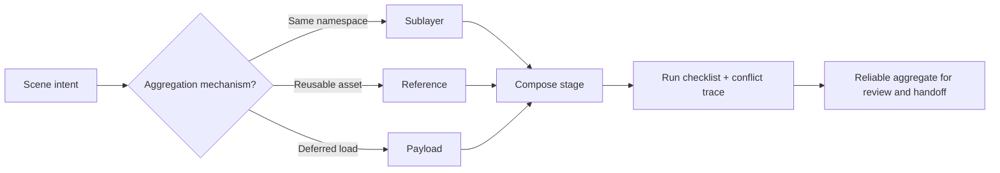
```mermaid
flowchart LR
    Intent["Scene intent"] --> Choice{"Aggregation mechanism?"}
    Choice -->|Same namespace| Sublayer["Sublayer"]
    Choice -->|Reusable asset| Reference["Reference"]
    Choice -->|Deferred load| Payload["Payload"]
    Sublayer --> Compose["Compose stage"]
    Reference --> Compose
    Payload --> Compose
    Compose --> Validate["Run checklist + conflict trace"]
    Validate --> Reliable["Reliable aggregate for review and handoff"]
```

> **Companion video:** Timestamps are provided so you can watch a short segment, then return here for the “production interpretation” (what breaks, how to test, and what to standardize).

---

## Before You Start (Quick Setup)

You want:

- A working USD + Python environment (`pxr`)
- `usdview` installed for visual inspection
- This deep-dive file open alongside the companion video timestamps

Setup reference:
- [Learn OpenUSD — Installing usdview and Setting Up Python](https://docs.nvidia.com/learn-openusd/latest/usdview-install-instructions.html) [6 - setup](#link-6)

### Optional session-specific prep

- Transcript is included at the end of this document (see [Appendix - Full Transcript](#appendix---full-transcript-verbatim-paste-zone)).
- Screenshots are in [Pics/WhatYouShouldKnowAboutContentAggregation/](Pics/WhatYouShouldKnowAboutContentAggregation/).
- [NVIDIA Omniverse Discord](https://discord.gg/nvidiaomniverse) [18 - community Discord](#link-18)
- [OpenUSD Kitchen Set sample asset](https://openusd.org/release/dl_kitchen_set.html) [19 - Kitchen Set](#link-19)
- [OpenUSD downloads and videos](https://openusd.org/dev/dl_downloads.html) [20 - Downloads](#link-20)
- (Optional) Industrial runtime context: [Isaac Sim (GitHub)](https://github.com/isaac-sim/IsaacSim), [Isaac Lab (GitHub)](https://github.com/isaac-sim/IsaacLab), [Omniverse Kit App Template (GitHub)](https://github.com/NVIDIA-Omniverse/kit-app-template)

---

## How This Tutorial Works

Two-layer structure:

1. **Story layer** - one narrative thread across all chapters.
2. **Production layer** - practical pipeline behavior, checks, and pitfalls.

### Repeating chapter pattern (so the tutorial stays “round”)

Each chapter intentionally follows the same shape:

- **Video frames (chronological)**: the key slides / Houdini screenshots in order (click-to-open).
- **Frame notes**: what you’re seeing, why it matters, and where it connects to the kitchen story and the digital-twin story.
- **Key moment and interpretation**: the decision you should remember for the exam *and* for real pipelines.
- **Breakout**: a small, runnable (or pseudocode) snippet that turns the idea into something you can test.

### Story anchor for this session: Kitchen Set (Hailey’s kitchen scene)

For this deep-dive we keep one consistent narrative thread:

- We start from the OpenUSD Kitchen Set sample scene and follow Hailey’s authoring decisions as the scene is assembled.
- Each chapter returns to a concrete “where does this opinion belong?” choice (for example: “where do we put this mug?”) and ties it to one aggregation mechanism.
- The real problem is not “can we load files,” but “can we aggregate content **without losing intent** and still keep the result debuggable for the next person.”

### Breakout thread: pull the same decisions into an industrial digital twin (Packaging Cell 3 / Station 7)

- After each chapter’s kitchen decision, we translate it into a shop-floor context (multiple departments, overlays, review pressure).
- This is where the exact same USD mechanics become reliability and operations risk: wrong winner values, missing contributors, and performance cliffs.

### Why this matters

Content aggregation mistakes can silently produce:

- wrong visual context (missing assets, duplicate assets, stale variants),
- wrong operational decisions (incorrect status overlays),
- and low trust in review sessions ("it worked yesterday, why not today").

---

## Chapter Outcomes at a Glance

| Chapter | Video section (approx) | Pillar | Outcome |
|---|---|---|---|
| [Chapter 1](#chapter-1) | [`03:13`](https://www.youtube.com/live/LFCauWTNBM4?t=193)-[`12:57`](https://www.youtube.com/live/LFCauWTNBM4?t=777) | Asset Structure Principles | Explain aggregation and the four pillars. |
| [Chapter 2](#chapter-2) | [`12:57`](https://www.youtube.com/live/LFCauWTNBM4?t=777)-[`16:30`](https://www.youtube.com/live/LFCauWTNBM4?t=990) | Asset Interface and Encapsulation | Use default prim and encapsulation for portable assets. |
| [Chapter 3](#chapter-3) | [`16:30`](https://www.youtube.com/live/LFCauWTNBM4?t=990)-[`46:30`](https://www.youtube.com/live/LFCauWTNBM4?t=2790) | Reference/Payload Pattern | Use sublayers, references, payloads by intent. |
| [Chapter 4](#chapter-4) | [`22:29`](https://www.youtube.com/live/LFCauWTNBM4?t=1349)-[`28:07`](https://www.youtube.com/live/LFCauWTNBM4?t=1687) | Asset Parameterization | Use variants and primvars instead of duplication. |
| [Chapter 5](#chapter-5) | [`26:32`](https://www.youtube.com/live/LFCauWTNBM4?t=1592)-[`52:30`](https://www.youtube.com/live/LFCauWTNBM4?t=3150) | Lofting & Workstreams | Structure department lanes and trace winning opinions. |
| [Chapter 6](#chapter-6) | [`34:39`](https://www.youtube.com/live/LFCauWTNBM4?t=2079)-end | Model Hierarchy | Apply model kinds, avoid anti-patterns, run checklist. |

**Note on timestamps:** this livestream revisits pillars and overlaps topics (especially around the reference/payload pattern, lofting, and model hierarchy). Treat the ranges above as **jump-in anchors**, not strict boundaries — use the [Key Moments Index](#key-moments-index) when you want the most reliable YouTube jump target for a specific concept.

---

## Key Moments Index

| Timestamp in video | Slide | Transcript cue | Why this moment matters |
|---|---|---|---|
| [`02:25`](https://www.youtube.com/live/LFCauWTNBM4?t=145) | <a href="Pics/WhatYouShouldKnowAboutContentAggregation/ContentAggregation_8h08_25.png"></a> | Certification exam context | Anchors the session as certification-focused and sets expectations for how practical the examples will be. |
| [`03:13`](https://www.youtube.com/live/LFCauWTNBM4?t=193) | <a href="Pics/WhatYouShouldKnowAboutContentAggregation/ContentAggregation_8h08_38.png"></a> | "We built the Learn OpenUSD curriculum to prepare you for that." | Connects certification intent to practical learning path and sets expectations for the tutorial's structure. |
| [`04:48`](https://www.youtube.com/live/LFCauWTNBM4?t=288) | <a href="Pics/WhatYouShouldKnowAboutContentAggregation/ContentAggregation_8h09_05.png"></a> | "Content aggregation... how to apply this practically." | Marks the shift from concept definitions to workflow execution in real pipelines. |
| [`08:42`](https://www.youtube.com/live/LFCauWTNBM4?t=522) | <a href="Pics/WhatYouShouldKnowAboutContentAggregation/ContentAggregation_8h21_34.png"></a> | "Legibility, modularity, performance, navigability." | Establishes the decision rubric used in Chapters 1 and 2 for mechanism choice. |
| [`09:32`](https://www.youtube.com/live/LFCauWTNBM4?t=572) | <a href="Pics/WhatYouShouldKnowAboutContentAggregation/ContentAggregation_8h21_26.png"></a> | "Give an example question." | Transition into concrete decision-making, not abstract theory. |
| [`13:00`](https://www.youtube.com/live/LFCauWTNBM4?t=780) | — | "Asset Interface & Encapsulation" | Introduces default prim and encapsulation for portable assets (Ch 2). |
| [`20:04`](https://www.youtube.com/live/LFCauWTNBM4?t=1204) | <a href="Pics/WhatYouShouldKnowAboutContentAggregation/ContentAggregation_8h24_39.png"></a> | "Reference = metadata layer, payload = heavy content layer." | Introduces the reference/payload split that keeps interfaces visible without loading heavy geometry. |
| [`24:43`](https://www.youtube.com/live/LFCauWTNBM4?t=1483) | <a href="Pics/WhatYouShouldKnowAboutContentAggregation/ContentAggregation_8h32_48.png"></a> | "Variants in practice (Chair switching)." | Shows why parameterization needs payload-aware structure to stay usable in review. |
| [`26:32`](https://www.youtube.com/live/LFCauWTNBM4?t=1592) | <a href="Pics/WhatYouShouldKnowAboutContentAggregation/ContentAggregation_8h34_23.png"></a> | "Lofting & workstreams." | Shows the workstream lane structure teams use to collaborate without overwriting each other. |
| [`48:16`](https://www.youtube.com/live/LFCauWTNBM4?t=2896) | <a href="Pics/WhatYouShouldKnowAboutContentAggregation/ContentAggregation_8h48_16.png"></a> | "Be kind to the pipeline (kinds in the scene graph)." | Kinds turn a pile of prims into a navigable hierarchy and prevent downstream assumptions from breaking. |
| [`56:10`](https://www.youtube.com/live/LFCauWTNBM4?t=3370) | <a href="Pics/WhatYouShouldKnowAboutContentAggregation/ContentAggregation_8h56_10.png"></a> | "Kinds recap + Q&A pressure test." | Reinforces that model kinds are a collaboration contract, not a cosmetic label. |

Rules:

- Minimum one key moment per chapter.
- Every important screenshot with code needs a breakout block.

---

<a id="chapter-1"></a>
## Chapter 1 - Asset Structure Principles

**Video section (approx):** `03:13-12:57`  
**Watch first:** [YouTube source - jump to chapter section](https://www.youtube.com/live/LFCauWTNBM4?t=193)

### Video frames (chronological)

Click any thumbnail to open full-size.


Hailey opens with the title slide that sets the tone: **“Content Aggregation (also known as: how to actually LIVRPS!)”**. This isn't just wordplay — it's the moment when your mental model of strength ordering stops being theory and starts being a daily debugging tool. **Learn more:** [8 - Introduction to composition](#link-8), [12 - LIVRPS](#link-12), [67 - Reference deck](#link-67)

<a href="Pics/WhatYouShouldKnowAboutContentAggregation/ContentAggregation_8h21_12.png"></a>

The agenda slide reveals the full arc: asset structure → asset interface/encapsulation → reference/payload pattern → parameterization → lofting/workstreams → model hierarchy. **Stable aggregation is not one feature — it's a contract bundle.** Structure, interface, load policy, parameterization, collaboration lanes, and hierarchy all have to align. When Hailey's kitchen scene is assembled, every one of these decisions will matter. When you build a Packaging Cell 3 stage, the same bundle determines whether departments can ship updates without collisions. **Learn more:** [14 - Asset structure](#link-14), [10 - References](#link-10), [11 - Payloads](#link-11)

<a href="Pics/WhatYouShouldKnowAboutContentAggregation/ContentAggregation_8h21_26.png"></a>

Hailey lands the central question: *"I just wanted to resize my mug. Where do I put it?"* It sounds like a joke, but it's the pivot point. A tiny change forces you to choose the *right* contribution mechanism — sublayer, reference, or payload — based on intent, not convenience. In the kitchen, this is the mug. In Packaging Cell 3, it's the robot position or the status overlay. Same decision. **Learn more:** [8 - Introduction to composition](#link-8), [12 - LIVRPS](#link-12), [67 - Reference deck](#link-67)

<a href="Pics/WhatYouShouldKnowAboutContentAggregation/ContentAggregation_8h21_34.png"></a>

The Four Pillars — **Legibility, Modularity, Performance, Navigability** — become your decision rubric. They explain *why* some aggregation styles scale and others rot. When you ask "where does this mug go?", you're really asking: can another team understand where this opinion came from? Can teams contribute without stepping on each other? Does this mechanism support staged loading? Can someone trace source and intent during review? **Learn more:** [14 - Asset structure](#link-14), [16 - Best practices index](#link-16)

<a href="Pics/WhatYouShouldKnowAboutContentAggregation/ContentAggregation_8h22_04.png"></a> <a href="Pics/WhatYouShouldKnowAboutContentAggregation/ContentAggregation_8h22_23.png"></a>

**Now she digs into:** Example question about naming internal prims `geo_final_v3`, `materials_latest`, `rig_backup`. **Why it matters:** those names blur *public interface* vs *internal implementation*. Downstream teams start binding to "whatever was there today," and you lose the ability to restructure safely. **Learn more:** [14 - Asset structure](#link-14), [69 - Prims](#link-69)

### Intro bridge

Aggregation is where individual USD authoring decisions become a system behavior. In Hailey’s kitchen scene, this is the point where “a mug file,” “a material file,” and “a layout file” stop being separate artifacts and become one composed stage. In a digital twin, the same moment determines whether review and downstream decisions are reliable or chaotic.

### Concept -> What breaks -> How to test

- **Concept:** Aggregation combines authored content from multiple files and teams.
- **What breaks:** Path/contract mismatches, duplicate entry points (double-inclusion), long-lived “review fix” layers, hidden load state (payloads), and unclear ownership of the winning opinion.
- **How to test:** Open stage, inspect composition stack, verify expected contributors.

### Kitchen checkpoint (carry-forward)

- **Kitchen decision:** Treat the kitchen stage as a *composed* result, not a single “scene file.” If the mug looks wrong, assume the answer is “which contributor won,” not “somebody moved it.”
- **What you just encoded:** A debugging habit: first identify contributors (layers/assets), then inspect composition/strength, then validate the contract.
- **Carry forward into Chapter 2:** Before choosing any mechanism, ask: “Can I move this asset into a folder without breaking everything downstream?” Interface and encapsulation are the next layer.

### Script Lab (planned / not yet committed)

- `aggregation/00_stage_sources_audit.py`

---

<a id="chapter-2"></a>
## Chapter 2 - Asset Interface and Encapsulation

**Video section (approx):** `12:57-16:30`  
**Watch first:** [YouTube source - jump to chapter section](https://www.youtube.com/live/LFCauWTNBM4?t=777)

### Video frames (chronological)

Click any thumbnail to open full-size.

<a href="Pics/WhatYouShouldKnowAboutContentAggregation/ContentAggregation_8h22_26.png"></a>

**At this moment:** Section header: **Asset Interface & Encapsulation**. **Why it matters:** in production, "aggregation reliability" is mostly "interface stability". Encapsulation is how you keep interfaces stable while internals evolve. **Learn more:** [68 - Default prim](#link-68), [14 - Asset structure](#link-14)

<a href="Pics/WhatYouShouldKnowAboutContentAggregation/ContentAggregation_8h22_48.png"></a> <a href="Pics/WhatYouShouldKnowAboutContentAggregation/ContentAggregation_8h22_52.png"></a>

**The key moment:** "Spot the problem" encapsulation example: absolute paths and downstream references to deep internal prim paths (like `/Chair/geo/seat_mesh`) break portability. **Why it matters:** if downstream content points inside an asset's guts, you cannot refactor without breaking consumers. That is exactly how "it works on my machine" stages are created. **Learn more:** [14 - Asset structure](#link-14), [68 - Default prim](#link-68), [67 - Reference deck](#link-67)

<a href="Pics/WhatYouShouldKnowAboutContentAggregation/ContentAggregation_8h23_23.png"></a>

**Here:** "Asset Interface - What Is It?" defining two core interface tools: **Default prim** as the stable entry point for consumers; **Encapsulation** via a clean public surface (`/Chair`, `/Chair/Looks`) hiding `_internal`. **Why it matters:** these are the two interface tools you need to keep consumers stable. **Learn more:** [68 - Default prim](#link-68), [10 - References](#link-10)

### Intro bridge

This pillar answers one question: **what is the stable entry point of an asset, and what is private implementation detail?**

In OpenUSD, aggregation scales when assets behave like modules:
- `defaultPrim` gives consumers a predictable root to reference.
- Encapsulation keeps internal prim paths refactorable without breaking downstream stages.

In the kitchen scene, this is why `/Chair` should be the public surface, while `_internal` is allowed to evolve as the asset matures.

**Digital twin breakout (Packaging Cell 3 / Station 7):** this is why `/Factory/Cell03/Robot` should be a stable contract, while the vendor’s internal hierarchy can change without breaking your cell stage.

Hailey’s "spot the problem" slide is the pitfall: deep internal bindings and absolute paths turn “works here” into “breaks everywhere.”

### Concept -> What breaks -> How to test

- **Concept:** Asset interface = stable entry prim + shallow public paths; encapsulation = keep internals behind that boundary.
- **What breaks:** Missing/incorrect `defaultPrim`, downstream references to deep internal prim paths, absolute file paths, and “public” naming that leaks implementation detail.
- **How to test:** Open the asset standalone, verify `defaultPrim`, then simulate moving the asset folder and confirm downstream stages still resolve via the interface (not internals).

### Mechanism decision quick map

Now that the interface is stable, you can choose composition mechanisms *by intent* (Chapter 3 goes deep):

- **Sublayer:** stage-level lane, same namespace, ordered strength.
- **Reference:** reusable module insertion at a stable entry point (`defaultPrim`).
- **Payload:** deferred loading policy on top of a module boundary.

**Digital twin translation:** facility layout deltas can be sublayers, robot/workcell modules are references, and heavy scan/mesh clusters are payload candidates.

### Key moment and interpretation
*(See the matching frame in the "Video frames" section at the top of this chapter.)*

At this moment, “legibility” and “modularity” become concrete:
- If consumers only know the entry prim, you can refactor internals safely.
- If consumers know internal paths, you’re locked in — and aggregation becomes brittle.

### Breakout - Asset interface sanity check

**Checklist (manual):**
1. Asset opens standalone and has a `defaultPrim`.
2. Downstream stages reference the asset’s entry prim, not deep internal prim paths.
3. Public surface is stable (`/Asset`, `/Asset/Looks`), internals are clearly private (`_internal`).

**Quick probe (Python):**
```py
from pxr import Usd

stage = Usd.Stage.Open(asset_path)
assert stage.GetDefaultPrim(), "Asset has no defaultPrim"
```

### Kitchen checkpoint (carry-forward)

- **Kitchen decision:** Treat `/Chair` as the public contract: set `defaultPrim` and keep downstream references shallow (avoid `/Chair/geo/...`).
- **What you just encoded:** Portability: you can move/refactor the asset without breaking consumers.
- **Carry forward into Chapter 3:** With a stable interface, you can apply the reference/payload pattern (and sublayer lanes) without creating hidden coupling.

### Script Lab (planned / not yet committed)

- `aggregation/01_asset_interface_audit.py`

---

<a id="chapter-3"></a>
## Chapter 3 - Reference/Payload Pattern

<a href="Pics/WhatYouShouldKnowAboutContentAggregation/ContentAggregation_8h23_47.png"></a>

**Video section (approx):** `16:30-46:30`  
**Watch first:** [YouTube source - jump to chapter section](https://www.youtube.com/live/LFCauWTNBM4?t=990)

Model hierarchy (kinds) is covered in [Chapter 6](#chapter-6).

### Sublayers

### Video frames (chronological)

Click any thumbnail to open full-size.

<a href="Pics/WhatYouShouldKnowAboutContentAggregation/ContentAggregation_8h23_51.png"></a>

**Interesting approach:** Agenda revisited with the **Reference/Payload Pattern** highlighted as "most important from today". **Why it matters:** even when you choose sublayers for collaboration lanes, load-policy decisions (payloads) will change what teammates *see* and debug. **Learn more:** [9 - Layers and sublayers](#link-9), [11 - Payloads](#link-11)

<a href="Pics/WhatYouShouldKnowAboutContentAggregation/ContentAggregation_8h24_05.png"></a>

**Hailey shifts to:** Houdini/Solaris viewport showing the Kitchen Set scene in context (this is the "real object" we're composing). **Why it matters:** sublayer decisions are only meaningful when you can connect them to a concrete scene graph (what prims exist, what changed, and who owns the change). **Learn more:** [42 - Solaris/USD docs](#link-42), [29 - Writing USD from Houdini](#link-29)

<a href="Pics/WhatYouShouldKnowAboutContentAggregation/ContentAggregation_8h24_19.png"></a>

**This is where:** Houdini UI showing a **layer stack / scene graph list** and a small USDA snippet. **Why it matters:** this is the "audit surface" you need when sublayers get messy: list contributors, then trace which layer is authoring what. **Learn more:** [15 - Stage API](#link-15), [12 - LIVRPS](#link-12)

<a href="Pics/WhatYouShouldKnowAboutContentAggregation/ContentAggregation_8h24_32.png"></a>

**The slide lands:** "Houdini Demo - payload structure for geometry (Kitchen Set)". **Why it matters:** payload boundaries often become the "fault lines" of collaboration - teams can author opinions that you cannot even see until something is loaded. **Learn more:** [11 - Payloads](#link-11), [67 - Reference deck](#link-67)


<a href="Pics/WhatYouShouldKnowAboutContentAggregation/ContentAggregation_8h24_39.png"></a>

**The question:** "Reference/Payload pattern" slide: **reference = metadata layer**, **payload = heavy content layer**. **Why it matters:** this is the clean separation you want in a team environment: everybody can read the interface/metadata without loading the world. **Learn more:** [10 - References](#link-10), [11 - Payloads](#link-11)

<a href="Pics/WhatYouShouldKnowAboutContentAggregation/ContentAggregation_8h24_58.png"></a> <a href="Pics/WhatYouShouldKnowAboutContentAggregation/ContentAggregation_8h25_08.png"></a>

**The answer:** Example question (and answer): what should live **above the payload boundary** in the reference layer. **Answer logic:** author **variant definitions** and **asset metadata (kind, assetInfo)** in the reference layer; keep heavy geometry in payload. **Why it matters:** this separation keeps interface visible without loading heavy content. **Learn more:** [70 - Variant sets](#link-70), [72 - Model kinds](#link-72), [11 - Payloads](#link-11)

<a href="Pics/WhatYouShouldKnowAboutContentAggregation/ContentAggregation_8h22_04.png"></a>

**Now:** The earlier "bad naming" example question reappears as a reminder: **don't leak implementation details into the public surface**. **Why it matters:** sublayers become dangerous when teams bind to internal names and then "fix layers" accumulate forever. **Learn more:** [14 - Asset structure](#link-14), [68 - Default prim](#link-68)

*Asset Parameterization and Lofting & Workstreams are covered in [Chapter 4](#chapter-4) and [Chapter 5](#chapter-5).*

### Intro bridge

Sublayers look simple on day one and become dangerous on day sixty if layer ownership is fuzzy. This chapter explains when sublayers are exactly right and how to keep them deterministic over time.

In the kitchen scene, sublayers are a good fit for coordinated stage-level contributions that intentionally merge into one namespace (for example: layout tweaks, lookdev overrides, lighting adjustments, and review annotations).

**Digital twin breakout (Packaging Cell 3 / Station 7):** sublayers are a good fit for coordinated stage-level contributions like facility baseline, safety markup overlays, and review annotations that are expected to compose into one stage namespace.

### Concept -> What breaks -> How to test

- **Concept:** Ordered layer stack for direct opinion merging in one namespace.
- **What breaks:** Accidental overrides due to stack order misunderstandings and missing ownership contracts.
- **How to test:** Print sublayer order, then trace a known property to confirm the expected winner.

### Practical sublayer guidance

- Keep sublayers for **same-convention** content that should merge.
- Avoid mixing unrelated responsibilities in one layer.
- Name layers by ownership and intent, not by temporary task names.
- Document stack order as part of review criteria.

If you cannot answer "which team owns the winning opinion for this property?" in under 30 seconds, your sublayer strategy is not yet production-safe.

### Key moment and interpretation
*(See the matching frame in the "Video frames" section at the top of this chapter.)*

This question is useful because it sounds tiny and reveals structural intent:
- If it is a stage-specific adjustment in a shared namespace, sublayer is often valid.
- If it is an asset-level reusable change, move toward reference-based asset structure.

### Breakout - Sublayer order probe

Digital twin example (Packaging Cell 3): one way to encode ownership lanes is to keep the stack explicit like this.

**Raw snippet:**
```py
root.subLayerPaths = [
    "cell03_base.usda",
    "cell03_ops_overlay.usda",
    "cell03_review_fix.usda",
]
```

**Commented walkthrough:**
```py
# Sublayers are applied in order, and stronger opinions can come from later layers.
# Keep this order explicit and reviewed.
root.subLayerPaths = [
    "cell03_base.usda",        # Baseline structure and defaults.
    "cell03_ops_overlay.usda", # Operational overlays and status-driven edits.
    "cell03_review_fix.usda",  # Latest review-time corrections, typically strongest.
]
```

**Why this works**
- It keeps one namespace with clear, ordered contribution lanes.
- It makes override direction auditable during troubleshooting.

**Why this fails**
- It fails when "review_fix" silently becomes permanent production source.
- It fails when stack order changes without change-log or ownership review.

### Kitchen checkpoint (carry-forward)

- **Kitchen decision:** Keep kitchen-wide “same namespace” adjustments in a small, named, ordered layer stack (layout/lookdev/lighting/review), instead of burying everything inside one file.
- **What you just encoded:** Strength ordering as a *human-readable contract* (later layers win), not a mystery.
- **Carry forward to References (below):** Anything that should travel as a reusable unit (a cabinet/appliance/prop-set module) should move out of the sublayer pile and become a referenced asset with a stable insertion point.


### References

**Video section (approx):** `27:30-37:30`  
**Watch first:** [YouTube source - jump to chapter section](https://www.youtube.com/live/LFCauWTNBM4?t=1650)

### Video frames (chronological)

Click any thumbnail to open full-size.

<a href="Pics/WhatYouShouldKnowAboutContentAggregation/ContentAggregation_8h35_06.png"></a>

<a href="Pics/WhatYouShouldKnowAboutContentAggregation/ContentAggregation_8h36_01.png"></a>

**The slide lands:** "What is lofting?" slide: expose information *from payload up to the reference layer* so people can see what exists without loading heavy content. **Why it matters:** lofting is a key tactic for "fast stage open + still debuggable", especially when your referenced assets are huge. **Learn more:** [10 - References](#link-10), [11 - Payloads](#link-11), [67 - Reference deck](#link-67)

<a href="Pics/WhatYouShouldKnowAboutContentAggregation/ContentAggregation_8h36_37.png"></a>

**Hailey shifts to:** Houdini demo of lofting: the UI shows how authored data is split across layers so consumers can browse/parameterize assets without forcing heavy geometry load. **Why it matters:** this is the "collaboration reality" view - where layer boundaries are visible and therefore governable. **Learn more:** [42 - Solaris/USD docs](#link-42), [29 - Writing USD from Houdini](#link-29)

### Intro bridge

This is the chapter where we stop treating assets as copy-paste content and start treating them as reusable units. In production, references are usually the point where pipelines become scalable instead of fragile.

In the kitchen scene, references are what let you keep a “cabinet module,” “appliance module,” or “prop set” independently authored while still composing a coherent room.

**Digital twin breakout (Packaging Cell 3 / Station 7):** references let you keep robot modules, conveyor modules, and inspection modules independently authored while still composing a coherent cell stage.

### Concept -> What breaks -> How to test

- **Concept:** Bring external prim data into composition with explicit arcs and cleaner ownership boundaries.
- **What breaks:** Wrong target prim paths, unresolved asset paths, broken default prim assumptions, or accidental namespace collisions.
- **How to test:** Verify referenced prim existence, inspect composed namespace, and confirm expected source ownership for critical properties.

### Practical reference guidance

- Use references when content should remain modular and reusable across shots/scenes/cells.
- Avoid "flattening by habit"; preserve source boundaries so teams can iterate independently.
- Keep path contracts documented (`defaultPrim`, target prim path, naming standards).

### Key moment and interpretation
*(See the matching frame in the "Video frames" section at the top of this chapter.)*

This section lands the idea that references are not just a technical feature; they are an organizational tool:
- They keep asset teams autonomous.
- They reduce override noise in top-level stage assembly.
- They make defect tracing faster because source ownership is clearer.

### Breakout - Reference health check pseudocode

Digital twin example (Packaging Cell 3): reference a module into the cell stage with an explicit insertion point.

**Raw snippet:**
```py
prim = stage.DefinePrim("/Factory/Cell03/RobotModule")
prim.GetReferences().AddReference("cell03_robot.usda", "/Robot")
```

**Commented walkthrough:**
```py
# Create or fetch the destination prim where the referenced asset will be composed.
prim = stage.DefinePrim("/Factory/Cell03/RobotModule")

# Add a reference arc:
# - First argument: source layer/asset path.
# - Second argument: prim path inside that source asset.
# This preserves modular authoring while composing into the current stage.
prim.GetReferences().AddReference("cell03_robot.usda", "/Robot")
```

**Why this works**
- It composes reusable asset content without merging everything into one authored file.
- It keeps source-of-truth ownership with the asset file.

**Why this fails**
- It fails if `/Robot` does not exist or `defaultPrim`/target assumptions are wrong.
- It fails silently in review quality when paths resolve but point to unintended prims.

### Kitchen checkpoint (carry-forward)

- **Kitchen decision:** Promote repeatable kitchen pieces (cabinet/appliance/prop set) into referenced modules so they can be reused, versioned, and swapped without rewriting the whole stage.
- **What you just encoded:** References turn “content” into “modules,” which makes tracing and ownership clearer — if paths/contracts are explicit.
- **Carry forward to Payloads (below):** Decide which referenced modules are “heavy enough” to require load policy. If performance or interactivity matters, payload is not an optimization — it’s part of correctness.

### Script Lab (planned / not yet committed)

- `aggregation/03_reference_health_check.py`

---

### Payloads

**Video section (approx):** `37:30-46:30`  
**Watch first:** [YouTube source - jump to chapter section](https://www.youtube.com/live/LFCauWTNBM4?t=2250)

### Video frames (chronological)

Click any thumbnail to open full-size.

<a href="Pics/WhatYouShouldKnowAboutContentAggregation/ContentAggregation_8h46_25.png"></a>

**The demo:** Houdini/Solaris view with an inspection panel and code/editor view: this is the practical "where is the payload boundary?" authoring environment. **Why it matters:** payload design is only safe when you can audit it (what loads, what stays available, what is referenced vs payloaded). **Learn more:** [11 - Payloads](#link-11), [15 - Stage API](#link-15)

<a href="Pics/WhatYouShouldKnowAboutContentAggregation/ContentAggregation_8h46_48.png">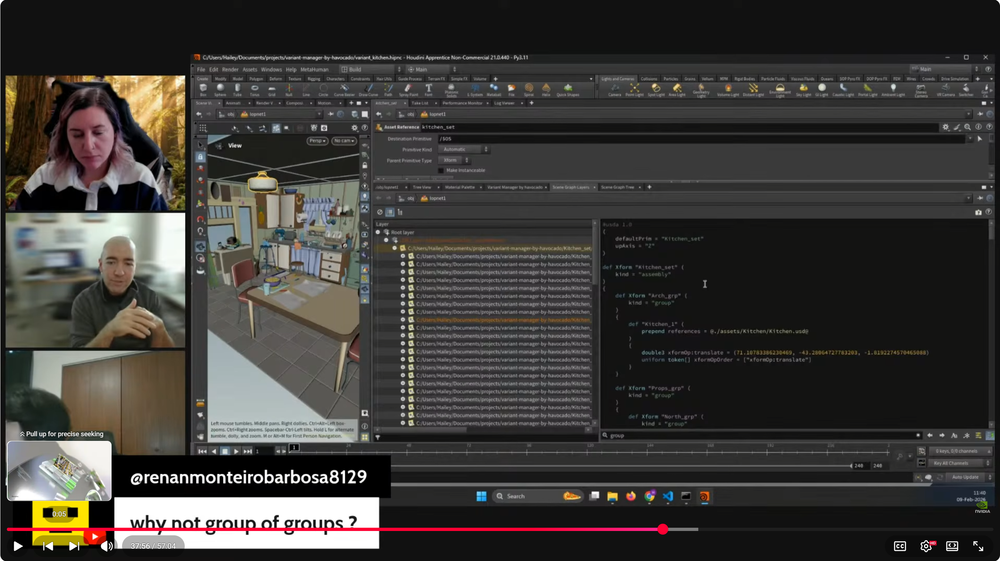</a> <a href="Pics/WhatYouShouldKnowAboutContentAggregation/ContentAggregation_8h46_51.png"></a>

**The key takeaway:** payloads make "what you see" dependent on load state. Two teammates can open the same stage and see different results unless default payload policy is explicit and tested. **Learn more:** [11 - Payloads](#link-11), [15 - Stage API](#link-15)

### Intro bridge

Payloads are where composition design meets runtime discipline. If references define structure, payloads define loading behavior.

In the kitchen scene, payloads are the difference between opening full-fidelity assets every time and opening a responsive stage that loads heavy parts (high-res meshes, dense props, scans) only when needed.

**Digital twin breakout (Packaging Cell 3 / Station 7):** this is the difference between opening the full high-detail environment every time and opening a responsive stage that loads heavy parts only when needed.

### Concept -> What breaks -> How to test

- **Concept:** Defer heavy content until needed while preserving composition intent.
- **What breaks:** Critical content hidden behind unloaded payloads, or inconsistent review outcomes because load policy is undocumented.
- **How to test:** Toggle payload load states, compare expected visibility, and verify that validation checks account for load state.

### Practical payload guidance

- Use payloads for heavy geometry/sim/cache blocks where interactive performance matters.
- Document payload policy in handoff: what must load by default, what is optional.
- Never assume "not visible" means "not authored"; check load state before debugging composition.

### Key moment and interpretation
*(See the matching frame in the "Video frames" section at the top of this chapter.)*

The key operational lesson here is simple: load policy is part of correctness, not just speed.
- If validation ignores payload state, teams ship false negatives ("asset missing") and false positives ("all good") depending on local app defaults.

### Breakout - Payload load validation pseudocode

Digital twin example (Packaging Cell 3): add heavy clusters as payloads and validate load-policy behavior explicitly.

**Raw snippet:**
```py
prim = stage.DefinePrim("/Factory/Cell03/ScanCluster")
prim.GetPayloads().AddPayload("cell03_scancluster.usda", "/ScanCluster")
```

**Commented walkthrough:**
```py
# Create destination prim for heavy content.
prim = stage.DefinePrim("/Factory/Cell03/ScanCluster")

# Add payload arc so content can be deferred/unloaded by policy.
# This is useful for large assets that should not always load by default.
prim.GetPayloads().AddPayload("cell03_scancluster.usda", "/ScanCluster")
```

**Why this works**
- It gives you scale control while keeping a coherent composition structure.
- It supports interactive review on large scenes.

**Why this fails**
- It fails if teams treat unloaded payload content as "missing data."
- It fails when runtime consumers use different default load policies without documentation.

### Kitchen checkpoint (carry-forward)

- **Kitchen decision:** Mark heavy kitchen content as payloads *only when you can describe the load policy in words* (what must load by default vs what is optional).
- **What you just encoded:** A new debugging rule: “missing” might be “unloaded,” so load state must be checked before you chase composition bugs.
- **Carry forward into Chapter 4:** Parameterization decisions (variants vs primvars) sit on top of this structure — you want options without duplicating payload-heavy assets.
- **Carry forward into Chapter 5:** When something looks wrong, validate payload state first, then trace the winning opinion for the specific property that’s incorrect.

### Script Lab (planned / not yet committed)

- `aggregation/04_payload_load_validation.py`

---

<a id="chapter-4"></a>
## Chapter 4 - Asset Parameterization

**Video section (approx):** `22:29-28:07`  
**Watch first:** [YouTube source - jump to chapter section](https://www.youtube.com/live/LFCauWTNBM4?t=1349)

### Intro bridge

Parameterization is how teams avoid "duplicate the asset 15 times." Use variants and primvars instead of duplication.

### Video frames (chronological)

Click any thumbnail to open full-size.

<a href="Pics/WhatYouShouldKnowAboutContentAggregation/ContentAggregation_8h25_58.png"></a>

**The demo:** Section header: **Asset Parameterization**. **Why it matters:** parameterization is how teams avoid "duplicate the asset 15 times" — it's also where sublayer strategies can accidentally fight with variants if ownership is unclear. **Learn more:** [70 - Variant sets](#link-70)

<a href="Pics/WhatYouShouldKnowAboutContentAggregation/ContentAggregation_8h26_19.png"></a>

**The idea:** Houdini scene graph + context menu showing how variants/parameters are operated in a DCC. **Why it matters:** this is where "collaboration lanes" become real: one team owns a variant set, another owns lookdev, another owns layout. **Learn more:** [70 - Variant sets](#link-70), [9 - Layers and sublayers](#link-9)

<a href="Pics/WhatYouShouldKnowAboutContentAggregation/ContentAggregation_8h32_48.png"></a>

**The pattern:** Houdini showing variant thumbnails / switching UI on an asset (chair). **Why it matters:** if your variant switching requires loading massive geometry every time, your review workflow will die. **Learn more:** [11 - Payloads](#link-11), [67 - Reference deck](#link-67)

<a href="Pics/WhatYouShouldKnowAboutContentAggregation/ContentAggregation_8h33_40.png"></a>

**At this moment:** **Primvars** slide: use primvars for small per-property tweaks (cheaper memory-wise) vs variants for swapping whole configurations. **Why it matters:** "small change vs big configuration swap" is an aggregation decision. **Learn more:** [71 - Primvars](#link-71), [70 - Variant sets](#link-70)

### Concept -> What breaks -> How to test

- **Concept:** Variants for whole-configuration swaps; primvars for small per-property tweaks.
- **What breaks:** Duplicating assets instead of parameterizing; mixing variant and primvar semantics; and authoring variants that require heavy payload loads because nothing is lofted above the payload boundary.
- **How to test:** Inspect variant sets and primvars in usdview; verify switching behavior.

### Breakout - Variants vs primvars decision

| Use case | Mechanism |
|---------|-----------|
| Swap whole configuration (e.g., chair style) | Variant set |
| Small per-property tweak (e.g., color, scale) | Primvar |
| Same-namespace override lane | Sublayer |

### Kitchen checkpoint (carry-forward)

- **Kitchen decision:** Use variants for chair/appliance options; use primvars for layout tweaks that don't warrant a new variant.
- **What you just encoded:** Parameterization reduces duplication and keeps collaboration lanes clear.
- **Carry forward into Chapter 5:** Lofting and department layers (geo/materials/rigging) structure how teams work without chaos.

### Script Lab (planned / not yet committed)

- `aggregation/05_variants_primvars_probe.py`

---

<a id="chapter-5"></a>
## Chapter 5 - Lofting & Workstreams

**Video section (approx):** `26:32-52:30` (lofting ~27 min; overrides/conflict tracing ~47 min)  
**Watch first:** [YouTube source - jump to chapter section](https://www.youtube.com/live/LFCauWTNBM4?t=1592)

*Lofting is covered early in the video (~27 min); overrides/conflict tracing later (~47 min). Both address "how teams work without chaos."*

### Video frames (chronological)

Click any thumbnail to open full-size.

#### Lofting and workstream lanes (26:32-28:07)

<a href="Pics/WhatYouShouldKnowAboutContentAggregation/ContentAggregation_8h34_23.png"></a>

**The key moment:** Section header: **Lofting & Workstreams**. **Why it matters:** this is where the talk becomes explicitly "team structure": how modelers, texture artists, and riggers can work without chaos. **Learn more:** [9 - Layers and sublayers](#link-9), [67 - Reference deck](#link-67)

<a href="Pics/WhatYouShouldKnowAboutContentAggregation/ContentAggregation_8h34_29.png"></a>

**Here:** Example question: best layer structure for parallel collaboration across geometry/materials/rigging. **Answer intent:** separate department layers (e.g., `geo.usd`, `materials.usd`, `rigging.usd`) then compose them as **sublayers** inside the asset's payload. **Learn more:** [9 - Layers and sublayers](#link-9), [11 - Payloads](#link-11)

<a href="Pics/WhatYouShouldKnowAboutContentAggregation/ContentAggregation_8h34_55.png"></a>

**Interesting approach:** Example question (answered): parallel collaboration works best when geometry/materials/rigging live in separate layers and are composed as sublayers (often inside an asset payload). **Learn more:** [10 - References](#link-10), [9 - Layers and sublayers](#link-9)

#### Source tracing when results "look wrong" (47:39+)

<a href="Pics/WhatYouShouldKnowAboutContentAggregation/ContentAggregation_8h55_28.png"></a>

**Hailey shifts to:** Houdini/Solaris scene graph view showing the Kitchen Set hierarchy. **Why it matters:** this is the hands-on trace surface: identify the prim, then locate the authored source/layer/arc that is currently winning. (You’ll also see kind metadata here; the semantics are covered in Chapter 6.) **Learn more:** [15 - Stage API](#link-15), [12 - LIVRPS](#link-12)

<a href="Pics/WhatYouShouldKnowAboutContentAggregation/ContentAggregation_9h03_27.png"></a>

**The question:** Solaris node graph view (the procedural "how this stage is built" perspective). **Why it matters:** in node-based authoring, "the source" may be a node graph that emits layers - tracing winning opinions means mapping stage results back to the authoring graph. **Learn more:** [42 - Solaris/USD docs](#link-42), [15 - Stage API](#link-15)

<a href="Pics/WhatYouShouldKnowAboutContentAggregation/ContentAggregation_8h56_10.png"></a>

**This is where:** A practical recap frame that anchors the "turn this into a checklist" mindset. **Why it matters:** opinion resolution only helps if it tells you *where to fix the source-of-truth* (not where to apply yet another band-aid layer). **Learn more:** [13 - Value resolution](#link-13), [67 - Reference deck](#link-67)


### Intro bridge

This pillar is where aggregation becomes a day-to-day team workflow instead of a one-off composition trick.

- **Workstreams:** separate department-owned lanes (geo/materials/rigging/lookdev/layout) so parallel work is predictable.
- **Lofting:** keep the asset interface and lightweight metadata visible *above* payload boundaries so people can browse and configure without always loading heavy geometry.

And when something still “looks wrong”, the second half of this pillar is your debugger’s lifeline: **trace the winning opinion to its authored source** instead of guessing.

In the kitchen scene, this is how you prove why the mug is in the wrong place (or why the wrong material “won”) without guessing.

**Digital twin breakout (Packaging Cell 3 / Station 7):** this decides which status color, transform, or metadata value the operator actually sees.

### Concept -> What breaks -> How to test

- **Concept:** Workstreams (department lanes) + lofting (interface above payload) + source tracing (find the winning authored opinion).
- **What breaks:** Departments editing the same layer, payload-only interfaces that force heavy loads, and incorrect assumptions about which file “wins” due to undocumented layer order and hidden arc interactions.
- **How to test:** Open the asset with payloads unloaded and confirm the interface is still browsable; then trace one high-risk property to its winning source and verify it matches intended ownership.

### Practical resolution guidance

- Keep department lanes explicit (separate layers, named by ownership/intent) so “who owns the truth” is never ambiguous.
- Loft what reviewers need (variants, kinds, assetInfo, look bindings) above payload boundaries so “browse/configure” doesn’t require “load everything”.
- Pick one high-risk property per review (transform, status color, active variant, visibility) and trace it end-to-end.
- Record the winner source in review notes to reduce repeated debugging.
- Treat “it looked right once” as non-evidence unless source tracing confirms it.

### Key moment and interpretation
*(See the matching frame in the "Video frames" section at the top of this chapter.)*

This is where the tutorial aligns with certification logic:
- not "what do I expect,"
- but "which authored opinion is strongest here, and why?"

### Breakout - Value source trace pseudocode

Digital twin example (Packaging Cell 3): query the resolved value you see, then pair it with source tracing to find the winner.

**Raw snippet:**
```py
attr = stage.GetPrimAtPath("/Factory/Cell03/Robot").GetAttribute("xformOp:translate")
value = attr.Get()
```

**Commented walkthrough:**
```py
# Grab target attribute from the composed stage.
attr = stage.GetPrimAtPath("/Factory/Cell03/Robot").GetAttribute("xformOp:translate")

# Read resolved value currently visible in this composition context.
# In practice, pair this with source tracing in your USD inspection tools.
value = attr.Get()
```

**Why this works**
- It gives you the composed result that reviewers actually see.
- It anchors debugging on specific properties, not vague visual impressions.

**Why this fails**
- It fails when teams stop at the value and do not inspect winning source.
- It fails if queries are run in a different load/config context than the failing scene.

### Kitchen checkpoint (carry-forward)

- **Kitchen decision:** Pick one “symptom” in the kitchen (mug position, wrong material, unexpected visibility) and trace it to a concrete winning source instead of guessing.
- **What you just encoded:** Evidence-based debugging: the resolved value is not enough — the source is the actual fix location.
- **Carry forward into Chapter 6:** When you find the source, ask whether the source is a healthy pattern (owned layer/module) or an anti-pattern (mystery overrides, long-lived review fixes, accidental coupling).

### Script Lab (planned / not yet committed)

- `aggregation/06_value_source_trace.py`

---

<a id="chapter-6"></a>
## Chapter 6 - Model Hierarchy

<a href="Pics/WhatYouShouldKnowAboutContentAggregation/ContentAggregation_8h37_53.png"></a>

**Video section (approx):** `34:39-end`  
**Watch first:** [YouTube source - jump to chapter section](https://www.youtube.com/live/LFCauWTNBM4?t=2079)

### Model Kinds

Model kinds (component, assembly, group) make large composed scenes **navigable** and **machine-queryable** — they are a semantic contract, not decoration. **Learn more:** [72 - Model kinds](#link-72), [73 - Kind system (OpenUSD)](#link-73).

Quick mental model:
- **Component:** publishable leaf asset; should not contain other components.
- **Assembly:** meaningful collection (often a publishable unit) that can contain components/assemblies.
- **Group:** purely organizational; useful for cleanliness, but not a substitute for a real asset boundary/contract.

#### Video frames (chronological)

<a href="Pics/WhatYouShouldKnowAboutContentAggregation/ContentAggregation_8h38_04.png"></a>

**The question:** "Model Kinds: 3 main kinds" (component / assembly / group). **Why it matters:** kinds let tools traverse your stage like a table-of-contents — crucial when payloads hide geometry and you still need a stable, readable hierarchy.

<a href="Pics/WhatYouShouldKnowAboutContentAggregation/ContentAggregation_8h48_16.png"></a>

**The reminder:** if your hierarchy is semantically wrong (wrong kinds), downstream assumptions break (validation, navigation, reuse). This is why Hailey keeps saying “be kind to the pipeline”: kinds are for other people and downstream tools.

### Anti-Patterns

**Video section (approx):** `52:30-56:00`  
**Watch first:** [YouTube source - jump to chapter section](https://www.youtube.com/live/LFCauWTNBM4?t=3150)

### Video frames (chronological)

Click the thumbnail to open full-size.

<a href="Pics/WhatYouShouldKnowAboutContentAggregation/ContentAggregation_8h52_54.png"></a>

**The answer:** Model hierarchy example question answer: a **component** cannot contain another component; “Hero” should be assembly/group when it meaningfully collects other components. **Why it matters:** treating hierarchy as “whatever looks tidy” instead of a semantic contract leads to brittle navigation, validation failures, and wrong assumptions downstream. **Learn more:** [72 - Model kinds](#link-72), [73 - Kind system (OpenUSD)](#link-73)

### Intro bridge

This chapter converts "we got lucky in review" into "we are robust by design." Anti-patterns are expensive because they often look fine until handoff or runtime.

In the kitchen scene, these are the mistakes that create “it works on my machine” stages: implicit contracts, hidden fixes, and ambiguous ownership that only reveal themselves when someone else opens the scene or tries to reuse an asset.

**Digital twin breakout (Packaging Cell 3 / Station 7):** these are the mistakes that waste integration days: implicit contracts, hidden fixes, and ambiguous ownership.

### Common anti-patterns

- Mixed responsibilities in one layer without ownership boundaries.
- Hidden assumptions about default prim and path contracts.
- Runtime-only fixes that never get authored upstream.

### Additional high-frequency anti-patterns

- Using payloads as a generic reference replacement without load-policy governance.
- Overusing review-time override layers as long-term production sources.
- Relying on tool auto-corrections as if they were USD guarantees.

### Key moment and interpretation
*(See the matching frame in the "Video frames" section at the top of this chapter.)*

At this stage, the tutorial shifts from feature knowledge to operational behavior:
- what to stop doing,
- what to standardize,
- and how to avoid repeating the same integration regressions.

### Breakout - Anti-pattern audit pseudocode

**Raw snippet:**
```py
for layer in stage.GetLayerStack():
    check_layer_ownership(layer)
    check_default_prim_contract(layer)
```

**Commented walkthrough:**
```py
# Review every composed layer for maintainability risks.
for layer in stage.GetLayerStack():
    # Ensure ownership is explicit and not "mystery edits."
    check_layer_ownership(layer)

    # Validate that asset path/default prim assumptions are explicit and valid.
    check_default_prim_contract(layer)
```

**Why this works**
- It turns recurring failures into a repeatable automated check.
- It creates shared language for cross-team review.

**Why this fails**
- It fails if checks exist but no team owns remediation.
- It fails if audit passes are not part of release gates.

### Kitchen checkpoint (carry-forward)

- **Kitchen decision:** Treat “it works in my scene” as a warning sign. If the kitchen stage only works with local fixes, you have an aggregation anti-pattern, not a solved problem.
- **What you just encoded:** Anti-pattern awareness as a checklist: ownership, contracts (`defaultPrim`, paths), stack discipline, and explicit load policy.
- **Carry forward:** Convert the checklist into a **release gate** so “good aggregation” is enforced automatically at handoff time (see Production Checklist below).

### Script Lab (planned / not yet committed)

- `aggregation/07_aggregation_antipattern_audit.py`

### Production Checklist

**Video section (approx):** `56:00-end`  
**Watch first:** [YouTube source - jump to chapter section](https://www.youtube.com/live/LFCauWTNBM4?t=3360)

#### Video frames (chronological)

Click the thumbnail to open full-size.

<a href="Pics/WhatYouShouldKnowAboutContentAggregation/ContentAggregation_8h56_10.png"></a>

**Now:** A recap moment that points toward “operationalizing” what you learned (turn the concepts into a checklist/release gate). **Why it matters:** without a checklist, “aggregation correctness” is subjective and tool-dependent; with a checklist, it becomes reproducible across people and apps. **Learn more:** [13 - Value resolution](#link-13), [11 - Payloads](#link-11), [67 - Reference deck](#link-67)

#### Intro bridge

This final section is the conversion point from learning to operation. The goal is not "looks okay once." The goal is a repeatable pass/fail gate before handoff.

If this checklist is used consistently, your aggregate stays stable even while content keeps evolving across contributors — whether you are validating a kitchen scene for reuse or a production digital twin before a review session.

#### Validation checklist

- Contract metadata (`defaultPrim`, `upAxis`, `metersPerUnit`) verified.
- Aggregation arcs intentionally selected and documented.
- No unresolved paths in final aggregate stage.
- Expected contributors present in composition stack.
- Critical properties traced to intended sources.
- Payload load policy documented for runtime consumers.

#### Key moment and interpretation
*(See the matching frame in the "Video frames" section at the top of this section.)*

The closing section reinforces that good aggregation is a process discipline:
- define contracts,
- validate systematically,
- and keep source ownership traceable.

#### Breakout - Release gate report pseudocode

**Raw snippet:**
```py
report = run_aggregation_release_gate(stage)
assert report["status"] == "PASS"
```

**Commented walkthrough:**
```py
# Execute project-specific validation checks for the composed stage.
report = run_aggregation_release_gate(stage)

# Fail fast if composition contracts are not satisfied.
# In CI, this should block publish/handoff.
assert report["status"] == "PASS"
```

**Why this works**
- It enforces standards at release time, not only during manual review.
- It creates a clear pass/fail signal teams can align around.

**Why this fails**
- It fails if validation scope is too narrow (for example ignores payload state).
- It fails if PASS is accepted without storing traceable evidence.

#### Kitchen checkpoint (carry-forward)

- **Kitchen decision:** Make “PASS/FAIL” real: validate contracts, contributors, resolution sources, and payload policy before you declare the kitchen stage “good.”
- **What you just encoded:** A reproducible handoff: the same stage should open and validate consistently across tools and people.
- **Carry forward beyond this tutorial:** Use the crosswalk section to map this kitchen-first workflow onto Packaging Cell / Station cases, then carry the same validation mindset into rendering, data modeling, and pipeline customization.

#### Script Lab (planned / not yet committed)

- `aggregation/08_release_gate_report.py`

<a href="Pics/WhatYouShouldKnowAboutContentAggregation/ContentAggregation_8h52_58.png"></a>

**Here:** Closing "Thank you" slide with links to community/support channels. **Learn more:** [17 - Week 2 slides](#link-17), [18 - NVIDIA Discord](#link-18)


---

## Breakout Pattern (MANDATORY for every screenshot with code)

For each screenshot that contains code:

1. Raw snippet
2. Commented snippet
3. Why this works
4. Why this fails

Use this exact structure so screenshots can be converted into a consistent deep-dive block:

- Heading: `### Breakout - <short name>`
- Raw snippet: fenced code block (match the source language: `usda`, `python`, `bash`, `text`)
- Commented walkthrough: fenced code block (same snippet, annotated)
- Why this works: 2-4 bullets (what contract/behavior it demonstrates)
- Why this fails: 2-4 bullets (common misread, tool-default trap, or missing prerequisite)

---

## Community Q&A — What the Audience Asked (and What the Team Answered)

During the livestream, the audience asked questions that often surface in real pipelines. Here are the key exchanges, woven into the same kitchen-and-digital-twin story so you can see how the team thinks through them.

### "Should the assembly or group be placed in a separate file?"

**Asked in chat** during the model hierarchy section (~35:41). **Hailey and Mati answered:**

Assemblies and groups can be stacked in the hierarchy — groups inside groups, assemblies inside groups. There is no requirement for a separate file. Think of it as *asset package* rather than *file*: an assembly could have lots of files. Components are the leaves; they cannot contain other components. Assemblies and groups are organizational containers. In practice, **component** and **assembly** are good candidates for publishable assets — units of work that get passed around. **Groups** are purely organizational.

**Digital twin translation:** If you're modeling a city and don't care what's inside a building, a single building can be a component. If your whole scene is inside a building and you want to model each floor and window, that building becomes an assembly with components inside. The granularity depends on your workflow. Mati added: a robot can be a component (if you're a roboticist doing RL training and it's one small part of a larger environment) or an assembly (if you're the robot maker and care about every part). You can override kinds — author an opinion that changes a received asset's kind to match your workflow.

### "Are there any advantages to not defining the kinds?"

**Yan asked** (~40:21). **Hailey answered:**

Not defining kinds is not a requirement for functioning — you can remove all kinds and the scene still works. But **please be kind to the pipeline** by using model kinds. It's for other people; it's for collaboration. It's readability and legibility. Tools, outliners, and graph views can offer a "model kinds only" view so people can interact with the scene without all the complexity — and it cuts down on compute when opening that window.

### "Do you need to be a programmer to do the exam?"

**Asked during Q&A** (~44:11). **Hailey and Ashley answered:**

You don't need to be a programmer by trade, but there are code questions. The Learn OpenUSD curriculum has code — you want to be familiar with Python and able to hack away on your own. Ashley recommended going through the Learn OpenUSD learning path; it helps with all those questions and lets you confidently interact with code even if you're not super familiar. People from VFX and engineering have gotten certified.

### "How do I force relative paths?"

**Yan asked** (~45:22), referring to the earlier "spot the problem" example with absolute paths. **Mati answered:**

It depends on the editor — Omniverse, usdview, etc. DCC applications tend to prefer absolute paths. If you're writing your own code, you have complete control. Kit SDK tends to default to absolute; it's up to the author to go back and fix paths.

### "How do I set up the USD file in Solaris/Houdini so it still opens in Omniverse?"

**Yan asked** (~46:30), with a follow-up about keeping the same structure when importing/exporting between applications. **Hailey, Mati, and Ashley answered:**

Hailey has limited Omniverse experience but noted that Houdini has its own internal structure (root layer, session layers, tree) and export nodes. If the internal structure looks correct in Houdini, it should export correctly. Mati suggested USD Rop and the Houdini Component Builder for well-structured assets. **Most USD written from Houdini should work in Omniverse.** Incompatibilities are primarily materials. Ashley added: structure your USDA with best practices — for example, conflicting `defaultPrim` between one app and Omniverse can cause issues; sometimes the fix is to remove the default prim in the exporting app so the hierarchy slots into the Kit SDK default. Use Claude, Cursor, Perplexity, Discord, and forums. Divy also recommended MaterialX for better material interoperability.

---

## If You Remember Only 8 Things

1. Pick sublayer/reference/payload by intent, not habit.
2. Keep ownership explicit so teams do not overwrite each other silently.
3. Trace winner opinions before changing anything.
4. Use payloads to control review performance deliberately.
5. Treat path/defaultPrim contracts as non-negotiable.
6. Separate "looks fine" from "is composition-correct."
7. Keep kitchen decisions and digital-twin translations in lockstep.
8. Validate every aggregate stage before handoff.

---

## Industrial Digital Twin Continuity (Series Crosswalk)

This section maps Hailey's Kitchen Set storyline to the existing industrial examples so the full tutorial series reads as one continuous digital twin build-out.

### Shared logic across all examples

- Aggregation design is the same problem in all scenarios: define source ownership, composition entry points, and runtime load policy.
- Validation design is the same gate in all scenarios: check composition stack contributors, resolve winner opinions, and verify operational visibility.
- Collaboration design is the same handoff pattern in all scenarios: each team contributes in its lane without breaking upstream/downstream contracts.

### Crosswalk to existing USD GoodStart deep dives

| Anchor scenario | Why it matters for aggregation | Where to continue |
|---|---|---|
| **Kitchen Set (Hailey)** | Teaches modular content aggregation in a familiar DCC context (Houdini/Solaris) with practical authoring decisions. | This tutorial, plus [19 - Kitchen Set](#link-19) |
| **Packaging Cell 3** | Production composition arc decisions under review pressure; where wrong winner values and hidden overrides become operational risks. | [Understanding Composition Arcs](./Understanding%20Composition%20Arcs__VIDEO_DEEP_DIVE_TUTORIAL.md) |
| **Welding cell / visual review context** | Rendering and visibility become validation signals for the aggregate stage; what appears "fine" can still be composition-wrong. | [Rendering and Visualizing OpenUSD Scenes](./Rendering%20and%20Visualizing%20OpenUSD%20Scenes__VIDEO_DEEP_DIVE_TUTORIAL.md) |
| **Data-model-driven industrial pipeline** | Aggregated content must remain queryable and semantically stable for downstream automation and exchange. | [Building an OpenUSD Pipeline With Data Modeling](./Building%20an%20OpenUSD%20Pipeline%20With%20Data%20Modeling__VIDEO_DEEP_DIVE_TUTORIAL.md) |
| **Pipeline customization layer** | Resolver/schema/plugin strategy keeps aggregation deterministic when org-specific rules are required. | [Customizing OpenUSD for Your Pipeline](./Customizing_OpenUSD_for_Your_Pipeline__VIDEO_DEEP_DIVE_TUTORIAL.md) |

### Crosswalk to additional digital twin scenarios (beyond this series)

| Scenario | Typical aggregation pressure point | What to emphasize |
|---|---|---|
| **Multi-station line (Station 7 and neighbors)** | Multiple stations share upstream layout assets; local “fix layers” leak into production. | Sublayer ownership lanes + “review fixes must expire” policy. |
| **Brownfield reality capture (scan + CAD + live overlays)** | Heavy scan payloads + frequent CAD updates + overlays authored in different tools. | Payload load policy + path contracts + source tracing for “what changed.” |
| **Smart building / facility management** | Long-lived assets with many small updates; unclear “who owns the truth” for metadata. | Explicit authoring responsibility + deterministic layer order + metadata contract checks. |
| **Robotics simulation (physics + control overlays)** | Simulation layers fight with authored transforms and timing metadata. | Separate simulation overlays cleanly (sublayer/reference) + validate timing/units contracts. |
| **Supplier-delivered assemblies (black-box assets)** | Vendors ship “works in their viewer” assets with inconsistent `defaultPrim`/kinds/materials. | Reference health checks + contract metadata validation before integration. |

### Practical takeaway

If you can move confidently between Kitchen Set, Packaging Cell, welding review, and data-model exchange, you are no longer learning isolated topics - you are operating one coherent industrial digital twin pipeline.

## Appendix - Debug Playbook (Aggregation)

- Missing contributor: check `defaultPrim`, path, and layer inclusion.
- Duplicate content: inspect repeated references/sublayers and instancing intent.
- Wrong winner value: trace authored source through composition and strength.
- Slow stage open: inspect payload policy and heavy aggregate entry points.
- Non-reproducible behavior across tools: separate USD core behavior from tool defaults.

---


## Links

<a id="link-1"></a>
1. **YouTube Session** - https://www.youtube.com/watch?v=LFCauWTNBM4&list=PL3jK4xNnlCVf3HuZD4qOWlKlouJyh6Prb&index=2
   Full source session for this deep-dive. Use it for timestamp verification and speaker context when reviewing chapter mappings.

<a id="link-2"></a>
2. **Learn OpenUSD Curriculum** - https://docs.nvidia.com/learn-openusd/latest/index.html
   Canonical learning path used as the backbone for certification prep. Start here if you want structured progression across concepts.

<a id="link-3"></a>
3. **Awesome OpenUSD (curated index)** - https://github.com/matiascodesal/awesome-openusd
   Broad ecosystem index for OpenUSD learning, tools, and references. Use this when you need to branch beyond core course material.

<a id="link-4"></a>
4. **Certification series playlist** - https://youtube.com/playlist?list=PL3jK4xNnlCVf3HuZD4qOWlKlouJyh6Prb&si=JXpXQbFD7-snbq84
   Complete office-hours sequence leading into certification topics. Useful for continuity and multi-session reinforcement.

<a id="link-5"></a>
5. **USD GoodStart README** - [README.md](../README.md)
   Entry point to repository structure, conventions, and setup scripts. Read this if you want to align tutorial practice with project organization. (Optional upstream overview: https://github.com/jph2/USD_GoodStart)

<a id="link-6"></a>
6. **usdview + Python setup** - https://docs.nvidia.com/learn-openusd/latest/usdview-install-instructions.html
   Practical setup instructions for running and inspecting USD examples locally. Essential before executing any script labs.

<a id="link-7"></a>
7. **Glossary** - https://docs.nvidia.com/learn-openusd/latest/glossary.html
   Fast terminology lookup for composition and shading language. Keep this open while reading transcripts and API snippets.

<a id="link-8"></a>
8. **Introduction to composition** - https://docs.nvidia.com/learn-openusd/latest/composition-basics/what-is-composition.html
   High-level explanation of how USD builds composed scenes from authored sources. Best first read for beginners before diving into arc-specific docs.

<a id="link-9"></a>
9. **Layers and sublayers** - https://docs.nvidia.com/learn-openusd/latest/creating-composition-arcs/sublayers/index.html
   Focused guide on sublayer usage and stack behavior. Use this to validate Chapter 2 decisions and ownership strategies.

<a id="link-10"></a>
10. **References** - https://docs.nvidia.com/learn-openusd/latest/creating-composition-arcs/references/index.html
   Practical reference-arc guide for reusable asset insertion. Helpful when separating stage merge concerns from asset modularity.

<a id="link-11"></a>
11. **Payloads** - https://docs.nvidia.com/learn-openusd/latest/creating-composition-arcs/payloads/index.html
   Explains deferred loading semantics and payload authoring patterns. Use this when scene size and runtime performance become bottlenecks.

<a id="link-12"></a>
12. **LIVRPS** - https://docs.nvidia.com/learn-openusd/latest/composition-basics/strength-ordering.html
   Strength-ordering reference for opinion resolution. Critical for debugging "why this value wins" in aggregated stages.

<a id="link-13"></a>
13. **Value resolution** - https://docs.nvidia.com/learn-openusd/latest/composition-basics/value-resolution.html
   Covers how final values are resolved from multiple authored opinions. Pair this with LIVRPS for practical troubleshooting.

<a id="link-14"></a>
14. **Asset structure** - https://docs.nvidia.com/learn-openusd/latest/best-practices/asset-structure.html
   Asset organization best practices that support clean composition boundaries. Useful for avoiding hard-to-maintain aggregation layouts.

<a id="link-15"></a>
15. **Stage API (OpenUSD docs)** - https://openusd.org/release/api/class_usd_stage.html
   Primary API reference for stage operations and queries. Use this when implementing validation scripts and composition inspection tools.

<a id="link-16"></a>
16. **OpenUSD best-practices index** - https://docs.nvidia.com/learn-openusd/latest/best-practices/index.html
   Consolidated best-practice hub across authoring and pipeline topics. Good checkpoint when building your own team standards.

<a id="link-17"></a>
17. **Week 2 Content Aggregation Slides (Hailey Ahn)** - https://docs.google.com/presentation/d/15niFZnos4pxtClkhkuGLiQ1xQyMm_5z_okZo9WUqK4U/edit?usp=sharing
   Direct slide deck used in this session. Best companion resource for screenshot-to-transcript mapping.

<a id="link-18"></a>
18. **NVIDIA Omniverse Discord** - https://discord.gg/nvidiaomniverse
   Community channel for session announcements, Q&A, and ecosystem discussion. Use it for follow-up clarifications and peer support.

<a id="link-19"></a>
19. **OpenUSD Kitchen Set (Houdini demo asset)** - https://openusd.org/release/dl_kitchen_set.html
   Official sample dataset used in tutorial examples. Great sandbox for composition and aggregation experiments.

<a id="link-20"></a>
20. **OpenUSD Downloads and Videos** - https://openusd.org/dev/dl_downloads.html
   Central page for sample assets and official media resources. Useful for collecting additional test scenes and references.

### Houdini Solaris links

<a id="link-21"></a>
21. **Variant Manager by havocado (GitHub)** - https://github.com/havocado/variant-manager-by-havocado
   Community utility focused on variant workflows. Helpful for practical variant management patterns in Houdini contexts.

<a id="link-22"></a>
22. **Video - Solaris/USD workflow** - https://www.youtube.com/watch?v=aA3xUZscC50
   Hands-on Solaris/USD walkthrough. Good for seeing composition ideas applied in node-based workflows.

<a id="link-23"></a>
23. **Video - Solaris/USD workflow** - https://www.youtube.com/watch?v=tbzIABrViYg&t=28s
   Additional practical Solaris workflow example with direct timeline references. Useful as an alternate explanation path.

<a id="link-24"></a>
24. **Perplexity thread - Export variant sets and references from Solaris** - https://www.perplexity.ai/search/how-do-i-export-variant-sets-a-B.0x9ggNS7OluBeEyzLPNw
   Research thread capturing implementation questions about Solaris export strategy. Useful as a quick idea index, then verify with official docs.

<a id="link-25"></a>
25. **Video - Solaris/USD workflow** - https://www.youtube.com/watch?v=pETaeV6aJmE
   Demonstrates additional Solaris-to-USD authoring flow. Good for comparing scene organization choices across presenters.

<a id="link-26"></a>
26. **Video - Solaris/USD workflow** - https://www.youtube.com/watch?v=xe3B3HaeJX8
   Supplemental Solaris session with practical node usage context. Helpful when building your own chapter-level practice tasks.

<a id="link-27"></a>
27. **Video - Solaris/USD workflow** - https://www.youtube.com/watch?v=fO4yTEMWmYY
   Another applied tutorial for Solaris and USD graph logic. Use it to reinforce authoring patterns through repetition.

<a id="link-28"></a>
28. **Video - Solaris/USD workflow** - https://www.youtube.com/watch?v=WfC16LYYIAw
   Workflow-oriented tutorial focused on production-oriented Solaris usage. Useful for triangulating best practices.

<a id="link-29"></a>
29. **OpenUSD docs - Writing USD from Houdini** - https://openusd.org/docs/Writing-USD-from-Houdini.html
   Official documentation on Houdini-to-USD authoring behavior. Keep this as the authoritative reference for exporter semantics.

<a id="link-30"></a>
30. **Video - Solaris/USD workflow** - https://www.youtube.com/watch?v=yAhQ9z5Cc_I&t=1s
   Practical clip covering USD workflow details in Solaris. Good for quick visual refreshers when docs feel too abstract.

<a id="link-31"></a>
31. **SideFX - Solaris Essentials (LOPs, Karma, MaterialX)** - https://www.sidefx.com/solaris-essentials-lops-karma-matx/
   Official SideFX learning page for core Solaris topics. Useful for structured fundamentals before advanced aggregation patterns.

<a id="link-32"></a>
32. **Video - Solaris Essentials playlist entry** - https://www.youtube.com/watch?v=hBYSHFRnFlo&t=1s
   Playlist entry aligned with SideFX essentials content. Good jump point for step-by-step LOPs onboarding.

<a id="link-33"></a>
33. **SideFX tutorial - USD Asset Building with Solaris** - https://www.sidefx.com/tutorials/usd-asset-building-with-solaris/
   Focused lesson on building reusable USD assets inside Solaris. Strong companion for reference and variant decisions.

<a id="link-34"></a>
34. **Video - USD Asset Building with Solaris** - https://www.youtube.com/watch?v=FVmFFn7EPdA&t=7s
   Video counterpart to asset-building guidance. Useful for seeing implementation details in motion.

<a id="link-35"></a>
35. **Video - Solaris/USD workflow** - https://www.youtube.com/watch?v=XT8KYP8bE3U
   Additional practical workflow sample for USD authoring in Solaris. Good for comparing stage graph organization styles.

<a id="link-36"></a>
36. **SideFX tutorial - USD Authoring with Solaris** - https://www.sidefx.com/tutorials/usd-authoring-with-solaris/
   Official tutorial focused on authoring mechanics and conventions. Useful for tightening correctness in daily production work.

<a id="link-37"></a>
37. **SideFX tutorial - Solaris is Sweet** - https://www.sidefx.com/tutorials/solaris-is-sweet/
   Introductory-style tutorial with practical demonstrations. Good for quick concept refresh when returning to Solaris workflows.

<a id="link-38"></a>
38. **SideFX tutorial - USD Basics with Solaris** - https://www.sidefx.com/tutorials/usd-basics-with-solaris/
   Foundation tutorial for core USD concepts through Solaris. Recommended for junior team members joining the pipeline.

<a id="link-39"></a>
39. **Video - Solaris/USD workflow** - https://www.youtube.com/watch?v=jmOyAcHTFC0
   Additional workflow video for composition and scene assembly context. Helpful for broadening pattern recognition.

<a id="link-40"></a>
40. **Google query/video result - Load USD scene in Solaris Houdini** - https://www.google.com/search?q=load+usd+scene+in+solaris+houdini&rlz=1C1CHBF_enDE1119DE1119&oq=Load+USD+scene+in+Solaris+Hou&gs_lcrp=EgZjaHJvbWUqBwgCECEYoAEyBggAEEUYOTIHCAEQIRigATIHCAIQIRigATIHCAMQIRigATIHCAQQIRiPAtIBCTE3MjMxajBqN6gCALACAA&sourceid=chrome&ie=UTF-8#fpstate=ive&vld=cid:765acd8f,vid:bWsB7JT6Wx0,st:0
   Discovery link capturing common search intent and a concrete video result. Useful as a fallback when onboarding new users.

<a id="link-41"></a>
41. **Video playlist entry - Solaris Essentials** - https://www.youtube.com/watch?v=hBYSHFRnFlo&list=PLXNFA1EysfYklJkoKc-35g4SVM2YOflWD&index=1
   Playlist context for staged Solaris essentials learning. Helps maintain sequence instead of isolated clips.

<a id="link-42"></a>
42. **SideFX docs - Solaris and USD overview** - https://www.sidefx.com/docs/houdini/solaris/usd.html
   Official reference for Solaris/USD integration behavior. High-authority source for tool-specific semantics and caveats.

### Houdini and USD links

<a id="link-43"></a>
43. **Tokeru - USD Asset Guide** - https://tokeru.com/cgwiki/UsdAssetGuide.html
   Community guide with practical production notes and examples. Great for bridging official docs and day-to-day tactics.

<a id="link-44"></a>
44. **Pixelninja tools** - https://www.pixelninja.design/tools
   Tool collection relevant to Houdini and procedural workflows. Useful as a discovery point for productivity helpers.

<a id="link-45"></a>
45. **Video - Houdini/USD workflow** - https://www.youtube.com/watch?v=5JppllkCw00
   Workflow demonstration connecting Houdini tasks to USD outcomes. Good companion for variant and layering practice.

<a id="link-46"></a>
46. **Video - Houdini/USD workflow** - https://www.youtube.com/watch?v=k-S-MUp6ea4
   Additional practical tutorial reinforcing USD integration in Houdini. Helpful for comparing alternative scene setup methods.

<a id="link-47"></a>
47. **Video - Houdini/USD workflow** - https://www.youtube.com/watch?v=GOMN8Ywh3c8
   Another workflow reference for applied Houdini/USD usage. Use it as a secondary explanation for difficult topics.

<a id="link-48"></a>
48. **Video - Houdini/USD workflow** - https://www.youtube.com/watch?v=niFxriKX6jU
   Applied pipeline video with practical usage context. Good for repetition-based learning and implementation confidence.

<a id="link-49"></a>
49. **Video - Houdini/USD workflow** - https://www.youtube.com/watch?v=z0pArthvMx4
   Supplemental workflow clip for additional examples. Helps build a broader mental model across presenters.

### General Houdini links

<a id="link-50"></a>
50. **Video - Houdini workflow** - https://www.youtube.com/watch?v=Rdn_heTGwYY&t=55s
   General Houdini workflow content that can support USD-adjacent skill growth. Useful for broader context and pipeline fluency.

<a id="link-51"></a>
51. **Perplexity thread - Houdini video search discussion** - https://www.perplexity.ai/search/looking-for-a-youtube-movie-i-bWRpRhRqR_i.PPZx109ABg?sm=v
   Discovery thread capturing crowd-sourced recommendations. Treat as directional input and validate with primary sources.

<a id="link-52"></a>
52. **Video - Houdini workflow** - https://www.youtube.com/watch?v=9WQzuTgXQrg
   Additional general workflow video for Houdini users. Useful as a supporting reference for newcomers.

<a id="link-53"></a>
53. **Tokeru CGWiki (general)** - https://tokeru.com/cgwiki/
   High-value community wiki covering Houdini, USD, and procedural practices. Strong quick-reference library for production teams.

<a id="link-54"></a>
54. **Video - Houdini workflow** - https://www.youtube.com/watch?v=7fFAW7xwiOc&t=2s
   Supplemental Houdini workflow demonstration. Use it to compare practical scene-authoring approaches.

<a id="link-55"></a>
55. **Vimeo - Houdini content** - https://vimeo.com/364236897?fl=pl&fe=vl
   Alternate platform content for Houdini-related learning. Useful when specific concepts are explained better outside YouTube.

<a id="link-56"></a>
56. **YouTube channel - NodeFlow Houdini** - https://www.youtube.com/@nodeflowhoudini
   Channel-level resource for ongoing Houdini education. Good subscription target for continuous learning.

<a id="link-57"></a>
57. **Video - Houdini workflow** - https://www.youtube.com/watch?v=VNX9Qf6a5hs
   Additional practical workflow content with production context. Helpful when building personal exercise sets.

<a id="link-58"></a>
58. **NVIDIA Omniverse docs - Houdini connector manual** - https://docs.omniverse.nvidia.com/connect/latest/houdini/manual.html
   Official connector documentation for Houdini <-> Omniverse exchange. Essential for connector setup and troubleshooting.

<a id="link-59"></a>
59. **Video playlist entry - Houdini/Omniverse** - https://www.youtube.com/watch?v=XZiDLTthieU&list=PLhyeWJ40aDkUDHDOhZQ2UkCfNiQj7hS5W&index=4
   Playlist item focused on Houdini/Omniverse workflow bridge. Useful for integration-specific examples.

<a id="link-60"></a>
60. **Video playlist entry - Houdini/Omniverse** - https://www.youtube.com/watch?v=Tsv8UGqDibc&list=PLhyeWJ40aDkUDHDOhZQ2UkCfNiQj7hS5W
   Additional playlist content for connector and workflow context. Good for understanding toolchain touchpoints.

<a id="link-61"></a>
61. **Video - Houdini workflow** - https://www.youtube.com/watch?v=FQxUw4ZkjKM&t=438s
   Supplemental workflow material with a direct timestamp anchor. Useful for quick jumps to relevant segments.

<a id="link-62"></a>
62. **Video playlist entry - Houdini workflow** - https://www.youtube.com/watch?v=5JppllkCw00&list=PL2V35R-U_sjOoIySpXOyDfflVp7EHTqWz
   Playlist context for structured progression through related workflow videos. Helps avoid fragmented learning.

<a id="link-63"></a>
63. **Houdini AI Assistant docs (GitBook)** - https://houdini-ai-assistant.gitbook.io/a/getting-started/install#step-2-prerequisites
   Installation and prerequisites for an AI-assisted Houdini helper. Useful for experimentation, but validate outputs carefully.

<a id="link-64"></a>
64. **Houdini AI Assistant (Gumroad)** - https://rart.gumroad.com/l/HoudiniAIAssistant
   Product page for the AI assistant tool referenced above. Use for licensing and distribution details.

<a id="link-65"></a>
65. **Vimeo channel video** - https://vimeo.com/channels/901225/124038431
   Legacy/alternate Houdini learning content hosted on Vimeo. Helpful when searching for different teaching styles.

<a id="link-66"></a>
66. **USD Working Group - Composition Puzzles** - https://github.com/usd-wg/assets/tree/main/docs/CompositionPuzzles
   High-value exercises for composition reasoning and debugging. Excellent practice for certification-style thinking and team training.

<a id="link-67"></a>
67. **Composition / aggregation reference deck (Aaron Luk recommendation)** - https://drive.google.com/file/d/1lh-28b4mN37WrH2zVM5d0YQ2gZtS8wNO/view?usp=drive_link
   Curated deck specifically recommended for composition and aggregation understanding. Strong companion to Chapters 1-5 in this tutorial.

<a id="link-68"></a>
68. **Default prim (Learn OpenUSD)** - https://docs.nvidia.com/learn-openusd/latest/composition-basics/default-prim.html
   Explains `defaultPrim` as the stable "asset entry point" concept. Use this when defining an asset interface that stays stable while internals change.

<a id="link-69"></a>
69. **Prims (Learn OpenUSD)** - https://docs.nvidia.com/learn-openusd/latest/stage-setting/prims.html
   Establishes the basics of prim identity, paths, and hierarchy. Helpful for interface vs internal path discussions in Chapter 1.

<a id="link-70"></a>
70. **What are Variant Sets? (Learn OpenUSD)** - https://docs.nvidia.com/learn-openusd/latest/creating-composition-arcs/variant-sets/what-are-variant-sets.html
   Canonical reference for variant-set mechanics. Use it when translating "parameterization" decisions into a concrete authoring pattern.

<a id="link-71"></a>
71. **Primvars (Learn OpenUSD)** - https://docs.nvidia.com/learn-openusd/latest/beyond-basics/primvars.html
   Shows how primvars fit into USD’s data model (and when they are a better choice than variants for small per-property tweaks).

<a id="link-72"></a>
72. **Model Kinds (Learn OpenUSD)** - https://docs.nvidia.com/learn-openusd/latest/beyond-basics/model-kinds.html
   Practical guide to component/assembly/group usage and why kinds improve navigability in large composed scenes.

<a id="link-73"></a>
73. **Kind system (OpenUSD API docs)** - https://openusd.org/docs/api/kind_page_front.html
   Canonical OpenUSD kind system documentation. Useful when you need the underlying API and semantics beyond the Learn OpenUSD overview.

---

## Appendix - Transcript Screenshot Placement (Pass 1)

First-pass framework placement:
- Screenshot order follows transcript chronology (as provided).
- Red-bar YouTube time visible in each image is the anchor for Pass 2 fine correction.
- This gives us a stable baseline even when section-cover slides were captured slightly late.

1. [ContentAggregation_8h08_25.png](Pics/WhatYouShouldKnowAboutContentAggregation/ContentAggregation_8h08_25.png)
2. [ContentAggregation_8h08_38.png](Pics/WhatYouShouldKnowAboutContentAggregation/ContentAggregation_8h08_38.png)
3. [ContentAggregation_8h08_56.png](Pics/WhatYouShouldKnowAboutContentAggregation/ContentAggregation_8h08_56.png)
4. [ContentAggregation_8h09_05.png](Pics/WhatYouShouldKnowAboutContentAggregation/ContentAggregation_8h09_05.png)
5. [ContentAggregation_8h20_27.png](Pics/WhatYouShouldKnowAboutContentAggregation/ContentAggregation_8h20_27.png)
6. [ContentAggregation_8h20_49.png](Pics/WhatYouShouldKnowAboutContentAggregation/ContentAggregation_8h20_49.png)
7. [ContentAggregation_8h21_09.png](Pics/WhatYouShouldKnowAboutContentAggregation/ContentAggregation_8h21_09.png)
8. [ContentAggregation_8h21_12.png](Pics/WhatYouShouldKnowAboutContentAggregation/ContentAggregation_8h21_12.png)
9. [ContentAggregation_8h21_22.png](Pics/WhatYouShouldKnowAboutContentAggregation/ContentAggregation_8h21_22.png)
10. [ContentAggregation_8h21_26.png](Pics/WhatYouShouldKnowAboutContentAggregation/ContentAggregation_8h21_26.png)
11. [ContentAggregation_8h21_34.png](Pics/WhatYouShouldKnowAboutContentAggregation/ContentAggregation_8h21_34.png)
12. [ContentAggregation_8h22_04.png](Pics/WhatYouShouldKnowAboutContentAggregation/ContentAggregation_8h22_04.png)
13. [ContentAggregation_8h22_23.png](Pics/WhatYouShouldKnowAboutContentAggregation/ContentAggregation_8h22_23.png)
14. [ContentAggregation_8h22_26.png](Pics/WhatYouShouldKnowAboutContentAggregation/ContentAggregation_8h22_26.png)
15. [ContentAggregation_8h22_48.png](Pics/WhatYouShouldKnowAboutContentAggregation/ContentAggregation_8h22_48.png)
16. [ContentAggregation_8h22_52.png](Pics/WhatYouShouldKnowAboutContentAggregation/ContentAggregation_8h22_52.png)
17. [ContentAggregation_8h23_23.png](Pics/WhatYouShouldKnowAboutContentAggregation/ContentAggregation_8h23_23.png)
18. [ContentAggregation_8h23_47.png](Pics/WhatYouShouldKnowAboutContentAggregation/ContentAggregation_8h23_47.png)
19. [ContentAggregation_8h23_51.png](Pics/WhatYouShouldKnowAboutContentAggregation/ContentAggregation_8h23_51.png)
20. [ContentAggregation_8h24_05.png](Pics/WhatYouShouldKnowAboutContentAggregation/ContentAggregation_8h24_05.png)
21. [ContentAggregation_8h24_19.png](Pics/WhatYouShouldKnowAboutContentAggregation/ContentAggregation_8h24_19.png)
22. [ContentAggregation_8h24_32.png](Pics/WhatYouShouldKnowAboutContentAggregation/ContentAggregation_8h24_32.png)
23. [ContentAggregation_8h24_39.png](Pics/WhatYouShouldKnowAboutContentAggregation/ContentAggregation_8h24_39.png)
24. [ContentAggregation_8h24_58.png](Pics/WhatYouShouldKnowAboutContentAggregation/ContentAggregation_8h24_58.png)
25. [ContentAggregation_8h25_08.png](Pics/WhatYouShouldKnowAboutContentAggregation/ContentAggregation_8h25_08.png)
26. [ContentAggregation_8h25_58.png](Pics/WhatYouShouldKnowAboutContentAggregation/ContentAggregation_8h25_58.png)
27. [ContentAggregation_8h26_19.png](Pics/WhatYouShouldKnowAboutContentAggregation/ContentAggregation_8h26_19.png)
28. [ContentAggregation_8h27_25.png](Pics/WhatYouShouldKnowAboutContentAggregation/ContentAggregation_8h27_25.png)
29. [ContentAggregation_8h32_48.png](Pics/WhatYouShouldKnowAboutContentAggregation/ContentAggregation_8h32_48.png)
30. [ContentAggregation_8h33_40.png](Pics/WhatYouShouldKnowAboutContentAggregation/ContentAggregation_8h33_40.png)
31. [ContentAggregation_8h34_23.png](Pics/WhatYouShouldKnowAboutContentAggregation/ContentAggregation_8h34_23.png)
32. [ContentAggregation_8h34_29.png](Pics/WhatYouShouldKnowAboutContentAggregation/ContentAggregation_8h34_29.png)
33. [ContentAggregation_8h34_55.png](Pics/WhatYouShouldKnowAboutContentAggregation/ContentAggregation_8h34_55.png)
34. [ContentAggregation_8h35_06.png](Pics/WhatYouShouldKnowAboutContentAggregation/ContentAggregation_8h35_06.png)
35. [ContentAggregation_8h36_01.png](Pics/WhatYouShouldKnowAboutContentAggregation/ContentAggregation_8h36_01.png)
36. [ContentAggregation_8h36_37.png](Pics/WhatYouShouldKnowAboutContentAggregation/ContentAggregation_8h36_37.png)
37. [ContentAggregation_8h37_19.png](Pics/WhatYouShouldKnowAboutContentAggregation/ContentAggregation_8h37_19.png)
38. [ContentAggregation_8h37_53.png](Pics/WhatYouShouldKnowAboutContentAggregation/ContentAggregation_8h37_53.png)
39. [ContentAggregation_8h37_56.png](Pics/WhatYouShouldKnowAboutContentAggregation/ContentAggregation_8h37_56.png)
40. [ContentAggregation_8h38_04.png](Pics/WhatYouShouldKnowAboutContentAggregation/ContentAggregation_8h38_04.png)
41. [ContentAggregation_8h38_54.png](Pics/WhatYouShouldKnowAboutContentAggregation/ContentAggregation_8h38_54.png)
42. [ContentAggregation_8h39_58.png](Pics/WhatYouShouldKnowAboutContentAggregation/ContentAggregation_8h39_58.png)
43. [ContentAggregation_8h42_43.png](Pics/WhatYouShouldKnowAboutContentAggregation/ContentAggregation_8h42_43.png)
44. [ContentAggregation_8h44_49.png](Pics/WhatYouShouldKnowAboutContentAggregation/ContentAggregation_8h44_49.png)
45. [ContentAggregation_8h46_25.png](Pics/WhatYouShouldKnowAboutContentAggregation/ContentAggregation_8h46_25.png)
46. [ContentAggregation_8h46_48.png](Pics/WhatYouShouldKnowAboutContentAggregation/ContentAggregation_8h46_48.png)
47. [ContentAggregation_8h46_51.png](Pics/WhatYouShouldKnowAboutContentAggregation/ContentAggregation_8h46_51.png)
48. [ContentAggregation_8h48_16.png](Pics/WhatYouShouldKnowAboutContentAggregation/ContentAggregation_8h48_16.png)
49. [ContentAggregation_8h48_34.png](Pics/WhatYouShouldKnowAboutContentAggregation/ContentAggregation_8h48_34.png)
50. [ContentAggregation_8h49_22.png](Pics/WhatYouShouldKnowAboutContentAggregation/ContentAggregation_8h49_22.png)
51. [ContentAggregation_8h50_29.png](Pics/WhatYouShouldKnowAboutContentAggregation/ContentAggregation_8h50_29.png)
52. [ContentAggregation_8h52_15.png](Pics/WhatYouShouldKnowAboutContentAggregation/ContentAggregation_8h52_15.png)
53. [ContentAggregation_8h52_44.png](Pics/WhatYouShouldKnowAboutContentAggregation/ContentAggregation_8h52_44.png)
54. [ContentAggregation_8h52_54.png](Pics/WhatYouShouldKnowAboutContentAggregation/ContentAggregation_8h52_54.png)
55. [ContentAggregation_8h52_58.png](Pics/WhatYouShouldKnowAboutContentAggregation/ContentAggregation_8h52_58.png)
56. [ContentAggregation_8h53_36.png](Pics/WhatYouShouldKnowAboutContentAggregation/ContentAggregation_8h53_36.png)
57. [ContentAggregation_8h54_13.png](Pics/WhatYouShouldKnowAboutContentAggregation/ContentAggregation_8h54_13.png)
58. [ContentAggregation_8h54_52.png](Pics/WhatYouShouldKnowAboutContentAggregation/ContentAggregation_8h54_52.png)
59. [ContentAggregation_8h55_23.png](Pics/WhatYouShouldKnowAboutContentAggregation/ContentAggregation_8h55_23.png)
60. [ContentAggregation_8h55_28.png](Pics/WhatYouShouldKnowAboutContentAggregation/ContentAggregation_8h55_28.png)
61. [ContentAggregation_8h56_10.png](Pics/WhatYouShouldKnowAboutContentAggregation/ContentAggregation_8h56_10.png)
62. [ContentAggregation_9h03_27.png](Pics/WhatYouShouldKnowAboutContentAggregation/ContentAggregation_9h03_27.png)


## Appendix - Full Transcript (Verbatim Paste Zone)

This appendix is a verbatim transcript paste with inline screenshots for reference. Transcript timestamps may not match the YouTube timestamps used elsewhere in this tutorial; use the [Key Moments Index](#key-moments-index) when you need a precise YouTube jump target.

<div style="white-space: pre-line;">
===== TRANSCRIPT_START =====
I can talk a little bit about that. Uh so last year at sigraph we launched this uh open development
[](Pics/WhatYouShouldKnowAboutContentAggregation/ContentAggregation_8h08_25.png)

2:25
professional certification. Uh and the idea was uh what what and and this was 
2:31
developed uh between Nvidia and uh Pixar and and uh Sony and and various uh 
2:38
representatives from from companies uh and different industries about what what 
2:43
would we expect people to know to uh work as open developers on our teams or 
2:49
or in different industries. And we created this uh industry agnostic uh
2:54
certification to give people a target to aim for as to what they should learn because there's so much to learn about 
3:00
USD. Um so focusing on what is what would make you job ready. Um and uh and
3:08
then we also uh from the NVIDIA side we built the learn opend curriculum to
[](Pics/WhatYouShouldKnowAboutContentAggregation/ContentAggregation_8h08_38.png)

3:13
prepare you for that. Um, so, uh, this is going to be offered free
3:20
at at GTC and, um, the purpose of this, uh, if we could switch to the next
3:26
slide, please. Oh, right. I have to do it. Sorry. Yeah. Sorry. Uh, so the purpose of this
3:32
live stream, uh, last week we kicked off this this series, uh, with, uh, with
3:37
Austin. We talked about composition arcs. Uh and we have uh six weeks in total to uh help everybody prepare for
3:45
the exam, get your questions in about uh if if you're preparing on the side, you're going through learn openness
3:50
curriculum, you have time you have time here to ask uh specific questions about
[](Pics/WhatYouShouldKnowAboutContentAggregation/ContentAggregation_8h08_56.png)

3:55
the different topics that are going to be on the exam and and get clarification from community experts uh like Haley.
4:02
And um these are all going to be uh available uh as in recorded on YouTube
4:09
for you to to review if if you need to. Um and uh the idea is that let's let's
4:16
all prepare for this exam together and take advantage of this this opportunity at at GCC to uh to certify for free if
4:23
if you're going. So exciting. We love free.
4:30
So, so yeah, this week we have we have Haley on talking about content aggregation. Um, where Austin talked
4:36
about composition arcs and uh how that feature works in in in USD. Uh, Haley's
4:42
going to go even deeper into uh how to apply this practically in in your
[](Pics/WhatYouShouldKnowAboutContentAggregation/ContentAggregation_8h09_05.png)

4:48
workflows and and and in creating assets and building those up into larger scale scenes.
4:54
So, Haley, your turn. Yeah, thank you Marty for the intro. Um, yeah, this is a great
5:00
opportunity. Um, you can even take the exam for free. I paid it out of my pocket, so I am. Um, it's a really
5:06
useful certificate and so I'm excited to be here. Um, I'm going to introduce
5:11
myself. My name is Haley. I'm a software engineer focusing on 3D graphics. I got
5:16
the certification last September, so fresh new almost no information online on this certificate. There's much better
5:24
much more information now. So it's it's a really good time to take it. Um currently I am working as a web backend
5:31
developer and um in my own um side projects I have been making some cool
[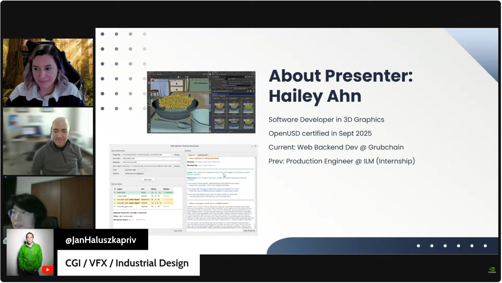](Pics/WhatYouShouldKnowAboutContentAggregation/ContentAggregation_8h20_27.png)

5:37
tools in USD. This is a tool in Houdini that I'll probably show later in today. Um this one not today but Etsy diagnosis
5:44
tool for USD. And um yeah I actually wanted to ask um what are people's
5:50
backgrounds here? Um are you coming from robotics? So using MV Nvidia Omni Birds
5:55
or um anyone from animations, VFX or any other fields?
6:01
That's a great question. Yeah, if you're here listening live, you can post in the chat. Um what is your background? Why do
6:07
you want to learn OpenUSD? How long have you been learning is a good question, too. Yeah. What about you, Maddie? Mattie's a
6:15
longtime. Oh, man. Um I think it's been eight years now.
[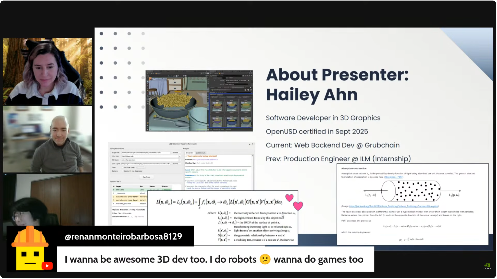](Pics/WhatYouShouldKnowAboutContentAggregation/ContentAggregation_8h20_49.png)

6:21
What? Not not quite of the first uh people that that learned USD. Uh there's
6:27
definitely people at Nvidia that that surpassed me, but uh one of the first adopters.
6:33
Yeah, that's a pretty long time. I actually haven't been like a for like using it for long. Um I recently got
6:39
into it. Um so yeah, for me um I actually come from a mathematics
6:45
background. So this is a rendering equation by the way. This is the volume rendering related equations here. So I
6:52
confirm math and then I went in the VFX and it was pretty related. So reason I'm
6:57
bringing this up is that um our math people um if we have something to
7:02
understand. We really want to understand it. We don't like wordy stuff. We don't like all the um the jargon, business
[](Pics/WhatYouShouldKnowAboutContentAggregation/ContentAggregation_8h21_09.png)

7:08
jargon. We we really want to know how this works and how to actually use it.
7:14
So this is [gasps] um this is the topic of general idea of today and in particular I will be
7:22
talking about content aggregation. Content aggregation or how to actually deliver a piece. So that's the topic of
7:29
today. Uh for more details these are the six topics I'm going to cover today. Uh
7:35
so how to move this asset into a folder without breaking everything downstream. Yes you can. How to not load 50 million
7:42
polygons only to change a site color and how to be kind to the pipeline by using
7:47
model kinds. So uh back to the problem. Um so actual
7:53
question where do we put this mug? Do we put in sub layers cuz it's the immediate change between variances cuz that's the
[](Pics/WhatYouShouldKnowAboutContentAggregation/ContentAggregation_8h21_12.png)

8:00
good choice. What do we do? And in fact there's a important idea behind this to
8:06
um consider consider. So there's four pillars that we really have to know. It's called um SD4
8:14
principles of open USD. Uh first legibility. Um the name probably is
8:20
suggest what they are and each of them. So it it's an important idea probably come up in certificates but I'll just
8:26
briefly mention what they are. Legibility. Yes, you have to read the read the names of asset and understand
8:31
what they are. Modularity. Um many people should be able to collaborate
8:36
without stepping on their toes. performance. We don't want it to be slow. We don't want to spend like 10
[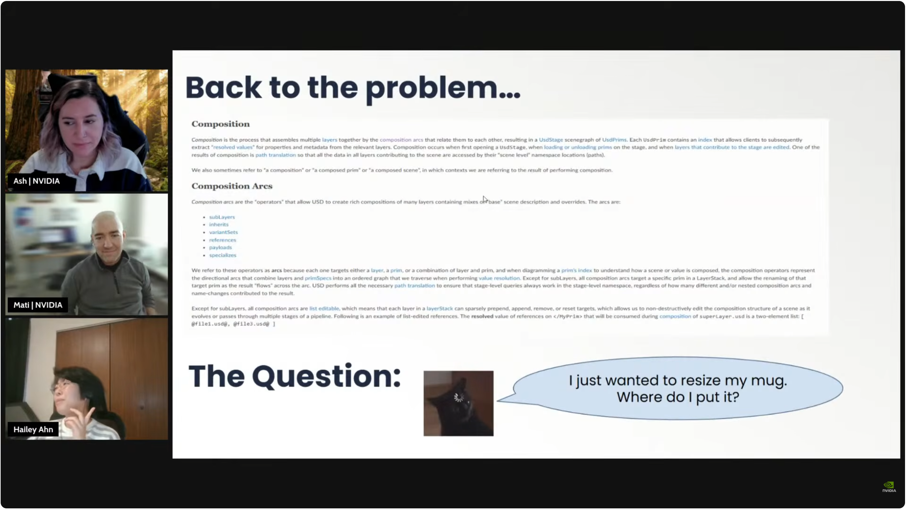](Pics/WhatYouShouldKnowAboutContentAggregation/ContentAggregation_8h21_22.png)

8:42
minutes just loading up the scene just to check small things. Navigability, we shouldn't have to um dig into 40 depths
8:49
of the hierarchy just to find some asset them. And that's that's just the four pillars. Yeah, I did put the
8:55
explanations here. Um but that's the general idea. So, keeping all these in mind, I'm going to um give an example
9:03
question. So um question it this it should be an
9:08
easy one. So uh actually I believe we do have a poll feature. Are we able to use that?
9:16
A poll feature. Yes. But [laughter]
9:21
maybe our very kind Amelia in the background there. What do we want to put in the poll? This question you want to
9:26
see if anyone can answer it correctly. Yes. How about they just put in the chat if they're watching live? If you're
[](Pics/WhatYouShouldKnowAboutContentAggregation/ContentAggregation_8h21_26.png)

9:32
watching live, what is the answer to this question? Is it A, B, C, or D?
9:38
Yeah, I think CH should be enough. It's more like um I'm guessing before like actually putting time to think about it.
9:44
So, I'll just start reading the questions. So, an assess internal geometry hierarchy uses primo final
9:51
retrie materials latest and rig backup. What issue does this create? Uh, option
9:57
A, the version suffices will trigger USS automatic versioning system incorrectly.
10:02
Option B, prims containing final latest violate the USD specification reserved
10:08
keywords list. C, the naming makes it unclear which prims are public versus internal. Uh, D. They are perfectly good
10:15
names and demonstrate their state. The next version of the geometry could be named geo v4 final. What's the answer?
[](Pics/WhatYouShouldKnowAboutContentAggregation/ContentAggregation_8h21_34.png)

10:23
Uh, I I I'm going to say D.
10:30
Sounds great. Perfect. Anyone else? Do anyone else agree?
10:35
Someone says B. Nice. Um, actually, I'll go on to the answer. Uh, where's my mouse? Yeah, here
10:43
we are. The answer is C. Um, just to go over the options. Uh, USS automatic versioning is not a thing. There's no
10:49
such thing. Um, if we want to do version, we have to implement it outside. That's not a thing. Uh there's
10:55
no reserve courses list or at least they're not these. Um it's just the namics makes it unclear which are public
11:01
versus internal like someone from downstream looks up the uh Joe final victory and they wonder okay can I can I
[](Pics/WhatYouShouldKnowAboutContentAggregation/ContentAggregation_8h22_04.png)

11:08
refer refer to this um prim and changes texture or something um and um that that
11:14
can be a problem. Uh by the way let's not do this. Let's not name them um final final. Uh so um that was our first
11:23
question. Um wrapping up the four four pillars. Um I just wanted to mention it briefly is not something deep.
11:29
Okay. I'm zero out of one so far. Failing there. There's four more. So we're fine.
11:36
Actually a chance to redeem myself coming up. So uh by the way, any questions so far?
11:44
No questions yet. Yeah, we're good. Yeah. Yeah. This is um yeah, if if someone types in um com uh in the
11:50
comments, I'll probably see that. Anyways, so um second topic, um can I move an asset into a folder without
11:57
breaking everything downstream? So, uh yeah, second question. Um there's
[](Pics/WhatYouShouldKnowAboutContentAggregation/ContentAggregation_8h22_23.png)

12:04
two problems with the structure. Can anyone guess what's the struct What's the problem here?
12:13
Yeah, uh there's probably a video delay that I just didn't expect. So I probably won't see the answers like even even
12:19
people um um immediately but so I'll actually um um just start explaining
12:24
these. Okay, first of all we see um home/Haley. It's probably not going to work as Ash's
12:31
laptop if um because it probably wouldn't have a pass called Haley or M's laptop. So we definitely want to use a
12:38
relative pass instead of the hardcoded one. Second problem's a bit um more
12:43
difficult to catch. I would say it's about encapsulation as is the reason I brought up this whole problem to bring
12:50
up encapsulation. So imagine someone's downstream they want to change the texture of the seed mesh. So they
[](Pics/WhatYouShouldKnowAboutContentAggregation/ContentAggregation_8h22_26.png)

12:57
referred to chair/jio seedmash and then um they realized um and then
13:05
the asset artist realized oh uh we actually want to divide the seat mash into the upper mash and lower mesh or
13:12
they want to change the structure but now we already have independence we cannot change it or worse we might not
13:18
know if we can change it or not. So a better structure will be okay first of all let's not use hard-coded absolute
13:25
paths um better structure will be dividing into um something public versus something internal so this in this
13:33
structure uh downstream can refer to anything inside looks we know not to change anything inside looks but the
13:39
actual structure actual geometry act actual texture should be all in internal and the artists are free to change
[](Pics/WhatYouShouldKnowAboutContentAggregation/ContentAggregation_8h22_48.png)

13:45
whatever that's in internal uh just one thing to point out. So it looks an internal or NBDS only versus
13:53
recommended convention. It's not an uh USD requirement and it's probably not
13:58
going to come up in the exam as it like as like this. So um yeah, alternative
14:03
method can be uh meta using metadata hidden or different names for looks. This an example. So just keep the idea
14:11
of encapsulation why it's needed and like this is not a hard rule. So uh that
14:16
was our second problem. Yeah, that's a good call out. There there are things that are just by convention, uh, right
14:22
in USD, uh, different people will use different names and so, uh, sometimes people will just continue that trend
14:28
without realizing, oh, I could name it whatever I want. It's not doesn't need to be hardcoded. Right. Right.
[](Pics/WhatYouShouldKnowAboutContentAggregation/ContentAggregation_8h22_52.png)

14:34
That is so funny. I did not know that. How long have I been working with Omniverse and OpenUSD? I just thought
14:40
that was like an expectation of OpenUSD. I'm learning a lot being in this live stream today. The other the other one is
14:45
the the top level world prim that everybody uses that uh it's like it's like gospel at this time that
14:51
right I actually learned about this whole thing while preparing for the presentation. So it was a learning opportunity for myself too.
15:00
So uh yeah so um I wanted to put it more more structured so more formal formal
15:06
explanation here. So default prim is it's just a chair here. It's called a default prim. the designated entry point
15:13
that um that if someone decides to refer to a file refer to an asset they will
[](Pics/WhatYouShouldKnowAboutContentAggregation/ContentAggregation_8h23_23.png)

15:19
expect to enter from this chair pass. So and that's the base of the interface and
15:25
the encapsulation is the whole idea of hiding an SS messy internals such as we
15:31
saw here geo goes into internal textures whatever um backup vinyl can all go into
15:36
internal we probably shouldn't use that but it can all go into internal and that's the whole idea of encapsulation
15:43
so yeah could be implemented in many ways but the idea holds so uh that's as interface and uh Next
15:52
topic is actually uh probably uh the one that is most important from today's
15:57
topic I would think. So it's how to not load 50 million p polygons only to
16:02
change like color or site size. And you sure you don't want to do that? You're 100% sure you don't want to load
[](Pics/WhatYouShouldKnowAboutContentAggregation/ContentAggregation_8h23_47.png)

16:10
your scene all over again. I'll have to admit there are cases where we want to load everything and use the
16:16
time to grab some coffee and claim, oh yeah, uh my scene is loading. I'm not able to load anything. Good idea. But
16:22
okay, sometimes we we just want to go um go and do the work, not wait for 10 minutes, 20 minutes. So, uh yeah, the
16:29
I'm going to talk about the reference payload pattern using um Houdini. Now,
16:35
uh the reason for choosing Houdini over USD or any Maya or Omniverse, um it's
16:41
just I'm I'm the most used to this, so it's just me. So, um uh okay, a bit of
16:46
credits here. Um this is a Pixar's kitchen set. It's not made by me. I cannot create this magnificent scene.
16:53
Here is is one of the um example scenes made by Pixar. Pixar made USD. Pixar
[](Pics/WhatYouShouldKnowAboutContentAggregation/ContentAggregation_8h23_51.png)

16:59
made this scene. So, they probably know what they're doing. I find this a really good um scene for testing. So, um that's
17:05
that credit there. So, um this is Pixar Kitchen set. I um imported this as a
17:12
reference layer. Reason for reference, I was just being lazy and everything reference everything. So um yeah I'm
17:18
going to um show how the reference payload works in real um scenes. So I'm
17:25
going to open a solaris um by the um solar is the name of the internal process of Houdini working with USD. So
17:32
if you see Houdini Solaris you can just understand Houdini USD that's the same thing Solaris is USD. So, um I'm going
17:39
to go to layers because they have a really good feature of
[](Pics/WhatYouShouldKnowAboutContentAggregation/ContentAggregation_8h24_05.png)

17:44
I can see everything inside the uh scene. I'm going to expand this.
17:51
So, um I should have saved it on a different path. Sorry, it's the path is super long.
17:57
So, um okay, this is a kitchen set. Uh, I'm going to look at a bold because I
18:02
was already clicked on it. And um, yeah, this is a reference layer.
18:08
Okay, how do you know this is a reference? I'm just going to quickly show you that this is a reference. Um, I I wasn't going to click on that.
18:15
Anyways, uh, bowl. Uh, here's a bowl. Yeah. So, this is a bull. USD file that
18:23
is referenced into this file. Oh, I lost it. Bull. Here it is. Yeah. just proving
18:29
that this is indeed the reference layer. So we have a reference layer go we
[](Pics/WhatYouShouldKnowAboutContentAggregation/ContentAggregation_8h24_19.png)

18:35
reference a B we open this US file to see what's there we have some variance
18:40
and where is the polygon data we don't see the polygon data here the reason for
18:46
this is that um we have a concept of payloads um that are that we can choose
18:51
not to load when booting up the scene. So um if we expand this payload this payloads actually um getting a reference
18:58
inside but this everything is inside a payload. So all these heavy um polygon
19:03
data whatever vertices uh points everything are inside a payload and then
19:09
we put it we put the payload inside the reference and the reference has all the metadata. So this is a mo this is a
19:16
pattern um where um we can sometimes not decide to load the payload. We we're not going
[](Pics/WhatYouShouldKnowAboutContentAggregation/ContentAggregation_8h24_32.png)

19:23
to bring in anything inside the payload but we'll still be able to know where's the ball where what's the variance
19:28
what's their metadata. So that's a good pattern. Um now um a lot of uh other
19:34
software um offer easy way of um not loading um the payloads and hooding is a
19:40
bit more tricky. I have to work with nose. I didn't prepare that. So just just know that the payloads are can be
19:47
loaded when wanted versus reference can all just um contain all the metadata.
19:53
So uh putting more formally so reference is a metadata layer. It can contain
19:58
composition or experience sets and assess structure everything. By the way, when I say reference is this this I mean
[](Pics/WhatYouShouldKnowAboutContentAggregation/ContentAggregation_8h24_39.png)

20:04
in and this within this pattern reference can do a lot of things. So reference is the lightweighted we always
20:10
loaded layer contains all the data. Payload is a payload. It's the heavyweight layer geometry content
20:17
everything is loaded on demand and it is a probably a culprit that takes like 10
20:22
minutes unloading when we have a really big scene. So yeah, if this means loading 10 minutes to just um show uh
20:30
and we just want to do small things, just don't load the payload. That's better. That's simple.
20:36
Uh so a lot of talking. I'm going to go on to a third question. Um so uh yeah,
20:43
question number three. So when we're implementing reference payload pattern we just saw, what should be authored in
20:49
the reference layer above the payload boundary? Okay, option A, variant set definitions. Uh, option B, high
[](Pics/WhatYouShouldKnowAboutContentAggregation/ContentAggregation_8h24_58.png)

20:57
resolution geometry with millions of polygons. Option C, asset metadata such as kinds of aset info. D, the
21:04
subdivision surface data for render time distillation. There's two answers. Can we guess what's the answer?
21:10
All right. Oh, you want me? Okay. I've been studying and I feel confident
21:16
in this. If there's two answers, I'm going to say it's A and C. And I'm
21:21
staring at Mattiey's face when I say this to see if Maddie hates me. Now,
21:27
[laughter] let's uh let's reach out to the chat to see if uh if they agree with you.
21:32
Okay, chat, put your answers in the comments.
21:38
Do you agree with me? Is it A and C or am I wrong? You could just say Ash is
[](Pics/WhatYouShouldKnowAboutContentAggregation/ContentAggregation_8h25_08.png)

21:45
wrong. Ash is right. I would prefer if Ash is right.
21:51
And if I see you at GTC and you said I was wrong, I didn't see you at GTC. [laughter]
21:57
I'm thinking a lot of I agree and the same answers. Nice job. So yeah, uh good news. Yes, ANC Ash is
22:04
correct. Yeah. So um varian definitions asset metadata, they're all lightweight
22:10
metadata and we want to see without loading the whole payload. So it goes in the reference layer. high resolution
22:16
geometries of different surface data they all go into the payloads.
22:22
Uh so uh that was the question uh that was reference and payloads and the next topic asset
[](Pics/WhatYouShouldKnowAboutContentAggregation/ContentAggregation_8h25_58.png)

22:29
parameterization something better than just duplicate the uh same asset 15 different times and
22:34
then assign them different colors. So um I'm going to show again and Houdini
22:40
because Hudini I like Houdini. Um, and I'm going to actually go into uh I'm
22:46
going to show the tree. So, this is the tree that the for the USD you can see a
22:51
lot of information there. Um, and um the so the cool thing about variance is that
22:57
it's easy to just switch. So if we we want this bowl to be pink,
23:02
one way is to go into textures, go into the file, look at where textures are at,
23:08
browse all the textures and and change it and then um few minutes later I get contact from the team. I actually prefer
[](Pics/WhatYouShouldKnowAboutContentAggregation/ContentAggregation_8h26_19.png)

23:14
the purple. Can you change back to purple? I go into the file, look at all the materials again, change it to
23:20
purple. We don't want to do that. So we see a bowl here. We just go to variants.
23:25
Uh it's a model only variant because it's made that way. Um, and we just click on bubble B. And yay, I got it
23:32
changed. And bubble B. We can just try a bunch of things here. Like we can go to
23:38
this crayon and we can uh make this crayon green, purple crayon, and it just
23:45
changes. So that's that's variance. Um, good thing of it. Um, we just we don't have to go rocket science about changing
23:51
materials inside. We don't need much knowledge on it. We just check it's it's all parameterized. That's as a
23:57
parameterization. Now I'm going to actually introduce something more that I have made. So
[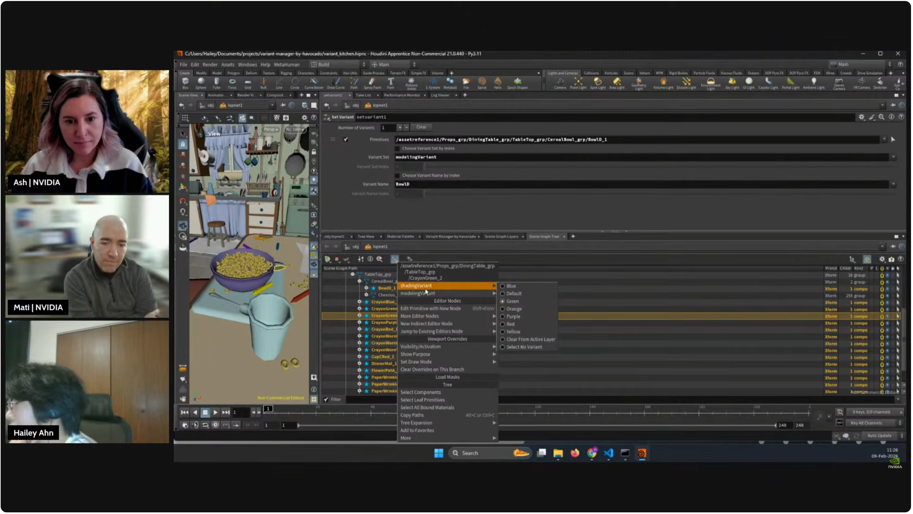](Pics/WhatYouShouldKnowAboutContentAggregation/ContentAggregation_8h27_25.png)

24:03
okay, something convenient with this. Okay, this one we know that there's colors, but what is this like? Uh what
24:10
was this uh chair B modeling variant? Uh chair A, chair B. Uh what changed? Uh
24:17
chair changed. Yeah, what is this um chair variant B here? It's kind of like
24:24
difficult to see without actually changing. So I made a tool where um I just sell the chair. I go to comparison.
24:32
I uh increase the uh size so I can see better. And I just click on preview and
24:37
it shows the difference. That's a tool I made. Uh yeah, pretty simple tool except for GI development. So if you know USD
24:44
coding, this this is like not difficult to do. So yeah, that's the tool that I
[](Pics/WhatYouShouldKnowAboutContentAggregation/ContentAggregation_8h32_48.png)

24:50
made in Houdini just for convenience. I do I do want to pause here and just call
24:55
out that like this this is the kind of work that that we expect from open developers to be able to do, right? Like
25:01
you found you found something that was maybe challenging for an end user uh and you made a tool to make that work better
25:08
uh for them. Yeah, I actually find USD pretty good in that cuz um it's a really popular tool
25:16
but not many people are like a lot of people are using it but not many people can actually modify and develop tools.
25:22
So if you find something and you know how to code, you know how to use it, it's a really um good area to make tools
25:29
that actually have impact on as users. Very cool.
25:34
So uh yeah, that was um asset parameterization. That was actually one way of doing um asset parameterization.
[](Pics/WhatYouShouldKnowAboutContentAggregation/ContentAggregation_8h33_40.png)

25:40
What did I click? Uh yeah, let me fix that. Yeah, that was
25:46
parameterization. And there's actually one more way to do a set parameterization. So preverse I
25:53
wanted to really briefly mention on it. It's it's not the uh difficult topic if you understand what it is. So uh
26:00
sometimes when we are choosing variants we sometimes don't want to do like blue ones, green ones. Do you want to um
26:06
actually have a sidebar or like something parame like parameterized or
26:11
um something you just change one value and it changes everything such as your roughness value and then that can be
26:18
that's like difficult to do variance because variant we you have to have discrete discrete sets.
26:25
So prints are like attributes. They're very similar to attributes, but they can be interpolated. And there are second
[](Pics/WhatYouShouldKnowAboutContentAggregation/ContentAggregation_8h34_23.png)

26:32
way of doing asset parameterization. So uh yeah, and there's a thing that um
26:38
since you're only changing one value, it's really um simple in saving in the US file. It's just number changed, but
26:45
you're probably going to pay the cost and shader like later. So uh yeah just just remember that it's
26:52
like attributes but they can be interpolated bars. That's probably the main thing about this concept.
26:58
Yeah. And uh yeah uh fifth topic of the day is
27:04
lofting and work streams. Another fancy words here. It's not actually that deep.
27:10
So uh I'm going to start with a um question again because workstream is a pretty simple concept. So question
[](Pics/WhatYouShouldKnowAboutContentAggregation/ContentAggregation_8h34_29.png)

27:17
number four um a production asset has geometry materials and rigging authored by three
27:22
different artists. Which layer structure best supports parallel collaboration? Option A, prefix everything like a geo
27:30
something, matt something, rig something. So everyone knows what not to touch. If you're working on geo, you don't touch material at all. You don't
27:36
touch rig at all. Um option B uh use single file for efficiency and use git
27:42
to automerge the USD layers ers because git is great every program use get
27:49
really good tool for code collaboration. Option C uh use separate layers compos
27:54
as love layers and the payload. D hold weekly meetings where everyone takes turns editing the file while the others
28:00
watch on Zoom. What's the answer here? Can everyone take a guess?
[](Pics/WhatYouShouldKnowAboutContentAggregation/ContentAggregation_8h34_55.png)

28:07
Well, as much as I love D and it's my favorite
28:13
way to work, it's not D. That I can say confidently.
28:19
Are you sure? Might be the most uh effective way. Well, you know, be funny if we're like
28:26
in a studio and we're all in person, but we still get on Zoom to watch each other work. That's super efficient. Okay. So,
28:33
I want it to be a I'm I'm thinking about like process of elimination here.
28:39
A doesn't make sense because like you still that's not a lot of
28:44
information for not knowing what's what to touch. B single file to merge
28:50
that seems like to me that seems scary. I love git but merging into one auto
[](Pics/WhatYouShouldKnowAboutContentAggregation/ContentAggregation_8h35_06.png)

28:56
merge all the layers seems really terrifying. Good boy. Um, and then C is using
29:01
separate layers. That would make the most sense to me because like if I'm a part I'm in charge
29:06
of geometry, I'm only touching the geometry layer or materials or raking or lighting, whatever. So, I'm going to
29:13
process of elimination. My brain says C. Good. I think you've got some agreement in the
29:19
chat. I'm gonna pass the certification. Is this based on this?
29:26
Yes, actually ash is correct here. Uh the answer is C. Um so um prefixing all
29:32
attributes. Okay, that is a good practice but that's not like what we do for parallel collaboration.
[](Pics/WhatYouShouldKnowAboutContentAggregation/ContentAggregation_8h36_01.png)

29:39
Um using single file and using git. Um let's not do that. Um it's not the best
29:44
thing here. I like but it's it's not the best one here. Um hold weekly meetings. Okay, that's going to be fun, but let's
29:51
not. Uh so yeah se using separate layers composed sub layers is um is called a
29:57
workstream. Workstream is just a fancy talk for give give each department their own layers. So we just have sub layers
30:04
and um it's um that's workstream. So nothing nothing to deeper
30:11
and uh yeah next topic is lofting. Okay lofting sounds fancy but it's nothing
30:16
special. So it's just the concept of exposing info from payload updated reference layer because the important
30:22
part of payload was that we might decide not to load the payload for and working fast but we might also see want to see
[](Pics/WhatYouShouldKnowAboutContentAggregation/ContentAggregation_8h36_37.png)

30:30
what variants are there what's um what's the information there so this lets
30:35
people see what's available without them having everything loaded 20 minutes. So
30:40
um quickly demo because we do have a good example of loafing in this in the
30:46
scene. I'm going to demonstrate that. So we're going to use this bowl. Um so
30:53
um okay we see this varian set. Okay we have pool A B C D F but we have nothing
31:00
here. This like a meaningless variant set here. What it's actually doing is
31:06
this variant set here is defined somewhere inside the payload
31:11
uh model variant and let's see if I can see search for oh huh I guess I'll have
[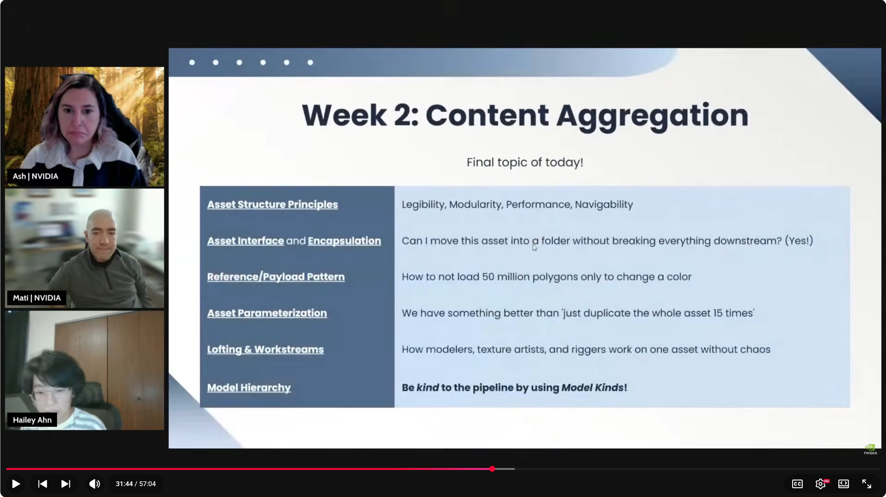](Pics/WhatYouShouldKnowAboutContentAggregation/ContentAggregation_8h37_19.png)

31:18
to go b a b a and uh yeah there's all the
31:27
definitions here but these are all invisible if we decide not to load the payload at all so we just lost it Here
31:34
we just pull it up and then now everyone can see there's a variance set from this reference layer. Uh that's a pretty
31:42
simple concept lofting. So um that was lofting. That's it.
31:48
So uh going to the um last topic of the day. Um yeah that was lofting our work
31:54
streams. Uh last topic of the day model hierarchy. How to be kind to the pipeline by using model kinds. I'm a bit
32:01
of proud of coming up with this. Um anyways um yeah model hierarchy.
[](Pics/WhatYouShouldKnowAboutContentAggregation/ContentAggregation_8h37_53.png)

32:08
So there is three different kinds of model kind. There's different three different types of model kinds. Um so
32:14
there's component components like the um leaf elements of the model hierarchy. They're like complete assets ready for
32:20
rendering something like the smallest unit. For example, a robot can be a component. A bowl a ball can be a
32:27
component. A cup can be a component. A building can be a component if it's inside a city.
32:33
um assembly if we um um grab some um a lot of asset and uh we put together and
32:40
if we create something that's assembly so for example we have the dining table we have the cutting board we have the
32:47
fridge and then those components make up a kitchen then we can call that's a kitchen assembly uh or if we have a lot
32:55
of machines we have some I don't know um uh vehicles from the factory uh we can
[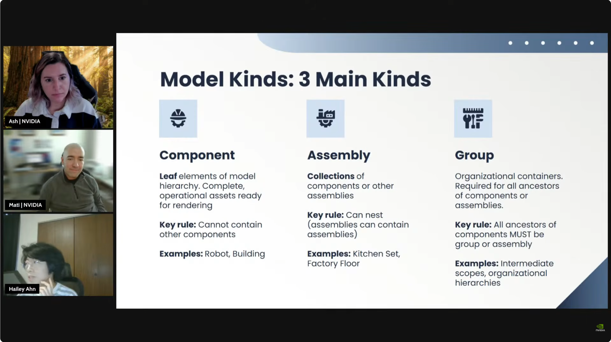](Pics/WhatYouShouldKnowAboutContentAggregation/ContentAggregation_8h37_56.png)

33:01
call that a factory three floor assembly. So assembly is like the collection does is meaningful.
33:08
Group on the other hand is really similar to assembly but they're more of a organizational containers. So there's
33:14
just foldering. Um um if we say uh want to grab the props in the kitchen and we
33:20
want to um put it in a folder, we make that a rule. We don't make them in assembly. So it's more like um division
33:27
difference of does and does have a meaning. If this has a meaning, it's an assembly. If it's more organization,
33:33
organizing for um um artist purposes, management purposes, that's a group. So,
33:38
I'll uh show an example of this. Um so, okay, back to this kitchen set. I
33:47
really like this kitchen set. It's a good example. So, uh scene craft tree.
[](Pics/WhatYouShouldKnowAboutContentAggregation/ContentAggregation_8h38_04.png)

33:52
We actually can see the kinds here. So, this is the kinds. This is an assembly.
33:57
uh but it's called in set reference because I have this the layer named as I can call it as kitchen
34:04
set or and uh something like that. Um and we have a kitchen set. It's an
34:09
assembly. Uh the original file named the kitchen set I just is it's just a name of the reference um importing layer. So
34:17
uh this is an assembly because it makes sense. It's the full kitchen. It's like a unit of managing it. However, the
34:25
architecture group. Okay. What's the meaning of this architecture group? It's just like a kitchen minus the uh dinner
34:32
table. I think it's not really meaningful, but we we still wanted to put this into a folder. So, we make this
[](Pics/WhatYouShouldKnowAboutContentAggregation/ContentAggregation_8h38_54.png)

34:39
a group. And finally, okay, kitchen's a component. Oh, okay. Um, let me check
34:46
why kitchen's a component. Oh, yeah, that's the I think that's a building.
34:51
Yeah, building itself becomes a component. The chair is a component. Uh,
34:57
another chair is component. Kitchen table is a component. We have a group here. Tabletop group. Um, tabletop
35:04
doesn't really make up something meaningful. It's not a robot. It's not a kitchen. So, we called it a group. Uh,
35:10
crane is a component. Um, flower is a component, spoons and component. And important thing about component is we
35:17
cannot um put components inside component. We cannot put anything inside component. So if we expand these
35:23
components don't have any different kinds below because they're like the the
[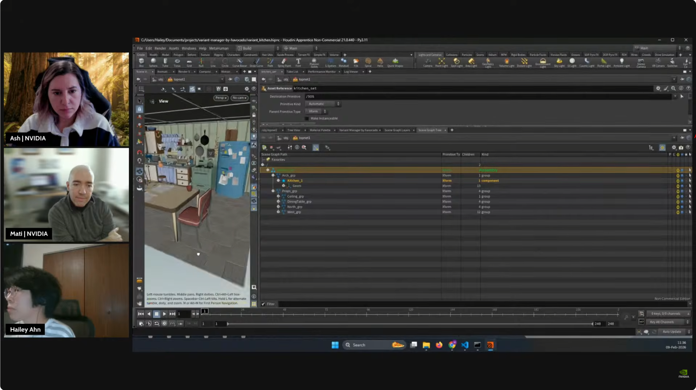](Pics/WhatYouShouldKnowAboutContentAggregation/ContentAggregation_8h39_58.png)

35:28
smallest um unit of asset they're they're owning. So that's the example structure. So
35:34
remember that groups are more like organizational folders as assemblies are something more meaningful.
35:41
Cool. So uh that was there's a question in the chat that I think we can Yes.
35:46
Yeah. Answer right now. Yeah. Should the assembly or group be placed in a separate file?
35:53
Uh yeah, good question. So assembly and group can be just stacked like um in a
35:58
hierarchy. So um uh we did see that there were groups inside a group. For example, props group is a group. It's
36:05
inside assembly. Assembly can go inside a group. So groups assembly there are more like folders. Uh versus component
36:12
there it is own thing. There are the leaves and uh like leaves of the model hierarchy. So there's a rule uh
[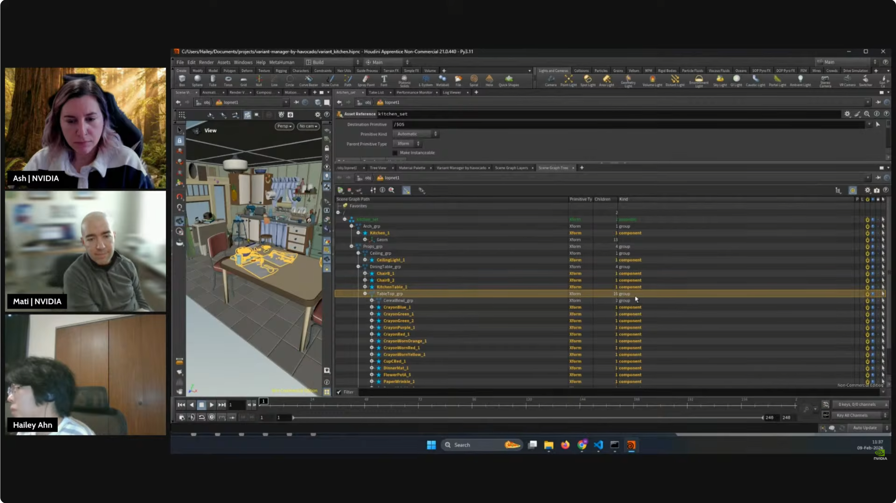](Pics/WhatYouShouldKnowAboutContentAggregation/ContentAggregation_8h42_43.png)

36:19
assemblies can nest and for um all the ants of components must be group or
36:24
assembly like components cannot just sit there without some parents. They have to be inside the either assembly or group.
36:32
Yeah, I I will clarify um because the question asked about uh separate file.
36:38
Oh, a file. The I think the the better way to look at it instead of file is is asset an
36:45
asset package because a NASA could have lots of files, right? Um so which of these kinds uh would be
36:51
better should be considered as like its own package versus maybe uh something
36:57
that is contained within another or defined only within another uh within a
[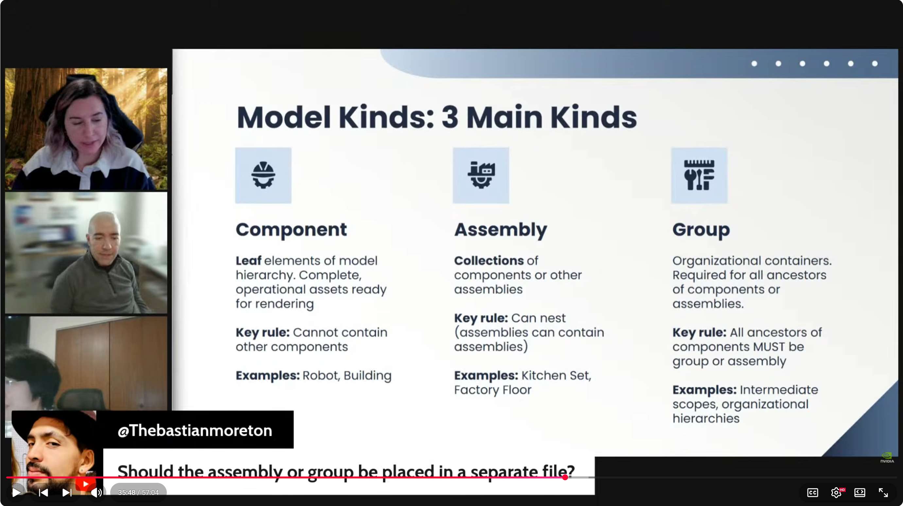](Pics/WhatYouShouldKnowAboutContentAggregation/ContentAggregation_8h44_49.png)

37:03
particular package. Okay. um as far as I know okay there's no set rule so this is should be more of
37:09
a convention than a rule um these are assigned to um each of the u adset or
37:16
groups like in on the hierarchy so there's no requirement in terms of
37:21
practice I'm not really sure um let me just see uh let's see if there's um such
37:28
um things that like several [clears throat] several groups and uh
37:34
um oh Yeah, we are seeing that groups are being stacked inside the um the uh
37:39
uh what's that this layer where we have an assembly, we have groups. So yeah, there's no requirements for um being in
37:45
a separate file. Yeah. So groups are are purely organizational and and uh I see uh Papa
[](Pics/WhatYouShouldKnowAboutContentAggregation/ContentAggregation_8h46_25.png)

37:52
has has a question or had a follow-up question that's about that. Uh so you can do groups within groups. uh
37:58
the component and assembly it's good to think of those as publishable assets or
38:04
assets that you're tracking. So uh in in a studio it may it may be uh units of
38:10
work that uh that then get passed around. So I made this character I
38:15
modeled it and now somebody else is going to surface it and so on and so forth. uh in a industrial uh or or
38:22
engineering use case um these are actual parts that you would use to build up your your assembly. So a part could be a
38:28
component and the assembly your your robot is is is an assembly of of that.
38:34
Um and you can uh shift those around depending on what's most important to
[](Pics/WhatYouShouldKnowAboutContentAggregation/ContentAggregation_8h46_48.png)

38:39
your workflow. So for some people a robot's a component, for some people it's an assembly. If I'm a robot maker
38:45
uh I probably care really care about all those little parts. If I'm a roboticist and I'm doing uh RL training, then um
38:53
then I probably think of it more as a component. It's it's one uh it's a small part of probably a larger environment
38:59
that I'm that I'm training in. But uh but then again, you could always still do assemblies of assemblies. So um you
39:05
you you want to make the call there as far as what how granular do you want to really introspect when you're doing your
39:12
work. Uh component being the cut off. Typically, I don't care about any of the
39:18
prep that's inside. I'm not going to be messing around with that when I'm working in my in my larger scene.
[](Pics/WhatYouShouldKnowAboutContentAggregation/ContentAggregation_8h46_51.png)

39:25
Yeah, thank you, Mari. I think Marty really made a good point. So yeah, in this example, if you're say um if we're
39:31
modeling a city and we don't really care what's in the building, then we can have a building single building as a
39:36
component versus if our whole scene is inside a building and we want to really model the windows or the each of the
39:43
floors, then this is probably going to be an assembly and we're going to have more components inside. So yeah, it
39:49
really would depend on what kind of scene are you're working on or what are you interested in. Yeah. And you can you can get these from
39:57
uh these are all overridable. So you could get a a robot that's an assembly
40:03
from somebody and you can decide actually for my workflow I'm going to ch change this into a component. So all you do is you make author an opinion saying
40:10
nope this this kind is now component. Uh and you may make a few adjustments after
[](Pics/WhatYouShouldKnowAboutContentAggregation/ContentAggregation_8h48_16.png)

40:16
that. But uh that's the idea is everybody can have their own opinion along the way.
40:21
Yeah. Yan brought up a a good question too. Are there any advantages to not defining the kinds?
40:27
Okay, I want to actually answer this because okay um not defining the kinds uh yeah um we we it's not like
40:34
requirement for functioning like even if we just scrap all of this like um remove all the kinds it's still going to work.
40:40
It's not a functional thing but but um please be kind to the pipeline by
40:47
using model kinds is a pipeline thing is for other people is for collaboration. So, um um
40:53
yeah, it's it's more readability, legibility. Yeah. So, you you'll have tools and and
[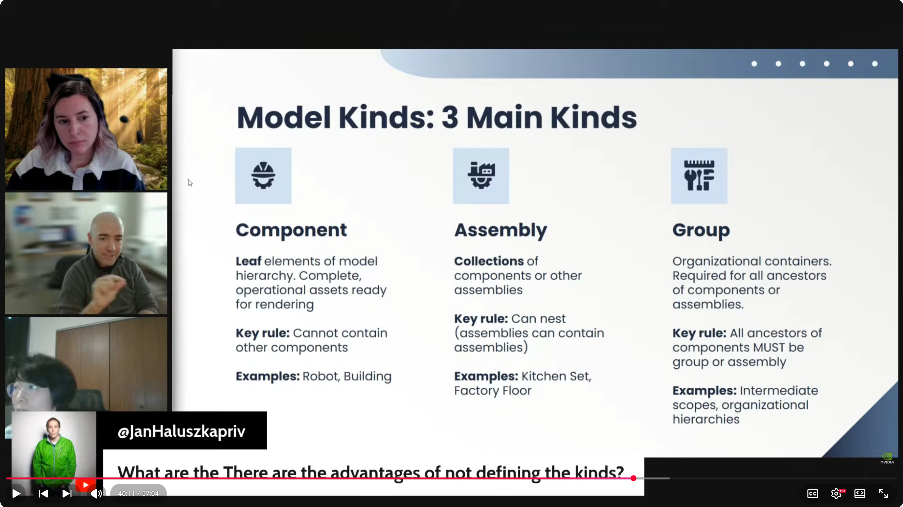](Pics/WhatYouShouldKnowAboutContentAggregation/ContentAggregation_8h48_34.png)

40:58
even like an uh your outliner, your your uh graph view of of your of your scene.
41:05
Some people may not care to see all the nuts and bolts and and they may want to be able to say have a view that's just the model kinds so that they can
41:11
interact with the scene without all of the complexity. And it also uh cut down on the compute when you're opening up
41:17
that that window to display all of that.
41:22
Yeah. Uh thank you. And um so that was model kinds and I'm going to um ask the
41:30
final question of the day. So example question what is the following primarchy violates the USD model hierarchy
41:37
contract. So option A world is we have a assembly of the world. We have props
41:42
group inside and we have a chair component. Option B we have a building assembly. We have a room assembly. We
[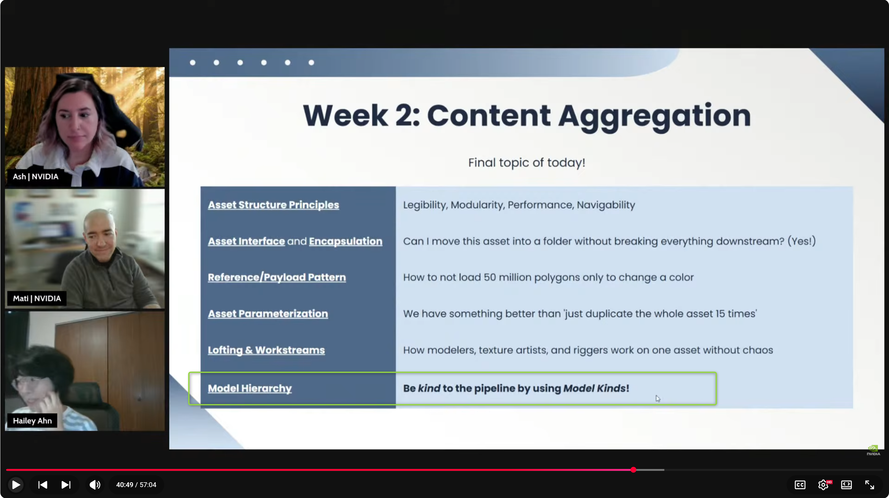](Pics/WhatYouShouldKnowAboutContentAggregation/ContentAggregation_8h49_22.png)

41:50
have a furniture assembly and we have a ch um chair component. Option C, we have a scene assembly. We
41:57
have a hero component and we have a wheel component. Option D, we have an environment group, tree group and O
42:04
component, no assembly. Um, any guesses? Easy peasy. Easy peasy. Because
42:13
components cannot be parents of other components. So, I'm going to go with C. Yes. Any other
42:20
guesses? Forged by Richard also agrees. C. Nice.
42:27
Yeah. Um you um Ash is correct here. So yeah, this is the answer. Components
42:33
cannot comp contain a component. They're like the leaves of the hierarchy and leaves cannot grow on leaves. So um they
42:39
cannot contain a component. Hero should be either assembly or group. I would say assembly would be a better choice here
[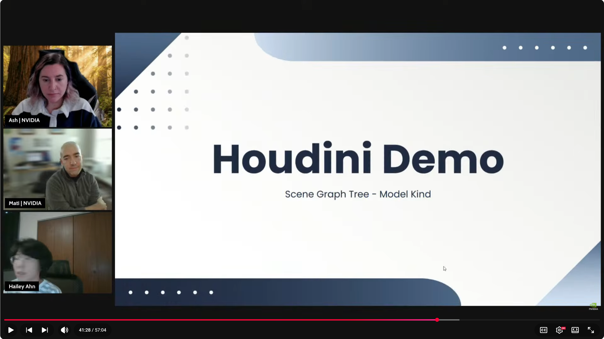](Pics/WhatYouShouldKnowAboutContentAggregation/ContentAggregation_8h50_29.png)

42:46
because here is not just an organizational container but it is a meaningful collection itself.
42:52
So uh that was the last question of the day and uh thank you very much.
42:58
Yay. Y I got an 80%. So yes, you're let Christa know that I
43:05
passed the open USD certification live here. Everyone saw it.
43:11
Congratulations. higher score than I did. I'll get a certificate for this one. Sorry.
43:16
Darn. Thank you, Haley. This was super fun. We do have a lot of questions, so we'll go
43:24
ahead and answer those, but if anyone wants to connect with Haley after the fact, her LinkedIn is up here on the
[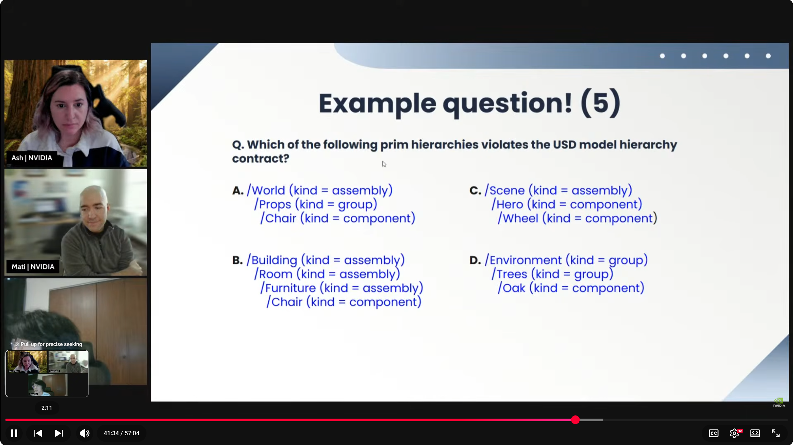](Pics/WhatYouShouldKnowAboutContentAggregation/ContentAggregation_8h52_15.png)

43:30
screen. Um, there is the open USD study group that is uh Nala time zone
43:36
friendly. So you can follow that link here, take a screenshot of it and then of course join our NVIDIA omni discord
43:42
where all these conversations are happening and we have the open USD study group um within that discord too.
43:50
Yeah, definitely. Um it's a really helpful place and study groups run by Nandu and thanks to him we are meeting
43:57
weekly every um Friday uh to um discuss USD uh new new things are coming up and
44:05
the discourse is really helpful. So let's go go on to questions.
44:11
So a question that was asked earlier um do you need to be a programmer to do the
44:16
exam? Oh, um yeah, go on. Uh so you don't need to be a programmer
[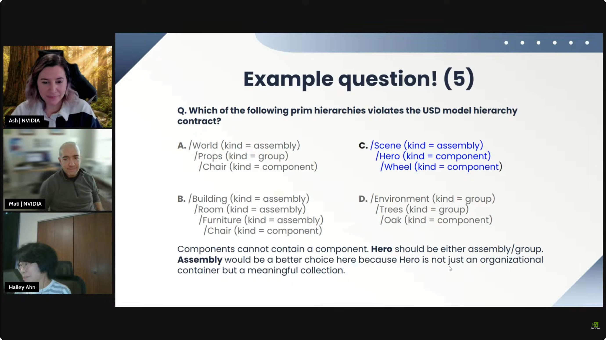](Pics/WhatYouShouldKnowAboutContentAggregation/ContentAggregation_8h52_44.png)

44:23
by trade, but uh there are code questions. Uh and if you look at the learnd curriculum, there there is code
44:30
there. So you want to be familiar with Python and and be able to um hack away at it on on your own.
44:37
Yeah, absolutely. Amelia, if we could put the Learn OpenUSD link um to that learning path in the chat or Matt, if
44:44
you grab it and put it in there, I think that would be helpful. If if you are not familiar with code um but you want to be
44:50
uh USD certified, go through the learn open USD learning path. It will help you with all of those questions um and be
44:56
able to confidently interact with code even if you're not super familiar with it. So highly recommend going through that learning path and it's all free.
45:03
Again, we love free. Yeah, I am a programmer. So I can't really speak for people who are not
45:09
coming from a programming background, but I do know that there are pe a lot of people like from BFX or other
[](Pics/WhatYouShouldKnowAboutContentAggregation/ContentAggregation_8h52_54.png)

45:15
engineering that who took the certificate and they got certified. So yes, yes, absolutely.
45:22
Another great question um from Yan is how do I force relative paths? This was
45:27
asked early on when you were showing that um an issue with the scene might be that you know it has homey.
45:35
How do we force that? Okay. Um, this one I'm actually not sure because I'm pretty sure it depends on
45:42
the editor. Um, like is it is it omniverse? Is it USD view? But um, yeah.
45:48
Um, would Marti would you know about it? Yeah, that's that's exactly right. Is um
45:54
I I think the CA applications they like they they prefer to author uh absolute
[](Pics/WhatYouShouldKnowAboutContentAggregation/ContentAggregation_8h52_58.png)

46:00
paths. Um, so it it is editor dependent. Um, and if you're writing your own code,
46:06
you you have complete control uh as to what you say. If you say absolute or relative, it it is you're going to get
46:13
what you what you ask for. Yeah. So, Jan is probably working within
46:19
um the kit SDK and it does do that. It does tend to uh default to absolute. So,
46:25
it's just up to the author of the file to go back. So, good call out. And then
46:30
another one that relates to the kit SDK if you are working between different frameworks is maybe Haley you can answer
46:37
this and this might be a question other people are struggling with when they're working uh cross collaboratively between
46:44
different applications that are using USD. So for Yan he's asking how do you set up the USD file inside of um Solaris
[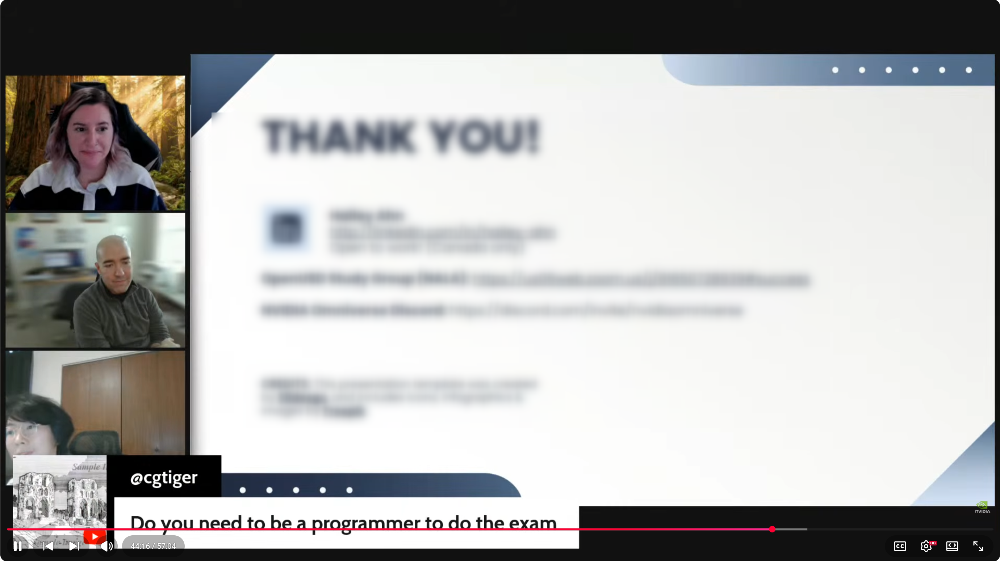](Pics/WhatYouShouldKnowAboutContentAggregation/ContentAggregation_8h53_36.png)

46:51
Houdini so you could still open it in Omniverse. Um, and they meant to keep
46:57
like they asked a follow-up question to that was like how to keep the same structure from Houdini to Omniverse when
47:02
importing exporting and importing your USD file between applications. Okay. Um, I don't think I'm the expert
47:08
in this for um, moving especially regarding Omniverse. I have really limited experience with Omniverse
47:14
itself. But I believe that Houdini will have its internal structure where um
47:19
okay it's going to have the root layer session layers and it's going to have its own tree. So and it has its own node
47:26
of exporting the USD file. So if you see the um if you see the internal um
47:32
structure is correct and what you expect inside Houdini then it should be um exporting correctly. But I'm sorry I I
[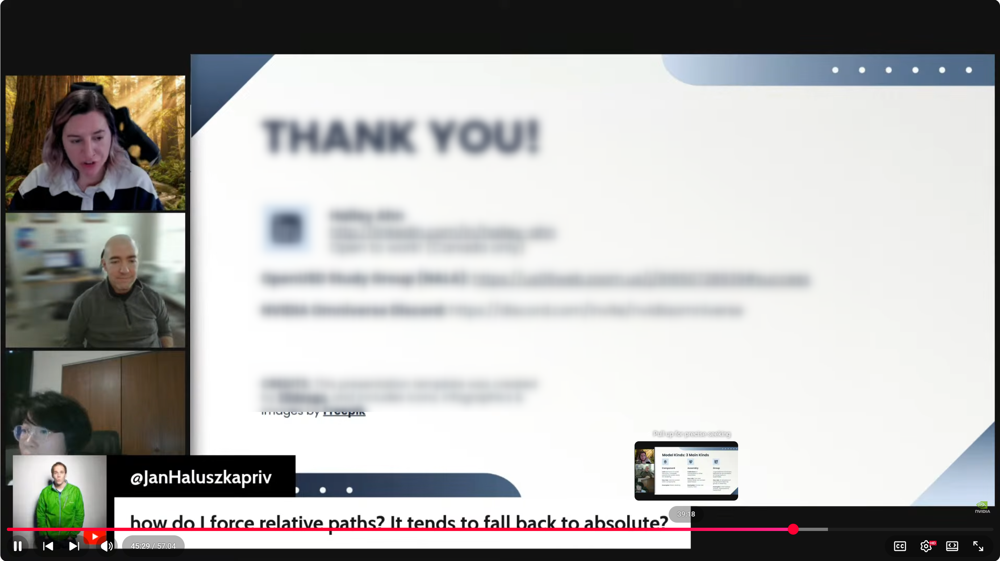](Pics/WhatYouShouldKnowAboutContentAggregation/ContentAggregation_8h54_13.png)

47:39
don't really know much about the compatibility. Um I think it should work. So I I'm not really um um familiar
47:46
with the uh problem. What's the What's the export node uh in in Houdini?
47:51
Um okay, it's one of the LP nodes. It's been a while. So I did this but uh should be one of the uh exports I think
47:58
or okay. Um should be somewhere related to um Okay.
48:05
I I do have to um look into this again as it's been a while. I did the export itself. But um I'm sure there's the way
48:13
like it hini really should be uh USD friendly. It looks like uh somebody's suggesting USD Rob.
48:20
Was it Rob? Yeah, I think that was the Yeah, USD Rob. And uh I'll have to link
[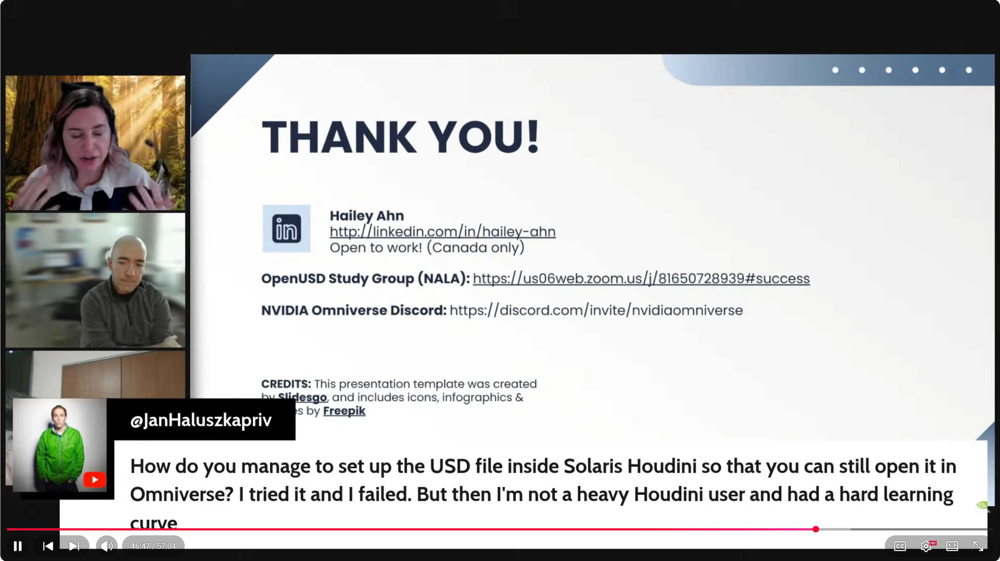](Pics/WhatYouShouldKnowAboutContentAggregation/ContentAggregation_8h54_52.png)

48:26
it from here and uh yeah, it should like have the all
48:31
the options. So yes, cool. Uh the other thing that I will uh plug is the Houdini also has a component
48:39
uh builder which I think uh could be valuable to look into in order to create a well structured
48:45
asset and export that out. Um for the most part uh any USD written out from
48:52
from Houdini should should work in in Omniverse. The incompat incompatibilities you're going to see is
48:58
primarily materials. Uh I I would imagine Oh yeah, that that would make sense.
49:04
Yes. Yeah. Thank you. Yeah, it can be a little tricky to pass
49:10
back information. Um, but as long as you're structuring your USDA with your best practices, then you'll probably run
[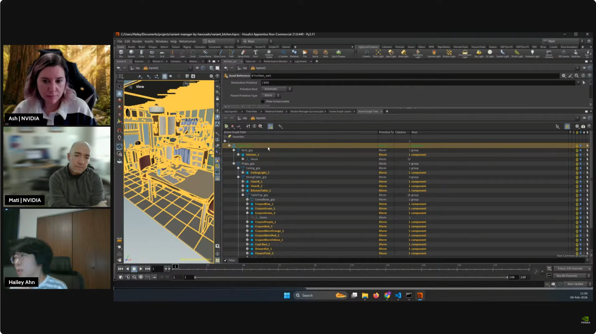](Pics/WhatYouShouldKnowAboutContentAggregation/ContentAggregation_8h55_23.png)

49:17
into less issues. Like I was talking to someone recently and an issue they were having was uh when they were moving from
49:24
one application into Omniverse platform the they had a default prim set up in
49:29
that application and a default prim set up in their uh Omniverse USD layer and they were conflicting with each other
49:35
and so one of the the solutions was just to remove that default prim in that one application when they're exporting like
49:41
have no default prim and so that uh the hierarchy could be slotted into the default prim of their of the kit SDK USD
49:48
file. So really simple stuff like that and just knowing the best practices of open USD can help you solve those really
49:54
quickly. Um and also utilize your your claude and your cursor and chatbt.
49:59
Sometimes um perplexity is really good. Like all of these applications can help you answer questions really fast or go
[](Pics/WhatYouShouldKnowAboutContentAggregation/ContentAggregation_8h55_28.png)

50:06
on Discord, go on forums, use your community, all the all great resources.
50:12
Yeah, that's a nice recommendation. Go ahead. I was just going to say D divvy also uh
50:17
recommended uh material X uh for for better interoperability of of materials.
50:22
So um yeah, you just have to be mindful of of what you're authoring into your USD and and how is it going to be is it
50:30
going to work where where you want to take it, whether that's uh materials or custom schemas or things like that.
50:37
Cool. Well, that was all great questions from the community. Thank you all for
50:43
asking such um inquisitive questions for us to really think hard about and um
[](Pics/WhatYouShouldKnowAboutContentAggregation/ContentAggregation_8h56_10.png)

50:51
help you on your journey to getting USD certified. Uh I do have some closing slides, but any last words from Haley or
50:59
Maddie here about what we just learned today in content aggregation? Uh yeah, thank you very much for um
51:06
attending and um yeah, if you have any more questions, feel free to um contact me. um LinkedIn's probably the best
51:12
place to message or um and uh or on the Omniverse Discord and thank you very
51:18
much. Thank you so much Maria and Ash for um um arranging and running this um
51:24
this uh session. Yeah, our pleasure. And we're so happy to have you on here and it's great to
51:30
have other voices speak about OpenUSD and and share their expertise. So, uh thank you for for coming on.
51:36
Yeah, thank you very much. Ash, would you like to share your own slides? Yeah, I will go ahead and share my
[](Pics/WhatYouShouldKnowAboutContentAggregation/ContentAggregation_9h03_27.png)

51:42
screen here. Yep.
===== TRANSCRIPT_END =====
</div>
