# What You Should Know About Content Aggregation — Video Deep-Dive Tutorial

**Version**: 0.3.10 | **Date**: 06.03.2026 | **Time**: 00:03 | **GlobalID**: 20260306_0003_USD_GoodStart_040

**Tag block:**
#openusd #content_aggregation #composition #layers #references #payloads #digital_twin #best_practices #certification #video_deep_dive

**Canonical Video Source:** [YouTube - What You Should Know About Content Aggregation](https://www.youtube.com/watch?v=LFCauWTNBM4&list=PL3jK4xNnlCVf3HuZD4qOWlKlouJyh6Prb&index=2) [1 - YouTube video](#link-1)  
**Presenter:** [Hailey Ahn](https://www.linkedin.com/in/hailey-ahn/)  
**NVIDIA Session Hosts / Contributors:** Matias "Mati" Codesal, Ashley Goldstein, and rotating NVIDIA hosts including Edmar  
**Video Deep-Dive Tutorial** built post factum by [Jan Haluszka](https://www.linkedin.com/in/jan-haluszka-tangible-digital-twins/)  
**Primary Learning Backbone:** [NVIDIA Learn OpenUSD](https://docs.nvidia.com/learn-openusd/latest/index.html) [2 - Learn OpenUSD curriculum](#link-2)  
**Awesome OpenUSD Learning Resource:** [Mati AWESOME - OpenUSD](https://github.com/matiascodesal/awesome-openusd) [3 - Awesome OpenUSD](#link-3)  
**Certification Series:** [The Path to OpenUSD Certification - Community Office Hours (YouTube Playlist)](https://youtube.com/playlist?list=PL3jK4xNnlCVf3HuZD4qOWlKlouJyh6Prb&si=JXpXQbFD7-snbq84) [4 - Certification series playlist](#link-4)  <br>

**Part of USD GoodStart:** an open-source project template and learning path for getting started with OpenUSD composition, layering, and digital twin workflows. This tutorial lives inside that repository. For the full project structure, layer-stacking conventions, and hands-on setup scripts, start with [README.md](../README.md) [5 - USD GoodStart README](#link-5) (optional upstream overview: [USD GoodStart on GitHub](https://github.com/jph2/USD_GoodStart)).

**Most important resources (keep these in mind):** [3 - Awesome OpenUSD](#link-3), [2 - Learn OpenUSD curriculum](#link-2), [4 - Certification series playlist](#link-4), [17 - Week 2 slides](#link-17), [19 - Kitchen Set](#link-19), [66 - Composition Puzzles](#link-66), [67 - Composition / aggregation reference deck](#link-67)


<a href="Pics/WhatYouShouldKnowAboutContentAggregation/ContentAggregation_8h21_09.png">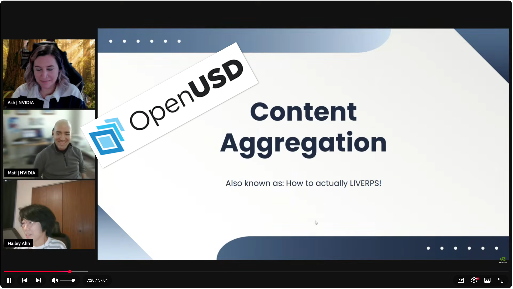</a>

## Series Position

This tutorial is part of the OpenUSD certification deep-dive series.

1. [Understanding Composition Arcs](./Understanding%20Composition%20Arcs__VIDEO_DEEP_DIVE_TUTORIAL.md) - released
2. **[What You Should Know About Content Aggregation](./WhatYouShouldKnowAboutContentAggregation__VIDEO_DEEP_DIVE_TUTORIAL.md) - current tutorial**
3. [Customizing OpenUSD for Your Pipeline](./Customizing_OpenUSD_for_Your_Pipeline__VIDEO_DEEP_DIVE_TUTORIAL.md) - released
4. [Building an OpenUSD Pipeline With Data Modeling](./Building%20an%20OpenUSD%20Pipeline%20With%20Data%20Modeling__VIDEO_DEEP_DIVE_TUTORIAL.md) - released
5. Rendering and Visualizing OpenUSD Scenes - coming soon
6. Session 6 - coming soon

<a href="Pics/WhatYouShouldKnowAboutContentAggregation/ContentAggregation_8h08_38.png">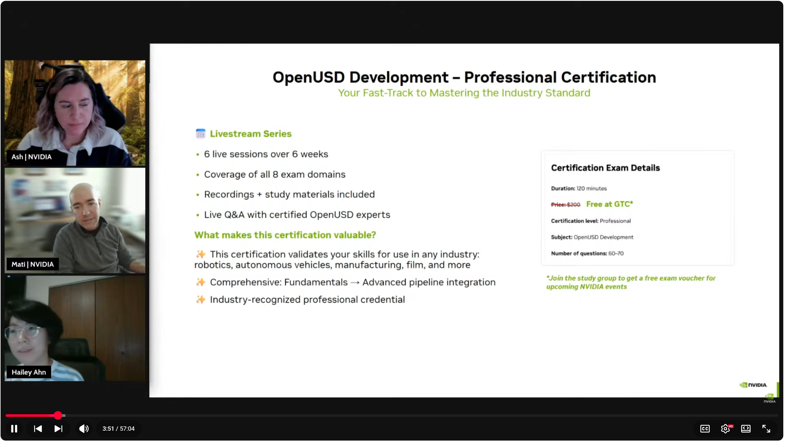</a>

**Certification + livestream structure**: the series is designed to make you exam-ready and production-ready, not just “USD-aware”.

<a href="Pics/WhatYouShouldKnowAboutContentAggregation/ContentAggregation_8h08_56.png"></a>


**Week 2 focus**: content aggregation is where “I can author USD” turns into “I can ship a stable, debuggable, multi-file scene”.

If you want the canonical slide deck for cross-checking (and for your own notes), keep this open: [17 - Week 2 slides](#link-17).


---

> **Part of USD GoodStart** — this deep dive is designed to be used inside the `USD_GoodStart` repository, not as a standalone blog post. For repo structure, conventions, and hands-on setup scripts, start with [README.md](../README.md). This tutorial lives in `WIP_Docs`.

---

## The Five-Minute Version
<a href="Pics/WhatYouShouldKnowAboutContentAggregation/ContentAggregation_8h09_05.png">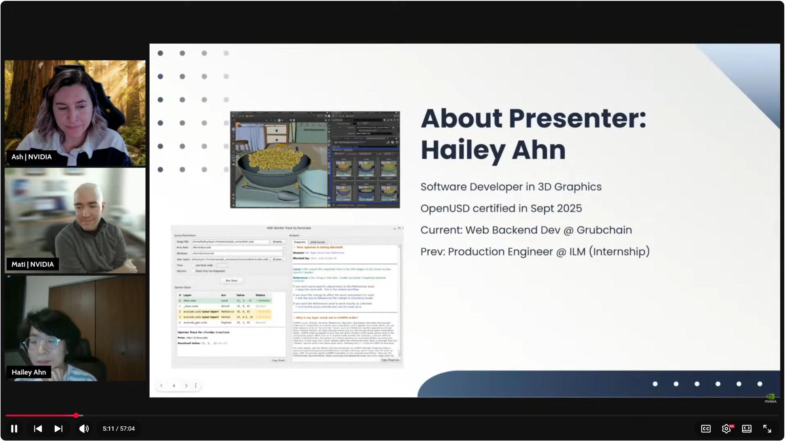</a>

This session is presented by **Hailey Ahn** (OpenUSD certified) and is intentionally shaped like an exam-study lesson: slides + example questions + a Houdini/Solaris walk-through using the Kitchen Set.

What matters for this deep dive: we are not just learning terminology. We are learning how to make an **aggregate stage** that stays stable across:
- different contributors,
- different tools,
- and different load/debug contexts.


---

You can “make a stage open” and still ship something nobody can trust. Aggregation problems usually show up like this:

- The scene looks fine on your machine, but a colleague opens it and half the assets are missing (path/contract mismatch).
- An asset appears twice (duplicate references / unintended composition entry points).
- A last-minute “fix layer” quietly becomes the strongest opinion and nobody remembers why it exists.
- Performance collapses because heavy content always loads (no payload policy), so review becomes unusable.
- Debugging turns into guesswork because you can’t answer: “which file owns this opinion?”

This tutorial is your mechanism map for avoiding that chaos:

- Use **sublayers** when you want **same-namespace, ordered, team-owned contributions**.
- Use **references** when you want **reusable modules with clearer boundaries**.
- Use **payloads** when you also need **explicit deferred loading behavior**.

By the end, you’ll have a repeatable habit: pick the mechanism by intent, then validate with a checklist so aggregation stays stable as the kitchen scene evolves — and so the exact same decisions translate cleanly into industrial digital twin stages.

### Mental model map (quick view)

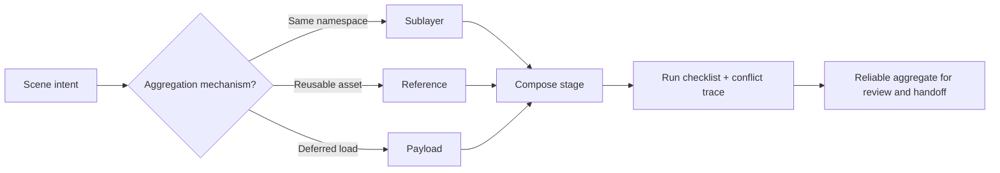
```mermaid
flowchart LR
    Intent["Scene intent"] --> Choice{"Aggregation mechanism?"}
    Choice -->|Same namespace| Sublayer["Sublayer"]
    Choice -->|Reusable asset| Reference["Reference"]
    Choice -->|Deferred load| Payload["Payload"]
    Sublayer --> Compose["Compose stage"]
    Reference --> Compose
    Payload --> Compose
    Compose --> Validate["Run checklist + conflict trace"]
    Validate --> Reliable["Reliable aggregate for review and handoff"]
```

> **Companion video:** Timestamps are provided so you can watch a short segment, then return here for the “production interpretation” (what breaks, how to test, and what to standardize).

---

## Before You Start (Quick Setup)

You want:

- A working USD + Python environment (`pxr`)
- `usdview` installed for visual inspection
- This deep-dive file open alongside the companion video timestamps

Setup reference:
- [Learn OpenUSD — Installing usdview and Setting Up Python](https://docs.nvidia.com/learn-openusd/latest/usdview-install-instructions.html) [6 - setup](#link-6)

### Optional session-specific prep

- Transcript is included at the end of this document (see [Appendix - Full Transcript](#appendix---full-transcript-verbatim-paste-zone)).
- Screenshots are in [Pics/WhatYouShouldKnowAboutContentAggregation/](Pics/WhatYouShouldKnowAboutContentAggregation/).
- [NVIDIA Omniverse Discord](https://discord.gg/nvidiaomniverse) [18 - community Discord](#link-18)
- [OpenUSD Kitchen Set sample asset](https://openusd.org/release/dl_kitchen_set.html) [19 - Kitchen Set](#link-19)
- [OpenUSD downloads and videos](https://openusd.org/dev/dl_downloads.html) [20 - Downloads](#link-20)
- (Optional) Industrial runtime context: [Isaac Sim (GitHub)](https://github.com/isaac-sim/IsaacSim), [Isaac Lab (GitHub)](https://github.com/isaac-sim/IsaacLab), [Omniverse Kit App Template (GitHub)](https://github.com/NVIDIA-Omniverse/kit-app-template)

---

## How This Tutorial Works

Two-layer structure:

1. **Story layer** - one narrative thread across all chapters.
2. **Production layer** - practical pipeline behavior, checks, and pitfalls.

### Repeating chapter pattern (so the tutorial stays “round”)

Each chapter intentionally follows the same shape:

- **Video frames (chronological)**: the key slides / Houdini screenshots in order (click-to-open).
- **Frame notes**: what you’re seeing, why it matters, and where it connects to the kitchen story and the digital-twin story.
- **Key moment and interpretation**: the decision you should remember for the exam *and* for real pipelines.
- **Breakout**: a small decision aid (matrix/checklist or runnable snippet) that turns the idea into something you can test.

### Story anchor for this session: Kitchen Set (Hailey’s kitchen scene)

For this deep-dive we keep one consistent narrative thread:

- We start from the OpenUSD Kitchen Set sample scene and follow Hailey’s authoring decisions as the scene is assembled.
- Each chapter returns to a concrete “where does this opinion belong?” choice (for example: “where do we put this mug?”) and ties it to one aggregation mechanism.
- The real problem is not “can we load files,” but “can we aggregate content **without losing intent** and still keep the result debuggable for the next person.”

### Breakout thread: pull the same decisions into an industrial digital twin (Packaging Cell 3 / Station 7)

- After each chapter’s kitchen decision, we translate it into a shop-floor context (multiple departments, overlays, review pressure).
- This is where the exact same USD mechanics become reliability and operations risk: wrong winner values, missing contributors, and performance cliffs.

### Why this matters

Content aggregation mistakes can silently produce:

- wrong visual context (missing assets, duplicate assets, stale variants),
- wrong operational decisions (incorrect status overlays),
- and low trust in review sessions ("it worked yesterday, why not today").

---

## Chapter Outcomes at a Glance

| Chapter | Video section (approx) | Pillar | Outcome |
|---|---|---|---|
| [Chapter 1](#chapter-1) | [`03:13`](https://www.youtube.com/live/LFCauWTNBM4?t=193)-[`12:57`](https://www.youtube.com/live/LFCauWTNBM4?t=777) | Asset Structure Principles | Explain aggregation and the four pillars. |
| [Chapter 2](#chapter-2) | [`12:57`](https://www.youtube.com/live/LFCauWTNBM4?t=777)-[`16:30`](https://www.youtube.com/live/LFCauWTNBM4?t=990) | Asset Interface and Encapsulation | Use default prim and encapsulation for portable assets. |
| [Chapter 3](#chapter-3) | [`16:30`](https://www.youtube.com/live/LFCauWTNBM4?t=990)-[`46:30`](https://www.youtube.com/live/LFCauWTNBM4?t=2790) | Reference/Payload Pattern | Use sublayers, references, payloads by intent. |
| [Chapter 4](#chapter-4) | [`22:29`](https://www.youtube.com/live/LFCauWTNBM4?t=1349)-[`28:07`](https://www.youtube.com/live/LFCauWTNBM4?t=1687) | Asset Parameterization | Use variants and primvars instead of duplication. |
| [Chapter 5](#chapter-5) | [`26:32`](https://www.youtube.com/live/LFCauWTNBM4?t=1592)-[`52:30`](https://www.youtube.com/live/LFCauWTNBM4?t=3150) | Lofting & Workstreams | Structure department lanes and trace winning opinions. |
| [Chapter 6](#chapter-6) | [`34:39`](https://www.youtube.com/live/LFCauWTNBM4?t=2079)-end | Model Hierarchy | Apply model kinds, avoid anti-patterns, run checklist. |

**Note on timestamps:** this livestream revisits pillars and overlaps topics (especially around the reference/payload pattern, lofting, and model hierarchy). Treat the ranges above as **jump-in anchors**, not strict boundaries — use the [Key Moments Index](#key-moments-index) when you want the most reliable YouTube jump target for a specific concept.

**Supplemental:** [Chapter 7 - Community Questions](#chapter-7) clusters cross-topic audience Q&A and links answers back to Chapters 1-6.

---

## Key Moments Index

| Timestamp in video | Slide | Transcript cue | Why this moment matters |
|---|---|---|---|
| [`02:25`](https://www.youtube.com/live/LFCauWTNBM4?t=145) | <a href="Pics/WhatYouShouldKnowAboutContentAggregation/ContentAggregation_8h08_25.png">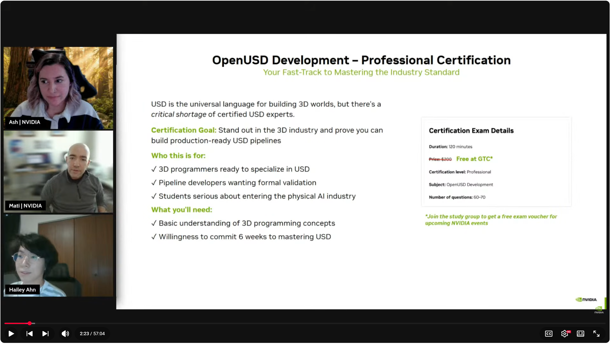</a> | Certification exam context | Anchors the session as certification-focused and sets expectations for how practical the examples will be. |
| [`03:13`](https://www.youtube.com/live/LFCauWTNBM4?t=193) | <a href="Pics/WhatYouShouldKnowAboutContentAggregation/ContentAggregation_8h08_38.png"></a> | "We built the Learn OpenUSD curriculum to prepare you for that." | Connects certification intent to practical learning path and sets expectations for the tutorial's structure. |
| [`04:48`](https://www.youtube.com/live/LFCauWTNBM4?t=288) | <a href="Pics/WhatYouShouldKnowAboutContentAggregation/ContentAggregation_8h09_05.png"></a> | "Content aggregation... how to apply this practically." | Marks the shift from concept definitions to workflow execution in real pipelines. |
| [`08:42`](https://www.youtube.com/live/LFCauWTNBM4?t=522) | <a href="Pics/WhatYouShouldKnowAboutContentAggregation/ContentAggregation_8h21_34.png">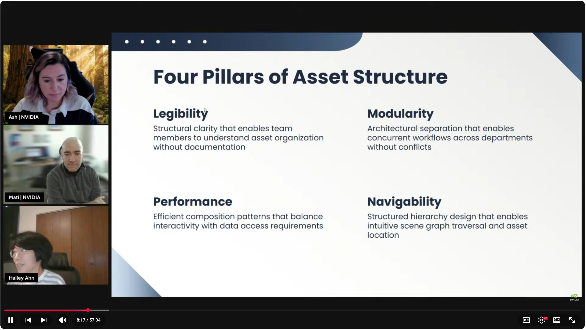</a> | "Legibility, modularity, performance, navigability." | Establishes the decision rubric used in Chapters 1 and 2 for mechanism choice. |
| [`09:32`](https://www.youtube.com/live/LFCauWTNBM4?t=572) | <a href="Pics/WhatYouShouldKnowAboutContentAggregation/ContentAggregation_8h21_26.png">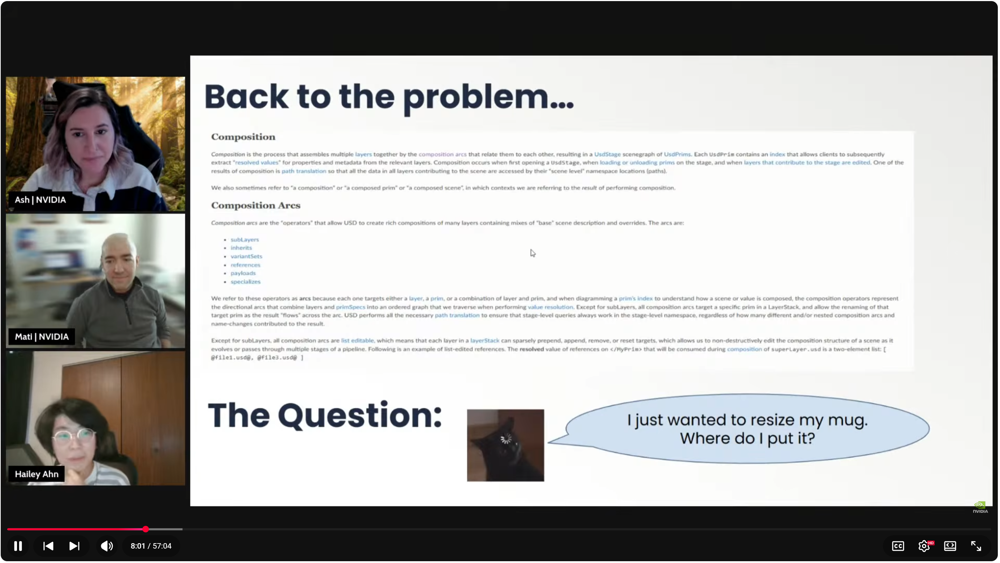</a> | "Give an example question." | Transition into concrete decision-making, not abstract theory. |
| [`13:00`](https://www.youtube.com/live/LFCauWTNBM4?t=780) | — | "Asset Interface & Encapsulation" | Introduces default prim and encapsulation for portable assets (Ch 2). |
| [`20:04`](https://www.youtube.com/live/LFCauWTNBM4?t=1204) | <a href="Pics/WhatYouShouldKnowAboutContentAggregation/ContentAggregation_8h24_39.png">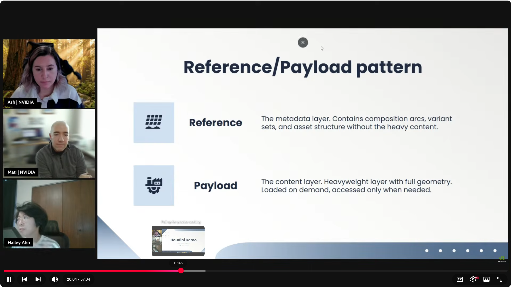</a> | "Reference = metadata layer, payload = heavy content layer." | Speaker shorthand: in OpenUSD both are composition arcs; payload = load-controlled reference. Common pattern: keep interface visible while heavy content is payloaded. |
| [`24:43`](https://www.youtube.com/live/LFCauWTNBM4?t=1483) | <a href="Pics/WhatYouShouldKnowAboutContentAggregation/ContentAggregation_8h32_48.png">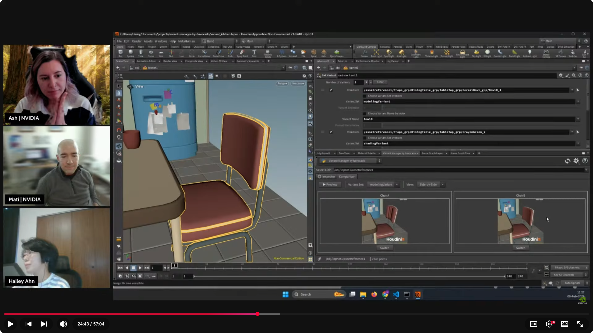</a> | "Variants in practice (Chair switching)." | Shows why parameterization needs payload-aware structure to stay usable in review. |
| [`26:32`](https://www.youtube.com/live/LFCauWTNBM4?t=1592) | <a href="Pics/WhatYouShouldKnowAboutContentAggregation/ContentAggregation_8h34_23.png">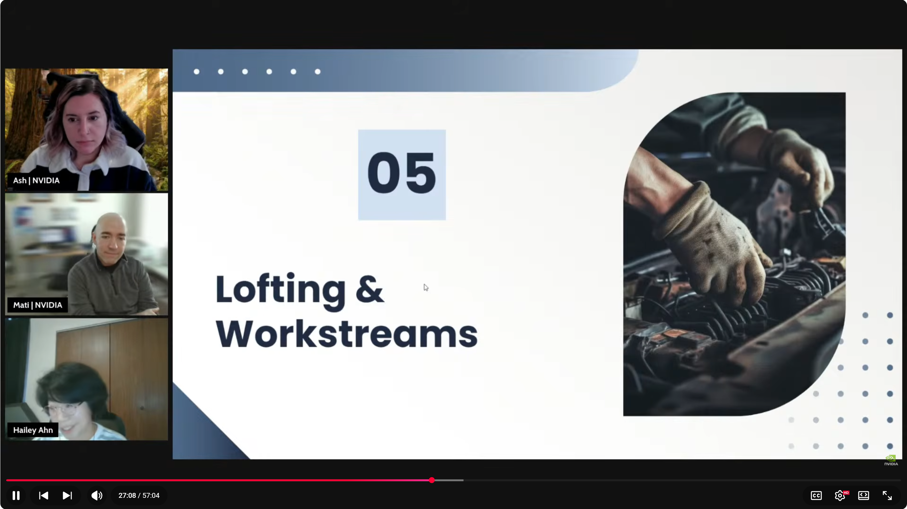</a> | "Lofting & workstreams." | Shows the workstream lane structure teams use to collaborate without overwriting each other. |
| [`48:16`](https://www.youtube.com/live/LFCauWTNBM4?t=2896) | <a href="Pics/WhatYouShouldKnowAboutContentAggregation/ContentAggregation_8h48_16.png">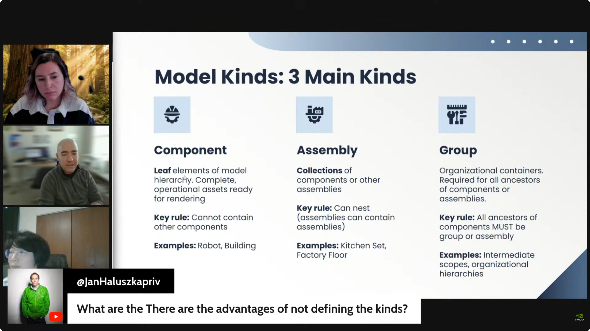</a> | "Be kind to the pipeline (kinds in the scene graph)." | Kinds turn a pile of prims into a navigable hierarchy and prevent downstream assumptions from breaking. |
| [`56:10`](https://www.youtube.com/live/LFCauWTNBM4?t=3370) | <a href="Pics/WhatYouShouldKnowAboutContentAggregation/ContentAggregation_8h56_10.png">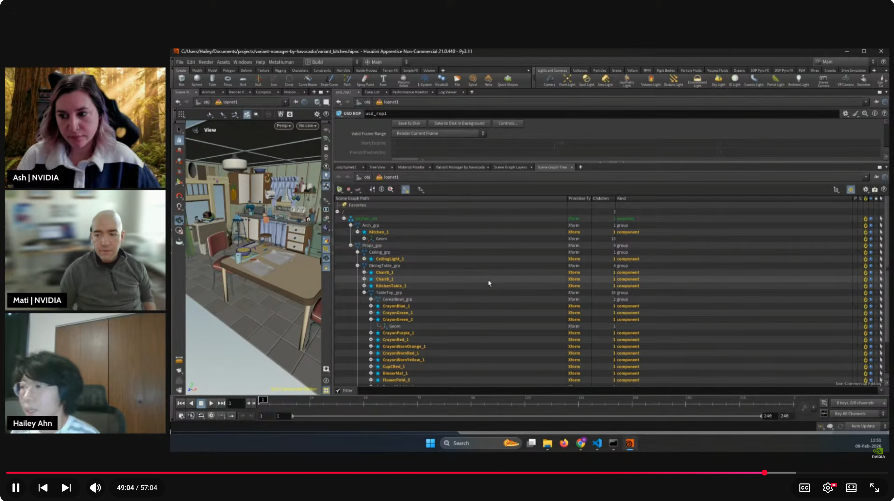</a> | "Kinds recap + Q&A pressure test." | Reinforces that model kinds are a collaboration contract, not a cosmetic label. |

Authoring note: decision-logic screenshots use a consistent "Breakout" block format (see "Breakout Pattern" near the end).

---

<a id="chapter-1"></a>
## Chapter 1 - Asset Structure Principles

**Video section (approx):** `03:13-12:57`  
**Watch first:** [YouTube source - jump to chapter section](https://www.youtube.com/live/LFCauWTNBM4?t=193)

### Video frames (chronological)

Click any thumbnail to open full-size.


Hailey opens with the title slide that sets the tone: **“Content Aggregation (also known as: how to actually LIVRPS!)”**. This isn't just wordplay — it's the moment when your mental model of strength ordering stops being theory and starts being a daily debugging tool. **Learn more:** [8 - Introduction to composition](#link-8), [12 - LIVRPS](#link-12), [67 - Reference deck](#link-67)

<a href="Pics/WhatYouShouldKnowAboutContentAggregation/ContentAggregation_8h21_12.png">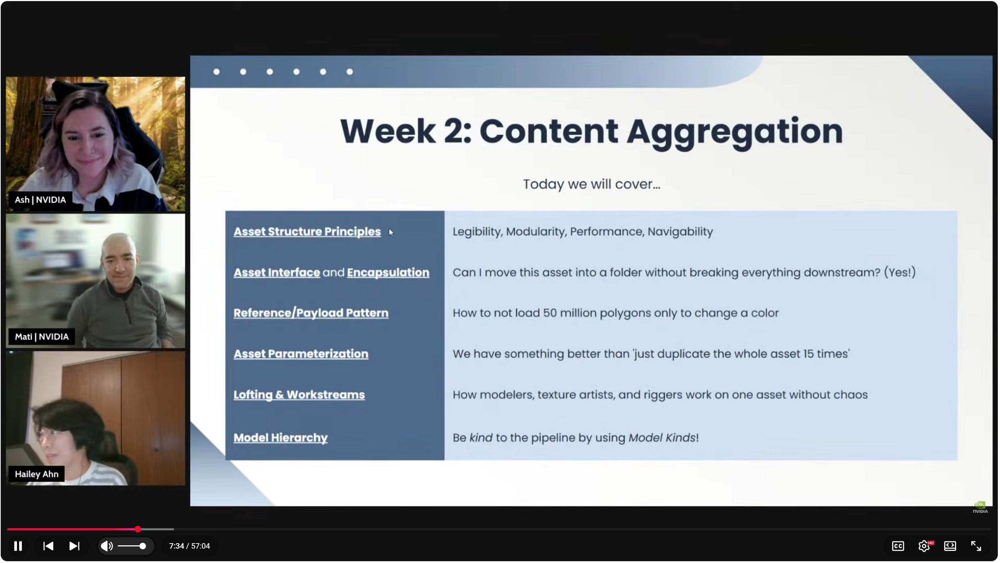</a>

The agenda slide reveals the full arc: asset structure → asset interface/encapsulation → reference/payload pattern → parameterization → lofting/workstreams → model hierarchy. **Stable aggregation is not one feature — it's a contract bundle.** Structure, interface, load policy, parameterization, collaboration lanes, and hierarchy all have to align. When Hailey's kitchen scene is assembled, every one of these decisions will matter. When you build a Packaging Cell 3 stage, the same bundle determines whether departments can ship updates without collisions. **Learn more:** [14 - Asset structure](#link-14), [10 - References](#link-10), [11 - Payloads](#link-11)

<a href="Pics/WhatYouShouldKnowAboutContentAggregation/ContentAggregation_8h21_20.png">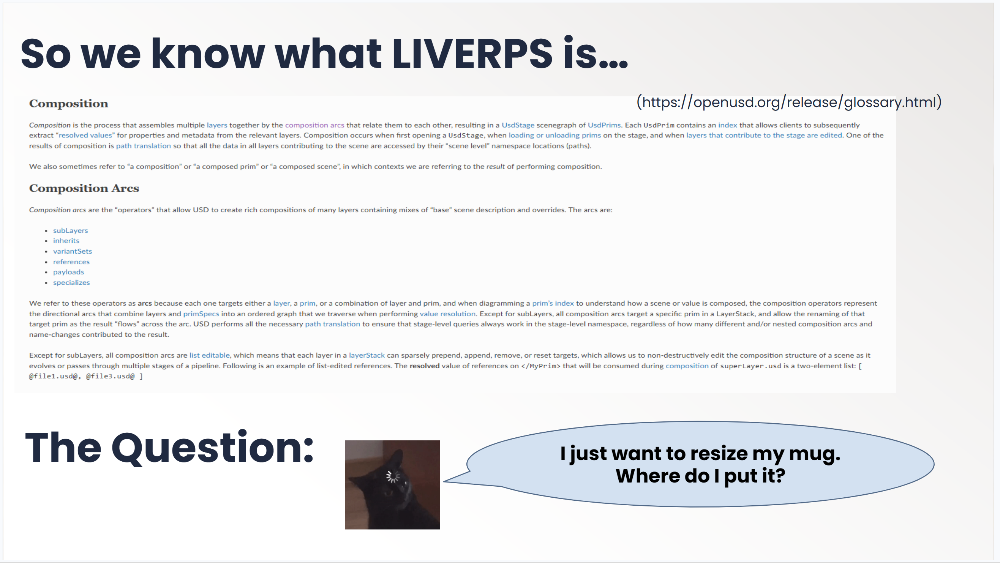</a>

<a href="Pics/WhatYouShouldKnowAboutContentAggregation/ContentAggregation_8h21_26.png"></a>

Hailey lands the central question: *"I just wanted to resize my mug. Where do I put it?"* It sounds like a joke, but it's the pivot point. A tiny change forces you to choose the *right* contribution mechanism — sublayer, reference, or payload — based on intent, not convenience. In the kitchen, this is the mug. In Packaging Cell 3, it's the robot position or the status overlay. Same decision. **Learn more:** [8 - Introduction to composition](#link-8), [12 - LIVRPS](#link-12), [67 - Reference deck](#link-67)

<a href="Pics/WhatYouShouldKnowAboutContentAggregation/ContentAggregation_8h21_34.png"></a>

The Four Pillars — **Legibility, Modularity, Performance, Navigability** — become your decision rubric. They explain *why* some aggregation styles scale and others rot. When you ask "where does this mug go?", you're really asking: can another team understand where this opinion came from? Can teams contribute without stepping on each other? Does this mechanism support staged loading? Can someone trace source and intent during review? **Learn more:** [14 - Asset structure](#link-14), [16 - Best practices index](#link-16)

<a href="Pics/WhatYouShouldKnowAboutContentAggregation/ContentAggregation_8h22_04.png">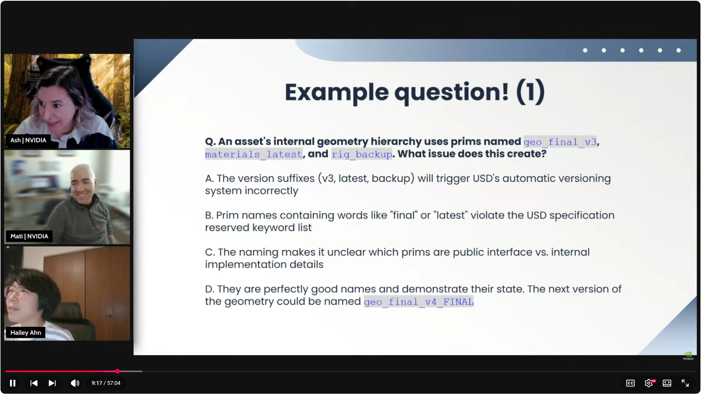</a> <a href="Pics/WhatYouShouldKnowAboutContentAggregation/ContentAggregation_8h22_23.png">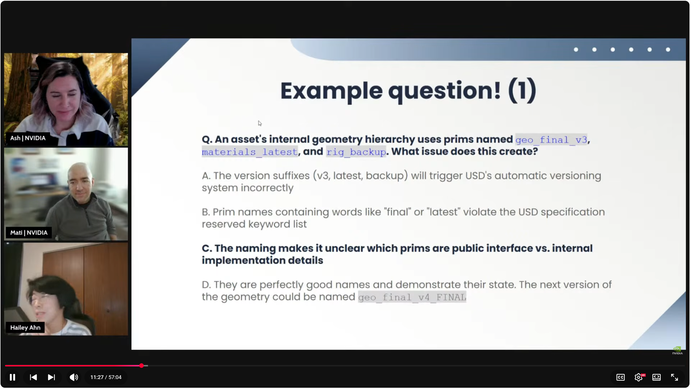</a>

**Now she digs into:** Example question about naming internal prims `geo_final_v3`, `materials_latest`, `rig_backup`. **Why it matters:** those names blur *public interface* vs *internal implementation*. Downstream teams start binding to "whatever was there today," and you lose the ability to restructure safely. **Learn more:** [14 - Asset structure](#link-14), [69 - Prims](#link-69)

### Intro bridge

Aggregation is where individual USD authoring decisions become a system behavior. In Hailey’s kitchen scene, this is the point where “a mug file,” “a material file,” and “a layout file” stop being separate artifacts and become one composed stage. In a digital twin, the same moment determines whether review and downstream decisions are reliable or chaotic.

### Concept -> What breaks -> How to test

- **Concept:** Aggregation combines authored content from multiple files and teams.
- **What breaks:** Path/contract mismatches, duplicate entry points (double-inclusion), long-lived “review fix” layers, hidden load state (payloads), and unclear ownership of the winning opinion.
- **How to test:** Open stage, inspect composition stack, verify expected contributors.

### Kitchen checkpoint (carry-forward)

- **Kitchen decision:** Treat the kitchen stage as a *composed* result, not a single “scene file.” If the mug looks wrong, assume the answer is “which contributor won,” not “somebody moved it.”
- **What you just encoded:** A debugging habit: first identify contributors (layers/assets), then inspect composition/strength, then validate the contract.
- **Carry forward into Chapter 2:** Before choosing any mechanism, ask: “Can I move this asset into a folder without breaking everything downstream?” Interface and encapsulation are the next layer.

### Script Lab (planned / not yet committed)

- `aggregation/00_stage_sources_audit.py`

---

<a id="chapter-2"></a>
## Chapter 2 - Asset Interface and Encapsulation

**Video section (approx):** `12:57-16:30`  
**Watch first:** [YouTube source - jump to chapter section](https://www.youtube.com/live/LFCauWTNBM4?t=777)

### Video frames (chronological)

Click any thumbnail to open full-size.

<a href="Pics/WhatYouShouldKnowAboutContentAggregation/ContentAggregation_8h22_26.png">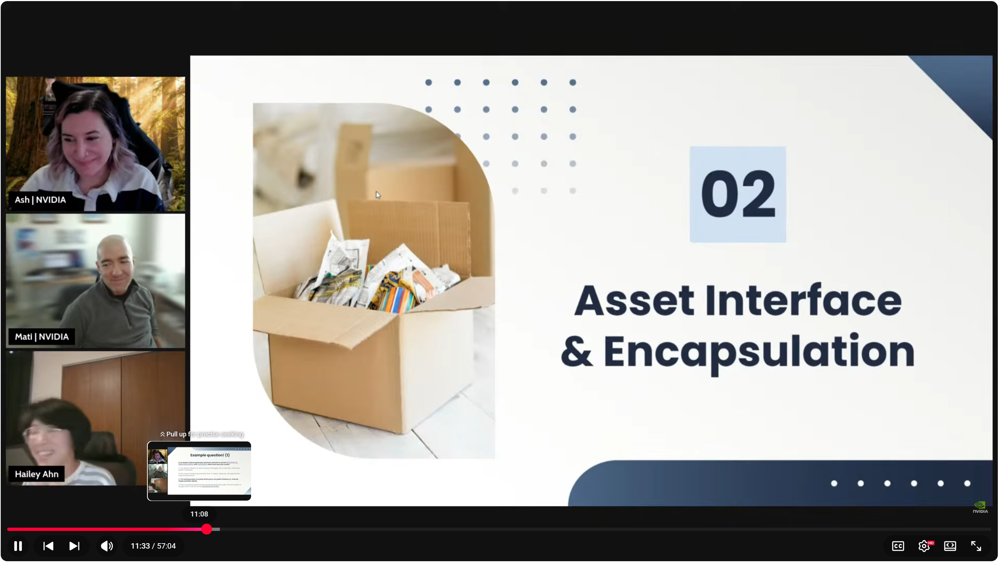</a>

**At this moment:** Section header: **Asset Interface & Encapsulation**. **Why it matters:** in production, "aggregation reliability" is mostly "interface stability". Encapsulation is how you keep interfaces stable while internals evolve. **Learn more:** [68 - Default prim](#link-68), [14 - Asset structure](#link-14)

<a href="Pics/WhatYouShouldKnowAboutContentAggregation/ContentAggregation_8h22_48.png">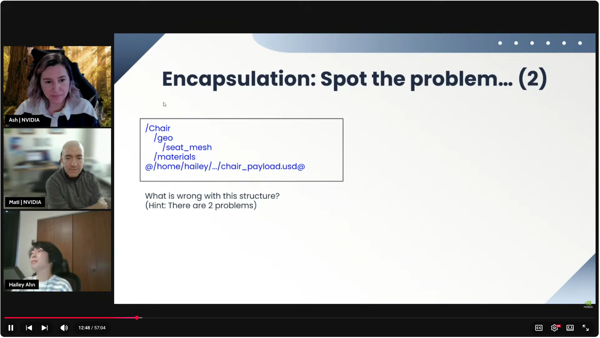</a> <a href="Pics/WhatYouShouldKnowAboutContentAggregation/ContentAggregation_8h22_52.png">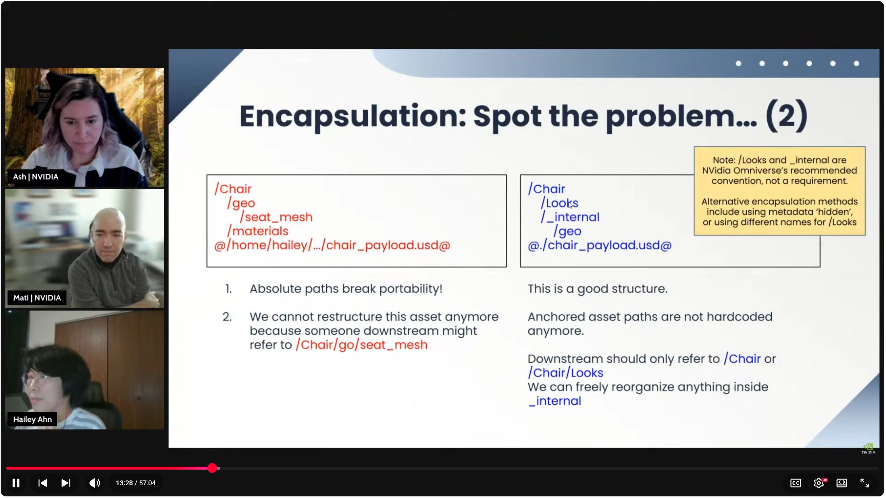</a>

**The key moment:** "Spot the problem" encapsulation example: absolute paths and downstream references to deep internal prim paths (like `/Chair/geo/seat_mesh`) break portability. **Why it matters:** if downstream content points inside an asset's guts, you cannot refactor without breaking consumers. That is exactly how "it works on my machine" stages are created. **Learn more:** [14 - Asset structure](#link-14), [68 - Default prim](#link-68), [67 - Reference deck](#link-67)

<a href="Pics/WhatYouShouldKnowAboutContentAggregation/ContentAggregation_8h23_23.png">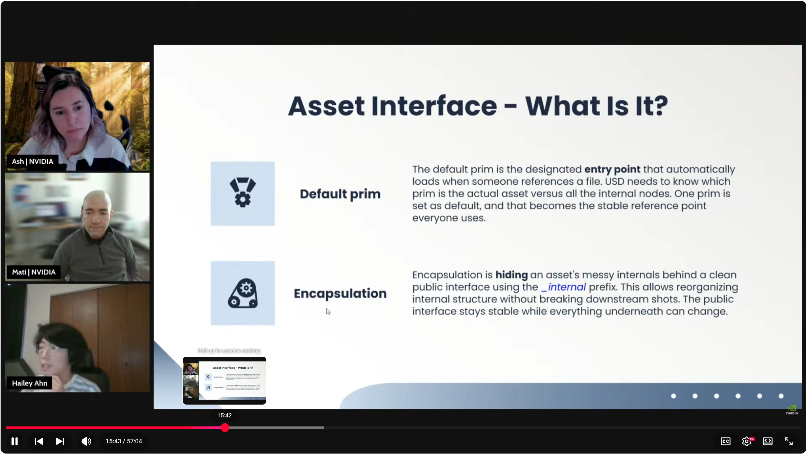</a>

**Here:** "Asset Interface - What Is It?" defining two core interface tools: **Default prim** as the stable entry point for consumers; **Encapsulation** via a clean public surface (`/Chair`, `/Chair/Looks`) hiding `_internal`. **Why it matters:** these are the two interface tools you need to keep consumers stable. **Learn more:** [68 - Default prim](#link-68), [10 - References](#link-10)

### Intro bridge

This pillar answers one question: **what is the stable entry point of an asset, and what is private implementation detail?**

In OpenUSD, aggregation scales when assets behave like modules:
- `defaultPrim` gives consumers a predictable root to reference.
- Encapsulation keeps internal prim paths refactorable without breaking downstream stages.

In the kitchen scene, this is why `/Chair` should be the public surface, while `_internal` is allowed to evolve as the asset matures.

**Digital twin breakout (Packaging Cell 3 / Station 7):** this is why `/Factory/Cell03/Robot` should be a stable contract, while the vendor’s internal hierarchy can change without breaking your cell stage.

Hailey’s "spot the problem" slide is the pitfall: deep internal bindings and absolute paths turn “works here” into “breaks everywhere.”

### Concept -> What breaks -> How to test

- **Concept:** Asset interface = stable entry prim + shallow public paths; encapsulation = keep internals behind that boundary.
- **What breaks:** Missing/incorrect `defaultPrim`, downstream references to deep internal prim paths, absolute file paths, and “public” naming that leaks implementation detail.
- **How to test:** Open the asset standalone, verify `defaultPrim`, then simulate moving the asset folder and confirm downstream stages still resolve via the interface (not internals).

### Mechanism decision quick map

Now that the interface is stable, you can choose composition mechanisms *by intent* (use the chooser table below; Chapter 3 goes deep):

**Digital twin translation:** facility layout deltas can be sublayers, robot/workcell modules are references, and heavy scan/mesh clusters are payload candidates.

### Breakout - Sublayer vs Reference vs Payload (and combinations)

Use this as a quick chooser before you author:

| Need | Primary mechanism | Why |
|---|---|---|
| Multiple teams editing the same stage paths | Sublayer | Same namespace, explicit strength order, easy lane-based collaboration |
| Reusable asset/module insertion | Reference | Clean module boundary with stable entry point (`defaultPrim`) |
| Heavy content that should not always load | Payload | Runtime load control (payloads can be loaded or ignored); keep essential interface outside the payload |

Common combinations that work in production:

| Combination | Use when | Watch out for |
|---|---|---|
| **Reference + Payload** | You want a light interface and heavy internals loaded on demand | Teams must document default load policy |
| **Sublayer + Reference** | You assemble modules, then add stage-level review/ops overlays | Review overrides must not become permanent source-of-truth |
| **Sublayer + Reference + Payload** | Large digital twin stages with modular assets and heavy geometry tiers | Debugging must include both strength order and load state |

Quick rule of thumb:
- If the question is **"who wins in this stage?"** start with sublayers.
- If the question is **"how do I reuse this asset cleanly?"** start with references.
- If the question is **"why is this scene too heavy?"** add payload policy.

### Key moment and interpretation

At this moment, “legibility” and “modularity” become concrete:
- If consumers only know the entry prim, you can refactor internals safely.
- If consumers know internal paths, you’re locked in — and aggregation becomes brittle.

### Breakout - Asset interface sanity check

**Checklist (manual):**
1. Asset opens standalone and has a `defaultPrim`.
2. Downstream stages reference the asset’s entry prim, not deep internal prim paths.
3. Public surface is stable (`/Asset`, `/Asset/Looks`), internals are clearly private (`_internal`).

**Quick probe (Python):**
```py
from pxr import Usd

stage = Usd.Stage.Open(asset_path)
assert stage.GetDefaultPrim(), "Asset has no defaultPrim"
```

### Kitchen checkpoint (carry-forward)

- **Kitchen decision:** Treat `/Chair` as the public contract: set `defaultPrim` and keep downstream references shallow (avoid `/Chair/geo/...`).
- **What you just encoded:** Portability: you can move/refactor the asset without breaking consumers.
- **Carry forward into Chapter 3:** With a stable interface, you can apply the reference/payload pattern (and sublayer lanes) without creating hidden coupling.

### Script Lab (planned / not yet committed)

- `aggregation/01_asset_interface_audit.py`

---

<a id="chapter-3"></a>
## Chapter 3 - Reference/Payload Pattern

<a href="Pics/WhatYouShouldKnowAboutContentAggregation/ContentAggregation_8h23_47.png">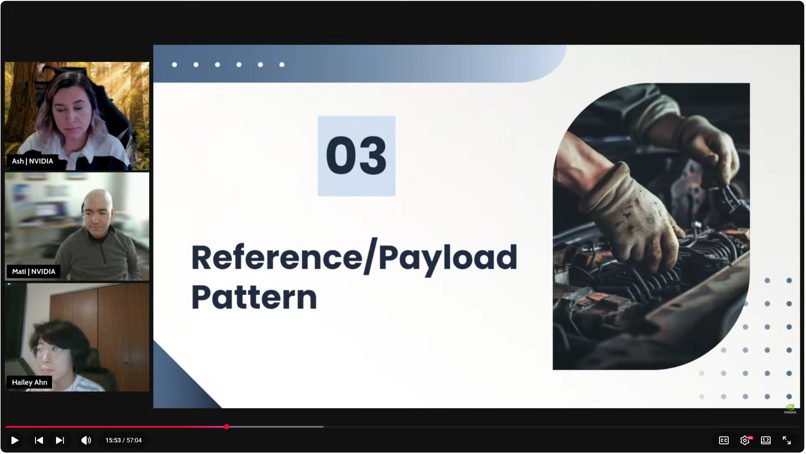</a>

**Video section (approx):** `16:30-46:30`  
**Watch first:** [YouTube source - jump to chapter section](https://www.youtube.com/live/LFCauWTNBM4?t=990)

Model hierarchy (kinds) is covered in [Chapter 6](#chapter-6).

### Sublayers

### Video frames (chronological)

Click any thumbnail to open full-size.

<a href="Pics/WhatYouShouldKnowAboutContentAggregation/ContentAggregation_8h23_51.png">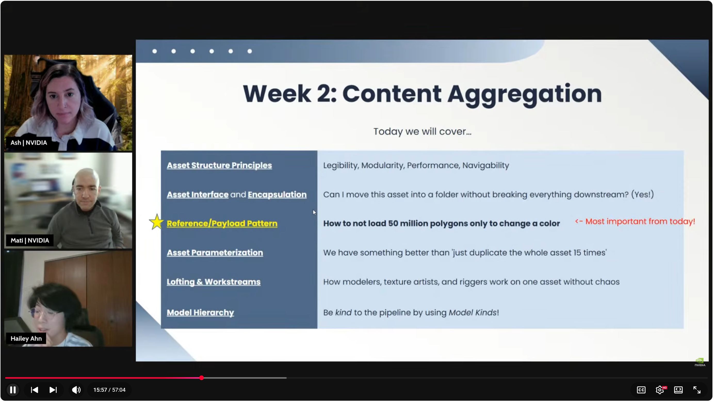</a>

**Interesting approach:** Agenda revisited with the **Reference/Payload Pattern** highlighted as "most important from today". **Why it matters:** even when you choose sublayers for collaboration lanes, load-policy decisions (payloads) will change what teammates *see* and debug. **Learn more:** [9 - Layers and sublayers](#link-9), [11 - Payloads](#link-11)

<a href="Pics/WhatYouShouldKnowAboutContentAggregation/ContentAggregation_8h24_05.png">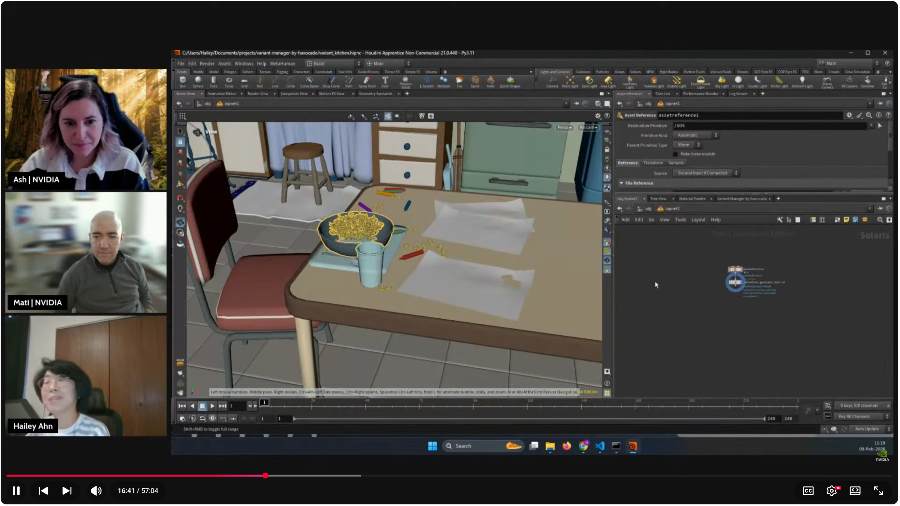</a>

**Hailey shifts to:** Houdini/Solaris viewport showing the Kitchen Set scene in context (this is the "real object" we're composing). **Why it matters:** sublayer decisions are only meaningful when you can connect them to a concrete scene graph (what prims exist, what changed, and who owns the change). **Learn more:** [42 - Solaris/USD docs](#link-42), [29 - Writing USD from Houdini](#link-29)

<a href="Pics/WhatYouShouldKnowAboutContentAggregation/ContentAggregation_8h24_19.png">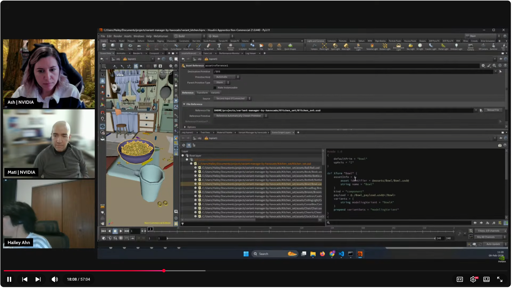</a>

**This is where:** Houdini UI showing a **layer stack / scene graph list** and a small USDA snippet. **Why it matters:** this is the "audit surface" you need when sublayers get messy: list contributors, then trace which layer is authoring what. **Learn more:** [15 - Stage API](#link-15), [12 - LIVRPS](#link-12)

<a href="Pics/WhatYouShouldKnowAboutContentAggregation/ContentAggregation_8h24_32.png">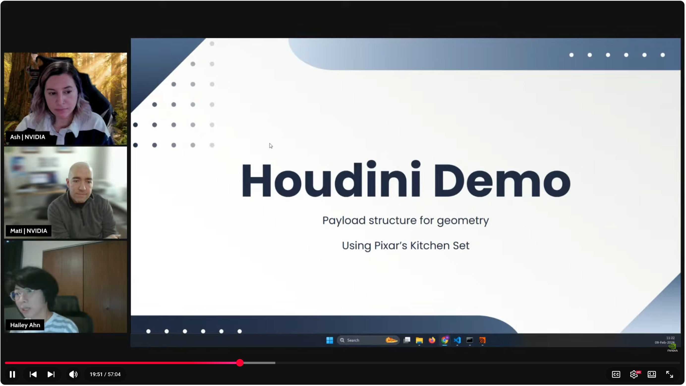</a>

**The slide lands:** "Houdini Demo - payload structure for geometry (Kitchen Set)". **Why it matters:** payload boundaries often become the "fault lines" of collaboration - teams can author opinions that you cannot even see until something is loaded. **Learn more:** [11 - Payloads](#link-11), [67 - Reference deck](#link-67)


<a href="Pics/WhatYouShouldKnowAboutContentAggregation/ContentAggregation_8h24_39.png"></a>

**The question (speaker shorthand):** "Reference = metadata layer, payload = heavy content layer."

**Clarification (OpenUSD):** references and payloads are *composition arcs*; a payload is a reference that can be loaded or ignored. A common pattern is to keep the asset interface (public prim + key metadata/config) always composed, and put heavy geometry behind a payload.

**Why it matters:** this keeps interface visible without forcing heavy loads, but it also means load policy affects what different teammates see. **Learn more:** [10 - References](#link-10), [11 - Payloads](#link-11)

<a href="Pics/WhatYouShouldKnowAboutContentAggregation/ContentAggregation_8h24_58.png">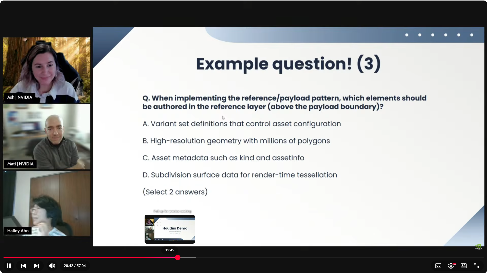</a> <a href="Pics/WhatYouShouldKnowAboutContentAggregation/ContentAggregation_8h25_08.png">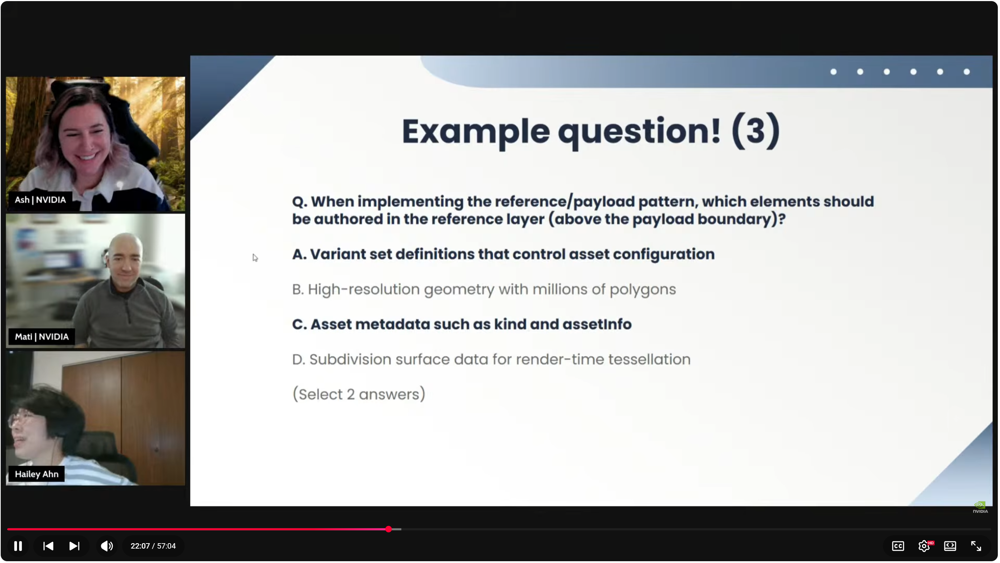</a>

**The answer:** Example question (and answer): what should live **outside the payload** (in the always-composed asset interface). **Answer logic:** author **variant definitions** and **asset metadata (kind, assetInfo)** outside the payload; keep heavy geometry in the payload. **Why it matters:** this separation keeps interface visible without loading heavy content. **Learn more:** [70 - Variant sets](#link-70), [72 - Model kinds](#link-72), [11 - Payloads](#link-11)

**Now:** Reminder (see [Chapter 1](#chapter-1)): **don't leak implementation details into the public surface**. **Why it matters:** sublayers become dangerous when teams bind to internal names and then "fix layers" accumulate forever. **Learn more:** [14 - Asset structure](#link-14), [68 - Default prim](#link-68)

*Asset Parameterization and Lofting & Workstreams are covered in [Chapter 4](#chapter-4) and [Chapter 5](#chapter-5).*

### Intro bridge

Sublayers look simple on day one and become dangerous on day sixty if layer ownership is fuzzy. This chapter explains when sublayers are exactly right and how to keep them deterministic over time.

In the kitchen scene, sublayers are a good fit for coordinated stage-level contributions that intentionally merge into one namespace (for example: layout tweaks, lookdev overrides, lighting adjustments, and review annotations).

**Digital twin breakout (Packaging Cell 3 / Station 7):** sublayers are a good fit for coordinated stage-level contributions like facility baseline, safety markup overlays, and review annotations that are expected to compose into one stage namespace.

### Concept -> What breaks -> How to test

- **Concept:** Ordered layer stack for direct opinion merging in one namespace.
- **What breaks:** Accidental overrides due to stack order misunderstandings and missing ownership contracts.
- **How to test:** Print sublayer order, then trace a known property to confirm the expected winner.

### Practical sublayer guidance

- Keep sublayers for **same-convention** content that should merge.
- Avoid mixing unrelated responsibilities in one layer.
- Name layers by ownership and intent, not by temporary task names.
- Document stack order as part of review criteria.

If you cannot answer "which team owns the winning opinion for this property?" in under 30 seconds, your sublayer strategy is not yet production-safe.

### Key moment and interpretation

This question is useful because it sounds tiny and reveals structural intent:
- If it is a stage-specific adjustment in a shared namespace, sublayer is often valid.
- If it is an asset-level reusable change, move toward reference-based asset structure.

### Breakout - Sublayer order probe

Digital twin example (Packaging Cell 3): one way to encode ownership lanes is to keep the stack explicit like this.

**Raw snippet:**
```py
root.subLayerPaths = [
    "cell03_review_fix.usda",
    "cell03_ops_overlay.usda",
    "cell03_base.usda",
]
```

**Commented walkthrough:**
```py
# Sublayers are ordered strongest -> weakest (earlier entries win).
# Keep this order explicit and reviewed.
root.subLayerPaths = [
    "cell03_review_fix.usda",  # Strongest review-time corrections (should be short-lived).
    "cell03_ops_overlay.usda", # Operational overlays and status-driven edits.
    "cell03_base.usda",        # Weakest baseline structure and defaults.
]
```

**Why this works**
- It keeps one namespace with clear, ordered contribution lanes.
- It makes override direction auditable during troubleshooting.

**Why this fails**
- It fails when "review_fix" silently becomes permanent production source.
- It fails when stack order changes without change-log or ownership review.

### Kitchen checkpoint (carry-forward)

- **Kitchen decision:** Keep kitchen-wide “same namespace” adjustments in a small, named, ordered layer stack (layout/lookdev/lighting/review), instead of burying everything inside one file.
- **What you just encoded:** Strength ordering as a *human-readable contract* (earlier layers win), not a mystery.
- **Carry forward to References (below):** Anything that should travel as a reusable unit (a cabinet/appliance/prop-set module) should move out of the sublayer pile and become a referenced asset with a stable insertion point.


### References

**Video section (approx):** `27:30-37:30`  
**Watch first:** [YouTube source - jump to chapter section](https://www.youtube.com/live/LFCauWTNBM4?t=1650)

### Intro bridge

This is the chapter where we stop treating assets as copy-paste content and start treating them as reusable units. In production, references are usually the point where pipelines become scalable instead of fragile.

In the kitchen scene, references are what let you keep a “cabinet module,” “appliance module,” or “prop set” independently authored while still composing a coherent room.

**Digital twin breakout (Packaging Cell 3 / Station 7):** references let you keep robot modules, conveyor modules, and inspection modules independently authored while still composing a coherent cell stage.

### Concept -> What breaks -> How to test

- **Concept:** Bring external prim data into composition with explicit arcs and cleaner ownership boundaries.
- **What breaks:** Wrong target prim paths, unresolved asset paths, broken default prim assumptions, or accidental namespace collisions.
- **How to test:** Verify referenced prim existence, inspect composed namespace, and confirm expected source ownership for critical properties.

### Practical reference guidance

- Use references when content should remain modular and reusable across shots/scenes/cells.
- Avoid "flattening by habit"; preserve source boundaries so teams can iterate independently.
- Keep path contracts documented (`defaultPrim`, target prim path, naming standards).

### Key moment and interpretation

This section lands the idea that references are not just a technical feature; they are an organizational tool:
- They keep asset teams autonomous.
- They reduce override noise in top-level stage assembly.
- They make defect tracing faster because source ownership is clearer.

### Breakout - Reference health check decision matrix

Digital twin example (Packaging Cell 3): reference a module into the cell stage with an explicit insertion point.

| Check | PASS condition | If FAIL |
|---|---|---|
| Insertion point | Target prim path is explicit and intentional (for example `/Factory/Cell03/RobotModule`) | Fix destination path before debugging anything else |
| Source asset contract | Referenced asset exposes a stable `defaultPrim` or known target prim | Repair asset interface (`defaultPrim`, public prim path) |
| Path portability | Asset path resolves in teammate/runtime environments | Convert to portable pathing and re-validate |
| Namespace clarity | Composed names do not collide with existing prims | Rename insertion point or refactor namespace boundaries |
| Ownership traceability | Team can name who owns the referenced source layer | Assign owner and document update policy |

**Why this works**
- It composes reusable asset content without merging everything into one authored file.
- It keeps source-of-truth ownership with the asset file.

**Why this fails**
- It fails if `/Robot` does not exist or `defaultPrim`/target assumptions are wrong.
- It fails silently in review quality when paths resolve but point to unintended prims.

### Kitchen checkpoint (carry-forward)

- **Kitchen decision:** Promote repeatable kitchen pieces (cabinet/appliance/prop set) into referenced modules so they can be reused, versioned, and swapped without rewriting the whole stage.
- **What you just encoded:** References turn “content” into “modules,” which makes tracing and ownership clearer — if paths/contracts are explicit.
- **Carry forward to Payloads (below):** Decide which referenced modules are “heavy enough” to require explicit load policy (see Payloads).

### Script Lab (planned / not yet committed)

- `aggregation/03_reference_health_check.py`

---

### Payloads (Core pattern)

### Intro bridge

Payloads are where composition design meets runtime discipline. If references define structure, payloads define loading behavior.

In the kitchen scene, payloads are the difference between opening full-fidelity assets every time and opening a responsive stage that loads heavy parts (high-res meshes, dense props, scans) only when needed.

**Digital twin breakout (Packaging Cell 3 / Station 7):** this is the difference between opening the full high-detail environment every time and opening a responsive stage that loads heavy parts only when needed.

### Concept -> What breaks -> How to test

- **Concept:** Defer heavy content until needed while preserving composition intent.
- **What breaks:** Critical content hidden behind unloaded payloads, or inconsistent review outcomes because load policy is undocumented.
- **How to test:** Toggle payload load states, compare expected visibility, and verify that validation checks account for load state.

### Practical payload guidance

- Use payloads for heavy geometry/sim/cache blocks where interactive performance matters.
- Document payload policy in handoff: what must load by default, what is optional.
- Never assume "not visible" means "not authored"; check load state before debugging composition.

### Key moment and interpretation
*(See the matching frame in the "Video frames" section at the top of this chapter.)*

The key operational lesson here is simple: load policy is part of correctness, not just speed.
- If validation ignores payload state, teams ship false negatives ("asset missing") and false positives ("all good") depending on local app defaults.

### Breakout - Payload load policy decision matrix

Digital twin example (Packaging Cell 3): add heavy clusters as payloads and validate load-policy behavior explicitly.

| Scene need | Choose | Validation question |
|---|---|---|
| Fast browse + occasional deep inspection | Payload | Can users still navigate key interface data when payloads are unloaded? |
| Always-on operational visibility | Reference/sublayer (not payload) | Is critical review/runtime data available without special load toggles? |
| Very heavy geometry with optional detail tiers | Payload + explicit policy | Is default load policy documented and tested across tools? |
| Mixed audiences (artists + operators + runtime) | Hybrid structure | Do all audiences get consistent results under the same documented load mode? |

**Why this works**
- It gives you scale control while keeping a coherent composition structure.
- It supports interactive review on large scenes.

**Why this fails**
- It fails if teams treat unloaded payload content as "missing data."
- It fails when runtime consumers use different default load policies without documentation.

### Kitchen checkpoint (carry-forward)

- **Kitchen decision:** Mark heavy kitchen content as payloads *only when you can describe the load policy in words* (what must load by default vs what is optional).
- **What you just encoded:** A new debugging rule: “missing” might be “unloaded,” so load state must be checked before you chase composition bugs.
- **Carry forward into Chapter 4:** Parameterization decisions (variants vs primvars) sit on top of this structure — you want options without duplicating payload-heavy assets.
- **Carry forward into Chapter 5:** When something looks wrong, validate payload state first, then trace the winning opinion for the specific property that’s incorrect.


---

<a id="chapter-4"></a>
## Chapter 4 - Asset Parameterization

**Video section (approx):** `22:29-28:07`  
**Watch first:** [YouTube source - jump to chapter section](https://www.youtube.com/live/LFCauWTNBM4?t=1349)

### Intro bridge

Parameterization is how teams avoid "duplicate the asset 15 times." Use variants and primvars instead of duplication.

### Video frames (chronological)

Click any thumbnail to open full-size.

<a href="Pics/WhatYouShouldKnowAboutContentAggregation/ContentAggregation_8h25_58.png">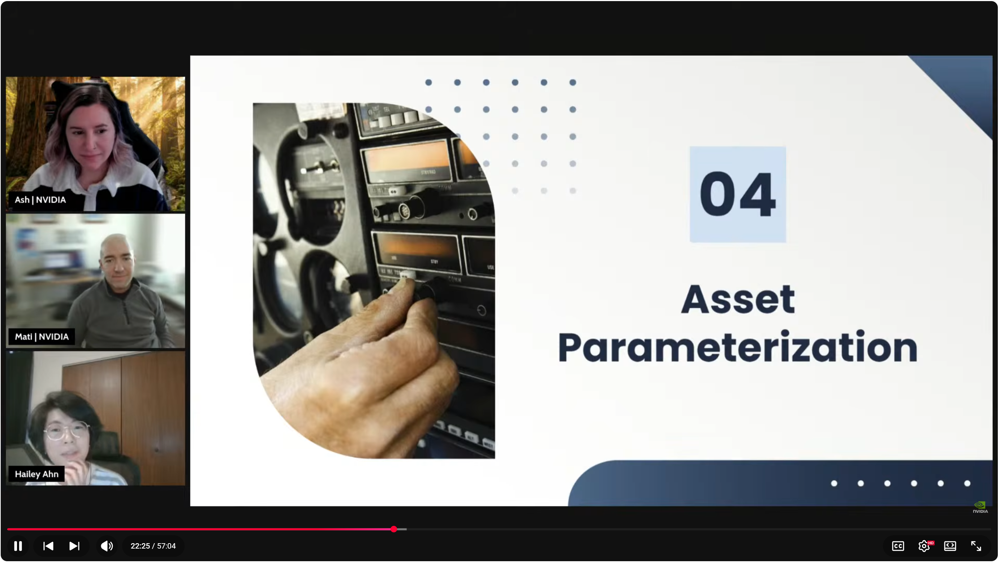</a>

**The demo:** Section header: **Asset Parameterization**. **Why it matters:** parameterization is how teams avoid "duplicate the asset 15 times" — it's also where sublayer strategies can accidentally fight with variants if ownership is unclear. **Learn more:** [70 - Variant sets](#link-70)


<a href="Pics/WhatYouShouldKnowAboutContentAggregation/ContentAggregation_8h26_10.png">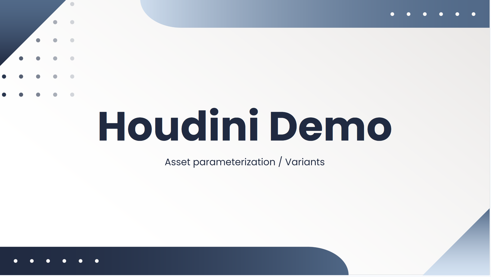</a>

<a href="Pics/WhatYouShouldKnowAboutContentAggregation/ContentAggregation_8h26_19.png">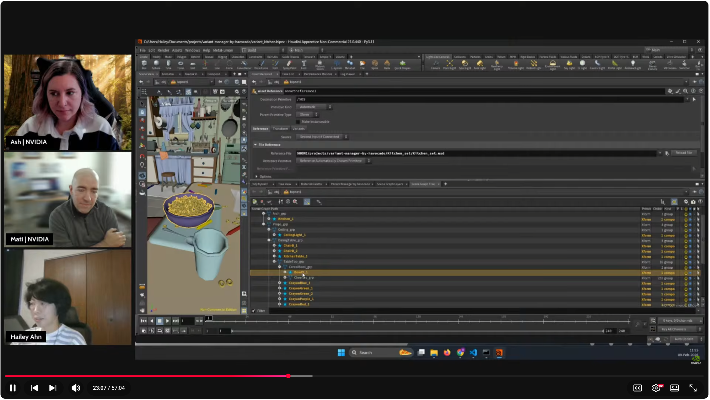</a>

**The idea:** Houdini scene graph + context menu showing how variants/parameters are operated in a DCC. **Why it matters:** this is where "collaboration lanes" become real: one team owns a variant set, another owns lookdev, another owns layout. **Learn more:** [70 - Variant sets](#link-70), [9 - Layers and sublayers](#link-9)

<a href="Pics/WhatYouShouldKnowAboutContentAggregation/ContentAggregation_8h32_48.png"></a>

**The pattern:** Houdini showing variant thumbnails / switching UI on an asset (chair). **Why it matters:** if your variant switching requires loading massive geometry every time, your review workflow will die. **Learn more:** [11 - Payloads](#link-11), [67 - Reference deck](#link-67)

<a href="Pics/WhatYouShouldKnowAboutContentAggregation/ContentAggregation_8h33_40.png">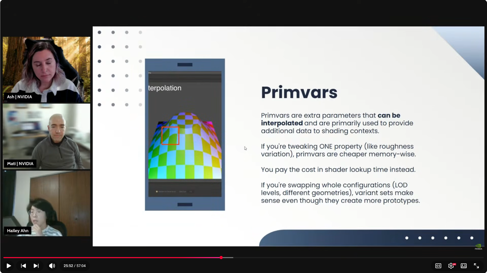</a>

**At this moment:** **Primvars** slide: use primvars for small per-property tweaks (cheaper memory-wise) vs variants for swapping whole configurations. **Why it matters:** "small change vs big configuration swap" is an aggregation decision. **Learn more:** [71 - Primvars](#link-71), [70 - Variant sets](#link-70)

### Concept -> What breaks -> How to test

- **Concept:** Variants for whole-configuration swaps; primvars for small per-property tweaks.
- **What breaks:** Duplicating assets instead of parameterizing; mixing variant and primvar semantics; and authoring variants that require heavy payload loads because nothing is lofted above the payload boundary.
- **How to test:** Inspect variant sets and primvars in usdview; verify switching behavior.

### Breakout - Variants vs primvars decision

| Use case | Mechanism |
|---------|-----------|
| Swap whole configuration (e.g., chair style) | Variant set |
| Small per-property tweak (e.g., color, scale) | Primvar |
| Same-namespace override lane | Sublayer |

### Kitchen checkpoint (carry-forward)

- **Kitchen decision:** Use variants for chair/appliance options; use primvars for layout tweaks that don't warrant a new variant.
- **What you just encoded:** Parameterization reduces duplication and keeps collaboration lanes clear.
- **Carry forward into Chapter 5:** Lofting and department layers (geo/materials/rigging) structure how teams work without chaos.

### Script Lab (planned / not yet committed)

- `aggregation/05_variants_primvars_probe.py`

---

<a id="chapter-5"></a>
## Chapter 5 - Lofting & Workstreams

**Video section (approx):** `26:32-52:30` (lofting ~27 min; overrides/conflict tracing ~47 min)  
**Watch first:** [YouTube source - jump to chapter section](https://www.youtube.com/live/LFCauWTNBM4?t=1592)

*Lofting is covered early in the video (~27 min); overrides/conflict tracing later (~47 min). Both address "how teams work without chaos."*

### Video frames (chronological)

Click any thumbnail to open full-size.

#### Lofting and workstream lanes (26:32-28:07)

<a href="Pics/WhatYouShouldKnowAboutContentAggregation/ContentAggregation_8h34_23.png"></a>

**The key moment:** Section header: **Lofting & Workstreams**. **Why it matters:** this is where the talk becomes explicitly "team structure": how modelers, texture artists, and riggers can work without chaos. **Learn more:** [9 - Layers and sublayers](#link-9), [67 - Reference deck](#link-67)

<a href="Pics/WhatYouShouldKnowAboutContentAggregation/ContentAggregation_8h34_29.png">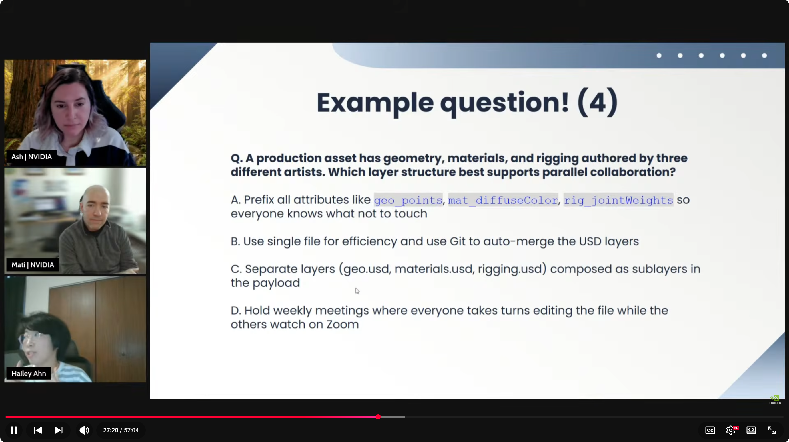</a>

**Here:** Example question: best layer structure for parallel collaboration across geometry/materials/rigging. **Answer intent:** separate department layers (e.g., `geo.usd`, `materials.usd`, `rigging.usd`) then compose them as **sublayers** inside the asset's payload. **Learn more:** [9 - Layers and sublayers](#link-9), [11 - Payloads](#link-11)

<a href="Pics/WhatYouShouldKnowAboutContentAggregation/ContentAggregation_8h34_55.png">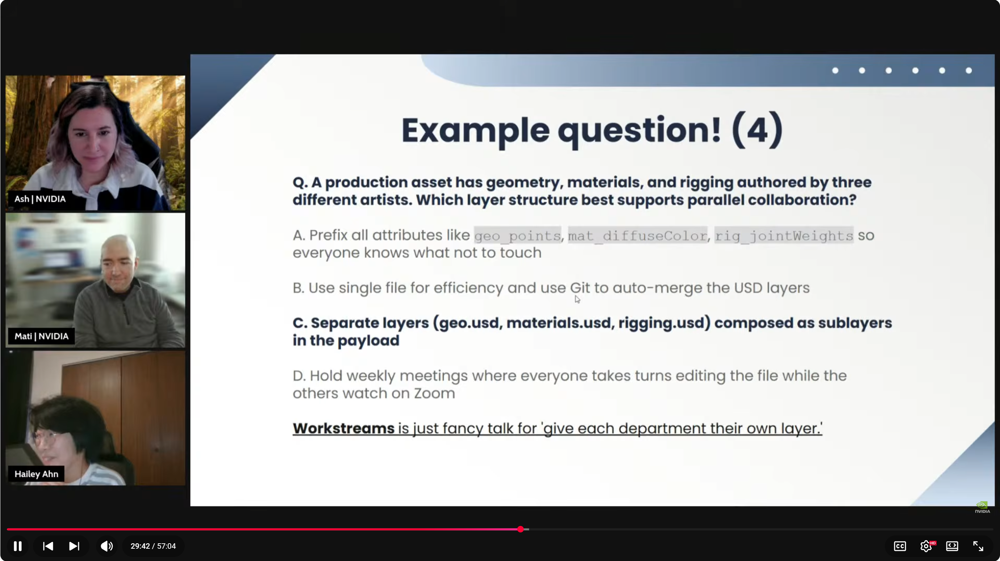</a>

**Interesting approach:** Example question (answered): parallel collaboration works best when geometry/materials/rigging live in separate layers and are composed as sublayers (often inside an asset payload). **Learn more:** [10 - References](#link-10), [9 - Layers and sublayers](#link-9)

#### Lofting visibility across reference/payload boundary (moved from Ch 3)

<a href="Pics/WhatYouShouldKnowAboutContentAggregation/ContentAggregation_8h35_06.png">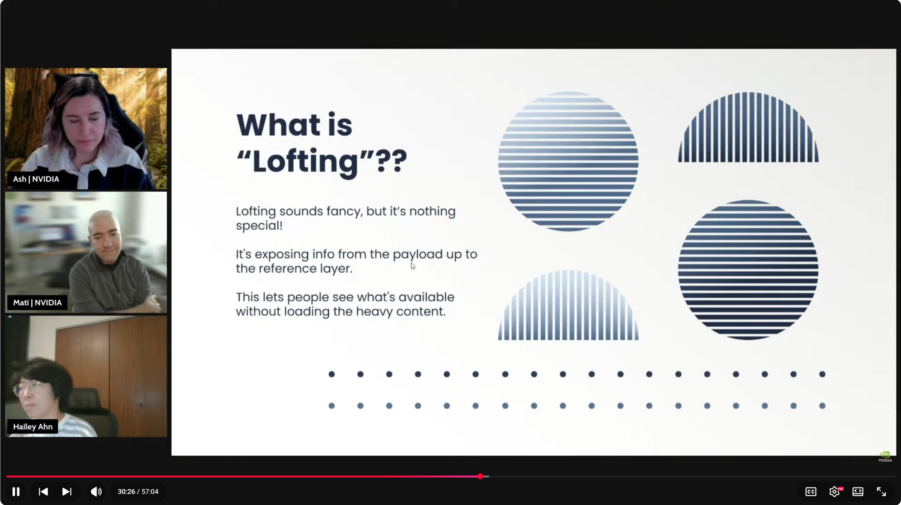</a>

<a href="Pics/WhatYouShouldKnowAboutContentAggregation/ContentAggregation_8h36_01.png">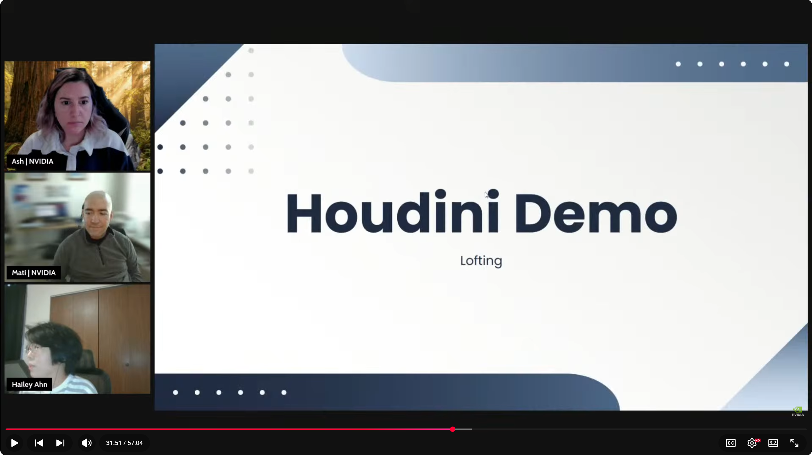</a>

**The slide lands:** "What is lofting?" slide: expose information from the payloaded contents into the always-composed asset interface (outside the payload) so people can see what exists without loading heavy content. **Why it matters:** lofting is a key tactic for "fast stage open + still debuggable", especially when your referenced assets are huge. **Learn more:** [10 - References](#link-10), [11 - Payloads](#link-11), [67 - Reference deck](#link-67)

<a href="Pics/WhatYouShouldKnowAboutContentAggregation/ContentAggregation_8h36_37.png">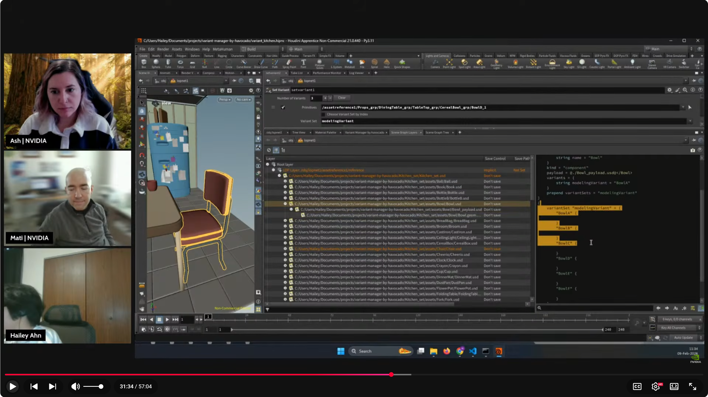</a>

**Hailey shifts to:** Houdini demo of lofting: the UI shows how authored data is split across layers so consumers can browse/parameterize assets without forcing heavy geometry load. **Why it matters:** this is the "collaboration reality" view - where layer boundaries are visible and therefore governable. **Learn more:** [42 - Solaris/USD docs](#link-42), [29 - Writing USD from Houdini](#link-29)

### Intro bridge

This pillar is where aggregation becomes a day-to-day team workflow instead of a one-off composition trick.

- **Workstreams:** separate department-owned lanes (geo/materials/rigging/lookdev/layout) so parallel work is predictable.
- **Lofting:** keep the asset interface and lightweight metadata visible *above* payload boundaries so people can browse and configure without always loading heavy geometry.

And when something still “looks wrong”, the second half of this pillar is your debugger’s lifeline: **trace the winning opinion to its authored source** instead of guessing.

In the kitchen scene, this is how you prove why the mug is in the wrong place (or why the wrong material “won”) without guessing.

**Digital twin breakout (Packaging Cell 3 / Station 7):** this decides which status color, transform, or metadata value the operator actually sees.

### Concept -> What breaks -> How to test

- **Concept:** Workstreams (department lanes) + lofting (interface above payload) + source tracing (find the winning authored opinion).
- **What breaks:** Departments editing the same layer, payload-only interfaces that force heavy loads, and incorrect assumptions about which file “wins” due to undocumented layer order and hidden arc interactions.
- **How to test:** Open the asset with payloads unloaded and confirm the interface is still browsable; then trace one high-risk property to its winning source and verify it matches intended ownership.

### Practical resolution guidance

- Keep department lanes explicit (separate layers, named by ownership/intent) so “who owns the truth” is never ambiguous.
- Loft what reviewers need (variants, kinds, assetInfo, look bindings) above payload boundaries so “browse/configure” doesn’t require “load everything”.
- Pick one high-risk property per review (transform, status color, active variant, visibility) and trace it end-to-end.
- Record the winner source in review notes to reduce repeated debugging.
- Treat “it looked right once” as non-evidence unless source tracing confirms it.

### Key moment and interpretation
*(See the matching frame in the "Video frames" section at the top of this chapter.)*

This is where the tutorial aligns with certification logic:
- not "what do I expect,"
- but "which authored opinion is strongest here, and why?"

### Breakout - Value source trace triage matrix

Digital twin example (Packaging Cell 3): query the resolved value you see, then pair it with source tracing to find the winner.

| Symptom | First check | Source-trace move | Typical fix location |
|---|---|---|---|
| Wrong transform/value | Confirm current load mode and active variant | Trace winning opinion for that exact property | Owning layer/node that authored the winning value |
| Wrong material/visibility | Verify binding path and inheritance context | Trace binding source + strongest override | Lookdev/material lane or accidental review override layer |
| Asset appears “missing” | Confirm payload load state | Trace whether prim exists but is unloaded | Payload policy/default load config, not geometry authoring |
| Works for one teammate only | Compare app/load/config context | Re-run trace in same context on both machines | Policy/docs/launch config mismatch |

**Why this works**
- It gives you the composed result that reviewers actually see.
- It anchors debugging on specific properties, not vague visual impressions.

**Why this fails**
- It fails when teams stop at the value and do not inspect winning source.
- It fails if queries are run in a different load/config context than the failing scene.

### Kitchen checkpoint (carry-forward)

- **Kitchen decision:** Pick one “symptom” in the kitchen (mug position, wrong material, unexpected visibility) and trace it to a concrete winning source instead of guessing.
- **What you just encoded:** Evidence-based debugging: the resolved value is not enough — the source is the actual fix location.
- **Carry forward into Chapter 6:** When you find the source, ask whether the source is a healthy pattern (owned layer/module) or an anti-pattern (mystery overrides, long-lived review fixes, accidental coupling).

### Script Lab (planned / not yet committed)

- `aggregation/06_value_source_trace.py`

---

<a id="chapter-6"></a>
## Chapter 6 - Model Hierarchy

<a href="Pics/WhatYouShouldKnowAboutContentAggregation/ContentAggregation_8h37_53.png">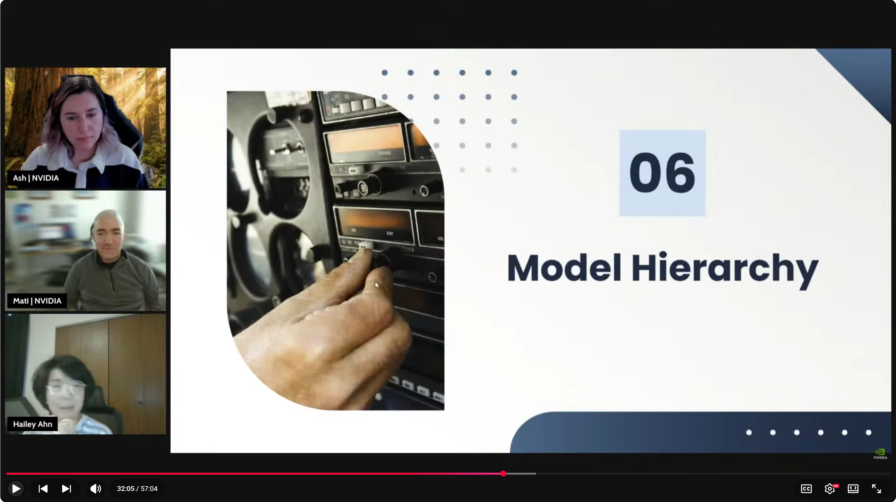</a>

**Video section (approx):** `34:39-end`  
**Watch first:** [YouTube source - jump to chapter section](https://www.youtube.com/live/LFCauWTNBM4?t=2079)

### Model Kinds

Model kinds (component, assembly, group) make large composed scenes **navigable** and **machine-queryable** — they are a semantic contract, not decoration. **Learn more:** [72 - Model kinds](#link-72), [73 - Kind system (OpenUSD)](#link-73).

Quick mental model:
- **Component:** publishable leaf asset; should not contain other components.
- **Assembly:** meaningful collection (often a publishable unit) that can contain components/assemblies.
- **Group:** purely organizational; useful for cleanliness, but not a substitute for a real asset boundary/contract.

#### Video frames (chronological)

<a href="Pics/WhatYouShouldKnowAboutContentAggregation/ContentAggregation_8h38_04.png">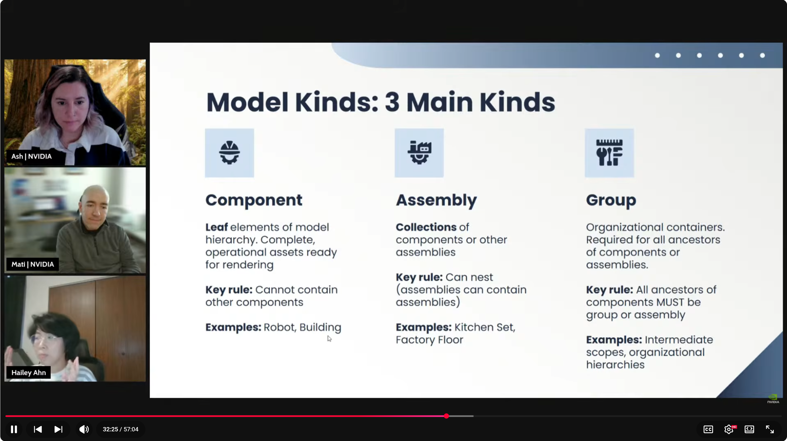</a>

**The question:** "Model Kinds: 3 main kinds" (component / assembly / group). **Why it matters:** kinds let tools traverse your stage like a table-of-contents — crucial when payloads hide geometry and you still need a stable, readable hierarchy.

<a href="Pics/WhatYouShouldKnowAboutContentAggregation/ContentAggregation_8h48_16.png"></a>

**The reminder:** if your hierarchy is semantically wrong (wrong kinds), downstream assumptions break (validation, navigation, reuse). This is why Hailey keeps saying “be kind to the pipeline”: kinds are for other people and downstream tools.

### Payload boundary and load-state discipline

**Video section (approx):** `37:30-46:30`  
**Watch first:** [YouTube source - jump to chapter section](https://www.youtube.com/live/LFCauWTNBM4?t=2250)

#### Video frames (chronological)

<a href="Pics/WhatYouShouldKnowAboutContentAggregation/ContentAggregation_8h38_54.png"></a>

<a href="Pics/WhatYouShouldKnowAboutContentAggregation/ContentAggregation_8h46_25.png">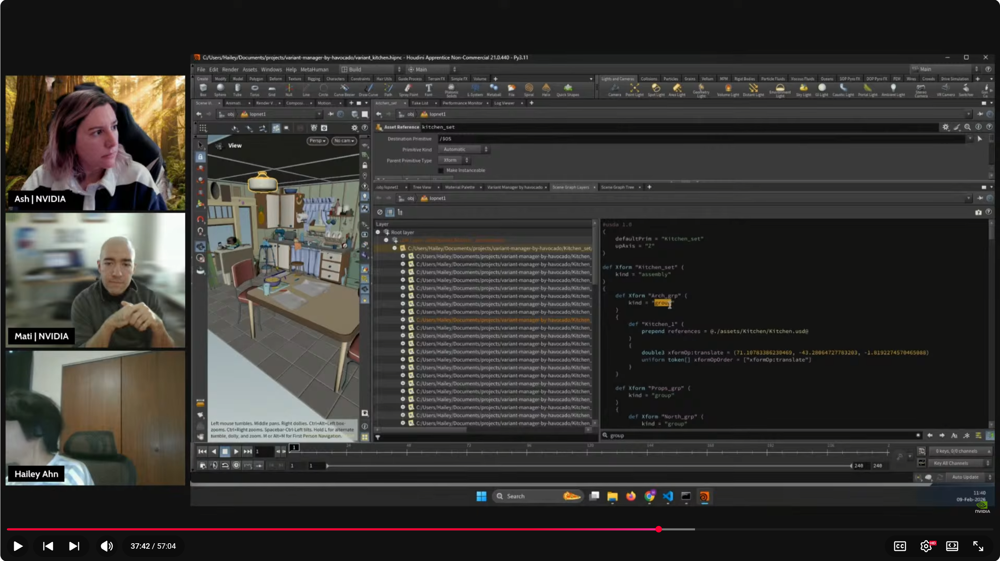</a>

**The demo:** Houdini/Solaris view with an inspection panel and code/editor view: this is the practical "where is the payload boundary?" authoring environment. **Why it matters:** payload design is only safe when you can audit it (what loads, what stays available, what is referenced vs payloaded). **Learn more:** [11 - Payloads](#link-11), [15 - Stage API](#link-15)

 <a href="Pics/WhatYouShouldKnowAboutContentAggregation/ContentAggregation_8h46_51.png">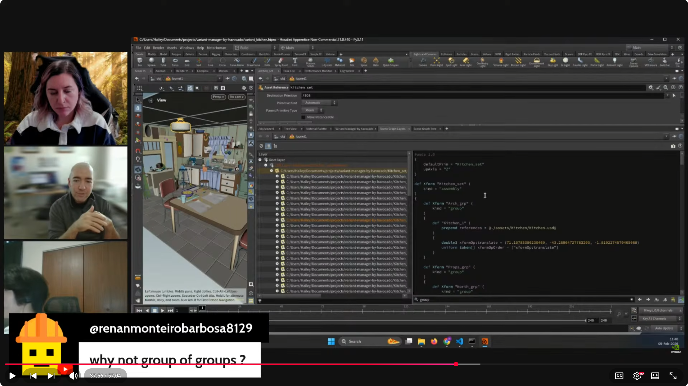</a>

**The key takeaway:** payloads make "what you see" dependent on load state. Two teammates can open the same stage and see different results unless default payload policy is explicit and tested. **Learn more:** [11 - Payloads](#link-11), [15 - Stage API](#link-15)

### Anti-Patterns

**Video section (approx):** `52:30-56:00`  
**Watch first:** [YouTube source - jump to chapter section](https://www.youtube.com/live/LFCauWTNBM4?t=3150)

### Video frames (chronological)

Click the thumbnail to open full-size.

<a href="Pics/WhatYouShouldKnowAboutContentAggregation/ContentAggregation_8h52_54.png">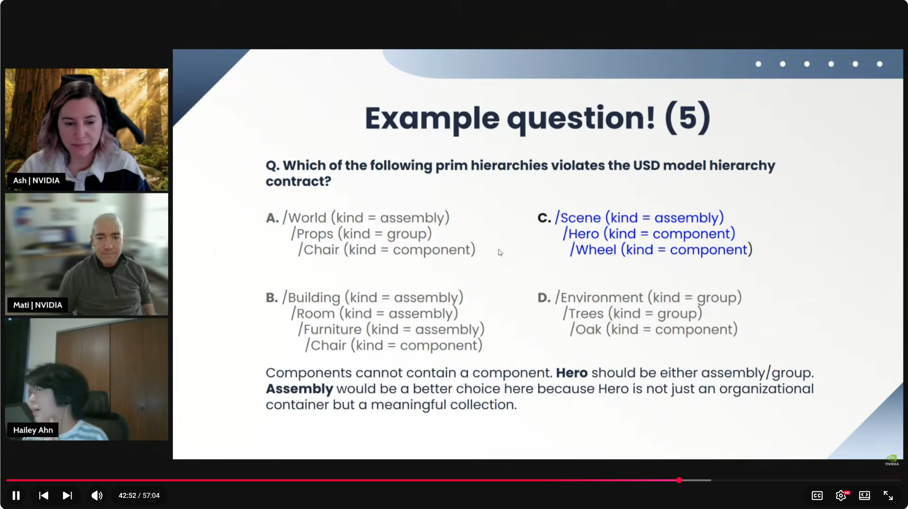</a>

**The answer:** Model hierarchy example question answer: a **component** should not contain another component (model hierarchy convention); “Hero” should be assembly/group when it meaningfully collects other components. **Why it matters:** treating hierarchy as “whatever looks tidy” instead of a semantic contract leads to brittle navigation, validation failures, and wrong assumptions downstream. **Learn more:** [72 - Model kinds](#link-72), [73 - Kind system (OpenUSD)](#link-73)

### Intro bridge

This chapter converts "we got lucky in review" into "we are robust by design." Anti-patterns are expensive because they often look fine until handoff or runtime.

In the kitchen scene, these are the mistakes that create “it works on my machine” stages: implicit contracts, hidden fixes, and ambiguous ownership that only reveal themselves when someone else opens the scene or tries to reuse an asset.

**Digital twin breakout (Packaging Cell 3 / Station 7):** these are the mistakes that waste integration days: implicit contracts, hidden fixes, and ambiguous ownership.

### Common anti-patterns

- Mixed responsibilities in one layer without ownership boundaries.
- Hidden assumptions about default prim and path contracts.
- Runtime-only fixes that never get authored upstream.

### Additional high-frequency anti-patterns

- Using payloads as a generic reference replacement without load-policy governance.
- Overusing review-time override layers as long-term production sources.
- Relying on tool auto-corrections as if they were USD guarantees.

### Key moment and interpretation
*(See the matching frame in the "Video frames" section at the top of this chapter.)*

At this stage, the tutorial shifts from feature knowledge to operational behavior:
- what to stop doing,
- what to standardize,
- and how to avoid repeating the same integration regressions.

### Breakout - Anti-pattern triage matrix

| Smell | Why risky | Immediate containment | Durable fix |
|---|---|---|---|
| Mystery override layer | Nobody can explain why it wins | Freeze further edits to that layer | Reassign ownership and migrate intended opinions upstream |
| Deep internal path dependencies | Refactors break downstream silently | Flag as contract violation | Re-anchor consumers to stable public interface/default prim |
| Payload used as generic reference substitute | Inconsistent visibility across teams/tools | Document current load policy immediately | Redesign boundary: what must be visible unloaded vs loaded |
| Review-time fix promoted to production by accident | Temporary patches become long-term truth | Mark layer as temporary + expiry | Convert accepted fix into owned source layer and remove patch lane |

**Why this works**
- It turns recurring failures into a repeatable automated check.
- It creates shared language for cross-team review.

**Why this fails**
- It fails if checks exist but no team owns remediation.
- It fails if audit passes are not part of release gates.

### Kitchen checkpoint (carry-forward)

- **Kitchen decision:** Treat “it works in my scene” as a warning sign. If the kitchen stage only works with local fixes, you have an aggregation anti-pattern, not a solved problem.
- **What you just encoded:** Anti-pattern awareness as a checklist: ownership, contracts (`defaultPrim`, paths), stack discipline, and explicit load policy.
- **Carry forward:** Convert the checklist into a **release gate** so “good aggregation” is enforced automatically at handoff time (see Production Checklist below).

### Script Lab (planned / not yet committed)

- `aggregation/07_aggregation_antipattern_audit.py`

### Production Checklist

**Video section (approx):** `56:00-end`  
**Watch first:** [YouTube source - jump to chapter section](https://www.youtube.com/live/LFCauWTNBM4?t=3360)

#### Video frames (chronological)

Click the thumbnail to open full-size.

<a href="Pics/WhatYouShouldKnowAboutContentAggregation/ContentAggregation_8h56_10.png"></a>

**Now:** A recap moment that points toward “operationalizing” what you learned (turn the concepts into a checklist/release gate). **Why it matters:** without a checklist, “aggregation correctness” is subjective and tool-dependent; with a checklist, it becomes reproducible across people and apps. **Learn more:** [13 - Value resolution](#link-13), [11 - Payloads](#link-11), [67 - Reference deck](#link-67)

#### Intro bridge

This final section is the conversion point from learning to operation. The goal is not "looks okay once." The goal is a repeatable pass/fail gate before handoff.

If this checklist is used consistently, your aggregate stays stable even while content keeps evolving across contributors — whether you are validating a kitchen scene for reuse or a production digital twin before a review session.

#### Validation checklist

- Contract metadata (`defaultPrim`, `upAxis`, `metersPerUnit`) verified.
- Aggregation arcs intentionally selected and documented.
- No unresolved paths in final aggregate stage.
- Expected contributors present in composition stack.
- Critical properties traced to intended sources.
- Payload load policy documented for runtime consumers.

#### Key moment and interpretation
*(See the matching frame in the "Video frames" section at the top of this section.)*

The closing section reinforces that good aggregation is a process discipline:
- define contracts,
- validate systematically,
- and keep source ownership traceable.

#### Breakout - Release gate readiness matrix

| Gate item | Pass criterion | Evidence to store |
|---|---|---|
| Interface contract | `defaultPrim`, units, up-axis, and public paths are valid | Validation snapshot + contract checklist |
| Composition integrity | Expected contributors/arcs present, no unresolved paths | Layer stack trace + unresolved-path report |
| Value ownership | High-risk properties traced to intended source owners | Source-trace notes for chosen properties |
| Payload policy | Default/optional load behavior documented and reproducible | Load-mode test record across target tools |
| Decision outcome | PASS/FAIL is explicit and actionable | Gate report with owner + remediation tasks |

**Why this works**
- It enforces standards at release time, not only during manual review.
- It creates a clear pass/fail signal teams can align around.

**Why this fails**
- It fails if validation scope is too narrow (for example ignores payload state).
- It fails if PASS is accepted without storing traceable evidence.

#### Kitchen checkpoint (carry-forward)

- **Kitchen decision:** Make “PASS/FAIL” real: validate contracts, contributors, resolution sources, and payload policy before you declare the kitchen stage “good.”
- **What you just encoded:** A reproducible handoff: the same stage should open and validate consistently across tools and people.
- **Carry forward into Chapter 7:** Use Community Q&A to connect this checklist mindset to real audience edge cases, then use the crosswalk section for Packaging Cell / Station scenarios.

#### Script Lab (planned / not yet committed)

- `aggregation/08_release_gate_report.py`

<a href="Pics/WhatYouShouldKnowAboutContentAggregation/ContentAggregation_8h52_58.png">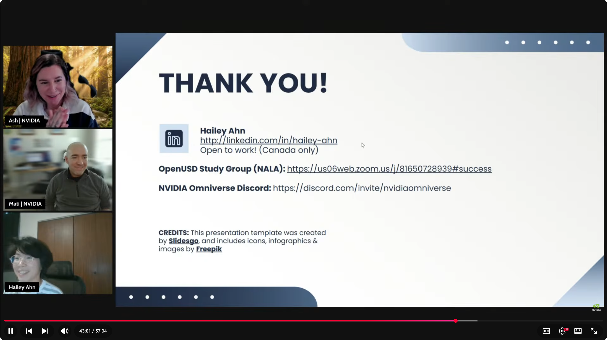</a>

**Here:** Closing "Thank you" slide with links to community/support channels. **Learn more:** [17 - Week 2 slides](#link-17), [18 - NVIDIA Discord](#link-18)


---

## Breakout Pattern (MANDATORY for every screenshot with decision logic)

Use one of these two structures:

1. **Decision matrix / checklist** (preferred when screenshot is conceptual or workflow-oriented)
2. **Runnable snippet + commentary** (only when real executable code adds clear value)

Use this exact structure so screenshots are converted into consistent deep-dive blocks:

- Heading: `### Breakout - <short name>`
- Option A (preferred): decision matrix/checklist with practical pass/fail or choose/avoid criteria
- Option B (when needed): fenced code block + short commentary
- Why this works: 2-4 bullets (what contract/behavior it demonstrates)
- Why this fails: 2-4 bullets (common misread, tool-default trap, or missing prerequisite)

---

<a id="chapter-7"></a>
## Chapter 7 - Community Questions

**Video section (approx):** `35:41-46:30` + post-content Q&A  
**Focus:** Audience-driven edge cases that cross chapter boundaries.

During the livestream, the Q&A exposes the stress points that usually appear after a team has "done everything right on paper": kind granularity, path portability, and cross-tool compatibility. This chapter keeps those moments together and ties each answer back to the exact pillar where the fix belongs.

### Runtime source tracing and checklist bridge (from livestream transition)

<a href="Pics/WhatYouShouldKnowAboutContentAggregation/ContentAggregation_8h55_28.png">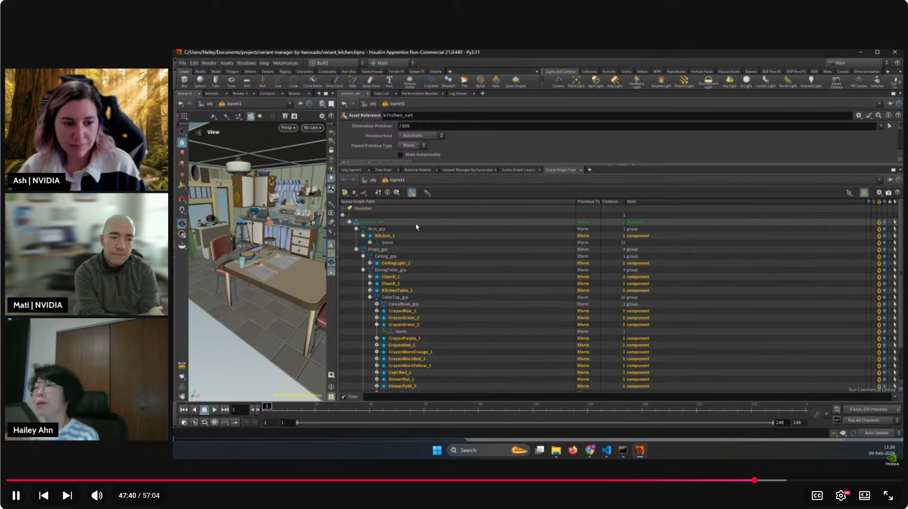</a>

This is the operational handoff moment between "composition theory" and "production debugging." In the Kitchen Set, the team stops debating intent and starts tracing a concrete winning opinion in the scene graph. That same move is what keeps a digital twin review from turning into guesswork when multiple departments contribute layers. **Learn more:** [15 - Stage API](#link-15), [12 - LIVRPS](#link-12). **Related pillar:** [Chapter 5](#chapter-5).

<a href="Pics/WhatYouShouldKnowAboutContentAggregation/ContentAggregation_9h03_27.png">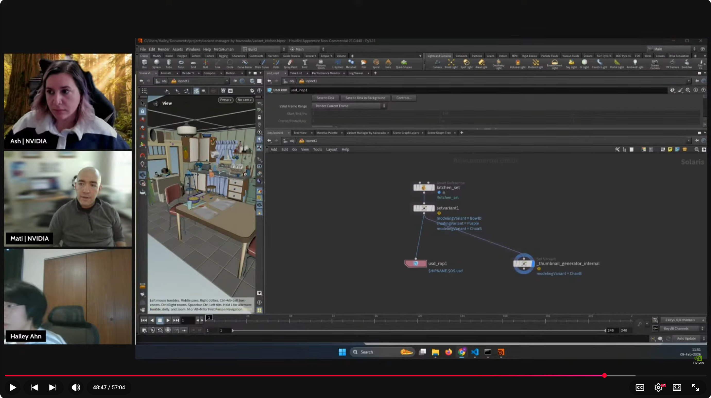</a>

The conversation then shifts one level upstream: not just "which layer wins," but "which authored graph generated the layer that wins." In node-based workflows, this distinction is the difference between fixing a symptom and fixing the actual source-of-truth. **Learn more:** [42 - Solaris/USD docs](#link-42), [15 - Stage API](#link-15). **Related pillar:** [Chapter 5](#chapter-5).

<a href="Pics/WhatYouShouldKnowAboutContentAggregation/ContentAggregation_8h56_10.png"></a>

The recap frame lands the key behavior change: tracing is only valuable when it leads to upstream correction, not another temporary override. This is exactly where Chapter 6's checklist mindset becomes real process discipline. **Learn more:** [13 - Value resolution](#link-13), [67 - Reference deck](#link-67). **Related pillar:** [Chapter 6](#chapter-6).

### Community Q&A — What the Audience Asked (and What the Team Answered)

These are not side questions. They are the moments where the six-pillar model gets pressure-tested by real production constraints.

### "Should the assembly or group be placed in a separate file?"

**Asked in chat** during the model hierarchy section (~35:41). **Hailey and Mati answered:**

Assemblies and groups can be stacked in the hierarchy — groups inside groups, assemblies inside groups. There is no requirement for a separate file. Think of it as *asset package* rather than *file*: an assembly could have lots of files. Components are treated as leaves in the model hierarchy convention; they should not contain other components. Assemblies and groups are organizational containers. In practice, **component** and **assembly** are good candidates for publishable assets — units of work that get passed around. **Groups** are purely organizational.

**Related pillar:** [Chapter 6 - Model Hierarchy](#chapter-6)

**Digital twin translation:** If you're modeling a city and don't care what's inside a building, a single building can be a component. If your whole scene is inside a building and you want to model each floor and window, that building becomes an assembly with components inside. The granularity depends on your workflow. Mati added: a robot can be a component (if you're a roboticist doing RL training and it's one small part of a larger environment) or an assembly (if you're the robot maker and care about every part). You can override kinds — author an opinion that changes a received asset's kind to match your workflow.

### "Are there any advantages to not defining the kinds?"

**Yan asked** (~40:21). **Hailey answered:**

Not defining kinds is not a requirement for basic scene composition — a stage can still compose without authored kinds. But **please be kind to the pipeline** by using model kinds. It's for other people; it's for collaboration. It's readability and legibility. Many tools offer a "model kinds only" view so people can interact with the scene without all the complexity; performance benefits from that view are tool-dependent and should be validated in your target app.

**Related pillar:** [Chapter 6 - Model Hierarchy](#chapter-6)

### "Do you need to be a programmer to do the exam?"

**Asked during Q&A** (~44:11). **Hailey and Ashley answered:**

You don't need to be a programmer by trade, but there are code questions. The Learn OpenUSD curriculum has code — you want to be familiar with Python and able to hack away on your own. Ashley recommended going through the Learn OpenUSD learning path; it helps with all those questions and lets you confidently interact with code even if you're not super familiar. People from VFX and engineering have gotten certified.

**Related pillars:** [Chapter 1 - Asset Structure Principles](#chapter-1), [Chapter 3 - Reference/Payload Pattern](#chapter-3)

### "How do I force relative paths?"

**Yan asked** (~45:22), referring to the earlier "spot the problem" example with absolute paths. **Mati answered:**

It depends on the editor and pipeline configuration — Omniverse, usdview, Houdini/Solaris, and custom tooling may behave differently. Some DCC workflows can emit absolute paths unless configured otherwise. If you're writing your own code, you have complete control. The practical rule is to enforce portable asset paths as a pipeline contract, then validate path portability in CI or pre-publish checks.

**Related pillars:** [Chapter 2 - Asset Interface and Encapsulation](#chapter-2), [Chapter 3 - Reference/Payload Pattern](#chapter-3)

### "How do I set up the USD file in Solaris/Houdini so it still opens in Omniverse?"

**Yan asked** (~46:30), with a follow-up about keeping the same structure when importing/exporting between applications. **Hailey, Mati, and Ashley answered:**

Hailey has limited Omniverse experience but noted that Houdini has its own internal structure (root layer, session layers, tree) and export nodes. If the internal structure looks correct in Houdini, it is a strong starting point for interoperability. Mati suggested USD Rop and the Houdini Component Builder for well-structured assets. In practice, many scenes transfer well from Houdini to Omniverse, but compatibility still depends on composition contracts, resolver behavior, schema/plugin availability, and especially material/render context differences. Ashley added: structure your USDA with best practices — for example, conflicting `defaultPrim` or entry-point assumptions between apps can cause integration issues. The preferred fix is to align entry contracts (`defaultPrim`, target prim paths, and reference/payload insertion paths), not to remove `defaultPrim` by default. Use Claude, Cursor, Perplexity, Discord, and forums. Divy also recommended MaterialX for better material interoperability.

**Related pillars:** [Chapter 2 - Asset Interface and Encapsulation](#chapter-2), [Chapter 3 - Reference/Payload Pattern](#chapter-3), [Chapter 4 - Asset Parameterization](#chapter-4)

---

## If You Remember Only 8 Things

1. Pick sublayer/reference/payload by intent, not habit.
2. Keep ownership explicit so teams do not overwrite each other silently.
3. Trace winner opinions before changing anything.
4. Use payloads to control review performance deliberately.
5. Treat path/defaultPrim contracts as non-negotiable.
6. Separate "looks fine" from "is composition-correct."
7. Keep kitchen decisions and digital-twin translations in lockstep.
8. Validate every aggregate stage before handoff.

---

## Industrial Digital Twin Continuity (Series Crosswalk)

This section maps Hailey's Kitchen Set storyline to the existing industrial examples so the full tutorial series reads as one continuous digital twin build-out.

### Shared logic across all examples

- Aggregation design is the same problem in all scenarios: define source ownership, composition entry points, and runtime load policy.
- Validation design is the same gate in all scenarios: check composition stack contributors, resolve winner opinions, and verify operational visibility.
- Collaboration design is the same handoff pattern in all scenarios: each team contributes in its lane without breaking upstream/downstream contracts.

### Crosswalk to existing USD GoodStart deep dives

| Anchor scenario | Why it matters for aggregation | Where to continue |
|---|---|---|
| **Kitchen Set (Hailey)** | Teaches modular content aggregation in a familiar DCC context (Houdini/Solaris) with practical authoring decisions. | This tutorial, plus [19 - Kitchen Set](#link-19) |
| **Packaging Cell 3** | Production composition arc decisions under review pressure; where wrong winner values and hidden overrides become operational risks. | [Understanding Composition Arcs](./Understanding%20Composition%20Arcs__VIDEO_DEEP_DIVE_TUTORIAL.md) |
| **Welding cell / visual review context** | Rendering and visibility become validation signals for the aggregate stage; what appears "fine" can still be composition-wrong. | [Rendering and Visualizing OpenUSD Scenes](./Rendering%20and%20Visualizing%20OpenUSD%20Scenes__VIDEO_DEEP_DIVE_TUTORIAL.md) |
| **Data-model-driven industrial pipeline** | Aggregated content must remain queryable and semantically stable for downstream automation and exchange. | [Building an OpenUSD Pipeline With Data Modeling](./Building%20an%20OpenUSD%20Pipeline%20With%20Data%20Modeling__VIDEO_DEEP_DIVE_TUTORIAL.md) |
| **Pipeline customization layer** | Resolver/schema/plugin strategy keeps aggregation deterministic when org-specific rules are required. | [Customizing OpenUSD for Your Pipeline](./Customizing_OpenUSD_for_Your_Pipeline__VIDEO_DEEP_DIVE_TUTORIAL.md) |

### Crosswalk to additional digital twin scenarios (beyond this series)

| Scenario | Typical aggregation pressure point | What to emphasize |
|---|---|---|
| **Multi-station line (Station 7 and neighbors)** | Multiple stations share upstream layout assets; local “fix layers” leak into production. | Sublayer ownership lanes + “review fixes must expire” policy. |
| **Brownfield reality capture (scan + CAD + live overlays)** | Heavy scan payloads + frequent CAD updates + overlays authored in different tools. | Payload load policy + path contracts + source tracing for “what changed.” |
| **Smart building / facility management** | Long-lived assets with many small updates; unclear “who owns the truth” for metadata. | Explicit authoring responsibility + deterministic layer order + metadata contract checks. |
| **Robotics simulation (physics + control overlays)** | Simulation layers fight with authored transforms and timing metadata. | Separate simulation overlays cleanly (sublayer/reference) + validate timing/units contracts. |
| **Supplier-delivered assemblies (black-box assets)** | Vendors ship “works in their viewer” assets with inconsistent `defaultPrim`/kinds/materials. | Reference health checks + contract metadata validation before integration. |

### Practical takeaway

If you can move confidently between Kitchen Set, Packaging Cell, welding review, and data-model exchange, you are no longer learning isolated topics - you are operating one coherent industrial digital twin pipeline.

## Appendix - Debug Playbook (Aggregation)

- Missing contributor: check `defaultPrim`, path, and layer inclusion.
- Duplicate content: inspect repeated references/sublayers and instancing intent.
- Wrong winner value: trace authored source through composition and strength.
- Slow stage open: inspect payload policy and heavy aggregate entry points.
- Non-reproducible behavior across tools: separate USD core behavior from tool defaults.

---


## Links

<a id="link-1"></a>
1. **YouTube Session** - https://www.youtube.com/watch?v=LFCauWTNBM4&list=PL3jK4xNnlCVf3HuZD4qOWlKlouJyh6Prb&index=2
   Full source session for this deep-dive. Use it for timestamp verification and speaker context when reviewing chapter mappings.

<a id="link-2"></a>
2. **Learn OpenUSD Curriculum** - https://docs.nvidia.com/learn-openusd/latest/index.html
   Canonical learning path used as the backbone for certification prep. Start here if you want structured progression across concepts.

<a id="link-3"></a>
3. **Awesome OpenUSD (curated index)** - https://github.com/matiascodesal/awesome-openusd
   Broad ecosystem index for OpenUSD learning, tools, and references. Use this when you need to branch beyond core course material.

<a id="link-4"></a>
4. **Certification series playlist** - https://youtube.com/playlist?list=PL3jK4xNnlCVf3HuZD4qOWlKlouJyh6Prb&si=JXpXQbFD7-snbq84
   Complete office-hours sequence leading into certification topics. Useful for continuity and multi-session reinforcement.

<a id="link-5"></a>
5. **USD GoodStart README** - [README.md](../README.md)
   Entry point to repository structure, conventions, and setup scripts. Read this if you want to align tutorial practice with project organization. (Optional upstream overview: https://github.com/jph2/USD_GoodStart)

<a id="link-6"></a>
6. **usdview + Python setup** - https://docs.nvidia.com/learn-openusd/latest/usdview-install-instructions.html
   Practical setup instructions for running and inspecting USD examples locally. Essential before executing any script labs.

<a id="link-7"></a>
7. **Glossary** - https://docs.nvidia.com/learn-openusd/latest/glossary.html
   Fast terminology lookup for composition and shading language. Keep this open while reading transcripts and API snippets.

<a id="link-8"></a>
8. **Introduction to composition** - https://docs.nvidia.com/learn-openusd/latest/composition-basics/what-is-composition.html
   High-level explanation of how USD builds composed scenes from authored sources. Best first read for beginners before diving into arc-specific docs.

<a id="link-9"></a>
9. **Layers and sublayers** - https://docs.nvidia.com/learn-openusd/latest/creating-composition-arcs/sublayers/index.html
   Focused guide on sublayer usage and stack behavior. Use this to validate Chapter 2 decisions and ownership strategies.

<a id="link-10"></a>
10. **References** - https://docs.nvidia.com/learn-openusd/latest/creating-composition-arcs/references/index.html
   Practical reference-arc guide for reusable asset insertion. Helpful when separating stage merge concerns from asset modularity.

<a id="link-11"></a>
11. **Payloads** - https://docs.nvidia.com/learn-openusd/latest/creating-composition-arcs/payloads/index.html
   Explains deferred loading semantics and payload authoring patterns. Use this when scene size and runtime performance become bottlenecks.

<a id="link-12"></a>
12. **LIVRPS** - https://docs.nvidia.com/learn-openusd/latest/composition-basics/strength-ordering.html
   Strength-ordering reference for opinion resolution. Critical for debugging "why this value wins" in aggregated stages.

<a id="link-13"></a>
13. **Value resolution** - https://docs.nvidia.com/learn-openusd/latest/composition-basics/value-resolution.html
   Covers how final values are resolved from multiple authored opinions. Pair this with LIVRPS for practical troubleshooting.

<a id="link-14"></a>
14. **Asset structure** - https://docs.nvidia.com/learn-openusd/latest/best-practices/asset-structure.html
   Asset organization best practices that support clean composition boundaries. Useful for avoiding hard-to-maintain aggregation layouts.

<a id="link-15"></a>
15. **Stage API (OpenUSD docs)** - https://openusd.org/release/api/class_usd_stage.html
   Primary API reference for stage operations and queries. Use this when implementing validation scripts and composition inspection tools.

<a id="link-16"></a>
16. **OpenUSD best-practices index** - https://docs.nvidia.com/learn-openusd/latest/best-practices/index.html
   Consolidated best-practice hub across authoring and pipeline topics. Good checkpoint when building your own team standards.

<a id="link-17"></a>
17. **Week 2 Content Aggregation Slides (Hailey Ahn)** - https://docs.google.com/presentation/d/15niFZnos4pxtClkhkuGLiQ1xQyMm_5z_okZo9WUqK4U/edit?usp=sharing
   Direct slide deck used in this session. Best companion resource for screenshot-to-transcript mapping.

<a id="link-18"></a>
18. **NVIDIA Omniverse Discord** - https://discord.gg/nvidiaomniverse
   Community channel for session announcements, Q&A, and ecosystem discussion. Use it for follow-up clarifications and peer support.

<a id="link-19"></a>
19. **OpenUSD Kitchen Set (Houdini demo asset)** - https://openusd.org/release/dl_kitchen_set.html
   Official sample dataset used in tutorial examples. Great sandbox for composition and aggregation experiments.

<a id="link-20"></a>
20. **OpenUSD Downloads and Videos** - https://openusd.org/dev/dl_downloads.html
   Central page for sample assets and official media resources. Useful for collecting additional test scenes and references.

### Houdini Solaris links

<a id="link-21"></a>
21. **Variant Manager by havocado (GitHub)** - https://github.com/havocado/variant-manager-by-havocado
   Community utility focused on variant workflows. Helpful for practical variant management patterns in Houdini contexts.

<a id="link-22"></a>
22. **Video - Solaris/USD workflow** - https://www.youtube.com/watch?v=aA3xUZscC50
   Hands-on Solaris/USD walkthrough. Good for seeing composition ideas applied in node-based workflows.

<a id="link-23"></a>
23. **Video - Solaris/USD workflow** - https://www.youtube.com/watch?v=tbzIABrViYg&t=28s
   Additional practical Solaris workflow example with direct timeline references. Useful as an alternate explanation path.

<a id="link-24"></a>
24. **Perplexity thread - Export variant sets and references from Solaris** - https://www.perplexity.ai/search/how-do-i-export-variant-sets-a-B.0x9ggNS7OluBeEyzLPNw
   Research thread capturing implementation questions about Solaris export strategy. Useful as a quick idea index, then verify with official docs.

<a id="link-25"></a>
25. **Video - Solaris/USD workflow** - https://www.youtube.com/watch?v=pETaeV6aJmE
   Demonstrates additional Solaris-to-USD authoring flow. Good for comparing scene organization choices across presenters.

<a id="link-26"></a>
26. **Video - Solaris/USD workflow** - https://www.youtube.com/watch?v=xe3B3HaeJX8
   Supplemental Solaris session with practical node usage context. Helpful when building your own chapter-level practice tasks.

<a id="link-27"></a>
27. **Video - Solaris/USD workflow** - https://www.youtube.com/watch?v=fO4yTEMWmYY
   Another applied tutorial for Solaris and USD graph logic. Use it to reinforce authoring patterns through repetition.

<a id="link-28"></a>
28. **Video - Solaris/USD workflow** - https://www.youtube.com/watch?v=WfC16LYYIAw
   Workflow-oriented tutorial focused on production-oriented Solaris usage. Useful for triangulating best practices.

<a id="link-29"></a>
29. **OpenUSD docs - Writing USD from Houdini** - https://openusd.org/docs/Writing-USD-from-Houdini.html
   Official documentation on Houdini-to-USD authoring behavior. Keep this as the authoritative reference for exporter semantics.

<a id="link-30"></a>
30. **Video - Solaris/USD workflow** - https://www.youtube.com/watch?v=yAhQ9z5Cc_I&t=1s
   Practical clip covering USD workflow details in Solaris. Good for quick visual refreshers when docs feel too abstract.

<a id="link-31"></a>
31. **SideFX - Solaris Essentials (LOPs, Karma, MaterialX)** - https://www.sidefx.com/solaris-essentials-lops-karma-matx/
   Official SideFX learning page for core Solaris topics. Useful for structured fundamentals before advanced aggregation patterns.

<a id="link-32"></a>
32. **Video - Solaris Essentials playlist entry** - https://www.youtube.com/watch?v=hBYSHFRnFlo&t=1s
   Playlist entry aligned with SideFX essentials content. Good jump point for step-by-step LOPs onboarding.

<a id="link-33"></a>
33. **SideFX tutorial - USD Asset Building with Solaris** - https://www.sidefx.com/tutorials/usd-asset-building-with-solaris/
   Focused lesson on building reusable USD assets inside Solaris. Strong companion for reference and variant decisions.

<a id="link-34"></a>
34. **Video - USD Asset Building with Solaris** - https://www.youtube.com/watch?v=FVmFFn7EPdA&t=7s
   Video counterpart to asset-building guidance. Useful for seeing implementation details in motion.

<a id="link-35"></a>
35. **Video - Solaris/USD workflow** - https://www.youtube.com/watch?v=XT8KYP8bE3U
   Additional practical workflow sample for USD authoring in Solaris. Good for comparing stage graph organization styles.

<a id="link-36"></a>
36. **SideFX tutorial - USD Authoring with Solaris** - https://www.sidefx.com/tutorials/usd-authoring-with-solaris/
   Official tutorial focused on authoring mechanics and conventions. Useful for tightening correctness in daily production work.

<a id="link-37"></a>
37. **SideFX tutorial - Solaris is Sweet** - https://www.sidefx.com/tutorials/solaris-is-sweet/
   Introductory-style tutorial with practical demonstrations. Good for quick concept refresh when returning to Solaris workflows.

<a id="link-38"></a>
38. **SideFX tutorial - USD Basics with Solaris** - https://www.sidefx.com/tutorials/usd-basics-with-solaris/
   Foundation tutorial for core USD concepts through Solaris. Recommended for junior team members joining the pipeline.

<a id="link-39"></a>
39. **Video - Solaris/USD workflow** - https://www.youtube.com/watch?v=jmOyAcHTFC0
   Additional workflow video for composition and scene assembly context. Helpful for broadening pattern recognition.

<a id="link-40"></a>
40. **Google query/video result - Load USD scene in Solaris Houdini** - https://www.google.com/search?q=load+usd+scene+in+solaris+houdini&rlz=1C1CHBF_enDE1119DE1119&oq=Load+USD+scene+in+Solaris+Hou&gs_lcrp=EgZjaHJvbWUqBwgCECEYoAEyBggAEEUYOTIHCAEQIRigATIHCAIQIRigATIHCAMQIRigATIHCAQQIRiPAtIBCTE3MjMxajBqN6gCALACAA&sourceid=chrome&ie=UTF-8#fpstate=ive&vld=cid:765acd8f,vid:bWsB7JT6Wx0,st:0
   Discovery link capturing common search intent and a concrete video result. Useful as a fallback when onboarding new users.

<a id="link-41"></a>
41. **Video playlist entry - Solaris Essentials** - https://www.youtube.com/watch?v=hBYSHFRnFlo&list=PLXNFA1EysfYklJkoKc-35g4SVM2YOflWD&index=1
   Playlist context for staged Solaris essentials learning. Helps maintain sequence instead of isolated clips.

<a id="link-42"></a>
42. **SideFX docs - Solaris and USD overview** - https://www.sidefx.com/docs/houdini/solaris/usd.html
   Official reference for Solaris/USD integration behavior. High-authority source for tool-specific semantics and caveats.

### Houdini and USD links

<a id="link-43"></a>
43. **Tokeru - USD Asset Guide** - https://tokeru.com/cgwiki/UsdAssetGuide.html
   Community guide with practical production notes and examples. Great for bridging official docs and day-to-day tactics.

<a id="link-44"></a>
44. **Pixelninja tools** - https://www.pixelninja.design/tools
   Tool collection relevant to Houdini and procedural workflows. Useful as a discovery point for productivity helpers.

<a id="link-45"></a>
45. **Video - Houdini/USD workflow** - https://www.youtube.com/watch?v=5JppllkCw00
   Workflow demonstration connecting Houdini tasks to USD outcomes. Good companion for variant and layering practice.

<a id="link-46"></a>
46. **Video - Houdini/USD workflow** - https://www.youtube.com/watch?v=k-S-MUp6ea4
   Additional practical tutorial reinforcing USD integration in Houdini. Helpful for comparing alternative scene setup methods.

<a id="link-47"></a>
47. **Video - Houdini/USD workflow** - https://www.youtube.com/watch?v=GOMN8Ywh3c8
   Another workflow reference for applied Houdini/USD usage. Use it as a secondary explanation for difficult topics.

<a id="link-48"></a>
48. **Video - Houdini/USD workflow** - https://www.youtube.com/watch?v=niFxriKX6jU
   Applied pipeline video with practical usage context. Good for repetition-based learning and implementation confidence.

<a id="link-49"></a>
49. **Video - Houdini/USD workflow** - https://www.youtube.com/watch?v=z0pArthvMx4
   Supplemental workflow clip for additional examples. Helps build a broader mental model across presenters.

### General Houdini links

<a id="link-50"></a>
50. **Video - Houdini workflow** - https://www.youtube.com/watch?v=Rdn_heTGwYY&t=55s
   General Houdini workflow content that can support USD-adjacent skill growth. Useful for broader context and pipeline fluency.

<a id="link-51"></a>
51. **Perplexity thread - Houdini video search discussion** - https://www.perplexity.ai/search/looking-for-a-youtube-movie-i-bWRpRhRqR_i.PPZx109ABg?sm=v
   Discovery thread capturing crowd-sourced recommendations. Treat as directional input and validate with primary sources.

<a id="link-52"></a>
52. **Video - Houdini workflow** - https://www.youtube.com/watch?v=9WQzuTgXQrg
   Additional general workflow video for Houdini users. Useful as a supporting reference for newcomers.

<a id="link-53"></a>
53. **Tokeru CGWiki (general)** - https://tokeru.com/cgwiki/
   High-value community wiki covering Houdini, USD, and procedural practices. Strong quick-reference library for production teams.

<a id="link-54"></a>
54. **Video - Houdini workflow** - https://www.youtube.com/watch?v=7fFAW7xwiOc&t=2s
   Supplemental Houdini workflow demonstration. Use it to compare practical scene-authoring approaches.

<a id="link-55"></a>
55. **Vimeo - Houdini content** - https://vimeo.com/364236897?fl=pl&fe=vl
   Alternate platform content for Houdini-related learning. Useful when specific concepts are explained better outside YouTube.

<a id="link-56"></a>
56. **YouTube channel - NodeFlow Houdini** - https://www.youtube.com/@nodeflowhoudini
   Channel-level resource for ongoing Houdini education. Good subscription target for continuous learning.

<a id="link-57"></a>
57. **Video - Houdini workflow** - https://www.youtube.com/watch?v=VNX9Qf6a5hs
   Additional practical workflow content with production context. Helpful when building personal exercise sets.

<a id="link-58"></a>
58. **NVIDIA Omniverse docs - Houdini connector manual** - https://docs.omniverse.nvidia.com/connect/latest/houdini/manual.html
   Official connector documentation for Houdini <-> Omniverse exchange. Essential for connector setup and troubleshooting.

<a id="link-59"></a>
59. **Video playlist entry - Houdini/Omniverse** - https://www.youtube.com/watch?v=XZiDLTthieU&list=PLhyeWJ40aDkUDHDOhZQ2UkCfNiQj7hS5W&index=4
   Playlist item focused on Houdini/Omniverse workflow bridge. Useful for integration-specific examples.

<a id="link-60"></a>
60. **Video playlist entry - Houdini/Omniverse** - https://www.youtube.com/watch?v=Tsv8UGqDibc&list=PLhyeWJ40aDkUDHDOhZQ2UkCfNiQj7hS5W
   Additional playlist content for connector and workflow context. Good for understanding toolchain touchpoints.

<a id="link-61"></a>
61. **Video - Houdini workflow** - https://www.youtube.com/watch?v=FQxUw4ZkjKM&t=438s
   Supplemental workflow material with a direct timestamp anchor. Useful for quick jumps to relevant segments.

<a id="link-62"></a>
62. **Video playlist entry - Houdini workflow** - https://www.youtube.com/watch?v=5JppllkCw00&list=PL2V35R-U_sjOoIySpXOyDfflVp7EHTqWz
   Playlist context for structured progression through related workflow videos. Helps avoid fragmented learning.

<a id="link-63"></a>
63. **Houdini AI Assistant docs (GitBook)** - https://houdini-ai-assistant.gitbook.io/a/getting-started/install#step-2-prerequisites
   Installation and prerequisites for an AI-assisted Houdini helper. Useful for experimentation, but validate outputs carefully.

<a id="link-64"></a>
64. **Houdini AI Assistant (Gumroad)** - https://rart.gumroad.com/l/HoudiniAIAssistant
   Product page for the AI assistant tool referenced above. Use for licensing and distribution details.

<a id="link-65"></a>
65. **Vimeo channel video** - https://vimeo.com/channels/901225/124038431
   Legacy/alternate Houdini learning content hosted on Vimeo. Helpful when searching for different teaching styles.

<a id="link-66"></a>
66. **USD Working Group - Composition Puzzles** - https://github.com/usd-wg/assets/tree/main/docs/CompositionPuzzles
   High-value exercises for composition reasoning and debugging. Excellent practice for certification-style thinking and team training.

<a id="link-67"></a>
67. **Composition / aggregation reference deck (Aaron Luk recommendation)** - https://drive.google.com/file/d/1lh-28b4mN37WrH2zVM5d0YQ2gZtS8wNO/view?usp=drive_link
   Curated deck specifically recommended for composition and aggregation understanding. Strong companion to Chapters 1-5 in this tutorial.

<a id="link-68"></a>
68. **Default prim (Learn OpenUSD)** - https://docs.nvidia.com/learn-openusd/latest/composition-basics/default-prim.html
   Explains `defaultPrim` as the stable "asset entry point" concept. Use this when defining an asset interface that stays stable while internals change.

<a id="link-69"></a>
69. **Prims (Learn OpenUSD)** - https://docs.nvidia.com/learn-openusd/latest/stage-setting/prims.html
   Establishes the basics of prim identity, paths, and hierarchy. Helpful for interface vs internal path discussions in Chapter 1.

<a id="link-70"></a>
70. **What are Variant Sets? (Learn OpenUSD)** - https://docs.nvidia.com/learn-openusd/latest/creating-composition-arcs/variant-sets/what-are-variant-sets.html
   Canonical reference for variant-set mechanics. Use it when translating "parameterization" decisions into a concrete authoring pattern.

<a id="link-71"></a>
71. **Primvars (Learn OpenUSD)** - https://docs.nvidia.com/learn-openusd/latest/beyond-basics/primvars.html
   Shows how primvars fit into USD’s data model (and when they are a better choice than variants for small per-property tweaks).

<a id="link-72"></a>
72. **Model Kinds (Learn OpenUSD)** - https://docs.nvidia.com/learn-openusd/latest/beyond-basics/model-kinds.html
   Practical guide to component/assembly/group usage and why kinds improve navigability in large composed scenes.

<a id="link-73"></a>
73. **Kind system (OpenUSD API docs)** - https://openusd.org/docs/api/kind_page_front.html
   Canonical OpenUSD kind system documentation. Useful when you need the underlying API and semantics beyond the Learn OpenUSD overview.

---
